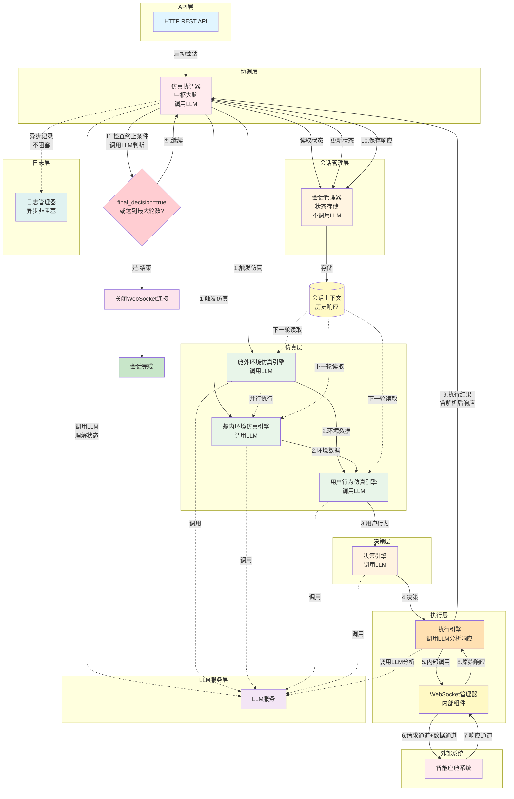
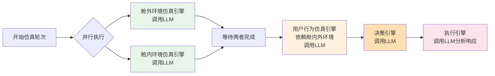
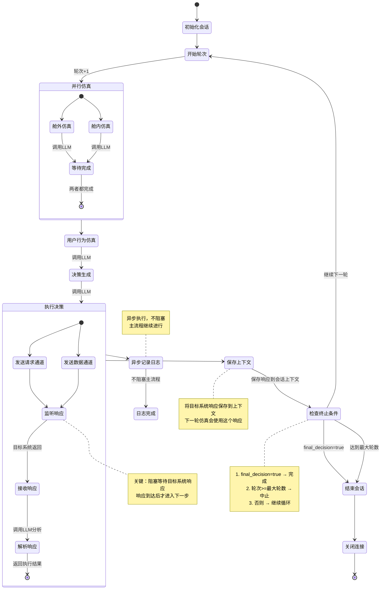

# Design Document: 智能座舱仿真智能体系统

## Overview

智能座舱仿真智能体系统（Cabin Simulation Agent System）是一个独立的仿真系统，用于验证智能座舱系统的功能。该系统采用智能体架构模式，通过多轮交互循环与目标系统进行通信和验证。

### 系统目标

1. 模拟真实的智能座舱使用场景（舱外环境、舱内环境、用户行为）
2. 通过WebSocket双向通信与智能座舱系统交互
3. 支持多轮仿真，自动判断结束条件
4. 记录完整的交互日志用于分析和评估

### 核心设计理念

系统借鉴了成熟的智能体系统架构模式（如 Claude Code、Codex、Gemini-CLI、OpenCode 等代码智能体），采用以下核心设计：

- **多轮交互循环**：通过循环机制与目标系统进行多轮交互，每轮基于前一轮的响应
- **上下文管理**：维护会话状态和历史响应，确保仿真的连续性和一致性
- **决策与执行分离**：决策引擎负责生成决策，执行器负责通信和执行
- **工具调用层**：执行器作为工具调用层，封装WebSocket通信细节
- **模块化架构**：各功能模块独立，通过明确的接口交互
- **LLM驱动智能**：利用大语言模型提供智能决策和分析能力
- **结构化日志**：记录完整交互信息，便于分析和调试
- **错误处理与重试**：自动重连、超时处理、错误分类

### 关键设计模式

本系统借鉴了成熟智能体系统的核心架构模式，并针对座舱仿真场景进行了适配。

#### 1. 多轮交互循环（Agent Loop）

**模式来源**：智能体系统的对话循环机制

**应用方式**：
```
场景触发 → 环境仿真 → 生成决策 → 执行决策 → 监听响应 → 判断终止条件 → 继续或结束
```

**实现要点**：
- 仿真协调器作为循环控制器，协调整个流程
- 每轮仿真包含完整的感知-决策-执行-反馈循环
- 通过 `final_decision` 标志和最大轮数判断是否结束
- 类似代码智能体的主循环（Main Loop）模式

#### 2. 上下文管理（Context Management）

**模式来源**：智能体的会话上下文管理机制

**应用方式**：
- `SessionContext` 保存所有历史响应（`previousResponses`）
- 每轮仿真使用前一轮的响应作为输入
- 上下文包含任务状态、待确认事项等
- 用户行为仿真引擎根据历史响应生成合理行为

**数据结构**：
```typescript
interface SessionContext {
  currentTask?: string;
  taskSteps?: string[];
  pendingConfirmations?: string[];
  previousResponses: SystemResponse[]; // 历史对话
}
```

#### 3. 决策与执行分离（Think-Act Separation）

**模式来源**：智能体的思考与行动分离模式

**应用方式**：
- **决策引擎**：生成决策（"思考"），调用LLM进行推理，不与目标系统通信
- **执行器**：执行决策（"行动"），管理WebSocket连接，与目标系统交互
- 决策引擎输出结构化决策，执行器负责实际通信
- 思考不产生副作用，行动才改变状态

**接口设计**：
```typescript
// 决策引擎：只生成决策，不执行
interface DecisionEngine {
  generateDecision(...): Promise<Decision>;
}

// 执行引擎：接收决策并执行
interface ExecutionEngine {
  execute(decision: Decision): Promise<ExecutionResult>;
}
```

#### 4. 工具调用层（Tool Calling Layer）

**模式来源**：智能体的工具系统抽象

**应用方式**：
- 执行引擎作为工具调用层，封装WebSocket通信细节
- 决策引擎调用执行引擎，类似智能体调用工具
- 执行引擎内部管理连接、重试、错误处理
- 执行结果返回给主循环用于下一轮决策

**封装示例**：
```typescript
// 执行引擎作为工具，对外提供简单接口
interface ExecutionEngine {
  execute(decision: Decision): Promise<ExecutionResult>;
  close(): Promise<void>;
}

// 内部封装复杂的WebSocket管理
class WebSocketManager {
  private connection: WebSocket;
  async sendAndWaitResponse(...): Promise<SystemResponse>;
}
```

#### 5. LLM驱动的智能决策

**模式来源**：智能体的核心能力

**应用方式**：
- 舱外/舱内仿真：使用LLM生成合理的环境变化
- 用户行为仿真：使用LLM根据目标系统响应生成用户行为
- 决策引擎：使用LLM生成决策
- 执行引擎：使用LLM分析目标系统响应

**服务接口**：
```typescript
interface LLMService {
  generateExternalEnvironment(...): Promise<LLMResponse>;
  generateUserBehavior(...): Promise<LLMResponse>;
  generateDecision(...): Promise<LLMResponse>;
  analyzeResponse(...): Promise<LLMResponse>;
}
```

#### 6. 结构化日志与可观测性

**模式来源**：智能体的执行追踪机制

**应用方式**：
- 每轮仿真记录完整的输入、决策、输出
- JSON格式存储，便于查询和分析
- 支持按会话查询和导出
- 用于评估目标系统行为

**日志结构**：
```typescript
interface TurnLog {
  sessionId: string;
  turnId: string;
  timestamp: Date;
  externalEnvironment: ExternalEnvironmentData;
  internalEnvironment: InternalEnvironmentData;
  userBehavior: UserBehaviorData;
  decision: Decision;
  response: SystemResponse;
  executionStatus: 'success' | 'error';
}
```

#### 7. 错误处理与重试机制

**模式来源**：智能体的健壮性设计

**应用方式**：
- WebSocket连接断开自动重连（最多3次）
- LLM调用失败重试
- 执行超时处理
- 错误分类（可重试/不可重试）

**错误处理**：
```typescript
interface ExecutionError {
  code: string;
  message: string;
  retryable: boolean; // 错误分类
}

// WebSocket管理器内部重连逻辑
private async reconnect(): Promise<void> {
  if (this.reconnectAttempts < this.config.maxReconnectAttempts) {
    // 重试逻辑
  }
}
```

#### 8. 并行执行优化

**模式来源**：智能体的并行工具调用

**应用方式**：
- 舱外和舱内仿真并行执行（无依赖关系）
- 用户行为仿真等待环境仿真完成（有依赖关系）
- 使用 `Promise.all` 实现并行处理

**实现示例**：
```typescript
const [externalEnv, internalEnv] = await Promise.all([
  this.externalEnvEngine.generate(...),
  this.internalEnvEngine.generate(...)
]);
```

#### 9. 状态机模式

**模式来源**：智能体的会话状态管理

**应用方式**：
- 会话状态：running, completed, aborted
- 状态转换条件：final_decision, max_turns, user_stop
- 状态机保证仿真流程可控

**状态转换**：
```typescript
interface Session {
  status: 'running' | 'completed' | 'aborted';
}

// 状态转换逻辑
if (response.finalDecision) {
  session.status = 'completed';
} else if (session.turnCount >= session.maxTurns) {
  session.status = 'aborted';
}
```

### 领域特定的设计创新

虽然借鉴了智能体的核心模式，但本系统针对座舱仿真场景有独特设计：

1. **双通道通信**：请求通道+数据通道，适配座舱系统的通信协议
2. **环境仿真**：舱外/舱内环境仿真是领域特定的，模拟真实驾驶场景
3. **用户行为仿真**：模拟用户响应，而非接收真实用户输入
4. **黑盒验证**：目标系统作为黑盒，通过仿真验证其行为正确性

### 核心架构设计

系统采用分层架构，各层职责明确：

**仿真协调器（Simulation Coordinator）**作为系统的中枢大脑，负责：
- 协调整个仿真流程
- 调用LLM理解当前状态
- 决定是否继续下一轮仿真
- 管理各模块的执行顺序

**会话管理器（Session Manager）**作为状态存储，负责：
- 纯粹的状态管理
- 不调用LLM
- 不包含业务逻辑

**决策引擎（Decision Engine）**负责生成具体决策：
- 汇总仿真引擎输出
- 调用LLM生成发送给目标系统的决策
- 不负责元决策（是否继续循环）

**执行引擎（ExecutionEngine）**负责执行决策：
- 管理WebSocket通信
- 调用LLM分析目标系统响应
- 不负责流程控制

这种设计实现了关注点分离：状态、协调、决策、执行各司其职，每个模块的LLM调用都有明确的目的。

## Architecture

### 系统架构概览

系统采用分层架构，从上到下分为：

1. **API层**：HTTP REST API，提供仿真控制接口
2. **协调层**：仿真协调器，作为中枢大脑协调整个流程
3. **会话管理层**：管理仿真会话状态和上下文（纯状态管理）
4. **仿真层**：三个仿真引擎（舱外、舱内并行执行，用户行为依赖舱内外结果）
5. **决策层**：汇总仿真输出并生成决策
6. **执行层**：执行决策并管理与目标系统的通信
7. **日志层**：记录所有交互数据
8. **LLM服务层**：为协调器、仿真引擎、决策引擎和执行引擎提供LLM能力



**完整流程说明：**

0. **协调器启动**：协调器从会话管理器读取状态，调用LLM理解当前状态
1. **触发仿真**：协调器触发舱外和舱内环境仿真（并行执行）
2. **环境数据生成**：舱外和舱内仿真引擎各自调用LLM生成环境数据，完成后传递给用户行为仿真
3. **用户行为生成**：用户行为仿真引擎依赖舱内外环境数据，调用LLM生成用户行为
4. **决策生成**：决策引擎汇总三个仿真引擎输出，调用LLM生成决策
5. **内部调用WebSocket管理器**：执行引擎接收决策，内部调用WebSocket管理器
6. **发送到目标系统**：WebSocket管理器通过请求通道和数据通道发送到目标系统
7. **接收系统响应**：目标系统通过响应通道返回，WebSocket管理器接收
8. **返回原始响应**：WebSocket管理器将原始响应返回给执行器
9. **执行结果返回**：执行器调用LLM分析响应（提取final_decision等关键信息），将执行结果返回给协调器
10. **保存响应到上下文**：协调器通过会话管理器将系统响应保存到会话上下文，供下一轮仿真使用
11. **检查终止条件**：协调器调用LLM判断是否继续（基于final_decision标志、最大轮数、当前状态等），决定继续循环或结束会话
12. **异步日志记录**：日志记录器异步记录每轮数据，不阻塞主循环

**关键设计点：**
- 协调器作为中枢大脑，调用LLM理解状态和决定下一步
- 会话管理器只负责状态存储，不调用LLM
- WebSocket连接管理完全封装在执行引擎内部
- 舱外和舱内仿真并行执行，用户行为仿真依赖两者结果
- 所有需要智能能力的引擎（协调器、仿真引擎、决策引擎、执行引擎）都调用LLM服务
- 日志记录异步进行，不阻塞主决策循环
- 上下文保存历史响应，每轮仿真基于前一轮响应

### 架构设计原则

1. **关注点分离**：每个模块职责单一
   - 协调器：中枢大脑，理解状态、决定下一步
   - 会话管理器：纯状态存储
   - 仿真引擎：生成环境和用户行为数据
   - 决策引擎：生成具体决策
   - 执行引擎：执行决策和通信
2. **封装性**：WebSocket连接管理完全封装在执行引擎内部
3. **并行与依赖**：舱外和舱内仿真并行执行，用户行为仿真依赖两者结果
4. **LLM驱动**：协调器、仿真引擎、决策引擎和执行引擎都通过LLM服务获得智能能力
5. **可测试性**：各模块独立可测，支持模拟和依赖注入
6. **可扩展性**：通过配置和插件机制支持新场景和规则

## Components and Interfaces

### 仿真引擎执行顺序

仿真引擎的执行遵循以下顺序和依赖关系：



**关键点**：
1. 舱外和舱内仿真引擎并行执行，互不依赖
2. 用户行为仿真引擎必须等待舱外和舱内仿真完成后才能执行
3. 用户行为仿真需要舱外和舱内的环境数据作为输入
4. 所有仿真引擎、决策引擎和执行引擎都需要调用LLM服务

### 1. 仿真协调器 (Simulation Coordinator)

**职责**：
- 作为系统的中枢大脑，协调整个仿真流程
- 调用LLM理解当前状态和历史
- 决定是否继续下一轮仿真
- 协调各个模块的执行顺序

**接口**：

```typescript
interface SimulationCoordinator {
  // 执行单轮仿真（调用LLM）
  executeTurn(sessionId: string): Promise<TurnResult>;
  
  // 持续执行直到结束（调用LLM）
  runUntilComplete(sessionId: string): Promise<SessionResult>;
  
  // 分析当前状态并决定下一步（调用LLM）
  analyzeAndDecide(
    session: Session,
    executionResult: ExecutionResult,
    llmService: LLMService
  ): Promise<CoordinationDecision>;
}

interface CoordinationDecision {
  // 是否继续下一轮
  shouldContinue: boolean;
  
  // 决策原因
  reason: 'final_decision' | 'max_turns' | 'user_stop' | 'error' | 'continue';
  
  // 会话状态更新
  sessionStatus: 'running' | 'completed' | 'aborted';
  
  // 上下文更新建议
  contextUpdates?: Partial<SessionContext>;
  
  // LLM的分析结果
  analysis?: {
    currentProgress: string;
    nextStepSuggestion?: string;
    anomalies?: string[];
  };
}

interface TurnResult {
  turnId: string;
  success: boolean;
  externalEnvironment: ExternalEnvironmentData;
  internalEnvironment: InternalEnvironmentData;
  userBehavior: UserBehaviorData;
  decision: Decision;
  executionResult: ExecutionResult;
}

interface SessionResult {
  sessionId: string;
  status: 'completed' | 'aborted';
  totalTurns: number;
  finalDecision: boolean;
  summary?: string; // LLM生成的会话总结
}
```

**协调器的LLM调用场景**：

```typescript
// 1. 理解当前状态
const stateAnalysisPrompt = `
分析当前仿真会话状态：
- 会话ID: ${session.id}
- 当前轮次: ${session.turnCount}
- 历史响应: ${JSON.stringify(session.context.previousResponses)}
- 当前任务: ${session.context.currentTask}

请分析：
1. 当前进度如何？
2. 目标系统的响应是否符合预期？
3. 是否有异常情况？
`;

// 2. 决定是否继续
const continuationDecisionPrompt = `
基于以下信息，决定是否继续下一轮仿真：
- 目标系统返回的finalDecision: ${response.finalDecision}
- 当前轮次: ${session.turnCount}
- 最大轮次: ${session.maxTurns}
- 执行状态: ${executionResult.success ? '成功' : '失败'}
- 历史交互: ${JSON.stringify(session.context.previousResponses)}

请判断：
1. 是否应该继续？
2. 原因是什么？
3. 如果继续，下一轮应该关注什么？
`;
```

### 2. 仿真会话管理器 (Simulation Session Manager)

**职责**：
- 纯粹的状态管理器
- 创建和管理仿真会话
- 维护会话状态和上下文
- 不包含业务逻辑，不调用LLM

**接口**：

```typescript
interface SimulationSessionManager {
  // 创建新会话
  createSession(config: SessionConfig): Session;
  
  // 获取会话
  getSession(sessionId: string): Session | null;
  
  // 更新会话状态
  updateSessionStatus(sessionId: string, status: Session['status']): void;
  
  // 更新会话上下文
  updateContext(sessionId: string, updates: Partial<SessionContext>): void;
  
  // 保存目标系统响应到上下文
  saveResponse(sessionId: string, response: SystemResponse): void;
  
  // 增加轮次计数
  incrementTurnCount(sessionId: string): number;
  
  // 关闭会话
  closeSession(sessionId: string): void;
}

interface SessionConfig {
  scenarioType: string;
  initialState: ScenarioState;
  maxTurns: number;
  websocketConfig: WebSocketConfig;
}

interface Session {
  id: string;
  status: 'running' | 'completed' | 'aborted';
  turnCount: number;
  maxTurns: number;
  context: SessionContext;
  startTime: Date;
  endTime?: Date;
}

interface SessionContext {
  currentTask?: string;
  taskSteps?: string[];
  pendingConfirmations?: string[];
  previousResponses: SystemResponse[];
}
```

### 3. 舱外环境仿真引擎 (ExternalEnvironmentEngine)

**职责**：
- 根据场景配置生成舱外环境数据
- 模拟天气、温度、能见度、路况、周围物体
- 调用LLM服务生成合理的环境变化

**接口**：

```typescript
interface ExternalEnvironmentEngine {
  // 生成舱外环境数据（调用LLM）
  generate(
    scenario: ScenarioState, 
    context: SessionContext,
    llmService: LLMService
  ): Promise<ExternalEnvironmentData>;
}

interface ExternalEnvironmentData {
  module: 'external_environment';
  data: {
    weather: 'sunny' | 'rainy' | 'foggy' | 'snowy' | 'cloudy';
    temperature: number; // 摄氏度
    visibility: number; // 米
    roadCondition: 'dry' | 'wet' | 'icy' | 'snowy';
    surroundingObjects: SurroundingObject[];
  };
}

interface SurroundingObject {
  type: 'vehicle' | 'pedestrian' | 'obstacle' | 'traffic_sign';
  distance: number; // 米
  direction: 'front' | 'back' | 'left' | 'right';
}
```

### 4. 舱内环境仿真引擎 (InternalEnvironmentEngine)

**职责**：
- 根据场景配置生成舱内环境数据
- 模拟车辆状态、座舱状态
- 调用LLM服务生成合理的状态变化

**接口**：

```typescript
interface InternalEnvironmentEngine {
  // 生成舱内环境数据（调用LLM）
  generate(
    scenario: ScenarioState, 
    context: SessionContext,
    llmService: LLMService
  ): Promise<InternalEnvironmentData>;
}

interface InternalEnvironmentData {
  module: 'internal_environment';
  data: {
    seatbelt: 'fastened' | 'unfastened';
    doors: DoorStatus[];
    airConditioner: {
      temperature: number; // 摄氏度
      mode: 'cool' | 'heat' | 'auto' | 'off';
    };
    noiseLevel: number; // 分贝
  };
}

interface DoorStatus {
  position: 'driver' | 'passenger' | 'rear_left' | 'rear_right';
  status: 'open' | 'closed';
}
```

### 5. 用户行为仿真引擎 (UserBehaviorEngine)

**职责**：
- 根据目标系统响应和舱内外环境生成用户行为
- 依赖舱外和舱内仿真引擎的输出
- 处理确认、提供信息、发起新需求等场景
- 调用LLM服务生成合理的用户行为

**接口**：

```typescript
interface UserBehaviorEngine {
  // 生成用户行为数据（依赖舱内外环境，调用LLM）
  generate(
    scenario: ScenarioState,
    context: SessionContext,
    externalEnv: ExternalEnvironmentData,
    internalEnv: InternalEnvironmentData,
    previousResponse: SystemResponse | undefined,
    llmService: LLMService
  ): Promise<UserBehaviorData>;
}

interface UserBehaviorData {
  module: 'user_behavior';
  data: {
    behaviorType: 'voice_command' | 'touch' | 'gesture';
    details: {
      intent: string;
      slots: Record<string, any>;
    };
    isFinal: boolean;
  };
}
```

### 6. 决策引擎 (DecisionEngine)

**职责**：
- 汇总三个仿真引擎的输出
- 根据决策规则生成决策
- 调用LLM服务进行决策推理
- 不直接与目标系统通信

**接口**：

```typescript
interface DecisionEngine {
  // 生成决策（调用LLM）
  generateDecision(
    externalEnv: ExternalEnvironmentData,
    internalEnv: InternalEnvironmentData,
    userBehavior: UserBehaviorData,
    llmService: LLMService
  ): Promise<Decision>;
}

interface Decision {
  // 控制指令（通过请求通道发送）
  control: {
    action: string;
    intent: string;
    command?: string;
  };
  
  // 环境和用户数据（通过数据通道发送）
  data: {
    cabin_external: ExternalEnvironmentData['data'];
    cabin_internal: InternalEnvironmentData['data'];
    user_action: UserBehaviorData['data'];
  };
  
  // 元数据
  metadata: {
    turnId: string;
    timestamp: Date;
  };
}
```

### 7. 执行引擎 (ExecutionEngine)

**职责**：
- 接收决策引擎的输出
- 内部管理WebSocket连接
- 通过双通道发送数据到目标系统
- 接收并解析目标系统响应
- 调用LLM服务进行响应分析和错误处理

**接口**：

```typescript
interface ExecutionEngine {
  // 执行决策（调用LLM进行响应分析）
  execute(decision: Decision, llmService: LLMService): Promise<ExecutionResult>;
  
  // 关闭连接（会话结束时调用）
  close(): Promise<void>;
}

interface ExecutionResult {
  success: boolean;
  response?: SystemResponse;
  error?: ExecutionError;
}

interface SystemResponse {
  status: string;
  message: string;
  data?: any;
  finalDecision: boolean; // 关键字段：是否完成任务
}

interface ExecutionError {
  code: string;
  message: string;
  retryable: boolean;
}
```

**内部组件**：

```typescript
// WebSocket连接管理器（执行引擎内部）
class WebSocketManager {
  private connection: WebSocket | null;
  private config: WebSocketConfig;
  private reconnectAttempts: number;
  
  // 建立连接
  async connect(): Promise<void>;
  
  // 发送请求通道数据
  async sendRequest(control: Decision['control']): Promise<void>;
  
  // 发送数据通道数据
  async sendData(data: Decision['data']): Promise<void>;
  
  // 接收响应
  async receiveResponse(): Promise<SystemResponse>;
  
  // 重连
  private async reconnect(): Promise<void>;
  
  // 关闭连接
  async close(): Promise<void>;
}

interface WebSocketConfig {
  url: string;
  port: number;
  maxReconnectAttempts: number;
  reconnectDelay: number;
  timeout: number;
  heartbeatInterval: number;
}
```

### 8. 日志管理器 (LogManager)

**职责**：
- 异步记录每轮仿真的完整信息（不阻塞主流程）
- 提供日志查询和导出功能

**接口**：

```typescript
interface LogManager {
  // 异步记录单轮日志（不阻塞调用者）
  logTurn(turnLog: TurnLog): void; // 注意：返回void，不需要await
  
  // 查询会话日志
  getSessionLogs(sessionId: string): TurnLog[];
  
  // 导出所有日志
  exportLogs(): Promise<string>; // 返回JSON字符串
}

// 内部实现示例
class AsyncLogManager implements LogManager {
  private logQueue: TurnLog[] = [];
  private isProcessing: boolean = false;
  
  // 立即返回，不阻塞
  logTurn(turnLog: TurnLog): void {
    this.logQueue.push(turnLog);
    
    // 触发异步处理（不等待）
    if (!this.isProcessing) {
      this.processQueue();
    }
  }
  
  // 后台异步处理日志
  private async processQueue(): Promise<void> {
    this.isProcessing = true;
    
    while (this.logQueue.length > 0) {
      const log = this.logQueue.shift()!;
      try {
        // 写入存储（文件、数据库等）
        await this.writeToStorage(log);
      } catch (error) {
        console.error('Failed to write log:', error);
        // 可以选择重试或丢弃
      }
    }
    
    this.isProcessing = false;
  }
  
  private async writeToStorage(log: TurnLog): Promise<void> {
    // 实际的存储逻辑
  }
}

interface TurnLog {
  sessionId: string;
  turnId: string;
  timestamp: Date;
  
  // 仿真引擎输出
  externalEnvironment: ExternalEnvironmentData;
  internalEnvironment: InternalEnvironmentData;
  userBehavior: UserBehaviorData;
  
  // 决策
  decision: Decision;
  
  // 目标系统响应
  response: SystemResponse | null;
  
  // 执行状态
  executionStatus: 'success' | 'error';
  error?: ExecutionError;
}
```

### 9. HTTP API 控制器

**接口**：

```typescript
// POST /api/v1/simulation/start
interface StartSimulationRequest {
  scenarioType: string;
  initialState: ScenarioState;
  maxTurns: number;
}

interface StartSimulationResponse {
  sessionId: string;
  status: string;
  currentTurn: number;
}

// GET /api/v1/simulation/{session_id}
interface GetSessionResponse {
  sessionId: string;
  status: 'running' | 'completed' | 'aborted';
  turnCount: number;
  maxTurns: number;
  startTime: string;
  endTime?: string;
}

// POST /api/v1/simulation/{session_id}/run
interface RunSimulationResponse {
  sessionId: string;
  status: 'completed' | 'aborted';
  totalTurns: number;
  finalDecision: boolean;
}

// GET /api/v1/simulation/{session_id}/logs
interface GetLogsResponse {
  sessionId: string;
  logs: TurnLog[];
}
```

### 10. LLM服务 (LLM Service)

**职责**：
- 为所有需要智能能力的模块提供LLM调用接口
- 管理LLM提供商连接（OpenAI、Anthropic等）
- 处理提示词模板和上下文管理
- 实现重试和错误处理机制

**接口**：

```typescript
interface LLMService {
  // 为协调器分析会话状态
  analyzeSessionState(
    prompt: SessionStatePrompt
  ): Promise<LLMResponse<SessionStateAnalysis>>;
  
  // 为协调器生成会话总结
  generateSessionSummary(
    prompt: SessionSummaryPrompt
  ): Promise<LLMResponse<string>>;
  
  // 为舱外环境仿真生成数据
  generateExternalEnvironment(
    prompt: EnvironmentPrompt,
    context: SessionContext
  ): Promise<LLMResponse<ExternalEnvironmentData['data']>>;
  
  // 为舱内环境仿真生成数据
  generateInternalEnvironment(
    prompt: EnvironmentPrompt,
    context: SessionContext
  ): Promise<LLMResponse<InternalEnvironmentData['data']>>;
  
  // 为用户行为仿真生成数据
  generateUserBehavior(
    prompt: UserBehaviorPrompt,
    externalEnv: ExternalEnvironmentData,
    internalEnv: InternalEnvironmentData,
    previousResponse: SystemResponse | undefined,
    context: SessionContext
  ): Promise<LLMResponse<UserBehaviorData['data']>>;
  
  // 为决策引擎生成决策
  generateDecision(
    prompt: DecisionPrompt,
    externalEnv: ExternalEnvironmentData,
    internalEnv: InternalEnvironmentData,
    userBehavior: UserBehaviorData,
    context: SessionContext
  ): Promise<LLMResponse<Decision>>;
  
  // 为执行引擎分析响应
  analyzeResponse(
    prompt: ResponseAnalysisPrompt,
    response: SystemResponse,
    context: SessionContext
  ): Promise<LLMResponse<ResponseAnalysis>>;
}

interface SessionStatePrompt {
  sessionId: string;
  turnCount: number;
  maxTurns: number;
  currentResponse: SystemResponse;
  previousResponses: SystemResponse[];
  currentTask?: string;
}

interface SessionStateAnalysis {
  currentProgress: string;
  nextStepSuggestion?: string;
  anomalies?: string[];
}

interface SessionSummaryPrompt {
  sessionId: string;
  totalTurns: number;
  status: 'completed' | 'aborted';
  allResponses: SystemResponse[];
}

interface LLMResponse<T> {
  success: boolean;
  data?: T;
  error?: LLMError;
  usage?: {
    promptTokens: number;
    completionTokens: number;
    totalTokens: number;
  };
}

interface LLMError {
  code: string;
  message: string;
  retryable: boolean;
}

interface EnvironmentPrompt {
  scenario: ScenarioState;
  turnNumber: number;
  previousState?: any;
}

interface UserBehaviorPrompt {
  scenario: ScenarioState;
  turnNumber: number;
  externalEnvironment: ExternalEnvironmentData['data'];
  internalEnvironment: InternalEnvironmentData['data'];
  previousResponse?: SystemResponse;
  conversationHistory: string[];
}

interface DecisionPrompt {
  scenario: ScenarioState;
  turnNumber: number;
  externalEnvironment: ExternalEnvironmentData['data'];
  internalEnvironment: InternalEnvironmentData['data'];
  userBehavior: UserBehaviorData['data'];
  decisionRules: DecisionRule[];
}

interface ResponseAnalysisPrompt {
  decision: Decision;
  response: SystemResponse;
  expectedBehavior?: string;
}

interface ResponseAnalysis {
  finalDecision: boolean;
  requiresUserAction: boolean;
  suggestedNextAction?: string;
  anomalies?: string[];
}

interface DecisionRule {
  condition: string;
  action: string;
  priority: number;
}
```

**LLM提供商配置**：

```typescript
interface LLMConfig {
  provider: 'openai' | 'anthropic' | 'custom';
  apiKey: string;
  model: string;
  temperature: number;
  maxTokens: number;
  timeout: number;
  retryAttempts: number;
  retryDelay: number;
}
```

**提示词模板示例**：

```typescript
// 协调器：会话状态分析提示词
const SESSION_STATE_ANALYSIS_PROMPT = `
你是一个智能座舱仿真系统的协调器。
分析当前仿真会话的状态和进度。

会话信息：
- 会话ID: {sessionId}
- 当前轮次: {turnCount}/{maxTurns}
- 当前任务: {currentTask}

目标系统最新响应：
{currentResponse}

历史响应：
{previousResponses}

请分析：
1. 当前仿真进度如何？任务是否按预期进行？
2. 目标系统的响应是否符合预期？
3. 是否存在异常情况或需要关注的问题？
4. 如果继续下一轮，应该关注什么？

返回JSON格式：
{
  "currentProgress": "进度描述",
  "nextStepSuggestion": "下一步建议",
  "anomalies": ["异常1", "异常2"]
}
`;

// 协调器：会话总结提示词
const SESSION_SUMMARY_PROMPT = `
你是一个智能座舱仿真系统的协调器。
为完成的仿真会话生成总结报告。

会话信息：
- 会话ID: {sessionId}
- 总轮次: {totalTurns}
- 最终状态: {status}

所有交互历史：
{allResponses}

请生成一份简洁的总结报告，包括：
1. 仿真场景和目标
2. 主要交互过程
3. 目标系统的表现评估
4. 是否达成预期目标
5. 发现的问题或改进建议
`;

// 舱外环境仿真提示词
const EXTERNAL_ENV_PROMPT = `
你是一个智能座舱仿真系统的舱外环境仿真引擎。
根据以下场景配置和上下文，生成合理的舱外环境数据。

场景类型: {scenarioType}
当前轮次: {turnNumber}
上一轮状态: {previousState}

请生成包含以下字段的JSON数据：
- weather: 天气状态
- temperature: 温度（摄氏度）
- visibility: 能见度（米）
- roadCondition: 路况
- surroundingObjects: 周围物体列表

确保生成的数据符合真实场景逻辑。
`;

// 用户行为仿真提示词
const USER_BEHAVIOR_PROMPT = `
你是一个智能座舱仿真系统的用户行为仿真引擎。
根据目标系统的响应和当前环境，生成合理的用户行为。

目标系统上一轮响应: {previousResponse}
舱外环境: {externalEnvironment}
舱内环境: {internalEnvironment}
对话历史: {conversationHistory}

请分析目标系统的响应类型：
- 如果目标系统要求确认，生成确认或否定的用户行为
- 如果目标系统询问信息，生成提供信息的用户行为
- 如果目标系统执行完成，生成下一个需求或结束信号

生成包含以下字段的JSON数据：
- behaviorType: 行为类型（voice_command/touch/gesture）
- details: 行为详情（intent和slots）
- isFinal: 是否为最终行为
`;

// 决策引擎提示词
const DECISION_PROMPT = `
你是一个智能座舱仿真系统的决策引擎。
根据仿真引擎的输出，生成发送给目标系统的决策。

舱外环境: {externalEnvironment}
舱内环境: {internalEnvironment}
用户行为: {userBehavior}
决策规则: {decisionRules}

请生成包含以下字段的JSON数据：
- control: 控制指令（action, intent, command）
- data: 环境和用户数据

确保决策符合决策规则和场景逻辑。
`;
```

## Data Models

### 多轮仿真循环流程

多轮仿真是系统的核心机制，通过监听目标系统响应并根据响应内容决定是否进入下一轮。

#### 循环流程设计



#### 循环控制逻辑

```typescript
class SimulationCoordinator implements SimulationCoordinator {
  constructor(
    private sessionManager: SimulationSessionManager,
    private externalEnvEngine: ExternalEnvironmentEngine,
    private internalEnvEngine: InternalEnvironmentEngine,
    private userBehaviorEngine: UserBehaviorEngine,
    private decisionEngine: DecisionEngine,
    private executionEngine: ExecutionEngine,
    private logManager: LogManager,
    private llmService: LLMService
  ) {}
  
  async runUntilComplete(sessionId: string): Promise<SessionResult> {
    const session = this.sessionManager.getSession(sessionId);
    if (!session) {
      throw new Error(`Session ${sessionId} not found`);
    }
    
    while (session.status === 'running') {
      // 执行单轮仿真
      const turnResult = await this.executeTurn(sessionId);
      
      // 调用LLM分析并决定是否继续
      const decision = await this.analyzeAndDecide(
        session,
        turnResult.executionResult,
        this.llmService
      );
      
      // 更新会话状态
      this.sessionManager.updateSessionStatus(sessionId, decision.sessionStatus);
      
      // 如果有上下文更新建议，应用它们
      if (decision.contextUpdates) {
        this.sessionManager.updateContext(sessionId, decision.contextUpdates);
      }
      
      // 检查是否应该结束
      if (!decision.shouldContinue) {
        session.endTime = new Date();
        break;
      }
    }
    
    // 关闭WebSocket连接
    await this.executionEngine.close();
    
    // 生成会话总结（调用LLM）
    const summary = await this.generateSessionSummary(session);
    
    return {
      sessionId,
      status: session.status,
      totalTurns: session.turnCount,
      finalDecision: session.context.previousResponses[
        session.context.previousResponses.length - 1
      ]?.finalDecision || false,
      summary
    };
  }
  
  async executeTurn(sessionId: string): Promise<TurnResult> {
    const session = this.sessionManager.getSession(sessionId)!;
    
    // 1. 增加轮次计数
    const turnCount = this.sessionManager.incrementTurnCount(sessionId);
    const turnId = `turn-${turnCount}`;
    
    // 2. 并行执行舱外和舱内仿真（调用LLM）
    const [externalEnv, internalEnv] = await Promise.all([
      this.externalEnvEngine.generate(
        session.scenario,
        session.context,
        this.llmService
      ),
      this.internalEnvEngine.generate(
        session.scenario,
        session.context,
        this.llmService
      )
    ]);
    
    // 3. 用户行为仿真（依赖舱内外环境，调用LLM）
    const previousResponse = session.context.previousResponses[
      session.context.previousResponses.length - 1
    ];
    const userBehavior = await this.userBehaviorEngine.generate(
      session.scenario,
      session.context,
      externalEnv,
      internalEnv,
      previousResponse,
      this.llmService
    );
    
    // 4. 决策生成（调用LLM）
    const decision = await this.decisionEngine.generateDecision(
      externalEnv,
      internalEnv,
      userBehavior,
      this.llmService
    );
    
    // 5. 执行决策（调用LLM分析响应）
    const executionResult = await this.executionEngine.execute(
      decision,
      this.llmService
    );
    
    // 6. 异步记录日志（不阻塞）
    this.logManager.logTurn({
      sessionId,
      turnId,
      timestamp: new Date(),
      externalEnvironment: externalEnv,
      internalEnvironment: internalEnv,
      userBehavior,
      decision,
      response: executionResult.response || null,
      executionStatus: executionResult.success ? 'success' : 'error',
      error: executionResult.error
    });
    
    // 7. 保存响应到会话上下文
    if (executionResult.success && executionResult.response) {
      this.sessionManager.saveResponse(sessionId, executionResult.response);
    }
    
    return {
      turnId,
      success: executionResult.success,
      externalEnvironment: externalEnv,
      internalEnvironment: internalEnv,
      userBehavior,
      decision,
      executionResult
    };
  }
  
  async analyzeAndDecide(
    session: Session,
    executionResult: ExecutionResult,
    llmService: LLMService
  ): Promise<CoordinationDecision> {
    // 1. 检查执行错误
    if (!executionResult.success) {
      return {
        shouldContinue: false,
        reason: 'error',
        sessionStatus: 'aborted'
      };
    }
    
    const response = executionResult.response!;
    
    // 2. 调用LLM分析当前状态
    const analysisPrompt = {
      sessionId: session.id,
      turnCount: session.turnCount,
      maxTurns: session.maxTurns,
      currentResponse: response,
      previousResponses: session.context.previousResponses,
      currentTask: session.context.currentTask
    };
    
    const analysis = await llmService.analyzeSessionState(analysisPrompt);
    
    // 3. 基于LLM分析和规则决定是否继续
    if (response.finalDecision === true) {
      return {
        shouldContinue: false,
        reason: 'final_decision',
        sessionStatus: 'completed',
        analysis: analysis.data
      };
    }
    
    if (session.turnCount >= session.maxTurns) {
      return {
        shouldContinue: false,
        reason: 'max_turns',
        sessionStatus: 'aborted',
        analysis: analysis.data
      };
    }
    
    // 4. 继续下一轮
    return {
      shouldContinue: true,
      reason: 'continue',
      sessionStatus: 'running',
      analysis: analysis.data,
      contextUpdates: {
        // 可以基于LLM分析更新上下文
        currentTask: response.data?.currentTask || session.context.currentTask
      }
    };
  }
  
  private async generateSessionSummary(session: Session): Promise<string> {
    const summaryPrompt = {
      sessionId: session.id,
      totalTurns: session.turnCount,
      status: session.status,
      allResponses: session.context.previousResponses
    };
    
    const summary = await this.llmService.generateSessionSummary(summaryPrompt);
    return summary.data || '会话已完成';
  }
}
```

#### 响应监听机制

执行器内部的WebSocket管理器实现响应监听：

```typescript
class WebSocketManager {
  private responseQueue: SystemAResponse[] = [];
  private responseWaiters: Array<(response: SystemAResponse) => void> = [];
  
  constructor(config: WebSocketConfig) {
    this.setupWebSocket();
  }
  
  private setupWebSocket() {
    this.connection = new WebSocket(this.config.url);
    
    // 监听响应通道消息
    this.connection.on('message', (data: string) => {
      const message = JSON.parse(data);
      
      if (message.channel === 'response') {
        const response: SystemAResponse = {
          status: message.status,
          message: message.message,
          data: message.data,
          finalDecision: message.finalDecision
        };
        
        // 如果有等待者，立即通知
        if (this.responseWaiters.length > 0) {
          const waiter = this.responseWaiters.shift()!;
          waiter(response);
        } else {
          // 否则放入队列
          this.responseQueue.push(response);
        }
      }
    });
  }
  
  // 阻塞等待响应
  async waitForResponse(timeout: number = 30000): Promise<SystemAResponse> {
    // 如果队列中有响应，立即返回
    if (this.responseQueue.length > 0) {
      return this.responseQueue.shift()!;
    }
    
    // 否则等待新响应
    return new Promise((resolve, reject) => {
      const timer = setTimeout(() => {
        const index = this.responseWaiters.indexOf(resolve);
        if (index > -1) {
          this.responseWaiters.splice(index, 1);
        }
        reject(new Error('Response timeout'));
      }, timeout);
      
      this.responseWaiters.push((response) => {
        clearTimeout(timer);
        resolve(response);
      });
    });
  }
  
  async sendAndWaitResponse(
    control: Decision['control'],
    data: Decision['data']
  ): Promise<SystemAResponse> {
    // 发送请求通道和数据通道
    await this.sendRequest(control);
    await this.sendData(data);
    
    // 阻塞等待响应（关键：这里会等待目标系统返回）
    const response = await this.waitForResponse();
    
    return response;
  }
}
```

#### 上下文传递机制

```typescript
interface SessionContext {
  currentTask?: string;
  taskSteps?: string[];
  pendingConfirmations?: string[];
  
  // 关键：保存所有历史响应
  previousResponses: SystemResponse[];
  
  // 当前轮次使用的响应（指向最后一个）
  get currentResponse(): SystemResponse | undefined {
    return this.previousResponses[this.previousResponses.length - 1];
  }
}

// 更新上下文
updateContext(sessionId: string, response: SystemResponse): void {
  const session = this.sessions.get(sessionId);
  if (session) {
    // 将新响应添加到历史中
    session.context.previousResponses.push(response);
    
    // 更新任务状态
    if (response.data?.currentTask) {
      session.context.currentTask = response.data.currentTask;
    }
    if (response.data?.taskSteps) {
      session.context.taskSteps = response.data.taskSteps;
    }
  }
}
```

#### 终止条件判断

```typescript
interface TerminationCheck {
  shouldTerminate: boolean;
  reason: 'final_decision' | 'max_turns' | 'user_stop' | 'error';
  status: 'completed' | 'aborted';
}

function checkTermination(
  session: Session,
  response: SystemResponse,
  executionResult: ExecutionResult
): TerminationCheck {
  // 1. 检查执行错误
  if (!executionResult.success) {
    return {
      shouldTerminate: true,
      reason: 'error',
      status: 'aborted'
    };
  }
  
  // 2. 检查目标系统最终决定
  if (response.finalDecision === true) {
    return {
      shouldTerminate: true,
      reason: 'final_decision',
      status: 'completed'
    };
  }
  
  // 3. 检查最大轮数
  if (session.turnCount >= session.maxTurns) {
    return {
      shouldTerminate: true,
      reason: 'max_turns',
      status: 'aborted'
    };
  }
  
  // 4. 检查用户停止
  if (session.userStopRequested) {
    return {
      shouldTerminate: true,
      reason: 'user_stop',
      status: 'aborted'
    };
  }
  
  // 5. 继续循环
  return {
    shouldTerminate: false,
    reason: null,
    status: 'running'
  };
}
```

### 场景配置 (Scenario)

```typescript
interface Scenario {
  id: string;
  name: string;
  type: string;
  description: string;
  initialState: ScenarioState;
  expectedBehaviors?: ExpectedBehavior[];
}

interface ScenarioState {
  external: {
    weather: string;
    temperature: number;
    visibility: number;
    roadCondition: string;
    surroundingObjects: SurroundingObject[];
  };
  internal: {
    seatbelt: string;
    doors: DoorStatus[];
    airConditioner: {
      temperature: number;
      mode: string;
    };
    noiseLevel: number;
  };
  user: {
    initialIntent: string;
    initialSlots: Record<string, any>;
  };
}

interface ExpectedBehavior {
  turn: number;
  expectedAction: string;
  expectedResponse: string;
}
```

### 会话数据持久化

会话数据存储在内存中（可选持久化到数据库）：

```typescript
interface SessionStore {
  sessions: Map<string, Session>;
  logs: Map<string, TurnLog[]>;
}
```

### WebSocket消息格式

**请求通道消息**：

```json
{
  "channel": "request",
  "type": "control",
  "data": {
    "action": "navigate",
    "intent": "set_destination",
    "command": "navigate_to_location"
  },
  "metadata": {
    "sessionId": "session-123",
    "turnId": "turn-1",
    "timestamp": "2024-01-01T00:00:00Z"
  }
}
```

**数据通道消息**：

```json
{
  "channel": "data",
  "type": "environment_and_user",
  "data": {
    "cabin_external": {
      "weather": "sunny",
      "temperature": 25,
      "visibility": 1000,
      "roadCondition": "dry",
      "surroundingObjects": []
    },
    "cabin_internal": {
      "seatbelt": "fastened",
      "doors": [],
      "airConditioner": {
        "temperature": 22,
        "mode": "auto"
      },
      "noiseLevel": 45
    },
    "user_action": {
      "behaviorType": "voice_command",
      "details": {
        "intent": "navigate",
        "slots": {
          "destination": "北京"
        }
      },
      "isFinal": false
    }
  },
  "metadata": {
    "sessionId": "session-123",
    "turnId": "turn-1",
    "timestamp": "2024-01-01T00:00:00Z"
  }
}
```

**响应通道消息**：

```json
{
  "channel": "response",
  "status": "success",
  "message": "导航已设置",
  "data": {
    "route": "...",
    "estimatedTime": "30分钟"
  },
  "finalDecision": false,
  "metadata": {
    "sessionId": "session-123",
    "turnId": "turn-1",
    "timestamp": "2024-01-01T00:00:01Z"
  }
}
```

