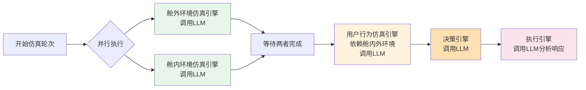
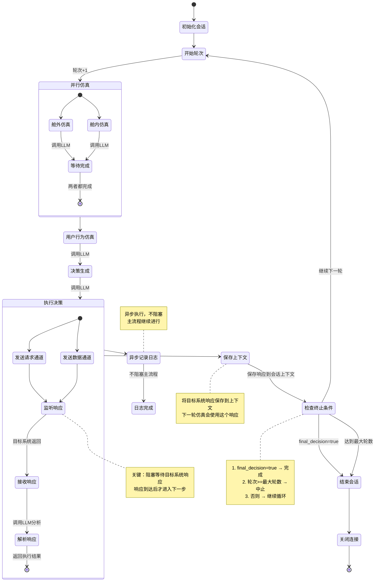

# Design Document: 智能座舱仿真智能体系统

## Overview

智能座舱仿真智能体系统（Cabin Simulation Agent System）是一个独立的仿真系统，用于验证智能座舱系统的功能。该系统采用智能体架构模式，通过多轮交互循环与目标系统进行通信和验证。

### 系统目标

1. 模拟真实的智能座舱使用场景（舱外环境、舱内环境、用户行为）
2. 通过WebSocket双向通信与智能座舱系统交互
3. 支持多轮仿真，自动判断结束条件
4. 记录完整的交互日志用于分析和评估

### 核心设计理念

系统借鉴了成熟的智能体系统架构模式（如 Claude Code、Codex、Gemini-CLI、OpenCode 等代码智能体），采用以下核心设计：

- **多轮交互循环**：通过循环机制与目标系统进行多轮交互，每轮基于前一轮的响应
- **上下文管理**：维护会话状态和历史响应，确保仿真的连续性和一致性
- **决策与执行分离**：决策引擎负责生成决策，执行器负责通信和执行
- **工具调用层**：执行器作为工具调用层，封装WebSocket通信细节
- **模块化架构**：各功能模块独立，通过明确的接口交互
- **LLM驱动智能**：利用大语言模型提供智能决策和分析能力
- **结构化日志**：记录完整交互信息，便于分析和调试
- **错误处理与重试**：自动重连、超时处理、错误分类

### 关键设计模式

本系统借鉴了成熟智能体系统的核心架构模式，并针对座舱仿真场景进行了适配。

#### 1. 多轮交互循环（Agent Loop）

**模式来源**：智能体系统的对话循环机制

**应用方式**：
```
场景触发 → 环境仿真 → 生成决策 → 执行决策 → 监听响应 → 判断终止条件 → 继续或结束
```

**实现要点**：
- 仿真协调器作为循环控制器，协调整个流程
- 每轮仿真包含完整的感知-决策-执行-反馈循环
- 通过 `final_decision` 标志和最大轮数判断是否结束
- 类似代码智能体的主循环（Main Loop）模式

#### 2. 上下文管理（Context Management）

**模式来源**：智能体的会话上下文管理机制

**应用方式**：
- `SessionContext` 保存所有历史响应（`previousResponses`）
- 每轮仿真使用前一轮的响应作为输入
- 上下文包含任务状态、待确认事项等
- 用户行为仿真引擎根据历史响应生成合理行为

**数据结构**：
```typescript
interface SessionContext {
  currentTask?: string;
  taskSteps?: string[];
  pendingConfirmations?: string[];
  previousResponses: SystemResponse[]; // 历史对话
}
```

#### 3. 决策与执行分离（Think-Act Separation）

**模式来源**：智能体的思考与行动分离模式

**应用方式**：
- **决策引擎**：生成决策（"思考"），调用LLM进行推理，不与目标系统通信
- **执行器**：执行决策（"行动"），管理WebSocket连接，与目标系统交互
- 决策引擎输出结构化决策，执行器负责实际通信
- 思考不产生副作用，行动才改变状态

**接口设计**：
```typescript
// 决策引擎：只生成决策，不执行
interface DecisionEngine {
  generateDecision(...): Promise<Decision>;
}

// 执行引擎：接收决策并执行
interface ExecutionEngine {
  execute(decision: Decision): Promise<ExecutionResult>;
}
```

#### 4. 工具调用层（Tool Calling Layer）

**模式来源**：智能体的工具系统抽象

**应用方式**：
- 执行引擎作为工具调用层，封装WebSocket通信细节
- 决策引擎调用执行引擎，类似智能体调用工具
- 执行引擎内部管理连接、重试、错误处理
- 执行结果返回给主循环用于下一轮决策

**封装示例**：
```typescript
// 执行引擎作为工具，对外提供简单接口
interface ExecutionEngine {
  execute(decision: Decision): Promise<ExecutionResult>;
  close(): Promise<void>;
}

// 内部封装复杂的WebSocket管理
class WebSocketManager {
  private connection: WebSocket;
  async sendAndWaitResponse(...): Promise<SystemResponse>;
}
```

#### 5. LLM驱动的智能决策

**模式来源**：智能体的核心能力

**应用方式**：
- 舱外/舱内仿真：使用LLM生成合理的环境变化
- 用户行为仿真：使用LLM根据目标系统响应生成用户行为
- 决策引擎：使用LLM生成决策
- 执行引擎：使用LLM分析目标系统响应

**服务接口**：
```typescript
interface LLMService {
  generateExternalEnvironment(...): Promise<LLMResponse>;
  generateUserBehavior(...): Promise<LLMResponse>;
  generateDecision(...): Promise<LLMResponse>;
  analyzeResponse(...): Promise<LLMResponse>;
}
```

#### 6. 结构化日志与可观测性

**模式来源**：智能体的执行追踪机制

**应用方式**：
- 每轮仿真记录完整的输入、决策、输出
- JSON格式存储，便于查询和分析
- 支持按会话查询和导出
- 用于评估目标系统行为

**日志结构**：
```typescript
interface TurnLog {
  sessionId: string;
  turnId: string;
  timestamp: Date;
  externalEnvironment: ExternalEnvironmentData;
  internalEnvironment: InternalEnvironmentData;
  userBehavior: UserBehaviorData;
  decision: Decision;
  response: SystemResponse;
  executionStatus: 'success' | 'error';
}
```

#### 7. 错误处理与重试机制

**模式来源**：智能体的健壮性设计

**应用方式**：
- WebSocket连接断开自动重连（最多3次）
- LLM调用失败重试
- 执行超时处理
- 错误分类（可重试/不可重试）

**错误处理**：
```typescript
interface ExecutionError {
  code: string;
  message: string;
  retryable: boolean; // 错误分类
}

// WebSocket管理器内部重连逻辑
private async reconnect(): Promise<void> {
  if (this.reconnectAttempts < this.config.maxReconnectAttempts) {
    // 重试逻辑
  }
}
```

#### 8. 并行执行优化

**模式来源**：智能体的并行工具调用

**应用方式**：
- 舱外和舱内仿真并行执行（无依赖关系）
- 用户行为仿真等待环境仿真完成（有依赖关系）
- 使用 `Promise.all` 实现并行处理

**实现示例**：
```typescript
const [externalEnv, internalEnv] = await Promise.all([
  this.externalEnvEngine.generate(...),
  this.internalEnvEngine.generate(...)
]);
```

#### 9. 状态机模式

**模式来源**：智能体的会话状态管理

**应用方式**：
- 会话状态：running, completed, aborted
- 状态转换条件：final_decision, max_turns, user_stop
- 状态机保证仿真流程可控

**状态转换**：
```typescript
interface Session {
  status: 'running' | 'completed' | 'aborted';
}

// 状态转换逻辑
if (response.finalDecision) {
  session.status = 'completed';
} else if (session.turnCount >= session.maxTurns) {
  session.status = 'aborted';
}
```

### 领域特定的设计创新

虽然借鉴了智能体的核心模式，但本系统针对座舱仿真场景有独特设计：

1. **双通道通信**：请求通道+数据通道，适配座舱系统的通信协议
2. **环境仿真**：舱外/舱内环境仿真是领域特定的，模拟真实驾驶场景
3. **用户行为仿真**：模拟用户响应，而非接收真实用户输入
4. **黑盒验证**：目标系统作为黑盒，通过仿真验证其行为正确性

## Technology Stack

### Pure Python Architecture

本系统采用纯 Python 实现，使用成熟的 Python 生态系统和异步编程实现高性能仿真系统。

**核心设计原则**：
- **简化部署**：单一语言栈，无需多语言工具链
- **快速迭代**：Python 的动态特性便于快速开发和调试
- **成熟生态**：利用 Python 丰富的库和框架
- **异步高性能**：使用 asyncio 实现高并发处理

#### Technology Stack

**核心框架**：
- **FastAPI**：高性能异步 Web 框架，提供 REST API
- **asyncio**：Python 原生异步编程支持
- **websockets**：异步 WebSocket 客户端库
- **aiohttp**：异步 HTTP 客户端（用于 LLM 调用）

**LLM 集成**：
- **OpenAI Python SDK**：官方 Python 客户端
- **Anthropic Python SDK**：官方 Python 客户端
- **LangChain**（可选）：LLM 应用开发框架

**数据处理**：
- **Pydantic**：数据验证和序列化
- **orjson**：高性能 JSON 序列化
- **pandas**（可选）：数据分析和评测

**并发与性能**：
- **asyncio**：异步 I/O 和并发控制
- **aiofiles**：异步文件操作
- **uvloop**（可选）：高性能事件循环

**日志与监控**：
- **structlog**：结构化日志
- **prometheus_client**（可选）：性能指标

**测试**：
- **pytest**：单元测试框架
- **pytest-asyncio**：异步测试支持
- **hypothesis**：属性测试框架

#### Architecture Pattern (Pure Python)

```
┌─────────────────────────────────────────────────────────────────────────────┐
│                       Python Application (iota)                              │
│                                                                               │
│  ┌─────────────────────────────────────────────────────────────────────┐    │
│  │  CLI Entry Point                                                    │    │
│  │  - Parse command line arguments                                     │    │
│  │  - Load configuration (TOML/JSON)                                   │    │
│  │  - Initialize application components                                │    │
│  │  - Start FastAPI server                                             │    │
│  └─────────────────────────────────────────────────────────────────────┘    │
│                                                                               │
│  ┌─────────────────────────────────────────────────────────────────────┐    │
│  │  HTTP API Server (FastAPI)                                          │    │
│  │  - REST endpoints: /api/simulation/start, /api/simulation/status    │    │
│  │  - WebSocket endpoint: /ws (optional, for real-time updates)        │    │
│  │  - Health check: /health                                            │    │
│  │  - Async request handling                                           │    │
│  └─────────────────────────────────────────────────────────────────────┘    │
│                                                                               │
│  ┌─────────────────────────────────────────────────────────────────────┐    │
│  │  LLM Service Layer                                                   │    │
│  │  - OpenAI SDK integration (async)                                   │    │
│  │  - Anthropic SDK integration (async)                                │    │
│  │  - Prompt template management                                       │    │
│  │  - Response streaming support                                       │    │
│  │  - Token usage tracking                                             │    │
│  └─────────────────────────────────────────────────────────────────────┘    │
│                                                                               │
│  ┌─────────────────────────────────────────────────────────────────────┐    │
│  │  Simulation Orchestration & Engines                                 │    │
│  │  - SimulationCoordinator (async orchestration)                      │    │
│  │  - EnvironmentPerceptionSimulation (calls LLM)                      │    │
│  │  - UserStateSimulation (calls LLM)                                  │    │
│  │  - UserBehaviorSimulation (calls LLM)                               │    │
│  │  - DecisionEngine (calls LLM)                                       │    │
│  │  - All components use asyncio for concurrency                       │    │
│  └─────────────────────────────────────────────────────────────────────┘    │
│                                                                               │
│  ┌─────────────────────────────────────────────────────────────────────┐    │
│  │  Core Runtime Components                                            │    │
│  │                                                                       │    │
│  │  ┌──────────────────────┐  ┌──────────────────────────────────┐    │    │
│  │  │  WebSocket Manager   │  │  Session Manager                 │    │    │
│  │  │  - websockets lib    │  │  - In-memory dict/cache          │    │    │
│  │  │  - Async connection  │  │  - Thread-safe access (asyncio)  │    │    │
│  │  │  - Auto-reconnect    │  │  - Session state management      │    │    │
│  │  │  - Heartbeat         │  │  - CRUD operations               │    │    │
│  │  └──────────────────────┘  └──────────────────────────────────┘    │    │
│  │                                                                       │    │
│  │  ┌──────────────────────┐  ┌──────────────────────────────────┐    │    │
│  │  │  Log Manager         │  │  Evaluation Engine               │    │    │
│  │  │  - structlog         │  │  - Async computation             │    │    │
│  │  │  - Async file I/O    │  │  - Metrics calculation           │    │    │
│  │  │  - JSON format       │  │  - Score aggregation             │    │    │
│  │  │  - Non-blocking      │  │  - Pandas (optional)             │    │    │
│  │  └──────────────────────┘  └──────────────────────────────────┘    │    │
│  │                                                                       │    │
│  └─────────────────────────────────────────────────────────────────────┘    │
│                                                                               │
│  ┌─────────────────────────────────────────────────────────────────────┐    │
│  │  Data Models (Pydantic)                                              │    │
│  │  - Type-safe data structures                                        │    │
│  │  - Automatic validation                                             │    │
│  │  - JSON serialization/deserialization                               │    │
│  │  - Schema generation                                                │    │
│  └─────────────────────────────────────────────────────────────────────┘    │
│                                                                               │
└─────────────────────────────────────────────────────────────────────────────┘
                                      │
                                      │ WebSocket Connection
                                      │ Async I/O
                                      ▼
                              ┌───────────────────┐
                              │  Target System    │
                              │  (智能座舱系统)    │
                              └───────────────────┘
```

**架构说明**：

1. **单一进程架构**：
   - 所有组件运行在同一个 Python 进程中
   - 使用 asyncio 实现高并发异步处理
   - 无需进程间通信开销

2. **FastAPI 服务器**：
   - 提供 REST API 接口
   - 异步请求处理
   - 自动生成 OpenAPI 文档
   - 内置数据验证（Pydantic）

3. **LLM 服务层**：
   - 直接集成 OpenAI/Anthropic SDK
   - 异步调用，支持并发
   - 统一的提示词管理
   - 流式响应支持

4. **仿真协调器和引擎**：
   - 所有业务逻辑在 Python 中实现
   - 使用 asyncio 实现并发执行
   - 直接调用 LLM 服务层

5. **核心运行时组件**：
   - WebSocket Manager：使用 websockets 库，异步连接管理
   - Session Manager：内存字典，asyncio 保证线程安全
   - Log Manager：structlog + aiofiles，异步日志
   - Evaluation Engine：纯 Python 实现，可选 pandas 加速

6. **数据模型**：
   - Pydantic 提供类型安全和自动验证
   - 自动 JSON 序列化/反序列化
   - 生成 JSON Schema

#### Integration Strategy (Pure Python with Asyncio)

**Async Programming Model**：
- 使用 asyncio 作为核心并发模型
- 所有 I/O 操作（WebSocket、HTTP、文件）都是异步的
- 使用 async/await 语法编写异步代码
- 事件循环管理所有异步任务

**Component Integration**：
- 所有组件在同一进程中，直接函数调用
- 无需序列化/反序列化开销
- 共享内存，数据传递高效
- 使用 Pydantic 模型保证类型安全

**Example Integration**：

```python
# Main application entry point
import asyncio
from fastapi import FastAPI
from contextlib import asynccontextmanager

from iota.core.session_manager import SessionManager
from iota.core.websocket_manager import WebSocketManager
from iota.core.log_manager import LogManager
from iota.llm.service import LLMService
from iota.simulation.coordinator import SimulationCoordinator
from iota.simulation.engines import (
    EnvironmentPerceptionSimulation,
    UserStateSimulation,
    UserBehaviorSimulation
)

# Global components
session_manager = SessionManager()
websocket_manager = WebSocketManager()
log_manager = LogManager()
llm_service = LLMService()

@asynccontextmanager
async def lifespan(app: FastAPI):
    # Startup
    await log_manager.start()
    yield
    # Shutdown
    await log_manager.stop()
    await websocket_manager.close_all()

app = FastAPI(lifespan=lifespan)

# API endpoints
@app.post("/api/simulation/start")
async def start_simulation(config: SimulationConfig):
    # Create session
    session = session_manager.create_session(config)
    
    # Create coordinator
    coordinator = SimulationCoordinator(
        session_manager=session_manager,
        websocket_manager=websocket_manager,
        log_manager=log_manager,
        llm_service=llm_service
    )
    
    # Run simulation in background
    asyncio.create_task(coordinator.run_until_complete(session.id))
    
    return {"session_id": session.id, "status": "started"}

@app.get("/api/simulation/{session_id}/status")
async def get_status(session_id: str):
    session = session_manager.get_session(session_id)
    if not session:
        raise HTTPException(status_code=404, detail="Session not found")
    return session.to_dict()

# Simulation Coordinator
class SimulationCoordinator:
    def __init__(
        self,
        session_manager: SessionManager,
        websocket_manager: WebSocketManager,
        log_manager: LogManager,
        llm_service: LLMService
    ):
        self.session_manager = session_manager
        self.websocket_manager = websocket_manager
        self.log_manager = log_manager
        self.llm_service = llm_service
        
        # Create simulation engines
        self.env_engine = EnvironmentPerceptionSimulation(llm_service)
        self.user_state_engine = UserStateSimulation(llm_service)
        self.behavior_engine = UserBehaviorSimulation(llm_service)
    
    async def run_until_complete(self, session_id: str):
        session = self.session_manager.get_session(session_id)
        
        while session.status == 'running':
            # Execute one turn
            turn_result = await self.execute_turn(session_id)
            
            # Analyze and decide
            decision = await self.analyze_and_decide(session, turn_result)
            
            # Update session status
            self.session_manager.update_status(session_id, decision.session_status)
            
            if not decision.should_continue:
                break
        
        # Close WebSocket connection
        await self.websocket_manager.close(session.websocket_id)
    
    async def execute_turn(self, session_id: str):
        session = self.session_manager.get_session(session_id)
        
        # Parallel execution of environment simulations
        env_data, user_state_data = await asyncio.gather(
            self.env_engine.generate(session.scenario, session.context),
            self.user_state_engine.generate(session.scenario, session.context)
        )
        
        # User behavior simulation (depends on environment)
        behavior_data = await self.behavior_engine.generate(
            env_data, user_state_data, session.context
        )
        
        # Send to target system via WebSocket
        response = await self.websocket_manager.send_and_receive(
            session.websocket_id,
            behavior_data
        )
        
        # Async logging (non-blocking)
        asyncio.create_task(self.log_manager.log_turn({
            'session_id': session_id,
            'env_data': env_data,
            'user_state_data': user_state_data,
            'behavior_data': behavior_data,
            'response': response
        }))
        
        # Save response to context
        session.context.previous_responses.append(response)
        
        return TurnResult(
            env_data=env_data,
            user_state_data=user_state_data,
            behavior_data=behavior_data,
            response=response
        )

# WebSocket Manager
class WebSocketManager:
    def __init__(self):
        self.connections: Dict[str, websockets.WebSocketClientProtocol] = {}
    
    async def connect(self, url: str) -> str:
        connection_id = str(uuid.uuid4())
        ws = await websockets.connect(url)
        self.connections[connection_id] = ws
        return connection_id
    
    async def send_and_receive(self, connection_id: str, data: dict) -> dict:
        ws = self.connections.get(connection_id)
        if not ws:
            raise ValueError(f"Connection {connection_id} not found")
        
        # Send data
        await ws.send(json.dumps(data))
        
        # Receive response
        response_str = await ws.recv()
        return json.loads(response_str)
    
    async def close(self, connection_id: str):
        ws = self.connections.pop(connection_id, None)
        if ws:
            await ws.close()
    
    async def close_all(self):
        for ws in self.connections.values():
            await ws.close()
        self.connections.clear()

# LLM Service
class LLMService:
    def __init__(self):
        self.openai_client = AsyncOpenAI()
        self.anthropic_client = AsyncAnthropic()
    
    async def generate(self, prompt: str, model: str = "gpt-4") -> str:
        if model.startswith("gpt"):
            response = await self.openai_client.chat.completions.create(
                model=model,
                messages=[{"role": "user", "content": prompt}]
            )
            return response.choices[0].message.content
        elif model.startswith("claude"):
            response = await self.anthropic_client.messages.create(
                model=model,
                messages=[{"role": "user", "content": prompt}]
            )
            return response.content[0].text
        else:
            raise ValueError(f"Unsupported model: {model}")

# Log Manager (Async)
class LogManager:
    def __init__(self):
        self.log_queue = asyncio.Queue()
        self.worker_task = None
    
    async def start(self):
        self.worker_task = asyncio.create_task(self._process_logs())
    
    async def stop(self):
        await self.log_queue.put(None)  # Sentinel
        if self.worker_task:
            await self.worker_task
    
    async def log_turn(self, log_data: dict):
        await self.log_queue.put(log_data)
    
    async def _process_logs(self):
        async with aiofiles.open('simulation.log', 'a') as f:
            while True:
                log_data = await self.log_queue.get()
                if log_data is None:  # Sentinel
                    break
                
                log_line = json.dumps(log_data) + '\n'
                await f.write(log_line)
                await f.flush()
```

### Agent Runtime Engine: "iota"

系统的核心运行时引擎命名为 **iota**，参考以下项目的实现模式：

#### Reference Implementations

| Project | Language | Key Patterns |
|---------|----------|--------------|
| claude-code | TypeScript | Query engine, tool system, session management |
| opencode | TypeScript | LLM integration, prompt engineering, async patterns |
| gemini-cli | TypeScript | Streaming, context management |

#### iota Runtime Architecture

**Core Responsibilities**：
- **Session Lifecycle**: 创建、运行、暂停、恢复、终止会话
- **Tool Execution**: 工具调用、权限检查、结果收集
- **Context Management**: 上下文构建、压缩、持久化
- **Stream Processing**: 流式响应处理、增量更新
- **Error Handling**: 错误分类、重试策略、降级处理

**Design Principles (from reference projects)**：

1. **Modular Tool System** (claude-code pattern)
   - 每个工具独立实现
   - 统一的工具接口
   - 动态工具注册

2. **Config Hierarchy** (opencode pattern)
   - 全局配置 (`~/.iota/config.toml`)
   - 项目配置 (`.iota/config.toml`)
   - 运行时覆盖 (`--config` flags)

3. **Streaming First** (gemini-cli pattern)
   - 所有 LLM 调用默认流式
   - 增量渲染
   - 取消支持

4. **Prompt Engineering** (opencode pattern)
   - 系统提示词模板
   - 上下文注入
   - Few-shot examples

5. **Async-First Design** (Python best practices)
   - 所有 I/O 操作异步化
   - 使用 asyncio 事件循环
   - 并发任务管理

#### iota Module Structure (Pure Python)

```
iota/
├── __init__.py
├── __main__.py              # CLI entry point
│
├── cli/                     # Command-line interface
│   ├── __init__.py
│   ├── main.py             # CLI commands (Click/Typer)
│   └── config.py           # Configuration loading
│
├── api/                     # HTTP API server
│   ├── __init__.py
│   ├── app.py              # FastAPI application
│   ├── routes/
│   │   ├── __init__.py
│   │   ├── simulation.py   # /api/simulation/* endpoints
│   │   └── health.py       # /health endpoint
│   └── models.py           # Pydantic request/response models
│
├── llm/                     # LLM service layer
│   ├── __init__.py
│   ├── service.py          # LLM service interface
│   ├── providers/
│   │   ├── __init__.py
│   │   ├── openai.py       # OpenAI integration
│   │   └── anthropic.py    # Anthropic integration
│   ├── prompts/            # Prompt templates
│   │   ├── __init__.py
│   │   ├── environment.py
│   │   ├── user_state.py
│   │   └── behavior.py
│   └── streaming.py        # Streaming response handling
│
├── simulation/              # Simulation runtime
│   ├── __init__.py
│   ├── coordinator.py      # Simulation coordinator
│   ├── engines/            # Simulation engines
│   │   ├── __init__.py
│   │   ├── environment.py  # Environment perception
│   │   ├── user_state.py   # User state simulation
│   │   ├── behavior.py     # User behavior simulation
│   │   └── memory.py       # Long-short term memory
│   ├── decision.py         # Decision engine
│   └── scenario.py         # Scenario initialization
│
├── core/                    # Core runtime components
│   ├── __init__.py
│   ├── session_manager.py  # Session state management
│   ├── websocket_manager.py # WebSocket connection management
│   ├── log_manager.py      # Async logging
│   └── evaluation.py       # Evaluation engine
│
├── models/                  # Data models (Pydantic)
│   ├── __init__.py
│   ├── session.py          # Session models
│   ├── scenario.py         # Scenario models
│   ├── environment.py      # Environment data models
│   ├── user.py             # User state models
│   └── behavior.py         # Behavior models
│
├── utils/                   # Utilities
│   ├── __init__.py
│   ├── async_helpers.py    # Async utility functions
│   └── json_utils.py       # JSON serialization helpers
│
└── config/                  # Configuration files
    ├── default.toml        # Default configuration
    └── schema.json         # JSON schema for validation
```

**模块说明**：

1. **CLI (`cli/`)**：
   - 使用 Click 或 Typer 实现命令行接口
   - 配置加载和验证
   - 启动 FastAPI 服务器

2. **API (`api/`)**：
   - FastAPI 应用和路由
   - Pydantic 模型用于请求/响应验证
   - 异步请求处理

3. **LLM Service (`llm/`)**：
   - 统一的 LLM 服务接口
   - 多个 LLM 提供商支持（OpenAI, Anthropic）
   - 提示词模板管理
   - 流式响应处理

4. **Simulation Runtime (`simulation/`)**：
   - 仿真协调器：编排整个仿真流程
   - 仿真引擎：环境、用户状态、行为、记忆
   - 决策引擎：生成决策
   - 场景初始化：设置初始状态

5. **Core Components (`core/`)**：
   - Session Manager：会话状态管理（内存字典）
   - WebSocket Manager：WebSocket 连接管理（websockets 库）
   - Log Manager：异步日志（structlog + aiofiles）
   - Evaluation Engine：评测计算

6. **Data Models (`models/`)**：
   - Pydantic 模型定义
   - 类型安全和自动验证
   - JSON 序列化/反序列化

#### Performance Optimization Strategy

**Async I/O for Concurrency**：
- 使用 asyncio 实现高并发
- 所有 I/O 操作（WebSocket、HTTP、文件）异步化
- 并行执行独立任务（环境仿真、用户状态仿真）
- 事件循环高效管理多个连接

**Memory Efficiency**：
- 使用生成器和迭代器减少内存占用
- LLM 流式响应避免大量内存分配
- 及时清理不再使用的会话数据

**JSON Serialization**：
- 使用 orjson 替代标准 json 库（5-10x 性能提升）
- Pydantic 模型自动序列化/反序列化
- 避免重复序列化

**Caching Strategy**：
- 使用 functools.lru_cache 缓存频繁调用的函数
- 缓存 LLM 提示词模板
- 可选：使用 Redis 缓存会话状态（分布式部署）

**Connection Pooling**：
- WebSocket 连接复用
- HTTP 客户端连接池（aiohttp）
- 数据库连接池（如果使用数据库）

**Profiling and Monitoring**：
- 使用 cProfile 或 py-spy 进行性能分析
- 使用 prometheus_client 导出性能指标
- 使用 structlog 记录性能关键点

#### Build & Deployment (Pure Python)

**Development**：
```bash
# Create virtual environment
python -m venv venv
source venv/bin/activate  # On Windows: venv\Scripts\activate

# Install dependencies
pip install -e ".[dev]"

# Run application
python -m iota start --config config.toml

# Or use CLI
iota start --config config.toml

# Run tests
pytest tests/

# Run with auto-reload (development)
uvicorn iota.api.app:app --reload --port 8000
```

**Production**：
```bash
# Install production dependencies
pip install -e .

# Run with uvicorn (production server)
uvicorn iota.api.app:app --host 0.0.0.0 --port 8000 --workers 4

# Or use gunicorn with uvicorn workers
gunicorn iota.api.app:app -w 4 -k uvicorn.workers.UvicornWorker --bind 0.0.0.0:8000

# Run as systemd service
sudo systemctl start iota
```

**Docker Deployment**：
```dockerfile
FROM python:3.11-slim

WORKDIR /app

# Install dependencies
COPY requirements.txt ./
RUN pip install --no-cache-dir -r requirements.txt

# Copy application code
COPY iota/ ./iota/
COPY config/ ./config/

# Expose port
EXPOSE 8000

# Run application
CMD ["uvicorn", "iota.api.app:app", "--host", "0.0.0.0", "--port", "8000"]
```

**Docker Compose**：
```yaml
version: '3.8'

services:
  iota:
    build: .
    ports:
      - "8000:8000"
    environment:
      - OPENAI_API_KEY=${OPENAI_API_KEY}
      - ANTHROPIC_API_KEY=${ANTHROPIC_API_KEY}
    volumes:
      - ./config:/app/config
      - ./logs:/app/logs
    restart: unless-stopped
```

**Key Points**：
- 单一 Python 环境，无需多语言工具链
- 使用 pip 或 poetry 管理依赖
- 支持虚拟环境隔离
- 使用 uvicorn 或 gunicorn 作为生产服务器
- 支持 Docker 容器化部署
- 配置通过环境变量或配置文件

### 核心架构设计

系统采用分层架构，各层职责明确：

**仿真协调器（Simulation Coordinator）**作为系统的中枢大脑，负责：
- 协调整个仿真流程
- 调用LLM理解当前状态
- 决定是否继续下一轮仿真
- 管理各模块的执行顺序

**会话管理器（Session Manager）**作为状态存储，负责：
- 纯粹的状态管理
- 不调用LLM
- 不包含业务逻辑

**决策引擎（Decision Engine）**负责生成具体决策：
- 汇总仿真引擎输出
- 调用LLM生成发送给目标系统的决策
- 不负责元决策（是否继续循环）

**执行引擎（ExecutionEngine）**负责执行决策：
- 管理WebSocket通信
- 调用LLM分析目标系统响应
- 不负责流程控制

这种设计实现了关注点分离：状态、协调、决策、执行各司其职，每个模块的LLM调用都有明确的目的。

## 仿真主循环详细设计

### 循环拓扑与参考实现

本系统的仿真主循环借鉴了成熟智能体系统的闭环设计模式，特别参考了以下实现：

- **Claude Code (TypeScript)**: 单核 `queryLoop` 模式，所有逻辑集中在一个 while(true) 循环
- **Codex (Rust)**: 四层分治架构，submission_loop → run_turn → run_sampling_request → try_run_sampling_request
- **Gemini CLI (TypeScript)**: 跨层闭环，三层异步生成器 + UI hook 层完成闭合
- **OpenCode (TypeScript)**: 双层循环 + SQLite 持久化，支持 crash 后 resume

### 主循环架构选择

基于座舱仿真的特点，本系统采用**双层循环 + 状态驱动**模式：

```python
# 外层循环：会话级控制
async def run_until_complete(self, session_id: str):
    """运行仿真直到完成（外层循环）"""
    session = self.session_manager.get_session(session_id)
    
    while session.status == 'running':
        # 执行一轮仿真（内层循环）
        turn_result = await self.execute_turn(session_id)
        
        # 分析并决策是否继续
        decision = await self.analyze_and_decide(session, turn_result)
        
        # 更新会话状态
        self.session_manager.update_status(session_id, decision.session_status)
        
        # 判断是否继续
        if not decision.should_continue:
            break
        
        # 增加轮次计数
        session.turn_count += 1
    
    # 关闭 WebSocket 连接
    await self.websocket_manager.close(session.websocket_id)

# 内层循环：单轮执行
async def execute_turn(self, session_id: str) -> TurnResult:
    """执行单轮仿真（内层循环）"""
    session = self.session_manager.get_session(session_id)
    
    # 1. 并行获取输入支撑模块数据
    env_data, user_state_data = await asyncio.gather(
        self.env_engine.generate(session.scenario, session.context),
        self.user_state_engine.generate(session.scenario, session.context)
    )
    
    # 2. 获取记忆上下文
    memory_data = await self.memory_module.get_context(session_id)
    
    # 3. 生成用户行为
    behavior_data = await self.behavior_engine.generate(
        env_data, user_state_data, memory_data, session.context
    )
    
    # 4. 调用目标系统
    response = await self.websocket_manager.send_and_receive(
        session.websocket_id,
        behavior_data
    )
    
    # 5. 评测量化
    evaluation = await self.evaluation_engine.evaluate(
        behavior_data, response, env_data, user_state_data
    )
    
    # 6. 更新反馈链路（异步，不阻塞主流程）
    asyncio.create_task(self._update_feedback_chains(
        session_id, response, behavior_data, evaluation
    ))
    
    # 7. 异步日志记录
    asyncio.create_task(self.log_manager.log_turn({
        'session_id': session_id,
        'turn_id': f'turn-{session.turn_count}',
        'timestamp': datetime.now(),
        'env_data': env_data,
        'user_state_data': user_state_data,
        'behavior_data': behavior_data,
        'response': response,
        'evaluation': evaluation,
        'execution_status': 'success'
    }))
    
    # 8. 保存响应到上下文
    session.context.previous_responses.append(response)
    
    return TurnResult(
        env_data=env_data,
        user_state_data=user_state_data,
        behavior_data=behavior_data,
        response=response,
        evaluation=evaluation
    )
```

### 下一轮判断详细实现

#### 判断时机与输入

在每轮仿真执行完成后（`execute_turn` 返回后），编排器调用 `analyze_and_decide` 方法进行判断。判断依据包括：

1. **目标系统响应**：`response.completion_flag` 是否为 True
2. **评测结果**：行为合理性、响应准确性等指标
3. **轮次约束**：`session.turn_count` vs `session.max_turns`
4. **上下文状态**：任务完成度、待确认事项
5. **LLM 智能分析**：综合判断当前状态

#### 判断逻辑实现

```python
class SimulationOrchestrator:
    async def analyze_and_decide(
        self, 
        session: Session, 
        turn_result: TurnResult
    ) -> Decision:
        """
        分析当前轮结果并决定是否继续
        
        判断策略（优先级从高到低）：
        1. 硬性终止条件检查（最大轮次、用户中断）
        2. 目标系统完成标志检查
        3. LLM 智能判断（基于响应、评测、上下文）
        """
        
        # 1. 硬性终止条件：达到最大轮次
        if session.turn_count >= session.max_turns:
            await self.log_manager.log_decision({
                'session_id': session.id,
                'turn_count': session.turn_count,
                'decision': 'abort',
                'reason': '达到最大轮次限制',
                'max_turns': session.max_turns
            })
            return Decision(
                should_continue=False,
                reason=f"达到最大轮次限制 ({session.max_turns})",
                session_status="aborted",
                confidence=1.0
            )
        
        # 2. 目标系统完成标志检查
        if turn_result.response.completion_flag:
            await self.log_manager.log_decision({
                'session_id': session.id,
                'turn_count': session.turn_count,
                'decision': 'complete',
                'reason': '目标系统返回任务完成标志'
            })
            return Decision(
                should_continue=False,
                reason="目标系统返回任务完成",
                session_status="completed",
                confidence=1.0
            )
        
        # 3. 调用 LLM 进行智能判断
        llm_decision = await self._llm_based_decision(
            session, turn_result
        )
        
        # 4. 记录决策日志
        await self.log_manager.log_decision({
            'session_id': session.id,
            'turn_count': session.turn_count,
            'decision': 'continue' if llm_decision.should_continue else 'stop',
            'reason': llm_decision.reason,
            'confidence': llm_decision.confidence,
            'llm_analysis': llm_decision.analysis
        })
        
        return llm_decision
    
    async def _llm_based_decision(
        self,
        session: Session,
        turn_result: TurnResult
    ) -> Decision:
        """使用 LLM 进行智能决策"""
        
        # 构建决策提示词
        prompt = self._build_decision_prompt(
            response=turn_result.response,
            evaluation=turn_result.evaluation,
            context=session.context,
            turn_count=session.turn_count,
            max_turns=session.max_turns
        )
        
        # 调用 LLM
        llm_response = await self.llm_service.generate(
            prompt=prompt,
            model=self.config.decision_model,
            temperature=0.3,  # 较低温度，保证决策稳定性
            max_tokens=500
        )
        
        # 解析 LLM 响应
        try:
            parsed = json.loads(llm_response)
            return Decision(
                should_continue=parsed['should_continue'],
                reason=parsed['reason'],
                session_status='running' if parsed['should_continue'] else 'completed',
                confidence=parsed.get('confidence', 0.8),
                analysis=parsed.get('analysis', '')
            )
        except (json.JSONDecodeError, KeyError) as e:
            # LLM 响应解析失败，默认继续（保守策略）
            self.logger.warning(f"Failed to parse LLM decision: {e}")
            return Decision(
                should_continue=True,
                reason="LLM 响应解析失败，默认继续",
                session_status='running',
                confidence=0.5
            )
    
    def _build_decision_prompt(
        self,
        response: SystemResponse,
        evaluation: EvaluationMetrics,
        context: SessionContext,
        turn_count: int,
        max_turns: int
    ) -> str:
        """构建决策提示词"""
        
        # 历史响应摘要
        history_summary = self._summarize_previous_responses(
            context.previous_responses[-5:]  # 最近5轮
        )
        
        return f"""你是智能座舱仿真系统的决策引擎。请分析当前轮次的执行结果，判断是否应该继续下一轮仿真。

## 当前状态
- 当前轮次: {turn_count}/{max_turns}
- 任务: {context.current_task or "未明确"}
- 任务步骤: {context.task_steps or "无"}
- 待确认事项: {context.pending_confirmations or "无"}

## 目标系统响应
- 响应状态: {response.response_status}
- 响应内容: {response.response_content}
- 完成标志: {response.completion_flag}
- 需要用户操作: {response.requires_user_action}
- 建议下一步: {response.suggested_next_action or "无"}

## 评测结果
- 行为合理性: {evaluation.behavior_rationality.score}/100
  - 问题: {evaluation.behavior_rationality.issues or "无"}
- 响应准确性: {evaluation.response_accuracy.score}/100
  - 问题: {evaluation.response_accuracy.issues or "无"}
- 场景覆盖率: {evaluation.scenario_coverage.score}/100
  - 已覆盖: {len(evaluation.scenario_coverage.covered_scenarios)}
  - 未覆盖: {len(evaluation.scenario_coverage.uncovered_scenarios)}
- 响应实时性: {evaluation.response_timeliness.score}/100
  - 总延迟: {evaluation.response_timeliness.metrics.total_latency}ms
- 综合评分: {evaluation.overall_score}/100

## 历史响应摘要（最近5轮）
{history_summary}

## 判断标准
1. **应该结束的情况**：
   - 目标系统明确表示任务完成（completion_flag=True）
   - 用户意图已经完全满足（所有待确认事项已处理）
   - 出现循环对话或无进展（连续3轮响应内容高度相似）
   - 评测结果显示严重异常（综合评分 < 30）
   - 接近最大轮次限制（剩余轮次 < 2）

2. **应该继续的情况**：
   - 仍有待确认事项或任务未完成
   - 目标系统建议了下一步操作
   - 评测结果正常（综合评分 >= 60）
   - 场景覆盖率仍有提升空间
   - 用户交互流程尚未完整

3. **特殊情况处理**：
   - 如果评测结果显示响应不准确但任务未完成，应该继续验证
   - 如果出现循环但综合评分较高，可能是正常的多轮确认流程
   - 如果接近最大轮次但任务即将完成，优先完成任务

## 输出格式
请以 JSON 格式返回决策，必须包含以下字段：
{{
  "should_continue": true/false,
  "reason": "决策理由（简洁明确，50字以内）",
  "confidence": 0.0-1.0,
  "analysis": "详细分析（可选，200字以内）"
}}

请仅返回 JSON，不要包含其他内容。"""
    
    def _summarize_previous_responses(
        self,
        responses: List[SystemResponse]
    ) -> str:
        """生成历史响应摘要"""
        if not responses:
            return "无历史响应"
        
        summary_lines = []
        for i, resp in enumerate(responses, 1):
            summary_lines.append(
                f"轮次 {i}: {resp.response_status} - "
                f"{resp.response_content[:50]}{'...' if len(resp.response_content) > 50 else ''}"
            )
        
        return "\n".join(summary_lines)
```

#### 循环检测机制

参考 Gemini CLI 的循环检测实现，本系统实现了简单的循环检测：

```python
class LoopDetector:
    """循环检测器"""
    
    def __init__(self, threshold: int = 3):
        self.threshold = threshold
        self.response_history: List[str] = []
    
    def check_loop(self, response: SystemResponse) -> bool:
        """
        检测是否出现循环
        
        策略：检查最近 N 轮响应内容的相似度
        如果连续 threshold 轮响应内容高度相似（相似度 > 0.9），判定为循环
        """
        # 提取响应内容的关键特征
        content_hash = self._hash_response(response)
        self.response_history.append(content_hash)
        
        # 只保留最近 threshold * 2 轮
        if len(self.response_history) > self.threshold * 2:
            self.response_history = self.response_history[-(self.threshold * 2):]
        
        # 检查最近 threshold 轮是否相同
        if len(self.response_history) >= self.threshold:
            recent = self.response_history[-self.threshold:]
            if len(set(recent)) == 1:  # 所有哈希值相同
                return True
        
        return False
    
    def _hash_response(self, response: SystemResponse) -> str:
        """计算响应内容的哈希值"""
        # 简化版：只考虑响应状态和内容的前100个字符
        content = f"{response.response_status}:{response.response_content[:100]}"
        return hashlib.md5(content.encode()).hexdigest()
```

#### 错误恢复策略

```python
class SimulationOrchestrator:
    async def execute_turn_with_retry(
        self,
        session_id: str,
        max_retries: int = 3
    ) -> TurnResult:
        """带重试的单轮执行"""
        
        for attempt in range(max_retries):
            try:
                return await self.execute_turn(session_id)
            except WebSocketError as e:
                if attempt < max_retries - 1:
                    # 指数退避
                    delay = min(2 ** attempt, 10)  # 最多等待10秒
                    await asyncio.sleep(delay)
                    
                    # 尝试重连
                    session = self.session_manager.get_session(session_id)
                    await self.websocket_manager.reconnect(session.websocket_id)
                else:
                    raise
            except LLMError as e:
                if e.is_retryable and attempt < max_retries - 1:
                    delay = min(2 ** attempt, 10)
                    await asyncio.sleep(delay)
                else:
                    raise
```

### 关键设计要点

1. **分层决策**：
   - 硬性条件（最大轮次、完成标志）优先检查
   - LLM 智能判断作为补充
   - 循环检测作为安全网

2. **上下文感知**：
   - 考虑历史响应，避免循环对话
   - 考虑任务进度和待确认事项
   - 考虑评测结果的综合评分

3. **可解释性**：
   - 每个决策都有明确的 reason
   - 记录完整的决策日志
   - LLM 提供详细分析

4. **灵活性**：
   - 支持配置不同的终止条件
   - 支持手动干预（用户停止）
   - 支持动态调整最大轮次

5. **健壮性**：
   - LLM 响应解析失败时的降级策略
   - WebSocket 和 LLM 调用的重试机制
   - 循环检测防止无限循环

## Architecture

### 系统架构概览

系统采用分层架构，严格遵循 requirements.md 中定义的四层结构和五条关键链路：

#### 四层架构

1. **干预层（Intervention Layer）**：
   - 仿真场景初始化（Scenario Initialization）
   - 突发噪声（Sudden Noise）

2. **输入支撑模块（Input Support Modules）**：
   - 环境感知仿真（Environment Perception Simulation）
   - 用户状态仿真（User State Simulation）
   - 长短期记忆模块（Long-Short Term Memory Module）

3. **上层决策编排层（Upper Decision Orchestration Layer）**：
   - 仿真编排决策器（Simulation Orchestration Decision Maker）
   - 内部能力：情景理解&推理、需求解析&挖掘、长期规划&短期策略、用户意图推演

4. **下层执行反馈层（Lower Execution Feedback Layer）**：
   - 用户行为仿真（User Behavior Simulation）
   - 目标系统调用与响应解析（Target System Call and Response Parsing）
   - 评测量化（Evaluation and Quantification）

#### 五条关键链路

1. **仿真主链路（Main Simulation Chain）**：
   - 场景初始化 → 输入支撑模块 → 编排决策 → 行为执行 → 目标系统调用 → 评测量化

2. **环境 & 用户反馈链路（Environment & User Feedback Chain）**：
   - 目标系统响应 → 环境感知仿真
   - 目标系统响应 → 用户状态仿真

3. **量化评估链路（Quantitative Evaluation Chain）**：
   - 用户行为 → 评测量化
   - 目标系统响应 → 评测量化

4. **记忆更新链路（Memory Update Chain）**：
   - 用户行为 → 长短期记忆
   - 评测量化 → 长短期记忆

5. **噪声扰动链路（Noise Disturbance Chain）**：
   - 突发噪声 → 环境感知仿真
   - 突发噪声 → 用户状态仿真

#### 技术实现层

在四层架构之上，系统还包含以下技术支撑层：

- **API层**：HTTP REST API，提供仿真控制接口
- **会话管理层**：管理仿真会话状态和上下文（纯状态管理）
- **日志层**：记录所有交互数据
- **LLM服务层**：为Python业务逻辑提供LLM能力

```mermaid
graph TB
    subgraph Python进程_iota运行时
        API[HTTP API Server<br/>FastAPI]
        
        subgraph 干预层_Python
            SceneInit[仿真场景初始化<br/>Python]
            Noise[突发噪声<br/>Python]
        end
        
        subgraph 输入支撑模块_Python
            Env[环境感知仿真<br/>Python]
            UserState[用户状态仿真<br/>Python]
            Memory[长短期记忆模块<br/>Python]
        end
        
        subgraph 上层决策编排层_Python
            Orchestrator[仿真编排决策器<br/>Python<br/><br/>内部能力：<br/>情景理解&推理<br/>需求解析&挖掘<br/>长期规划&短期策略<br/>用户意图推演<br/><br/>包含：继续/结束判断]
        end
        
        subgraph 下层执行反馈层_Python
            Behavior[用户行为仿真<br/>Python]
            ServiceCall[目标系统调用与响应解析<br/>Python WebSocket管理]
            Eval[评测量化<br/>Python 异步计算]
        end
        
        subgraph 技术支撑层_Python
            SessionMgr[会话管理器<br/>Python asyncio]
            LogManager[日志管理器<br/>Python structlog]
            ContextStore[(会话上下文<br/>Python 内存)]
        end
        
        subgraph LLM服务_Python
            OpenAI[OpenAI SDK]
            Anthropic[Anthropic SDK]
        end
    end
    
    subgraph 外部系统
        Client[客户端<br/>HTTP请求]
        TargetSystem[目标系统服务<br/>智能座舱系统]
    end
    
    %% HTTP API 入口（红色 #d9485f）
    Client -->|00 HTTP POST /api/simulation/start| API
    API -->|01 创建会话并启动仿真| Orchestrator
    
    %% 主链路（红色 #d9485f）
    Orchestrator -->|02 启动初始化| SceneInit
    SceneInit -->|03 初始化环境| Env
    SceneInit -->|04 初始化用户| UserState
    SceneInit -->|05 初始化记忆| Memory
    
    Env -->|06 环境上下文| Orchestrator
    UserState -->|07 用户上下文| Orchestrator
    Memory -->|08 记忆上下文| Orchestrator
    
    Orchestrator -->|09 策略意图| Behavior
    Behavior -->|10 行为请求| ServiceCall
    ServiceCall -->|11 WebSocket请求| TargetSystem
    TargetSystem -->|12 返回响应| ServiceCall
    ServiceCall -->|13 结构化响应| Orchestrator
    
    %% 环境&用户反馈链路（蓝色虚线 #2563eb）
    ServiceCall -.->|14 反馈环境| Env
    ServiceCall -.->|15 反馈用户| UserState
    
    %% 量化评估链路（蓝色虚线 #2563eb）
    Behavior -.->|16 行为评估| Eval
    ServiceCall -.->|17 响应评估| Eval
    
    %% 记忆更新链路（蓝色虚线 #2563eb）
    Behavior -.->|18 行为写回| Memory
    Eval -.->|19 评估写回| Memory
    
    %% 噪声扰动链路（蓝色虚线 #2563eb）
    Noise -.->|20 噪声入环境| Env
    Noise -.->|21 噪声入用户| UserState
    
    %% 评估回编排（红色 #d9485f）
    Eval -->|22 评估结果| Orchestrator
    
    %% Orchestrator内部判断是否继续（红色 #d9485f）
    Orchestrator -->|23 判断：继续下一轮| Env
    Orchestrator -->|24 判断：结束会话| API
    API -->|25 返回结果| Client
    
    %% 技术支撑（蓝色虚线 #2563eb）
    Orchestrator <-.->|状态管理| SessionMgr
    SessionMgr <-.->|存储| ContextStore
    Orchestrator -.->|异步日志| LogManager
    
    %% LLM调用（紫色虚线 #9c27b0，加粗表示调用LLM）
    Orchestrator -.->|LLM调用| OpenAI
    Orchestrator -.->|LLM调用| Anthropic
    Env -.->|LLM调用| OpenAI
    Env -.->|LLM调用| Anthropic
    UserState -.->|LLM调用| OpenAI
    UserState -.->|LLM调用| Anthropic
    Behavior -.->|LLM调用| OpenAI
    Behavior -.->|LLM调用| Anthropic
    
    %% 所有组件 - 浅蓝色背景 #e3f2fd（纯Python架构）
    style API fill:#e3f2fd,stroke:#1976d2,stroke-width:2px
    style SceneInit fill:#e3f2fd,stroke:#1976d2,stroke-width:2px
    style Noise fill:#e3f2fd,stroke:#1976d2,stroke-width:2px
    style Memory fill:#e3f2fd,stroke:#1976d2,stroke-width:2px
    style Behavior fill:#e3f2fd,stroke:#1976d2,stroke-width:2px
    style ServiceCall fill:#e3f2fd,stroke:#1976d2,stroke-width:2px
    style Eval fill:#e3f2fd,stroke:#1976d2,stroke-width:2px
    style SessionMgr fill:#e3f2fd,stroke:#1976d2,stroke-width:2px
    style LogManager fill:#e3f2fd,stroke:#1976d2,stroke-width:2px
    style ContextStore fill:#e3f2fd,stroke:#1976d2,stroke-width:2px
    style OpenAI fill:#e3f2fd,stroke:#1976d2,stroke-width:1px
    style Anthropic fill:#e3f2fd,stroke:#1976d2,stroke-width:1px
    
    %% 调用LLM的组件 - 紫色加粗边框 #9c27b0
    style Orchestrator fill:#e3f2fd,stroke:#9c27b0,stroke-width:4px
    style Env fill:#e3f2fd,stroke:#9c27b0,stroke-width:4px
    style UserState fill:#e3f2fd,stroke:#9c27b0,stroke-width:4px
    
    %% 外部系统 - 浅红色
    style Client fill:#fff9c4,stroke:#f57f17,stroke-width:2px
    style TargetSystem fill:#ffcdd2,stroke:#c62828,stroke-width:2px
    
    linkStyle 0,1,2,3,4,5,6,7,8,9,10,11,12,21,22,23,24 stroke:#d9485f,stroke-width:2.5px
    linkStyle 13,14,15,16,17,18,19,20,25,26,27 stroke:#2563eb,stroke-width:2px,stroke-dasharray:5
    linkStyle 28,29,30,31,32,33,34,35 stroke:#9c27b0,stroke-width:3px,stroke-dasharray:5
```



**架构说明**：

**颜色标注**：
- **浅蓝色背景 (#e3f2fd)**：所有组件（纯 Python 实现）
- **紫色加粗边框 (#9c27b0, 4px)**：调用LLM的组件（Orchestrator, Env, UserState, Behavior）
- **紫色虚线**：LLM调用链路
- **浅黄色背景**：客户端（HTTP 请求入口）

**关键设计决策**：
1. **纯 Python 架构**：所有组件在同一 Python 进程中运行，使用 asyncio 实现高并发
2. **HTTP API 入口**：客户端通过 HTTP POST /api/simulation/start 发起仿真请求，FastAPI 接收请求并创建会话
3. **去掉"车辆响应仿真"**：目标系统的响应直接由ServiceCall解析后反馈给Orchestrator和环境/用户模块
4. **"是否继续下一轮"在Orchestrator内部**：不是独立节点，是决策器的内部判断逻辑
5. **单一进程架构**：
   - HTTP API Server：FastAPI 接收 HTTP 请求，创建会话并启动仿真
   - 干预层：仿真场景初始化、突发噪声
   - 输入支撑模块：环境感知仿真、用户状态仿真、长短期记忆
   - 上层决策编排层：仿真编排决策器
   - 下层执行反馈层：用户行为仿真、目标系统调用与响应解析、评测量化
   - 技术支撑层：会话管理器、日志管理器、上下文存储
   - LLM服务：直接调用OpenAI/Anthropic SDK
6. **直接函数调用**：
   - 所有组件通过直接函数调用交互，无需HTTP或进程间通信
   - 使用 Pydantic 模型保证类型安全
   - 共享内存，数据传递高效
7. **异步高性能**：
   - WebSocket 连接管理使用 websockets 库（异步）
   - 会话状态管理使用内存字典（asyncio 保证线程安全）
   - 日志系统使用 structlog + aiofiles（异步I/O）
   - 评测量化使用纯 Python 实现（可选 pandas 加速）

**完整流程说明（按 requirements.md 定义）：**

**HTTP API 入口（红色实线 #d9485f）**：
0. **HTTP 请求进入**：客户端发送 HTTP POST /api/simulation/start 请求到 FastAPI 服务器
1. **创建会话并启动仿真**：FastAPI 创建会话，调用仿真编排决策器启动仿真（在后台异步执行）

**主链路（仿真主链路 - 红色实线 #d9485f）**：
2. **启动场景初始化**：编排决策器基于业务配置启动仿真场景初始化（干预层）
3-5. **初始化输入支撑模块**：场景初始化将结果分别送入环境感知仿真、用户状态仿真和长短期记忆模块
6-8. **上下文汇聚**：三个输入支撑模块将各自的上下文提供给编排决策器
9. **策略意图生成**：编排决策器（调用LLM）产出当前轮策略与意图，提供给用户行为仿真
10. **行为生成**：用户行为仿真（调用LLM）基于策略生成具体行为表达
11-12. **目标系统交互**：目标系统调用与响应解析向目标系统发送请求并接收响应（调用LLM分析）
13. **响应回编排**：结构化响应返回给编排决策器
22. **评测量化**：目标系统响应送入评测量化模块，评估结果返回给编排决策器
23-24. **循环控制**：编排决策器（调用LLM）基于响应、评估、记忆和轮次约束决定继续或结束
25. **返回结果**：仿真结束后，FastAPI 返回结果给客户端

**环境 & 用户反馈链路（蓝色虚线 #2563eb）**：
14. **反馈环境**：目标系统响应 → 环境感知仿真（反馈系统状态变化）
15. **反馈用户**：目标系统响应 → 用户状态仿真（反馈用户体验变化）

**量化评估链路（蓝色虚线 #2563eb）**：
16. **行为评估**：用户行为仿真 → 评测量化（评估行为合理性）
17. **响应评估**：目标系统响应 → 评测量化（评估响应准确性）

**记忆更新链路（蓝色虚线 #2563eb）**：
18. **行为写回**：用户行为仿真 → 长短期记忆（沉淀交互结果）
19. **评估写回**：评测量化 → 长短期记忆（沉淀评估结果）

**噪声扰动链路（蓝色虚线 #2563eb）**：
20. **噪声入环境**：突发噪声 → 环境感知仿真（注入环境扰动）
21. **噪声入用户**：突发噪声 → 用户状态仿真（注入用户扰动）

**技术支撑（蓝色虚线 #2563eb）**：
25-27. **状态管理与存储**：会话管理器管理状态并存储到上下文（内存字典）
27. **异步日志**：日志管理器异步记录，不阻塞主流程（structlog + aiofiles）
28-35. **LLM服务调用**：为编排器、环境仿真、用户状态仿真、行为仿真提供智能能力

**关键设计点：**
- 严格遵循 requirements.md 定义的四层架构：干预层、输入支撑模块、上层决策编排层、下层执行反馈层
- 实现五条关键链路：主链路、环境&用户反馈链路、量化评估链路、记忆更新链路、噪声扰动链路
- 编排决策器作为唯一的上层决策组件，按需拉取输入支撑模块的上下文
- 编排决策器内部具备情景理解&推理、需求解析&挖掘、长期规划&短期策略、用户意图推演四类能力
- 下层执行反馈层负责动作落地、目标系统通信、响应解析和评测量化，但不决定是否进入下一轮
- 环境感知仿真和用户状态仿真并行执行，互不依赖（使用 asyncio.gather）
- 所有需要智能能力的模块（编排器、环境仿真、用户状态仿真、行为仿真）都调用LLM服务
- 会话管理器只负责状态存储，不调用LLM
- 日志记录异步进行，不阻塞主决策循环
- 上下文保存历史响应，每轮仿真基于前一轮响应
- 反馈链路确保目标系统响应能够影响环境和用户状态，形成闭环
- 记忆更新链路确保交互结果和评估结果沉淀到长短期记忆，体现连续性
- 噪声扰动链路作为干预层能力，可选地注入扰动到输入支撑模块
- 所有组件在同一进程中通过直接函数调用交互，无需HTTP或序列化开销
- HTTP API 作为系统入口，客户端通过 REST API 发起仿真请求并获取结果

### 架构设计原则

1. **严格分层**：遵循四层架构
   - 干预层：场景初始化和噪声注入
   - 输入支撑模块：环境、用户状态、记忆
   - 上层决策编排层：唯一的全局编排者
   - 下层执行反馈层：行为、服务调用、评测
   
2. **关注点分离**：每个模块职责单一
   - 编排决策器：全局编排、理解状态、决定下一步
   - 会话管理器：纯状态存储
   - 输入支撑模块：提供环境、用户、记忆上下文
   - 执行反馈层：动作落地、通信、响应解析、评测
   
3. **链路清晰**：五条链路各司其职
   - 主链路：从初始化到评测的完整流程
   - 反馈链路：目标系统响应影响环境和用户
   - 评估链路：行为和响应送入评测
   - 记忆链路：交互和评估沉淀到记忆
   - 噪声链路：扰动注入到输入支撑
   
4. **按需拉取**：编排决策器按需从输入支撑模块拉取上下文，而非被动等待固定顺序的推送
   
5. **LLM驱动**：编排器、环境仿真、用户状态仿真、行为仿真和服务调用都通过LLM服务获得智能能力
   
6. **封装性**：WebSocket连接管理完全封装在目标系统调用与响应解析组件内部
   
7. **并行优化**：环境感知仿真和用户状态仿真并行执行，互不依赖
   
8. **可测试性**：各模块独立可测，支持模拟和依赖注入
   
9. **可扩展性**：通过配置和插件机制支持新场景和规则
   
10. **职责边界**：下层执行反馈层不得决定是否进入下一轮，该决策权属于上层编排决策器

## Components and Interfaces

### 仿真引擎执行顺序

仿真引擎的执行遵循以下顺序和依赖关系：



**关键点**：
1. 舱外和舱内仿真引擎并行执行，互不依赖
2. 用户行为仿真引擎必须等待舱外和舱内仿真完成后才能执行
3. 用户行为仿真需要舱外和舱内的环境数据作为输入
4. 所有仿真引擎、决策引擎和执行引擎都需要调用LLM服务

### 1. 仿真场景初始化 (Scenario Initialization)

**对应 requirements.md**: `Requirement 1`

**所属层级**: 干预层（Intervention Layer）

**职责**：
- 作为仿真主链路的起点
- 基于业务配置建立清晰的初始场景
- 生成出行目的、起始点坐标、人员配置和场景配置
- 将初始化结果提供给输入支撑模块

**接口**：

```typescript
interface ScenarioInitializer {
  // 初始化场景
  initialize(businessConfig: BusinessConfig): ScenarioState;
}

interface BusinessConfig {
  scenarioType: 'commute' | 'leisure' | 'business' | 'emergency';
  userProfile?: UserProfile;
  preferences?: Record<string, any>;
}

interface ScenarioState {
  // 出行目的
  tripPurpose: string;
  
  // 起始点坐标
  startLocation: Coordinates;
  endLocation: Coordinates;
  
  // 人员配置
  participants: Participant[];
  
  // 场景配置
  sceneConfig: SceneConfig;
}

interface Coordinates {
  latitude: number;
  longitude: number;
  address?: string;
}

interface Participant {
  role: 'driver' | 'passenger' | 'rear_left' | 'rear_right';
  name: string;
  age: number;
  preferences?: Record<string, any>;
}

interface SceneConfig {
  timeOfDay: 'morning' | 'afternoon' | 'evening' | 'night';
  trafficCondition: 'light' | 'moderate' | 'heavy';
  weatherCondition: string;
  duration?: number; // 预计行程时长（分钟）
}
```

### 2. 突发噪声 (Sudden Noise)

**对应 requirements.md**: `Requirement 2`

**所属层级**: 干预层（Intervention Layer）

**职责**：
- 在仿真过程中注入突发扰动
- 支持四类干预源：交通事故、热点事件、个人突发、生活&工作
- 通过噪声扰动链路影响环境感知仿真和用户状态仿真
- 作为可选能力存在，不是主链路必经节点

**接口**：

```typescript
interface SuddenNoiseModule {
  // 注入噪声
  inject(noiseEvent: NoiseEvent): void;
  
  // 获取当前活跃的噪声
  getActiveNoises(): NoiseEvent[];
  
  // 清除噪声
  clear(noiseId: string): void;
}

interface NoiseEvent {
  id: string;
  type: 'traffic_accident' | 'hot_event' | 'personal_emergency' | 'life_work';
  severity: 'low' | 'medium' | 'high';
  description: string;
  timestamp: Date;
  duration?: number; // 持续时间（秒）
  
  // 影响范围
  affectsEnvironment: boolean;
  affectsUserState: boolean;
  
  // 具体影响
  environmentImpact?: {
    trafficDelay?: number;
    weatherChange?: string;
    roadConditionChange?: string;
  };
  
  userStateImpact?: {
    emotionChange?: string;
    urgencyLevel?: 'low' | 'medium' | 'high';
    attentionShift?: string;
  };
}
```

### 3. 环境感知仿真 (Environment Perception Simulation)

**对应 requirements.md**: `Requirement 3`

**所属层级**: 输入支撑模块（Input Support Modules）

**职责**：
- 统一模拟用户所处环境
- 覆盖舱外环境、交通参与者、舱内环境和车辆状态
- 基于场景初始化建立初始环境
- 接收目标系统响应反馈和噪声扰动
- 将环境上下文提供给用户状态仿真和编排决策器

**接口**：

```typescript
interface EnvironmentPerceptionSimulation {
  // 生成环境数据（调用LLM）
  generate(
    scenario: ScenarioState,
    context: SessionContext,
    llmService: LLMService
  ): Promise<EnvironmentData>;
  
  // 接收目标系统响应反馈
  receiveFeedback(serviceCallResult: ServiceCallResult): void;
  
  // 接收噪声扰动
  receiveNoise(noiseEvent: NoiseEvent): void;
}

interface EnvironmentData {
  // 舱外环境
  externalEnvironment: {
    weather: 'sunny' | 'rainy' | 'foggy' | 'snowy' | 'cloudy';
    temperature: number; // 摄氏度
    visibility: number; // 米
    roadCondition: 'dry' | 'wet' | 'icy' | 'snowy';
    timeOfDay: 'morning' | 'afternoon' | 'evening' | 'night';
  };
  
  // 交通参与者
  trafficParticipants: TrafficParticipant[];
  
  // 舱内环境
  internalEnvironment: {
    temperature: number; // 摄氏度
    humidity: number; // 百分比
    noiseLevel: number; // 分贝
    lightLevel: 'bright' | 'dim' | 'dark';
    airQuality: 'good' | 'moderate' | 'poor';
  };
  
  // 车辆状态
  vehicleState: {
    speed: number; // km/h
    fuelLevel: number; // 百分比
    batteryLevel?: number; // 百分比（电动车）
    engineStatus: 'on' | 'off' | 'idle';
    gearPosition: 'P' | 'R' | 'N' | 'D';
    doors: DoorStatus[];
    windows: WindowStatus[];
    seatbelt: SeatbeltStatus[];
  };
}

interface TrafficParticipant {
  type: 'vehicle' | 'pedestrian' | 'cyclist' | 'obstacle';
  distance: number; // 米
  direction: 'front' | 'back' | 'left' | 'right';
  speed?: number; // km/h
  behavior?: 'normal' | 'aggressive' | 'cautious';
}

interface DoorStatus {
  position: 'driver' | 'passenger' | 'rear_left' | 'rear_right' | 'trunk';
  status: 'open' | 'closed' | 'locked';
}

interface WindowStatus {
  position: 'driver' | 'passenger' | 'rear_left' | 'rear_right';
  openPercentage: number; // 0-100
}

interface SeatbeltStatus {
  position: 'driver' | 'passenger' | 'rear_left' | 'rear_right';
  fastened: boolean;
}
```

### 4. 用户状态仿真 (User State Simulation)

**对应 requirements.md**: `Requirement 4`

**所属层级**: 输入支撑模块（Input Support Modules）

**职责**：
- 持续刻画用户自身状态
- 覆盖用户人设、知识背景、身体状态和情绪状态
- 基于场景初始化建立初始用户状态
- 接收环境变化、目标系统响应反馈和噪声扰动
- 将用户状态上下文提供给编排决策器

**接口**：

```typescript
interface UserStateSimulation {
  // 生成用户状态数据（调用LLM）
  generate(
    scenario: ScenarioState,
    environment: EnvironmentData,
    context: SessionContext,
    llmService: LLMService
  ): Promise<UserStateData>;
  
  // 接收环境变化
  receiveEnvironmentUpdate(environment: EnvironmentData): void;
  
  // 接收目标系统响应反馈
  receiveFeedback(serviceCallResult: ServiceCallResult): void;
  
  // 接收噪声扰动
  receiveNoise(noiseEvent: NoiseEvent): void;
}

interface UserStateData {
  // 用户人设
  persona: {
    name: string;
    age: number;
    gender: 'male' | 'female' | 'other';
    occupation: string;
    personality: string[];
    communicationStyle: 'formal' | 'casual' | 'technical';
  };
  
  // 知识背景
  knowledgeBackground: {
    techSavviness: 'low' | 'medium' | 'high';
    vehicleExperience: 'novice' | 'intermediate' | 'expert';
    preferredLanguage: string;
    familiarFeatures: string[];
  };
  
  // 身体状态
  physicalState: {
    fatigue: 'low' | 'medium' | 'high';
    comfort: 'comfortable' | 'neutral' | 'uncomfortable';
    healthConditions?: string[];
    mobility: 'full' | 'limited';
  };
  
  // 情绪状态
  emotionalState: {
    mood: 'happy' | 'neutral' | 'stressed' | 'angry' | 'sad';
    urgency: 'low' | 'medium' | 'high';
    patience: 'low' | 'medium' | 'high';
    satisfaction: number; // 0-100
    recentEmotions: string[];
  };
}
```

### 5. 长短期记忆模块 (Long-Short Term Memory Module)

**对应 requirements.md**: `Requirement 5`

**所属层级**: 输入支撑模块（Input Support Modules）

**职责**：
- 保留用户长期偏好和当前上下文
- 维护个性化偏好、实时上下文窗口和知识库
- 基于初始场景载入初始记忆
- 接收用户行为和评估结果的更新
- 向编排决策器提供记忆上下文

**接口**：

```typescript
interface LongShortTermMemoryModule {
  // 初始化记忆
  initialize(scenario: ScenarioState): void;
  
  // 获取记忆上下文
  getContext(): MemoryContext;
  
  // 更新记忆（来自用户行为）
  updateFromBehavior(behavior: UserBehaviorData): void;
  
  // 更新记忆（来自评估结果）
  updateFromEvaluation(evaluation: EvaluationData): void;
}

interface MemoryContext {
  // 个性化偏好
  personalizedPreferences: {
    temperature: number;
    musicGenre: string[];
    seatPosition: Record<string, any>;
    navigationStyle: 'fastest' | 'shortest' | 'scenic';
    voiceVolume: number;
    frequentDestinations: Coordinates[];
  };
  
  // 实时上下文窗口
  realtimeContext: {
    currentTask?: string;
    taskSteps?: string[];
    pendingConfirmations?: string[];
    recentInteractions: Interaction[];
    conversationHistory: string[];
  };
  
  // 知识库
  knowledgeBase: {
    learnedPreferences: Record<string, any>;
    commonPatterns: string[];
    errorHistory: string[];
    successfulInteractions: string[];
  };
}

interface Interaction {
  timestamp: Date;
  userAction: string;
  systemResponse: string;
  outcome: 'success' | 'failure' | 'partial';
}
```

### 6. 仿真编排决策器 (Simulation Orchestration Decision Maker)

### 6. 仿真编排决策器 (Simulation Orchestration Decision Maker)

**对应 requirements.md**: `Requirement 6, Requirement 10`

**所属层级**: 上层决策编排层（Upper Decision Orchestration Layer）

**职责**：
- 作为系统的唯一上层决策组件和全局编排者
- 按需从输入支撑模块拉取当前所需上下文
- 内部具备情景理解&推理、需求解析&挖掘、长期规划&短期策略、用户意图推演四类能力
- 产出当前轮的策略与意图，提供给用户行为仿真
- 基于目标系统响应、评测结果、记忆状态和轮次约束决定继续下一轮还是结束会话
- 不直接调用目标系统服务，不直接产出评测量化结果

**接口**：

```typescript
interface SimulationOrchestrationDecisionMaker {
  // 执行单轮仿真（调用LLM）
  executeTurn(sessionId: string): Promise<TurnResult>;
  
  // 持续执行直到结束（调用LLM）
  runUntilComplete(sessionId: string): Promise<SessionResult>;
  
  // 分析当前状态并决定下一步（调用LLM）
  analyzeAndDecide(
    session: Session,
    executionResult: ExecutionResult,
    evaluationResult: EvaluationData,
    llmService: LLMService
  ): Promise<OrchestrationDecision>;
  
  // 生成策略与意图（调用LLM，内部能力）
  generateStrategyAndIntent(
    environment: EnvironmentData,
    userState: UserStateData,
    memory: MemoryContext,
    llmService: LLMService
  ): Promise<StrategyIntent>;
}

interface OrchestrationDecision {
  // 是否继续下一轮
  shouldContinue: boolean;
  
  // 决策原因
  reason: 'final_decision' | 'max_turns' | 'user_stop' | 'error' | 'continue';
  
  // 会话状态更新
  sessionStatus: 'running' | 'completed' | 'aborted';
  
  // 上下文更新建议
  contextUpdates?: Partial<SessionContext>;
  
  // LLM的分析结果（内部能力体现）
  analysis?: {
    // 情景理解&推理
    situationUnderstanding: string;
    
    // 需求解析&挖掘
    needsAnalysis: string;
    
    // 长期规划&短期策略
    planningStrategy: string;
    
    // 用户意图推演
    intentInference: string;
    
    // 进度和异常
    currentProgress: string;
    nextStepSuggestion?: string;
    anomalies?: string[];
  };
}

interface StrategyIntent {
  // 当前轮策略
  strategy: {
    goal: string;
    approach: string;
    priority: 'high' | 'medium' | 'low';
  };
  
  // 用户意图
  intent: {
    type: 'query' | 'command' | 'confirmation' | 'clarification';
    content: string;
    parameters?: Record<string, any>;
  };
  
  // 预期结果
  expectedOutcome: string;
}

interface TurnResult {
  turnId: string;
  success: boolean;
  environment: EnvironmentData;
  userState: UserStateData;
  memory: MemoryContext;
  strategyIntent: StrategyIntent;
  userBehavior: UserBehaviorData;
  serviceCallResult: ServiceCallResult;
  evaluation: EvaluationData;
}

interface SessionResult {
  sessionId: string;
  status: 'completed' | 'aborted';
  totalTurns: number;
  finalDecision: boolean;
  summary?: string; // LLM生成的会话总结
}
```

### 7. 用户行为仿真 (User Behavior Simulation)

**对应 requirements.md**: `Requirement 7`

**所属层级**: 下层执行反馈层（Lower Execution Feedback Layer）

**职责**：
- 把上层编排决策转成可执行的交互动作
- 支持语音（主要）、按键和触屏三类明确行为形式
- 为手势保留扩展能力
- 将行为结果提供给目标系统调用、评测量化和长短期记忆

**接口**：

```typescript
interface UserBehaviorSimulation {
  // 生成用户行为（调用LLM）
  generate(
    strategyIntent: StrategyIntent,
    environment: EnvironmentData,
    userState: UserStateData,
    llmService: LLMService
  ): Promise<UserBehaviorData>;
}

interface UserBehaviorData {
  // 行为类型
  behaviorType: 'voice_command' | 'button_press' | 'touchscreen' | 'gesture';
  
  // 行为详情
  details: {
    // 意图
    intent: string;
    
    // 槽位
    slots: Record<string, any>;
    
    // 语音内容（如果是语音）
    voiceContent?: string;
    
    // 按键/触屏位置（如果是按键或触屏）
    location?: {
      x: number;
      y: number;
      target: string;
    };
    
    // 手势类型（如果是手势，待确认能力）
    gestureType?: 'swipe' | 'tap' | 'pinch' | 'rotate';
  };
  
  // 是否为最终行为
  isFinal: boolean;
  
  // 时间戳
  timestamp: Date;
}
```

### 8. 目标系统调用与响应解析 (Target System Call and Response Parsing)

**对应 requirements.md**: `Requirement 8`

**所属层级**: 下层执行反馈层（Lower Execution Feedback Layer）

**职责**：
- 向目标系统服务发送请求并接收响应
- 输出结构化执行结果，包含响应状态、响应内容和完成标记
- 将结构化响应提供给仿真编排决策器
- 通过反馈链路将响应提供给环境感知仿真和用户状态仿真
- 通过评估链路将响应提供给评测量化
- 调用LLM分析响应
- 内部管理WebSocket连接

**接口**：

```typescript
interface TargetSystemCallAndResponseParsing {
  // 执行服务调用（调用LLM分析响应）
  execute(
    userBehavior: UserBehaviorData,
    environment: EnvironmentData,
    llmService: LLMService
  ): Promise<ServiceCallResult>;
  
  // 关闭连接（会话结束时调用）
  close(): Promise<void>;
}

interface ServiceCallResult {
  success: boolean;
  
  // 结构化响应（必需字段）
  response?: {
    // 响应状态
    status: 'success' | 'failure' | 'pending' | 'error';
    
    // 响应内容
    message: string;
    data?: any;
    
    // 完成标记
    finalDecision: boolean;
    
    // 额外信息
    requiresUserAction: boolean;
    suggestedNextAction?: string;
  };
  
  error?: ExecutionError;
  
  // LLM分析结果
  analysis?: {
    responseType: string;
    keyInformation: string[];
    anomalies?: string[];
  };
}

interface ExecutionError {
  code: string;
  message: string;
  retryable: boolean;
}
```

**内部组件**：

```typescript
// WebSocket连接管理器（内部组件）
class WebSocketManager {
  private connection: WebSocket | null;
  private config: WebSocketConfig;
  private reconnectAttempts: number;
  
  // 建立连接
  async connect(): Promise<void>;
  
  // 发送请求
  async sendRequest(request: any): Promise<void>;
  
  // 接收响应
  async receiveResponse(): Promise<any>;
  
  // 重连
  private async reconnect(): Promise<void>;
  
  // 关闭连接
  async close(): Promise<void>;
}

interface WebSocketConfig {
  url: string;
  port: number;
  maxReconnectAttempts: number;
  reconnectDelay: number;
  timeout: number;
  heartbeatInterval: number;
}
```

### 9. 评测量化 (Evaluation and Quantification)

**对应 requirements.md**: `Requirement 9`

**所属层级**: 下层执行反馈层（Lower Execution Feedback Layer）

**职责**：
- 把执行结果转成可度量指标
- 覆盖用户行为合理性、目标系统响应准确性、场景覆盖率和响应实时性四个维度
- 以用户行为仿真和目标系统调用与响应解析的输出为输入
- 通过记忆更新链路回传给长短期记忆模块
- 位于下层执行反馈层中的评测节点

**接口**：

```typescript
interface EvaluationAndQuantification {
  // 评估
  evaluate(
    userBehavior: UserBehaviorData,
    serviceCallResult: ServiceCallResult,
    environment: EnvironmentData,
    userState: UserStateData
  ): Promise<EvaluationData>;
}

interface EvaluationData {
  // 用户行为合理性
  behaviorReasonableness: {
    score: number; // 0-100
    factors: {
      contextAppropriate: boolean;
      timingAppropriate: boolean;
      contentClear: boolean;
    };
    issues?: string[];
  };
  
  // 目标系统响应准确性
  responseAccuracy: {
    score: number; // 0-100
    factors: {
      intentMatched: boolean;
      actionCompleted: boolean;
      feedbackProvided: boolean;
    };
    issues?: string[];
  };
  
  // 场景覆盖率
  scenarioCoverage: {
    score: number; // 0-100
    coveredScenarios: string[];
    uncoveredScenarios: string[];
    totalScenarios: number;
  };
  
  // 响应实时性
  responseTimeliness: {
    score: number; // 0-100
    metrics: {
      behaviorToCallLatency: number; // 毫秒
      callToResponseLatency: number; // 毫秒
      totalLatency: number; // 毫秒
    };
    thresholds: {
      acceptable: number;
      good: number;
      excellent: number;
    };
  };
  
  // 综合评分
  overallScore: number; // 0-100
  
  // 时间戳
  timestamp: Date;
}
```

### 10. 仿真会话管理器 (Simulation Session Manager)

**职责**：
- 纯粹的状态管理器
- 创建和管理仿真会话
- 维护会话状态和上下文
- 不包含业务逻辑，不调用LLM

**接口**：

```typescript
interface SimulationSessionManager {
  // 创建新会话
  createSession(config: SessionConfig): Session;
  
  // 获取会话
  getSession(sessionId: string): Session | null;
  
  // 更新会话状态
  updateSessionStatus(sessionId: string, status: Session['status']): void;
  
  // 更新会话上下文
  updateContext(sessionId: string, updates: Partial<SessionContext>): void;
  
  // 保存目标系统响应到上下文
  saveResponse(sessionId: string, response: SystemResponse): void;
  
  // 增加轮次计数
  incrementTurnCount(sessionId: string): number;
  
  // 关闭会话
  closeSession(sessionId: string): void;
}

interface SessionConfig {
  scenarioType: string;
  initialState: ScenarioState;
  maxTurns: number;
  websocketConfig: WebSocketConfig;
}

interface Session {
  id: string;
  status: 'running' | 'completed' | 'aborted';
  turnCount: number;
  maxTurns: number;
  context: SessionContext;
  startTime: Date;
  endTime?: Date;
}

interface SessionContext {
  currentTask?: string;
  taskSteps?: string[];
  pendingConfirmations?: string[];
  previousResponses: SystemResponse[];
}
```

### 3. 舱外环境仿真引擎 (ExternalEnvironmentEngine)

**职责**：
- 根据场景配置生成舱外环境数据
- 模拟天气、温度、能见度、路况、周围物体
- 调用LLM服务生成合理的环境变化

**接口**：

```typescript
interface ExternalEnvironmentEngine {
  // 生成舱外环境数据（调用LLM）
  generate(
    scenario: ScenarioState, 
    context: SessionContext,
    llmService: LLMService
  ): Promise<ExternalEnvironmentData>;
}

interface ExternalEnvironmentData {
  module: 'external_environment';
  data: {
    weather: 'sunny' | 'rainy' | 'foggy' | 'snowy' | 'cloudy';
    temperature: number; // 摄氏度
    visibility: number; // 米
    roadCondition: 'dry' | 'wet' | 'icy' | 'snowy';
    surroundingObjects: SurroundingObject[];
  };
}

interface SurroundingObject {
  type: 'vehicle' | 'pedestrian' | 'obstacle' | 'traffic_sign';
  distance: number; // 米
  direction: 'front' | 'back' | 'left' | 'right';
}
```

### 4. 舱内环境仿真模块 (Internal Environment Module)

**对应 requirements.md**: `Internal_Environment_Module`

**技术实现**: `InternalEnvironmentEngine`

**职责**：
- 根据场景配置生成舱内环境数据
- 模拟车辆状态、座舱状态
- 调用LLM服务生成合理的状态变化

**接口**：

```typescript
interface InternalEnvironmentEngine {
  // 生成舱内环境数据（调用LLM）
  generate(
    scenario: ScenarioState, 
    context: SessionContext,
    llmService: LLMService
  ): Promise<InternalEnvironmentData>;
}

interface InternalEnvironmentData {
  module: 'internal_environment';
  data: {
    seatbelt: 'fastened' | 'unfastened';
    doors: DoorStatus[];
    airConditioner: {
      temperature: number; // 摄氏度
      mode: 'cool' | 'heat' | 'auto' | 'off';
    };
    noiseLevel: number; // 分贝
  };
}

interface DoorStatus {
  position: 'driver' | 'passenger' | 'rear_left' | 'rear_right';
  status: 'open' | 'closed';
}
```

### 5. 用户行为仿真模块 (User Behavior Module)

**对应 requirements.md**: `User_Behavior_Module`

**技术实现**: `UserBehaviorEngine`

**职责**：
- 根据目标系统响应和舱内外环境生成用户行为
- 依赖舱外和舱内仿真引擎的输出
- 处理确认、提供信息、发起新需求等场景
- 调用LLM服务生成合理的用户行为

**接口**：

```typescript
interface UserBehaviorEngine {
  // 生成用户行为数据（依赖舱内外环境，调用LLM）
  generate(
    scenario: ScenarioState,
    context: SessionContext,
    externalEnv: ExternalEnvironmentData,
    internalEnv: InternalEnvironmentData,
    previousResponse: SystemResponse | undefined,
    llmService: LLMService
  ): Promise<UserBehaviorData>;
}

interface UserBehaviorData {
  module: 'user_behavior';
  data: {
    behaviorType: 'voice_command' | 'touch' | 'gesture';
    details: {
      intent: string;
      slots: Record<string, any>;
    };
    isFinal: boolean;
  };
}
```

### 6. 决策引擎 (Decision Engine)

**对应 requirements.md**: `Decision_Engine`

**技术实现**: `DecisionEngine`

**职责**：
- 汇总三个仿真引擎的输出
- 根据决策规则生成决策
- 调用LLM服务进行决策推理
- 不直接与目标系统通信

**接口**：

```typescript
interface DecisionEngine {
  // 生成决策（调用LLM）
  generateDecision(
    externalEnv: ExternalEnvironmentData,
    internalEnv: InternalEnvironmentData,
    userBehavior: UserBehaviorData,
    llmService: LLMService
  ): Promise<Decision>;
}

interface Decision {
  // 控制指令（通过请求通道发送）
  control: {
    action: string;
    intent: string;
    command?: string;
  };
  
  // 环境和用户数据（通过数据通道发送）
  data: {
    cabin_external: ExternalEnvironmentData['data'];
    cabin_internal: InternalEnvironmentData['data'];
    user_action: UserBehaviorData['data'];
  };
  
  // 元数据
  metadata: {
    turnId: string;
    timestamp: Date;
  };
}
```

### 7. 执行引擎 (ExecutionEngine)

**职责**：
- 接收决策引擎的输出
- 内部管理WebSocket连接
- 通过双通道发送数据到目标系统
- 接收并解析目标系统响应
- 调用LLM服务进行响应分析和错误处理

**接口**：

```typescript
interface ExecutionEngine {
  // 执行决策（调用LLM进行响应分析）
  execute(decision: Decision, llmService: LLMService): Promise<ExecutionResult>;
  
  // 关闭连接（会话结束时调用）
  close(): Promise<void>;
}

interface ExecutionResult {
  success: boolean;
  response?: SystemResponse;
  error?: ExecutionError;
}

interface SystemResponse {
  status: string;
  message: string;
  data?: any;
  finalDecision: boolean; // 关键字段：是否完成任务
}

interface ExecutionError {
  code: string;
  message: string;
  retryable: boolean;
}
```

**内部组件**：

```typescript
// WebSocket连接管理器（执行引擎内部）
class WebSocketManager {
  private connection: WebSocket | null;
  private config: WebSocketConfig;
  private reconnectAttempts: number;
  
  // 建立连接
  async connect(): Promise<void>;
  
  // 发送请求通道数据
  async sendRequest(control: Decision['control']): Promise<void>;
  
  // 发送数据通道数据
  async sendData(data: Decision['data']): Promise<void>;
  
  // 接收响应
  async receiveResponse(): Promise<SystemResponse>;
  
  // 重连
  private async reconnect(): Promise<void>;
  
  // 关闭连接
  async close(): Promise<void>;
}

interface WebSocketConfig {
  url: string;
  port: number;
  maxReconnectAttempts: number;
  reconnectDelay: number;
  timeout: number;
  heartbeatInterval: number;
}
```

### 8. 日志管理器 (LogManager)

**职责**：
- 异步记录每轮仿真的完整信息（不阻塞主流程）
- 提供日志查询和导出功能

**接口**：

```typescript
interface LogManager {
  // 异步记录单轮日志（不阻塞调用者）
  logTurn(turnLog: TurnLog): void; // 注意：返回void，不需要await
  
  // 查询会话日志
  getSessionLogs(sessionId: string): TurnLog[];
  
  // 导出所有日志
  exportLogs(): Promise<string>; // 返回JSON字符串
}

// 内部实现示例
class AsyncLogManager implements LogManager {
  private logQueue: TurnLog[] = [];
  private isProcessing: boolean = false;
  
  // 立即返回，不阻塞
  logTurn(turnLog: TurnLog): void {
    this.logQueue.push(turnLog);
    
    // 触发异步处理（不等待）
    if (!this.isProcessing) {
      this.processQueue();
    }
  }
  
  // 后台异步处理日志
  private async processQueue(): Promise<void> {
    this.isProcessing = true;
    
    while (this.logQueue.length > 0) {
      const log = this.logQueue.shift()!;
      try {
        // 写入存储（文件、数据库等）
        await this.writeToStorage(log);
      } catch (error) {
        console.error('Failed to write log:', error);
        // 可以选择重试或丢弃
      }
    }
    
    this.isProcessing = false;
  }
  
  private async writeToStorage(log: TurnLog): Promise<void> {
    // 实际的存储逻辑
  }
}

interface TurnLog {
  sessionId: string;
  turnId: string;
  timestamp: Date;
  
  // 仿真引擎输出
  externalEnvironment: ExternalEnvironmentData;
  internalEnvironment: InternalEnvironmentData;
  userBehavior: UserBehaviorData;
  
  // 决策
  decision: Decision;
  
  // 目标系统响应
  response: SystemResponse | null;
  
  // 执行状态
  executionStatus: 'success' | 'error';
  error?: ExecutionError;
}
```

### 9. HTTP API 控制器

**接口**：

```typescript
// POST /api/v1/simulation/start
interface StartSimulationRequest {
  scenarioType: string;
  initialState: ScenarioState;
  maxTurns: number;
}

interface StartSimulationResponse {
  sessionId: string;
  status: string;
  currentTurn: number;
}

// GET /api/v1/simulation/{session_id}
interface GetSessionResponse {
  sessionId: string;
  status: 'running' | 'completed' | 'aborted';
  turnCount: number;
  maxTurns: number;
  startTime: string;
  endTime?: string;
}

// POST /api/v1/simulation/{session_id}/run
interface RunSimulationResponse {
  sessionId: string;
  status: 'completed' | 'aborted';
  totalTurns: number;
  finalDecision: boolean;
}

// GET /api/v1/simulation/{session_id}/logs
interface GetLogsResponse {
  sessionId: string;
  logs: TurnLog[];
}
```

### 10. LLM服务 (LLM Service)

**职责**：
- 为所有需要智能能力的模块提供LLM调用接口
- 管理LLM提供商连接（OpenAI、Anthropic等）
- 处理提示词模板和上下文管理
- 实现重试和错误处理机制

**接口**：

```typescript
interface LLMService {
  // 为协调器分析会话状态
  analyzeSessionState(
    prompt: SessionStatePrompt
  ): Promise<LLMResponse<SessionStateAnalysis>>;
  
  // 为协调器生成会话总结
  generateSessionSummary(
    prompt: SessionSummaryPrompt
  ): Promise<LLMResponse<string>>;
  
  // 为舱外环境仿真生成数据
  generateExternalEnvironment(
    prompt: EnvironmentPrompt,
    context: SessionContext
  ): Promise<LLMResponse<ExternalEnvironmentData['data']>>;
  
  // 为舱内环境仿真生成数据
  generateInternalEnvironment(
    prompt: EnvironmentPrompt,
    context: SessionContext
  ): Promise<LLMResponse<InternalEnvironmentData['data']>>;
  
  // 为用户行为仿真生成数据
  generateUserBehavior(
    prompt: UserBehaviorPrompt,
    externalEnv: ExternalEnvironmentData,
    internalEnv: InternalEnvironmentData,
    previousResponse: SystemResponse | undefined,
    context: SessionContext
  ): Promise<LLMResponse<UserBehaviorData['data']>>;
  
  // 为决策引擎生成决策
  generateDecision(
    prompt: DecisionPrompt,
    externalEnv: ExternalEnvironmentData,
    internalEnv: InternalEnvironmentData,
    userBehavior: UserBehaviorData,
    context: SessionContext
  ): Promise<LLMResponse<Decision>>;
  
  // 为执行引擎分析响应
  analyzeResponse(
    prompt: ResponseAnalysisPrompt,
    response: SystemResponse,
    context: SessionContext
  ): Promise<LLMResponse<ResponseAnalysis>>;
}

interface SessionStatePrompt {
  sessionId: string;
  turnCount: number;
  maxTurns: number;
  currentResponse: SystemResponse;
  previousResponses: SystemResponse[];
  currentTask?: string;
}

interface SessionStateAnalysis {
  currentProgress: string;
  nextStepSuggestion?: string;
  anomalies?: string[];
}

interface SessionSummaryPrompt {
  sessionId: string;
  totalTurns: number;
  status: 'completed' | 'aborted';
  allResponses: SystemResponse[];
}

interface LLMResponse<T> {
  success: boolean;
  data?: T;
  error?: LLMError;
  usage?: {
    promptTokens: number;
    completionTokens: number;
    totalTokens: number;
  };
}

interface LLMError {
  code: string;
  message: string;
  retryable: boolean;
}

interface EnvironmentPrompt {
  scenario: ScenarioState;
  turnNumber: number;
  previousState?: any;
}

interface UserBehaviorPrompt {
  scenario: ScenarioState;
  turnNumber: number;
  externalEnvironment: ExternalEnvironmentData['data'];
  internalEnvironment: InternalEnvironmentData['data'];
  previousResponse?: SystemResponse;
  conversationHistory: string[];
}

interface DecisionPrompt {
  scenario: ScenarioState;
  turnNumber: number;
  externalEnvironment: ExternalEnvironmentData['data'];
  internalEnvironment: InternalEnvironmentData['data'];
  userBehavior: UserBehaviorData['data'];
  decisionRules: DecisionRule[];
}

interface ResponseAnalysisPrompt {
  decision: Decision;
  response: SystemResponse;
  expectedBehavior?: string;
}

interface ResponseAnalysis {
  finalDecision: boolean;
  requiresUserAction: boolean;
  suggestedNextAction?: string;
  anomalies?: string[];
}

interface DecisionRule {
  condition: string;
  action: string;
  priority: number;
}
```

**LLM提供商配置**：

```typescript
interface LLMConfig {
  provider: 'openai' | 'anthropic' | 'custom';
  apiKey: string;
  model: string;
  temperature: number;
  maxTokens: number;
  timeout: number;
  retryAttempts: number;
  retryDelay: number;
}
```

**提示词模板示例**：

```typescript
// 协调器：会话状态分析提示词
const SESSION_STATE_ANALYSIS_PROMPT = `
你是一个智能座舱仿真系统的协调器。
分析当前仿真会话的状态和进度。

会话信息：
- 会话ID: {sessionId}
- 当前轮次: {turnCount}/{maxTurns}
- 当前任务: {currentTask}

目标系统最新响应：
{currentResponse}

历史响应：
{previousResponses}

请分析：
1. 当前仿真进度如何？任务是否按预期进行？
2. 目标系统的响应是否符合预期？
3. 是否存在异常情况或需要关注的问题？
4. 如果继续下一轮，应该关注什么？

返回JSON格式：
{
  "currentProgress": "进度描述",
  "nextStepSuggestion": "下一步建议",
  "anomalies": ["异常1", "异常2"]
}
`;

// 协调器：会话总结提示词
const SESSION_SUMMARY_PROMPT = `
你是一个智能座舱仿真系统的协调器。
为完成的仿真会话生成总结报告。

会话信息：
- 会话ID: {sessionId}
- 总轮次: {totalTurns}
- 最终状态: {status}

所有交互历史：
{allResponses}

请生成一份简洁的总结报告，包括：
1. 仿真场景和目标
2. 主要交互过程
3. 目标系统的表现评估
4. 是否达成预期目标
5. 发现的问题或改进建议
`;

// 舱外环境仿真提示词
const EXTERNAL_ENV_PROMPT = `
你是一个智能座舱仿真系统的舱外环境仿真引擎。
根据以下场景配置和上下文，生成合理的舱外环境数据。

场景类型: {scenarioType}
当前轮次: {turnNumber}
上一轮状态: {previousState}

请生成包含以下字段的JSON数据：
- weather: 天气状态
- temperature: 温度（摄氏度）
- visibility: 能见度（米）
- roadCondition: 路况
- surroundingObjects: 周围物体列表

确保生成的数据符合真实场景逻辑。
`;

// 用户行为仿真提示词
const USER_BEHAVIOR_PROMPT = `
你是一个智能座舱仿真系统的用户行为仿真引擎。
根据目标系统的响应和当前环境，生成合理的用户行为。

目标系统上一轮响应: {previousResponse}
舱外环境: {externalEnvironment}
舱内环境: {internalEnvironment}
对话历史: {conversationHistory}

请分析目标系统的响应类型：
- 如果目标系统要求确认，生成确认或否定的用户行为
- 如果目标系统询问信息，生成提供信息的用户行为
- 如果目标系统执行完成，生成下一个需求或结束信号

生成包含以下字段的JSON数据：
- behaviorType: 行为类型（voice_command/touch/gesture）
- details: 行为详情（intent和slots）
- isFinal: 是否为最终行为
`;

// 决策引擎提示词
const DECISION_PROMPT = `
你是一个智能座舱仿真系统的决策引擎。
根据仿真引擎的输出，生成发送给目标系统的决策。

舱外环境: {externalEnvironment}
舱内环境: {internalEnvironment}
用户行为: {userBehavior}
决策规则: {decisionRules}

请生成包含以下字段的JSON数据：
- control: 控制指令（action, intent, command）
- data: 环境和用户数据

确保决策符合决策规则和场景逻辑。
`;
```

## Data Models

### 多轮仿真循环流程

多轮仿真是系统的核心机制，通过监听目标系统响应并根据响应内容决定是否进入下一轮。

#### 循环流程设计



#### 循环控制逻辑

```typescript
class SimulationCoordinator implements SimulationCoordinator {
  constructor(
    private sessionManager: SimulationSessionManager,
    private externalEnvEngine: ExternalEnvironmentEngine,
    private internalEnvEngine: InternalEnvironmentEngine,
    private userBehaviorEngine: UserBehaviorEngine,
    private decisionEngine: DecisionEngine,
    private executionEngine: ExecutionEngine,
    private logManager: LogManager,
    private llmService: LLMService
  ) {}
  
  async runUntilComplete(sessionId: string): Promise<SessionResult> {
    const session = this.sessionManager.getSession(sessionId);
    if (!session) {
      throw new Error(`Session ${sessionId} not found`);
    }
    
    while (session.status === 'running') {
      // 执行单轮仿真
      const turnResult = await this.executeTurn(sessionId);
      
      // 调用LLM分析并决定是否继续
      const decision = await this.analyzeAndDecide(
        session,
        turnResult.executionResult,
        this.llmService
      );
      
      // 更新会话状态
      this.sessionManager.updateSessionStatus(sessionId, decision.sessionStatus);
      
      // 如果有上下文更新建议，应用它们
      if (decision.contextUpdates) {
        this.sessionManager.updateContext(sessionId, decision.contextUpdates);
      }
      
      // 检查是否应该结束
      if (!decision.shouldContinue) {
        session.endTime = new Date();
        break;
      }
    }
    
    // 关闭WebSocket连接
    await this.executionEngine.close();
    
    // 生成会话总结（调用LLM）
    const summary = await this.generateSessionSummary(session);
    
    return {
      sessionId,
      status: session.status,
      totalTurns: session.turnCount,
      finalDecision: session.context.previousResponses[
        session.context.previousResponses.length - 1
      ]?.finalDecision || false,
      summary
    };
  }
  
  async executeTurn(sessionId: string): Promise<TurnResult> {
    const session = this.sessionManager.getSession(sessionId)!;
    
    // 1. 增加轮次计数
    const turnCount = this.sessionManager.incrementTurnCount(sessionId);
    const turnId = `turn-${turnCount}`;
    
    // 2. 并行执行舱外和舱内仿真（调用LLM）
    const [externalEnv, internalEnv] = await Promise.all([
      this.externalEnvEngine.generate(
        session.scenario,
        session.context,
        this.llmService
      ),
      this.internalEnvEngine.generate(
        session.scenario,
        session.context,
        this.llmService
      )
    ]);
    
    // 3. 用户行为仿真（依赖舱内外环境，调用LLM）
    const previousResponse = session.context.previousResponses[
      session.context.previousResponses.length - 1
    ];
    const userBehavior = await this.userBehaviorEngine.generate(
      session.scenario,
      session.context,
      externalEnv,
      internalEnv,
      previousResponse,
      this.llmService
    );
    
    // 4. 决策生成（调用LLM）
    const decision = await this.decisionEngine.generateDecision(
      externalEnv,
      internalEnv,
      userBehavior,
      this.llmService
    );
    
    // 5. 执行决策（调用LLM分析响应）
    const executionResult = await this.executionEngine.execute(
      decision,
      this.llmService
    );
    
    // 6. 异步记录日志（不阻塞）
    this.logManager.logTurn({
      sessionId,
      turnId,
      timestamp: new Date(),
      externalEnvironment: externalEnv,
      internalEnvironment: internalEnv,
      userBehavior,
      decision,
      response: executionResult.response || null,
      executionStatus: executionResult.success ? 'success' : 'error',
      error: executionResult.error
    });
    
    // 7. 保存响应到会话上下文
    if (executionResult.success && executionResult.response) {
      this.sessionManager.saveResponse(sessionId, executionResult.response);
    }
    
    return {
      turnId,
      success: executionResult.success,
      externalEnvironment: externalEnv,
      internalEnvironment: internalEnv,
      userBehavior,
      decision,
      executionResult
    };
  }
  
  async analyzeAndDecide(
    session: Session,
    executionResult: ExecutionResult,
    llmService: LLMService
  ): Promise<CoordinationDecision> {
    // 调用LLM分析当前状态
    const stateAnalysis = await llmService.analyzeSessionState({
      sessionId: session.id,
      turnCount: session.turnCount,
      maxTurns: session.maxTurns,
      currentResponse: executionResult.response!,
      previousResponses: session.context.previousResponses,
      currentTask: session.context.currentTask
    });
    
    // 判断是否应该继续
    let shouldContinue = true;
    let reason: CoordinationDecision['reason'] = 'continue';
    let sessionStatus: Session['status'] = 'running';
    
    // 检查终止条件
    if (executionResult.response?.finalDecision) {
      shouldContinue = false;
      reason = 'final_decision';
      sessionStatus = 'completed';
    } else if (session.turnCount >= session.maxTurns) {
      shouldContinue = false;
      reason = 'max_turns';
      sessionStatus = 'aborted';
    } else if (!executionResult.success) {
      shouldContinue = false;
      reason = 'error';
      sessionStatus = 'aborted';
    }
    
    return {
      shouldContinue,
      reason,
      sessionStatus,
      analysis: stateAnalysis.data
    };
  }
  
  private async generateSessionSummary(session: Session): Promise<string> {
    const summaryResponse = await this.llmService.generateSessionSummary({
      sessionId: session.id,
      totalTurns: session.turnCount,
      status: session.status,
      allResponses: session.context.previousResponses
    });
    
    return summaryResponse.data || '会话总结生成失败';
  }
}
```

### 场景状态数据模型

```typescript
interface ScenarioState {
  scenarioType: string;
  tripPurpose: string;
  startLocation: Coordinates;
  endLocation: Coordinates;
  participants: Participant[];
  sceneConfig: SceneConfig;
}

interface Coordinates {
  latitude: number;
  longitude: number;
}

interface Participant {
  role: 'driver' | 'passenger';
  name: string;
  age: number;
  preferences?: Record<string, any>;
}

interface SceneConfig {
  timeOfDay: 'morning' | 'afternoon' | 'evening' | 'night';
  trafficCondition: 'light' | 'moderate' | 'heavy';
  weatherCondition: string;
}
```

## Correctness Properties

*A property is a characteristic or behavior that should hold true across all valid executions of a system-essentially, a formal statement about what the system should do. Properties serve as the bridge between human-readable specifications and machine-verifiable correctness guarantees.*

### Property 1: 场景初始化完整性

*For any* 仿真会话，当系统接收到业务配置时，仿真场景初始化模块必须生成包含出行目的、起始点坐标、人员配置和场景配置的完整初始化结果。

**Validates: Requirements 1.1, 1.2**

### Property 2: 初始化数据分发

*For any* 完成的场景初始化，其结果必须同时提供给环境感知仿真、用户状态仿真和长短期记忆模块这三个输入支撑模块。

**Validates: Requirements 1.3, 10.4**

### Property 3: 主链路执行顺序

*For any* 仿真轮次，系统必须按照"仿真场景初始化 → 输入支撑模块 → 仿真编排决策器 → 用户行为仿真 → 目标系统调用与响应解析 → 评测量化"的顺序执行主链路。

**Validates: Requirements 1.4, 10.3**

### Property 4: 初始化输出边界

*For any* 场景初始化的输出，不得直接包含用户行为或评测结果类型的数据。

**Validates: Requirements 1.5**

### Property 5: 噪声类型支持

*For any* 突发噪声事件，其类型必须属于交通事故、热点事件、个人突发或生活&工作这四类干预源之一。

**Validates: Requirements 2.1**

### Property 6: 噪声扰动传递

*For any* 注入的突发噪声，必须通过噪声扰动链路传递到环境感知仿真和用户状态仿真模块，且不得绕过输入支撑模块直接影响仿真编排决策器或用户行为仿真。

**Validates: Requirements 2.2, 2.4, 14.1, 14.2, 14.4**

### Property 7: 噪声可选性

*For any* 仿真会话，突发噪声的注入是可选的，主链路的执行不依赖于噪声的存在。

**Validates: Requirements 2.3**

### Property 8: 环境仿真完整性

*For any* 环境感知仿真的输出，必须覆盖舱外环境、交通参与者、舱内环境和车辆状态这四类内容。

**Validates: Requirements 3.1**

### Property 9: 环境初始化依赖

*For any* 仿真轮次，环境感知仿真模块必须基于场景初始化结果建立当前环境状态。

**Validates: Requirements 3.2**

### Property 10: 环境反馈更新

*For any* 目标系统调用与响应解析产生的响应，环境感知仿真模块必须通过环境&用户反馈链路接收反馈并更新环境表示。

**Validates: Requirements 3.3, 11.1**

### Property 11: 环境噪声响应

*For any* 触发的突发噪声，环境感知仿真模块必须通过噪声扰动链路接收扰动并反映到当前环境中。

**Validates: Requirements 3.4**

### Property 12: 环境数据分发

*For any* 环境感知仿真的输出，必须提供给用户状态仿真和仿真编排决策器。

**Validates: Requirements 3.5**

### Property 13: 用户状态完整性

*For any* 用户状态仿真的输出，必须覆盖用户人设、知识背景、身体状态和情绪状态这四个方面。

**Validates: Requirements 4.1**

### Property 14: 用户状态初始化依赖

*For any* 仿真轮次，用户状态仿真模块必须基于场景初始化结果建立用户初始状态。

**Validates: Requirements 4.2**

### Property 15: 用户状态环境响应

*For any* 环境感知仿真的变化，用户状态仿真模块必须接收环境输入并更新当前用户状态。

**Validates: Requirements 4.3**

### Property 16: 用户状态反馈更新

*For any* 目标系统调用与响应解析影响用户体验或系统状态的输出，用户状态仿真模块必须通过环境&用户反馈链路接收反馈。

**Validates: Requirements 4.4, 11.2**

### Property 17: 用户状态噪声响应

*For any* 触发的突发噪声，用户状态仿真模块必须通过噪声扰动链路接收扰动。

**Validates: Requirements 4.5**

### Property 18: 用户状态数据分发

*For any* 用户状态仿真的输出，必须提供给仿真编排决策器。

**Validates: Requirements 4.6**

### Property 19: 记忆模块结构

*For any* 长短期记忆模块的状态，必须维护个性化偏好、实时上下文窗口和知识库这三个组成部分。

**Validates: Requirements 5.1**

### Property 20: 记忆初始化

*For any* 仿真会话，长短期记忆模块必须基于初始场景载入初始记忆。

**Validates: Requirements 5.2**

### Property 21: 记忆上下文提供

*For any* 仿真编排决策，长短期记忆模块必须向仿真编排决策器提供可用的记忆上下文。

**Validates: Requirements 5.3**

### Property 22: 记忆行为更新

*For any* 用户行为仿真产生的新交互结果，长短期记忆模块必须通过记忆更新链路接收更新输入。

**Validates: Requirements 5.4, 7.6, 13.1**

### Property 23: 记忆评估更新

*For any* 评测量化产生的新评估结果，长短期记忆模块必须通过记忆更新链路接收更新输入。

**Validates: Requirements 5.5, 9.3, 13.2**

### Property 24: 记忆持久性

*For any* 仿真轮次（轮次号 > 1），更新后的长短期记忆模块状态必须在后续仿真编排决策中可见并可用。

**Validates: Requirements 13.3, 11.3**

### Property 25: 编排决策器输出

*For any* 仿真编排决策器完成的决策，必须产出当前轮的策略与意图，并将结果提供给用户行为仿真。

**Validates: Requirements 6.3**

### Property 26: 编排决策器继续判断

*For any* 目标系统调用与响应解析返回的结构化响应，仿真编排决策器必须基于目标系统响应、评测结果、记忆状态和轮次约束决定继续下一轮还是结束会话。

**Validates: Requirements 6.4, 10.7**

### Property 27: 编排决策器输出边界

*For any* 仿真编排决策器的输出，不得直接包含目标系统服务调用或评测量化结果。

**Validates: Requirements 6.5**

### Property 28: 用户行为依赖

*For any* 用户行为仿真的执行，必须基于仿真编排决策器完成的当前轮策略生成行为表达。

**Validates: Requirements 7.1**

### Property 29: 用户行为类型支持

*For any* 用户行为仿真的输出，其行为类型必须属于语音（主要）、按键或触屏这三类明确行为形式之一。

**Validates: Requirements 7.2**

### Property 30: 用户行为数据分发

*For any* 用户行为仿真的输出，必须提供给目标系统调用与响应解析、评测量化模块和长短期记忆模块。

**Validates: Requirements 7.4, 7.5, 7.6**

### Property 31: 目标系统调用顺序

*For any* 用户行为仿真产生的行为结果，下层执行反馈层必须通过目标系统调用与响应解析向目标系统服务发送请求并接收响应。

**Validates: Requirements 8.1, 8.8**

### Property 32: 服务调用输出结构

*For any* 目标系统调用与响应解析的输出，必须包含响应状态、响应内容和完成标记这些必需字段。

**Validates: Requirements 8.2**

### Property 33: 服务调用响应分发

*For any* 目标系统调用与响应解析返回的结构化响应，必须提供给仿真编排决策器、环境感知仿真、用户状态仿真和评测量化模块。

**Validates: Requirements 8.3**

### Property 34: 评测量化输入

*For any* 评测量化的执行，必须以用户行为仿真和目标系统调用与响应解析的输出作为输入。

**Validates: Requirements 9.2, 12.1, 12.2**

### Property 35: 评测量化维度完整性

*For any* 评测量化模块的输出，必须覆盖用户行为合理性、目标系统响应准确性、场景覆盖率和响应实时性这四个评估维度。

**Validates: Requirements 9.1**

### Property 36: 编排决策器触发初始化

*For any* 进入系统的仿真请求，仿真编排决策器必须基于业务配置启动仿真场景初始化。

**Validates: Requirements 10.2**

### Property 37: 下层执行反馈职责边界

*For any* 下层执行反馈层的执行，不得决定是否进入下一轮仿真（该决策权属于仿真编排决策器）。

**Validates: Requirements 10.6**

### Property 38: 反馈链路不跳层

*For any* 环境&用户反馈链路的数据流，不得直接跳过输入支撑模块写入上层决策结果。

**Validates: Requirements 11.4**

## Error Handling

### 错误分类

系统将错误分为以下几类：

1. **可重试错误**：
   - WebSocket连接断开
   - LLM调用超时
   - 目标系统临时不可用
   - 网络波动

2. **不可重试错误**：
   - 配置错误（无效的场景配置）
   - 认证失败
   - LLM API密钥无效
   - 目标系统返回永久性错误

3. **业务逻辑错误**：
   - 场景初始化失败
   - 仿真引擎生成无效数据
   - 决策引擎无法生成决策

### 错误处理策略

#### WebSocket连接错误

```typescript
class WebSocketManager {
  private async handleConnectionError(error: Error): Promise<void> {
    if (this.reconnectAttempts < this.config.maxReconnectAttempts) {
      this.reconnectAttempts++;
      await this.delay(this.config.reconnectDelay);
      await this.reconnect();
    } else {
      throw new ExecutionError({
        code: 'WS_MAX_RECONNECT_EXCEEDED',
        message: `Failed to reconnect after ${this.config.maxReconnectAttempts} attempts`,
        retryable: false
      });
    }
  }
}
```

#### LLM调用错误

```typescript
class LLMService {
  private async callWithRetry<T>(
    fn: () => Promise<T>,
    retries: number = 3
  ): Promise<T> {
    for (let i = 0; i < retries; i++) {
      try {
        return await fn();
      } catch (error) {
        if (i === retries - 1 || !this.isRetryable(error)) {
          throw error;
        }
        await this.delay(Math.pow(2, i) * 1000); // 指数退避
      }
    }
    throw new Error('Unexpected error in retry logic');
  }
  
  private isRetryable(error: any): boolean {
    // 超时、限流等错误可重试
    return error.code === 'TIMEOUT' || 
           error.code === 'RATE_LIMIT' ||
           error.status === 429 ||
           error.status === 503;
  }
}
```

#### 仿真引擎错误

```typescript
class SimulationCoordinator {
  async executeTurn(sessionId: string): Promise<TurnResult> {
    try {
      // 执行仿真逻辑
      // ...
    } catch (error) {
      // 记录错误
      this.logManager.logTurn({
        sessionId,
        turnId: `turn-${session.turnCount}`,
        timestamp: new Date(),
        executionStatus: 'error',
        error: {
          code: error.code || 'UNKNOWN_ERROR',
          message: error.message,
          retryable: false
        }
      });
      
      // 更新会话状态为中止
      this.sessionManager.updateSessionStatus(sessionId, 'aborted');
      
      throw error;
    }
  }
}
```

### 超时处理

```typescript
interface TimeoutConfig {
  llmCallTimeout: number; // LLM调用超时（毫秒）
  websocketTimeout: number; // WebSocket响应超时（毫秒）
  turnTimeout: number; // 单轮仿真超时（毫秒）
}

class SimulationCoordinator {
  private async executeWithTimeout<T>(
    fn: () => Promise<T>,
    timeout: number,
    errorMessage: string
  ): Promise<T> {
    return Promise.race([
      fn(),
      new Promise<T>((_, reject) =>
        setTimeout(() => reject(new Error(errorMessage)), timeout)
      )
    ]);
  }
}
```

## Testing Strategy

### 测试方法论

系统采用双重测试策略：

1. **单元测试**：验证具体示例、边缘情况和错误条件
2. **属性测试**：验证跨所有输入的通用属性

两种测试方法互补，共同确保全面覆盖。

### 单元测试策略

单元测试专注于：
- 具体示例，展示正确行为
- 组件之间的集成点
- 边缘情况和错误条件

**示例**：

```typescript
describe('ScenarioInitializer', () => {
  it('should generate complete initialization data', () => {
    const config = {
      scenarioType: 'commute',
      businessConfig: { /* ... */ }
    };
    
    const result = initializer.initialize(config);
    
    expect(result).toHaveProperty('tripPurpose');
    expect(result).toHaveProperty('startLocation');
    expect(result).toHaveProperty('participants');
    expect(result).toHaveProperty('sceneConfig');
  });
  
  it('should handle invalid config gracefully', () => {
    const invalidConfig = { scenarioType: '' };
    
    expect(() => initializer.initialize(invalidConfig))
      .toThrow('Invalid scenario configuration');
  });
});
```

### 属性测试策略

属性测试验证通用属性，使用随机生成的输入进行大量测试。

**配置**：
- 每个属性测试最少运行 100 次迭代
- 每个测试必须引用设计文档中的属性
- 标签格式：**Feature: cabin-simulation-agent, Property {number}: {property_text}**

**属性测试库选择**：
- TypeScript/JavaScript: `fast-check`
- Python: `Hypothesis`
- Java: `jqwik`

**示例**：

```typescript
import fc from 'fast-check';

describe('Property Tests', () => {
  /**
   * Feature: cabin-simulation-agent, Property 1: 场景初始化完整性
   * For any 仿真会话，当系统接收到业务配置时，仿真场景初始化模块必须生成
   * 包含出行目的、起始点坐标、人员配置和场景配置的完整初始化结果。
   */
  it('Property 1: Scenario initialization completeness', () => {
    fc.assert(
      fc.property(
        fc.record({
          scenarioType: fc.constantFrom('commute', 'leisure', 'business'),
          businessConfig: fc.object()
        }),
        (config) => {
          const result = initializer.initialize(config);
          
          return (
            result.hasOwnProperty('tripPurpose') &&
            result.hasOwnProperty('startLocation') &&
            result.hasOwnProperty('participants') &&
            result.hasOwnProperty('sceneConfig')
          );
        }
      ),
      { numRuns: 100 }
    );
  });
  
  /**
   * Feature: cabin-simulation-agent, Property 2: 初始化数据分发
   * For any 完成的场景初始化，其结果必须同时提供给环境感知仿真、
   * 用户状态仿真和长短期记忆模块这三个输入支撑模块。
   */
  it('Property 2: Initialization data distribution', () => {
    fc.assert(
      fc.property(
        fc.record({
          scenarioType: fc.constantFrom('commute', 'leisure', 'business'),
          businessConfig: fc.object()
        }),
        (config) => {
          const result = initializer.initialize(config);
          const recipients = initializer.getDataRecipients();
          
          return (
            recipients.includes('environment_simulation') &&
            recipients.includes('user_state_simulation') &&
            recipients.includes('memory_module')
          );
        }
      ),
      { numRuns: 100 }
    );
  });
  
  /**
   * Feature: cabin-simulation-agent, Property 8: 环境仿真完整性
   * For any 环境感知仿真的输出，必须覆盖舱外环境、交通参与者、
   * 舱内环境和车辆状态这四类内容。
   */
  it('Property 8: Environment simulation completeness', () => {
    fc.assert(
      fc.property(
        fc.record({
          scenario: fc.object(),
          context: fc.object()
        }),
        async ({ scenario, context }) => {
          const result = await envEngine.generate(scenario, context, llmService);
          
          return (
            result.data.hasOwnProperty('externalEnvironment') &&
            result.data.hasOwnProperty('trafficParticipants') &&
            result.data.hasOwnProperty('internalEnvironment') &&
            result.data.hasOwnProperty('vehicleState')
          );
        }
      ),
      { numRuns: 100 }
    );
  });
});
```

### 集成测试

集成测试验证模块之间的交互：

```typescript
describe('Integration Tests', () => {
  it('should complete a full simulation turn', async () => {
    const sessionId = await coordinator.createSession(config);
    
    const turnResult = await coordinator.executeTurn(sessionId);
    
    expect(turnResult.success).toBe(true);
    expect(turnResult.externalEnvironment).toBeDefined();
    expect(turnResult.internalEnvironment).toBeDefined();
    expect(turnResult.userBehavior).toBeDefined();
    expect(turnResult.decision).toBeDefined();
    expect(turnResult.executionResult).toBeDefined();
  });
  
  it('should handle feedback loops correctly', async () => {
    const sessionId = await coordinator.createSession(config);
    
    // 第一轮
    await coordinator.executeTurn(sessionId);
    
    // 第二轮应该使用第一轮的响应
    const turn2Result = await coordinator.executeTurn(sessionId);
    
    const session = sessionManager.getSession(sessionId);
    expect(session.context.previousResponses.length).toBe(2);
  });
});
```

### 端到端测试

端到端测试验证完整的仿真流程：

```typescript
describe('End-to-End Tests', () => {
  it('should complete a full simulation session', async () => {
    const config = {
      scenarioType: 'commute',
      initialState: { /* ... */ },
      maxTurns: 5
    };
    
    const sessionId = await coordinator.createSession(config);
    const result = await coordinator.runUntilComplete(sessionId);
    
    expect(result.status).toMatch(/completed|aborted/);
    expect(result.totalTurns).toBeGreaterThan(0);
    expect(result.totalTurns).toBeLessThanOrEqual(5);
  });
});
```

### 测试覆盖率目标

- 单元测试代码覆盖率：≥ 80%
- 属性测试：每个设计属性至少一个测试
- 集成测试：覆盖所有关键数据流
- 端到端测试：覆盖所有主要场景类型

### 持续集成

测试应在以下情况下自动运行：
- 每次代码提交
- Pull Request创建时
- 合并到主分支前

CI配置示例：

```yaml
# .github/workflows/test.yml
name: Test

on: [push, pull_request]

jobs:
  test:
    runs-on: ubuntu-latest
    steps:
      - uses: actions/checkout@v2
      - uses: actions/setup-node@v2
        with:
          node-version: '18'
      - run: npm install
      - run: npm run test:unit
      - run: npm run test:property
      - run: npm run test:integration
      - run: npm run test:e2e
```e(
    session: Session,
    executionResult: ExecutionResult,
    llmService: LLMService
  ): Promise<CoordinationDecision> {
    // 1. 检查执行错误
    if (!executionResult.success) {
      return {
        shouldContinue: false,
        reason: 'error',
        sessionStatus: 'aborted'
      };
    }
    
    const response = executionResult.response!;
    
    // 2. 调用LLM分析当前状态
    const analysisPrompt = {
      sessionId: session.id,
      turnCount: session.turnCount,
      maxTurns: session.maxTurns,
      currentResponse: response,
      previousResponses: session.context.previousResponses,
      currentTask: session.context.currentTask
    };
    
    const analysis = await llmService.analyzeSessionState(analysisPrompt);
    
    // 3. 基于LLM分析和规则决定是否继续
    if (response.finalDecision === true) {
      return {
        shouldContinue: false,
        reason: 'final_decision',
        sessionStatus: 'completed',
        analysis: analysis.data
      };
    }
    
    if (session.turnCount >= session.maxTurns) {
      return {
        shouldContinue: false,
        reason: 'max_turns',
        sessionStatus: 'aborted',
        analysis: analysis.data
      };
    }
    
    // 4. 继续下一轮
    return {
      shouldContinue: true,
      reason: 'continue',
      sessionStatus: 'running',
      analysis: analysis.data,
      contextUpdates: {
        // 可以基于LLM分析更新上下文
        currentTask: response.data?.currentTask || session.context.currentTask
      }
    };
  }
  
  private async generateSessionSummary(session: Session): Promise<string> {
    const summaryPrompt = {
      sessionId: session.id,
      totalTurns: session.turnCount,
      status: session.status,
      allResponses: session.context.previousResponses
    };
    
    const summary = await this.llmService.generateSessionSummary(summaryPrompt);
    return summary.data || '会话已完成';
  }
}
```

#### 响应监听机制

执行器内部的WebSocket管理器实现响应监听：

```typescript
class WebSocketManager {
  private responseQueue: SystemAResponse[] = [];
  private responseWaiters: Array<(response: SystemAResponse) => void> = [];
  
  constructor(config: WebSocketConfig) {
    this.setupWebSocket();
  }
  
  private setupWebSocket() {
    this.connection = new WebSocket(this.config.url);
    
    // 监听响应通道消息
    this.connection.on('message', (data: string) => {
      const message = JSON.parse(data);
      
      if (message.channel === 'response') {
        const response: SystemAResponse = {
          status: message.status,
          message: message.message,
          data: message.data,
          finalDecision: message.finalDecision
        };
        
        // 如果有等待者，立即通知
        if (this.responseWaiters.length > 0) {
          const waiter = this.responseWaiters.shift()!;
          waiter(response);
        } else {
          // 否则放入队列
          this.responseQueue.push(response);
        }
      }
    });
  }
  
  // 阻塞等待响应
  async waitForResponse(timeout: number = 30000): Promise<SystemAResponse> {
    // 如果队列中有响应，立即返回
    if (this.responseQueue.length > 0) {
      return this.responseQueue.shift()!;
    }
    
    // 否则等待新响应
    return new Promise((resolve, reject) => {
      const timer = setTimeout(() => {
        const index = this.responseWaiters.indexOf(resolve);
        if (index > -1) {
          this.responseWaiters.splice(index, 1);
        }
        reject(new Error('Response timeout'));
      }, timeout);
      
      this.responseWaiters.push((response) => {
        clearTimeout(timer);
        resolve(response);
      });
    });
  }
  
  async sendAndWaitResponse(
    control: Decision['control'],
    data: Decision['data']
  ): Promise<SystemAResponse> {
    // 发送请求通道和数据通道
    await this.sendRequest(control);
    await this.sendData(data);
    
    // 阻塞等待响应（关键：这里会等待目标系统返回）
    const response = await this.waitForResponse();
    
    return response;
  }
}
```

#### 上下文传递机制

```typescript
interface SessionContext {
  currentTask?: string;
  taskSteps?: string[];
  pendingConfirmations?: string[];
  
  // 关键：保存所有历史响应
  previousResponses: SystemResponse[];
  
  // 当前轮次使用的响应（指向最后一个）
  get currentResponse(): SystemResponse | undefined {
    return this.previousResponses[this.previousResponses.length - 1];
  }
}

// 更新上下文
updateContext(sessionId: string, response: SystemResponse): void {
  const session = this.sessions.get(sessionId);
  if (session) {
    // 将新响应添加到历史中
    session.context.previousResponses.push(response);
    
    // 更新任务状态
    if (response.data?.currentTask) {
      session.context.currentTask = response.data.currentTask;
    }
    if (response.data?.taskSteps) {
      session.context.taskSteps = response.data.taskSteps;
    }
  }
}
```

#### 终止条件判断

```typescript
interface TerminationCheck {
  shouldTerminate: boolean;
  reason: 'final_decision' | 'max_turns' | 'user_stop' | 'error';
  status: 'completed' | 'aborted';
}

function checkTermination(
  session: Session,
  response: SystemResponse,
  executionResult: ExecutionResult
): TerminationCheck {
  // 1. 检查执行错误
  if (!executionResult.success) {
    return {
      shouldTerminate: true,
      reason: 'error',
      status: 'aborted'
    };
  }
  
  // 2. 检查目标系统最终决定
  if (response.finalDecision === true) {
    return {
      shouldTerminate: true,
      reason: 'final_decision',
      status: 'completed'
    };
  }
  
  // 3. 检查最大轮数
  if (session.turnCount >= session.maxTurns) {
    return {
      shouldTerminate: true,
      reason: 'max_turns',
      status: 'aborted'
    };
  }
  
  // 4. 检查用户停止
  if (session.userStopRequested) {
    return {
      shouldTerminate: true,
      reason: 'user_stop',
      status: 'aborted'
    };
  }
  
  // 5. 继续循环
  return {
    shouldTerminate: false,
    reason: null,
    status: 'running'
  };
}
```

### 场景配置 (Scenario)

```typescript
interface Scenario {
  id: string;
  name: string;
  type: string;
  description: string;
  initialState: ScenarioState;
  expectedBehaviors?: ExpectedBehavior[];
}

interface ScenarioState {
  external: {
    weather: string;
    temperature: number;
    visibility: number;
    roadCondition: string;
    surroundingObjects: SurroundingObject[];
  };
  internal: {
    seatbelt: string;
    doors: DoorStatus[];
    airConditioner: {
      temperature: number;
      mode: string;
    };
    noiseLevel: number;
  };
  user: {
    initialIntent: string;
    initialSlots: Record<string, any>;
  };
}

interface ExpectedBehavior {
  turn: number;
  expectedAction: string;
  expectedResponse: string;
}
```

### 会话数据持久化

会话数据存储在内存中（可选持久化到数据库）：

```typescript
interface SessionStore {
  sessions: Map<string, Session>;
  logs: Map<string, TurnLog[]>;
}
```

### WebSocket消息格式

**请求通道消息**：

```json
{
  "channel": "request",
  "type": "control",
  "data": {
    "action": "navigate",
    "intent": "set_destination",
    "command": "navigate_to_location"
  },
  "metadata": {
    "sessionId": "session-123",
    "turnId": "turn-1",
    "timestamp": "2024-01-01T00:00:00Z"
  }
}
```

**数据通道消息**：

```json
{
  "channel": "data",
  "type": "environment_and_user",
  "data": {
    "cabin_external": {
      "weather": "sunny",
      "temperature": 25,
      "visibility": 1000,
      "roadCondition": "dry",
      "surroundingObjects": []
    },
    "cabin_internal": {
      "seatbelt": "fastened",
      "doors": [],
      "airConditioner": {
        "temperature": 22,
        "mode": "auto"
      },
      "noiseLevel": 45
    },
    "user_action": {
      "behaviorType": "voice_command",
      "details": {
        "intent": "navigate",
        "slots": {
          "destination": "北京"
        }
      },
      "isFinal": false
    }
  },
  "metadata": {
    "sessionId": "session-123",
    "turnId": "turn-1",
    "timestamp": "2024-01-01T00:00:00Z"
  }
}
```

**响应通道消息**：

```json
{
  "channel": "response",
  "status": "success",
  "message": "导航已设置",
  "data": {
    "route": "...",
    "estimatedTime": "30分钟"
  },
  "finalDecision": false,
  "metadata": {
    "sessionId": "session-123",
    "turnId": "turn-1",
    "timestamp": "2024-01-01T00:00:01Z"
  }
}
```


## Reference Implementations

本系统的技术架构和设计模式参考了以下成熟的智能体系统项目：

### 1. claude-code (TypeScript)

**Repository**: `claude-code/` (vendor tree)

**Key Learnings**:
- **Query Engine**: 1700+ 行的流式对话与工具调用循环，含自动压缩、token 追踪
- **Tool System**: 30+ 工具，统一接口，动态注册
- **Session Management**: 会话引擎管理对话状态与归因
- **Context Building**: git status / CLAUDE.md / memory 上下文构建
- **Permission System**: plan/auto/manual 模式，6300+ 行权限系统
- **Hook System**: pre/post tool use hooks，支持 settings.json 配置

**Applied Patterns**:
- 仿真编排决策器借鉴 Query Engine 的循环控制逻辑
- 工具调用层借鉴 Tool System 的统一接口设计
- 会话管理器借鉴 Session Management 的状态管理模式

### 2. claw-code (Python)

**Repository**: `claw-code/src/` (vendor tree)

**Key Learnings**:
- **Python Implementation**: 纯 Python 实现的智能体系统
- **Permission System**: 细粒度权限控制，用户确认流程
- **MCP Support**: Model Context Protocol 客户端和服务器
- **Config Hierarchy**: 全局/项目/运行时三层配置
- **Tool Execution**: bash, read, write, edit, grep, glob 等工具

**Applied Patterns**:
- iota 采用纯 Python 实现所有组件
- 权限模型借鉴 claw-code 的细粒度控制
- 配置层级借鉴三层配置模式
- 异步编程借鉴 Python asyncio 模式

### 3. codex (Rust)

**Repository**: `codex/codex-rs/` (vendor tree)

**Key Learnings**:
- **Four-layer Architecture**: submission_loop → run_turn → run_sampling_request → try_run_sampling_request
- **RwLock Concurrency**: 读写锁实现工具并发控制
- **Error Recovery**: 三级容错策略（重试、传输降级、上抛）
- **Approval System**: 异步审批注入，非阻塞插入闭环

**Applied Patterns**:
- 分层架构思想借鉴 Codex 的清晰职责分离
- 错误恢复策略借鉴重试和降级机制
- 审批系统借鉴异步注入模式

### 4. gemini-cli (TypeScript)

**Repository**: `gemini-cli/` (vendor tree)

**Key Learnings**:
- **Three-layer Generators**: sendMessageStream → processTurn → Turn.run
- **Loop Detection**: 两级响应机制（反馈恢复 → 强制终止）
- **Scheduler**: 三阶段工具执行（验证 → 执行 → 终结）
- **Model-side Concurrency**: 模型通过参数控制工具并发

**Applied Patterns**:
- 循环检测机制借鉴 Gemini CLI 的模式匹配
- 流式处理借鉴异步生成器模式
- 上下文管理借鉴压缩和持久化策略

### 5. opencode (TypeScript)

**Repository**: `opencode/` (vendor tree)

**Key Learnings**:
- **Dual-loop Structure**: 外层 loop() + 内层 process()
- **SQLite Persistence**: 每轮从数据库重建消息历史，支持 crash 后 resume
- **Vercel AI SDK**: 使用 AI SDK 的 streamText() + tool() 原语
- **Doom Loop Detection**: 连续 3 次精确匹配检测

**Applied Patterns**:
- 双层循环结构借鉴 OpenCode 的清晰分离
- 状态驱动模式借鉴数据库查询决定继续/结束
- 循环检测借鉴精确匹配策略（简化版）

### Pure Python Development Pattern

**iota 采用的模式（纯 Python 单进程架构）**:
```
iota/
├── __init__.py
├── __main__.py              # CLI entry point
│
├── cli/                     # Command-line interface
│   ├── __init__.py
│   ├── main.py             # CLI commands (Click/Typer)
│   └── config.py           # Configuration loading
│
├── api/                     # HTTP API server
│   ├── __init__.py
│   ├── app.py              # FastAPI application
│   ├── routes/
│   │   ├── __init__.py
│   │   ├── simulation.py   # /api/simulation/* endpoints
│   │   └── health.py       # /health endpoint
│   └── models.py           # Pydantic request/response models
│
├── llm/                     # LLM service layer
│   ├── __init__.py
│   ├── service.py          # LLM service interface
│   ├── providers/
│   │   ├── __init__.py
│   │   ├── openai.py       # OpenAI integration
│   │   └── anthropic.py    # Anthropic integration
│   ├── prompts/            # Prompt templates
│   │   ├── __init__.py
│   │   ├── environment.py
│   │   ├── user_state.py
│   │   └── behavior.py
│   └── streaming.py        # Streaming response handling
│
├── simulation/              # Simulation runtime
│   ├── __init__.py
│   ├── coordinator.py      # Simulation coordinator
│   ├── engines/            # Simulation engines
│   │   ├── __init__.py
│   │   ├── environment.py  # Environment perception
│   │   ├── user_state.py   # User state simulation
│   │   ├── behavior.py     # User behavior simulation
│   │   └── memory.py       # Long-short term memory
│   ├── decision.py         # Decision engine
│   └── scenario.py         # Scenario initialization
│
├── core/                    # Core runtime components
│   ├── __init__.py
│   ├── session_manager.py  # Session state management
│   ├── websocket_manager.py # WebSocket connection management
│   ├── log_manager.py      # Async logging
│   └── evaluation.py       # Evaluation engine
│
├── models/                  # Data models (Pydantic)
│   ├── __init__.py
│   ├── session.py          # Session models
│   ├── scenario.py         # Scenario models
│   ├── environment.py      # Environment data models
│   ├── user.py             # User state models
│   └── behavior.py         # Behavior models
│
├── utils/                   # Utilities
│   ├── __init__.py
│   ├── async_helpers.py    # Async utility functions
│   └── json_utils.py       # JSON serialization helpers
│
└── config/                  # Configuration files
    ├── default.toml        # Default configuration
    └── schema.json         # JSON schema for validation
```

### Integration Strategy (Pure Python)

1. **Single Process**: 所有组件在同一 Python 进程中运行
2. **Direct Function Calls**: 组件通过直接函数调用交互，无需序列化
3. **Shared Memory**: 共享内存，数据传递高效
4. **Type Safety**: 使用 Pydantic 模型保证类型安全
5. **Async I/O**: 使用 asyncio 实现高并发异步处理

### Performance Optimization Strategy

纯 Python 架构的性能优化策略：

1. **Async I/O**: 使用 asyncio 实现高并发，所有 I/O 操作异步化
2. **Concurrent Execution**: 使用 asyncio.gather 并行执行独立任务
3. **Fast JSON**: 使用 orjson 替代标准 json 库（5-10x 性能提升）
4. **Streaming**: 流式处理大数据，避免一次性加载到内存
5. **Connection Pooling**: WebSocket 连接复用，HTTP 客户端连接池
6. **Memory Efficiency**: 使用生成器和迭代器减少内存占用

### Tool System Lessons

从 claude-code 和 claw-code 学到的工具系统设计：

1. **Unified Interface**: 所有工具实现统一接口（execute, validate, describe）
2. **Dynamic Registration**: 工具动态注册，支持插件扩展
3. **Permission Check**: 每个工具执行前检查权限
4. **Error Recovery**: 工具执行失败时的错误恢复和降级策略
5. **Tool Search**: 支持工具搜索和发现机制

### Session Management Lessons

从 claude-code 和 codex 学到的会话管理设计：

1. **State Machine**: 会话状态机（created, running, paused, resumed, terminated）
2. **Persistence**: 会话状态持久化到磁盘，支持恢复
3. **Context Window**: 上下文窗口管理，自动压缩超长上下文
4. **History Tracking**: 完整的历史记录，支持回溯和分析
5. **Concurrent Sessions**: 支持多个并发会话，互不干扰

## Dependencies

### Python Dependencies

```toml
[project]
name = "iota"
version = "0.1.0"
dependencies = [
    "fastapi>=0.100.0",
    "uvicorn>=0.23.0",
    "pydantic>=2.0.0",
    "openai>=1.0.0",
    "anthropic>=0.7.0",
    "httpx>=0.25.0",
    "aiohttp>=3.8.0",
    "orjson>=3.9.0",
    "pandas>=2.0.0",
    "numpy>=1.24.0",
    "matplotlib>=3.7.0",
    "plotly>=5.14.0",
]

[build-system]
requires = ["setuptools>=68.0", "wheel"]
build-backend = "setuptools.build_meta"
```

### Python Dependencies

```toml
[project]
name = "iota"
version = "0.1.0"
requires-python = ">=3.11"

dependencies = [
    "fastapi>=0.104.0",
    "uvicorn[standard]>=0.24.0",
    "websockets>=12.0",
    "aiohttp>=3.9.0",
    "pydantic>=2.5.0",
    "orjson>=3.9.0",
    "structlog>=23.2.0",
    "aiofiles>=23.2.0",
    "openai>=1.3.0",
    "anthropic>=0.7.0",
    "click>=8.1.0",
    "python-dotenv>=1.0.0",
]

[project.optional-dependencies]
dev = [
    "pytest>=7.4.0",
    "pytest-asyncio>=0.21.0",
    "hypothesis>=6.92.0",
    "black>=23.0.0",
    "ruff>=0.1.0",
    "mypy>=1.5.0",
]
```

## Deployment Architecture

### Development Environment

```bash
# 1. Clone repository
git clone https://github.com/your-org/iota.git
cd iota

# 2. Create virtual environment
python -m venv venv
source venv/bin/activate  # On Windows: venv\Scripts\activate

# 3. Install dependencies
pip install -e ".[dev]"

# 4. Run application
python -m iota start --config config.toml

# Or use CLI
iota start --config config.toml

# 5. Run tests
pytest tests/

# 6. Run with auto-reload (development)
uvicorn iota.api.app:app --reload --port 8000
```

### Production Environment

```bash
# 1. Install production dependencies
pip install -e .

# 2. Run with uvicorn (production server)
uvicorn iota.api.app:app --host 0.0.0.0 --port 8000 --workers 4

# Or use gunicorn with uvicorn workers
gunicorn iota.api.app:app -w 4 -k uvicorn.workers.UvicornWorker --bind 0.0.0.0:8000

# 3. Run as systemd service
sudo systemctl start iota
```

### Docker Deployment

```dockerfile
FROM python:3.11-slim

WORKDIR /app

# Install dependencies
COPY requirements.txt ./
RUN pip install --no-cache-dir -r requirements.txt

# Copy application code
COPY iota/ ./iota/
COPY config/ ./config/

# Expose port
EXPOSE 8000

# Run application
CMD ["uvicorn", "iota.api.app:app", "--host", "0.0.0.0", "--port", "8000"]
```

### Docker Compose

```yaml
version: '3.8'

services:
  iota:
    build: .
    ports:
      - "8000:8000"
    environment:
      - OPENAI_API_KEY=${OPENAI_API_KEY}
      - ANTHROPIC_API_KEY=${ANTHROPIC_API_KEY}
    volumes:
      - ./config:/app/config
      - ./logs:/app/logs
    restart: unless-stopped
```

### Kubernetes Deployment

```yaml
apiVersion: apps/v1
kind: Deployment
metadata:
  name: iota-simulation
spec:
  replicas: 3
  selector:
    matchLabels:
      app: iota
  template:
    metadata:
      labels:
        app: iota
    spec:
      containers:
      - name: iota
        image: your-registry/iota:latest
        ports:
        - containerPort: 8000
        env:
        - name: IOTA_CONFIG
          value: "/config/config.toml"
        volumeMounts:
        - name: config
          mountPath: /config
      volumes:
      - name: config
        configMap:
          name: iota-config
```

## Testing Strategy

### Unit Testing

**Python Tests**:
```python
# tests/test_coordinator.py
import pytest
from iota.simulation.coordinator import SimulationCoordinator

@pytest.mark.asyncio
async def test_coordinator_lifecycle():
    coordinator = SimulationCoordinator()
    session = await coordinator.create_session(config)
    assert session.status == "created"
    
    await coordinator.start_session(session.id)
    assert session.status == "running"

# tests/test_websocket_manager.py
@pytest.mark.asyncio
async def test_websocket_connection():
    let manager = WebSocketManager::new("ws://localhost:8080");
    let result = manager.connect().await;
    assert!(result.is_ok());
}
```

### Integration Testing

```python
# tests/integration/test_full_simulation.py
@pytest.mark.integration
async def test_full_simulation_cycle():
    # 1. Initialize scenario
    scenario = initialize_scenario(config)
    
    # 2. Run simulation
    result = await run_simulation(scenario)
    
    # 3. Verify results
    assert result.status == "completed"
    assert result.total_turns > 0
    assert result.evaluation.overall_score > 0
```

### Performance Testing

```python
# tests/performance/test_websocket_throughput.py
@pytest.mark.performance
async def test_websocket_throughput():
    manager = WebSocketManager()
    
    start = time.time()
    for i in range(1000):
        await manager.send_and_wait({"id": i})
    duration = time.time() - start
    
    throughput = 1000 / duration
    assert throughput > 100  # > 100 req/s
```

### Mock Testing

```python
# tests/mocks/test_with_mock_llm.py
from unittest.mock import AsyncMock

@pytest.mark.asyncio
async def test_simulation_with_mock_llm():
    mock_llm = AsyncMock()
    mock_llm.generate.return_value = {"content": "mock response"}
    
    coordinator = SimulationCoordinator(llm_service=mock_llm)
    result = await coordinator.execute_turn(session_id)
    
    assert mock_llm.generate.called
    assert result.success
```

## Monitoring and Observability

### Metrics Collection

```python
# iota/runtime/metrics.py
from prometheus_client import Counter, Histogram, Gauge

simulation_turns_total = Counter(
    'iota_simulation_turns_total',
    'Total number of simulation turns'
)

simulation_duration_seconds = Histogram(
    'iota_simulation_duration_seconds',
    'Simulation duration in seconds'
)

active_sessions = Gauge(
    'iota_active_sessions',
    'Number of active simulation sessions'
)
```

### Logging

```rust
// core/src/logging/mod.rs
use tracing::{info, warn, error};

pub fn init_logging() {
    tracing_subscriber::fmt()
        .with_max_level(tracing::Level::INFO)
        .with_target(false)
        .with_thread_ids(true)
        .with_file(true)
        .with_line_number(true)
        .init();
}
```

### Tracing

```python
# iota/runtime/tracing.py
from opentelemetry import trace
from opentelemetry.sdk.trace import TracerProvider

tracer = trace.get_tracer(__name__)

@tracer.start_as_current_span("simulation_turn")
async def execute_turn(session_id: str):
    with tracer.start_as_current_span("environment_generation"):
        env = await generate_environment()
    
    with tracer.start_as_current_span("decision_making"):
        decision = await make_decision(env)
    
    return decision
```

## Security Considerations

### Authentication & Authorization

```python
# iota/api/auth.py
from fastapi import Depends, HTTPException
from fastapi.security import HTTPBearer

security = HTTPBearer()

async def verify_token(credentials = Depends(security)):
    token = credentials.credentials
    if not is_valid_token(token):
        raise HTTPException(status_code=401, detail="Invalid token")
    return token
```

### Input Validation

```python
# iota/api/models.py
from pydantic import BaseModel, Field, validator

class SimulationRequest(BaseModel):
    scenario_type: str = Field(..., regex="^(commute|leisure|business|emergency)$")
    max_turns: int = Field(default=10, ge=1, le=100)
    
    @validator('scenario_type')
    def validate_scenario_type(cls, v):
        allowed = ['commute', 'leisure', 'business', 'emergency']
        if v not in allowed:
            raise ValueError(f'scenario_type must be one of {allowed}')
        return v
```

### Rate Limiting

```python
# iota/api/middleware.py
from slowapi import Limiter
from slowapi.util import get_remote_address

limiter = Limiter(key_func=get_remote_address)

@app.post("/api/simulation/start")
@limiter.limit("10/minute")
async def start_simulation(request: SimulationRequest):
    return await coordinator.start_simulation(request)
```

### Secrets Management

```python
# iota/config/secrets.py
import os
from cryptography.fernet import Fernet

def load_secret(key: str) -> str:
    # Load from environment variable
    if value := os.getenv(key):
        return value
    
    # Load from encrypted file
    cipher = Fernet(os.getenv("IOTA_ENCRYPTION_KEY"))
    with open(f"/secrets/{key}", "rb") as f:
        encrypted = f.read()
    return cipher.decrypt(encrypted).decode()
```

## Conclusion

本设计文档定义了智能座舱仿真智能体系统的完整技术架构，采用纯 Python 实现，核心运行时引擎命名为 "iota"。系统参考了 Claude Code (TypeScript)、Codex (Rust)、Gemini CLI (TypeScript) 和 OpenCode (TypeScript) 等成熟智能体系统的架构模式和设计理念，使用 Python 的 asyncio 异步编程实现高性能仿真系统。

系统严格遵循 requirements.md 中定义的四层架构和五条关键链路，通过模块化设计、清晰的接口定义和完善的测试策略，确保系统的可维护性、可扩展性和可靠性。纯 Python 架构简化了部署流程，降低了开发和维护成本，同时利用 Python 丰富的生态系统和成熟的异步编程模式实现高并发处理。

