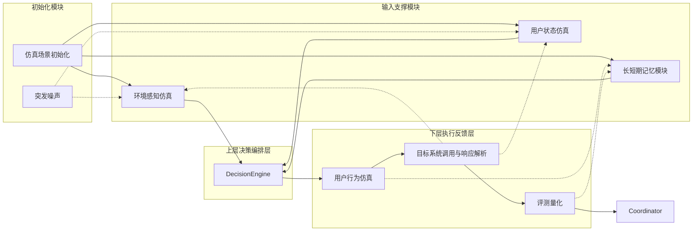
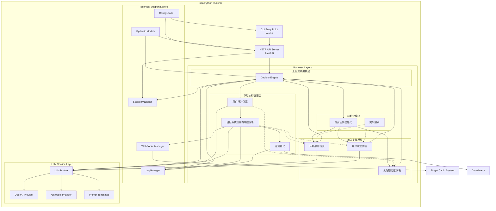
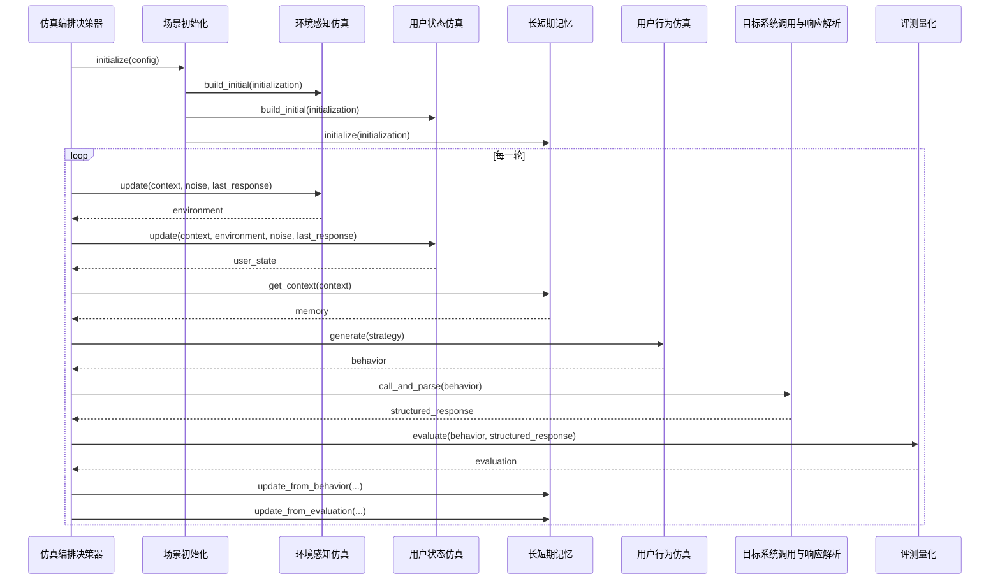

# Design Document: iota 智能座舱仿真系统

## Overview

`iota` 是一个纯 Python 的智能座舱仿真系统。它围绕统一的场景初始化结果、多轮会话上下文和结构化响应闭环运行，用于验证目标座舱系统在复杂场景中的行为是否合理、准确、及时。

本设计文档遵循以下固定边界：

- `iota` 是系统名称，不再拆出单独的 “iota 引擎” 概念
- 不存在独立的“车辆响应仿真”模块
- 评测输入固定为“用户行为 + StructuredResponse”
- 会话上下文、初始化模型和模块结构以本文档为权威设计
- 所有描述和示例统一使用纯 Python

## Design Goals

1. 使用统一的初始化模型驱动整场仿真。
2. 使用统一的会话上下文驱动多轮循环。
3. 使用统一的结构化响应驱动反馈、评测与结束判断。
4. 保持模块职责清晰，避免“编排器”和“执行器”边界混乱。
5. 用 asyncio 实现单进程、高并发、易部署的运行时。

## Canonical Models

### ScenarioInitialization

```python
from pydantic import BaseModel
from typing import Any


class TripGoal(BaseModel):
    purpose: str
    destination: str | None = None
    success_criteria: list[str]


class Origin(BaseModel):
    latitude: float
    longitude: float
    label: str | None = None


class Occupant(BaseModel):
    occupant_id: str
    role: str
    profile: dict[str, Any] = {}


class ScenarioInitialization(BaseModel):
    trip_goal: TripGoal
    origin: Origin
    occupants: list[Occupant]
    scene_config: dict[str, Any]
```

### StructuredResponse

```python
from datetime import datetime
from typing import Any


class StructuredResponse(BaseModel):
    response_status: str
    response_content: dict[str, Any]
    completion_flag: bool
    side_effects: dict[str, Any] = {}
    raw_payload: dict[str, Any] = {}
    timestamp: datetime
```

### SessionContext

```python
from typing import Any


class TurnRecord(BaseModel):
    turn_index: int
    behavior: dict[str, Any] | None = None
    response: dict[str, Any] | None = None
    evaluation: dict[str, Any] | None = None


class SessionContext(BaseModel):
    session_id: str
    status: str  # created / running / completed / aborted
    turn_index: int = 0
    max_turns: int = 10
    initialization: ScenarioInitialization
    current_environment: dict[str, Any] = {}
    current_user_state: dict[str, Any] = {}
    memory: dict[str, Any] = {}
    last_behavior: dict[str, Any] | None = None
    last_response: StructuredResponse | None = None
    last_evaluation: dict[str, Any] | None = None
    history: list[TurnRecord] = []
```

## Architecture

### Layered View



### Technical Layering Diagram

这个图对应系统最关键的技术分层视图：在同一个 Python 进程内，HTTP/CLI 入口、业务四层、技术支撑层、LLM 服务层和目标系统连接如何协作。



### Technical Layering Notes

- `CLI` 和 `API` 是系统入口层，不参与业务决策。
- 四层业务结构保持不变：初始化模块、输入支撑模块、上层决策编排层、下层执行反馈层。
- `SessionManager`、`WebSocketManager`、`LogManager`、`ConfigLoader` 和 Pydantic 模型属于技术支撑层，不承担业务编排职责。
- `LLMService` 为多个业务模块提供统一模型调用能力，但不持有会话状态。
- `WebSocketManager` 是目标系统连接的唯一技术入口，为系统级单例，所有会话通过会话 ID 复用同一连接。
- `StructuredResponse` 是业务层唯一标准化反馈结构。
- `SessionManager` 按单用户模式管理会话，每个用户的多轮交互复用同一个 session。

### Main Loop

`iota` 采用双层循环：

- 外层：会话级循环，负责创建会话、维护状态、判断完成或中止
- 内层：单轮执行，负责“上下文准备 -> 决策 -> 行为 -> 调用 -> 评测”

```python
class SimulationCoordinator:
    async def run_until_complete(self, context: SessionContext) -> SessionContext:
        context.status = "running"
        while context.status == "running":
            turn_result = await self.execute_turn(context)
            decision = await self.analyze_and_decide(context, turn_result)
            context = self.apply_turn_result(context, turn_result, decision)
        return context
```

## Module Responsibilities

### 1. 仿真场景初始化

职责：

- 将业务配置转换为 `ScenarioInitialization`
- 统一定义仿真目标、起点、乘员与场景参数
- 作为环境、用户状态和记忆的共同输入

接口：

```python
class ScenarioInitializer:
    async def initialize(self, business_config: dict) -> ScenarioInitialization:
        ...
```

### 2. 突发噪声

职责：

- 在初始化后的任意轮次生成可选扰动
- 仅影响环境感知仿真和用户状态仿真
- 第一版本仅提供接口定义和 Mock 实现

接口：

```python
class SuddenNoiseGenerator:
    async def generate(self, context: SessionContext) -> dict:
        # Mock implementation: return empty dict
        return {}
```

### 3. 环境感知仿真

职责：

- 生成和维护环境状态（舱外+舱内）
- 合并初始化结果、噪声输入与 `StructuredResponse.side_effects`
- 在每轮中先于用户状态仿真完成更新
- 向用户状态仿真和 DecisionEngine 提供环境上下文

接口：

```python
class EnvironmentSimulation:
    async def build_initial(self, initialization: ScenarioInitialization) -> dict:
        ...

    async def update(
        self,
        context: SessionContext,
        noise: dict | None,
        response: StructuredResponse | None,
    ) -> dict:
        ...
```

### 4. 用户状态仿真

职责：

- 基于初始化结果建立用户初始状态
- 依赖环境感知仿真的当前输出作为前提条件
- 基于当前环境、噪声和响应副作用持续更新用户状态

接口：

```python
class UserStateSimulation:
    async def build_initial(self, initialization: ScenarioInitialization) -> dict:
        ...

    async def update(
        self,
        context: SessionContext,
        environment: dict,
        noise: dict | None,
        response: StructuredResponse | None,
    ) -> dict:
        ...
```

### 5. 长短期记忆模块

职责：

- 维护长期偏好、短期上下文和知识库
- 作为外部系统，异步接收行为结果和评测结果的更新请求
- 自行保证更新顺序的正确性
- 为 DecisionEngine 提供稳定的记忆视图

接口：

```python
class MemoryModule:
    async def initialize(self, initialization: ScenarioInitialization) -> dict:
        ...

    async def get_context(self, context: SessionContext) -> dict:
        ...

    async def update_from_behavior(self, context: SessionContext, behavior: dict) -> None:
        # Async fire-and-forget, memory system handles ordering
        ...

    async def update_from_evaluation(self, context: SessionContext, evaluation: dict) -> None:
        # Async fire-and-forget, memory system handles ordering
        ...
```

### 6. DecisionEngine

职责：

- 从输入支撑模块按需拉取上下文
- 生成当前轮策略和用户意图
- 基于结构化响应、评测结果和轮次约束决定继续或结束
- 负责会话级外层循环和单轮级内层执行的编排逻辑

接口：

```python
class DecisionEngine:
    async def plan(self, context: SessionContext) -> dict:
        ...

    async def decide_next_step(
        self,
        context: SessionContext,
        response: StructuredResponse,
        evaluation: dict,
    ) -> dict:
        ...
    
    async def run_until_complete(self, context: SessionContext) -> SessionContext:
        ...
    
    async def execute_turn(self, context: SessionContext) -> dict:
        ...
```

### 7. 用户行为仿真

职责：

- 将当前轮策略转换为用户行为
- 支持语音、按键、触屏三类主行为
- 为手势保留扩展位

接口：

```python
class UserBehaviorSimulation:
    async def generate(self, context: SessionContext, strategy: dict) -> dict:
        ...
```

### 8. 目标系统调用与响应解析

职责：

- 通过 WebSocket 向目标系统发送行为请求
- 接收原始响应并解析为 `StructuredResponse`
- 响应解析策略：首先尝试按协议 schema 直接解析；如果失败则使用 LLM 辅助归一化；如果两者都失败则快速失败
- 将结构化响应广播给编排、反馈和评测链路

接口：

```python
class TargetSystemCallModule:
    async def call_and_parse(self, context: SessionContext, behavior: dict) -> StructuredResponse:
        try:
            # Step 1: Try schema-based parsing
            raw_response = await self.ws_manager.send_and_receive(behavior)
            return self.parse_by_schema(raw_response)
        except SchemaParseError:
            # Step 2: Fallback to LLM-assisted parsing
            return await self.parse_by_llm(raw_response)
        except Exception as e:
            # Step 3: Fast fail
            raise NonRetryableError(f"Response parsing failed: {e}")
```

### 9. 评测量化

职责：

- 以“用户行为 + StructuredResponse”为输入计算评估结果
- 输出四维指标：合理性、准确性、覆盖率、实时性

接口：

```python
class EvaluationEngine:
    async def evaluate(
        self,
        context: SessionContext,
        behavior: dict,
        response: StructuredResponse,
    ) -> dict:
        ...
```

## Turn Execution Sequence



设计说明：

- 环境感知仿真先更新，用户状态仿真再读取当前环境，因此两者不是无条件并行
- 结构化响应是所有反馈链路的唯一标准输入
- 评测不依赖不存在的“车辆响应仿真”

## Concurrency Model

系统统一使用 asyncio。

可并发的操作：

- 多个 LLM 调用的 provider 级网络 I/O
- 日志写入与主链路执行
- 记忆更新与非关键链路写回

必须顺序执行的操作：

1. 场景初始化
2. 环境更新
3. 用户状态更新
4. 编排决策
5. 用户行为生成
6. 目标系统调用与响应解析
7. 评测量化

## Error Handling

### Error Categories

```python
class IotaError(Exception):
    pass


class RetryableError(IotaError):
    pass


class NonRetryableError(IotaError):
    pass
```

分类原则：

- WebSocket 连接中断、临时超时、LLM 限流属于 `RetryableError`
- 输入不合法、配置错误、响应格式不可恢复损坏属于 `NonRetryableError`

### Retry Strategy

- WebSocket 重连：指数退避，默认最多 3 次
- LLM 调用：仅对暂时性错误重试
- 达到上限后将会话标记为 `aborted`

## Pure Python Technology Stack

- Python 3.11+
- FastAPI
- websockets
- asyncio
- Pydantic v2
- structlog
- orjson
- openai
- anthropic
- aiofiles
- pytest / pytest-asyncio

## Module Structure

```text
iota/
├── __init__.py
├── __main__.py
├── cli/
│   ├── main.py
│   └── config.py
├── api/
│   ├── app.py
│   ├── models.py
│   └── routes/
│       ├── health.py
│       └── simulation.py
├── core/
│   ├── config.py
│   ├── errors.py
│   ├── log_manager.py
│   ├── session_manager.py
│   └── websocket_manager.py
├── llm/
│   ├── service.py
│   ├── providers/
│   │   ├── anthropic.py
│   │   └── openai.py
│   └── prompts/
│       ├── behavior.py
│       ├── decision.py
│       ├── environment.py
│       ├── response_parser.py
│       └── user_state.py
├── models/
│   ├── behavior.py
│   ├── context.py
│   ├── environment.py
│   ├── evaluation.py
│   ├── response.py
│   ├── scenario.py
│   └── user.py
├── simulation/
│   ├── decision_engine.py
│   ├── evaluation.py
│   ├── noise.py
│   ├── scenario.py
│   └── engines/
│       ├── behavior.py
│       ├── environment.py
│       ├── memory.py
│       ├── service_call.py
│       └── user_state.py
└── utils/
    ├── async_helpers.py
    └── json_utils.py
```

## Configuration Management

### Configuration Hierarchy

配置层级（优先级从高到低）：

1. **运行时覆盖** (`--config` 命令行参数)
2. **项目配置** (`.iota/config.toml`)
3. **全局配置** (`~/.iota/config.toml`)

### Merging Strategy

- 采用深度合并策略
- 后者（高优先级）完全覆盖前者（低优先级）的同名键
- 数组类型配置不合并，直接覆盖

示例：

```python
# Global config
{
    "llm": {"provider": "openai", "model": "gpt-4", "timeout": 30},
    "simulation": {"max_turns": 10}
}

# Project config
{
    "llm": {"model": "gpt-4-turbo"},
    "simulation": {"max_turns": 20}
}

# Merged result
{
    "llm": {"provider": "openai", "model": "gpt-4-turbo", "timeout": 30},
    "simulation": {"max_turns": 20}
}
```

## API and Runtime Boundaries

### HTTP API

- `POST /api/simulation/start`
- `GET /api/simulation/{session_id}/status`
- `POST /api/simulation/{session_id}/stop`
- `GET /health`

### WebSocket Runtime

目标系统的通信由 `WebSocketManager` 统一管理：

```python
class WebSocketManager:
    async def connect(self, url: str) -> None:
        ...

    async def send_and_receive(self, payload: dict) -> dict:
        ...

    async def close(self) -> None:
        ...
```

## Response Parsing Strategy

默认策略：

1. 优先按协议 schema 直接解析原始响应
2. 仅在协议字段不稳定或存在自然语言响应时使用 LLM 辅助归一化
3. 最终统一产出 `StructuredResponse`

这样可以避免“本来已经结构化的响应仍强行依赖 LLM 解析”的不必要复杂度。

## Session Lifecycle

统一状态集合：

- `created`
- `running`
- `completed`
- `aborted`

状态转换规则（快速失败策略）：

```python
def next_status(
    current: str,
    completion_flag: bool,
    turn_index: int,
    max_turns: int,
    fatal_error: bool,
) -> str:
    if fatal_error:
        return "aborted"  # Fast fail, no retry
    if completion_flag:
        return "completed"
    if turn_index >= max_turns:
        return "aborted"
    return current
```

会话管理策略：

- SessionManager 按单用户模式管理会话
- 每个用户的多轮交互复用同一个 session
- session_id 在会话创建时生成，贯穿整个会话生命周期

## Observability

- 每轮记录初始化快照、行为、结构化响应、评估结果和状态变化
- 日志采用 JSON 结构化输出
- 日志写入与主执行链路异步解耦

## Supplemental Technical Details

本节用于补回原始设计稿中的关键技术信息，并统一到当前修正后的边界之下，确保信息不丢失。

### Pure Python Architecture

系统继续采用纯 Python 单进程架构，核心原则保持不变：

- 简化部署：只需要 Python 运行时
- 快速迭代：统一语言栈，便于开发和调试
- 成熟生态：复用 FastAPI、Pydantic、websockets、structlog 等成熟组件
- 异步高性能：统一使用 asyncio 处理 I/O 和后台任务

### Integration Strategy

- 所有核心组件运行在同一 Python 进程中，通过直接函数调用交互
- 所有 I/O 操作统一使用 async/await
- WebSocket、HTTP、日志写入和 LLM 网络调用都由 asyncio 事件循环统一调度
- 会话状态保存在内存中，必要时可扩展为持久化存储
- Pydantic 模型作为所有模块间的边界契约

### Dependencies

建议依赖保持如下集合：

- 运行时依赖：`fastapi`, `uvicorn`, `websockets`, `pydantic`, `orjson`, `structlog`, `aiofiles`, `openai`, `anthropic`
- 可选辅助依赖：`httpx` 或 `aiohttp`
- 开发依赖：`pytest`, `pytest-asyncio`, `hypothesis`, `ruff`, `mypy`

### WebSocket Message Format

目标系统通信建议保留三类消息视角，供协议对接和测试使用：

1. 请求消息
   - 由用户行为转换而来
   - 包含动作类型、意图、参数和会话元数据
2. 原始响应消息
   - 由目标系统返回
   - 保留完整原始载荷，写入 `StructuredResponse.raw_payload`
3. 结构化响应
   - 由 `TargetSystemCallModule` 统一归一化
   - 对业务层暴露 `response_status`、`response_content`、`completion_flag`、`side_effects`、`timestamp`

### Reference Implementations

原设计中引用的参考项目仍然保留，但仅作为模式来源，不作为实现约束：

- `claude-code`
  - 参考其循环控制、上下文组织与会话管理思路
- `claw-code`
  - 参考其纯 Python 实现思路和配置层级
- `codex`
  - 参考其分层执行、错误恢复与审批边界思想
- `gemini-cli`
  - 参考其流式处理和循环检测思路
- `opencode`
  - 参考其双层循环与持久化恢复思路

### Performance Optimization Strategy

- 通过 asyncio 避免阻塞 I/O
- 对日志写入、非关键记忆写回和后台任务使用异步解耦
- 使用 orjson 优化序列化性能
- 允许对 LLM 调用和网络请求增加超时与重试
- 避免在业务层重复解析目标系统响应，统一归一化为 `StructuredResponse`

### Deployment Architecture

开发环境建议：

- `python -m venv .venv`
- `pip install -e ".[dev]"`
- `python -m iota start --config config.toml`
- `uvicorn iota.api.app:app --reload --port 8000`

生产环境建议：

- `pip install -e .`
- `uvicorn iota.api.app:app --host 0.0.0.0 --port 8000 --workers 4`
- 或 `gunicorn iota.api.app:app -w 4 -k uvicorn.workers.UvicornWorker --bind 0.0.0.0:8000`

容器化建议：

- 使用 Python 3.11+ 基础镜像
- 镜像内仅包含应用代码、配置和 Python 依赖
- 对外暴露 HTTP 端口，目标系统连接仍通过运行时 WebSocket 客户端发起

### Monitoring and Observability

除结构化日志外，建议保留以下观测能力：

- 会话数、轮次数、执行耗时等基础指标
- LLM 调用耗时和错误率
- WebSocket 连接状态与重连次数
- 评测结果分布和终止原因统计

### Security Considerations

建议保留原设计中的安全约束，但统一按纯 Python 实现：

- API 请求参数使用 Pydantic 做强校验
- API Key 和敏感配置通过环境变量或外部密钥系统注入
- 对启动接口增加鉴权或访问控制
- 对输入内容设置合理长度、超时和频率限制
- 对目标系统原始响应保留最小必要日志，避免敏感信息泄露

## Testing Strategy

1. 单元测试：模型、配置、错误分类、状态机
2. 集成测试：单轮闭环、多轮闭环、反馈链路、记忆连续性
3. 协议测试：WebSocket 请求和响应 schema
4. 属性测试：主链路顺序、评估依赖、噪声边界

## Conclusion

本设计将 `iota` 收敛为一套一致的纯 Python 仿真系统设计：

- 用统一的 `ScenarioInitialization` 开场
- 用统一的 `SessionContext` 维持多轮状态
- 用统一的 `StructuredResponse` 驱动反馈与评测
- 用单进程 asyncio 架构实现可维护、可测试、可部署的系统
