# Requirements Document

## Introduction

智能座舱仿真智能体系统（B系统）是基于 Claude Code / Codex / Gemini-CLI / OpenCode 等代码智能体系统的源代码及分析文档设计的独立仿真系统，用于验证智能座舱系统（A系统）的功能。B系统借鉴代码智能体的多轮交互、上下文管理和决策执行机制，通过模拟舱外环境、舱内环境和用户行为，生成多轮交互场景，通过WebSocket双向通信与A系统交互并记录完整的交互日志。A系统作为黑盒存在，B系统通过WebSocket连接与其通信，上行包含请求通道（发送控制指令）和数据通道（发送环境和用户数据），下行接收A系统的响应。

## System Flow

```mermaid
flowchart TD
    Start([用户触发仿真]) --> API[POST /api/v1/simulation/start<br/>或 /trigger 或 /run]
    API --> SessionMgr[仿真会话管理器<br/>创建/获取会话]
    
    SessionMgr --> TurnStart{开始新轮次}
    
    TurnStart --> ExtEnv[舱外环境仿真模块<br/>生成天气/路况/周围物体]
    ExtEnv --> IntEnv[舱内环境仿真模块<br/>生成车辆/座舱状态]
    IntEnv --> UserBehavior[用户行为仿真模块<br/>分析上轮A系统响应<br/>生成用户行为]
    
    UserBehavior --> DecisionEngine[仿真决策引擎<br/>汇总三模块输出]
    DecisionEngine --> GenerateDecision[生成决策<br/>确定action/intent/data]
    
    GenerateDecision --> Executor[决策执行器<br/>接收决策作为输入]
    
    Executor --> ExecutorInternal[执行器内部处理]
    
    subgraph ExecutorInternal[执行器内部]
        CheckWS{WebSocket<br/>连接已建立?} -->|否| EstablishWS[建立WebSocket连接]
        CheckWS -->|是| SendData[发送数据]
        EstablishWS --> SendData
        
        SendData --> ReqChannel[请求通道<br/>发送控制指令]
        SendData --> DataChannel[数据通道<br/>发送环境和用户数据]
        
        ReqChannel --> WSUplink[WebSocket上行]
        DataChannel --> WSUplink
        
        WSUplink --> SystemA[A系统处理]
        SystemA --> WSDownlink[WebSocket下行<br/>响应通道]
        WSDownlink --> ParseResponse[解析响应<br/>提取final_decision]
    end
    
    ParseResponse --> ReturnResponse[执行器返回响应<br/>包含A系统响应内容]
    ReturnResponse --> Logger[日志记录器<br/>记录输入/决策/输出]
    
    Logger --> CheckFinal{检查final_decision}
    CheckFinal -->|true| Complete[会话状态: completed<br/>记录结束时间<br/>通知执行器关闭WebSocket]
    CheckFinal -->|false| CheckMaxTurns{达到最大轮数?}
    
    CheckMaxTurns -->|是| Abort[会话状态: aborted<br/>防止死循环<br/>通知执行器关闭WebSocket]
    CheckMaxTurns -->|否| UpdateContext[更新会话上下文<br/>保存A系统响应<br/>轮次+1]
    
    UpdateContext --> TurnStart
    
    Complete --> End([返回最终结果])
    Abort --> End
    
    style API fill:#e1f5ff
    style SessionMgr fill:#fff4e1
    style ExtEnv fill:#e8f5e9
    style IntEnv fill:#e8f5e9
    style UserBehavior fill:#e8f5e9
    style DecisionEngine fill:#fff3e0
    style GenerateDecision fill:#fff3e0
    style Executor fill:#ffe0b2
    style ExecutorInternal fill:#fff3e0
    style CheckWS fill:#fff9c4
    style EstablishWS fill:#fff9c4
    style ReqChannel fill:#fce4ec
    style DataChannel fill:#fce4ec
    style WSUplink fill:#f3e5f5
    style SystemA fill:#ffebee
    style WSDownlink fill:#f3e5f5
    style ParseResponse fill:#fff9c4
    style ReturnResponse fill:#ffe0b2
    style Logger fill:#e0f2f1
    style UpdateContext fill:#fff4e1
    style Complete fill:#c8e6c9
    style Abort fill:#ffcdd2
```



## Glossary

- **Simulation_Session_Manager**: 仿真会话管理器，负责创建和管理仿真会话、维护多轮交互上下文、判断结束条件（借鉴代码智能体的会话管理机制）
- **External_Environment_Module**: 舱外环境仿真模块，模拟天气、路况、周围物体等外部环境因素
- **Internal_Environment_Module**: 舱内环境仿真模块，模拟车辆状态、座舱状态等内部环境因素
- **User_Behavior_Module**: 用户行为仿真模块，根据A系统响应生成下一轮用户行为（借鉴代码智能体的上下文理解和响应生成机制）
- **Decision_Engine**: 仿真决策引擎，汇总仿真输入并生成决策（借鉴代码智能体的决策生成机制）
- **Executor**: 决策执行器，负责执行决策、管理WebSocket连接、发送数据到A系统（借鉴代码智能体的工具调用机制）
- **Logger**: 日志记录器，记录每轮输入输出和决策内容
- **System_A**: 智能座舱系统，作为黑盒被验证的目标系统
- **WebSocket_Connection**: WebSocket连接，B系统与A系统之间的双向通信通道
- **Request_Channel**: 请求通道，B系统向A系统发送控制指令的上行通道
- **Data_Channel**: 数据通道，B系统向A系统发送环境和用户数据的上行通道
- **Response_Channel**: 响应通道，A系统向B系统返回处理结果的下行通道
- **Simulation_Turn**: 仿真轮次，一次完整的"输入→决策→执行→接收响应"循环
- **Final_Decision**: 最终决定标志，表示A系统已完成任务处理
- **Scenario**: 仿真场景，包含初始环境状态和用户行为的配置

## Requirements

### Requirement 1: 仿真会话管理

**User Story:** 作为仿真系统操作员，我希望能够创建和管理仿真会话，以便跟踪多轮交互过程并控制仿真生命周期。

#### Acceptance Criteria

1. WHEN 用户通过API请求创建仿真会话, THE Simulation_Session_Manager SHALL 生成唯一会话ID并初始化会话状态
2. THE Simulation_Session_Manager SHALL 维护会话状态包括会话ID、状态（running/completed/aborted）、轮次计数、上下文信息、开始时间和结束时间
3. WHILE 仿真会话处于running状态, THE Simulation_Session_Manager SHALL 跟踪当前任务、任务步骤和待确认事项
4. THE Simulation_Session_Manager SHALL 在会话上下文中保存每轮A系统的响应内容，供下一轮仿真模块使用
5. WHEN A系统返回final_decision为true, THE Simulation_Session_Manager SHALL 将会话状态更新为completed并记录结束时间
6. WHEN 仿真轮次达到最大轮数限制, THE Simulation_Session_Manager SHALL 将会话状态更新为aborted并记录结束时间
6. WHEN 用户请求停止会话, THE Simulation_Session_Manager SHALL 将会话状态更新为aborted并记录结束时间
7. WHEN 用户查询会话状态, THE Simulation_Session_Manager SHALL 返回当前会话的完整状态信息

### Requirement 2: 舱外环境仿真

**User Story:** 作为仿真系统，我需要模拟舱外环境因素，以便为智能座舱系统提供真实的外部环境上下文。

#### Acceptance Criteria

1. WHEN 仿真轮次开始, THE External_Environment_Module SHALL 根据场景配置生成舱外环境数据
2. THE External_Environment_Module SHALL 输出包含天气状态（sunny/rainy/foggy等）的环境数据
3. THE External_Environment_Module SHALL 输出包含温度（摄氏度）的环境数据
4. THE External_Environment_Module SHALL 输出包含能见度（米）的环境数据
5. THE External_Environment_Module SHALL 输出包含路况（dry/wet/icy等）的环境数据
6. THE External_Environment_Module SHALL 输出包含周围物体列表的环境数据，每个物体包含类型、距离和方向
7. THE External_Environment_Module SHALL 以JSON格式输出舱外环境数据，包含module标识和data字段

### Requirement 3: 舱内环境仿真

**User Story:** 作为仿真系统，我需要模拟舱内环境状态，以便为智能座舱系统提供车辆和座舱的状态信息。

#### Acceptance Criteria

1. WHEN 仿真轮次开始, THE Internal_Environment_Module SHALL 根据场景配置生成舱内环境数据
2. THE Internal_Environment_Module SHALL 输出包含安全带状态（fastened/unfastened）的环境数据
3. THE Internal_Environment_Module SHALL 输出包含车门状态（每个车门的开关状态）的环境数据
4. THE Internal_Environment_Module SHALL 输出包含空调温度（摄氏度）的环境数据
5. THE Internal_Environment_Module SHALL 输出包含空调模式（cool/heat/auto）的环境数据
6. THE Internal_Environment_Module SHALL 输出包含座舱噪音水平（分贝）的环境数据
7. THE Internal_Environment_Module SHALL 以JSON格式输出舱内环境数据，包含module标识和data字段

### Requirement 4: 用户行为仿真

**User Story:** 作为仿真系统，我需要根据A系统的响应生成合理的用户行为，以便模拟真实的多轮交互场景。

#### Acceptance Criteria

1. WHEN 仿真轮次开始, THE User_Behavior_Module SHALL 接收上一轮A系统响应作为输入（首轮使用初始场景配置）
2. WHEN A系统要求用户确认, THE User_Behavior_Module SHALL 生成确认或否定的用户行为
3. WHEN A系统询问缺失信息, THE User_Behavior_Module SHALL 生成提供信息的用户行为
4. WHEN A系统执行完成, THE User_Behavior_Module SHALL 生成下一个需求或结束信号
5. THE User_Behavior_Module SHALL 输出包含行为类型（voice_command/touch/gesture）的用户行为数据
6. THE User_Behavior_Module SHALL 输出包含行为详情（意图和槽位）的用户行为数据
7. THE User_Behavior_Module SHALL 输出包含is_final标志的用户行为数据
8. THE User_Behavior_Module SHALL 以JSON格式输出用户行为数据，包含module标识和data字段

### Requirement 5: 仿真决策引擎

**User Story:** 作为仿真系统，我需要汇总所有仿真模块的输出并生成决策，以便为执行器提供明确的执行指令。

#### Acceptance Criteria

1. WHEN 所有仿真模块完成输出, THE Decision_Engine SHALL 汇总舱外环境、舱内环境和用户行为数据
2. THE Decision_Engine SHALL 根据汇总数据和决策规则生成决策动作
3. THE Decision_Engine SHALL 生成包含控制指令（action、intent、command）的决策输出
4. THE Decision_Engine SHALL 生成包含环境和用户数据（cabin_external、cabin_internal、user_action）的决策输出
5. THE Decision_Engine SHALL 以结构化格式输出决策，供执行器调用
6. THE Decision_Engine SHALL NOT 直接与A系统通信或管理WebSocket连接
7. WHEN 决策生成失败, THE Decision_Engine SHALL 记录错误信息并返回错误状态

### Requirement 6: 日志记录

**User Story:** 作为仿真系统操作员，我需要记录每轮仿真的完整信息，以便后续分析和评估A系统的行为。

#### Acceptance Criteria

1. WHEN 仿真轮次开始, THE Logger SHALL 记录会话ID、轮次ID和时间戳
2. THE Logger SHALL 记录舱外环境仿真模块的输出数据
3. THE Logger SHALL 记录舱内环境仿真模块的输出数据
4. THE Logger SHALL 记录用户行为仿真模块的输出数据
5. THE Logger SHALL 记录决策引擎生成的决策动作和API调用信息
6. THE Logger SHALL 记录A系统的响应内容
7. THE Logger SHALL 以结构化JSON格式存储日志数据
8. WHEN 用户查询会话日志, THE Logger SHALL 返回指定会话的所有轮次日志
9. WHEN 用户请求导出日志, THE Logger SHALL 提供所有会话日志的导出功能

### Requirement 7: HTTP API接口

**User Story:** 作为仿真系统用户，我需要通过HTTP API控制仿真流程，以便集成到自动化测试系统中。

#### Acceptance Criteria

1. THE System SHALL 提供POST /api/v1/simulation/start接口用于创建仿真会话
2. WHEN 用户调用start接口, THE System SHALL 接受包含场景类型、初始状态和最大轮数的请求体
3. WHEN 用户调用start接口, THE System SHALL 返回包含会话ID、状态和当前轮次的响应体
4. THE System SHALL 提供GET /api/v1/simulation/{session_id}接口用于查询会话状态
5. THE System SHALL 提供POST /api/v1/simulation/{session_id}/stop接口用于停止会话
6. THE System SHALL 提供POST /api/v1/simulation/{session_id}/trigger接口用于触发单轮仿真
7. THE System SHALL 提供POST /api/v1/simulation/{session_id}/run接口用于持续执行仿真直到结束
8. WHEN 用户调用run接口, THE System SHALL 返回包含会话ID、状态、总轮数和最终决策的响应体
9. THE System SHALL 提供GET /api/v1/simulation/{session_id}/logs接口用于查询会话日志
10. THE System SHALL 提供GET /api/v1/simulation/logs/export接口用于导出所有日志

### Requirement 8: 场景管理

**User Story:** 作为仿真系统操作员，我需要管理仿真场景配置，以便复用和扩展测试场景。

#### Acceptance Criteria

1. THE System SHALL 提供GET /api/v1/scenarios接口用于列出所有可用场景
2. THE System SHALL 提供POST /api/v1/scenarios接口用于添加自定义场景
3. WHEN 用户添加场景, THE System SHALL 验证场景配置的完整性和有效性
4. THE System SHALL 提供DELETE /api/v1/scenarios/{id}接口用于删除场景
5. THE System SHALL 支持场景配置包含场景类型、初始环境状态和预期行为序列
6. THE System SHALL 以JSON格式存储和返回场景配置

### Requirement 9: 决策执行器

**User Story:** 作为决策执行器，我需要接收决策引擎的输出并执行，内部管理WebSocket连接、发送数据到A系统、接收响应，作为决策引擎的工具调用层。

#### Acceptance Criteria

1. WHEN Decision_Engine生成决策, THE Executor SHALL 接收决策输出作为输入
2. THE Executor SHALL 在内部管理与A系统的WebSocket连接生命周期
3. WHEN 首次执行决策, THE Executor SHALL 在内部建立与A系统的WebSocket连接
4. THE Executor SHALL 在内部维护WebSocket连接状态直到会话结束
5. THE Executor SHALL 在内部实现请求通道（Request Channel）用于发送控制指令（action、intent、command等）
6. THE Executor SHALL 在内部实现数据通道（Data Channel）用于发送环境和用户数据（cabin_external、cabin_internal、user_action）
7. THE Executor SHALL 根据决策内容通过内部请求通道发送控制指令到A系统
8. THE Executor SHALL 根据决策内容通过内部数据通道发送环境和用户数据到A系统
9. THE Executor SHALL 在内部监听WebSocket响应通道（Response Channel）并接收A系统返回的响应
10. THE Executor SHALL 解析A系统响应并提取关键字段（包括final_decision标志）
11. THE Executor SHALL 将执行结果返回给主流程
12. IF WebSocket连接断开或超时, THEN THE Executor SHALL 在内部尝试重连（最多3次），失败后返回错误状态
13. WHEN 仿真会话结束, THE Executor SHALL 在内部优雅关闭WebSocket连接并释放资源
14. THE Executor SHALL 记录所有执行操作和内部WebSocket通信日志

### Requirement 10: 场景管理

**User Story:** 作为仿真系统操作员，我需要管理仿真场景配置，以便复用和扩展测试场景。

#### Acceptance Criteria

1. THE System SHALL 提供GET /api/v1/scenarios接口用于列出所有可用场景
2. THE System SHALL 提供POST /api/v1/scenarios接口用于添加自定义场景
3. WHEN 用户添加场景, THE System SHALL 验证场景配置的完整性和有效性
4. THE System SHALL 提供DELETE /api/v1/scenarios/{id}接口用于删除场景
5. THE System SHALL 支持场景配置包含场景类型、初始环境状态和预期行为序列
6. THE System SHALL 以JSON格式存储和返回场景配置

### Requirement 11: 多轮仿真流程控制

**User Story:** 作为仿真系统，我需要协调各模块按正确顺序执行，以便完成完整的多轮仿真流程。

#### Acceptance Criteria

1. WHEN 仿真轮次开始, THE System SHALL 按顺序执行舱外仿真、舱内仿真、用户仿真
2. WHEN 首轮仿真, THE System SHALL 使用初始场景配置作为仿真模块输入
3. WHEN 非首轮仿真, THE System SHALL 将上一轮A系统响应作为仿真模块（特别是用户行为模块）的输入
4. WHEN 所有仿真模块完成, THE System SHALL 调用决策引擎生成决策
5. WHEN 决策生成完成, THE System SHALL 调用执行器执行决策
6. WHEN 执行器接收到A系统响应, THE System SHALL 调用日志记录器记录完整数据
7. WHEN 日志记录完成, THE System SHALL 将A系统响应保存到会话上下文中
8. WHEN 日志记录完成且final_decision为false, THE System SHALL 开始下一轮仿真（使用保存的A系统响应）
9. WHEN 日志记录完成且final_decision为true, THE System SHALL 结束仿真会话并通知执行器关闭内部WebSocket连接
10. WHEN 轮次计数达到最大轮数, THE System SHALL 结束仿真会话、标记为aborted并通知执行器关闭内部WebSocket连接
11. THE System SHALL 在每轮仿真之间保持上下文连续性

### Requirement 12: 系统独立性和可扩展性

**User Story:** 作为系统架构师，我需要确保B系统完全独立且可扩展，以便在不同环境中部署和扩展功能。

#### Acceptance Criteria

1. THE System SHALL 独立运行，不依赖真实座舱硬件
2. THE System SHALL 参考Claude Code / Codex / Gemini-CLI / OpenCode等代码智能体系统的架构设计模式
3. THE System SHALL 通过配置文件管理A系统的WebSocket连接地址和端口（供执行器使用）
4. THE System SHALL 支持配置WebSocket连接参数（重连次数、超时时间、心跳间隔等，供执行器使用）
5. THE System SHALL 支持通过插件机制添加新的仿真场景类型
6. THE System SHALL 支持通过配置文件扩展决策规则
7. THE System SHALL 使用统一的日志格式便于后续分析
8. THE System SHALL 提供健康检查接口用于监控系统状态
9. WHERE 部署环境支持容器化, THE System SHALL 提供Docker镜像和部署配置

## Correctness Properties

### Property 1: 会话状态一致性
```
FORALL session IN active_sessions:
  IF session.status == "running" THEN
    session.turn_count >= 0 AND
    session.turn_count <= session.max_turns AND
    session.context IS NOT NULL
```

### Property 2: 多轮交互上下文连续性
```
FORALL turn IN session.turns WHERE turn.id > 1:
  turn.input.previous_response == session.turns[turn.id - 1].output.response
```

### Property 3: WebSocket连接生命周期
```
FORALL executor IN active_executors:
  IF executor.has_active_session THEN
    executor.websocket_connection IS NOT NULL AND
    executor.websocket_connection.state IN ["connected", "reconnecting"]
```

### Property 4: 决策执行原子性
```
FORALL decision IN generated_decisions:
  decision.executed == TRUE IMPLIES
    (decision.request_sent == TRUE AND decision.response_received == TRUE) OR
    decision.error_logged == TRUE
```

### Property 5: 仿真终止条件
```
FORALL session IN sessions:
  session.status IN ["completed", "aborted"] IMPLIES
    (session.final_decision == TRUE) OR
    (session.turn_count >= session.max_turns) OR
    (session.user_stopped == TRUE)
```
