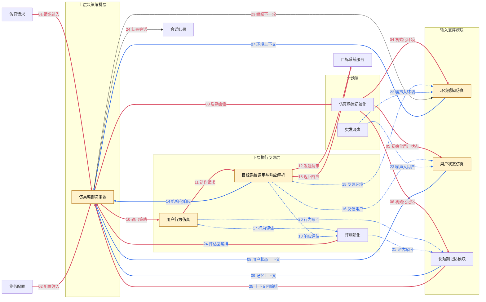

# Requirements Document

## Introduction

本需求文档以 `.kiro/specs/cabin-simulation-agent/requirements.png` 为唯一约束来源，目标是把图中的模块、分层和链路关系转写为可落地的文字需求。

该系统从控制与职责视角划分为四个部分：

- 干预层：仿真场景初始化、突发噪声
- 输入支撑模块：环境感知仿真、用户状态仿真、长短期记忆模块
- 上层决策编排层：仿真编排决策器
- 下层执行反馈层：用户行为仿真、目标系统调用与响应解析、评测量化

图中还定义了五条关键链路：

- `1. 仿真主链路`
- `2. 环境 & 用户反馈链路`
- `3. 量化评估链路`
- `4. 记忆更新链路`
- `5. 噪声扰动链路`

除上述模块、字段和链路外，图片没有强制规定具体技术实现。因此，本需求文档只约束图中明确出现的结构与逻辑，不额外引入图外模块作为硬性要求。

## System Flow



注：浅黄色背景节点表示结合 `design.md` 与当前需求后，明确建议调用 LLM 的模块，包括 `仿真编排决策器`、`环境感知仿真`、`用户状态仿真`、`用户行为仿真`、`目标系统调用与响应解析`。`仿真编排决策器` 内部包含“用户意图推演”能力，不再单独作为同级模块出现。

线条颜色约定：红色（`#d9485f`）为**请求链路**，蓝色（`#2563eb`）为**数据链路**。序号 01–24 按完整执行时序标注。

## Glossary

- **仿真请求**：来自调用方的启动或运行请求，用于驱动一次或多次仿真执行。
- **业务配置**：进入仿真流程前的外部业务参数，用于驱动仿真场景初始化。
- **仿真编排决策器**：上层决策编排组件，负责按需获取环境、用户状态和记忆上下文，完成当前轮策略生成，并基于目标系统响应、评估结果与轮次约束决定是否进入下一轮。
- **仿真场景初始化**：主链路入口，负责建立出行目的、起始点坐标、人员配置和场景配置。
- **突发噪声**：对仿真过程施加扰动的干预源，包括交通事故、热点事件、个人突发和生活/工作事件。
- **环境感知仿真**：输入支撑模块，负责构造舱外环境、交通参与者、舱内环境和车辆状态。
- **用户状态仿真**：输入支撑模块，负责构造用户人设、知识背景、身体状态和情绪状态。
- **长短期记忆模块**：输入支撑模块，负责沉淀个性化偏好、实时上下文窗口和知识库。
- **用户意图推演**：仿真编排决策器的内部能力，用于进行情景理解、需求解析、规划策略和交互意图生成。
- **用户行为仿真**：下层执行反馈模块，负责把上层决策转成具体交互动作，语音为主要形式。
- **目标系统调用与响应解析**：下层执行反馈中的服务通信组件，负责向目标系统发送动作请求、接收响应并产出结构化执行结果。
- **车辆响应仿真**：下层执行反馈模块，负责模拟车窗、空调、屏幕和座椅等车载部件的响应。
- **目标系统服务**：下层交互的外部服务对象，用于接收动作请求并返回响应与状态变化。
- **评测量化**：下层执行反馈模块，负责从合理性、准确性、覆盖率和实时性四个维度做量化评估。
- **仿真主链路**：从场景初始化到环境/状态/记忆，再到编排决策、行为执行、目标系统调用与车辆响应的主流程。
- **环境 & 用户反馈链路**：车辆响应反向影响环境感知和用户状态的反馈回路。
- **量化评估链路**：把用户行为和车辆响应送入评测量化模块的评估回路。
- **记忆更新链路**：把行为结果和评估结果沉淀回长短期记忆模块的更新回路。
- **噪声扰动链路**：把突发噪声注入环境感知和用户状态的扰动回路。

## Requirements

### Requirement 1: 仿真场景初始化

**User Story:** 作为仿真系统，我希望先建立清晰的初始场景，以便后续输入、决策、执行和评估都基于同一套起点运行。

#### Acceptance Criteria

1. WHEN 系统接收到业务配置, THE System SHALL 进入仿真场景初始化。
2. THE 仿真场景初始化模块 SHALL 至少生成 `出行目的`、`起始点坐标`、`人员配置` 和 `场景配置`。
3. THE 仿真场景初始化模块 SHALL 将初始化结果同时提供给环境感知仿真、用户状态仿真和长短期记忆模块。
4. THE 仿真场景初始化模块 SHALL 作为 `仿真主链路` 的起点。
5. THE 仿真场景初始化模块 SHALL NOT 直接生成用户行为、车辆响应或评测结果。

### Requirement 2: 突发噪声

**User Story:** 作为仿真系统，我希望能够在仿真过程中注入突发扰动，以便模拟现实世界中对用户和环境的非稳定影响。

#### Acceptance Criteria

1. THE 突发噪声模块 SHALL 支持 `交通事故`、`热点事件`、`个人突发` 和 `生活&工作` 四类干预源。
2. WHEN 系统注入突发噪声, THE System SHALL 通过 `噪声扰动链路` 将扰动传递到环境感知仿真和用户状态仿真。
3. THE 突发噪声模块 SHALL 作为干预层能力存在，而不是主链路的必经节点。
4. THE 突发噪声模块 SHALL NOT 绕过输入支撑模块直接修改仿真编排决策器、用户行为仿真或车辆响应仿真。

### Requirement 3: 环境感知仿真

**User Story:** 作为仿真系统，我希望统一模拟用户所处环境，以便上层决策编排获得完整的外部与车内上下文。

#### Acceptance Criteria

1. THE 环境感知仿真模块 SHALL 覆盖 `舱外环境`、`交通参与者`、`舱内环境` 和 `车辆状态` 四类内容。
2. WHEN 仿真场景初始化完成, THE 环境感知仿真模块 SHALL 基于初始化结果建立当前环境。
3. WHEN 车辆响应仿真产生新的车辆状态, THE 环境感知仿真模块 SHALL 通过 `环境 & 用户反馈链路` 接收反馈并刷新环境表示。
4. WHEN 突发噪声发生, THE 环境感知仿真模块 SHALL 通过 `噪声扰动链路` 接收扰动并反映到当前环境中。
5. THE 环境感知仿真模块 SHALL 将当前结果提供给用户状态仿真和仿真编排决策器。

### Requirement 4: 用户状态仿真

**User Story:** 作为仿真系统，我希望持续刻画用户自身状态，以便后续决策和行为符合人物设定和情境变化。

#### Acceptance Criteria

1. THE 用户状态仿真模块 SHALL 覆盖 `用户人设`、`知识背景`、`身体状态` 和 `情绪状态`。
2. WHEN 仿真场景初始化完成, THE 用户状态仿真模块 SHALL 基于初始化结果建立用户初始状态。
3. WHEN 环境感知仿真发生变化, THE 用户状态仿真模块 SHALL 接收环境输入并更新当前用户状态。
4. WHEN 车辆响应仿真影响用户体验或车内状态, THE 用户状态仿真模块 SHALL 通过 `环境 & 用户反馈链路` 接收反馈。
5. WHEN 突发噪声发生, THE 用户状态仿真模块 SHALL 通过 `噪声扰动链路` 接收扰动。
6. THE 用户状态仿真模块 SHALL 将当前结果提供给仿真编排决策器。

### Requirement 5: 长短期记忆模块

**User Story:** 作为仿真系统，我希望保留用户长期偏好和当前上下文，以便决策结果具备连续性和个性化。

#### Acceptance Criteria

1. THE 长短期记忆模块 SHALL 维护 `个性化偏好`、`实时上下文窗口` 和 `知识库`。
2. WHEN 仿真场景初始化完成, THE 长短期记忆模块 SHALL 基于初始场景载入初始记忆。
3. THE 长短期记忆模块 SHALL 向仿真编排决策器提供可用记忆上下文。
4. WHEN 用户行为仿真产生新的交互结果, THE 长短期记忆模块 SHALL 通过 `记忆更新链路` 接收更新输入。
5. WHEN 评测量化产生新的评估结果, THE 长短期记忆模块 SHALL 通过 `记忆更新链路` 接收更新输入。

### Requirement 6: 仿真编排决策器

**User Story:** 作为仿真系统，我希望由一个上层编排决策器按需获取上下文、生成当前轮意图，并决定是否进入下一轮，以便让决策与执行分层更清晰。

#### Acceptance Criteria

1. THE 仿真编排决策器 SHALL 按需获取环境感知仿真、用户状态仿真和长短期记忆模块的当前结果，而不是被动等待固定顺序的完整输入。
2. THE 仿真编排决策器 SHALL 在内部具备 `情景理解&推理`、`需求解析&挖掘`、`长期规划&短期策略` 和 `用户意图推演` 四类能力。
3. THE 仿真编排决策器 SHALL 产出当前轮的策略与意图，并将结果提供给用户行为仿真。
4. WHEN 目标系统调用与响应解析返回结构化响应, THE 仿真编排决策器 SHALL 基于目标系统响应、评测结果、记忆状态和轮次约束决定继续下一轮还是结束会话。
5. THE 仿真编排决策器 SHALL NOT 直接调用目标系统服务，也 SHALL NOT 直接产出车辆响应或评测量化结果。

### Requirement 7: 用户行为仿真

**User Story:** 作为仿真系统，我希望把上层编排决策转成可执行的交互动作，以便驱动车辆侧响应。

#### Acceptance Criteria

1. WHEN 仿真编排决策器完成当前轮策略生成, THE 用户行为仿真模块 SHALL 基于该结果生成行为表达。
2. THE 用户行为仿真模块 SHALL 支持 `语音（主要）`、`按键` 和 `触屏` 三类明确行为形式。
3. THE 用户行为仿真模块 SHALL 为 `手势` 保留扩展能力，因为原图将其标注为待确认能力。
4. THE 用户行为仿真模块 SHALL 将行为结果提供给车辆响应仿真。
5. THE 用户行为仿真模块 SHALL 通过 `量化评估链路` 向评测量化提供输入。
6. THE 用户行为仿真模块 SHALL 通过 `记忆更新链路` 向长短期记忆模块提供更新输入。

### Requirement 8: 车辆响应仿真

**User Story:** 作为仿真系统，我希望根据用户行为模拟车辆各部件的反馈，以便形成完整的人车交互闭环。

#### Acceptance Criteria

1. WHEN 用户行为仿真产生行为结果, THE 下层执行反馈层 SHALL 先通过 `目标系统调用与响应解析` 向目标系统服务发送请求并接收响应。
2. THE `目标系统调用与响应解析` 组件 SHALL 输出结构化执行结果，且至少包含响应状态、响应内容和完成标记。
3. THE `目标系统调用与响应解析` 组件 SHALL 将结构化响应同时提供给 `车辆响应仿真` 和 `仿真编排决策器`。
4. WHEN `目标系统调用与响应解析` 返回结构化响应, THE 车辆响应仿真模块 SHALL 基于该结果生成车辆响应。
5. THE 车辆响应仿真模块 SHALL 覆盖 `车窗`、`空调`、`屏幕` 和 `座椅` 四类响应对象。
6. THE 车辆响应仿真模块 SHALL 通过 `环境 & 用户反馈链路` 把响应结果回传给环境感知仿真和用户状态仿真。
7. THE 车辆响应仿真模块 SHALL 通过 `量化评估链路` 向评测量化提供输入。
8. THE 车辆响应仿真模块 SHALL 位于下层执行反馈层，且只能在用户行为之后执行。

### Requirement 9: 评测量化

**User Story:** 作为仿真系统，我希望把执行结果转成可度量指标，以便判断仿真是否合理、准确和及时。

#### Acceptance Criteria

1. THE 评测量化模块 SHALL 覆盖 `用户行为合理性`、`车辆响应准确性`、`场景覆盖率` 和 `响应实时性` 四个维度。
2. THE 评测量化模块 SHALL 以用户行为仿真和车辆响应仿真的输出为输入。
3. THE 评测量化模块 SHALL 通过 `记忆更新链路` 把评估结果回传给长短期记忆模块。
4. THE 评测量化模块 SHALL 位于下层执行反馈层中的评测节点，而不是上层决策编排组件。

### Requirement 10: 分层与主链路编排

**User Story:** 作为系统架构师，我希望系统按“上层决策编排、下层执行反馈”的方式推进主链路，以便职责边界清晰、执行顺序稳定。

#### Acceptance Criteria

1. THE System SHALL 提供 `仿真编排决策器` 作为全局编排者和唯一的上层决策组件。
2. WHEN 仿真请求进入系统, THE `仿真编排决策器` SHALL 基于业务配置启动仿真场景初始化。
3. THE System SHALL 按 `仿真场景初始化 -> 输入支撑模块 -> 仿真编排决策器 -> 用户行为仿真 -> 目标系统调用与响应解析 -> 车辆响应仿真 -> 评测量化` 的主顺序推进。
4. WHEN 仿真场景初始化完成, THE System SHALL 把结果分别送入环境感知仿真、用户状态仿真和长短期记忆模块。
5. THE `仿真编排决策器` SHALL 按需从输入支撑模块拉取当前所需上下文，而不是要求所有支撑模块必须以固定顺序主动推送。
6. THE 下层执行反馈层 SHALL 负责动作落地、目标系统通信、响应解析、车辆反馈和评测量化，而 SHALL NOT 决定是否进入下一轮。
7. WHEN `目标系统调用与响应解析` 返回结构化响应, THE `仿真编排决策器` SHALL 基于目标系统响应、评测结果、上下文状态和轮次约束决定继续下一轮还是结束会话。
8. THE System SHALL 保持 `干预层 -> 输入支撑模块 -> 上层决策编排层 -> 下层执行反馈层` 的分层关系，不得把下层执行反馈逻辑上提为全局编排逻辑。

### Requirement 11: 环境 & 用户反馈链路

**User Story:** 作为仿真系统，我希望车辆响应能够反向影响环境和用户，以便系统具备闭环反馈能力。

#### Acceptance Criteria

1. WHEN 车辆响应仿真输出新的车辆状态或车内变化, THE System SHALL 通过 `环境 & 用户反馈链路` 回传给环境感知仿真。
2. WHEN 车辆响应仿真输出可能影响体验、认知或身体感受的结果, THE System SHALL 通过 `环境 & 用户反馈链路` 回传给用户状态仿真。
3. THE System SHALL 在下一次仿真编排决策前使用更新后的环境和用户状态。
4. THE 环境 & 用户反馈链路 SHALL NOT 直接跳过输入支撑模块写入上层决策结果。

### Requirement 12: 量化评估链路

**User Story:** 作为仿真系统，我希望把行为和响应都纳入统一评估，以便形成结构化的效果度量。

#### Acceptance Criteria

1. WHEN 用户行为仿真完成, THE System SHALL 通过 `量化评估链路` 把行为结果发送给评测量化模块。
2. WHEN 车辆响应仿真完成, THE System SHALL 通过 `量化评估链路` 把响应结果发送给评测量化模块。
3. THE 量化评估链路 SHALL 连接下层执行反馈流程中的行为/响应结果与评测量化，而不是替代主链路。

### Requirement 13: 记忆更新链路

**User Story:** 作为仿真系统，我希望把交互结果和评估结果沉淀到记忆中，以便后续轮次体现连续性。

#### Acceptance Criteria

1. WHEN 用户行为仿真产生新的行为结果, THE System SHALL 通过 `记忆更新链路` 更新长短期记忆模块。
2. WHEN 评测量化产生新的评估结果, THE System SHALL 通过 `记忆更新链路` 更新长短期记忆模块。
3. THE 更新后的长短期记忆模块 SHALL 在后续仿真编排决策中可见并可用。

### Requirement 14: 噪声扰动链路

**User Story:** 作为仿真系统，我希望突发事件能打断原有稳定态，以便系统能够覆盖更真实的复杂场景。

#### Acceptance Criteria

1. WHEN 突发噪声被触发, THE System SHALL 通过 `噪声扰动链路` 影响环境感知仿真。
2. WHEN 突发噪声被触发, THE System SHALL 通过 `噪声扰动链路` 影响用户状态仿真。
3. THE 噪声扰动链路 SHALL 作为干预层到输入支撑模块的扰动通道存在。
4. THE 噪声扰动链路 SHALL NOT 直接生成用户行为、车辆响应或评测量化结果。

## Correctness Properties

### Property 1: 主链路执行顺序
```text
FORALL cycle IN simulation_cycles:
  cycle.orchestration_started == TRUE IMPLIES
    cycle.environment_ready == TRUE AND
    cycle.user_state_ready == TRUE AND
    cycle.memory_ready == TRUE

FORALL cycle IN simulation_cycles:
  cycle.behavior_started == TRUE IMPLIES
    cycle.orchestration_ready == TRUE

FORALL cycle IN simulation_cycles:
  cycle.service_call_started == TRUE IMPLIES
    cycle.behavior_ready == TRUE

FORALL cycle IN simulation_cycles:
  cycle.vehicle_response_started == TRUE IMPLIES
    cycle.service_call_ready == TRUE
```

### Property 2: 反馈闭环成立
```text
FORALL cycle IN simulation_cycles WHERE cycle.number > 1:
  cycle.environment_input INCLUDES previous_cycle.vehicle_response_effects OR cycle.noise_effects OR initial_scene_state

FORALL cycle IN simulation_cycles WHERE cycle.number > 1:
  cycle.user_state_input INCLUDES current_cycle.environment_output OR previous_cycle.vehicle_response_effects OR cycle.noise_effects
```

### Property 3: 评估依赖执行结果
```text
FORALL cycle IN simulation_cycles:
  cycle.evaluation_started == TRUE IMPLIES
    cycle.behavior_ready == TRUE AND
    cycle.vehicle_response_ready == TRUE
```

### Property 4: 记忆在轮次间连续
```text
FORALL cycle IN simulation_cycles WHERE cycle.number > 1:
  cycle.memory_input == update(
    previous_cycle.memory_output,
    previous_cycle.behavior_output,
    previous_cycle.evaluation_output
  )
```

### Property 5: 噪声只能经扰动链路进入主流程
```text
FORALL noise_event IN injected_noises:
  noise_event.affects SUBSET_OF ["environment", "user_state"] AND
  noise_event.direct_targets EXCLUDES ["orchestrator", "behavior", "service_call", "vehicle_response", "evaluation"]
```
