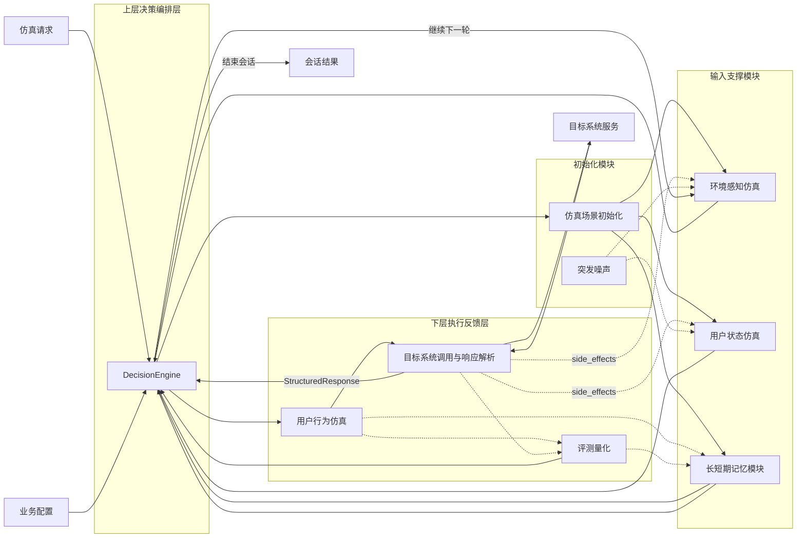

# Requirements Document

## Introduction

本文档定义智能座舱仿真系统 `iota` 的权威需求。系统以纯 Python 实现，目标是在多轮会话中模拟用户、环境与目标座舱系统之间的交互闭环，并输出可量化的评估结果。

系统统一划分为四个部分：

- 初始化模块：仿真场景初始化、突发噪声
- 输入支撑模块：环境感知仿真、用户状态仿真、长短期记忆模块
- 上层决策编排层：DecisionEngine
- 下层执行反馈层：用户行为仿真、目标系统调用与响应解析、评测量化

系统定义四条关键链路：

- `1. 仿真主链路`
- `2. 环境 & 用户反馈链路`
- `3. 量化评估链路`
- `4. 记忆更新链路`

## Canonical Data Definitions

### ScenarioInitialization

`ScenarioInitialization` 是全局唯一的场景初始化结果，三份文档均以该定义为准。

- `trip_goal`
  - `purpose`: 出行目的或任务目标
  - `destination`: 目标地点，可为空
  - `success_criteria`: 本次仿真的完成判据
- `origin`
  - `latitude`
  - `longitude`
  - `label`
- `occupants`
  - 乘员列表及角色信息
- `scene_config`
  - 场景类型、时间、设备能力、业务参数及仿真约束

### StructuredResponse

`StructuredResponse` 是目标系统调用后的唯一标准化响应结构。

- `response_status`: success / partial / failed / timeout
- `response_content`: 面向编排器和评测模块的结构化内容
- `completion_flag`: 当前会话是否满足结束条件
- `side_effects`: 对环境或用户状态产生的可观测影响
- `raw_payload`: 原始响应载荷
- `timestamp`

### SessionContext

`SessionContext` 是三份文档统一使用的会话上下文定义。

- `session_id`
- `status`: created / running / completed / aborted
- `turn_index`
- `max_turns`
- `initialization`: `ScenarioInitialization`
- `current_environment`
- `current_user_state`
- `memory`
- `last_behavior`
- `last_response`
- `last_evaluation`
- `history`

## System Flow



## Glossary

- **iota**：本系统名称，不再单独定义“iota 引擎”作为独立子系统。
- **仿真场景初始化**：主链路起点，生成统一的 `ScenarioInitialization`。
- **突发噪声**：可选扰动输入，只能影响环境感知仿真和用户状态仿真。
- **环境感知仿真**：维护舱外环境、交通参与者、舱内环境和车辆状态。
- **用户状态仿真**：维护用户人设、知识背景、身体状态和情绪状态。
- **长短期记忆模块**：维护个性化偏好、实时上下文窗口和知识库。
- **仿真编排决策器**：拉取上下文、生成策略、判断下一轮或结束。
- **用户行为仿真**：把当前轮策略转成用户动作。
- **目标系统调用与响应解析**：负责通信、接收响应并产出 `StructuredResponse`。
- **评测量化**：以用户行为与 `StructuredResponse` 为输入进行量化评估。

## Requirements

### Requirement 1: 仿真场景初始化

**User Story:** 作为仿真系统，我希望用统一格式初始化场景，以便所有模块共享同一套起点。

#### Acceptance Criteria

1. WHEN 系统接收到业务配置, THE System SHALL 进入仿真场景初始化。
2. THE 仿真场景初始化模块 SHALL 生成全局统一的 `ScenarioInitialization`。
3. THE `ScenarioInitialization` SHALL 至少包含 `trip_goal`、`origin`、`occupants` 和 `scene_config`。
4. THE 仿真场景初始化模块 SHALL 将初始化结果同时提供给环境感知仿真、用户状态仿真和长短期记忆模块。
5. THE 仿真场景初始化模块 SHALL 作为 `仿真主链路` 的起点。
6. THE 仿真场景初始化模块 SHALL NOT 直接生成用户行为、目标系统响应或评测结果。

### Requirement 2: 突发噪声

**User Story:** 作为仿真系统，我希望在初始化后的任意轮次注入扰动，以便覆盖真实世界中的非稳定因素。

#### Acceptance Criteria

1. THE 突发噪声模块 SHALL 支持 `交通事故`、`热点事件`、`个人突发` 和 `生活&工作` 四类扰动源。
2. WHEN 系统注入突发噪声, THE System SHALL 仅将扰动传递到环境感知仿真和用户状态仿真。
3. THE 突发噪声模块 SHALL NOT 直接修改 DecisionEngine、用户行为仿真、目标系统调用与响应解析或评测量化。
4. THE 突发噪声模块 SHALL 作为可选能力存在，而不是主链路的必经节点。
5. THE 突发噪声模块 SHALL 在第一版本中仅提供接口定义和 Mock 实现，不实现真实扰动逻辑。

### Requirement 3: 环境感知仿真

**User Story:** 作为仿真系统，我希望持续维护环境上下文，以便编排器获得完整的外部与车内状态。

#### Acceptance Criteria

1. THE 环境感知仿真模块 SHALL 覆盖 `舱外环境`、`交通参与者`、`舱内环境` 和 `车辆状态`。
2. WHEN 场景初始化完成, THE 环境感知仿真模块 SHALL 基于 `ScenarioInitialization` 建立当前环境。
3. WHEN `StructuredResponse.side_effects` 影响环境, THE 环境感知仿真模块 SHALL 通过 `环境 & 用户反馈链路` 刷新环境表示。
4. WHEN 突发噪声发生, THE 环境感知仿真模块 SHALL 接收扰动并反映到当前环境中。
5. THE 环境感知仿真模块 SHALL 在每轮中先于用户状态仿真完成更新。
6. THE 环境感知仿真模块 SHALL 将当前结果提供给用户状态仿真和 DecisionEngine。

### Requirement 4: 用户状态仿真

**User Story:** 作为仿真系统，我希望持续刻画用户状态，以便决策和行为符合人物设定与情境变化。

#### Acceptance Criteria

1. THE 用户状态仿真模块 SHALL 覆盖 `用户人设`、`知识背景`、`身体状态` 和 `情绪状态`。
2. WHEN 场景初始化完成, THE 用户状态仿真模块 SHALL 基于 `ScenarioInitialization` 建立初始用户状态。
3. THE 用户状态仿真模块 SHALL 在每轮中依赖环境感知仿真的当前输出作为前提条件。
4. WHEN 环境感知仿真完成当前轮更新, THE 用户状态仿真模块 SHALL 基于更新后的环境、突发噪声和 `StructuredResponse.side_effects` 更新当前用户状态。
5. THE 用户状态仿真模块 SHALL 将当前结果提供给 DecisionEngine。

### Requirement 5: 长短期记忆模块

**User Story:** 作为仿真系统，我希望保留长期偏好和当前上下文，以便后续轮次具备连续性。

#### Acceptance Criteria

1. THE 长短期记忆模块 SHALL 维护 `个性化偏好`、`实时上下文窗口` 和 `知识库`。
2. WHEN 场景初始化完成, THE 长短期记忆模块 SHALL 基于 `ScenarioInitialization` 载入初始记忆。
3. THE 长短期记忆模块 SHALL 向 DecisionEngine 提供可用记忆上下文。
4. THE 长短期记忆模块 SHALL 作为外部系统存在，通过异步接口接收更新请求。
5. THE 长短期记忆模块 SHALL 自行保证更新顺序的正确性，iota 系统只负责发送更新请求。
6. WHEN 用户行为仿真产生新的交互结果, THE System SHALL 异步发送更新请求到长短期记忆模块。
7. WHEN 评测量化产生新的评估结果, THE System SHALL 异步发送更新请求到长短期记忆模块。

### Requirement 6: DecisionEngine

**User Story:** 作为仿真系统，我希望由一个上层决策引擎按需获取上下文、生成当前轮策略，并决定是否进入下一轮。

#### Acceptance Criteria

1. THE DecisionEngine SHALL 按需获取环境感知仿真、用户状态仿真和长短期记忆模块的当前结果。
2. THE DecisionEngine SHALL 在内部具备 `情景理解与推理`、`需求解析与挖掘`、`长期规划与短期策略` 和 `用户意图推演` 四类能力。
3. THE DecisionEngine SHALL 产出当前轮策略与意图，并将结果提供给用户行为仿真。
4. WHEN `StructuredResponse` 返回, THE DecisionEngine SHALL 基于目标系统响应、评测结果、记忆状态和轮次约束决定继续下一轮还是结束会话。
5. THE DecisionEngine SHALL NOT 直接调用目标系统服务，也 SHALL NOT 直接产出评测量化结果。
6. THE DecisionEngine SHALL 负责会话级外层循环和单轮级内层执行的编排逻辑。

### Requirement 7: 用户行为仿真

**User Story:** 作为仿真系统，我希望把当前轮策略转成可执行的用户动作。

#### Acceptance Criteria

1. WHEN DecisionEngine完成当前轮策略生成, THE 用户行为仿真模块 SHALL 基于该结果生成行为表达。
2. THE 用户行为仿真模块 SHALL 支持 `语音（主要）`、`按键` 和 `触屏` 三类明确行为形式。
3. THE 用户行为仿真模块 SHALL 为 `手势` 保留扩展能力。
4. THE 用户行为仿真模块 SHALL 将行为结果提供给目标系统调用与响应解析模块。
5. THE 用户行为仿真模块 SHALL 通过 `量化评估链路` 向评测量化提供输入。
6. THE 用户行为仿真模块 SHALL 通过 `记忆更新链路` 向长短期记忆模块提供更新输入。

### Requirement 8: 目标系统调用与响应解析

**User Story:** 作为仿真系统，我希望把用户行为发送给目标系统并统一解析响应，以便形成执行闭环。

#### Acceptance Criteria

1. WHEN 用户行为仿真产生行为结果, THE 系统 SHALL 通过 `目标系统调用与响应解析` 向目标系统服务发送请求并接收响应。
2. THE `目标系统调用与响应解析` 模块 SHALL 输出统一的 `StructuredResponse`。
3. THE `StructuredResponse` SHALL 至少包含 `response_status`、`response_content`、`completion_flag`、`side_effects` 和 `timestamp`。
4. THE `目标系统调用与响应解析` 模块 SHALL 将 `StructuredResponse` 同时提供给 DecisionEngine、环境感知仿真、用户状态仿真和评测量化。
5. THE `目标系统调用与响应解析` 模块 SHALL 位于下层执行反馈层，且只能在用户行为之后执行。
6. THE 响应解析策略 SHALL 为：首先尝试按目标系统协议 schema 直接解析原始响应；如果解析失败或响应格式不符合预期，则使用 LLM 辅助归一化；如果两者都失败，则快速失败并中止会话。

### Requirement 9: 评测量化

**User Story:** 作为仿真系统，我希望把执行结果转成可量化指标，以便判断仿真是否合理、准确和及时。

#### Acceptance Criteria

1. THE 评测量化模块 SHALL 覆盖 `用户行为合理性`、`目标系统响应准确性`、`场景覆盖率` 和 `响应实时性` 四个维度。
2. THE 评测量化模块 SHALL 以用户行为仿真输出和 `StructuredResponse` 为输入。
3. THE 评测量化模块 SHALL 通过 `记忆更新链路` 把评估结果回传给长短期记忆模块。
4. THE 评测量化模块 SHALL 位于下层执行反馈层中的评测节点，而不是上层决策编排组件。
5. THE 评测量化模块 SHALL 在第一版本中仅提供接口定义和 Mock 实现，返回固定的评估结果。

### Requirement 10: 分层与主链路编排

**User Story:** 作为系统架构师，我希望系统按“初始化模块 -> 输入支撑模块 -> 上层决策编排层 -> 下层执行反馈层”的方式推进主链路。

#### Acceptance Criteria

1. THE System SHALL 提供 `DecisionEngine` 作为全局编排者和唯一的上层决策组件。
2. WHEN 仿真请求进入系统, THE `DecisionEngine` SHALL 基于业务配置启动仿真场景初始化。
3. THE System SHALL 按 `仿真场景初始化 -> 输入支撑模块 -> DecisionEngine -> 用户行为仿真 -> 目标系统调用与响应解析 -> 评测量化` 的主顺序推进。
4. WHEN 仿真场景初始化完成, THE System SHALL 把结果分别送入环境感知仿真、用户状态仿真和长短期记忆模块。
5. THE `DecisionEngine` SHALL 按需从输入支撑模块拉取当前所需上下文。
6. THE 下层执行反馈层 SHALL 负责动作落地、目标系统通信、响应解析和评测量化，而 SHALL NOT 决定是否进入下一轮。
7. WHEN `StructuredResponse` 返回, THE `DecisionEngine` SHALL 基于目标系统响应、评测结果、上下文状态和轮次约束决定继续下一轮还是结束会话。
8. THE System SHALL 保持 `初始化模块 -> 输入支撑模块 -> 上层决策编排层 -> 下层执行反馈层` 的分层关系。

### Requirement 11: 环境 & 用户反馈链路

**User Story:** 作为仿真系统，我希望目标系统响应能够反向影响环境和用户，以便形成闭环反馈。

#### Acceptance Criteria

1. WHEN `StructuredResponse.side_effects` 输出新的车辆状态或车内变化, THE System SHALL 通过 `环境 & 用户反馈链路` 回传给环境感知仿真。
2. WHEN `StructuredResponse.side_effects` 输出可能影响体验、认知或身体感受的结果, THE System SHALL 通过 `环境 & 用户反馈链路` 回传给用户状态仿真。
3. THE System SHALL 在下一次仿真编排决策前使用更新后的环境和用户状态。
4. THE 环境 & 用户反馈链路 SHALL NOT 直接跳过输入支撑模块写入上层决策结果。

### Requirement 12: 量化评估链路

**User Story:** 作为仿真系统，我希望把行为和结构化响应都纳入统一评估。

#### Acceptance Criteria

1. WHEN 用户行为仿真完成, THE System SHALL 通过 `量化评估链路` 把行为结果发送给评测量化模块。
2. WHEN `StructuredResponse` 生成完成, THE System SHALL 通过 `量化评估链路` 把响应结果发送给评测量化模块。
3. THE 量化评估链路 SHALL 连接下层执行反馈流程中的行为结果和结构化响应与评测量化，而不是替代主链路。

### Requirement 13: 记忆更新链路

**User Story:** 作为仿真系统，我希望把交互结果和评估结果沉淀到记忆中，以便后续轮次体现连续性。

#### Acceptance Criteria

1. WHEN 用户行为仿真产生新的行为结果, THE System SHALL 通过 `记忆更新链路` 更新长短期记忆模块。
2. WHEN 评测量化产生新的评估结果, THE System SHALL 通过 `记忆更新链路` 更新长短期记忆模块。
3. THE 更新后的长短期记忆模块 SHALL 在后续仿真编排决策中可见并可用。

### Requirement 14: 技术栈与实现约束

**User Story:** 作为系统架构师，我希望 `iota` 全部采用纯 Python 实现，并使用统一的数据模型和异步运行方式。

#### Acceptance Criteria

1. THE System SHALL 使用 Python 3.11+ 实现所有组件。
2. THE System SHALL 使用 asyncio 作为核心并发模型。
3. THE System SHALL 使用 FastAPI 提供 HTTP REST API。
4. THE System SHALL 使用 `websockets` 库实现 WebSocket 客户端连接管理。
5. THE WebSocket 连接 SHALL 为系统级单例，所有会话通过会话 ID 复用同一连接。
6. THE System SHALL 使用 Pydantic 进行数据验证和序列化。
7. THE System SHALL 使用 structlog 实现结构化异步日志。
8. THE System SHALL 直接集成 OpenAI 和 Anthropic Python SDK。
9. THE System SHALL 使用 orjson 进行高性能 JSON 序列化。
10. THE System SHALL 支持 pip 或 poetry 进行依赖管理。
11. THE System SHALL 支持 Linux、macOS 和 Windows。
12. THE System SHALL 采用快速失败策略，遇到错误立即中止会话，不实现复杂的错误恢复逻辑。

### Requirement 15: 系统名称、会话上下文与模块结构

**User Story:** 作为开发者，我希望系统名称、会话上下文和代码布局都保持全局唯一且一致。

#### Acceptance Criteria

1. THE System SHALL 统一使用 `iota` 作为系统名称。
2. THE System SHALL 在所有模块中统一使用本文档定义的 `SessionContext`。
3. THE System SHALL 负责会话生命周期管理，状态集合 SHALL 统一为 `created / running / completed / aborted`。
4. THE SessionManager SHALL 按单用户模式管理会话，每个用户的多轮交互复用同一个 session。
5. THE System SHALL 支持配置层级：全局配置（`~/.iota/config.toml`）、项目配置（`.iota/config.toml`）、运行时覆盖（`--config`）。
6. THE 配置合并策略 SHALL 为：运行时覆盖 > 项目配置 > 全局配置，采用深度合并，后者完全覆盖前者的同名键。
7. THE System SHALL 支持 Prompt 模板、上下文注入、错误分类和上下文持久化。
8. THE System SHALL 按以下完整模块结构组织代码：
   - `iota/__init__.py`
   - `iota/__main__.py`
   - `iota/cli/main.py`
   - `iota/cli/config.py`
   - `iota/api/app.py`
   - `iota/api/routes/simulation.py`
   - `iota/api/routes/health.py`
   - `iota/api/models.py`
   - `iota/core/config.py`
   - `iota/core/errors.py`
   - `iota/core/session_manager.py`
   - `iota/core/websocket_manager.py`
   - `iota/core/log_manager.py`
   - `iota/llm/service.py`
   - `iota/llm/providers/openai.py`
   - `iota/llm/providers/anthropic.py`
   - `iota/llm/prompts/environment.py`
   - `iota/llm/prompts/user_state.py`
   - `iota/llm/prompts/behavior.py`
   - `iota/llm/prompts/decision.py`
   - `iota/llm/prompts/response_parser.py`
   - `iota/simulation/decision_engine.py`
   - `iota/simulation/scenario.py`
   - `iota/simulation/noise.py`
   - `iota/simulation/evaluation.py`
   - `iota/simulation/engines/environment.py`
   - `iota/simulation/engines/user_state.py`
   - `iota/simulation/engines/behavior.py`
   - `iota/simulation/engines/memory.py`
   - `iota/simulation/engines/service_call.py`
   - `iota/models/context.py`
   - `iota/models/scenario.py`
   - `iota/models/environment.py`
   - `iota/models/user.py`
   - `iota/models/behavior.py`
   - `iota/models/response.py`
   - `iota/models/evaluation.py`
   - `iota/utils/async_helpers.py`
   - `iota/utils/json_utils.py`
9. THE 所有模块 SHALL 在同一 Python 进程中运行。
10. THE 模块之间 SHALL 通过直接函数调用交互。
11. THE 所有 I/O 操作 SHALL 使用 asyncio 异步实现。

### Requirement 16: 构建与部署

**User Story:** 作为运维人员，我希望系统有清晰的开发和生产部署方式。

#### Acceptance Criteria

1. THE System SHALL 支持开发环境构建：
   - `python -m venv .venv`
   - `pip install -e ".[dev]"`
   - `python -m iota start --config config.toml`
   - `uvicorn iota.api.app:app --reload --port 8000`
2. THE System SHALL 支持生产环境构建：
   - `pip install -e .`
   - `uvicorn iota.api.app:app --host 0.0.0.0 --port 8000 --workers 4`
   - `gunicorn iota.api.app:app -w 4 -k uvicorn.workers.UvicornWorker --bind 0.0.0.0:8000`
3. THE System SHALL 只需要 Python 运行时，无需其他语言工具链。
4. THE System SHALL 提供 Docker 镜像用于容器化部署。

## Correctness Properties

### Property 1: 主链路执行顺序

```text
FORALL cycle IN simulation_cycles:
  cycle.orchestration_started == TRUE IMPLIES
    cycle.environment_ready == TRUE AND
    cycle.user_state_ready == TRUE AND
    cycle.memory_ready == TRUE

FORALL cycle IN simulation_cycles:
  cycle.behavior_started == TRUE IMPLIES
    cycle.orchestration_ready == TRUE

FORALL cycle IN simulation_cycles:
  cycle.service_call_started == TRUE IMPLIES
    cycle.behavior_ready == TRUE

FORALL cycle IN simulation_cycles:
  cycle.evaluation_started == TRUE IMPLIES
    cycle.behavior_ready == TRUE AND
    cycle.structured_response_ready == TRUE
```

### Property 2: 反馈闭环成立

```text
FORALL cycle IN simulation_cycles WHERE cycle.number > 1:
  cycle.environment_input INCLUDES previous_cycle.structured_response.side_effects OR cycle.noise_effects OR initial_scene_state

FORALL cycle IN simulation_cycles WHERE cycle.number > 1:
  cycle.user_state_input INCLUDES current_cycle.environment_output OR previous_cycle.structured_response.side_effects OR cycle.noise_effects
```

### Property 3: 评估依赖执行结果

```text
FORALL cycle IN simulation_cycles:
  cycle.evaluation_started == TRUE IMPLIES
    cycle.behavior_ready == TRUE AND
    cycle.structured_response_ready == TRUE
```

### Property 4: 记忆在轮次间连续

```text
FORALL cycle IN simulation_cycles WHERE cycle.number > 1:
  cycle.memory_input == update(
    previous_cycle.memory_output,
    previous_cycle.behavior_output,
    previous_cycle.evaluation_output
  )
```

### Property 5: 噪声只能影响输入支撑模块

```text
FORALL noise_event IN injected_noises:
  noise_event.affects SUBSET_OF ["environment", "user_state"] AND
  noise_event.direct_targets EXCLUDES ["orchestrator", "behavior", "service_call", "evaluation"]
```
