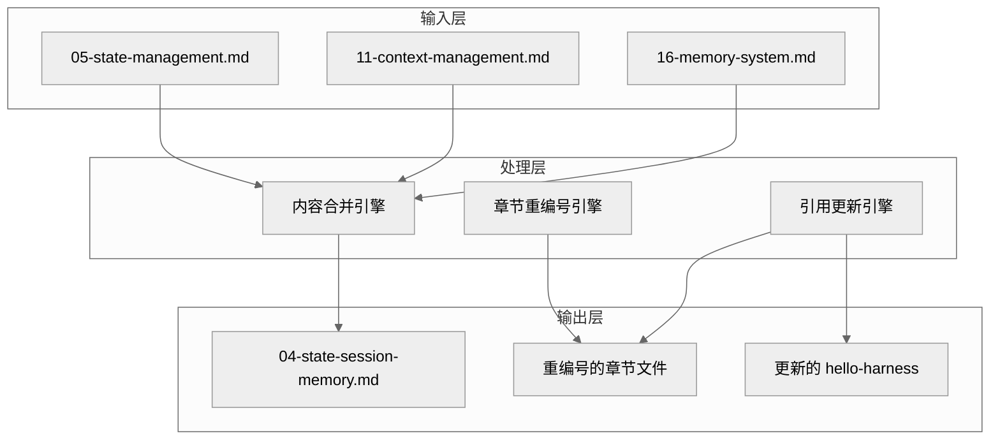
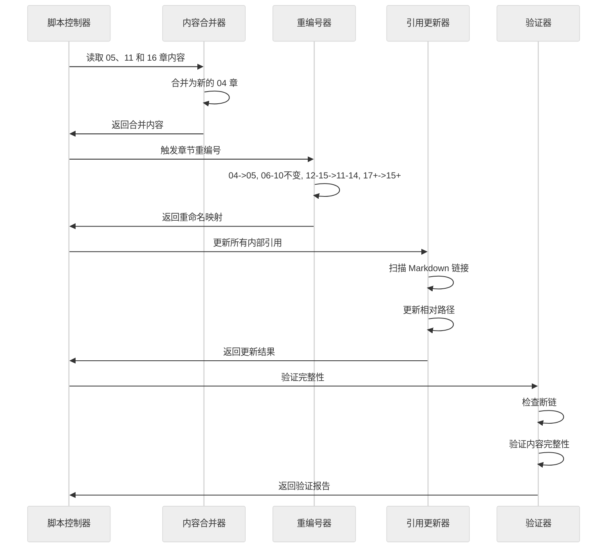

# 设计文档：状态与记忆章节合并

## 概述

本设计文档定义了一个文档重构特性的技术实现方案，该特性将四个 AI Coding CLI 项目（hello-claude-code、hello-codex、hello-gemini-cli、hello-opencode）中的状态管理（第 5 章）、上下文管理（第 11 章）和记忆系统（第 16 章）合并为统一的第 4 章，并相应地重新编号所有受影响的章节，同时更新 hello-harness 中的横向对比分析。

### 设计目标

1. 提供统一的状态/上下文/会话/记忆机制视图，消除概念分割
2. 保持文档完整性，不丢失任何技术细节
3. 确保所有内部引用和链接正确更新
4. 维护 Jekyll 构建系统兼容性
5. 保持中文文档语言一致性

### 范围

- 四个项目目录：hello-claude-code、hello-codex、hello-gemini-cli、hello-opencode
- 横向分析目录：hello-harness
- 受影响章节：04-tool-system.md 及之后的所有章节
- 构建系统：Jekyll (pages/_config.yml)

## 架构

### 系统架构图



### 处理流程



## 组件和接口

### 核心组件

#### 1. 内容合并器 (ContentMerger)

```typescript
interface ContentMerger {
  /**
   * 合并三个章节的内容
   * @param stateContent - 05-state-management.md 的内容
   * @param contextContent - 11-context-management.md 的内容
   * @param memoryContent - 16-memory-system.md 的内容
   * @returns 合并后的新章节内容
   */
  merge(
    stateContent: string, 
    contextContent: string, 
    memoryContent: string
  ): MergedContent
}

interface MergedContent {
  frontMatter: FrontMatter
  sections: Section[]
  fullContent: string
}

interface FrontMatter {
  layout: string
  title: string
}

interface Section {
  level: number
  title: string
  content: string
  subsections: Section[]
}
```

#### 2. 章节重编号器 (ChapterRenumberer)

```typescript
interface ChapterRenumberer {
  /**
   * 生成重编号映射
   * @param projectPath - 项目目录路径
   * @returns 旧文件名到新文件名的映射
   */
  generateRenumberingMap(projectPath: string): RenumberingMap
  
  /**
   * 执行文件重命名
   * @param map - 重编号映射
   * @returns 重命名结果
   */
  executeRenaming(map: RenumberingMap): RenameResult
}

type RenumberingMap = Map<string, string>

interface RenameResult {
  success: boolean
  renamed: string[]
  errors: RenameError[]
}

interface RenameError {
  oldPath: string
  newPath: string
  error: string
}
```

#### 3. 引用更新器 (ReferenceUpdater)

```typescript
interface ReferenceUpdater {
  /**
   * 扫描并更新所有 Markdown 文件中的引用
   * @param projectPath - 项目目录路径
   * @param renumberingMap - 重编号映射
   * @returns 更新结果
   */
  updateReferences(
    projectPath: string,
    renumberingMap: RenumberingMap
  ): UpdateResult
}

interface UpdateResult {
  filesScanned: number
  filesUpdated: number
  linksUpdated: number
  brokenLinks: BrokenLink[]
}

interface BrokenLink {
  file: string
  line: number
  originalLink: string
  reason: string
}
```

#### 4. 验证器 (Validator)

```typescript
interface Validator {
  /**
   * 验证重构后的文档完整性
   * @param projectPath - 项目目录路径
   * @returns 验证报告
   */
  validate(projectPath: string): ValidationReport
}

interface ValidationReport {
  deletedFiles: string[]
  renamedFiles: RenameMapping[]
  updatedLinks: LinkUpdate[]
  brokenLinks: BrokenLink[]
  contentIntegrity: ContentIntegrityCheck
}

interface RenameMapping {
  oldName: string
  newName: string
}

interface LinkUpdate {
  file: string
  oldLink: string
  newLink: string
}

interface ContentIntegrityCheck {
  allKeyTopicsCovered: boolean
  missingTopics: string[]
}
```

## 数据模型

### 章节编号映射规则

```typescript
/**
 * 章节重编号规则
 * 
 * 当前: 01, 02, 03, 04-tool-system, 05-state-management, 06-extension-mcp, ..., 
 *       10-session-resume, 11-context-management, 12-prompt-system, ...,
 *       15-plugin-system, 16-memory-system, 17-sdk-transport, ...
 * 
 * 目标: 01, 02, 03, 04-state-session-memory(新), 05-tool-system, 06-extension-mcp, ..., 
 *       10-session-resume, 11-prompt-system, ..., 14-plugin-system, 15-sdk-transport, 16+...
 */
const RENUMBERING_RULES = {
  // 04-tool-system.md -> 05-tool-system.md (向后移动一位)
  '04': '05',
  
  // 05 删除（合并到新的 04）
  // 06-10 保持不变
  
  // 11 删除（合并到新的 04）
  // 12-15 向前移动一位 (11-14)
  '12': '11', '13': '12', '14': '13', '15': '14',
  
  // 16 删除（合并到新的 04）
  // 17+ 向前移动两位 (15+)
  '17': '15', '18': '16', '19': '17', '20': '18', '21': '19',
  '22': '20', '23': '21', '24': '22', '25': '23', '26': '24',
  '27': '25', '28': '26', '29': '27', '30': '28'
} as const

/**
 * 获取新的章节编号
 */
function getNewChapterNumber(oldNumber: string): string {
  return RENUMBERING_RULES[oldNumber] || oldNumber
}
```

### 合并内容结构

```typescript
/**
 * 新章节的内容结构
 */
interface NewChapterStructure {
  frontMatter: {
    layout: 'content'
    title: string  // 例如："Claude Code 的状态、会话与记忆系统"
  }
  
  sections: [
    {
      title: '概述'
      content: '统一介绍状态管理、上下文管理和记忆系统的关系'
    },
    {
      title: '实现机制'
      subsections: [
        { title: '状态管理', content: '来自原 05 章' },
        { title: '上下文管理', content: '来自原 11 章' },
        { title: '记忆系统', content: '来自原 16 章' }
      ]
    },
    {
      title: '实际使用模式'
      content: '如何在实际场景中使用状态、上下文和记忆'
    },
    {
      title: '代码示例'
      content: '保留所有原有代码示例'
    },
    {
      title: '关键函数清单'
      content: '合并三章的函数清单'
    },
    {
      title: '代码质量评估'
      content: '综合评估'
    }
  ]
}
```

### 链接模式识别

```typescript
/**
 * Markdown 链接模式
 */
const LINK_PATTERNS = {
  // 相对路径链接: [text](./05-state-management.md)
  relative: /\[([^\]]+)\]\(\.\/(\d{2})-([^)]+)\.md\)/g,
  
  // 绝对路径链接: [text](/hello-claude-code/05-state-management.md)
  absolute: /\[([^\]]+)\]\((\/[^)]+\/(\d{2})-([^)]+)\.md)\)/g,
  
  // 锚点链接: [text](./05-state-management.md#section)
  withAnchor: /\[([^\]]+)\]\(\.\/(\d{2})-([^)]+)\.md#([^)]+)\)/g
} as const

/**
 * 更新链接
 */
function updateLink(
  link: string,
  renumberingMap: RenumberingMap
): string {
  // 提取章节编号
  const match = link.match(/(\d{2})-([^.#)]+)/)