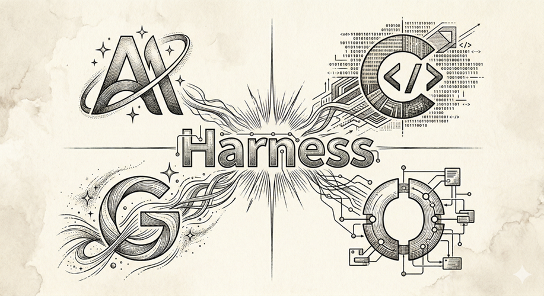

<!-- markdownlint-disable MD060 -->
# hello-olleh

`hello-olleh` 是一个面向 AI Coding CLI 的源码阅读与对比分析工作区。仓库同时保存上游源码快照和对应的分析产物，用于理解不同工具在启动链路、Agent 调度、工具系统、状态管理与扩展机制上的实现差异。

## 分析对象

| 工程 | 版本 | 语言/框架 | 架构特点 |
|:-----|:-----|:----------|:---------|
| [claude-code](claude-code) | v2.1.87（反编译） | TypeScript / React | src/ 目录，React TUI，REPL 交互，Hooks 生命周期 |
| [codex](https://github.com/openai/codex.git) | rust-v0.118.0 | **Rust**（86 crate）+ TypeScript SDK | Rust workspace 为运行时中心，TS 只做分发/封装 |
| [gemini-cli](https://github.com/google-gemini/gemini-cli.git) | v0.36.0 | TypeScript monorepo | packages/core 内核 + packages/cli（TUI/Ink）+ SDK + A2A server |
| [opencode](https://github.com/anomalyco/opencode.git) | v1.3.2 | **Bun** + Effect-ts | Hono Server + SQLite Durable State，A/B/C 三层文档结构 |

## 目录说明

| 路径 | 用途 |
|:-----|:-----|
| `claude-code/`, `codex/`, `gemini-cli/`, `opencode/` | 上游源码目录，分析输入 |
| `hello-claude-code/`, `hello-codex/`, `hello-gemini-cli/`, `hello-opencode/` | 分析输出目录，按主题拆分为 Markdown 文档 |
| `hello-harness/` | Harness Engineering 框架分析 |

## 附录

- `Claude Code` + `claude-opus-4.6[1m]`
- `OpenAI Codex` + `gpt-5.4` `xhigh` `fast`
- `Gemini CLI` + `gemini-3.1-pro-preview`
- `OpenCode` + `MiniMax-M2.7`

提示词按角色和目标拆分为独立文件，存放于 `prompts/` 目录。

### generator prompt

| 文件 | 目标仓库 |
|:------|:----------|
| [prompts/generator_codex.prompt](prompts/generator_codex.prompt) | `codex/` → `hello-codex/` |
| [prompts/generator_gemini-cli.prompt](prompts/generator_gemini-cli.prompt) | `gemini-cli/` → `hello-gemini-cli/` |
| [prompts/generator_opencode.prompt](prompts/generator_opencode.prompt) | `opencode/` → `hello-opencode/` |

每条 prompt 包含：强制输出文件清单（9 个主题独立文件）、技术栈特化分析要求、现有文档读取与合并策略。

### evaluator prompt

| 文件 | 评估目标 |
|:------|:----------|
| [prompts/evaluator_codex.prompt](prompts/evaluator_codex.prompt) | `hello-codex/` |
| [prompts/evaluator_gemini-cli.prompt](prompts/evaluator_gemini-cli.prompt) | `hello-gemini-cli/` |
| [prompts/evaluator_opencode.prompt](prompts/evaluator_opencode.prompt) | `hello-opencode/` |

每条 prompt 包含六维结构化评分表，仅对得分 ≤ 3 的维度修正，以 diff 格式标注改动位置。
