% Claude Code 源码深度解析
% 基于 Claude Code v2.1.87（反编译版）
% feuyeux

# Claude Code 源码深度解析

*基于 Claude Code v2.1.87（反编译版）*

---

## `src` 工程架构全景

# `src` 工程架构全景

本篇给出 `src/` 目录的分层结构、主执行链路和核心抽象，用于建立整套源码的总地图。

## 1. 架构分层图

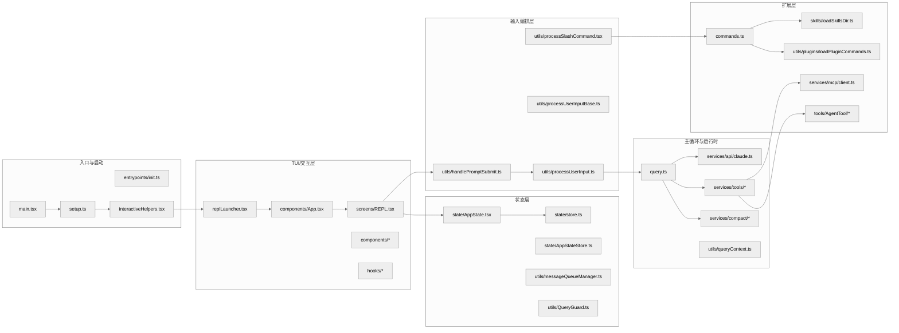

## 2. 架构主线

这张图可以按三段主线理解：

1. `Entry` 负责把进程带到可运行状态。
2. `UI / State / Input` 负责把交互态输入转成运行时消息与上下文。
3. `Runtime / Extension` 负责模型请求、工具执行、扩展接入与平台能力汇聚。

最短主线可以概括为：

> 入口层拉起会话，REPL 层接收输入，`query()` 驱动模型与工具，扩展层为命令和工具总线持续注入能力。

## 3. 目录结构

### 3.1 入口层

关键文件：

- `src/main.tsx`
- `src/setup.ts`
- `src/entrypoints/init.ts`
- `src/interactiveHelpers.tsx`

职责：

- 解析 CLI 语义与启动模式。
- 初始化 feature flags、环境变量、信任边界、遥测、插件/技能预注册。
- 构建首个 `AppState`。
- 决定走交互 REPL、非交互 print/SDK、恢复会话、远程连接还是其他分支。

核心判断：

- 这层不只是“把参数传进去”。
- 它会主动做性能优化，例如顶层 side effect 预取、延迟预取、信任后再做的上下文加载。
- 它会决定系统的“运行人格”：交互式、非交互式、远程、Agent、worktree、tmux、assistant mode 等。

### 3.2 UI 层

关键文件：

- `src/replLauncher.tsx`
- `src/components/App.tsx`
- `src/screens/REPL.tsx`
- `src/hooks/*`
- `src/components/*`

职责：

- 管理终端界面渲染。
- 挂接 Providers、统计器、对话框、通知、输入框。
- 把“用户输入”和“query 主循环”接到一起。
- 管理前台会话、后台任务、远程会话、收件箱、邮箱桥接等交互行为。

一个非常重要的事实：

`REPL.tsx` 不是纯视图层，而是“交互控制器”。它内部同时做了：

- 工具池与命令池合并。
- `onSubmit` 到 `handlePromptSubmit` 的桥接。
- `onQueryImpl` 到 `query()` 的驱动。
- 流式消息落地、进度消息替换、背景会话切换、队列调度、空闲通知等。

### 3.3 状态层

关键文件：

- `src/state/store.ts`
- `src/state/AppState.tsx`
- `src/state/AppStateStore.ts`
- `src/utils/messageQueueManager.ts`
- `src/utils/QueryGuard.ts`

职责：

- 保存整个 REPL 运行时状态。
- 提供 React 上下文订阅与外部订阅能力。
- 管理输入队列与 query 活跃状态。

这层的设计思想不是 Redux 风格“重 reducer”，而是：

- 用非常薄的 store 实现高性能订阅。
- 把复杂逻辑分散到 hooks 与 runtime helper。
- 保证同一套状态机制既能服务 UI，也能服务工具、Agent、SDK/非交互路径。

### 3.4 输入编排层

关键文件：

- `src/utils/handlePromptSubmit.ts`
- `src/utils/processUserInput/processUserInput.ts`
- `src/utils/processUserInput/processSlashCommand.tsx`

职责：

- 解析 prompt/bash/slash 三种输入。
- 处理图片、附件、粘贴内容、动态技能提示。
- 决定是否直接本地执行、是否入队、是否进入 query。
- 把 `/command` 的 `allowedTools / model / effort / shouldQuery` 结果反向注入主链路。

### 3.5 主循环与请求层

关键文件：

- `src/query.ts`
- `src/services/api/claude.ts`
- `src/services/tools/toolOrchestration.ts`
- `src/services/tools/toolExecution.ts`
- `src/services/compact/*`

职责：

- 执行多轮会话推理。
- 构建发送给模型的消息、系统提示词和工具 schema。
- 在收到 `tool_use` 时执行工具，再把 `tool_result` 喂回下一轮。
- 在上下文过长时做多级压缩与恢复。
- 在错误、fallback、token budget、stop hooks、MCP 异常场景下继续维持会话一致性。

这个层是全工程的“内核”。

### 3.6 扩展层

关键文件：

- `src/commands.ts`
- `src/skills/loadSkillsDir.ts`
- `src/utils/plugins/loadPluginCommands.ts`
- `src/services/mcp/client.ts`
- `src/tools/AgentTool/*`

职责：

- 命令扩展：让 `/xxx` 能从内建命令、插件命令、技能命令、工作流命令动态合并。
- 工具扩展：让模型工具既能来自内建工具，也能来自 MCP server。
- Agent 扩展：让模型能启动另一个模型执行单元作为子代理。

## 4. 为什么 `main.tsx`、`REPL.tsx`、`query.ts` 特别大

这是这套工程的第一个阅读难点。它们大，不是因为“代码组织差”，而是因为它们处在三个真正的汇聚点：

### `src/main.tsx`

它汇聚了：

- CLI 参数解析
- 预取策略
- 信任/权限模式
- 启动模式分流
- 插件/技能/agent 预注册
- REPL 启动

### `src/screens/REPL.tsx`

它汇聚了：

- 输入框行为
- 队列处理
- query 事件消费
- UI 反馈
- 背景任务与远程会话
- 记忆、消息回放、恢复、通知

### `src/query.ts`

它汇聚了：

- 上下文裁剪
- API 调用
- streaming 事件解释
- tool_use 处理
- 错误恢复
- 递归继续

从架构上说，这三个文件分别对应：

- 入口编排器
- 交互控制器
- 对话执行引擎

## 5. 工程中的四个统一抽象

## 5.1 `Message`

消息不是单一的“用户/助手”两类，而是一组统一运行时事件。

它至少承载：

- `user`
- `assistant`
- `progress`
- `attachment`
- `system`
- `tombstone`
- `tool_use_summary`

好处：

- UI 渲染、transcript 持久化、query 递归、工具执行都可以围绕同一消息总线工作。

代价：

- 需要接受“很多系统信号也长得像消息”这一事实。

## 5.2 `Tool`

`src/Tool.ts` 里的 Tool 不是简单函数，它是一份完整能力定义，通常包含：

- 名称与别名
- `inputSchema` / `outputSchema`
- 描述与 prompt 展示逻辑
- 并发安全判断
- 输入校验
- 调用函数
- 权限相关元信息

这使得工具不仅能被调用，还能被：

- 注入系统提示词
- 拼装成 API tool schema
- 做权限判定
- 做并发批处理
- 做结果裁剪与格式化

## 5.3 `Command`

命令系统把内建命令、技能命令、插件命令统一成 `Command` 抽象。一个命令既可以：

- 直接本地执行
- 返回消息并继续 query
- 覆盖当前 turn 的 `allowedTools / model / effort`

所以 `/xxx` 本质上是“进入主循环前的一层 DSL”。

## 5.4 `ToolUseContext`

这是全项目最关键的运行时对象之一，位于 `src/Tool.ts:158` 附近。它把下面这些东西绑到一起：

- 当前 tools/commands/mcpClients
- 当前 model/thinkingConfig
- `abortController`
- `readFileState`
- `getAppState / setAppState`
- 消息数组
- in-progress tool IDs
- response length、stream mode、notification 等 UI/统计回调

可以把它理解成：

> “一次 query 及其子工具执行的上下文宇宙”

## 6. 架构上最关键的三条主线

## 6.1 启动主线

`main.tsx -> setup.ts -> interactiveHelpers.tsx -> replLauncher.tsx -> REPL.tsx`

它解决的问题是：

- 什么时候读取安全敏感上下文。
- 什么时候弹 trust/onboarding。
- 什么时候创建 Ink root。
- 什么时候再启动延迟预取。

## 6.2 输入主线

`PromptInput -> handlePromptSubmit -> processUserInput -> processSlashCommand/processTextPrompt -> onQuery`

它解决的问题是：

- 用户现在输入的到底是什么模式。
- 如果当前 query 正在运行，要不要排队、要不要打断。
- 如果是 slash command，要不要本地执行还是进入模型。

## 6.3 请求主线

`onQueryImpl -> query() -> callModel -> tool_use -> runTools -> query() 继续`

它解决的问题是：

- 模型请求如何构造。
- 工具结果如何回流。
- 上下文过长、输出超限、权限阻塞时如何恢复。

## 7. 分层间依赖关系的设计特点

## 7.1 不是“严格单向依赖”，而是“受控汇聚”

例如：

- `REPL.tsx` 会直接感知 query、队列、任务、bridge、mailbox。
- `main.tsx` 会直接引入大量服务与工具初始化逻辑。

这说明项目追求的是：

- 关键路径少跳转
- 启动与运行时成本可控
- 编译期 dead-code elimination 友好

而不是学院式纯洁分层。

## 7.2 大量 feature flag 参与了架构成形

代码里的 `feature('KAIROS')`、`feature('COORDINATOR_MODE')`、`feature('CONTEXT_COLLAPSE')` 等并不是简单开关。

它们直接决定：

- 模块是否懒加载
- 字符串是否进入 bundle
- 功能是否存在于当前发行版
- 某些依赖是否会造成循环引用

所以这套架构实际上是“基础骨架 + 多套可裁剪能力组合”。

## 7.3 工程非常在意缓存稳定性

大量代码会为了 prompt cache 稳定而做出看似啰嗦的处理，例如：

- 避免随机临时文件路径污染工具描述。
- 在 fork subagent 时继承父系统提示词与工具数组，追求 cache-identical prefix。
- 通过 prompt cache break detection 监控 cache read 是否异常下降。

这说明这套系统把“高上下文 Agent 成本控制”当成一等问题。

## 7.4 `0402.md` 里的规模数字应按运行时口径理解

`doc/0402.md` 里那组“`53` 个核心工具 / `87` 个 slash command / `148` 个 UI 组件 / `87` 个 hooks”的价值，不在于给源码树做文件统计，而在于指出：

- Claude Code 的能力面有几套非常明确的注册表。
- 这些数字描述的是某个 build / runtime slice，而不是当前反编译仓库里的原始文件数。

代码里最明确的两个“规模口径锚点”是：

- `src/tools.ts#getAllBaseTools()`：内建工具总表，后续再由 `getTools()`、deny rule、simple mode、REPL mode 继续裁剪。
- `src/commands.ts#COMMANDS()`：内建 slash command 注册表，之后 `getCommands()` 还会再并入 skill dir、bundled skills、plugin commands。

这意味着：

- “核心工具数”对应的是工具注册表，不是 `src/tools/**` 目录下有多少文件。
- “slash command 数”对应的是命令注册表，不是 `src/commands/**` 下有多少目录。

而 UI 与 hooks 的情况更分散：

- UI 能力分布在 `src/components/*`、`src/screens/*`、`src/ink/*`。
- hooks 分布在 `src/hooks/*`，但当前反编译树里还混有 wrapper、shim、lazy-loader 与部分生成产物。

因此 `0402.md` 里的这组数字更适合被理解为：

> Claude Code 在某个产品构建切面上的能力规模快照，而不是这份 reverse-engineered 仓库的源码文件快照。

## 7.5 “三层门控”在代码里就是注册表层裁剪

`0402.md` 提到的“三层门控”在源码里不是抽象说法，而是直接体现在命令和工具注册表上。

### 编译时门控

最外层是 build-time `feature('...')`：

- `src/tools.ts` 里大量工具通过 `feature('HISTORY_SNIP')`、`feature('UDS_INBOX')`、`feature('WORKFLOW_SCRIPTS')` 等决定是否进入 `getAllBaseTools()`。
- `src/commands.ts` 里 `/ultraplan`、`/bridge`、`/voice`、`/buddy`、`/peers` 等命令也都先过一层 `feature(...)`。
- `src/main.tsx` 里 `KAIROS`、`COORDINATOR_MODE`、`BRIDGE_MODE` 等模块甚至在 import 层就被 dead-code elimination 裁掉。

这一层决定的是：

- 功能是否进 bundle
- 字符串和模块是否存在
- 外部构建里是不是连壳都没有

### 用户类型门控

第二层是 `process.env.USER_TYPE === 'ant'`：

- `src/tools.ts` 里 `ConfigTool`、`TungstenTool`、`REPLTool` 等是 ant-only。
- `src/commands.ts` 里 `INTERNAL_ONLY_COMMANDS` 只有 ant 用户才会并入可见命令表。
- `src/tools/AgentTool/AgentTool.tsx` 里 remote isolation 的 schema 说明也带有 ant-only 分支。

这一层决定的是：

- 同一份代码在内部用户与外部用户面前暴露不同能力面
- 某些能力在外部构建中即便保留了结构，也不会成为可见产品面

### 远程配置门控

第三层是 GrowthBook / Statsig 远程门控：

- `src/main.tsx` 启动时会初始化 `GrowthBook`。
- 运行时大量逻辑通过 `getFeatureValue_CACHED_MAY_BE_STALE('tengu_*')` 或 `checkStatsigFeatureGate_CACHED_MAY_BE_STALE(...)` 决定可见性与行为。
- 典型例子包括：
  - `/ultrareview` 依赖 `tengu_review_bughunter_config`
  - bridge 轮询与版本约束依赖 `tengu_bridge_poll_interval_config`、`tengu_bridge_min_version`
  - coordinator scratchpad 依赖 `tengu_scratch`
  - ant 模型别名覆写依赖 `tengu_ant_model_override`

因此同一份源码的真实能力面并不是单值，而是：

> build-time 裁剪 + 用户类型裁剪 + 远程配置裁剪 共同决定的结果。

`tengu_*` 也是当前树里最稳定、最密集的内部命名痕迹。与其把这些能力理解成一组零散彩蛋，不如把它们理解成被多层门控包裹的“条件性子系统”。

## 8. 关键源码锚点

首先可建立以下锚点：

| 主题 | 代码锚点 | 为什么重要 |
| --- | --- | --- |
| 入口前置 side effects | `src/main.tsx:1-20` | 解释为什么启动前就做 profile / keychain / MDM 预取 |
| 延迟预取 | `src/main.tsx:382-431` | 解释首屏后再做哪些后台工作 |
| setup 主逻辑 | `src/setup.ts:56-381` | 解释 cwd、hooks、worktree、prefetch、started beacon |
| REPL 启动 | `src/replLauncher.tsx:12-21` | 解释 App + REPL 的装配关系 |
| App providers | `src/components/App.tsx` | 解释 Provider 包装层 |
| ToolUseContext | `src/Tool.ts:158-260` | 理解后续所有工具与 query 代码 |
| REPL 查询接线 | `src/screens/REPL.tsx:2661-2803` | 交互路径中的 query 核心入口 |
| query 主循环 | `src/query.ts:241-460` | 理解请求前半段状态机 |
| tool batch 执行 | `src/query.ts:1363-1409` | 理解 tool_use 如何回流 |
| 请求构造 | `src/services/api/claude.ts:1358-1833` | 理解系统提示词、缓存、beta header、streaming 请求 |

## 9. 源码阅读顺序

源码阅读可按以下顺序展开：

1. 将 `main.tsx` 作为“启动 orchestrator”阅读，先建立分支结构，再补细节。
2. 将 `REPL.tsx` 先聚焦在三段：初始化、`onSubmit`、`onQueryImpl`。
3. 继续阅读 `query.ts`，把它当作状态机而不是普通函数。
4. 最后回到 `tools.ts`、`commands.ts`、`loadSkillsDir.ts`、`AgentTool.tsx` 理解扩展体系。

## 10. 总结

`src` 的架构核心不是目录，而是一个统一运行时：

- `main.tsx` 负责把系统带到可运行状态。
- `REPL.tsx` 负责把交互接入运行时。
- `query.ts` 负责驱动模型与工具的多轮协作。
- `Tool / Command / AppState / Message / ToolUseContext` 则构成了整个系统共享的协议层。

后续的启动、请求、工具、Agent 与 MCP 机制都围绕这组主线展开。

## 启动流程详解

# 启动流程详解

本篇拆解 Claude Code CLI 从进程启动到会话可交互之间的阶段划分、trust 边界和交互/非交互分流。

## 1. 总体时序图

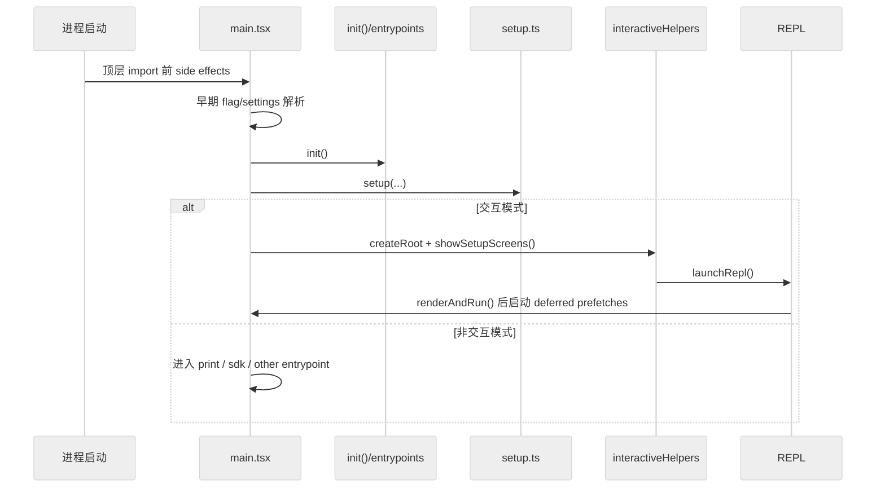

## 2. 分析维度

启动链路可按三个维度理解：

1. 哪些事情必须在首屏之前完成，哪些可以延后。
2. 哪些阶段是为了安全边界，哪些阶段是为了体验和性能。
3. 为什么同样是“启动”，交互模式和非交互模式的路径差这么多。

## 3. 阶段 0：比普通 import 更早的预取

关键代码：`src/main.tsx:1-20`

这里最值得注意的是顶部注释和三个顶层 side effect：

- `profileCheckpoint('main_tsx_entry')`
- `startMdmRawRead()`
- `startKeychainPrefetch()`

它们在其余重型 imports 之前执行，意图非常明确：

1. 先打启动性能埋点。
2. 尽早启动 MDM 读取。
3. 尽早启动 keychain/API key 读取。

这意味着启动团队已经观察到：

- 模块求值本身就很重。
- 某些平台相关读取是阻塞型的。
- 如果等到后面需要用时再同步读取，会拖慢首屏或 trust 后处理。

### 3.1 MDM 是什么

这里的 `MDM` 指的是 `Mobile Device Management`，也就是企业设备管理/托管配置。

在这个项目里，它不是“普通用户设置”，而是“操作系统层面的企业托管策略来源”，用于让公司 IT 或管理员统一下发 Claude Code 的受管配置。

- macOS 读取 `com.anthropic.claudecode` 的 managed preferences，来源是 `/Library/Managed Preferences/` 下的 MDM profile。
- Windows 读取注册表策略项：`HKLM\\SOFTWARE\\Policies\\ClaudeCode`，以及更低优先级的 `HKCU\\SOFTWARE\\Policies\\ClaudeCode`。
- Linux 没有对应的 OS 级 MDM 机制，这里退化为读取 `/etc/claude-code/managed-settings.json`。

这个系统的重点是“受管设置优先于普通本地配置”。源码里的优先级大致是：

- remote managed settings
- HKLM / macOS plist
- `managed-settings.json`
- HKCU

所以 `startMdmRawRead()` 的含义不是“提前读一个无关元数据”，而是：

1. 尽早启动企业策略读取。
2. 让 `plutil` / `reg query` 这些子进程和后面的重型 import 并行。
3. 避免第一次真正读取 settings 时再同步阻塞。

### 3.2 工程含义

体现了两个工程判断：

- 启动性能已经细化到“几十毫秒级”的竞争。
- `main.tsx` 被当成启动编排器，而不是单纯入口文件。

## 4. 阶段 1：早期 settings / entrypoint 判定

关键代码：

- `src/main.tsx:498-516` `eagerLoadSettings()`
- `src/main.tsx:517-540` `initializeEntrypoint()`

### 4.1 为什么要“提前加载 settings”

`eagerLoadSettings()` 会在 `init()` 之前解析：

- `--settings`
- `--setting-sources`

原因是这些设置会影响后续初始化本身。如果等到后面再加载，会出现：

- 初始化已经按默认设置走完。
- 之后才发现真实 settings 需要不同策略。

源码注释明确说明了这一点：要让 settings 从初始化一开始就生效。

### 4.2 entrypoint 的真正用途

`initializeEntrypoint()` 会根据：

- 是否 `mcp serve`
- 是否 GitHub Action
- 是否交互模式

设置 `CLAUDE_CODE_ENTRYPOINT`，用于后续：

- 遥测归因
- 行为分流
- 某些上下文或权限逻辑的区分

这不是一个普通字符串，而是“本次运行的身份标签”。

## 5. 阶段 2：`init()` 做基础初始化

关键文件：`src/entrypoints/init.ts`

虽然本轮主分析更多聚焦 `main.tsx` / `setup.ts`，但启动链里 `init()` 是必经层。它通常负责：

- 基础环境初始化。
- 遥测/全局状态基础搭建。
- 某些必须在 setup 之前完成的全局准备。

阅读上可以把它理解成：

> “真正进入业务启动前的 runtime bootstrap”

## 6. 阶段 3：`setup()` 负责把运行环境搭好

关键代码：`src/setup.ts:56-381`

这是真正的“会话级启动装配器”。

## 6.1 setup 的总职责

`setup()` 入参已经说明很多问题：

- `cwd`
- `permissionMode`
- `allowDangerouslySkipPermissions`
- `worktreeEnabled`
- `tmuxEnabled`
- `customSessionId`
- `messagingSocketPath`

说明 setup 不是单纯做环境变量处理，而是建立一整个“运行会话”。

## 6.2 最先处理的是基础安全与会话 ID

关键代码：

- `src/setup.ts:69-79` Node 版本检查
- `src/setup.ts:81-84` `switchSession(asSessionId(customSessionId))`

意义：

- 确保运行时版本下限。
- 把会话 ID 在尽早阶段稳定下来，避免后续存储与 telemetry 混乱。

## 6.3 再处理消息通道与 teammate 快照

关键代码：

- `src/setup.ts:86-110`

这里会在非 bare 模式下：

- 启动 UDS messaging server。
- 捕获 teammate mode snapshot。

源码注释特别强调：

- UDS server 要在任何 hook 运行前就绑定好。
- 因为 SessionStart hook 之类的逻辑可能立即读取 `process.env`。

启动顺序并不是随意排列，而是被 hooks 生态倒逼出来的。

## 6.4 终端恢复逻辑说明这是一个“侵入式终端产品”

关键代码：`src/setup.ts:112-158`

这里会：

- 检查并恢复 iTerm2 backup
- 检查并恢复 Terminal.app backup

这一段告诉我们两个事实：

1. 这个项目不是简单 stdout/stderr CLI，而是会改终端行为或依赖终端特性。
2. 因此它必须在异常中断后恢复用户环境。

## 6.5 `setCwd()` 与 hooks 快照必须非常早

关键代码：

- `src/setup.ts:160-166`
- `src/setup.ts:171-172`

顺序是：

1. `setCwd(cwd)`
2. `captureHooksConfigSnapshot()`
3. `initializeFileChangedWatcher(cwd)`

这里的注释非常关键：

- 必须先设置 cwd。
- 否则 hooks 会从错误目录加载。

hooks 系统高度依赖项目目录，setup 也已经把“项目根上下文”当成所有后续逻辑的基础。

## 6.6 worktree 是 setup 的一级公民

关键代码：`src/setup.ts:174-285`

如果启用 `--worktree`，setup 会做一整套流程：

1. 判断当前是否在 git 仓库，或是否存在 WorktreeCreate hook。
2. 计算 slug。
3. 如有需要切换到主仓库根目录。
4. 创建 worktree。
5. 可选创建 tmux session。
6. `process.chdir(worktreePath)` 并重新 `setCwd()`。
7. 更新 originalCwd / projectRoot / worktree state。
8. 清理 memory cache，重新捕获 hooks/settings 视图。

### 6.6.1 为什么这段放在 `getCommands()` 之前

源码注释明确写了：

> 这一步必须发生在 `getCommands()` 之前，否则 `/eject` 不可用。

这说明命令系统本身就依赖 worktree 语义，也再次证明命令、项目根和启动顺序是耦合的。

## 7. 阶段 4：setup 中的后台任务与预取

关键代码：

- `src/setup.ts:287-304`
- `src/setup.ts:306-381`

### 7.1 setup 里只保留“首轮之前必须注册”的后台任务

例如：

- `initSessionMemory()`
- `initContextCollapse()`
- `lockCurrentVersion()`

这类逻辑虽然叫后台任务，但它们的注册时机必须早，否则第一轮 query 就可能拿不到相关能力。

### 7.2 命令预热被故意提前

`src/setup.ts:321-323` 会在适当条件下执行：

- `void getCommands(getProjectRoot())`

结论如下：

- 命令加载成本不低。
- 插件/技能/工作流的命令来源比较复杂。
- 因此要尽早把 command cache 热起来。

### 7.3 插件 hooks、commit attribution、file access hooks、team memory watcher 都在这里挂

这些都说明 setup 的职责是：

> 不是启动 UI，而是把“本次 session 的基础设施总线”搭起来。

### 7.4 `initSinks()` 和 `tengu_started`

关键代码：

- `src/setup.ts:371`
- `src/setup.ts:378`

顺序是：

1. `initSinks()` 挂载 error/analytics sink。
2. 立刻发 `tengu_started`。

注释说得很清楚：

- 这是 session success rate 的分母事件。
- 必须在任何可能抛错的复杂逻辑之前尽早发送。

这类代码体现出明确的生产系统思维，而不是纯功能思维。

## 8. 阶段 5：交互模式下创建 Ink root 与 setup screens

关键代码：`src/main.tsx:2211-2242`

交互模式下：

1. `getRenderContext(false)`
2. 动态 import `createRoot`
3. `root = await createRoot(...)`
4. `showSetupScreens(...)`

顺序清楚表明：

- 要先创建终端渲染上下文。
- 再显示 onboarding/trust 等 setup screens。
- REPL 本体是在 setup screens 之后才真正启动。

## 9. `showSetupScreens()` 是启动中的“信任边界闸门”

关键代码：`src/interactiveHelpers.tsx:104-297`

它负责的事情远比“弹欢迎页”多：

- Onboarding
- TrustDialog
- MCP `mcp.json` 审批
- 外部 `CLAUDE.md` include 警告
- 应用完整 config environment variables
- 在 trust 之后初始化 telemetry
- Grove policy dialog
- 自定义 API key 审批
- bypass permissions 模式确认
- auto mode opt-in
- dev channels dialog
- Claude in Chrome onboarding

### 9.1 这里最关键的安全语义

在 trust 未建立前：

- 某些系统上下文不会预取。
- 某些环境变量不会完整应用。
- 某些外部 include 不会直接信任。

结论如下：

> trust dialog 并不是 UI 装饰，而是 runtime 的安全分界线。

### 9.2 trust 之后会发生什么

源码里能看到几个明确动作：

- `void getSystemContext()` 现在可以做了。
- `applyConfigEnvironmentVariables()` 现在可以做了。
- `setImmediate(() => initializeTelemetryAfterTrust())`

这三个动作特别能体现设计哲学：

- 上下文需要 trust。
- 环境变量需要 trust。
- 遥测也要等 trust 后再完全初始化，以免错过受信任配置。

## 10. 阶段 6：REPL 真正启动

关键代码：`src/replLauncher.tsx:12-21`

`launchRepl()` 的职责很纯粹：

- 懒加载 `App`
- 懒加载 `REPL`
- 用 `<App><REPL /></App>` 组合之后交给 `renderAndRun()`

入口层与 UI 层的边界仍然清晰：

- 启动决策在 `main.tsx`
- 渲染包装在 `replLauncher.tsx`
- Provider 装配在 `components/App.tsx`
- 交互控制在 `REPL.tsx`

## 11. 阶段 7：首屏完成后再做 deferred prefetch

关键代码：

- `src/main.tsx:382-431` `startDeferredPrefetches()`
- `src/interactiveHelpers.tsx:98-102` `renderAndRun()`

`renderAndRun()` 的顺序是：

1. `root.render(element)`
2. `startDeferredPrefetches()`
3. `await root.waitUntilExit()`
4. `await gracefulShutdown(0)`

### 11.1 这一步非常重要

它说明 setup 里的预取与这里的 deferred prefetch 是故意分层的：

- setup 负责“首屏前必须具备”的能力。
- deferred prefetch 负责“首屏后可以慢慢补齐”的能力。

### 11.2 deferred prefetch 里做了什么

`startDeferredPrefetches()` 包括：

- `initUser()`
- `getUserContext()`
- `prefetchSystemContextIfSafe()`
- `getRelevantTips()`
- Bedrock / Vertex 凭证预取
- `countFilesRoundedRg()`
- analytics gates 初始化
- 官方 MCP URL 预取
- model capabilities 刷新
- settings / skill change detector 初始化

这基本就是：

> 把首轮输入体验所需但不阻塞首屏的工作，全部藏到首屏之后。

## 12. 交互模式与非交互模式的差异

## 12.1 非交互模式会跳过什么

- Trust dialog
- Ink root
- setup screens
- 很多纯 REPL 优化与 UI 预取

例如 `prefetchSystemContextIfSafe()` 明确写了：

- 非交互模式可直接认为执行环境已可信。

## 12.2 为什么要分得这么细

因为非交互模式的优化目标完全不同：

- 不需要首屏渲染体验。
- 更关心总执行延迟和可脚本化。
- 不应被交互式 onboarding、hooks UI、终端恢复逻辑拖慢。

## 13. 启动流程中的典型设计模式

## 13.1 “先小后大”

先做：

- 轻量的身份标记
- 关键安全边界
- 必要的会话状态

再做：

- UI
- 延迟预取
- 各种增强能力

## 13.2 “trust 后再解锁能力”

这是本项目启动流程最清晰的安全设计之一。

## 13.3 “首屏关键路径与首轮关键路径分开”

setup screens / Ink 首屏只是第一层目标。

用户真正关心的是：

- 首屏快不快。
- 第一条消息发出去后快不快。

因此源码把很多预取拆成：

- setup 前
- setup 中
- 首屏后

三段。

## 13.4 启动可观测性

从 `profileCheckpoint`、`tengu_started`、startup timer、frame timing log、telemetry-after-trust 可以看出：

- 这套系统极其重视启动可观测性。

## 14. 启动链路关键文件地图

| 文件 | 启动角色 |
| --- | --- |
| `src/main.tsx` | 总入口与模式分流 |
| `src/entrypoints/init.ts` | runtime bootstrap |
| `src/setup.ts` | 会话级环境初始化 |
| `src/interactiveHelpers.tsx` | setup screens、render context、renderAndRun |
| `src/replLauncher.tsx` | App + REPL 装配 |
| `src/components/App.tsx` | Provider 包装层 |

## 15. 总结

这套启动流程的核心不是“把 REPL 打开”，而是：

1. 先用极早期 side effects 抢占性能关键路径。
2. 用 `setup()` 建立会话环境、hooks、worktree、prefetch 基础设施。
3. 用 `showSetupScreens()` 建立 trust 边界并完成交互式 gating。
4. 再进入 REPL。
5. 首屏之后才补做剩余预取。

后续请求链路依赖启动阶段预先建立的以下基础：

- `cwd`
- `AppState`
- hooks snapshot
- command cache
- permission mode
- trust state
- telemetry sinks

没有这条启动主线，后面的 query 主循环就无法稳定运行。

## REPL 与状态管理

# REPL 与状态管理

本篇聚焦交互模式下的控制中心，即 `REPL.tsx` 周边的状态、事件和消息流。

## 1. 为什么 `REPL.tsx` 是理解全工程的第二入口

交互模式下的运行控制中心是：

- `src/screens/REPL.tsx`

因为它负责：

- 接收用户输入
- 管理消息列表
- 构造 `ToolUseContext`
- 调用 `handlePromptSubmit`
- 驱动 `query()`
- 处理流式消息
- 接驳后台任务、远程会话、队列、收件箱、邮箱桥接

它可以视为：

> “交互式会话控制器 + TUI 视图容器”

## 2. 最外层组件树

关键代码：

- `src/replLauncher.tsx:12-21`
- `src/components/App.tsx`

整体装配大致如下：


### 2.1 `App.tsx` 的作用

`src/components/App.tsx` 虽然很薄，但已经明确两点：

- 性能指标、统计、AppState 上下文是整个 REPL 的基础 Provider。
- 这些东西不是挂在单个局部组件上，而是全局会话级能力。

## 3. 自研 store 的设计

关键代码：`src/state/store.ts`

这个 store 很薄，核心只有：

- `getState`
- `setState`
- `subscribe`

并且 `setState` 只有在 `Object.is(next, prev)` 为 false 时才通知。

### 3.1 为什么不用重型状态库

从源码风格可以看出原因：

- 这个项目有大量高频小更新，例如 streaming progress、tool status、消息追加、任务状态变化。
- 很多上下文不仅供 React 使用，还供 query、tools、agents、SDK 直接调用。
- 因此需要的是：
  - 极低抽象成本
  - 低订阅开销
  - 易于在 React 外部复用

## 4. `AppState` 是系统总状态表

关键代码：

- `src/state/AppState.tsx`
- `src/state/AppStateStore.ts`

### 4.1 `AppStateProvider` 做了什么

`AppStateProvider` 会：

- 用 `createStore(initialState ?? getDefaultAppState(), onChangeAppState)` 创建 store。
- 把 store 挂入 React Context。
- 订阅 settings change 并应用设置变更。
- 包装 `MailboxProvider` 与 `VoiceProvider`。

### 4.2 `AppState` 包含哪些重要模块

从 `AppStateStore.ts` 可以看出它不是一个简单的 UI state，而是运行时总状态：

- `toolPermissionContext`
- `mcp`
- `tasks`
- `plugins`
- `agentDefinitions`
- `fileHistory`
- `attribution`
- `notifications`
- `todos`
- `promptSuggestion`
- `elicitation`
- `effortValue`
- `fastMode`
- `advisorModel`
- `bridge callbacks`

REPL 在这里扮演的不是“一个组件”，而是“整个会话操作系统的前端外壳”。

## 5. REPL 初始化时会装配哪些关键能力

关键代码锚点：

- `src/screens/REPL.tsx:808`
- `src/screens/REPL.tsx:811`
- `src/screens/REPL.tsx:832-833`
- `src/screens/REPL.tsx:3889`
- `src/screens/REPL.tsx:4040`

初始化阶段至少会装上这些 hook：

- `useSwarmInitialization(...)`
- `useMergedTools(...)`
- `useMergedCommands(...)`
- `useQueueProcessor(...)`
- `useMailboxBridge(...)`
- `useInboxPoller(...)`

### 5.1 这意味着什么

REPL 初始化不是单纯加载一个输入框，而是在建立多个“交互通道”：

- 本地输入通道
- 命令/工具池通道
- 后台任务通知通道
- 收件箱通道
- 邮箱桥接通道
- agent swarm 通道

## 6. 工具池和命令池是在 REPL 内合并的

关键代码：

- `src/screens/REPL.tsx:811`
- `src/screens/REPL.tsx:832-833`

合并流程如下：

- `useMergedTools(combinedInitialTools, mcp.tools, toolPermissionContext)`
- 合并本地命令与插件命令
- 再把结果与 MCP 命令合并

结论如下：

- REPL 持有的是“当前会话可见能力”的最终视图。
- 命令与工具都不是静态常量，它们会随着插件、MCP、权限上下文变化而变化。

## 7. `onQueryEvent`：流式消息怎么落到 UI

关键代码：`src/screens/REPL.tsx:2584-2660`

这段代码是 REPL 接收 query streaming 结果的关键入口。

### 7.1 它做了什么

- 调用 `handleMessageFromStream(...)`
- 根据消息类型更新 `messages`
- 对 compact boundary 做特殊处理
- 对部分 ephemeral progress 做“替换最后一条”而不是追加
- 更新 response length、spinner mode、streaming tool uses、thinking 状态
- 处理 tombstone 消息，删除旧消息并同步 transcript

### 7.2 为什么要替换 ephemeral progress

源码注释给了非常直白的解释：

- `Sleep` / `Bash` 之类的 progress 每秒都可能来一条。
- 如果全部 append，消息数组和 transcript 会迅速膨胀。

这类实现说明 REPL 层不仅显示消息，还必须承担消息膨胀控制。

## 8. `onQueryImpl`：交互式主线程 query 入口

关键代码：`src/screens/REPL.tsx:2661-2803`

这是整个交互链路里最重要的一段。

## 8.1 它的职责不是“调一下 query”

它在真正调用 `query()` 前后做了很多事：

1. IDE 集成准备。
2. 项目 onboarding 完成标记。
3. 首条真实用户消息触发 session title 生成。
4. 把 slash command 限制出来的 `additionalAllowedTools` 写回 store。
5. 处理 `shouldQuery === false` 的短路场景。
6. 生成 `ToolUseContext`。
7. 根据 `effort` 覆写 query 级 `getAppState()`。
8. 并行加载：
   - bypass/auto mode 检查
   - 默认 system prompt
   - userContext
   - systemContext
9. 拼装最终 system prompt。
10. 调用 `query(...)`。
11. 消费 query 事件并更新 UI。

### 8.2 `ToolUseContext` 是在这里按 turn 构造的

`src/screens/REPL.tsx:2746-2755` 表明：

- query 不是拿一个全局固定 context。
- 每一轮都要根据最新 messages、abortController、model、store 中的 mcp/tools 重新计算。

这保证了：

- MCP 中途连上工具后，新 turn 可以立刻看见。
- slash command 改了 model/allowedTools 后，新 turn 立即生效。

## 9. `onSubmit`：用户点击回车后到底发生什么

关键代码：`src/screens/REPL.tsx:3488-3519`

主线程路径是：

1. 等待 pending hooks。
2. 调用 `handlePromptSubmit({...})`。
3. 把 `queryGuard`、`commands`、`messagesRef.current`、`mainLoopModel`、`onQuery`、`canUseTool` 等都传进去。

真正的输入编排逻辑下放给 `handlePromptSubmit`，而 REPL 负责把当前会话环境一并打包进去。

## 10. 队列处理为什么放在 REPL 而不是 query

关键代码：

- `src/screens/REPL.tsx:3861-3889`
- `src/screens/REPL.tsx:3889-3893`

REPL 中定义了 `executeQueuedInput(...)`，然后交给：

- `useQueueProcessor({ executeQueuedInput, hasActiveLocalJsxUI, queryGuard })`

结论如下：

- 队列是交互层概念。
- query 只关心“现在这一轮该跑什么”。
- 至于“当前 query 正在忙，新的 prompt 要不要排队”，这是 REPL 的职责。

## 11. REPL 还承担后台任务与远程会话入口

关键代码：

- `src/screens/REPL.tsx:3994-4019`
- `src/screens/REPL.tsx:4040-4043`

### 11.1 `handleIncomingPrompt`

REPL 可以接受：

- teammate message
- tasks mode item
- mailbox bridge 消息

然后将其转成新的用户消息，直接触发 `onQuery(...)`。

但它也会先检查：

- `queryGuard.isActive`
- 队列里是否已有用户 prompt/bash

系统把“用户显式输入”放在更高优先级。

### 11.2 `useMailboxBridge`

`useMailboxBridge` 表明 REPL 并不只从输入框接收消息，也能从外部桥接通道接收消息。

## 12. REPL 中大量 `ref` 与稳定 callback 的真正意义

关键代码：

- `src/screens/REPL.tsx:3537-3545`
- `src/screens/REPL.tsx:3608-3621`

这些注释非常值得认真读，因为它们不是小优化，而是“长期会话内存治理”。

例如源码明确写到：

- `messages` 变化太频繁，如果让 `onSubmit` 跟着重建，会导致旧 REPL scope 被闭包引用，形成内存滞留。
- 用 `onSubmitRef` 保持某些 prop-drilled callback 稳定，能显著减少长会话下的内存保留。

结论如下：

- REPL 的设计目标并不是“能工作就行”。
- 它明确在面向多百轮、多千轮会话进行内存优化。

## 13. REPL 内部状态与运行时状态的边界

可以把 REPL 的状态分成两类：

### 13.1 纯 UI 状态

例如：

- 输入框内容
- 光标位置
- 是否显示 selector/dialog
- streamMode

### 13.2 会话运行时状态

例如：

- `messages`
- `abortController`
- `queuedCommands`
- `toolPermissionContext`
- `tasks`
- `mcp tools`

前者主要服务渲染，后者则直接影响 query、tools、agents。

## 14. REPL 不是孤立页面，而是会话总线枢纽

从结构上看，REPL 同时连着：

- `AppState`
- `messageQueueManager`
- `QueryGuard`
- `query()`
- `ToolUseContext`
- 后台 Agent 任务
- 远程 session
- bridge / mailbox
- transcript logging

因此它更像：

> “交互式主线程调度中心”

## 15. 一次完整交互在 REPL 中的流动图

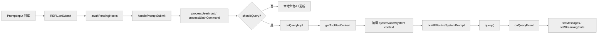

## 16. REPL 上还挂着几套容易被低估的前台子系统

`doc/0402.md` 里提到的 `Bridge`、`Voice`、`BUDDY`、`Inbox`，并不是落在仓库边角的彩蛋；它们大多直接挂在 REPL 外壳和 `AppState` 上。

### 16.1 Bridge 不是一个对话框，而是一条双向远程控制链

关键代码：

- `src/state/AppStateStore.ts`
- `src/commands/bridge/bridge.tsx`
- `src/bridge/replBridge.ts`

从 `AppStateStore.ts` 可以直接看到一整套 `replBridge*` 状态：

- `replBridgeEnabled`
- `replBridgeConnected`
- `replBridgeSessionActive`
- `replBridgeReconnecting`
- `replBridgeConnectUrl`
- `replBridgeSessionUrl`
- `replBridgeEnvironmentId`
- `replBridgeSessionId`

`/remote-control` 命令本身并不执行桥接逻辑，它做的是：

1. 修改 `replBridgeEnabled` / `replBridgeExplicit` 之类的状态位。
2. 让 `REPL.tsx` 中的 bridge hook 去真正建立连接。

`src/bridge/replBridge.ts` 则给出了这条链的真实边界：

- 注册环境
- 创建 bridge session
- 建立 ingress WebSocket
- 同步消息与 SDK message
- 转发 control request / response
- 处理 reconnect、heartbeat、teardown

所以 `Bridge` 的代码级定义不是“生成一个二维码给网页扫”，而是：

> 把本地 REPL 变成 claude.ai / code 侧 session 的双向 worker。

### 16.2 Voice 是一套原生音频链路，不是输入框小功能

关键代码：

- `src/state/AppState.tsx`
- `src/context/voice.tsx`
- `src/hooks/useVoiceIntegration.tsx`
- `src/services/voice.ts`

`AppStateProvider` 会在 `feature('VOICE_MODE')` 打开时包裹 `VoiceProvider`，这说明语音不是单个组件状态，而是会话级 Provider。

`context/voice.tsx` 维护的是一份独立 voice store：

- `voiceState`
- `voiceError`
- `voiceInterimTranscript`
- `voiceAudioLevels`
- `voiceWarmingUp`

`useVoiceIntegration.tsx` 把按键事件、输入框插入、interim transcript、光标锚点拼成完整的 push-to-talk 体验；`services/voice.ts` 则负责真正的录音后端：

- 优先 native `audio-capture-napi`
- Linux 下可退回 `arecord`
- 再不行则退回 `sox rec`

所以 `0402.md` 里“Voice 原生语音交互引擎”这个判断在代码层是站得住的，至少当前树里保留了完整的 Provider、hook 和 native audio service 结构。

### 16.3 Buddy / Companion 仍有完整前台与 prompt 痕迹，但命令入口在当前树里不完整

关键代码：

- `src/buddy/CompanionSprite.tsx`
- `src/buddy/companion.ts`
- `src/buddy/prompt.ts`
- `src/screens/REPL.tsx`
- `src/commands/buddy/index.ts`

REPL 会直接渲染：

- `CompanionSprite`
- `CompanionFloatingBubble`

`AppStateStore.ts` 里也有配套状态：

- `companionReaction`
- `companionPetAt`

`buddy/prompt.ts` 进一步说明它不只是 UI 装饰。`getCompanionIntroAttachment()` 会把 companion 信息以 attachment 注入给主模型，并明确要求主模型：

- 不要假装自己就是 companion
- 用户在和 companion 说话时，主模型只做最小让位

但当前反编译树里 `src/commands/buddy/index.ts` 是一个 auto-generated stub。也就是说：

- companion 的 sprite、状态、prompt 注入链仍然存在
- `/buddy` 这个命令入口在当前仓库快照里并不是完整实现

因此 `BUDDY` 更准确的代码结论是：

> 前台子系统和 prompt 接缝还在，但命令层实现并未在当前反编译树中完整保留。

### 16.4 Inbox 不是单一路径，而是内存邮箱、文件邮箱和 UDS 接缝并存

关键代码：

- `src/context/mailbox.tsx`
- `src/utils/mailbox.ts`
- `src/utils/teammateMailbox.ts`
- `src/setup.ts`
- `src/utils/udsMessaging.ts`

REPL 最外层会包 `MailboxProvider`。这里的 `Mailbox` 是一个进程内消息队列，用来承接：

- teammate message
- system message
- task notification
- tick 类信号

而真正持久化的 teammate inbox 在 `teammateMailbox.ts`：

- 存储路径是 `~/.claude/teams/<team>/inboxes/<agent>.json`
- 写入时有 `.lock` 文件保证并发安全
- unread / read 标记都是文件级状态

这说明当前树里可明确验证的“跨会话通信”底座首先是：

> 基于文件的 teammate mailbox，而不是抽象消息总线。

与此同时，`UDS_INBOX` 这条线也真实存在：

- `setup.ts` 会在 feature 打开时调用 `startUdsMessaging(...)`
- `main.tsx` 支持 `messagingSocketPath`
- `commands.ts` / `tools.ts` 会在 `UDS_INBOX` 打开时注册 `peers` 命令和 `ListPeersTool`

但当前仓库里的 `src/utils/udsMessaging.ts` 是 stub。也就是说：

- UDS 入口、命令门控和启动缝合点都还在
- 真正能从当前树完整读通并验证的 durable inbox 机制，仍是文件邮箱这条链

## 17. 源码阅读顺序

可优先关注以下区段：

1. 初始化 hook 区域：看 REPL 挂了哪些能力。
2. `onSubmit`：看用户输入如何进入系统。
3. `onQueryEvent`：看流式响应如何落到 UI。
4. `onQueryImpl`：看 UI 如何拼出一次 query。
5. 队列与 incoming prompt：看会话如何接纳非输入框来源的消息。

## 18. 总结

`REPL.tsx` 的核心价值不是“渲染聊天窗口”，而是把整个交互运行时协调起来：

- `AppState` 负责全局会话状态。
- REPL 负责把输入、队列、query、后台任务、远程会话连接起来。
- `onQueryImpl` 是交互主线程进入 query 引擎的桥。
- `onQueryEvent` 是 query 结果回流到 UI 的桥。

输入链路与 `query()` 主循环都通过 REPL 这一层接入交互运行时。

## Claude Code 的状态管理系统

# Claude Code 的状态管理系统

## 1. 状态管理概述

本篇讨论 `AppState`、store、selector 与状态更新模式如何共同构成 Claude Code 的运行时状态底座。

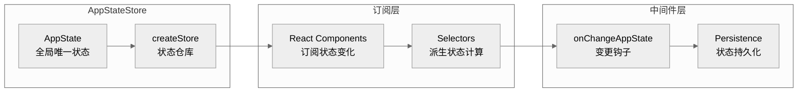

## 2. AppState 定义

**位置**: `src/state/AppStateStore.ts`

### 2.1 核心状态结构

```typescript
export type AppState = DeepImmutable<{
  // ── 设置 ────────────────────────────────────────────────────
  settings: SettingsJson                    // 用户设置
  verbose: boolean                          // 详细输出模式
  mainLoopModel: ModelSetting              // 主循环模型
  mainLoopModelForSession: ModelSetting    // 会话级模型覆盖

  // ── 视图状态 ────────────────────────────────────────────────
  statusLineText: string | undefined      // 状态栏文本
  expandedView: 'none' | 'tasks' | 'teammates'  // 扩展视图
  isBriefOnly: boolean                     // 简洁模式
  coordinatorTaskIndex: number            // 协调任务索引
  viewSelectionMode: 'none' | 'selecting-agent' | 'viewing-agent'

  // ── 工具权限 ────────────────────────────────────────────────
  toolPermissionContext: ToolPermissionContext

  // ── 任务系统 ────────────────────────────────────────────────
  tasks: TaskState[]

  // ── MCP ────────────────────────────────────────────────────
  mcp: {
    clients: MCPServerConnection[]
    commands: Command[]
    tools: Tools
    resources: Record<string, ServerResource[]>
    installationErrors: PluginError[]
  }

  // ── 桥接 ───────────────────────────────────────────────────
  replBridgeEnabled: boolean
  replBridgeExplicit: boolean
  replBridgeConnected: boolean
  replBridgeSessionActive: boolean
  replBridgeReconnecting: boolean
  replBridgeConnectUrl: string | undefined
  replBridgeSessionUrl: string | undefined
  replBridgeEnvironmentId: string | undefined

  // ── 特性 ────────────────────────────────────────────────────
  agent: string | undefined
  kairosEnabled: boolean                  // Assistant 模式
  remoteSessionUrl: string | undefined
  remoteConnectionStatus: 'connecting' | 'connected' | 'reconnecting' | 'disconnected'
  remoteBackgroundTaskCount: number

  // ── 推测执行 ────────────────────────────────────────────────
  speculation: SpeculationState

  // ── 文件历史 ────────────────────────────────────────────────
  fileHistory: FileHistoryState

  // ── 归因 ───────────────────────────────────────────────────
  attribution: AttributionState

  // ── 主题 ───────────────────────────────────────────────────
  theme: ThemeName
  terminalTheme: TerminalTheme | undefined
}>
```

### 2.2 DeepImmutable 类型

```typescript
// 深度不可变类型
type DeepImmutable<T> = {
  readonly [K in keyof T]: T[K] extends object
    ? DeepImmutable<T[K]>
    : T[K]
}
```

## 3. Store 实现

**位置**: `src/state/store.ts`

### 3.1 Store 接口

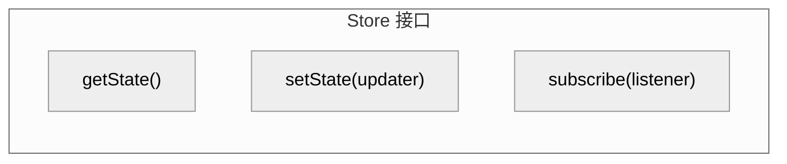

### 3.2 Store 实现

```typescript
export function createStore<S>(initialState: S): Store<S> {
  let state = initialState
  const listeners = new Set<Listener>()

  return {
    getState(): S {
      return state
    },

    setState(updater: (prev: S) => S): void {
      const newState = updater(state)

      // 引用比较优化
      if (newState === state) {
        return
      }

      state = newState

      // 通知所有监听器
      for (const listener of listeners) {
        listener()
      }
    },

    subscribe(listener: Listener): Unsubscribe {
      listeners.add(listener)
      return () => listeners.delete(listener)
    }
  }
}
```

## 4. AppStateStore

**位置**: `src/state/AppStateStore.ts`

### 4.1 创建 Store

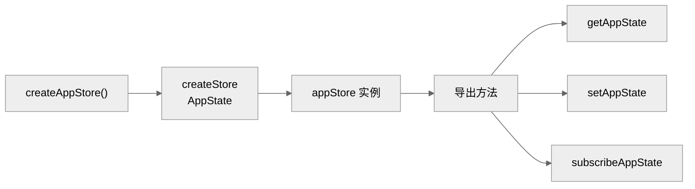

### 4.2 初始状态

```typescript
const createInitialState = (): AppState => ({
  // 设置
  settings: getInitialSettings(),
  verbose: false,
  mainLoopModel: 'claude-sonnet-4-5',
  mainLoopModelForSession: 'claude-sonnet-4-5',

  // 视图
  expandedView: 'none',
  isBriefOnly: false,
  coordinatorTaskIndex: -1,
  viewSelectionMode: 'none',
  footerSelection: null,

  // 权限
  toolPermissionContext: getEmptyToolPermissionContext(),

  // 任务
  tasks: [],

  // MCP
  mcp: {
    clients: [],
    commands: [],
    tools: [],
    resources: {},
    installationErrors: [],
  },

  // 桥接
  replBridgeEnabled: false,
  replBridgeExplicit: false,
  replBridgeConnected: false,
  replBridgeSessionActive: false,
  replBridgeReconnecting: false,

  // 特性
  kairosEnabled: false,
  remoteConnectionStatus: 'disconnected',
  remoteBackgroundTaskCount: 0,

  // 推测
  speculation: IDLE_SPECULATION_STATE,

  // 文件历史
  fileHistory: createEmptyFileHistoryState(),

  // 归因
  attribution: createEmptyAttributionState(),
})
```

## 5. 状态选择器

**位置**: `src/state/selectors.ts`

### 5.1 选择器工厂

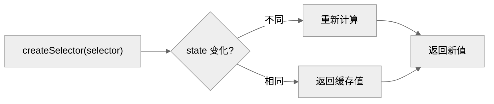

### 5.2 常用选择器

```typescript
// 任务选择器
export const selectTasks = (state: AppState) => state.tasks
export const selectTaskById = (state: AppState, id: string) =>
  state.tasks.find(t => t.id === id)

// MCP 选择器
export const selectMcpTools = (state: AppState) => state.mcp.tools
export const selectMcpClients = (state: AppState) => state.mcp.clients

// 桥接选择器
export const selectBridgeState = (state: AppState) => ({
  enabled: state.replBridgeEnabled,
  connected: state.replBridgeConnected,
  sessionActive: state.replBridgeSessionActive,
})

// 模型选择器
export const selectMainLoopModel = (state: AppState) =>
  state.mainLoopModel ?? state.settings.model
```

## 6. 状态变更处理

**位置**: `src/state/onChangeAppState.ts`

### 6.1 变更钩子

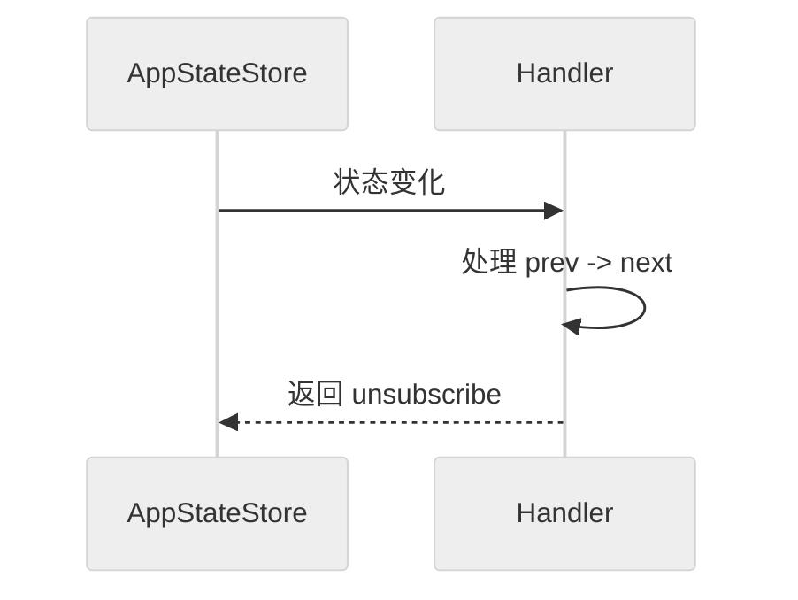

### 6.2 特定变更处理

```typescript
// 任务变更处理
export function onTasksChange(handler: (tasks: TaskState[]) => void): () => void {
  return onAppStateChange((prev, next) => {
    if (prev.tasks !== next.tasks) {
      handler(next.tasks)
    }
  })
}

// MCP 工具变更处理
export function onMcpToolsChange(handler: (tools: Tools) => void): () => void {
  return onAppStateChange((prev, next) => {
    if (prev.mcp.tools !== next.mcp.tools) {
      handler(next.mcp.tools)
    }
  })
}
```

## 7. 状态更新模式

### 7.1 不可变更新

```typescript
// 添加任务
setAppState(prev => ({
  ...prev,
  tasks: [...prev.tasks, newTask]
}))

// 更新任务
setAppState(prev => ({
  ...prev,
  tasks: prev.tasks.map(t =>
    t.id === taskId ? { ...t, status: 'running' } : t
  )
}))

// 删除任务
setAppState(prev => ({
  ...prev,
  tasks: prev.tasks.filter(t => t.id !== taskId)
}))
```

### 7.2 批量更新

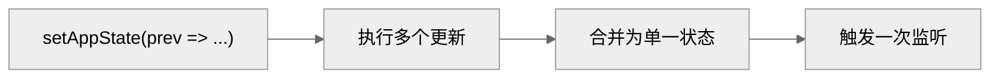

## 8. React 集成

### 8.1 Hook

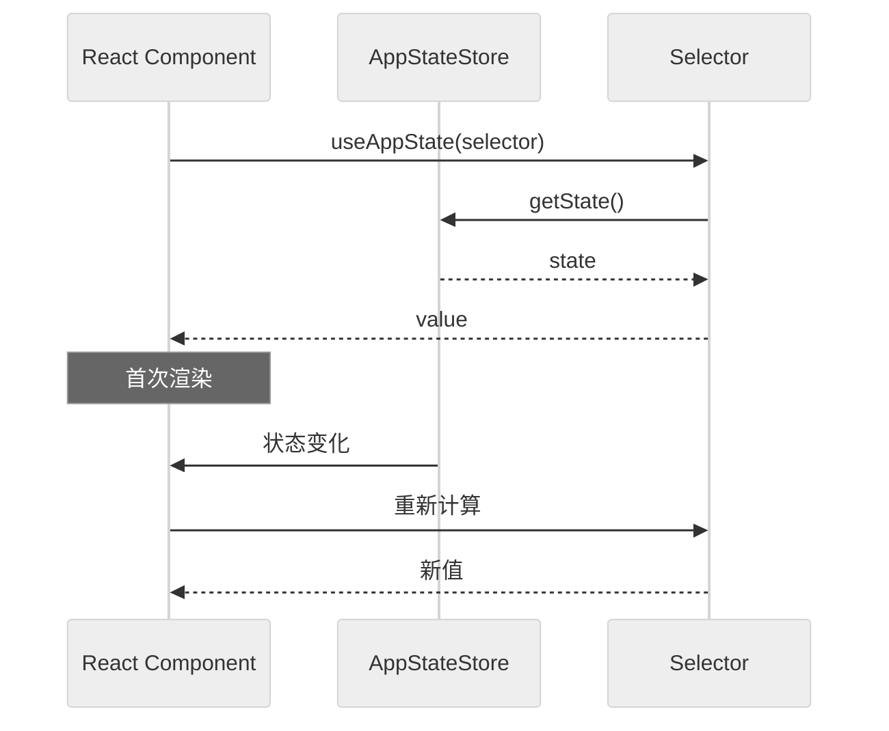

## 9. 持久化

### 9.1 设置持久化

**位置**: `src/utils/settings/settings.ts`

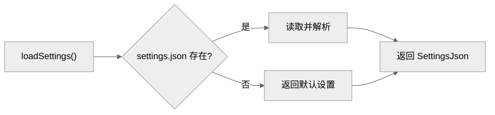

### 9.2 会话持久化

**位置**: `src/utils/sessionStorage.ts`

```typescript
interface SessionData {
  messages: Message[]
  taskState: TaskState[]
  // ...
}

// 保存会话
export async function saveSession(data: SessionData): Promise<void> {
  const sessionPath = getSessionPath()

  await writeFile(
    sessionPath,
    JSON.stringify(data),
    { mode: 'fsync' }
  )
}

// 恢复会话
export async function loadSession(): Promise<SessionData | null> {
  const sessionPath = getSessionPath()

  if (!existsSync(sessionPath)) {
    return null
  }

  const content = await readFile(sessionPath, 'utf-8')
  return JSON.parse(content)
}
```

## 10. 状态调试

### 10.1 状态快照

```typescript
// 获取状态快照用于调试
export function getStateSnapshot(): string {
  const state = appStore.getState()
  return JSON.stringify(state, null, 2)
}

// 状态变更日志
export function enableStateLogging(): void {
  appStore.subscribe(() => {
    const state = appStore.getState()
    console.debug('[State]', JSON.stringify(state, null, 2))
  })
}
```

## 11. 补充：关键实现细节

### 11.1 DeepImmutable 的实际效果

DeepImmutable<T> 是一个递归类型，将所有属性标记为 readonly，将所有数组标记为 ReadonlyArray。但这只是编译时约束——运行时没有任何 freeze 操作。这意味着如果有代码绕过 TypeScript 类型检查直接修改状态（比如通过 as any），不会有运行时错误。

### 11.2 setState 的引用比较优化

setState 内部使用严格相等（===）比较新旧状态。如果 updater 函数返回了与之前相同的引用，不会触发任何 subscriber 通知。这对性能至关重要——在 REPL 渲染循环中，每秒可能有数十次 setState 调用，但只有真正发生变化的才会触发 UI 重渲染。

### 11.3 状态持久化的选择性

不是所有状态都会持久化。持久化到 session transcript 的包括：messages、taskState、worktree 信息。但像 mcp.clients（连接对象）、replBridgeConnected（运行时状态）这些字段不会也不能持久化。恢复会话时，这些运行时状态需要重新初始化。

### 11.4 Selector 缓存策略

createSelector 使用简单的上一次结果缓存（not LRU）。如果输入引用不变，直接返回上次计算结果。这足够了，因为每个 selector 通常只被一个 useAppState hook 实例消费。

---

*文档版本: 1.0*
*分析日期: 2026-03-31*

## 用户输入、Slash 命令与队列分发

# 用户输入、Slash 命令与队列分发

本篇梳理用户提交输入后，系统如何完成输入分类、队列调度和 slash command 分流。

## 1. 这一层解决什么问题

对于用户来说，看到的是“输入一行文本然后 Claude 开始回答”。但在源码里，输入层至少要解决下面几类问题：

1. 这次输入是普通 prompt、bash 还是 slash command。
2. 当前 query 正在运行时，新输入是直接执行、排队、还是尝试中断。
3. 如果输入中带图片、附件、粘贴内容，要怎么转成消息。
4. 如果是 `/command`，这个命令是本地执行还是继续进入模型。
5. 如果命令声明了 `allowedTools / model / effort`，这些限制如何影响当前 turn。

这套职责主要落在：

- `src/utils/handlePromptSubmit.ts`
- `src/utils/processUserInput/processUserInput.ts`
- `src/utils/processUserInput/processSlashCommand.tsx`
- `src/utils/messageQueueManager.ts`
- `src/utils/QueryGuard.ts`
- `src/utils/queueProcessor.ts`

## 2. 整体流程图

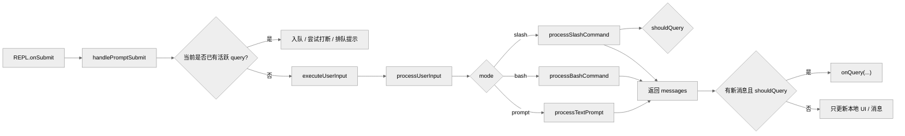

## 3. `handlePromptSubmit`：输入总入口

关键文件：`src/utils/handlePromptSubmit.ts`

这是真正的“输入门面函数”。REPL 在 `onSubmit` 与 `executeQueuedInput` 两个路径里都会调用它。

### 3.1 它接收的上下文非常大

从 REPL 调用点可以看出，它会收到：

- `queryGuard`
- `isExternalLoading`
- `mode`
- `commands`
- `messages`
- `mainLoopModel`
- `pastedContents`
- `setAbortController`
- `onQuery`
- `setAppState`
- `canUseTool`
- `setMessages`
- `hasInterruptibleToolInProgress`

这表明它不是一个“字符串解析器”，而是：

> 输入调度器

### 3.2 它处理的第一个问题：当前系统忙不忙

如果当前已有 query 在运行，那么新输入不一定能立刻执行。此时它会根据输入类型和当前工具状态做几种策略：

- 排进统一命令队列。
- 如果正在运行的工具可中断，尝试打断当前 turn。
- 把 prompt/bash/slash 统一包装成 `QueuedCommand`。

## 4. 队列系统：为什么要在输入层就建模

关键文件：

- `src/utils/messageQueueManager.ts`
- `src/utils/queueProcessor.ts`
- `src/hooks/useQueueProcessor.ts`

### 4.1 队列里放的不是“文本”，而是命令对象

它至少要区分：

- `prompt`
- `bash`
- `task-notification`
- slash command 对应的 prompt 结果

并且有优先级概念：

- `now`
- `next`
- `later`

### 4.2 `processQueueIfReady` 的职责

`queueProcessor.ts` 会在：

- queue 非空
- queryGuard 不活跃
- 当前没有本地 JSX UI 阻塞

时启动下一批命令。

源码说明了它的批处理策略：

- slash/bash 一般逐个执行。
- 普通 prompt 可以按 mode 批量拼一批提交。

这意味着队列不只是“先进先出”，而是带有模式级别的调度优化。

## 5. `QueryGuard`：防并发 query 的同步闸门

关键文件：`src/utils/QueryGuard.ts`

它的状态机很轻，但作用极大：

- `idle`
- `dispatching`
- `running`

它提供的方法一般有：

- `reserve()`
- `cancelReservation()`
- `tryStart()`
- `end()`
- `forceEnd()`

### 5.1 为什么需要这个对象

因为输入处理里存在很多异步间隙：

- 解析 slash command
- 处理图片/附件
- hook 执行
- queue 出队

如果没有一个同步 guard，很容易出现：

- 两个 prompt 争抢同一轮 query 启动权。
- UI 以为还没开始，另一个异步路径已经启动了 query。

## 6. `executeUserInput`：真正进入处理前的那一步

`handlePromptSubmit` 在决定“现在可以处理这次输入”之后，会进入 `executeUserInput()` 路径。

它典型会做这些事：

1. 创建新的 `AbortController`。
2. 向 `QueryGuard` 申请 reservation。
3. 遍历 queued commands，逐个或分批交给 `processUserInput(...)`。
4. 记录 file history snapshot。
5. 如果得到新的 messages 且 `shouldQuery=true`，调用 `onQuery(...)`。
6. 否则只做本地状态收尾。

### 6.1 这里已经体现出一条重要事实

“一次提交”不一定只对应一个输入。

因为队列里可能已经有多条同类命令被合并执行。

## 7. `processUserInput`：输入语义转换层

关键文件：`src/utils/processUserInput/processUserInput.ts`

它是从“原始输入”进入“消息级语义”的核心层。

## 7.1 先做通用包装，再委托基础处理

`processUserInput(...)` 的结构大致是：

1. 对 prompt 模式设置临时 processing 文案。
2. 调用 `processUserInputBase(...)`。
3. 如果结果 `shouldQuery=true`，再执行 `UserPromptSubmit` hooks。
4. hooks 可以：
   - 追加消息
   - 阻止继续
   - 注入额外上下文

hooks 并不是 query 之后才介入，而是在“用户输入已被接受、尚未送模型”这个阶段就能工作。

## 8. `processUserInputBase`：真正的模式分发器

它主要做几件事：

### 8.1 内容归一化

- 把纯文本与 content blocks 归一化。
- 处理 pasted images。
- 调整图片块尺寸与存储。

### 8.2 特殊输入短路

例如：

- bridge 安全覆盖
- `ULTRAPLAN` 关键字改写到 `/ultraplan`

### 8.3 附件注入

- 通过 `getAttachmentMessages(...)` 把图片、文件、粘贴内容变成附加消息。

### 8.4 模式分发

- bash 模式走 `processBashCommand`
- slash 输入走 `processSlashCommand`
- 其余走 `processTextPrompt`

所以这层才是真正的：

> 文本输入 -> 会话消息

## 9. `processSlashCommand`：slash 命令并不是简单字符串匹配

关键代码：`src/utils/processUserInput/processSlashCommand.tsx:309-520`

这是理解命令系统的关键。

## 9.1 先 parse，再判断是不是“真命令”

处理流程大致是：

1. `parseSlashCommand(inputString)`
2. 拿到：
   - `commandName`
   - `args`
   - `isMcp`
3. 先判断这个 command 是否存在于 `context.options.commands`

### 9.1.1 如果不存在怎么办

这里不会立刻简单报错，而是先判断：

- 它看起来是否像命令名
- 它会不会其实是文件路径

如果不像真实命令，就把它退化成普通 prompt 继续处理。

这是一种非常实用的 UX 设计：避免把像 `/var/log` 这样的输入误伤成无效命令。

## 9.2 slash command 的返回值远不只是 messages

通过 `getMessagesForSlashCommand(...)`，一个命令可以返回：

- `messages`
- `shouldQuery`
- `allowedTools`
- `model`
- `effort`
- `resultText`
- `nextInput`
- `submitNextInput`

这组返回值非常重要，因为它意味着 slash command 可以改变：

- 当前 turn 是否进入模型
- 当前 turn 能用哪些工具
- 当前 turn 使用哪个模型
- 当前 turn 的 effort 等级

slash command 是前置控制层，而不是单纯的文本宏。

## 10. slash command 的三种典型结果

## 10.1 本地命令，直接结束

如果 `newMessages.length === 0`，说明这类命令在本地 UI 或本地逻辑中已经完成，不需要进 query。

例如某些设置命令、切换命令、只更新本地状态的命令。

## 10.2 命令产出消息，但不 query

比如：

- 生成一条本地输出
- 返回错误消息
- 只展示帮助文本

## 10.3 命令转换成 prompt，再进入 query

这就是很多技能命令的本质：

- `/commit`
- `/review`
- 插件技能
- 自定义 prompt skill

它们会把技能 Markdown、参数替换、allowed tools 等结果转成消息，再继续进入模型。

## 11. 技能型 slash 命令为什么这么强

因为命令系统没有把“技能”实现成另一套协议，而是直接让它走 slash command 入口。

这样技能就天然拥有：

- 参数替换
- allowed tools 控制
- model/effort 覆写
- 本地 shell 注入
- 插件/技能来源追踪

因此 slash command 是整个扩展体系进入主链路的统一入口。

## 12. 普通 prompt 路径并不简单

普通 prompt 也会经历：

- content blocks 组装
- attachment 注入
- image metadata 用户消息插入
- hooks 前置处理

所以即便用户只是输入一句自然语言，最终进入 query 的也不只是“一条字符串消息”。

## 13. 输入忙碌时的策略：排队而不是乱插

这套系统大量使用队列和 guard 的根本原因是：

- query 不是单请求，而是多轮工具循环。
- 中途还可能有可中断工具。
- 还可能有后台任务通知、incoming prompt、mailbox bridge 消息进来。

如果没有统一排队策略，会出现：

- 主线程 query 被多路输入打穿。
- 工具结果与新 prompt 交错，造成消息链断裂。

## 14. 输入层与 REPL 的边界

可以这么理解：

- `REPL.tsx` 负责把当前会话环境传给输入系统。
- `handlePromptSubmit` 负责调度。
- `processUserInput*` 负责语义转换。
- queue/guard 负责并发控制。
- `onQuery` 才是真正把结果送入 query 主循环。

## 15. 关键源码锚点

| 主题 | 代码锚点 | 说明 |
| --- | --- | --- |
| REPL 提交入口 | `src/screens/REPL.tsx:3488-3519` | 交互模式进入 `handlePromptSubmit` |
| 队列执行入口 | `src/screens/REPL.tsx:3861-3889` | 队列中命令如何重用同一输入管线 |
| slash 解析与分流 | `src/utils/processUserInput/processSlashCommand.tsx:309-520` | slash 命令是否存在、是否 query、allowedTools/model/effort |
| QueryGuard | `src/utils/QueryGuard.ts` | 防止 query 重入 |
| queue manager | `src/utils/messageQueueManager.ts` | 统一命令队列模型 |

## 16. 总结

输入层的本质不是“把字符串发给模型”，而是：

1. 判断输入语义。
2. 在高并发会话中安全调度。
3. 把 slash/bash/prompt 统一转成消息对象。
4. 为当前 turn 注入工具权限、模型、effort 等局部策略。
5. 在准备完毕后才把这次输入送入 query 主循环。

`query.ts` 接收到的不是原始输入字符串，而是一组结构化的 `messages + ToolUseContext + turn 级策略`。

## `query()` 主循环与请求构造

# `query()` 主循环与请求构造

本篇将 `query()` 视为多轮状态机来拆解，覆盖请求前上下文治理、流式模型调用、工具回流与错误恢复。

## 1. 定义

`src/query.ts` 里的 `query()` 不是“调用一次模型 API”的薄包装，而是整个系统的对话执行状态机。

一次用户 turn 在这里可能经历：

1. 请求前上下文处理。
2. 向模型发起 streaming 请求。
3. 收到 `tool_use`。
4. 执行工具并回写 `tool_result`。
5. 继续下一轮模型请求。
6. 在输出超限、上下文过长、stop hooks、token budget 等场景下恢复或结束。

## 2. 高层流程图

### 2.1 请求生命周期调用链示意图

下图展示“**从用户输入到终端渲染**”的调用链；这一视角与后文 `queryLoop()` 的内部状态机不同。

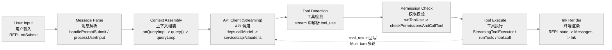

补充说明如下：

- 图里把 `tool_result` 回写、消息追加、再次进入 `queryLoop` 的过程折叠成了 `Tool Execute -> API Client` 这条回环。
- `Ink Render` 在真实运行时并不是最后一步才发生；streaming 文本、tool progress、权限确认 UI 都会持续驱动 REPL/Ink 更新。图里只是把它抽象成“用户最终看到的渲染出口”。

### 2.2 `query()` 内部状态机图

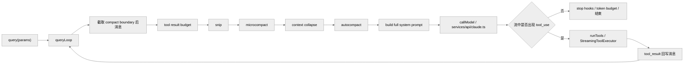

## 3. `query()` 与 `queryLoop()` 的关系

关键代码：

- `src/query.ts:219-238`
- `src/query.ts:241-279`

`query()` 外层只做一件特别重要的事：

- 调用 `queryLoop(params, consumedCommandUuids)`
- 正常返回后，把已消费队列命令标记为 completed

真正复杂的逻辑全部在 `queryLoop()`。

## 4. `queryLoop()` 的 state 说明它是一个“多轮状态机”

关键代码：`src/query.ts:263-279`

内部 state 包括：

- `messages`
- `toolUseContext`
- `maxOutputTokensOverride`
- `autoCompactTracking`
- `stopHookActive`
- `maxOutputTokensRecoveryCount`
- `hasAttemptedReactiveCompact`
- `turnCount`
- `pendingToolUseSummary`
- `transition`

这些字段共同给出两个事实：

- 这里的“turn”不是用户 turn，而是 query 内部递归轮次。
- 一次 query 可能自己继续好几轮。

## 5. 每一轮开始前先做哪些事

关键代码：`src/query.ts:323-460`

## 5.1 发 `stream_request_start`

`src/query.ts:337`

这是给上层 UI/SDK 的控制事件，表示一次新的 API 请求即将开始。

## 5.2 生成 query chain tracking

`src/query.ts:346-363`

这里会生成：

- `chainId`
- `depth`

用于：

- telemetry
- 多轮/递归查询链追踪

## 5.3 请求前的上下文治理入口

从 `src/query.ts:365-468` 可以确认，模型请求前会先经过一条上下文治理流水线：

1. 从 `compact boundary` 之后截取模型视图
2. 对 tool result 做预算裁剪
3. 再按顺序尝试 `snip -> microcompact -> context collapse -> autocompact`
4. 真正失败时进入 reactive recovery

完整机制说明已经独立到：

- [07-context-management.md](./07-context-management.md)

本篇只保留与 `query()` 主循环直接相关的两条事实：

- 这些机制都发生在 `callModel` 之前，因此它们是请求状态机的一部分，而不是 API 层的后处理。
- `context collapse` 与 `autocompact` 不是平行兜底关系；`autocompact` 命中后也不是总是直接走传统 summary，而会先试 `SessionMemory compact`。

## 6. 请求前的系统提示词是最后拼出来的

关键代码：

- `src/query.ts:449-450`
- `src/utils/queryContext.ts:44-73`

`queryLoop` 在请求前会得到：

- 基础 `systemPrompt`
- `systemContext`

然后通过 `appendSystemContext(systemPrompt, systemContext)` 得到最终发送给模型的 full system prompt。

### 6.1 为什么 system prompt 不在更前面就一次性定死

因为：

- `systemContext` 可能依赖 trust、环境、当前状态。
- `appendSystemPrompt`、agent prompt、custom prompt、memory mechanics 都可能参与最终拼装。

## 7. 进入 API 调用前的 setup

关键代码：`src/query.ts:551-580`

这一段会准备：

- `assistantMessages`
- `toolResults`
- `toolUseBlocks`
- `needsFollowUp`
- streamingToolExecutor
- 当前 permission mode 对应的运行模型

一个很关键的点是：

- 当前实际模型可能不是配置里的名义模型，而会被 permission mode、上下文长度等因素影响。

## 8. `callModel` 如何真正构造请求

关键文件：`src/services/api/claude.ts`

重点代码：

- `src/services/api/claude.ts:1358-1379`
- `src/services/api/claude.ts:1538-1728`
- `src/services/api/claude.ts:1777-1833`

## 8.1 系统提示词拼装

在真正发请求前，`claude.ts` 会再次在 system prompt 前后追加一批系统块：

- attribution header
- CLI system prompt prefix
- advisor instructions
- chrome tool search instructions

然后用 `buildSystemPromptBlocks(...)` 处理成 API 需要的 block 结构。

### 8.1.1 这解释了为什么 prompt cache 如此敏感

因为：

- 任何一个系统块、beta header、tool schema 的变化，都可能导致缓存前缀失效。

## 8.2 请求参数不只是 model/messages/system

`paramsFromContext(...)` 里会构造：

- `model`
- `messages`
- `system`
- `tools`
- `tool_choice`
- `betas`
- `metadata`
- `max_tokens`
- `thinking`
- `temperature`
- `context_management`
- `output_config`
- `speed`

这说明请求构造层承担了大量策略组合工作：

- prompt cache
- thinking 配置
- structured outputs
- task budget
- fast mode
- context management

## 8.3 streaming 请求是通过 `anthropic.beta.messages.create(...).withResponse()`

关键代码：`src/services/api/claude.ts:1822-1833`

这里会：

- 设置 `stream: true`
- 传入 signal
- 可能带 client request id header
- 拿 response headers、request id 和 raw stream

源码注释还明确提到：

- 使用 raw stream 是为了避免 SDK 的 O(n²) partial JSON parsing 成本。

这又是一个典型的生产级性能优化点。

## 9. streaming 过程中 query 在干什么

关键代码：`src/query.ts:652-864`

这一段是主循环最核心的实时路径。

## 9.1 每条 message 先决定“要不要立即 yield”

有些错误消息会先被 withheld，例如：

- prompt too long 可恢复错误
- media size error
- `max_output_tokens`

原因是：

- 系统想先尝试恢复。
- 如果恢复成功，用户就不需要看到中间错误。

## 9.2 assistant 消息里的 `tool_use` 会被提取出来

`src/query.ts:829-845`

如果 assistant content 里有 `tool_use` block：

- 追加到 `toolUseBlocks`
- 标记 `needsFollowUp = true`
- 如果启用流式工具执行，立刻交给 `StreamingToolExecutor`

## 9.3 流式工具执行可以边收边跑

这意味着系统不必等整条 assistant 完整结束，才能开始执行所有工具。

从产品体验看，这能显著降低：

- 工具启动延迟
- 长响应中的空转时间

## 10. 如果没有 `tool_use`，query 怎么结束

关键代码：`src/query.ts:1185-1357`

在没有后续工具需要执行时，系统还要经过几道结束前检查：

- `max_output_tokens` 恢复
- API error 短路
- stop hooks
- token budget continuation

### 10.1 `max_output_tokens` 恢复机制

如果命中输出 token 限制：

1. 可能先将默认 cap 从 8k 提升到 64k 再重试。
2. 如果还不够，会注入一条 meta user message，让模型直接续写，不要道歉不要 recap。
3. 超过恢复上限后才真正把错误抛给用户。

这是一种典型的“会话连续性优先”策略。

### 10.2 stop hooks 可以阻止继续

`handleStopHooks(...)` 的返回值可以：

- prevent continuation
- 返回 blocking errors

从而阻止 query 继续递归。

### 10.3 token budget continuation

如果当前 turn 的 token 花费达到了预算阈值，系统可以插入一条 meta user message，让模型把剩余工作拆小继续。

这进一步说明 query 的终止条件不是单一的 API stop reason。

## 11. 如果有 `tool_use`，如何进入下一轮

关键代码：`src/query.ts:1363-1435`

流程是：

1. 选择 `StreamingToolExecutor.getRemainingResults()` 或 `runTools(...)`
2. 消费每个 tool update
3. 把得到的 tool result message 再转成适用于 API 的 user message
4. 更新 `updatedToolUseContext`
5. 生成 tool use summary
6. 把新的 messages 与 context 带入下一轮 `continue`

这就形成了：

`assistant(tool_use) -> user(tool_result) -> assistant(next turn)`

## 12. `runTools()` 为何还要分并发安全批次

这个属于工具系统的内容，但和 query 强耦合。

`runTools()` 会按工具的 `isConcurrencySafe` 把工具块分成：

- 只读可并发批
- 有状态/非安全工具单独串行批

这样做能在保证正确性的前提下尽量并发执行 read-only 工具。

## 13. Query 与请求构造之间的边界

可以这样理解：

- `query.ts` 负责“什么时候调用模型、什么时候执行工具、什么时候继续”。
- `services/api/claude.ts` 负责“这次调用模型到底发什么参数、怎么处理 streaming 原始协议”。

前者是会话状态机，后者是模型协议适配器。

## 14. `fetchSystemPromptParts()` 的位置很关键

关键代码：`src/utils/queryContext.ts:44-73`

它只负责获取三块上下文原料：

- `defaultSystemPrompt`
- `userContext`
- `systemContext`

它不直接决定最终 prompt 形态。最终组装留给 REPL 或 QueryEngine。

这是一种很好的分层：

- 原料获取
- 最终 prompt 拼装

分开。

## 15. 关键源码锚点

| 主题 | 代码锚点 | 说明 |
| --- | --- | --- |
| query 入口 | `src/query.ts:219-238` | generator 外层包装 |
| queryLoop 初始 state | `src/query.ts:241-279` | 多轮状态机的状态定义 |
| 请求前上下文治理 | `src/query.ts:365-468` | budget, snip, microcompact, collapse, autocompact |
| API streaming 调用 | `src/query.ts:652-864` | `deps.callModel(...)` 的主循环 |
| max token 恢复与 stop hooks | `src/query.ts:1185-1357` | query 结束前的恢复/阻断策略 |
| 工具回流 | `src/query.ts:1363-1435` | `tool_use -> tool_result -> 下一轮` |
| 系统提示词拼装 | `src/services/api/claude.ts:1358-1379` | system prompt block 的最终构造 |
| 请求参数生成 | `src/services/api/claude.ts:1538-1728` | thinking、betas、context_management、output_config |
| 真正发请求 | `src/services/api/claude.ts:1777-1833` | raw streaming create + response headers |

## 16. 一段伪代码复原

下面这段伪代码比逐行读更容易把握 query 的灵魂：

```ts
while (true) {
  messagesForQuery = compactBoundaryTail(messages)
  messagesForQuery = applyToolResultBudget(messagesForQuery)
  messagesForQuery = snipIfNeeded(messagesForQuery)
  messagesForQuery = microcompact(messagesForQuery)
  messagesForQuery = collapseContextIfNeeded(messagesForQuery)
  messagesForQuery = autocompactIfNeeded(messagesForQuery)

  response = await callModel({
    messages: prependUserContext(messagesForQuery),
    systemPrompt: fullSystemPrompt,
    tools,
  })

  if (!response.hasToolUse) {
    maybeRecoverFromErrors()
    maybeRunStopHooks()
    maybeContinueForBudget()
    return
  }

  toolResults = await runTools(response.toolUses)
  messages = [...messagesForQuery, ...assistantMessages, ...toolResults]
}
```

## 17. 总结

`query()` 是这个工程真正的运行时内核。它把：

- 上下文治理
- 模型请求
- 工具执行
- 递归继续
- 错误恢复

统一到一个 generator 状态机中。

REPL 负责交互控制，`query.ts` 负责会话执行，`services/api/claude.ts` 负责模型协议组装与调用。

## Claude Code 的上下文管理系统

# Claude Code 的上下文管理系统

本篇只讨论一件事：Claude Code 如何在长会话里持续控制“真正送给模型的上下文”。

这里的“上下文管理”不是单一压缩器，而是一组按顺序尝试、彼此联动的机制。它们共同解决以下问题：

- 历史消息持续膨胀
- tool result 占满窗口
- prompt cache 冷却后旧内容继续占 token
- 长会话恢复时模型视图与 UI scrollback 不一致
- 真正 overflow 之后如何继续执行

需要先划清三个边界：

- 上下文管理不等于 prompt cache，但两者紧密耦合。
- 上下文管理不等于 transcript 持久化，但 transcript 负责把部分结果写盘并在 resume 时恢复。
- 上下文管理不等于 SessionMemory，不过 `SessionMemory compact` 是 autocompact 的第一条快路径。

---

## 1. 上下文管理在主链路里的位置

关键文件：

- `src/query.ts`
- `src/services/compact/*`
- `src/services/api/claude.ts`
- `src/utils/sessionStorage.ts`

`query()` 在每轮发请求前，并不是直接把 REPL 里的全部消息原样送去模型。真实路径是：

1. 先从 `compact boundary` 之后取模型视图。
2. 对 tool result 做预算裁剪。
3. 再进入上下文治理流水线。
4. 处理完后才进入系统提示词拼装和 API 请求。

### 1.1 主链路示意图

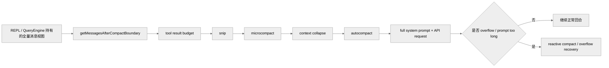

这张图里有两个容易混淆的点：

- `compact boundary` 不是压缩机制本身，而是当前模型视图的切断点。
- `reactive compact` 不在正常预防链路里，而是在真正出错后参与恢复。

---

## 2. 这不是“四层同时工作”，而是梯度体系

在代码层，更准确的顺序是：

1. tool result budget
2. `snip`
3. `microcompact`
4. `context collapse`
5. `autocompact`
6. 必要时 `reactive compact`

这条链路要这样理解：

- 不是每一轮都全部生效。
- `snip` 和 `microcompact` 可能在同一轮都运行。
- `microcompact` 自己还分成两条实现路径。
- `context collapse` 启用后会 suppress proactive autocompact。
- `autocompact` 命中后也不是立刻走传统 summary，而是先试 `SessionMemory compact`。

还需要明确一个反编译边界：

- `src/services/compact/snipCompact.ts`
- `src/services/compact/snipProjection.ts`
- `src/services/contextCollapse/*`

这几块在当前仓库里仍有 stub，因此一些结论来自 `query.ts`、`sessionStorage.ts`、`/context`、`QueryEngine.ts` 的调用点与注释，而不是完整实现体。

### 2.1 梯度触发示意图

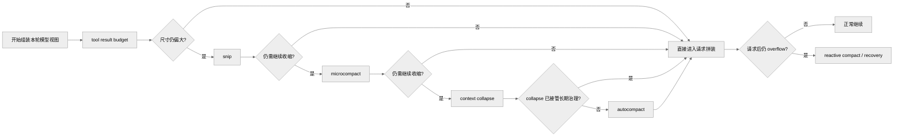

这张图强调的是“按需逐层升级”，不是每轮固定跑完整条链。

---

## 3. 每一层机制分别做什么

### 3.1 `compact boundary`：模型视图的切断点

关键位置：`src/query.ts:365`、`src/utils/messages.ts`

`compact boundary` 的作用很简单：

- REPL 可以保留完整 scrollback
- 但模型看到的消息只从最近 boundary 之后开始

因此：

- UI 历史不等于模型上下文
- transcript 恢复时也需要围绕 boundary 重建正确链路

这是整套上下文管理能成立的基础前提。

### 3.2 tool result budget：第一层尺寸治理

关键位置：`src/query.ts:369-394`

这一步还不是完整压缩，但已经属于上下文治理的第一层。它的目标是：

- 避免单条 tool result 把上下文直接撑爆
- 在更重的压缩机制介入前，先做最小粒度的预算裁剪

如果只保留一个理解，可将它视为：

> 单条结果的尺寸上限控制，而不是整段历史的折叠。

### 3.3 `snip`：直接删消息，不做摘要

关键位置：

- `src/query.ts:396-410`
- `src/utils/sessionStorage.ts:1840-1983`
- `src/utils/messages.ts`

`snip` 是最轻的一层历史裁剪，它的特征非常明确：

- 直接删掉中间区段消息
- 不生成摘要替代旧内容
- 通过 parentUuid 重连消息链

代码里能确认的事实包括：

- `query.ts` 调用 `snipCompactIfNeeded(messagesForQuery)`
- 返回值包含 `messages`、`tokensFreed`、`boundaryMessage`
- `snipTokensFreed` 会继续传给 blocking-limit 判断和 `autocompact`
- `projectSnippedView()` 会把 snipped messages 从 API 视图中过滤掉
- headless/SDK 路径会在 replay 后直接裁掉内存中的消息，避免无 UI 长会话持续膨胀

因此，`snip` 的代码级定义是：

> 最细粒度、直接删消息、不做摘要的历史裁剪。

### 3.4 `microcompact`：对 tool result 做细粒度压缩

关键文件：

- `src/services/compact/microCompact.ts`
- `src/services/api/claude.ts`
- `src/query.ts`

`microcompact` 重点不是全局总结，而是：

- 对特定 tool result 做更细粒度的压缩
- 或在支持时利用 cache editing 减少输入 token

它有两条明确不同的实现路径。

#### 3.4.1 time-based microcompact

特征：

- 当服务端 prompt cache 大概率已经冷掉时触发
- 直接把更老的 `tool_result.content` 清成 `[Old tool result content cleared]`
- 会重置 microcompact state，并通知 prompt-cache break detection

这是一条 **内容级压缩** 路径。

#### 3.4.2 cached microcompact

特征：

- 只在主线程、支持模型、feature 打开时可用
- 本地消息不改
- `microCompact.ts` 只收集待删的 `tool_use_id`
- `claude.ts` 在请求体里插入 `cache_edits` 和 `cache_reference`
- API 返回后，`query.ts` 再根据 `cache_deleted_input_tokens` 计算实际释放量

这是一条 **cache-layer editing** 路径。

因此，`microcompact` 不能被统一描述成“它不改消息内容”。代码上必须区分：

- cached microcompact：不改本地消息，改 API cache 视图
- time-based microcompact：直接改本地消息内容

#### 3.4.3 `microcompact` 双路径示意图

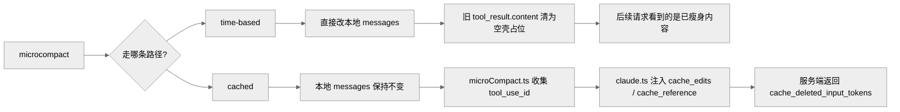

如果只想抓住本质，这一层做的是“优先处理 tool result 的细粒度体积问题”，而且代码里同时存在内容层和 cache 层两种实现。

### 3.5 `context collapse`：维护投影视图，不是简单摘要

关键位置：

- `src/query.ts:428-447`
- `src/commands/context/context.tsx`
- `src/utils/sessionStorage.ts`

`context collapse` 的设计重点不是“生成一条摘要消息”，而是：

- 维护 collapse store
- 每轮按 commit log 重放成投影视图
- 让长会话能持续复用 collapse 结果

当前可稳定确认的事实包括：

- collapse summary 不住在 REPL message array 里
- `/context` 必须先 `projectView()` 才能接近模型真实视图
- transcript 会把 commit 与 snapshot 写成 `marble-origami-commit` / snapshot entries
- overflow 恢复时会先调用 `contextCollapse.recoverFromOverflow()`

从代码口径看，它更接近：

> 类似 commit log 的 collapse store + 每轮投影视图。

更重要的是，它和 autocompact 不是并列兜底关系：

- `autoCompact.ts` 明确写明，context collapse 打开后，proactive autocompact 会被 suppress

### 3.6 `autocompact`：最后的重型上下文重写

关键文件：

- `src/services/compact/autoCompact.ts`
- `src/services/compact/compact.ts`
- `src/services/compact/prompt.ts`

`autocompact` 是更强的一层，但它也不是“把历史压成一段话”这么简单。

#### 3.6.1 触发阈值

源码里稳定可确认的公式是：

- `effectiveContextWindow = getContextWindowForModel(model) - reservedTokensForSummary`
- `autoCompactThreshold = effectiveContextWindow - 13_000`

因此，最准确的表述是：

> autocompact 在 effective context window 基础上预留 13,000 token buffer。

这不是一个在所有模型和配置下固定不变的百分比阈值。

#### 3.6.2 先试 `SessionMemory compact`

autocompact 命中后，会先试：

- `trySessionMemoryCompaction()`

只有这条快路径走不通时，才回退到：

- `compactConversation()`

这就是为什么 autocompact 不能被描述成“始终调一次模型写一段大摘要”。

#### 3.6.3 legacy full compact summary

传统 compact 路径下，`NO_TOOLS_PREAMBLE` 会进入 compact prompt，强制 compaction agent：

- 只输出 `<analysis> + <summary>`
- 不调用任何工具

这条路径最终产出的也不是“单段摘要文本”，而是：

- `compact boundary`
- `summary messages`
- 恢复上下文需要的附件和 hook 结果

所以 autocompact 的代码级定义更接近：

> 最后的重型上下文重写机制，产物是新的 post-compact 上下文包。

#### 3.6.4 `autocompact` 产物示意图

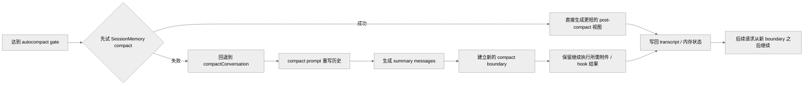

### 3.7 `reactive compact`：真实失败后的恢复式压缩

当真正出现：

- API overflow
- prompt-too-long
- 其他上下文相关失败

系统并不是立即终止，而会进入 reactive compact / overflow recovery 路径。

这说明 Claude Code 的上下文管理同时包含两类能力：

- 预防式压缩
- 失败后的恢复式压缩

---

## 4. 它如何与 SessionMemory、transcript、compact prompt 对接

### 4.1 `SessionMemory` 是 autocompact 的第一条快路径

`SessionMemory` 本身不是长期记忆后端，但它直接参与上下文管理：

- 命中 autocompact gate 后，先试 `SessionMemory compact`
- 这条路径会利用已有 notes 保留最近消息尾部
- 目标是尽量避免直接进入传统 full compact summary

所以，`SessionMemory` 在这里扮演的是：

> 当前会话续航层，同时也是 compact 的低成本快路径。

### 4.2 transcript 会把上下文管理结果写盘

关键文件：`src/utils/sessionStorage.ts`

上下文管理的若干结果不会只存在于内存中：

- `compact boundary` 会切断消息链
- `snip` 会删除中间区段并在 resume 时重连 parentUuid
- `context collapse` 的 commit / snapshot 会写入 transcript

这意味着 transcript 不是单纯的聊天记录，而是：

> 长会话上下文治理结果的持久化底座。

### 4.3 compact prompt 属于这套系统的“重写器”

关键文件：`src/services/compact/prompt.ts`

compact prompt 的职责不是普通摘要，而是上下文重编译。  
它要求模型输出结构化 summary，并为继续执行做准备。

因此 compact prompt 更适合被理解为：

> 上下文管理系统中的重型重写器，而不是独立总结工具。

### 4.4 全量会话、模型视图与写盘结果的关系

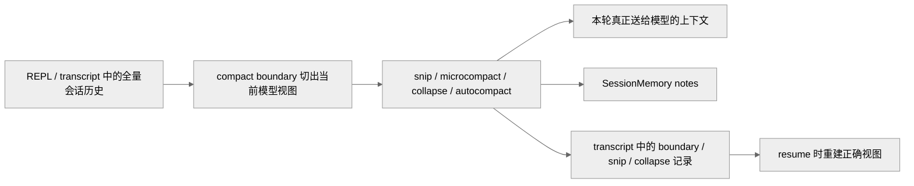

---

## 5. 与性能、缓存、恢复文档的关系

上下文管理现在独立成篇后，相关文档的分工可以明确为：

- [06-query-and-request.md](./06-query-and-request.md)
  负责 `query()` 主循环和调用时序，只保留上下文管理的入口位置
- [16-performance-cache-context.md](./16-performance-cache-context.md)
  负责性能、cache、GC、观测和长会话稳定性，只保留上下文管理的性能侧影响
- [13-session-storage-and-resume.md](./13-session-storage-and-resume.md)
  负责 transcript / resume 如何恢复 boundary、snip、collapse 结果
- [14-prompt-system.md](./14-prompt-system.md)
  负责 compact prompt 和相关二级 prompt 的提示词层设计

如果需要抓主线，推荐阅读顺序是：

1. 本篇 [07-context-management.md](./07-context-management.md)
2. [06-query-and-request.md](./06-query-and-request.md)
3. [16-performance-cache-context.md](./16-performance-cache-context.md)
4. [13-session-storage-and-resume.md](./13-session-storage-and-resume.md)
5. [14-prompt-system.md](./14-prompt-system.md)

---

## 6. 关键源码锚点

| 主题 | 代码锚点 | 说明 |
| --- | --- | --- |
| query 入口中的上下文治理顺序 | `src/query.ts:365-468` | boundary、budget、snip、microcompact、collapse、autocompact |
| `snip` 调用点 | `src/query.ts:396-410` | 最细粒度删消息路径 |
| `microcompact` 主体 | `src/services/compact/microCompact.ts` | time-based 与 cached 两条路径 |
| cache editing 请求拼装 | `src/services/api/claude.ts` | `cache_edits` / `cache_reference` |
| `context collapse` 投影入口 | `src/query.ts`、`src/commands/context/context.tsx` | `projectView()` 语义 |
| autocompact gate | `src/services/compact/autoCompact.ts` | 阈值、失败熔断、SessionMemory 快路径 |
| compact prompt | `src/services/compact/prompt.ts` | `NO_TOOLS_PREAMBLE` 与结构化 summary |
| transcript 中的 snip / collapse 恢复 | `src/utils/sessionStorage.ts` | boundary、snip relink、collapse commit/snapshot |

---

## 7. 总结

Claude Code 的上下文管理系统并不是一个单独模块，而是 query 主回合前的一条治理流水线：

1. 先用 boundary 和 tool-result budget 控制模型视图
2. 再按轻到重的顺序尝试 `snip -> microcompact -> context collapse -> autocompact`
3. 真正失败时，再进入 reactive recovery
4. 其中 `SessionMemory`、transcript、compact prompt 都分别承担快路径、持久化、重写器角色

如果只保留一句话，那么它应当是：

> Claude Code 不是把“历史越积越长地喂给模型”，而是在每轮请求前重新计算一次“这次真正值得进入上下文的视图”。

## 工具系统与权限机制

# 工具系统与权限机制

本篇梳理模型如何通过工具协议、权限判定和执行编排进入持续调用工具的 Agent 运行方式。

## 1. 为什么工具系统是这套工程的主轴

在这套代码里，模型不是“只会输出文本”，而是被设计成一个会持续调用工具的 Agent。

因此工具系统必须同时解决：

1. 工具如何定义与暴露给模型。
2. 工具如何校验输入。
3. 工具调用前如何判定权限。
4. 哪些工具可以并发，哪些必须串行。
5. 工具结果如何回流进消息流。
6. MCP 工具、Agent 工具、内建工具如何统一。

这套能力主要分布在：

- `src/Tool.ts`
- `src/tools.ts`
- `src/hooks/useCanUseTool.tsx`
- `src/services/tools/toolOrchestration.ts`
- `src/services/tools/toolExecution.ts`
- `src/services/tools/StreamingToolExecutor.ts`

## 2. `Tool.ts`：工具协议层

关键代码：

- `src/Tool.ts:123-138` `ToolPermissionContext`
- `src/Tool.ts:158-260` `ToolUseContext`
- `src/Tool.ts:358-362`
- `src/Tool.ts:783` `buildTool(...)`

## 2.1 `ToolPermissionContext`

这不是一个简单的“允许/拒绝”布尔值，而是一整组权限环境：

- `mode`
- `additionalWorkingDirectories`
- `alwaysAllowRules`
- `alwaysDenyRules`
- `alwaysAskRules`
- `isBypassPermissionsModeAvailable`
- `shouldAvoidPermissionPrompts`
- `awaitAutomatedChecksBeforeDialog`
- `prePlanMode`

这说明权限系统不是单点判断，而是一个上下文敏感的策略系统。

## 2.2 `ToolUseContext`

这是工具调用时最核心的运行时上下文，前文已提到。它把下面这些东西放在一起：

- 可见 tools/commands
- 当前 model 与 thinking config
- mcp clients / resources
- app state getter/setter
- messages
- read file cache
- response / stream / notification 回调
- agent 相关上下文

所以一个工具不仅能拿到输入，还能拿到整个 turn 宇宙。

## 2.3 `buildTool()` 的意义

`buildTool()` 的存在说明工具定义不是随意对象，而是一个标准化 DSL。

它能统一填补：

- 默认行为
- schema 能力
- 调用接口
- 展示属性

这样所有工具才能被同一套 orchestration 系统消费。

## 3. `tools.ts`：工具池装配器

关键文件：`src/tools.ts`

这层负责三件事：

1. 返回所有内建基础工具。
2. 根据权限上下文过滤工具。
3. 把 MCP 工具与内建工具合并成最终 tool pool。

### 3.1 `getAllBaseTools()`

会把大量工具注册进来，例如：

- Bash / PowerShell
- 读写编辑文件
- WebFetch / WebSearch
- Todo / Task
- MCP 相关
- SkillTool
- AgentTool
- 计划模式工具

这意味着模型看到的 tool list 本身就代表了“产品能力边界”。

### 3.2 `getTools(permissionContext)`

它会根据：

- deny 规则
- simple mode
- REPL mode
- `isEnabled()`

筛掉不可用工具。

### 3.3 `assembleToolPool(permissionContext, mcpTools)`

这一步不仅合并工具，还会做去重与顺序稳定。

顺序稳定的意义在于：

- 工具 schema 序列化顺序会影响 prompt cache。

## 4. REPL 中的工具池不是静态常量

关键代码：`src/screens/REPL.tsx:811`

REPL 通过 `useMergedTools(...)` 把：

- 初始工具
- MCP 动态工具
- 当前权限上下文

组合成“当前 turn 实际可见的工具池”。

这表示工具系统是运行时可变的，而不是进程启动时一次性决定。

## 5. 权限判定：`useCanUseTool`

关键文件：`src/hooks/useCanUseTool.tsx`

这是工具调用前权限判定的总入口。

## 5.1 输入输出形态

大致形态是：

```ts
async (tool, input, toolUseContext, assistantMessage, toolUseID, forceDecision?)
  => Promise<PermissionDecision>
```

返回结果通常是：

- `allow`
- `deny`
- `ask`
- 被取消

## 5.2 它不只是弹权限框

源码逻辑表明它会做：

- 构造 permission context
- 调用 `hasPermissionsToUseTool`
- 记录 classifier 自动批准/拒绝
- 某些 auto mode 拒绝通知
- 协调 coordinator / swarm worker 的权限流
- speculative bash classifier grace period
- 最后才落到交互式 permission dialog

权限路径大致是：

> 静态规则 -> 自动化判断 -> 协调模式特判 -> 交互式确认

## 6. 工具执行总编排：`runTools()`

关键代码：`src/services/tools/toolOrchestration.ts:19-82`

`runTools()` 的职责不是直接执行单个工具，而是对一批 `tool_use` block 做批处理编排。

## 6.1 批处理策略

通过 `partitionToolCalls(...)`，它会把工具调用分成：

- 并发安全批
- 非并发安全批

判定依据是：

- 找到对应 tool
- 用 `inputSchema.safeParse(...)` 解析输入
- 调用工具自己的 `isConcurrencySafe(parsedInput.data)`

### 6.1.1 为什么这个判断放在工具定义里

因为并发安全不是全局固定属性，常常与输入有关。

例如：

- 读文件通常并发安全
- 写文件、改状态、执行 shell 可能不安全

## 6.2 并发批与串行批的差异

### 并发批

- 用 `all(...)` 并行跑
- 收集 context modifier
- 等整批结束后再按 tool block 顺序应用 context modifier

### 串行批

- 逐个 `runToolUse(...)`
- 每个工具的 context 修改立刻生效

这里非常讲究一致性：

- 并发工具可以一起跑，但它们对共享上下文的修改不能乱序。

## 7. `runToolUse()`：单个工具调用生命周期

关键代码：`src/services/tools/toolExecution.ts:337-489`

流程大致是：

1. 根据 `toolUse.name` 在当前 tool pool 中找工具。
2. 如果找不到，再尝试通过 deprecated alias 找基础工具。
3. 如果仍找不到，生成 `tool_result` 错误消息。
4. 如果 query 已 aborted，返回 cancel tool_result。
5. 否则进入 `streamedCheckPermissionsAndCallTool(...)`。

### 7.1 为什么未知工具也要返回 `tool_result`

因为模型对话协议要求：

- `tool_use` 之后要有对应 `tool_result`

否则消息链会不匹配，下一轮会更糟。

## 8. `streamedCheckPermissionsAndCallTool()`：把 progress 与结果合并成一个异步流

关键代码：`src/services/tools/toolExecution.ts:492-570`

这里用一个 `Stream<MessageUpdateLazy>` 做了桥接：

- 工具执行过程中发 progress message
- 工具结束后再发最终 result message

这样 query 主循环只需要消费一个统一的异步迭代器。

## 9. `checkPermissionsAndCallTool()`：真正的工具调用主体

关键代码：`src/services/tools/toolExecution.ts:599-720` 以及其后续主体

这段逻辑至少包含：

1. Zod `inputSchema` 校验
2. tool 级 `validateInput`
3. 权限判定
4. hook 前后处理
5. 真正执行 tool.call
6. 格式化结果
7. 错误分类
8. 生成 `tool_result`

### 9.1 输入 schema 校验非常早

如果 `safeParse` 失败：

- 会生成结构化错误提示。
- 对 deferred tool 还会补充 “schema not sent hint”。

### 9.1.1 为什么有 “schema not sent hint”

因为某些延迟加载工具如果没被送入 prompt，模型可能会把数组/数字等参数错误地生成为字符串。

系统会提示模型：

- 先调用 ToolSearch 之类的机制把这个工具 schema 加载进 prompt，再重试。

这属于非常典型的“面向 LLM 失配模式”的工程补丁。

## 10. 流式工具执行器：`StreamingToolExecutor`

关键文件：`src/services/tools/StreamingToolExecutor.ts`

它的存在说明：

- 工具调用已经不是“等模型回答完再统一执行”。
- 系统希望在 streaming 过程中边接收边调度工具。

它通常管理：

- queued
- executing
- completed
- yielded

并处理：

- sibling cancellation
- bash error 后的传播
- interruptibility
- discard 旧结果

## 11. 权限与工具执行的完整图

```mermaid
---
config:
  theme: neutral
---
flowchart LR
    A[assistant tool_use] --> B[runToolUse]
    B --> C[按名称解析 Tool]
    C --> D[inputSchema 校验]
    D --> E[tool.validateInput]
    E --> F[useCanUseTool / PermissionDecision]
    F --> G{allow?}
    G -- 否 --> H[生成拒绝型 tool_result]
    G -- 是 --> I[执行 tool.call]
    I --> J[progress 消息]
    I --> K[格式化结果]
    K --> L[生成 tool_result]
    J --> M[query 消费 update]
    L --> M
```

## 12. MCP 工具与普通工具是如何统一的

从 orchestration 角度看，MCP 工具并没有完全特殊化：

- 依然会变成 `Tool` 抽象。
- 依然会经过同样的 permission / input validation / result formatting 主链路。

它们的特殊性主要体现在：

- 实际调用落到 `services/mcp/client.ts`
- 可能需要 OAuth / session / URL elicitation 处理

这是一种很好的架构结果：

- 扩展能力没有破坏内核协议。

## 13. AgentTool 为什么也是工具系统的一部分

`AgentTool` 虽然启动的是子代理，但从模型主循环视角，它依然只是一个 Tool。

这意味着：

- 模型调用 AgentTool 与调用 BashTool 在协议层没有本质区别。
- 子代理只是工具系统的一种高级能力。

这构成了整个工程实现“模型调用模型”的基础。

## 14. 工具结果为什么最终还是消息

无论是普通工具、MCP 工具还是 AgentTool，最终都会生成消息流中的一环：

- `tool_result`
- `progress`
- `attachment`

这样 query 主循环就可以继续复用统一消息协议，而不用为每种工具单独设计回流通道。

## 15. 关键源码锚点

| 主题 | 代码锚点 | 说明 |
| --- | --- | --- |
| 权限上下文定义 | `src/Tool.ts:123-138` | Tool 权限环境的结构 |
| ToolUseContext | `src/Tool.ts:158-260` | 工具运行时上下文 |
| 批处理入口 | `src/services/tools/toolOrchestration.ts:19-82` | 工具批编排 |
| 并发安全分区 | `src/services/tools/toolOrchestration.ts:91-115` | 为什么有并发批与串行批 |
| 单工具执行 | `src/services/tools/toolExecution.ts:337-489` | 单个 tool_use 的生命周期 |
| progress 流桥接 | `src/services/tools/toolExecution.ts:492-570` | progress 与结果如何统一成 async iterable |
| 输入校验 | `src/services/tools/toolExecution.ts:599-720` | safeParse + validateInput |
| 权限入口 | `src/hooks/useCanUseTool.tsx` | allow / deny / ask 决策链 |

## 16. 总结

工具系统是这套工程的执行总线：

- `Tool.ts` 定义协议。
- `tools.ts` 组装当前可见能力。
- `useCanUseTool` 决定“能不能执行”。
- `runTools` / `runToolUse` 决定“怎样安全执行”。
- `tool_result` 再把执行结果送回 query。

因此从架构角度看，工具不是模型的附属物，而是整个 Agent Runtime 的第一公民。

## 扩展体系：技能、插件与 MCP

# 扩展体系：技能、插件与 MCP

本篇梳理技能、插件与 MCP 如何直接并入命令总线和工具总线。

这里重点放在“扩展如何并入主系统”。若要继续看 MCP client、传输、资源与提示接口的协议层细节，请继续看 [10-mcp-system.md](./10-mcp-system.md)。

## 1. 这套工程为什么扩展能力这么强

因为它没有把“扩展”做成边缘插件，而是把扩展直接接进了两条核心总线：

1. 命令总线
2. 工具总线

于是：

- 技能会变成 slash command
- 插件会贡献命令、技能、hooks、agent
- MCP server 会贡献工具、资源，甚至在 SDK 模式下同进程运行

因此 `src/commands.ts`、`src/skills/loadSkillsDir.ts`、`src/utils/plugins/loadPluginCommands.ts`、`src/services/mcp/client.ts` 需要放在同一篇里分析。

## 2. 命令装配总入口：`commands.ts`

关键代码：

- `src/commands.ts:225-254` `INTERNAL_ONLY_COMMANDS`
- `src/commands.ts:258-346` `COMMANDS()`
- `src/commands.ts:449-469` `loadAllCommands(...)`
- `src/commands.ts:476-517` `getCommands(cwd)`

## 2.1 `COMMANDS()` 是内建命令表

它包含大量 built-in `/xxx` 命令，例如：

- `/clear`
- `/compact`
- `/config`
- `/memory`
- `/model`
- `/review`
- `/permissions`
- `/tasks`
- `/mcp`

并且会受 feature flags 与用户类型影响。

## 2.2 `getCommands(cwd)` 不是简单返回内建列表

它会合并：

- bundled skills
- builtin plugin skills
- skill directory commands
- workflow commands
- plugin commands
- plugin skills
- built-in commands
- dynamic skills

用户最终能输入的 `/xxx` 命令集合，是运行时动态拼出来的。

## 3. 技能系统：`loadSkillsDir.ts`

关键代码：

- `src/skills/loadSkillsDir.ts:270-400` `createSkillCommand(...)`
- `src/skills/loadSkillsDir.ts:923-975` `addSkillDirectories(...)`
- `src/skills/loadSkillsDir.ts:981-983` `getDynamicSkills()`
- `src/skills/loadSkillsDir.ts:997-1035` `activateConditionalSkillsForPaths(...)`

## 3.1 技能本质上会被编译成 `Command`

`createSkillCommand(...)` 会把技能 frontmatter + Markdown 内容转成统一的 `Command` 对象，并挂上：

- `name`
- `description`
- `allowedTools`
- `argumentHint`
- `argNames`
- `whenToUse`
- `version`
- `model`
- `disableModelInvocation`
- `userInvocable`
- `context`
- `agent`
- `effort`

结论如下：

- 技能不是另一套 DSL。
- 技能就是一种特殊来源的 prompt command。

## 3.2 技能 prompt 生成时做了哪些事

`getPromptForCommand(args, toolUseContext)` 里会做：

- 拼上 `Base directory for this skill`
- 参数替换
- 替换 `${CLAUDE_SKILL_DIR}`
- 替换 `${CLAUDE_SESSION_ID}`
- 如非 MCP 来源技能，还会执行技能 Markdown 内的 shell 注入

这使技能具备很强的上下文感知能力。

## 3.3 为什么 MCP 技能被特别防护

源码明确写了：

- MCP skills 是 remote and untrusted
- 不允许执行其 Markdown 里的 inline shell commands

技能扩展虽强，但系统明确区分本地可信技能与远程不可信技能。

## 4. 动态技能发现不是启动时一次性完成

关键代码：`src/skills/loadSkillsDir.ts:923-975`

`addSkillDirectories(dirs)` 允许系统在运行过程中动态加载新的 skill 目录。

典型场景：

- 文件操作触发了新的 skill dir discovery
- 目录更深的 skill 覆盖浅层 skill

这解释了为什么命令表并非静态，也解释了 REPL 里为什么要有 `useMergedCommands(...)`。

## 5. 条件技能：按文件路径激活

关键代码：`src/skills/loadSkillsDir.ts:997-1035`

条件技能的逻辑是：

- skill frontmatter 声明 `paths`
- 当用户对某些文件进行操作时，系统把文件路径喂给 `activateConditionalSkillsForPaths(...)`
- 命中的 skill 会被移入 dynamic skills

技能系统不仅是“手动 `/skill` 调用”，还是一种：

> 基于当前工作集的条件化提示词注入系统

## 6. 插件系统：`loadPluginCommands.ts`

关键代码：

- `src/utils/plugins/loadPluginCommands.ts:102-130` 收集 markdown
- `src/utils/plugins/loadPluginCommands.ts:135-167` skill 目录转换
- `src/utils/plugins/loadPluginCommands.ts:169-213` 目录转命令
- `src/utils/plugins/loadPluginCommands.ts:218-402` `createPluginCommand(...)`
- `src/utils/plugins/loadPluginCommands.ts:414-420` `getPluginCommands()`

## 6.1 插件命令与插件技能都归一成 Markdown -> Command

插件目录里的 Markdown 文件会被扫描，然后：

- 普通 `.md` 作为 plugin command
- `SKILL.md` 目录结构作为 plugin skill

这和本地技能系统高度统一。

## 6.2 命名空间设计

插件命令的名字会根据：

- plugin 名
- 相对路径命名空间
- 文件名或 skill 目录名

拼成类似：

- `pluginName:foo`
- `pluginName:namespace:skill`

这样既避免重名，又保留了来源信息。

## 6.3 插件 prompt 在生成时会做变量替换

包括：

- `${CLAUDE_PLUGIN_ROOT}`
- `${CLAUDE_PLUGIN_DATA}`
- `${CLAUDE_SKILL_DIR}`
- `${CLAUDE_SESSION_ID}`
- `${user_config.X}`

并且：

- 对敏感 user config 不会把秘密直接放进 prompt

这说明插件系统既追求能力，又兼顾安全边界。

## 6.4 插件命令也支持 shell 注入

和技能类似，插件命令/技能最终也能通过 `executeShellCommandsInPrompt(...)` 把局部 shell 输出并入 prompt。

所以从执行效果看，插件是一等扩展，不是薄外壳。

## 7. MCP 客户端：把外部能力接入工具系统

关键文件：`src/services/mcp/client.ts`

代码中显式支持多种 transport：

- `stdio`
- `sse`
- `http`
- `claudeai-proxy`
- `ws`
- SDK in-process transport

这意味着 MCP 在这套系统里并不是“一个简单 HTTP adapter”，而是完整的多传输协议能力层。

## 8. MCP 工具调用如何处理复杂异常

关键代码：`src/services/mcp/client.ts:2813-3026`

`callMCPToolWithUrlElicitationRetry(...)` 体现了 MCP 接入的工程深度。

### 8.1 它会处理 `UrlElicitationRequiredError`

流程是：

1. 调用 MCP tool。
2. 如果收到 `-32042 UrlElicitationRequired`：
   - 提取 elicitation 列表
   - 先跑 elicitation hooks
   - SDK/print 模式走 `handleElicitation`
   - REPL 模式则排入 `AppState.elicitation.queue`
3. 用户或 hook 接受后重试 tool call

MCP 工具调用并不是“一次函数调用”，而可能插入新的用户交互。

## 8.2 普通 MCP tool call 还带 timeout、progress、auth/session 恢复

关键代码：`src/services/mcp/client.ts:3029-3245`

`callMCPTool(...)` 会做：

- 自定义超时 race
- 30 秒一轮的长任务进度日志
- SDK progress 转换成 `mcp_progress`
- 处理 401 -> `McpAuthError`
- 处理 session expired -> 清缓存并抛 `McpSessionExpiredError`

MCP 客户端层不仅接协议，还负责连接生命周期治理。

## 9. SDK 模式下还支持 in-process MCP

关键代码：`src/services/mcp/client.ts:3262-3335`

`setupSdkMcpClients(...)` 会：

- 用 `SdkControlClientTransport`
- 建立同进程 client
- 拉取 capabilities
- 拉取 tools
- 生成 connected/failed 的 MCPServerConnection

这一层统一了：

- REPL 模式的外部 MCP
- SDK 模式的同进程 MCP

都能统一注入同一套工具系统。

## 10. 扩展体系总图

```mermaid
---
config:
  theme: neutral
---
flowchart TB
    A[commands.ts] --> B[built-in commands]
    A --> C[skill dir commands]
    A --> D[plugin commands]
    A --> E[plugin skills]
    A --> F[dynamic skills]

    C --> G[skills/loadSkillsDir.ts]
    D --> H[loadPluginCommands.ts]
    E --> H
    F --> G

    I[tools.ts] --> J[base tools]
    I --> K[MCP tools]
    K --> L[services/mcp/client.ts]

    G --> A
    H --> A
    L --> I
```

## 11. 这套扩展体系的设计优点

## 11.1 协议统一

技能、插件、MCP 没有各搞一套调用协议，而是最终落到：

- `Command`
- `Tool`
- `Message`

这让主循环可以保持稳定。

## 11.2 来源隔离

源码里会保留：

- source
- loadedFrom
- pluginInfo
- marketplace/repository 元数据

这有利于：

- 权限策略
- telemetry
- UI 来源展示

## 11.3 运行期可增量变化

命令和工具池都能在运行时变化：

- 新 MCP server 连上
- 动态技能被激活
- 插件热更新

因此扩展系统不是“启动时注册完就不变”的传统插件系统，而是动态能力系统。

## 12. 关键源码锚点

| 主题 | 代码锚点 | 说明 |
| --- | --- | --- |
| 命令合并 | `src/commands.ts:449-517` | 各类命令源如何汇总 |
| 技能命令化 | `src/skills/loadSkillsDir.ts:270-400` | skill frontmatter 与 prompt 生成 |
| 动态技能 | `src/skills/loadSkillsDir.ts:923-1035` | 目录发现与条件激活 |
| 插件命令生成 | `src/utils/plugins/loadPluginCommands.ts:218-402` | plugin markdown -> Command |
| MCP URL elicitation | `src/services/mcp/client.ts:2813-3026` | 需要用户打开 URL 时的处理 |
| MCP tool call | `src/services/mcp/client.ts:3029-3245` | timeout/progress/auth/session |
| SDK MCP | `src/services/mcp/client.ts:3262-3335` | 同进程 MCP 接入 |

## 13. 总结

这套扩展体系的核心价值在于：

- 不是把插件附着在系统边缘。
- 而是把技能、插件、MCP 直接并入命令表、工具池和主循环。

因此扩展能力并不是“锦上添花”，而是这套 Agent Runtime 的组成部分。

## Claude Code 的 MCP 系统

# Claude Code 的 MCP 系统

## 1. MCP 系统概述

本篇讨论 MCP client、transport、tool/resource/prompt 接口，以及它如何接入 Claude Code 的统一工具总线。

扩展总线的高层入口已经在 [09-extension-skills-plugins-mcp.md](./09-extension-skills-plugins-mcp.md) 说明；本篇只保留 MCP 协议与运行时本身。

```mermaid
---
config:
  theme: neutral
---
flowchart LR
    subgraph ClaudeCode["Claude Code"]
        A1["MCPClient"]
        A2["工具转换层"]
        A3["资源工具"]
    end

    subgraph Protocol["MCP 协议"]
        B1["JSON-RPC 消息"]
        B2["工具调用"]
        B3["资源读写"]
    end

    subgraph MCPServer["MCP Server"]
        C1["StdioTransport"]
        C2["HTTP/SSE Transport"]
        C3["外部服务"]
    end

    A1 <-->|JSON-RPC| B1
    A2 --> A1
    A3 --> A1
    B1 --> C1
    B1 --> C2
    C1 --> C3
    C2 --> C3
```

## 2. MCP 客户端

**位置**: `src/services/mcp/client.ts`

### 2.1 MCP 连接接口

```typescript
export interface MCPServerConnection {
  readonly name: string                    // 服务器名称
  readonly type: 'stdio' | 'http'        // 连接类型

  // 工具
  listTools(): Promise<McpTool[]>
  callTool(name: string, args: Record<string, unknown>): Promise<ToolResult>

  // 资源
  listResources(): Promise<ServerResource[]>
  readResource(uri: string): Promise<ResourceContent>

  // 提示
  listPrompts(): Promise<Prompt[]>
  getPrompt(name: string, args?: Record<string, string>): Promise<GetPromptResult>

  // 生命周期
  close(): void
}
```

### 2.2 MCP 客户端实现

```mermaid
---
config:
  theme: neutral
---
sequenceDiagram
    participant Client as MCPClient
    participant Transport as McpTransport
    participant Server as MCP Server

    Client->>Client: initialize()
    Client->>Server: JSON-RPC initialize
    Server-->>Client: capabilities

    Client->>Server: tools/list
    Server-->>Client: tools[]

    Client->>Server: tools/call
    Server-->>Client: result
```

## 3. MCP 传输

### 3.1 Stdio 传输

**位置**: `src/services/mcp/InProcessTransport.ts`

```mermaid
---
config:
  theme: neutral
---
flowchart TB
    subgraph Stdio["StdioTransport"]
        A1["spawn process"]
        A2["stdin/stdout"]
        A3["messageBuffer"]
    end

    A1 --> A2 --> A3

    subgraph Send["发送"]
        B1["send(message)"]
        B2["JSON.stringify"]
        B3["stdin.write"]
    end

    subgraph Receive["接收"]
        C1["stdout.on('data')"]
        C2["handleData()"]
        C3["parse JSON"]
        C4["handleMessage()"]
    end

    B1 --> B2 --> B3
    C1 --> C2 --> C3 --> C4
```

### 3.2 HTTP 传输 (SSE)

```mermaid
---
config:
  theme: neutral
---
flowchart LR
    A["connect()"] --> B["fetch SSE 端点"]
    B --> C["读取 ReadableStream"]
    C --> D{"数据?"}

    D -->|chunk| E["decoder.decode()"]
    E --> F["handleSSEData()"]

    D -->|done| G["关闭"]

    F --> H["解析 data: 行"]
    H --> I["JSON.parse"]
    I --> J["handleMessage()"]
```

## 4. MCP 工具集成

### 4.1 工具转换为 Claude Tools

```mermaid
---
config:
  theme: neutral
---
flowchart LR
    A["MCP 服务器"] --> B["listTools()"]

    B --> C["McpTool[]"]

    C --> D["对每个工具"]

    D --> E["wrapMCPTool()"]
    E --> F["buildTool()"]
    F --> G["Claude Tool"]

    G --> H["注册到 AppState"]
```

### 4.2 工具注册

```typescript
export async function loadMcpTools(
  clients: MCPServerConnection[]
): Promise<Tools> {
  const tools: Tools = []

  for (const client of clients) {
    try {
      const mcpTools = await client.listTools()

      for (const mcpTool of mcpTools) {
        tools.push(wrapMCPTool(client, mcpTool))
      }
    } catch (error) {
      console.error(`Failed to load tools from ${client.name}:`, error)
    }
  }

  return tools
}
```

## 5. MCP 资源

### 5.1 资源定义

```typescript
export interface ServerResource {
  uri: string
  name: string
  description?: string
  mimeType?: string
}

export interface ResourceContent {
  uri: string
  mimeType: string
  content: string | Uint8Array
}
```

### 5.2 资源工具

```mermaid
---
config:
  theme: neutral
---
flowchart TB
    subgraph List["ListMcpResources"]
        A1["遍历 mcpClients"]
        A2["listResources()"]
        A3["合并资源"]
    end

    subgraph Read["ReadMcpResource"]
        B1["解析 uri"]
        B2["查找 MCP Server"]
        B3["readResource()"]
    end
```

## 6. MCP 配置

### 6.1 配置格式

**位置**: `src/services/mcp/config.ts`

```mermaid
---
config:
  theme: neutral
---
flowchart LR
    A["mcp.json"] --> B["MCPConfig"]

    B --> C["servers[]"]

    C --> D["server.name"]
    C --> E["server.type"]

    E -->|stdio| F["command, args"]
    E -->|http| G["url, headers"]
```

### 6.2 配置加载

```typescript
export function loadMCPConfig(): MCPConfig {
  // 尝试多个位置
  const locations = [
    path.join(cwd, 'mcp.json'),
    path.join(getConfigDir(), 'mcp.json'),
  ]

  for (const location of locations) {
    if (existsSync(location)) {
      const content = readFileSync(location, 'utf-8')
      return JSON.parse(content)
    }
  }

  return { servers: [] }
}
```

## 7. MCP 权限

### 7.1 权限检查

```mermaid
---
config:
  theme: neutral
---
flowchart LR
    A["资源访问请求"] --> B["findMCPResource()"]

    B --> C{"资源存在?"}

    C -->|否| D["返回 deny"]

    C -->|是| E{"匹配 alwaysAllow?"}

    E -->|是| F["返回 allow"]
    E -->|否| G{"匹配 alwaysDeny?"}

    G -->|是| H["返回 deny"]
    G -->|否| I["返回 prompt"]
```

## 8. MCP 状态管理

### 8.1 连接状态

```typescript
export type MCPConnectionState =
  | { status: 'connecting' }
  | { status: 'connected' }
  | { status: 'disconnected'; error?: string }
  | { status: 'error'; error: string }
```

### 8.2 状态更新

```mermaid
---
config:
  theme: neutral
---
flowchart LR
    A["updateMCPClientState()"] --> B["setAppState()"]

    B --> C["prev.mcp.clients.map()"]
    C --> D["匹配 name?"]

    D -->|是| E["更新 state"]
    D -->|否| F["保持不变"]
```

## 9. MCP 生命周期

### 9.1 启动流程

```mermaid
---
config:
  theme: neutral
---
flowchart LR
    A["startMCPClients()"] --> B["loadMcpConfig()"]

    B --> C{"servers[]"}

    C -->|每个服务器| D["createTransport()"]

    D --> E["new MCPClient()"]
    E --> F["client.initialize()"]

    F --> G{"成功?"}

    G -->|是| H["更新状态 connected"]
    G -->|否| I["更新状态 error"]

    H --> J["注册工具"]
    I --> C
    J --> C
```

### 9.2 关闭流程

```mermaid
---
config:
  theme: neutral
---
sequenceDiagram
    participant Stop as stopMCPClients()
    participant Client as MCPClient
    participant State as AppState

    Stop->>Client: client.close()
    Client-->>Stop: 完成

    Stop->>State: setAppState() 清空 mcp.clients 与 mcp.tools
    State-->>Stop: 状态已重置
```

## 10. MCP 提示 (Prompts)

### 10.1 提示定义

```typescript
export interface MCPPrompt {
  name: string
  description?: string
  arguments?: {
    name: string
    description?: string
    required?: boolean
  }[]
}
```

### 10.2 提示工具

```mermaid
---
config:
  theme: neutral
---
flowchart LR
    A["MCPPromptsTool.call()"] --> B{"server 参数?"}

    B -->|有| C["过滤指定服务器"]
    B -->|无| D["遍历所有服务器"]

    C --> E["listPrompts()"]
    D --> E

    E --> F["合并提示"]
    F --> G["返回结果"]
```

## 13. 补充：关键实现细节

### 13.1 MCP 认证体系

MCP 认证是这个子系统中最复杂的部分（auth.ts 88KB）：
- XAA (eXternal Auth for Anthropic)：Anthropic 自有的认证扩展
- XAA-IDP：通过身份提供商的间接认证
- OAuth 2.0：标准的授权码流程
- Bearer Token：简单的令牌认证

URL 诱导协议（URL Elicitation）允许 MCP 服务器在连接过程中请求用户输入 URL 或凭证，带有重试逻辑。

### 13.2 MCP 传输类型

实际支持 6 种传输：
1. stdio：spawn 子进程，stdin/stdout 通信
2. SSE：HTTP Server-Sent Events
3. HTTP：标准 HTTP POST（streamable-http）
4. claudeai-proxy：通过 claude.ai 代理
5. WebSocket：WS 连接
6. in-process（SDK 模式）：SdkControlClientTransport

### 13.3 工具调用超时

MCP 工具调用有超时竞赛机制。如果工具执行超时，会返回超时错误而非无限等待。超时期间会记录 progress 日志。

### 13.4 JSON-RPC 消息格式

所有 MCP 通信使用 JSON-RPC 2.0：
- 请求：{ jsonrpc: "2.0", id: number, method: string, params: object }
- 响应：{ jsonrpc: "2.0", id: number, result: object }
- 通知：{ jsonrpc: "2.0", method: string, params: object }（无 id）

消息缓冲器处理分帧：JSON 消息可能跨多个 chunk 到达，缓冲器负责拼接和解析。

### 13.5 Schema 转换

JSON Schema → Zod schema 的转换不是通用的。它处理常见的 JSON Schema 结构（object、string、number、boolean、array、enum），但对于高度复杂的 schema（如 allOf/anyOf 嵌套）可能降级为 z.any()。

---

*文档版本: 1.0*
*分析日期: 2026-03-31*

## Hooks 生命周期与运行时语义

# Hooks 生命周期与运行时语义

本篇梳理 hooks 的来源、执行方式以及独立的安全和运行时约束。

## 1. 为什么 hooks 需要单独成篇

现有文档已经多次提到 hooks：

- startup 受 hooks 顺序约束
- 输入提交前会跑 hooks
- stop hooks 会影响 query 结束
- 子代理也有自己的 hooks

但源码里 hooks 实际上已经形成了一个完整子系统：

1. 有独立事件模型。
2. 有独立的 source 合并与 managed-only 策略。
3. 有命令 hook、prompt hook、HTTP hook、agent hook、function hook 五类执行形态。
4. 有 async registry、watch path、permission request、elicitation 等扩展协议。

换句话说，hooks 在这个仓库里不是“脚本回调”，而是：

> 一个能在运行时拦截、补充、阻断、重试和观察主流程的事件总线。

## 2. Hook 事件模型非常宽

关键代码：`src/utils/hooks/hooksConfigManager.ts:26-268`

`getHookEventMetadata()` 已经基本把 hooks 的协议面暴露出来了，包括：

- `PreToolUse`
- `PostToolUse`
- `PostToolUseFailure`
- `PermissionDenied`
- `PermissionRequest`
- `UserPromptSubmit`
- `SessionStart`
- `Stop`
- `StopFailure`
- `SubagentStart`
- `SubagentStop`
- `PreCompact`
- `PostCompact`
- `Setup`
- `ConfigChange`
- `InstructionsLoaded`
- `CwdChanged`
- `FileChanged`
- `Elicitation`
- `ElicitationResult`

hooks 已经覆盖了：

- 用户输入前后
- 工具调用前后
- 权限判定
- 会话生命周期
- 压缩生命周期
- 配置变化
- 文件系统变化
- MCP 交互
- 子代理生命周期

## 3. hook 来源不是一处，而是三路汇聚

关键代码：

- `src/utils/hooks/hooksConfigSnapshot.ts:9-52`
- `src/utils/hooks/hooksConfigManager.ts:270-361`
- `src/utils/hooks/sessionHooks.ts`

运行时真正参与组装的 hooks 至少有三类：

1. settings 文件中的 hooks
2. 已注册的 plugin/builtin hooks
3. session-scoped hooks

其中 session hooks 又包括：

- skill frontmatter 注入
- agent frontmatter 注入
- function hooks
- 某些只存在于当前 session 内存态的临时 hook

这意味着“我在 settings.json 里配了一个 hook”和“技能/插件/子代理临时注册了一个 hook”，最终都会在同一执行器里碰头。

## 4. hooks 可见性先经过 policy snapshot 过滤

关键代码：`src/utils/hooks/hooksConfigSnapshot.ts:9-121`

这里的关键不是“读取 hooks”，而是“读取 allowed hooks”。

过滤规则大致是：

- managed settings 的 `disableAllHooks=true`：全部 hooks 禁用
- managed settings 的 `allowManagedHooksOnly=true`：只保留 managed hooks
- `strictPluginOnlyCustomization`：阻断 user/project/local settings hooks，但 plugin hooks 不受这个 execution-time 过滤影响
- 非 managed settings 的 `disableAllHooks=true`：只能禁用非 managed hooks，managed hooks 仍然保留

hooks 子系统的安全模型明显高于一般配置项：

> 非托管配置不能完全关闭托管 hooks，也不能随意越权影响插件/策略层的 hook 通道。

## 5. startup 为什么要 capture hook snapshot

关键代码：

- `src/utils/hooks/hooksConfigSnapshot.ts:95-121`
- `src/setup.ts` 中的 `captureHooksConfigSnapshot()` 调用

snapshot 的意义不是简单 cache，而是：

1. 在启动早期冻结“本 session 当前允许看到的 hooks 集合”。
2. 避免 trust 前后、cwd 切换、外部编辑抖动导致读取面漂移。
3. 在用户显式修改 hooks 后，再通过 `updateHooksConfigSnapshot()` 重新同步。

这与 settings cache 类似，但目标更偏向：

- 启动一致性
- 安全边界
- 运行期稳定性

## 6. trust 是所有 hooks 的统一硬门槛

关键代码：`src/utils/hooks.ts:286-299`

`shouldSkipHookDueToTrust()` 的规则很明确：

- 非交互模式：默认可信，hooks 可运行
- 交互模式：所有 hooks 都要求 trust 已建立

源码注释还明确提到，这个统一 trust gate 是为了防未来 bug 和历史漏洞重现，例如：

- SessionEnd hooks 在用户拒绝 trust 后仍被执行
- SubagentStop hooks 在 trust 建立前就落地

所以这里不是“某些危险 hook 才需要 trust”，而是：

> 交互态下，所有 hook 执行都被视为潜在的任意命令执行面。

## 7. `executeHooks()` 与 `executeHooksOutsideREPL()` 代表两种消费方式

关键代码：

- `src/utils/hooks.ts:2034-3072` `executeHooks()`
- `src/utils/hooks.ts:3086-3504` `executeHooksOutsideREPL()`

两者的区别不是“一个同步一个异步”，而是：

- `executeHooks()` 走 REPL/消息流语义，可 yield 消息给模型或 UI
- `executeHooksOutsideREPL()` 更偏 command-style 执行，返回聚合结果

这对应了 hooks 在系统里的两种角色：

1. 参与当前对话回合
2. 参与后台/非 UI 生命周期事件

## 8. hook 输出协议已经远超 stdout/stderr

关键代码：

- `src/utils/hooks.ts:399-566` `parseHookOutput()` / `parseHttpHookOutput()`
- `src/utils/hooks.ts:568-775` `processHookJSONOutput()`

如果 stdout 以 `{` 开头，系统会按 hook JSON schema 解释，而不是纯文本。

它支持的语义包括：

- `continue: false`
- `stopReason`
- `decision: approve | block`
- `permissionDecision`
- `updatedInput`
- `additionalContext`
- `watchPaths`
- `retry`
- `worktreePath`
- elicitation response override

hook 已经不是“打印一段提示词给模型看”，而是：

> 一个结构化的控制协议，能够回写权限决策、工具输入、MCP 响应、文件观察集甚至 worktree 路径。

## 9. 执行器支持多种 hook 形态

关键代码：

- `src/utils/hooks.ts`
- `src/utils/hooks/execPromptHook.ts`
- `src/utils/hooks/execAgentHook.ts`
- `src/utils/hooks/execHttpHook.ts`

当前至少有四类主要执行形态：

1. shell command hook
2. prompt hook
3. agent hook
4. HTTP hook

其中最值得注意的是：

- agent hook 会启动一个受限子代理来判定条件是否满足
- HTTP hook 会走 allowlist、env var allowlist、SSRF 防护、proxy 路由
- prompt hook 与 agent hook 都说明 hooks 并不局限于“系统外部脚本”

## 10. HTTP hooks 有独立安全模型

关键代码：

- `src/utils/hooks/execHttpHook.ts:44-201`
- `src/utils/hooks/ssrfGuard.ts:6-287`

HTTP hook 的设计明显比 shell hook 更谨慎：

- URL 必须匹配 `allowedHttpHookUrls`
- 只有显式列入 `allowedEnvVars` 的变量才允许插值进 header
- policy 层还能继续收紧 env var allowlist
- 会检查 SSRF 风险，阻断 private/link-local address
- loopback 被明确允许，便于本地开发

这说明团队已经把 HTTP hooks 当作一个“可能把本地秘密和网络访问联动起来”的高风险面来治理。

## 11. session hooks 与 function hooks 是运行时内存结构，不写磁盘

关键代码：`src/utils/hooks/sessionHooks.ts:47-214`

`sessionHooks` 用 `Map<string, SessionStore>` 保存，而且有一段很重要的注释解释为什么不用普通对象：

- `.set()` / `.delete()` 不改变容器 identity
- 可以让 store 的监听器不被无谓触发
- 在高并发 schema-mode agents 场景下避免 O(N²) copy 成本

此外 function hooks：

- 只存在于 session 内存中
- 直接运行 TypeScript callback
- 不能被序列化成普通 HookMatcher

hooks 子系统既支持持久配置，也支持：

> 仅为当前会话或当前代理临时挂上的内存态运行时约束。

## 12. 技能与代理的 frontmatter hooks 会被“翻译”成 session hooks

关键代码：

- `src/utils/hooks/registerFrontmatterHooks.ts`
- `src/utils/hooks/registerSkillHooks.ts`

这里有两个很有代表性的行为：

- skill hooks 注册成 session-scoped hooks，可伴随 session 生命周期存在
- agent frontmatter 的 `Stop` hook 会被改写成 `SubagentStop`

后者尤其重要，因为它说明：

> hook event 并不是纯粹的静态配置名，而是会根据运行实体类型被重映射。

另外，skill hooks 的 `once: true` 会在成功执行后自动移除，也再次证明 session hooks 是动态集合。

## 13. async hooks 有独立 registry 与进度事件

关键代码：`src/utils/hooks/AsyncHookRegistry.ts:30-101`

异步 hooks 不会简单放飞不管，而是会：

- 注册到 pending async hook registry
- 发 hook started / progress / response 事件
- 在后台完成时回传 stdout/stderr/outcome

hook 在系统里也是可观测对象，而不是“黑盒外部进程”。

## 14. `ConfigChange`、`CwdChanged`、`FileChanged` 说明 hooks 还能反过来塑造运行环境

关键代码：

- `src/utils/hooks.ts:4309-4383`
- `src/utils/hooks/fileChangedWatcher.ts`

尤其是：

- `ConfigChange` 可以阻止配置变化应用到当前 session
- `CwdChanged` / `FileChanged` hook 可以返回 `watchPaths`
- `CLAUDE_ENV_FILE` 可供 hook 写入，影响后续 BashTool 环境

这里已经不是“生命周期通知”，而是：

> hooks 可以参与塑造后续环境、后续 watch 集和后续工具执行条件。

## 15. 一张总图

```mermaid
---
config:
  theme: neutral
---
flowchart LR
    A[settings hooks] --> D[hooks snapshot]
    B[plugin/builtin hooks] --> E[groupHooksByEventAndMatcher]
    C[session hooks] --> E
    D --> E
    E --> F{trust established?}
    F -- 否 --> G[skip hook execution]
    F -- 是 --> H[executeHooks / executeHooksOutsideREPL]
    H --> I{hook type}
    I -- command --> J[shell process]
    I -- http --> K[allowlist + SSRF guard + POST]
    I -- prompt --> L[prompt hook runtime]
    I -- agent --> M[subagent evaluation]
    J --> N[parse stdout as text or JSON]
    K --> N
    L --> N
    M --> N
    N --> O[blocking / retry / additionalContext / watchPaths / permissionDecision]
```

## 16. 关键源码锚点

| 主题 | 代码锚点 | 说明 |
| --- | --- | --- |
| hook 可见性过滤 | `src/utils/hooks/hooksConfigSnapshot.ts:9-121` | managed-only / disable-all 规则 |
| 事件元数据与 matcher | `src/utils/hooks/hooksConfigManager.ts:26-399` | hook 事件协议面 |
| trust gate | `src/utils/hooks.ts:286-299` | 交互态所有 hooks 统一要求 trust |
| REPL 内执行器 | `src/utils/hooks.ts:2034-3072` | 参与消息流的 hooks |
| 非 REPL 执行器 | `src/utils/hooks.ts:3086-3504` | 后台/生命周期 hook 执行 |
| hook JSON 输出处理 | `src/utils/hooks.ts:399-775` | 结构化控制协议 |
| session hooks | `src/utils/hooks/sessionHooks.ts:47-214`, `302-437` | 内存态 hook store 与 callback |
| HTTP hook 安全策略 | `src/utils/hooks/execHttpHook.ts:44-201` | URL allowlist、env allowlist、proxy |
| SSRF guard | `src/utils/hooks/ssrfGuard.ts:6-287` | 拒绝 private/link-local 地址 |
| frontmatter hook 注册 | `src/utils/hooks/registerFrontmatterHooks.ts`, `src/utils/hooks/registerSkillHooks.ts` | 技能/代理 hook 动态注入 |
| async hook registry | `src/utils/hooks/AsyncHookRegistry.ts:30-101` | 后台 hook 进度与收尾 |

## 17. 总结

这套 hooks 系统的本质不是“在某些节点跑脚本”，而是：

1. 用 settings/policy/snapshot 控制 hooks 是否可见。
2. 用统一执行器把 command/prompt/agent/http hook 拉进主运行时。
3. 用结构化 JSON 输出让 hook 反向控制权限、输入、重试和 watch 行为。
4. 用 session hooks、frontmatter hooks、async registry 扩展成一个真正的事件总线。

如果忽略这条主线，就很难解释为什么启动顺序、query 结束条件、子代理行为和配置变更都与 hooks 深度耦合。

## 设置系统、托管策略与环境变量注入

# 设置系统、托管策略与环境变量注入

本篇梳理 `settings` 如何通过多源合并、托管策略和 trust 前后分阶段注入影响运行时行为。

## 1. 为什么这是一条独立主线

现有文档已经提到：

- 启动时会提前加载 settings。
- MDM 会被提前预读。
- trust 之后会重新应用某些环境变量。

但源码里真正复杂的地方不是“读一个 settings.json”，而是：

1. 设置有多个来源，而且不是简单覆盖。
2. `policySettings` 自己内部又是一套单独优先级链。
3. 环境变量不是一次性全量注入，而是分“安全子集”和“完整注入”两段。
4. 运行中的文件变化、registry/plist 变化、drop-in 目录变化，还会走 watcher + hook 体系。

所以如果不单独把 settings 当成一个运行时子系统来读，很容易误判很多行为来源。

## 2. 设置源不是一层，而是一个合并栈

关键代码：

- `src/utils/settings/constants.ts:7-22` `SETTING_SOURCES`
- `src/utils/settings/constants.ts:128-175` `parseSettingSourcesFlag()` / `getEnabledSettingSources()`
- `src/utils/settings/settings.ts:645-865` `loadSettingsFromDisk()`

源码定义的设置源顺序是：

1. `userSettings`
2. `projectSettings`
3. `localSettings`
4. `flagSettings`
5. `policySettings`

这表示普通设置链路默认是：

> 低优先级在前，高优先级在后，后者覆盖前者。

但这里有两个重要例外：

- 插件设置先作为更低优先级 base 合进来，然后才轮到文件型 sources。
- `policySettings` 自己内部不是 deep merge 链，而是 “first source wins”。

仅记住“用户 < 项目 < 本地 < CLI < 托管”的顺序并不足以解释实际行为。

## 3. `--setting-sources` 不是装饰参数，而是初始化边界条件

关键代码：

- `src/main.tsx:432-499` `loadSettingsFromFlag()` / `loadSettingSourcesFromFlag()`
- `src/main.tsx:502-515` `eagerLoadSettings()`

`main.tsx` 会在 `init()` 之前就解析：

- `--settings`
- `--setting-sources`

其中 `--setting-sources` 只接受：

- `user`
- `project`
- `local`

而 `flagSettings` 和 `policySettings` 会被强制包含，见：

- `src/utils/settings/constants.ts:159-172`

这说明设计目标不是“让调用方把一切都关掉”，而是：

> 允许 SDK/CLI 隔离普通本地配置，但不能绕开显式 CLI 注入和企业托管策略。

## 4. `--settings` 的临时文件路径为什么要做 content hash

关键代码：`src/main.tsx:434-463`

当 `--settings` 传入 JSON 字符串时，代码不会随便生成一个随机临时文件，而是：

- 先校验 JSON
- 再用内容哈希生成稳定的 temp path

源码注释给出的原因非常关键：

- settings 文件路径会间接进入 Bash 工具的 sandbox denyWithinAllow 列表
- 这个列表又会进入发给模型的 tool description
- 如果路径每次都带随机 UUID，就会不断破坏 prompt cache prefix

这里的目的不是“为了方便调试”，而是：

> 配置文件路径本身会变成请求语义的一部分，因此连临时文件名都要为 cache 稳定性服务。

## 5. `policySettings` 不是普通 override，而是“单一获胜者”

关键代码：

- `src/utils/settings/settings.ts:667-729`
- `src/utils/settings/mdm/settings.ts:11-18`
- `src/utils/settings/mdm/settings.ts:67-132`

`loadSettingsFromDisk()` 对大多数 source 的处理是 deep merge，但遇到 `policySettings` 会改成：

1. remote managed settings
2. admin MDM: HKLM / macOS plist
3. `managed-settings.json` 与 drop-in
4. HKCU

只要某一层有内容，下面的层就不再提供 policy settings，只继续贡献 validation errors。

这条规则的本质不是“优先级更高”，而是：

> 企业托管策略必须有一个明确的 authoritative source，不能把不同托管来源再混合深合并。

## 6. MDM 读取为什么被拆成 raw read 和 parse/cache 两层

关键代码：

- `src/utils/settings/mdm/rawRead.ts`
- `src/utils/settings/mdm/settings.ts:67-106`

这层设计值得单独注意：

- `rawRead.ts` 只负责尽早发子进程读取 `plutil` / `reg query`
- `settings.ts` 负责等待结果、解析、缓存、区分 MDM 与 HKCU

这么拆的原因是：

1. `main.tsx` 顶层 import 阶段只能容纳极轻量模块。
2. 读取 subprocess 越早启动越能与重型 imports 并行。
3. 真正的 schema parse、错误聚合、first-source-wins 逻辑可以延后。

所以 MDM 预热不是一个小优化，而是 settings 子系统被明确切成了：

- 启动抢跑层
- 运行期解析层

## 7. 环境变量注入分成 trust 前后两段

关键代码：

- `src/utils/managedEnv.ts:124-184` `applySafeConfigEnvironmentVariables()`
- `src/utils/managedEnv.ts:187-198` `applyConfigEnvironmentVariables()`

这是当前文档里几乎没展开，但实际非常关键的一条语义线。

### 7.1 trust 前：只注入安全子集，但 trusted source 可更宽

`applySafeConfigEnvironmentVariables()` 的策略是：

- 先应用 global config
- 再应用 trusted setting sources 中的 env
- 计算 remote managed settings eligibility
- 再应用 policy env
- 最后只把 merged settings 中属于 `SAFE_ENV_VARS` 的键写回 `process.env`

这里“trusted source”主要指：

- user settings
- flag settings
- policy settings

而 project/local source 即使参与 merged settings，也只允许安全白名单 env 在 trust 前生效。

### 7.2 trust 后：完整环境变量才真正落地

`applyConfigEnvironmentVariables()` 则会：

- 把 global config 和 merged settings 的 env 全量写入 `process.env`
- 清掉 CA cert / mTLS / proxy cache
- 重新配置 global agents

trust 不只是 UI gating，而是：

> 决定是否允许项目级配置去影响真实运行环境。

## 8. settings change detector 不只是 watcher，而是“运行期配置治理器”

关键代码：

- `src/utils/settings/changeDetector.ts:84-173` `initialize()` / `subscribe`
- `src/utils/settings/changeDetector.ts:268-344` `handleChange()`
- `src/utils/settings/changeDetector.ts:381-430` `startMdmPoll()`

这层做的事至少有四类：

1. 用 `chokidar` 监听 settings 文件和 `managed-settings.d/`。
2. 维护 deletion grace，避免 delete-and-recreate 被误判成删除。
3. 轮询 MDM registry/plist，因为这类变化无法可靠走普通 FS watch。
4. 在发现变化后执行 `ConfigChange` hooks，并允许 hook 阻止本次变更应用到当前 session。

它不是“发现变化然后 reset cache”这么简单，而是：

> 把磁盘级配置变化，升级成一套带审查、带抑制、带 hook 的运行期事件。

## 9. `internal write` 与 `deletion grace` 说明团队遇到过真实抖动问题

关键代码：`src/utils/settings/changeDetector.ts:23-58`

两个细节非常工程化：

- `INTERNAL_WRITE_WINDOW_MS`
- `DELETION_GRACE_MS`

它们分别在对抗：

- Claude Code 自己写 settings 时，watcher 不应再把它当成外部变更。
- 编辑器/自动更新常见的“先删再原子替换”模式，不应被误报成删除。

settings 变更链路已经从“能跑”推进到“要在真实编辑器和真实文件系统行为下稳定运行”。

## 10. 某些设置读取会故意绕开 project settings

关键代码：

- `src/utils/settings/settings.ts:882-906`

例如：

- `hasSkipDangerousModePermissionPrompt()`
- `hasAutoModeOptIn()`

它们有意排除 `projectSettings`，原因也写得很直白：

> 恶意项目不应通过共享 project config 自动接受危险权限对话框或 auto mode opt-in。

settings 并不是单纯消费 merge 结果，而是：

- 某些行为读 merged settings
- 某些安全决策只信任 user/local/flag/policy

## 11. 一张总图

```mermaid
---
config:
  theme: neutral
---
flowchart LR
    A["CLI flags / disk / policy / plugin"] --> B[eagerLoadSettings]
    B --> C[loadSettingsFromDisk]
    C --> D[user + project + local + flag deep merge]
    C --> E[policy first-source-wins]
    D --> F[merged settings]
    E --> F
    F --> G[applySafeConfigEnvironmentVariables]
    G --> H[trust established]
    H --> I[applyConfigEnvironmentVariables]
    F --> J[changeDetector watcher + MDM poll]
    J --> K[ConfigChange hooks]
    K --> L[reset cache / subscribe updates]
```

## 12. 一组常见 env 配置的源码解读

如下配置可视为一组偏保守、偏隐私的 runtime profile：

```json
{
  "env": {
    "ENABLE_TOOL_SEARCH": "true",
    "CLAUDE_CODE_DISABLE_1M_CONTEXT": "1",
    "CLAUDE_CODE_ATTRIBUTION_HEADER": "0",
    "CLAUDE_CODE_DISABLE_NONESSENTIAL_TRAFFIC": "1",
    "CLAUDE_CODE_DISABLE_TERMINAL_TITLE": "1",
    "DISABLE_EXTRA_USAGE_COMMAND": "1"
  }
}
```

边界首先需要明确：这不是 Claude Code 的“默认推荐配置”，也不是一组纯性能开关。  
更准确的归类是 **偏隐私、偏保守、减少非必要表面积** 的 runtime profile。

逐项落到代码，比较可靠的解释如下：

| 变量 | 关键源码 | 直接效果 | 更准确的利弊 |
| --- | --- | --- | --- |
| `ENABLE_TOOL_SEARCH=true` | `src/utils/toolSearch.ts` | 强制走 `tst` 模式，deferred tools 通过 Tool Search 按需发现 | 主上下文里不必内联全部 deferred tool 描述，通常有利于 prompt 体积和 cache；但前提是当前 provider / gateway 支持 `tool_reference` |
| `CLAUDE_CODE_DISABLE_1M_CONTEXT=1` | `src/utils/context.ts` | 禁用 `[1m]` / 1M context 路径，context window 回到默认 200K 语义 | 降低长上下文成本、满足某些合规约束；代价是丢掉超长上下文 headroom |
| `CLAUDE_CODE_ATTRIBUTION_HEADER=0` | `src/constants/system.ts` | 不发送 `x-anthropic-billing-header` attribution header | 更少客户端标识信息；但会关掉 first-party attribution 相关信号 |
| `CLAUDE_CODE_DISABLE_NONESSENTIAL_TRAFFIC=1` | `src/services/mcp/officialRegistry.ts`、`src/utils/privacyLevel.ts` | 禁掉非必要网络流量，例如官方 MCP registry 预取 | 更隐私、更少出网；代价是某些体验型预热信息不再可用 |
| `CLAUDE_CODE_DISABLE_TERMINAL_TITLE=1` | `src/main.tsx`、`src/utils/gracefulShutdown.ts` | 不设置 / 不恢复终端标题 | 主要是终端整洁度和 shell 习惯问题，几乎不影响核心能力 |
| `DISABLE_EXTRA_USAGE_COMMAND=1` | `src/commands/extra-usage/index.ts` | 隐藏 `extra-usage` 命令入口 | 这是命令面板/能力入口收敛，不是性能优化 |

### 12.1 成本、隐私与产品表面积需要分开看

更接近源码事实的拆法如下：

- **偏成本 / cache / prompt 体积**：`ENABLE_TOOL_SEARCH`、`CLAUDE_CODE_DISABLE_1M_CONTEXT`
- **偏隐私 / 减少出网**：`CLAUDE_CODE_DISABLE_NONESSENTIAL_TRAFFIC`、`CLAUDE_CODE_ATTRIBUTION_HEADER`
- **偏 UI / 产品表面积收敛**：`CLAUDE_CODE_DISABLE_TERMINAL_TITLE`、`DISABLE_EXTRA_USAGE_COMMAND`

因此，把这组配置概括成“提速配置”会失真。它更像：

> 让客户端行为更保守、更少暴露、上下文上限更克制的一组偏好

### 12.2 如果这些键写在 `settings.json` 的 `env` 里，它们还不是同一时刻生效

这一点很容易被忽略。

`managedEnv.ts` 明确把 env 注入拆成两阶段：

- `applySafeConfigEnvironmentVariables()`：trust 前，只注入 `SAFE_ENV_VARS`
- `applyConfigEnvironmentVariables()`：trust 后，才把 merged settings 里的 env 全量写进 `process.env`

结合 `managedEnvConstants.ts` 可以看到：

- `ENABLE_TOOL_SEARCH`
- `CLAUDE_CODE_DISABLE_NONESSENTIAL_TRAFFIC`
- `CLAUDE_CODE_DISABLE_TERMINAL_TITLE`

属于 safe allowlist，更容易在 trust 前就影响运行时。

而下面这些则不在那份 safe allowlist 里：

- `CLAUDE_CODE_DISABLE_1M_CONTEXT`
- `CLAUDE_CODE_ATTRIBUTION_HEADER`
- `DISABLE_EXTRA_USAGE_COMMAND`

如果它们来自 `settings.json` 的 `env`，更接近 **trust 后全量 env 生效** 的路径。

这组配置展示的不是“一组同时翻转的启动开关”，而是一个跨 trust 边界的 runtime profile。

## 13. 关键源码锚点

| 主题 | 代码锚点 | 说明 |
| --- | --- | --- |
| 提前解析 settings flag | `src/main.tsx:432-515` | `--settings` / `--setting-sources` 必须早于 `init()` |
| source 列表与启用逻辑 | `src/utils/settings/constants.ts:7-22`, `128-175` | 普通 source 与 always-on source 的边界 |
| settings 真正合并 | `src/utils/settings/settings.ts:645-865` | 插件 base、deep merge、policy 特殊链 |
| policy first-source-wins | `src/utils/settings/mdm/settings.ts:11-18`, `67-132` | remote / MDM / managed file / HKCU |
| trust 前 env 注入 | `src/utils/managedEnv.ts:124-184` | trusted env + safe env 两阶段 |
| trust 后 env 注入 | `src/utils/managedEnv.ts:187-198` | 完整 env、生效后清 cache/rebuild agents |
| 变更检测入口 | `src/utils/settings/changeDetector.ts:84-173` | watcher 初始化与订阅 |
| 文件变化处理 | `src/utils/settings/changeDetector.ts:268-344` | reset cache + ConfigChange hooks |
| MDM 轮询 | `src/utils/settings/changeDetector.ts:381-430` | registry/plist 变化需要 poll |

## 14. 总结

这套 settings 系统的核心不是“读配置文件”，而是：

1. 用多源合并表达普通用户配置。
2. 用 `policySettings` 的 first-source-wins 表达企业托管策略。
3. 用 trust 前后的 env 两阶段注入保证安全边界。
4. 用 watcher、MDM poll 和 `ConfigChange` hooks 把配置变化纳入运行期治理。

启动链路、权限系统、hooks 与 provider 选择都依赖这条设置主线。

## Transcript 持久化、会话恢复与 `resume` 语义

# Transcript 持久化、会话恢复与 `resume` 语义

本篇拆解会话如何写入磁盘，以及 `--resume` / `--continue` 如何把磁盘状态重新恢复为 live runtime。

## 1. 这套系统存的不是“聊天记录”，而是 append-only 会话日志

关键文件：

- `src/utils/sessionStorage.ts`
- `src/utils/conversationRecovery.ts`
- `src/utils/sessionRestore.ts`

`sessionStorage.ts` 写入的并不只是 user/assistant 对话，还包括：

- transcript messages
- summary
- custom title / tag
- agent name / color / setting
- mode
- worktree state
- file history snapshots
- attribution snapshots
- content replacements
- context collapse commits / snapshot

所以它更像：

> 一个 append-only 的 session event log，而不是狭义 chat history。

## 2. transcript 路径与 sessionProjectDir 强耦合

关键代码：

- `src/utils/sessionStorage.ts:202-221` `getTranscriptPath()` / `getTranscriptPathForSession()`
- `src/utils/sessionStorage.ts:247-260` `getAgentTranscriptPath()`

这里一个非常重要的语义是：

- 路径不只取决于 `sessionId`
- 还取决于 `sessionProjectDir`

原因写得很清楚：

- `resume`、branch、worktree 等操作会切换 active session
- 如果 transcript path 仍按旧的 `originalCwd` 推导，就会发生“hook 看到的 transcript_path”和真实落盘位置不一致

会话文件定位本身就是恢复语义的一部分。

## 3. 文件是延迟 materialize 的，不是 session 一开始就创建

关键代码：

- `src/utils/sessionStorage.ts:956-986` `shouldSkipPersistence()` / `materializeSessionFile()`
- `src/utils/sessionStorage.ts:993-1078` `insertMessageChain()`
- `src/utils/sessionStorage.ts:1129-1144` `appendEntry()`

session file 的创建时机非常克制：

- 在首个真正的 user/assistant message 到来之前，只缓存 metadata / pending entries
- 首次出现 user/assistant message 时才 `materializeSessionFile()`

这样做的目的包括：

1. 避免启动即产生 metadata-only orphan session file。
2. 让 `--name`、mode、agentSetting 等信息先缓存，等真正有会话内容时再落盘。
3. 结合 `--no-session-persistence` / `cleanupPeriodDays=0` / test env 一起统一控制是否根本不写 transcript。

transcript 系统默认优先保证：

- resume 质量
- session 列表干净度
- 不制造伪会话

## 4. parentUuid 链才是“恢复对话”的核心结构

关键代码：

- `src/utils/sessionStorage.ts:132-150` `isTranscriptMessage()` / `isChainParticipant()`
- `src/utils/sessionStorage.ts:993-1078` `insertMessageChain()`
- `src/utils/sessionStorage.ts:2070-2146` `buildConversationChain()`

会话恢复不是按“文件顺序全部读出来”，而是按：

- 每条消息的 `uuid`
- 每条消息的 `parentUuid`

来重建主链。

此外还有几个非常关键的特判：

- `progress` 不参与 transcript chain
- `tool_result` 类型 user message 如果带 `sourceToolAssistantUUID`，会改写父节点
- compact boundary 会把 `parentUuid` 断开，并把旧父节点放到 `logicalParentUuid`

transcript 的核心数据结构不是数组，而是：

> 一张 append-only、可裁剪、可跨 boundary 重连的消息 DAG。

`compact boundary`、`snip`、`context collapse` 在运行时分别如何工作，完整说明见：

- [07-context-management.md](./07-context-management.md)

## 5. progress 被明确排除在持久化主链之外

关键代码：`src/utils/sessionStorage.ts:132-184`

源码里对 progress 的态度非常鲜明：

- progress 不是 transcript message
- progress 不参与 parentUuid chain
- 老 transcript 里历史遗留的 progress entry，还需要在 load 时 bridging

原因是：

- progress 是 UI 状态
- 如果让它进入 parent chain，会在 resume 时把真实对话链截断或分叉

因此这里会有：

- `isLegacyProgressEntry()`
- `progressBridge`

这些看起来很“兼容层”的逻辑。

## 6. `loadTranscriptFile()` 的复杂度来自“要在大文件上恢复正确链”

关键代码：

- `src/utils/sessionStorage.ts:3307-3417` `walkChainBeforeParse()`
- `src/utils/sessionStorage.ts:3473-3791` `loadTranscriptFile()`
- `src/utils/sessionStorage.ts:1840-1983` `applyPreservedSegmentRelinks()` / `applySnipRemovals()`

这段代码的关键点不是“读 JSONL”，而是：

1. 大 transcript 不能傻读全量，否则 RSS 爆炸。
2. compact boundary 前的大量旧数据要尽可能跳过。
3. 跳过旧段后，又必须恢复 boundary 前的关键 metadata。
4. 历史 progress、snip、preserved segment 还要被重新桥接。

所以 `loadTranscriptFile()` 实际做的是：

- 预扫描
- 大文件裁剪
- metadata 补回
- legacy bridge
- leaf 计算

它是一个“恢复算法”，不是简单 parser。

## 7. metadata 不是附属品，而是 resume 体验的一部分

关键代码：

- `src/utils/sessionStorage.ts:721-820` `reAppendSessionMetadata()`
- `src/utils/sessionStorage.ts:2759-2914` `restoreSessionMetadata()` / `cacheSessionTitle()` / `saveMode()` / `saveWorktreeState()`

最典型的一点是：

- custom title、tag、agent name/color、mode、worktree state 都会被缓存，并在合适时机重新 append 到 transcript 尾部

原因也写得很明确：

- `/resume` 的 lite metadata 读取依赖尾部窗口
- 如果 compaction 或后续写入把 metadata 挤出 tail window，resume picker 展示就会退化

因此 `reAppendSessionMetadata()` 的职责不是“重复写一下”，而是：

> 让关键 session metadata 始终处于 resume 系统能快速读到的位置。

## 8. sidechain / subagent transcript 是一级公民

关键代码：

- `src/utils/sessionStorage.ts:233-260` `getAgentTranscriptPath()`
- `src/utils/sessionStorage.ts:4191-4352` `getAgentTranscript()` / `loadSubagentTranscripts()`

子代理 transcript 并不是混在主 session 文件里，而是：

- 以 `session/subagents/.../agent-<id>.jsonl` 形式独立落盘
- 仍然使用同样的 load chain 逻辑
- 还能单独提取 content replacements

transcript 系统天然支持：

- 主链
- sidechain
- subagent chain

而不是后来临时拼接出来的功能。

## 9. `loadConversationForResume()` 才是 `resume` 的真正装配点

关键代码：`src/utils/conversationRecovery.ts:459-589`

它会统一处理多种来源：

- `undefined`：`--continue`，取最近 session
- sessionId：按会话恢复
- `LogOption`
- 任意 `.jsonl` 路径

然后依次做：

1. 必要时把 lite log 升级成 full log。
2. copy plan / copy file history。
3. `checkResumeConsistency()`。
4. 从 transcript 恢复技能状态。
5. 反序列化并检测中断状态。
6. 执行 `SessionStart(resume)` hooks。

所以 `resume` 不是“读盘然后 mount REPL”，而是：

> 重新把一份磁盘会话加工成当前进程可继续运行的 live session。

## 10. 反序列化阶段会主动修正老数据与异常中断

关键代码：

- `src/utils/conversationRecovery.ts:164-234` `deserializeMessagesWithInterruptDetection()`
- `src/utils/conversationRecovery.ts:272-344` `detectTurnInterruption()`
- `src/utils/conversationRecovery.ts:348-380` `isTerminalToolResult()`

这里会做几类重要修复：

- 迁移 legacy attachment type
- 过滤 unresolved tool uses
- 过滤 orphaned thinking-only assistants
- 过滤 whitespace-only assistant messages
- 把中断状态分成 `interrupted_prompt` / `interrupted_turn`
- 必要时自动注入一条 meta user continuation message

transcript 恢复不是“相信磁盘一定完美”，而是默认：

> 进程可能在 streaming、tool_use、brief mode 等中间状态被杀掉，因此恢复层必须主动消毒和补形状。

## 11. `sessionRestore.ts` 负责把恢复结果重新注入 bootstrap 与 AppState

关键代码：

- `src/utils/sessionRestore.ts:99-145` `restoreSessionStateFromLog()`
- `src/utils/sessionRestore.ts:200-249` `restoreAgentFromSession()`
- `src/utils/sessionRestore.ts:332-357` `restoreWorktreeForResume()`
- `src/utils/sessionRestore.ts:409-527` `processResumedConversation()`

这层会把磁盘恢复结果重新映射到：

- file history state
- attribution state
- context collapse state
- todo state
- main thread agent type / model override
- worktree cwd
- session metadata cache

并在非 fork resume 时调用：

- `adoptResumedSessionFile()`

让当前 session 直接继续写原 transcript 文件。

`resume` 的完整闭环至少跨了三层：

1. sessionStorage 读与链重建
2. conversationRecovery 反序列化与中断检测
3. sessionRestore 状态回灌

## 12. 一张总图

```mermaid
---
config:
  theme: neutral
---
flowchart LR
    A[insertMessageChain / appendEntry] --> B[append-only JSONL]
    B --> C[metadata entries + snapshots + sidechains]
    C --> D[loadTranscriptFile]
    D --> E[chain rebuild + leaf selection + metadata restore]
    E --> F[loadConversationForResume]
    F --> G[deserializeMessagesWithInterruptDetection]
    G --> H[processSessionStartHooks resume]
    H --> I[sessionRestore]
    I --> J[AppState / bootstrap / worktree / agent restored]
```

## 13. 关键源码锚点

| 主题 | 代码锚点 | 说明 |
| --- | --- | --- |
| transcript 路径规则 | `src/utils/sessionStorage.ts:202-260` | sessionProjectDir 与 agent transcript 路径 |
| 延迟 materialize | `src/utils/sessionStorage.ts:956-986`, `993-1078` | 首个真实对话消息才创建文件 |
| append / pending entry 逻辑 | `src/utils/sessionStorage.ts:1129-1274` | 当前 session 与其他 session 的写入分流 |
| metadata 重新追加 | `src/utils/sessionStorage.ts:721-820`, `2759-2914` | title/tag/mode/worktree 的持久化策略 |
| transcript 加载算法 | `src/utils/sessionStorage.ts:3307-3791` | precompact skip、bridge、leaf 计算 |
| 主链恢复 | `src/utils/sessionStorage.ts:2070-2146`, `3870-3924` | `buildConversationChain()` 与 last log |
| sidechain transcript | `src/utils/sessionStorage.ts:4191-4352` | subagent transcript 的单独恢复 |
| 反序列化与中断检测 | `src/utils/conversationRecovery.ts:164-380` | resolve legacy / interruption 语义 |
| resume 装配入口 | `src/utils/conversationRecovery.ts:459-589` | 多来源 resume 的统一入口 |
| 状态回灌 | `src/utils/sessionRestore.ts:99-145`, `200-249`, `332-357`, `409-527` | file history / worktree / agent / AppState 恢复 |

## 14. 总结

这套 transcript/resume 体系的核心不是“把历史消息保存下来”，而是：

1. 用 append-only JSONL 记录可恢复的完整会话状态。
2. 用 parentUuid 链而不是文件顺序恢复主对话。
3. 用大文件裁剪、legacy bridge、metadata 重追加保证 resume 质量。
4. 用 conversationRecovery + sessionRestore 把磁盘日志重新转换回 live runtime。

因此 `resume` 会跨 `sessionStorage.ts`、`conversationRecovery.ts`、`sessionRestore.ts` 三个大文件，而不是一个简单的“读取历史记录”函数。

## Claude Code 的提示词系统

# Claude Code 的提示词系统

本篇梳理 Claude Code 中各类提示词资产的类型、注入时机和运行时装配方式。

## 1. 定义

Claude Code 的“提示词系统”不是单个 `systemPrompt` 文件，而是一个由多层文本资产共同组成的运行时装配体系：

1. 主系统提示。
2. 用户上下文与系统上下文。
3. 工具描述与工具 schema 文本。
4. slash command / skill / plugin 展开的任务模板。
5. 子代理的专用 system prompt。
6. 各种二级模型调用的专用 prompt，例如 compact、memory、summary、title generation。

Claude Code 不是“先写一大段 system prompt，再随便调用工具”，而是把 prompt 当成整个运行时协议的一部分。

---

## 2. 先划清边界：什么算“提示词”

如果按“是否真正进入模型上下文”来划分，这个仓库里的文本大致分三类：

### 2.1 一定会进入模型

- `src/constants/prompts.ts` 里的主系统提示。
- `src/context.ts` 里注入的 `CLAUDE.md`、日期、git status。
- `src/tools/*/prompt.ts` 里的工具描述。
- `src/commands/*.ts` 中 `type: 'prompt'` 命令返回的文本模板。
- `src/skills/loadSkillsDir.ts`、`src/utils/plugins/loadPluginCommands.ts` 把 Markdown 技能/插件编译成的 prompt。
- `src/tools/AgentTool/built-in/*.ts` 里的子代理 system prompt。
- `src/services/compact/prompt.ts`、`src/services/SessionMemory/prompts.ts` 等二级任务 prompt。

### 2.2 可能进入模型

- hook 配置里的 prompt。
- MCP server 返回的 `instructions`。
- CLI 启动参数里的 `--system-prompt` / `--append-system-prompt`。
- 运行时 feature 打开的附加提示，例如 proactive、brief、chrome、advisor。

### 2.3 不应混进“提示词分析”的内容

- 单纯的 UI 文案、菜单文字、日志文本。
- 只展示给用户但不会送进模型的状态文案。
- 大量反编译残留的 stub 文件。

下文主要覆盖 2.1 与 2.2。

---

## 3. 全局地图

| 层级 | 典型源码 | 进入模型的方式 | 作用 |
| --- | --- | --- | --- |
| 主系统提示 | `src/constants/prompts.ts` | `getSystemPrompt()` | 定义 Claude Code 的角色、行为边界、风格、工具策略 |
| 用户上下文 | `src/context.ts` | `prependUserContext(...)` | 注入 `CLAUDE.md`、日期等“看起来像 user meta message”的上下文 |
| 系统上下文 | `src/context.ts` | `appendSystemContext(...)` | 追加 git status、cache breaker 等系统信息 |
| API 前缀块 | `src/services/api/claude.ts` | 请求前再 prepend | attribution、CLI prefix、advisor、chrome 附加说明 |
| 工具提示 | `src/tools/*/prompt.ts` | tool schema description | 把工具的语义、限制、最佳实践暴露给模型 |
| 命令模板 | `src/commands/*.ts` | slash command 展开成用户消息 | 把高层工作流包装成可重用任务模板 |
| 技能/插件 prompt | `src/skills/*`、`src/utils/plugins/*` | Markdown 编译成 `Command` | 让本地/插件能力变成 prompt 资产 |
| 子代理 system prompt | `src/tools/AgentTool/built-in/*.ts` | AgentTool 派生线程 | 给不同 agent 赋予专门人格和约束 |
| 二级模型 prompt | `src/services/*`、`src/utils/*` | `queryHaiku/queryModelWithoutStreaming` | 完成摘要、命名、分类、记忆提取等专用任务 |

---

## 4. 主链路：一次请求如何把提示词真正装进模型

## 4.1 基础 system prompt 从 `getSystemPrompt()` 开始

核心文件：`src/constants/prompts.ts`

`getSystemPrompt(...)` 负责构造 Claude Code 的基础 system prompt 数组。它不是一段字符串，而是一个分块数组，后面还会继续加工。

它的静态主干大致是：

1. `getSimpleIntroSection()`
2. `getSimpleSystemSection()`
3. `getSimpleDoingTasksSection()`
4. `getActionsSection()`
5. `getUsingYourToolsSection()`
6. `getSimpleToneAndStyleSection()`
7. `getOutputEfficiencySection()`

然后再接动态块：

- session-specific guidance
- auto memory
- env info
- language
- output style
- MCP instructions
- scratchpad
- tool-result clearing
- summarize-tool-results
- token budget / brief / proactive 等 feature 相关块

## 4.2 `QueryEngine` 和 `query()` 并不会直接把它原样发出去

相关文件：

- `src/QueryEngine.ts`
- `src/query.ts`
- `src/utils/queryContext.ts`

运行时还有几层装配：

1. `fetchSystemPromptParts(...)` 先拿到：
   - `defaultSystemPrompt`
   - `userContext`
   - `systemContext`
2. `customSystemPrompt` 会直接替换默认 system prompt。
3. `appendSystemPrompt` 会在末尾继续追加。
4. 某些模式还会再加 memory mechanics prompt、coordinator context、agent prompt。
5. `appendSystemContext(systemPrompt, systemContext)` 会把 systemContext 作为 system prompt 尾部拼进去。
6. `prependUserContext(messages, userContext)` 会把 userContext 作为一条 meta user message 放到消息前面。

Claude Code 的真正“上下文前缀”不是单一 system prompt，而是：

`system prompt blocks + user meta context message + 正常消息历史`

## 4.3 到了 API 层，还会再 prepend 一次

核心文件：`src/services/api/claude.ts`

在真正发请求前，`claude.ts` 会在系统提示前再塞几块：

- attribution header
- CLI system prompt prefix
- advisor 指令
- chrome tool search 指令

`constants/prompts.ts` 并不是最后一层。

---

## 5. 主系统提示的内部结构

## 5.1 这段 prompt 不是“教模型做事”，而是“定义产品人格”

`src/constants/prompts.ts` 里的主系统提示最核心的几件事是：

1. 定义身份：你是 Claude Code，不是普通聊天机器人。
2. 定义任务域：主要做软件工程任务。
3. 定义工具观：优先专用工具，不要乱用 Bash。
4. 定义风险观：高风险动作默认先确认。
5. 定义沟通观：中途汇报要短、要有信息量。
6. 定义真实性：不要虚报测试结果，不要把未验证工作说成完成。

这比“写点礼貌话术”要重得多，它直接规定了 Claude Code 的产品行为。

## 5.2 静态 section 的设计意图

### `# System`

重点是：

- 工具外文本会直接展示给用户。
- 权限模式是真实存在的执行边界。
- `<system-reminder>` 是系统层信号，不等于普通用户文本。
- 需要警惕 prompt injection。
- hooks 反馈应视为用户输入的一部分。

这部分定义的是“运行时协议”。

### `# Doing tasks`

这块非常像 Anthropic 内部对 coding agent 的经验总结，尤其强调：

- 不要过度设计。
- 不要凭空改没读过的代码。
- 不要随便创建新文件。
- 失败时先诊断，不要盲试。
- 修 bug 时不要顺手大重构。
- 要忠实汇报测试/验证结果。

它本质上是在压制“LLM 工程常见坏习惯”。

### `# Executing actions with care`

这块把动作按“可逆性”和“爆炸半径”来建模：

- 本地、可逆操作通常可直接做。
- 难以回滚、影响共享状态、对外可见的动作要先确认。

Claude Code 比一般 IDE 助手更像“代理系统”，原因在于它具备真实执行能力，因此 prompt 必须明确风控逻辑。

### `# Using your tools`

这里不是简单列工具，而是强行建立工具优先级：

- 读文件优先 `Read`
- 编辑优先 `Edit`
- 新建优先 `Write`
- 搜文件优先 `Glob`
- 搜内容优先 `Grep`
- Bash 只做 shell 真正需要的事

这块是整个工具体系能够“可审查”的关键。

### `# Tone and style` 与 `# Output efficiency`

这两块定义用户可感知的产品风格：

- 输出短而直接。
- 引用代码要带 `file:line`。
- 不要在 tool call 前面写冒号。
- 外部用户版更强调简洁，内部 `ant` 版更强调“人能读懂的连续 prose”。

## 5.3 动态 section 的设计意图

主动态段包括：

- `session_guidance`
- `memory`
- `ant_model_override`
- `env_info_simple`
- `language`
- `output_style`
- `mcp_instructions`
- `scratchpad`
- `frc`
- `summarize_tool_results`

这些块的共同特点是：

1. 运行时依赖更多上下文。
2. 可能因 session 状态而变化。
3. 不能随便放进静态前缀，否则 prompt cache 会炸。

---

## 6. 这套系统为什么如此在意 prompt cache

## 6.1 `SYSTEM_PROMPT_DYNAMIC_BOUNDARY` 是全篇最关键的 prompt 工程技巧之一

核心文件：

- `src/constants/prompts.ts`
- `src/constants/systemPromptSections.ts`
- `src/utils/api.ts`
- `src/services/api/claude.ts`

Claude Code 明确把 system prompt 分成：

- 静态、可跨用户缓存的前缀
- 动态、按会话变化的尾部

`SYSTEM_PROMPT_DYNAMIC_BOUNDARY` 就是这条边界线。

`splitSysPromptPrefix(...)` 会把：

- attribution header
- CLI prefix
- 边界前静态块
- 边界后动态块

拆成不同 cache scope。

Claude Code 做的不是“写 prompt”，而是“可缓存的 prompt 编译”。

## 6.2 很多 prompt 设计都服务于 cache 稳定性

典型例子：

- `AgentTool` 的 agent list 可以从 tool description 里移到 attachment，避免 agent 动态变化导致 tool-schema cache miss。
- MCP instructions 可以改成 delta attachment，避免晚连接的 MCP server 每次都打爆 prompt cache。
- `ToolSearch` 的 deferred tool announcement 也有同类 delta 化处理。

可以说，Claude Code 的 prompt 设计至少一半是在为“大规模缓存稳定性”服务。

---

## 7. 用户上下文和系统上下文其实是两条侧通道

## 7.1 `getUserContext()`：把 `CLAUDE.md` 当成 meta user message 注入

核心文件：`src/context.ts`

`getUserContext()` 默认会生成：

- `claudeMd`
- `currentDate`

然后通过 `prependUserContext(...)` 包成：

```text
<system-reminder>
As you answer the user's questions, you can use the following context:
# claudeMd
...
# currentDate
...
</system-reminder>
```

这是一种很聪明的做法：

- `CLAUDE.md` 不需要硬塞进主 system prompt。
- 它作为 meta user message 更接近“项目上下文”，而不是产品人格。

## 7.2 `getSystemContext()`：把 git status 等系统状态追加到 system prompt 尾部

默认会带：

- `gitStatus`
- 可选 `cacheBreaker`

这块和 `CLAUDE.md` 的区别是：

- `CLAUDE.md` 是项目规则。
- `git status` 是会话启动时刻的系统状态快照。

## 7.3 自定义 system prompt 会跳过一部分默认注入

`fetchSystemPromptParts(...)` 明确规定：

- 如果设置了 `customSystemPrompt`，默认 `getSystemPrompt()` 和 `getSystemContext()` 都会被跳过。

这意味着 `--system-prompt` 是真正的“覆盖”，不是“在默认 system prompt 前再插一段”。

---

## 8. 工具提示词系统：Claude Code 其实把工具当成“微 prompt”

## 8.1 这些 `prompt.ts` 不是注释，而是模型可见协议

工具 prompt 的本质是：

- 给模型解释这个工具是什么。
- 告诉模型什么时候用。
- 告诉模型什么时候不要用。
- 把一些软规则嵌进工具描述中。

所以工具 schema + description 在 Claude Code 里等价于一层细粒度行为控制。

## 8.2 文件工具：最强的约束在这里

代表文件：

- `src/tools/FileReadTool/prompt.ts`
- `src/tools/FileWriteTool/prompt.ts`
- `src/tools/FileEditTool/prompt.ts`

设计意图很明确：

### `Read`

- 强调绝对路径。
- 强调偏移/分页读取。
- 强调图片、PDF、ipynb 也是 Read 的职责。
- 特别强调“看截图也要用 Read”。

### `Write`

- 如果是已有文件，必须先 `Read`。
- 明确说“优先 Edit，Write 只用于新建或整文件重写”。
- 禁止主动创建 `*.md` / README，除非用户明确要求。

### `Edit`

- 也是必须先 `Read`。
- 强调不要把行号前缀带进 `old_string/new_string`。
- 强调 `old_string` 要尽可能小但足够唯一。
- 鼓励 `replace_all` 做批量替换。

这三者共同把“改文件”从自由文本行为变成了一个带前置条件的协议。

## 8.3 搜索与外部信息工具

代表文件：

- `src/tools/GlobTool/prompt.ts`
- `src/tools/GrepTool/prompt.ts`
- `src/tools/LSPTool/prompt.ts`
- `src/tools/WebSearchTool/prompt.ts`
- `src/tools/WebFetchTool/prompt.ts`

关键设计：

- `Grep` 明确禁止通过 Bash 去跑 `grep/rg`。
- `Glob/Grep` 都把 open-ended exploration 引流给 `Agent`。
- `WebSearch` 强制在最终回答里附 `Sources:`。
- `WebSearch` 还显式提醒“搜索最新资料时要用当前年份”。
- `WebFetch` 内部又分两层 prompt：
  - 主工具说明
  - 二级小模型内容提取 prompt

这里能看出 Claude Code 对“检索”和“执行”分工很清楚。

## 8.4 执行与协作工具

代表文件：

- `src/tools/BashTool/prompt.ts`
- `src/tools/PowerShellTool/prompt.ts`
- `src/tools/AgentTool/prompt.ts`
- `src/tools/TodoWriteTool/prompt.ts`
- `src/tools/Task*.ts`
- `src/tools/SendMessageTool/prompt.ts`
- `src/tools/AskUserQuestionTool/prompt.ts`
- `src/tools/SleepTool/prompt.ts`
- `src/tools/BriefTool/prompt.ts`

这些工具 prompt 的共同点是：它们不只是描述工具，还在定义“工作方法”。

### `Bash`

这几乎是一篇 mini policy：

- git 提交/PR 的安全流程
- sandbox 约束
- 背景任务使用方式
- 禁止 destructive git
- 使用 heredoc 写 commit/PR body

### `Agent`

这是 Claude Code 最像“多代理框架”的地方：

- 说明何时应该 fork，何时应该 fresh subagent。
- 强调 fork 继承上下文、不要窥探 fork 输出。
- 明确要求写 prompt 时不能偷懒，“不要把理解外包给 agent”。

### `TodoWrite` / `Task*`

这些 prompt 直接规定了任务管理哲学：

- 什么场景必须建任务
- 什么时候不应该建任务
- `in_progress` 的约束
- 任务必须即时更新，不许批量补账

### `AskUserQuestion`

它不是“随便问用户”，而是受 plan mode 协议约束：

- 不能用它代替 plan approval。
- 不能问“计划看起来怎么样”这种 UI 上用户看不到的问题。

### `Brief`

这是典型的产品态 prompt：

- 真正给用户看的消息要走 `SendUserMessage`。
- 普通文本很多时候只是 detail view，不保证用户会看。

这个工具 prompt 定义的是“可见性语义”，不只是功能。

## 8.5 扩展与配置类工具

代表文件：

- `src/tools/SkillTool/prompt.ts`
- `src/tools/ConfigTool/prompt.ts`
- `src/tools/ListMcpResourcesTool/prompt.ts`
- `src/tools/ReadMcpResourceTool/prompt.ts`

这里的共同设计是“把运行时能力显式化”：

- `SkillTool` 说明 slash command 本质上是 skill。
- `ConfigTool` 会把可配置项动态展开进 prompt。
- MCP resource 工具让“外部资源”也拥有模型可理解的接口说明。

## 8.6 这批 prompt 文件里有不少镜像和 stub

我在 `src/` 下统计到：

- `75` 个 `prompt/prompts.ts/txt` 文件
- 按内容去重后约 `61` 份

其中相当一部分是：

- `utils/src/...`
- `services/compact/src/...`
- `tools/AgentTool/built-in/src/...`
- `constants/src/...`

这些目录里的很多文件是反编译后的镜像或 type stub，不应该和主实现重复计入。

canonical prompt 资产主要集中在：

- `src/constants/prompts.ts`
- `src/tools/*/prompt.ts`
- `src/services/*/prompts.ts`
- `src/tools/AgentTool/built-in/*.ts`
- `src/commands/*.ts`

---

## 9. slash command 提示词：把高层工作流编译成 prompt 模板

## 9.1 `type: 'prompt'` 命令本质上就是 prompt asset

核心文件：

- `src/commands.ts`
- `src/commands/*.ts`
- `src/skills/loadSkillsDir.ts`
- `src/utils/plugins/loadPluginCommands.ts`

built-in prompt command 里比较典型的有：

- `/init`
- `/commit`
- `/commit-push-pr`
- `/review`
- `/statusline`
- `/init-verifiers`
- `/security-review`
- `/insights`

## 9.2 它们不是“快捷按钮”，而是整套任务脚本

### `/init`

`src/commands/init.ts` 里的 `NEW_INIT_PROMPT` 是一个超长工作流 prompt，明确拆成：

1. 先问用户要建什么
2. 启动 subagent 调研代码库
3. 补齐问答
4. 写 `CLAUDE.md`
5. 写 `CLAUDE.local.md`
6. 建 skill
7. 建 hook
8. 给优化建议

它实际上已经是“初始化专家 agent”的工作说明书。

### `/commit` 与 `/commit-push-pr`

它们的特点是：

- 通过 `executeShellCommandsInPrompt(...)` 预先将 `git status/diff/log` 注入 prompt。
- 再给模型一套严格的 git safety protocol。
- 强制 heredoc 格式。

这些命令不是让模型自由发挥，而是把它包进一个很窄的执行框里。

### `/security-review`

这是最极端的工作流模板之一：

- 给出完整 diff
- 明确“只看新增安全问题”
- 给出大量 hard exclusion
- 甚至要求先子任务找漏洞，再子任务过滤假阳性

它本质上是一个专用 security-review agent，只是实现成 slash command prompt。

## 9.3 技能和插件进一步把这套机制泛化了

`loadSkillsDir.ts` 和 `loadPluginCommands.ts` 会把 Markdown 文件编译成 `Command`。

因此：

- 一个 `SKILL.md` 不只是文档，它本质上会变成 prompt。
- plugin skill 和本地 skill 最终都进入同一条 prompt command 总线。

这就是为什么 Claude Code 的扩展体系如此强：因为它扩展的不是 UI，而是 prompt 编译链。

## 9.4 shell 插值让命令 prompt 变成“半动态脚本”

`executeShellCommandsInPrompt(...)` 支持：

- ``!`command` ``
- `````! ... `````

即在 prompt 渲染阶段就执行 shell，把输出嵌进 prompt。

这个机制非常强：

- `/commit`、`/commit-push-pr` 可以把当前 git 状态直接注入。
- skill / plugin prompt 也可以做同样的事。

同时也很危险，所以：

- 会先做权限检查。
- MCP skill 被视为不可信，不允许执行这类 inline shell。

---

## 10. 子代理 system prompt：Claude Code 的“人格分裂层”

## 10.1 默认 agent prompt 很薄

`src/constants/prompts.ts` 里的 `DEFAULT_AGENT_PROMPT` 非常短：

- 完成任务
- 不要半拉子工程
- 最后给简明汇报

说明通用 agent 的“人格”大多还是来自共享环境和工具说明。

## 10.2 真正重要的是 built-in 专用 agent

### `Explore`

文件：`src/tools/AgentTool/built-in/exploreAgent.ts`

特点：

- 强只读。
- 鼓励高效并行搜索。
- 面向“快返回”的代码库探索。

### `Plan`

文件：`src/tools/AgentTool/built-in/planAgent.ts`

特点：

- 更强的 read-only 限制。
- 明确要求输出 implementation plan。
- 明确最终要列 critical files。

### `verification`

文件：`src/tools/AgentTool/built-in/verificationAgent.ts`

这是整个仓库里最狠的一段 prompt 之一：

- 明确把自己定义成“try to break it”，不是“确认它工作了”。
- 列出 verification avoidance 和 “first 80% seduction” 两个失败模式。
- 强制要求每个 check 都有 command/output/result 结构。
- 明确 PASS/FAIL/PARTIAL 的判定。

这个 prompt 非常像“对抗式验收代理”的系统规约。

### `claude-code-guide`

文件：`src/tools/AgentTool/built-in/claudeCodeGuideAgent.ts`

特点：

- 面向 Claude Code / Agent SDK / Claude API 文档答疑。
- 明确优先 fetch 官方 docs map，再 fetch 具体页面。
- 还能把用户当前技能、agent、MCP、settings 注入自己的 system prompt。

它本质上是一个“知识型检索代理”。

### `statusline-setup`

文件：`src/tools/AgentTool/built-in/statuslineSetup.ts`

特点：

- 把 shell PS1 到 Claude Code status line 的迁移规则写得很细。
- 这类 prompt 不是通用推理，而是非常垂直的产品流程脚本。

## 10.3 Agent 生成器本身也有自己的 meta prompt

文件：`src/components/agents/generateAgent.ts`

`AGENT_CREATION_SYSTEM_PROMPT` 的角色不是“执行任务”，而是“设计 agent”：

- 萃取核心 intent
- 设计 expert persona
- 写完整 system prompt
- 生成 `identifier/whenToUse/systemPrompt` JSON

连“创建新代理”本身都被做成了专门 prompt 工作流。

---

## 11. Memory 系统是主系统提示里最重的一块附加 prompt

这一章只保留 prompt 视角下的总览。若要专门看记忆层级、`KAIROS` daily log、`dream` consolidation、SessionMemory 与 agent memory 的关系，请继续看 [15-memory-system.md](./15-memory-system.md)。

## 11.1 auto-memory 不是附属功能，而是主 prompt 的一个 section

核心文件：

- `src/memdir/memdir.ts`
- `src/memdir/memoryTypes.ts`
- `src/memdir/teamMemPrompts.ts`

`loadMemoryPrompt()` 会把 memory 规则直接塞进主系统提示里。

这意味着 memory 不是“后台插件”，而是 Claude Code 的第一等行为约束。

## 11.2 它最重要的设计不是“记住”，而是“限制记什么”

`memoryTypes.ts` 明确规定四类 memory：

- `user`
- `feedback`
- `project`
- `reference`

同时又明确规定不能记：

- 代码结构
- file paths
- architecture
- git history
- debugging recipe
- 已经写进 `CLAUDE.md` 的内容
- 当前对话中的临时任务细节

Claude Code 的 memory 设计目标不是做“第二份项目文档”，而是保存不可从仓库直接推导出的上下文。

## 11.3 它还专门处理了“记忆漂移”

典型规则：

- memory 可能过时，使用前要验证。
- memory 里提到函数/文件/flag 时，推荐前要先确认它现在还存在。
- 用户要求忽略 memory 时，要当作 `MEMORY.md` 为空，不能边忽略边引用。

这几条非常重要，因为它们是在防“历史提示词污染当前判断”。

## 11.4 team memory 把 prompt 从“个人记忆”升级成“组织记忆”

`teamMemPrompts.ts` 会引入：

- private memory
- team memory
- 不同 memory type 的 scope 规则
- shared memory 中不能存敏感信息

Claude Code 已经把 prompt 层设计扩展到了多人协作。

## 11.5 KAIROS 模式会切换成 daily log prompt

`memdir.ts` 里还有一套 daily-log 风格 prompt：

- 不是立即维护 `MEMORY.md`
- 而是往按日期命名的日志里 append
- 夜间 consolidation 再蒸馏成 index + topic files

这是一种完全不同的记忆写入策略。

## 11.6 Session Memory 是另一套“对当前会话做持久摘要”的 prompt

文件：`src/services/SessionMemory/prompts.ts`

它的关键特点：

- 针对当前 session notes 文件做结构化更新。
- 强制保持 section/header/italic description 不变。
- 明确排除 system prompt、CLAUDE.md、旧 session summary。
- 要求只用 `Edit`，而且可并行发多个 edit。

这更像“结构化笔记维护代理”。

## 11.7 extractMemories 是后台 memory 提取子代理的 prompt

文件：`src/services/extractMemories/prompts.ts`

特点：

- 只允许看最近若干消息。
- 明确说不要去 grep 代码、不要进一步验证。
- 给出两阶段策略：先并行读，再并行写。
- auto-only 和 auto+team 两套 prompt 分开。

这很像一个“受限写入 worker”。

## 11.8 `remember` skill 是 memory 体系上的人工审阅层

文件：`src/skills/bundled/remember.ts`

它不是直接修改 memory，而是：

- 对 auto-memory、`CLAUDE.md`、`CLAUDE.local.md` 做交叉审查
- 输出 promotion / cleanup / ambiguous / no-action-needed 报告

这代表 Claude Code 不只是自动写记忆，还给了用户一个“回收和整理旧提示”的入口。

## 11.9 prompt 层定义的是 memory policy，不等于整个 memory runtime

这点是外部讨论里最容易混淆的地方。

从 prompt 视角看，`memdir.ts` / `memoryTypes.ts` / `teamMemPrompts.ts` 做的事情是：

- 定义什么信息算 durable memory
- 定义什么绝对不能存
- 定义 type / scope / drift / ignore-memory 这些行为规则

但从源码全局看，memory runtime 明显分成了几类不同 prompt：

- 主 system prompt 里的 auto-memory / team memory 规则
- `extractMemories` 的后台补写 prompt
- `SessionMemory` 的结构化 notes prompt
- `dream` / consolidation 的蒸馏 prompt
- agent memory 复用的持久化 prompt

也就是说：

> Claude Code 不是“有一段 memory prompt，所以就有了记忆系统”，而是“先用 prompt 定义记忆政策，再让不同子代理在不同阶段执行这些政策”。

这也是为什么外部“7 层记忆”解读虽然方向对，但如果只看主 prompt，很容易把 `SessionMemory`、`dream`、agent memory 这些运行时机制漏掉。

## 11.10 Prompt 架构与缓存稳定性的源码关系

Claude Code 的 prompt system 不是一段孤立 system prompt，而是和 cache、tool surfacing、agent fork 一起设计的。  
从源码上，更可靠的表述不是“九层 prompt 神经中枢”，而是：

> **多阶段 prompt 编译 + cache-safe request shaping**

可以拆成四件更可证实的事：

1. **主 prompt 只是第一阶段编译产物。**  
   `getSystemPrompt()` 先拼出 section 数组；`fetchSystemPromptParts()` 再把 `defaultSystemPrompt / userContext / systemContext` 分流；到了 `claude.ts` 真正发请求前，还会 prepend attribution、CLI prefix、advisor、tool-search 相关块。

2. **cache 稳定性直接决定 prompt 结构长什么样。**  
   `SYSTEM_PROMPT_DYNAMIC_BOUNDARY`、`systemPromptSection(...)` 的 memoize、`splitSysPromptPrefix(...)` 的分块策略，都在做同一件事：把高抖动内容尽量挪出可缓存前缀。

3. **很多“功能增强”其实是 prompt 外移，而不是 prompt 变厚。**  
   典型例子有：
   - `defer_loading` + `tool_reference`：把 MCP / deferred tools 从主工具表挪到 Tool Search 路径
   - MCP instructions delta：避免 server 晚连接就重写整个 system prompt
   - relevant memories attachment：避免把整份 `MEMORY.md` 常驻塞进前缀

4. **子代理也服从同一套 cache-first prompt 约束。**  
   fork path 不是重新生成一套 worker prompt，而是尽量继承父线程的 system prompt 和 exact tool pool，目标就是 `cache-identical prefix`。prompt 设计已经深入到了 multi-agent runtime。

还有一个需要降噪的点：外部文章里常说的“自我进化”，在源码里并不是某个自我改写的超级 prompt。更接近事实的拆法是：

- prompt 负责定义 policy
- memory / extract / dream / hooks / skills 负责在不同阶段执行 policy
- cache / tool delta / agent fork 负责让这些 policy 以更低成本送进模型

因此，把 Claude Code 理解成“prompt 架构 + cache 架构的联合体”是对的；但要避免把所有运行时子系统都误写成 prompt 本身。

---

## 12. compact、summary、title 这些二级 prompt 说明了什么

## 12.1 compact prompt 其实是“上下文编译器”

文件：`src/services/compact/prompt.ts`

几个关键特点：

- 最前面先加 `NO_TOOLS_PREAMBLE`，防止 compact 阶段浪费 turn 去调工具。
- 强制输出 `<analysis>` + `<summary>`。
- 结构化要求极强：
  - Primary Request and Intent
  - Key Technical Concepts
  - Files and Code Sections
  - Errors and fixes
  - Pending Tasks
  - Current Work
  - Optional Next Step

compact 不是“随便总结一下”，而是在做“可继续执行的上下文重编译”。

`compact` 在整条上下文治理流水线中的位置，完整说明见：

- [07-context-management.md](./07-context-management.md)

## 12.2 `awaySummary` 是为回到会话的用户写的

文件：`src/services/awaySummary.ts`

它的要求非常克制：

- 只写 1-3 句。
- 先说高层任务。
- 再说下一步。
- 不要写状态报告和 commit recap。

这是一种典型的产品型 prompt：极短，但用户场景非常明确。

## 12.3 `toolUseSummary` 是给移动端/时间线用的

文件：`src/services/toolUseSummary/toolUseSummaryGenerator.ts`

它要求：

- 只生成单行 label。
- 像 git commit subject。
- 动词用过去式。
- 30 字符左右会被截断。

所以它不是“总结”，而是“生成 UI 行标签”。

## 12.4 命名类 prompt 很小，但很产品化

相关文件：

- `src/utils/sessionTitle.ts`
- `src/commands/rename/generateSessionName.ts`
- `src/components/Feedback.tsx`

分别用于：

- session title
- kebab-case session name
- GitHub issue title

这类 prompt 有几个共同点：

- 都用小模型。
- 都强格式约束，常配 JSON schema。
- 目标不是开放生成，而是“短、稳、可直接展示/存储”。

---

## 13. 还有几类容易漏掉的隐藏 prompt

## 13.1 Web 工具内部的二级 prompt

### `WebSearchTool`

文件：`src/tools/WebSearchTool/WebSearchTool.ts`

它自己会起一次模型请求，并用一个极短 system prompt：

- “你是执行 web search tool use 的助手”

本质上是在用模型触发 server-side search tool。

### `WebFetch`

文件：`src/tools/WebFetchTool/utils.ts`

这里的 `makeSecondaryModelPrompt(...)` 会把网页 markdown 和用户提取要求拼给一个小模型。

它还内嵌了版权/引用限制：

- 非预批准域名严格限制 quote 长度
- 不要评价自己回答的合法性
- 不要输出歌词

## 13.2 Prompt Suggestion

文件：`src/services/PromptSuggestion/promptSuggestion.ts`

`SUGGESTION_PROMPT` 的定位很清楚：

- 预测“用户下一句会自然输入什么”
- 不是给建议，而是猜下一步用户意图
- 2-12 个词
- 不要 Claude 口吻
- 不明显就沉默

这一层清楚体现了 Claude Code 已经在用 prompt 做“交互预测”。

## 13.3 自然语言日期解析

文件：`src/utils/mcp/dateTimeParser.ts`

这里不是手写 parser，而是把当前日期、时区、星期等上下文交给 Haiku，让模型返回 ISO 8601。

说明这套系统很乐意把“小而模糊的解析任务”交给次级 prompt。

## 13.4 shell prefix 分类器

文件：`src/utils/shell/prefix.ts`

这里用 Haiku 根据 policy spec 给 shell command 判 prefix。

这类 prompt 的价值不是文案，而是“把难写的启发式交给模型”。

## 13.5 hook prompt / hook agent

相关文件：

- `src/utils/hooks/execPromptHook.ts`
- `src/utils/hooks/execAgentHook.ts`
- `src/utils/hooks/apiQueryHookHelper.ts`

结论如下：

- hook 本身就可以是 prompt。
- 还能起 agent 级验证。
- 还支持强制 JSON schema 输出。

换句话说，Claude Code 连运行时自动化检查器也是 prompt-driven 的。

## 13.6 浏览器扩展与 companion 这种“产品边角 prompt”

相关文件：

- `src/utils/claudeInChrome/prompt.ts`
- `src/buddy/prompt.ts`

这两类 prompt 很容易被忽略，但都很有代表性。

### Claude in Chrome

`BASE_CHROME_PROMPT` 和相关 hint 会告诉模型：

- 先看当前 tab context，不要直接新开一堆页
- 避免触发 JS alert / confirm / prompt 这类会卡死扩展的对话框
- 遇到失败不要无限重试，2-3 次后该停就停
- 需要时录 GIF、读 console、处理 tab 生命周期

浏览器扩展不是“多一组 MCP 工具”，而是配了一整层专门的 browser-operation prompt。

### Buddy / Companion

`companionIntroText(...)` 会在特定模式下告诉主模型：

- 输入框旁边有一个 companion 气泡角色
- 用户直接叫 companion 名字时，主模型要少说甚至别插嘴
- 不要替 companion 代答

这类 prompt 规模很小，但它们清楚说明：Claude Code 连 UI 小组件之间的角色分工，也会用 prompt 显式建模。

---

## 14. 从这些 prompt 里能总结出哪些设计原则

## 14.1 分层，而不是堆叠

Claude Code 并没有把所有规则塞进一个超级 system prompt，而是分成：

- 主人格
- 环境信息
- 工具语义
- 工作流模板
- 专用 agent
- 二级任务 prompt

这样每层都更容易替换、缓存和调优。

## 14.2 把“软规则”下沉到离动作最近的地方

例如：

- “编辑前必须先读”不放在总 prompt，而放在 `Edit/Write` 工具 prompt。
- “web search 必须带 Sources”不放在全局，而放在 `WebSearch` 工具 prompt。
- “brief 模式下用户真正能看到什么”不放在全局，而放在 `Brief` 工具 prompt。

这比全局大而化之地提醒更可靠。

## 14.3 用 prompt 处理协议，而不是只处理语言

最典型的就是：

- `<system-reminder>`
- `<analysis>/<summary>`
- `VERDICT: PASS/FAIL/PARTIAL`
- `<updated_file>`
- JSON schema

Claude Code 反复把 prompt 设计成“弱结构化协议”。

## 14.4 大量 prompt 的真实目标是抑制 LLM 坏习惯

例如：

- 不要盲试
- 不要乱建文件
- 不要过度总结
- 不要虚报验证结果
- 不要把未理解的问题外包给 subagent
- 不要把 memory 当真理

这类指令的本质不是增加能力，而是减少偏航。

## 14.5 prompt 设计始终受 cache 成本约束

这一点在 Claude Code 里特别明显：

- static/dynamic boundary
- system prompt section cache
- tool description 静态化
- agent list / MCP instructions delta 化

换句话说，这套 prompt 设计从第一天起就是按“要规模化运行”来写的。

---

## 15. 这套提示词系统反映了怎样的 Claude Code 产品哲学

可以归纳成五句话：

1. **Claude Code 不是聊天产品，而是代理运行时。**
2. **prompt 不是文案，而是执行协议。**
3. **工具描述和工作流模板与 system prompt 同等重要。**
4. **memory、compact、summary、agent 都是 prompt 子系统，而不是附属功能。**
5. **几乎所有 prompt 设计都同时在回答两个问题：怎么让模型更稳，怎么让缓存更省。**

所以如果要真正理解 Claude Code，不能只看 `getSystemPrompt()`，必须把整条 prompt 编译链一起看。

---

## 16. 源码锚点索引

### 16.1 主系统提示与装配链

- `src/constants/prompts.ts`
- `src/constants/systemPromptSections.ts`
- `src/constants/system.ts`
- `src/context.ts`
- `src/utils/queryContext.ts`
- `src/query.ts`
- `src/QueryEngine.ts`
- `src/services/api/claude.ts`
- `src/utils/api.ts`

### 16.2 canonical 工具 prompt

- `src/tools/FileReadTool/prompt.ts`
- `src/tools/FileWriteTool/prompt.ts`
- `src/tools/FileEditTool/prompt.ts`
- `src/tools/BashTool/prompt.ts`
- `src/tools/GlobTool/prompt.ts`
- `src/tools/GrepTool/prompt.ts`
- `src/tools/LSPTool/prompt.ts`
- `src/tools/WebSearchTool/prompt.ts`
- `src/tools/WebFetchTool/prompt.ts`
- `src/tools/AgentTool/prompt.ts`
- `src/tools/TodoWriteTool/prompt.ts`
- `src/tools/TaskCreateTool/prompt.ts`
- `src/tools/TaskGetTool/prompt.ts`
- `src/tools/TaskListTool/prompt.ts`
- `src/tools/TaskUpdateTool/prompt.ts`
- `src/tools/TaskStopTool/prompt.ts`
- `src/tools/AskUserQuestionTool/prompt.ts`
- `src/tools/SleepTool/prompt.ts`
- `src/tools/BriefTool/prompt.ts`
- `src/tools/SkillTool/prompt.ts`
- `src/tools/ConfigTool/prompt.ts`
- `src/tools/SendMessageTool/prompt.ts`
- `src/tools/ListMcpResourcesTool/prompt.ts`
- `src/tools/ReadMcpResourceTool/prompt.ts`

### 16.3 命令模板

- `src/commands/init.ts`
- `src/commands/commit.ts`
- `src/commands/commit-push-pr.ts`
- `src/commands/review.ts`
- `src/commands/statusline.tsx`
- `src/commands/init-verifiers.ts`
- `src/commands/security-review.ts`

### 16.4 子代理与专用生成任务

- `src/tools/AgentTool/built-in/exploreAgent.ts`
- `src/tools/AgentTool/built-in/planAgent.ts`
- `src/tools/AgentTool/built-in/generalPurposeAgent.ts`
- `src/tools/AgentTool/built-in/verificationAgent.ts`
- `src/tools/AgentTool/built-in/claudeCodeGuideAgent.ts`
- `src/tools/AgentTool/built-in/statuslineSetup.ts`
- `src/components/agents/generateAgent.ts`

### 16.5 记忆、压缩、摘要与其他二级 prompt

- `src/memdir/memdir.ts`
- `src/memdir/memoryTypes.ts`
- `src/memdir/teamMemPrompts.ts`
- `src/tools/AgentTool/agentMemory.ts`
- `src/services/SessionMemory/prompts.ts`
- `src/services/extractMemories/prompts.ts`
- `src/services/MagicDocs/prompts.ts`
- `src/services/compact/prompt.ts`
- `src/services/autoDream/consolidationPrompt.ts`
- `src/services/toolUseSummary/toolUseSummaryGenerator.ts`
- `src/services/awaySummary.ts`
- `src/services/PromptSuggestion/promptSuggestion.ts`
- `src/utils/sessionTitle.ts`
- `src/commands/rename/generateSessionName.ts`
- `src/utils/mcp/dateTimeParser.ts`
- `src/utils/shell/prefix.ts`
- `src/utils/hooks/execPromptHook.ts`
- `src/utils/hooks/execAgentHook.ts`

## 17. 总结

Claude Code 的提示词系统将产品人格、工具协议、工作流模板、协作机制、记忆系统与缓存策略统一装配成一个可组合的 prompt runtime。

## Claude Code 的记忆系统

# Claude Code 的记忆系统

本篇只回答一个问题：Claude Code 在源码里到底有哪些“记忆相关机制”，它们分别解决什么问题，又如何串成一条完整的持久化主线。

结论先行：

- 代码里没有一个字面上的“七层记忆管理器”。
- 源码中的原生分类不是 Tulving 式的 `episodic / semantic / procedural`，而是面向产品和工程实现的多套子系统。
- 真正需要区分的是四件事：长期 durable memory、KAIROS daily log、当前会话续航、后台/人工治理。

---

## 1. 先建立总图

Claude Code 的 memory 相关能力可以先按职责分成八类：

| 子系统 | 关键源码 | 存储形态 | 作用域 | 主要用途 |
| --- | --- | --- | --- | --- |
| auto-memory | `src/memdir/memdir.ts`、`src/memdir/memoryTypes.ts` | `MEMORY.md` + topic files | 用户 / 项目 | 保存长期有价值、又不能从仓库直接推导出的上下文 |
| team memory | `src/memdir/teamMemPrompts.ts` | private/team 双目录 | 个人 / 团队 | 把 durable memory 从个人扩展到协作范围 |
| relevant memory recall | `src/memdir/findRelevantMemories.ts`、`src/utils/attachments.ts` | attachment 注入 | 当前 turn | 在查询时只注入最相关的 memory files |
| KAIROS daily log | `src/memdir/memdir.ts`、`src/memdir/paths.ts` | `logs/YYYY/MM/YYYY-MM-DD.md` | assistant 会话 | 把长期写入改成 append-only 日志流 |
| dream / consolidation | `src/services/autoDream/*` | 从 logs/transcripts 回写 topic files | durable memory | 把日志和近期信号蒸馏回长期记忆 |
| SessionMemory | `src/services/SessionMemory/prompts.ts` | 当前会话 notes 文件 | 当前 session | 保持 compact / resume 之后的会话连续性 |
| agent memory | `src/tools/AgentTool/agentMemory.ts` | 每类 agent 自己的 `MEMORY.md` | agent 级 | 给子代理保留跨会话、跨任务经验 |
| `remember` skill | `src/skills/bundled/remember.ts` | 审阅报告 | 人工治理 | 审查 memory、`CLAUDE.md`、`CLAUDE.local.md` 的边界与提升路径 |

### 1.1 总体结构示意图

```mermaid
---
config:
  theme: neutral
---
flowchart LR
    A[主系统提示中的 memory policy] --> B[query 主回合]
    B --> C[读取 durable memory]
    B --> D[主回合直接写 memory]
    B --> E[后台 extractMemories 补写]
    B --> F[SessionMemory 维护当前会话 notes]
    B --> G[agent memory 维护子代理经验]
    C --> H[MEMORY.md + topic files]
    D --> H
    E --> H
    I[KAIROS daily log] --> J[dream / consolidation]
    J --> H
    K[remember skill] --> H
    K --> L[CLAUDE.md / CLAUDE.local.md / team memory]
```

这张图对应三个边界：

- `MEMORY.md + topic files` 是 durable memory 的主存储形态。
- `SessionMemory` 不属于长期记忆，而属于当前会话续航。
- `KAIROS` 不是在普通 memory 上“再叠一层”，而是把长期写入路径切换成 `daily log -> consolidation`。

### 1.2 代码里真正存在的分类

如果只看 memory type taxonomy，源码中的原生闭集是：

- `user`
- `feedback`
- `project`
- `reference`

这些类型定义在 `src/memdir/memoryTypes.ts`，它们才是模型在 durable memory 中真正要遵守的分类。

一些常见的外部类比，例如：

- `episodic`
- `semantic`
- `procedural`

可以作为阅读辅助，但不是代码里的原生类型系统。

### 1.3 “7 层记忆”应该如何理解

外部常见的“7 层记忆”说法抓住了一个方向：Claude Code 不是单一 `MEMORY.md` 文件，而是多套职责不同的机制。

但从代码口径看，更准确的表述是：

> Claude Code 把 memory 拆成若干正交子系统，而不是一条字面存在的七层 class hierarchy。

这一点在文末会统一映射，不在前文反复展开。

---

## 2. durable memory 的主线：auto-memory 与 team memory

durable memory 的核心不是“尽量多记住”，而是“只保存未来仍有价值、又不能从当前仓库直接推导出的上下文”。

### 2.1 durable memory 存什么，不存什么

关键文件：`src/memdir/memoryTypes.ts`

四类 durable memory 的设计意图如下：

| 类型 | 主要内容 | 典型例子 |
| --- | --- | --- |
| `user` | 用户画像、知识背景、协作偏好 | 用户是 SRE、偏好简洁回答、熟悉某类系统 |
| `feedback` | 用户对工作方式的纠偏或确认 | 不要先写测试桩、先给最小补丁 |
| `project` | 项目中的非代码事实 | 截止日期、事故背景、决策原因、外部约束 |
| `reference` | 外部系统入口与引用关系 | Grafana 面板、Linear 看板、Slack 频道、控制台地址 |

明确不应写入 durable memory 的内容包括：

- 代码结构、目录树、函数分布
- file paths
- git history / blame / 谁改了什么
- debugging recipe
- 已经写进 `CLAUDE.md` 的内容
- 当前对话里的临时任务状态

因此，durable memory 不是第二份项目文档，而是：

> 对未来对话仍然有价值、但又不应从仓库状态重复推导的上下文。

### 2.2 durable memory 的主存储形态

关键文件：

- `src/memdir/memdir.ts`
- `src/memdir/paths.ts`
- `src/constants/prompts.ts`

`loadMemoryPrompt()` 的返回值会进入主系统提示，这意味着 auto-memory 不是外置插件，而是主回合必须遵守的行为约束。

默认情况下，durable memory 的存储结构是：

1. `MEMORY.md` 作为索引入口。
2. 真正的内容落在独立 topic files。
3. 下一次启动或查询时，再由索引和相关文件进入上下文。

这种结构比单个大文件更稳定，原因很简单：

- 索引可以保持短小。
- topic file 可以按语义拆分。
- 单条 memory 的更新不会拖累整个索引重写。

### 2.3 team memory 让 durable memory 增加 scope 维度

关键文件：`src/memdir/teamMemPrompts.ts`

team memory 启用后，durable memory 不再只有“类型”一个维度，而是同时拥有：

- type
- scope

scope 至少分成：

- private
- shared team

`buildCombinedMemoryPrompt()` 明确要求模型在写入前判断：

- 哪些内容永远应该留在 private memory
- 哪些内容可以在项目级约束成立时提升为 team memory
- 哪些内容天然属于团队规则，应该优先共享
- shared memory 中绝不能保存敏感信息

这里的关键不是“多了一个目录”，而是：

> durable memory 的写入规则被扩展成了 `type + scope` 的双维判断。

这也是为什么下面两类信息必须分开：

- “我个人喜欢你回答简短”属于 private preference
- “这个仓库的集成测试必须打真实数据库”属于 team rule

---

## 3. 查询时如何读取 durable memory

durable memory 的读取并不是“把整个 memory 目录塞进上下文”。源码里至少存在两种读取模式。

### 3.1 默认模式：把 memory/instructions 拼进上下文

关键文件：

- `src/context.ts`
- `src/utils/claudemd.ts`

默认路径下，`context.ts` 会通过 `getClaudeMds(filterInjectedMemoryFiles(await getMemoryFiles()))` 把 memory / instructions 注入 `userContext`。

这意味着：

- `MEMORY.md` 是 durable memory 的默认入口。
- 记忆规则从主系统提示进入。
- 具体 durable memory 内容再通过 user-context 侧通道进入查询上下文。

### 3.2 实验路径：按需召回 relevant memories

关键文件：

- `src/memdir/findRelevantMemories.ts`
- `src/utils/attachments.ts`
- `src/utils/claudemd.ts`

当相关 feature gate 打开时，读取路径会变成：

1. 不再直接把整个 `MEMORY.md` / team memory index 常驻塞进主上下文。
2. 先扫描 memory files 的 manifest。
3. 再为当前 query 选出最相关的几份文件。
4. 最后通过 `relevant_memories` attachment 注入。

这本质上是把 durable memory 从“静态常驻上下文”改造成“按需召回上下文”。

### 3.3 读取路径示意图

```mermaid
---
config:
  theme: neutral
---
flowchart LR
    A[用户 query] --> B[startRelevantMemoryPrefetch]
    B --> C[scanMemoryFiles]
    C --> D[只读 frontmatter manifest]
    D --> E[sideQuery 选择相关 memory]
    E --> F[最多选 5 个]
    F --> G[读取正文时继续截断]
    G --> H[注入 relevant_memories attachment]
    H --> I[query 主回合]
```

### 3.4 relevant memory recall 的三个关键设计

第一，精确度优先于召回率。  
`SELECT_MEMORIES_SYSTEM_PROMPT` 明确要求 selector：

- 只选明显有用的 memory
- 最多 5 个
- 不确定就不要选
- 没有明显相关内容时允许返回空列表

第二，相关性判断是另一条 Sonnet side query。  
`selectRelevantMemories()` 并不是本地关键词匹配，而是：

- 先扫描 memory 文件
- 只读取前 30 行 frontmatter
- 抽取 `filename / mtimeMs / description / type`
- 组装 manifest
- 再通过 `sideQuery(...)` 做选择

第三，它是异步 prefetch，不阻塞主回合。  
`startRelevantMemoryPrefetch()` 会与主模型 streaming / 工具执行并行。如果到 collect point 还没完成，就直接跳过，等待下一轮机会。

这一整套设计的工程结论很清楚：

> Claude Code 更在意“不要把不相关记忆塞进当前上下文”，而不是“尽量多召回”。

---

## 4. KAIROS：把长期写入改成 daily log 模式

`KAIROS` 不是只在 prompt 上追加一段 addendum，而是改变长期记忆的写入范式。

### 4.1 KAIROS 的激活条件

关键文件：

- `src/main.tsx`
- `src/bootstrap/state.ts`
- `src/assistant/index.ts`

从 `main.tsx` 能确认，assistant 模式启用并不只是看 `feature('KAIROS')`：

1. 需要 build-time `feature('KAIROS')`
2. 需要 assistant mode 判定为真
3. 需要工作目录已经通过 trust dialog
4. 需要 `kairosGate.isKairosEnabled()` 通过，或者由 `--assistant` 强制
5. 最后调用 `setKairosActive(true)`

因此，`KAIROS` 是 assistant-mode runtime latch，不是普通布尔开关。

需要额外说明的一点是：当前反编译树中的 [`src/assistant/index.ts`](../claude-code/src/assistant/index.ts) 仍是 stub，`isAssistantMode()` 等函数没有完整还原。  
这意味着当前仓库里更可靠的是结构和分支设计，而不是对这一分支是否在此构建中真实运行的断言。

### 4.2 KAIROS 启用后，durable memory 写入路径会切换

关键文件：`src/memdir/memdir.ts`

`loadMemoryPrompt()` 的分支逻辑很直接：

1. 先检查 auto-memory 是否启用
2. 如果 `feature('KAIROS') && autoEnabled && getKairosActive()`，直接返回 `buildAssistantDailyLogPrompt(skipIndex)`
3. 这个分支优先级高于 TEAMMEM

源码注释写得非常明确：

- `KAIROS daily-log mode takes precedence over TEAMMEM`
- append-only log paradigm does not compose with team sync

这里的含义只有一个：

> KAIROS 不是在普通 durable memory 上叠功能，而是切换到另一条长期写入范式。

### 4.3 KAIROS 的目标文件不是 `MEMORY.md`

关键文件：`src/memdir/paths.ts`

`getAutoMemDailyLogPath(date)` 的路径模式是：

```text
<autoMemPath>/logs/YYYY/MM/YYYY-MM-DD.md
```

`buildAssistantDailyLogPrompt()` 要求模型：

- 把值得记住的信息 append 到当天的 daily log
- 每条写成带时间戳的短 bullet
- 第一次写入时自动创建目录和文件
- 不要重写、不要整理、不要重排

因此 KAIROS 的核心特征是：

- append-only
- 按时间顺序累积
- 不在主回合里直接维护 `MEMORY.md` index

### 4.4 KAIROS 与普通 auto-memory 的差别

| 维度 | 普通 auto-memory | KAIROS daily log |
| --- | --- | --- |
| 主写入目标 | topic files + `MEMORY.md` index | 当天的 `logs/YYYY/MM/YYYY-MM-DD.md` |
| 写入风格 | 语义化、可更新、可去重 | append-only、按时间顺序累积 |
| 是否立即维护 index | 是 | 否 |
| 对话假设 | 普通会话，按任务推进 | assistant / perpetual session |
| 是否与 TEAMMEM 组合 | 可以 | 不组合，KAIROS 优先 |
| 后续整理方式 | 直接维护 topic files | 依赖后续 consolidation / `/dream` |

### 4.5 KAIROS pipeline 示意图

```mermaid
---
config:
  theme: neutral
---
flowchart LR
    A[KAIROS active] --> B[buildAssistantDailyLogPrompt]
    B --> C[写入当天 daily log]
    C --> D["logs/YYYY/MM/YYYY-MM-DD.md"]
    D --> E[dream / consolidation]
    E --> F[topic files]
    E --> G[MEMORY.md index]
```

KAIROS 的设计原因也很直接：

- assistant session 是长期存在的
- 长会话里频繁重写 `MEMORY.md` 会造成索引抖动
- append-only daily log 更适合持续写入
- 后续再通过 dream 做集中蒸馏

它更像 event sourcing，而不是在线编辑 wiki。

---

## 5. dream / consolidation：把日志蒸馏回 durable memory

关键文件：

- `src/services/autoDream/consolidationPrompt.ts`
- `src/services/autoDream/autoDream.ts`
- `src/skills/bundled/index.ts`

`buildConsolidationPrompt()` 把 dream 流程拆成四步：

1. Orient：看 memory dir、`MEMORY.md`、现有 topic files
2. Gather recent signal：优先看 daily logs，再看 drift，再 grep transcripts
3. Consolidate：把值得长期保存的信息合并进 memory files
4. Prune and index：更新 `MEMORY.md`，清理 stale pointer，让索引保持短小

因此，dream 的职责只有一个：

> 把 append-only 日志和近期会话信号蒸馏回 durable topic memory。

### 5.1 非 KAIROS 与 KAIROS 的 consolidation 路径不同

`autoDream.ts` 中有一句非常关键的注释：

```ts
if (getKairosActive()) return false // KAIROS mode uses disk-skill dream
```

由此可以确认：

- 非 KAIROS 模式下，可以走后台 `autoDream`
- KAIROS 模式下，不走这条后台 consolidate 触发器，而是改用 disk-skill 版本的 `dream`

`src/skills/bundled/index.ts` 里也能看到：

- 只有 `feature('KAIROS') || feature('KAIROS_DREAM')` 时才注册 `dream`

### 5.2 当前仓库中的可确认边界

当前反编译树中，`dream` skill 的完整实现没有完全落盘。  
因此可以稳定确认的是：

- dream 机制存在
- 它与 KAIROS / KAIROS_DREAM 直接相关
- `consolidationPrompt.ts` 已经给出了 dream 的核心工作流
- `autoDream.ts` 明确区分了 KAIROS 与非 KAIROS 的 consolidate 路径

更细的命令层行为，需要限定在当前可见代码范围内解读。

---

## 6. 与 durable memory 相邻、但不是同一层的机制

这一组机制经常与 memory 混写，但职责并不相同。

### 6.1 SessionMemory：当前会话续航，不是长期知识库

关键文件：`src/services/SessionMemory/prompts.ts`

`SessionMemory` 与 auto-memory 的根本区别是：

- auto-memory 面向未来会话
- SessionMemory 面向当前会话在 compact / resume / continuation 之后还能接得上

它的默认结构化模板包括：

- `# Session Title`
- `# Current State`
- `# Task specification`
- `# Files and Functions`
- `# Workflow`
- `# Errors & Corrections`
- `# Codebase and System Documentation`
- `# Learnings`
- `# Key results`
- `# Worklog`

因此它更接近：

> 为当前任务连续性服务的结构化 notes 文件。

它不是 durable memory taxonomy 的一部分。

### 6.2 extractMemories：后台补写器，不是另一套 policy

关键文件：`src/services/extractMemories/prompts.ts`

`extractMemories` 的 prompt 明显是一个受限后台子代理：

1. 只看最近若干条消息
2. 不准额外调查，也不准去读代码做验证
3. shell 只允许只读命令
4. memory 目录内才允许 `Edit` / `Write`
5. 明确建议两阶段执行：先 `Read`，再 `Write/Edit`

源码注释还说明：

- extract agent 是主对话的 perfect fork
- 主系统 prompt 已带完整 memory 规则
- 如果主 agent 本回合已经自己写了 memory，extract 流程会跳过

因此，`extractMemories` 的定位非常明确：

> 它是主 durable memory policy 的后台补写器，而不是另一套 memory 规则。

### 6.3 agent memory：子代理也有自己的长期经验

关键文件：`src/tools/AgentTool/agentMemory.ts`

Claude Code 不只给主会话保留长期记忆，也给 agent 定义了独立 scope：

- `user`
- `project`
- `local`

对应目录大致是：

- user：`~/.claude/agent-memory/<agentType>/`
- project：`.claude/agent-memory/<agentType>/`
- local：`.claude/agent-memory-local/<agentType>/`

`loadAgentMemoryPrompt()` 会复用通用 memory prompt builder，再附加 scope note。  
这意味着 agent 不是一次性 worker，而是可累积经验的运行实体。

### 6.4 `remember` skill：人工治理层

关键文件：`src/skills/bundled/remember.ts`

`remember` skill 不直接修改 memory，而是让模型同时审视：

- auto-memory
- `CLAUDE.md`
- `CLAUDE.local.md`
- team memory

然后给出四类建议：

1. `Promotions`
2. `Cleanup`
3. `Ambiguous`
4. `No action needed`

最重要的约束是：

- 只提案，不直接改
- 模糊项必须交给用户确认

这说明 Claude Code 对 memory 的态度并不是“全自动治理”，而是：

> 自动提取负责收集，人工流程负责治理。

---

## 7. 怎样把常见“7 层记忆”图映射回源码

如果把常见示意图中的七层逐一映射，最准确的表述如下：

| 常见图中层 | 关键代码 | 更准确归类 |
| --- | --- | --- |
| Tool Result Storage | `src/query.ts`、`src/services/compact/microCompact.ts` | 会话内 tool-result 尺寸治理 |
| Microcompaction | `src/services/compact/microCompact.ts`、`src/services/api/claude.ts` | 细粒度上下文压缩 / cache editing |
| Session Memory | `src/services/SessionMemory/*` | 当前会话续航 |
| Full Compaction | `src/services/compact/*` | 重型上下文重写 |
| Auto Memory Extraction | `src/services/extractMemories/*`、`src/memdir/*` | durable memory 的后台补写 |
| Dreaming | `src/services/autoDream/*`、`src/skills/bundled/index.ts` | durable memory consolidation |
| Cross-Agent Communication | `src/tools/AgentTool/*`、`src/tools/SendMessageTool/*`、`src/tasks/LocalAgentTask/*` | 协作 / 通信平面 |

这个映射的关键结论只有两个：

第一，前四层大部分属于上下文治理，不属于长期记忆后端。  
第二，`Cross-Agent Communication` 属于协作平面，不属于 memory backend。

所以，更贴代码的说法应当是：

> 常见“7 层记忆”图描述的是一条“上下文治理 + durable memory 写入 + 协作机制”的混合瀑布，而不是字面存在的七层 memory 类型系统。

### 7.1 “最低成本优先”在代码里确实存在

这一点可以成立，但它不是一个总调度器，而是多个局部 gate 的共同结果：

1. `paths.ts` 里先判断 auto-memory 是否启用
2. relevant memory recall 先过 feature gate、单词 prompt 过滤、字节预算检查
3. `extractMemories.ts` 在主回合已写 memory 时直接跳过
4. `autoDream.ts` 先过 time / sessions / lock 等 gate
5. compact 路径里先试 `SessionMemory`，再回退到传统 `compactConversation()`

因此，代码确实遵循“先走便宜、先走低干扰方案”的方向，但这是一组分散编码的策略，而不是一个中心化的 memory scheduler。

---

## 8. 关键源码锚点

可按以下顺序核对相关源码：

1. `src/memdir/memdir.ts`
2. `src/memdir/memoryTypes.ts`
3. `src/memdir/teamMemPrompts.ts`
4. `src/memdir/paths.ts`
5. `src/memdir/findRelevantMemories.ts`
6. `src/utils/attachments.ts`
7. `src/services/extractMemories/prompts.ts`
8. `src/services/extractMemories/extractMemories.ts`
9. `src/services/SessionMemory/prompts.ts`
10. `src/services/autoDream/consolidationPrompt.ts`
11. `src/services/autoDream/autoDream.ts`
12. `src/services/compact/sessionMemoryCompact.ts`
13. `src/services/compact/autoCompact.ts`
14. `src/tools/AgentTool/agentMemory.ts`
15. `src/skills/bundled/remember.ts`
16. `src/skills/bundled/index.ts`
17. `src/main.tsx` 中 `KAIROS` 与 assistant-mode 的相关分支

---

## 9. 总结

Claude Code 的记忆系统可以收敛为一条非常清楚的主线：

1. durable memory 由 auto-memory / team memory 提供长期存储规则
2. 查询时可通过 relevant memory recall 做按需注入
3. KAIROS 会把长期写入切换成 daily log 模式
4. dream / consolidation 再把日志蒸馏回 topic memory
5. SessionMemory 负责当前会话续航，agent memory 负责子代理经验，`remember` 负责人工治理

如果只保留一个判断标准，那么它应当是：

> 先区分“长期 durable memory”和“当前会话连续性”，再区分“主回合直接写入”和“后台/人工治理”，整套系统的边界就会立刻清晰起来。

## 性能、缓存与长会话稳定性专题

# 性能、缓存与长会话稳定性专题

本篇收拢启动性能、prompt cache、资源释放与长会话稳定性相关的工程设计。

## 1. 问题范围

这套工程的大量复杂度并不直接来自业务功能，而是来自以下几类真实成本控制：

- 启动延迟
- 首轮响应延迟
- 长会话内存增长
- prompt cache 失效带来的 token 成本
- 上下文膨胀导致的请求失败
- streaming 与工具执行带来的资源泄露

下文将把散落在各处的“工程性设计”收拢为一条可追踪的主线。

## 2. 启动性能：把工作拆成三个窗口

## 2.1 顶层 side effect 窗口

关键代码：`src/main.tsx:1-20`

这里提前做：

- `profileCheckpoint`
- `startMdmRawRead()`
- `startKeychainPrefetch()`

本质上是在争取：

- “模块求值期间并行做别的事”

## 2.2 setup 窗口

关键代码：`src/setup.ts:287-381`

这里做的是：

- 首轮 query 前必须准备的注册与预热
- 但尽量不阻塞 REPL 首屏的东西

例如：

- `getCommands(...)` 预热
- plugin hooks 加载
- attribution hooks 注册
- sink 初始化

## 2.3 首屏后 deferred prefetch 窗口

关键代码：`src/main.tsx:382-431`

这里专门把：

- `getUserContext`
- `getSystemContext`
- `countFilesRoundedRg`
- analytics gates
- model capabilities

推迟到首屏之后。

### 2.3.1 性能优化目标的边界

它区分了：

- 进程可运行
- REPL 首屏可见
- 首轮输入性能准备充分

而不是把所有初始化糊成一坨。

## 3. prompt cache 稳定性是一级设计目标

关键代码：

- `src/main.tsx:445-456`
- `src/services/api/claude.ts:1358-1728`
- `src/services/api/promptCacheBreakDetection.ts`

## 3.1 为什么一个 settings 临时文件路径都要做 content hash

`src/main.tsx:445-456` 的注释非常典型：

- 如果临时 settings 路径用随机 UUID，每个进程都会不同。
- 这个路径会进入工具描述。
- 工具描述参与 prompt cache key。
- 结果是缓存前缀频繁失效。

所以它刻意使用 content-hash-based path。

这类代码集中体现了全工程的工程哲学：

> 任何会污染 prompt 前缀的“看似无关细节”都值得修正。

## 3.2 `claude.ts` 里大量 header / beta latch 也是为 cache 稳定

关键代码：`src/services/api/claude.ts:1405-1698`

这里有很多“sticky-on latch”：

- AFK mode header
- fast mode header
- cache editing header
- thinking clear latch

目的都是：

- 一旦这个 header 在本 session 某时刻开始发送，就尽量继续稳定发送
- 避免 session 中途来回切换导致 prompt cache key 波动

## 3.3 prompt cache break detection

`services/api/promptCacheBreakDetection.ts` 专门跟踪：

- system prompt 是否变了
- tool schema 是否变了
- cache read 是否突然掉太多
- cached microcompact 是否是“合法下降”而不是异常失效

这说明团队并不只“希望缓存命中”，而是把缓存失效当作可观测故障来监控。

## 4. 上下文治理已独立成篇

上下文治理的完整展开已经单独整理为：

- [07-context-management.md](./07-context-management.md)

本篇只保留与性能和稳定性直接相关的三条结论：

1. `tool result budget -> snip -> microcompact -> context collapse -> autocompact -> reactive compact` 是一条按顺序尝试的梯度体系，而不是每轮都全部生效的并行机制。
2. `microcompact`、`context collapse`、`autocompact` 与 prompt cache、内存占用、resume 正确性彼此耦合，因此它们同时属于上下文治理问题和性能问题。
3. `context collapse` 启用后会 suppress proactive autocompact；`autocompact` 命中后又会先试 `SessionMemory compact`，这说明长会话稳定性依赖的是整条治理流水线，而不是单个压缩器。

## 5. REPL 层对内存与 GC 非常敏感

关键代码：

- `src/screens/REPL.tsx:2608-2627`
- `src/screens/REPL.tsx:3537-3545`
- `src/screens/REPL.tsx:3608-3621`
- `src/screens/REPL.tsx:3657-3688`

## 5.1 替换 ephemeral progress 而不是持续 append

原因：

- 某些 progress 每秒一条
- 全部 append 会让 messages 与 transcript 爆炸

## 5.2 大量 stable callback / ref 是为了防闭包保留

注释里明确提到：

- 不稳定 callback 会让旧 REPL render scope 被下游组件引用住
- 长会话下会明显增加内存占用

## 5.3 rewind 时还要清 microcompact/context collapse 状态

因为如果只回滚消息而不重置这些缓存态：

- 新的会话视图会引用旧的 tool_use_ids 或 collapsed state
- 导致严重不一致

## 6. `claude.ts` 对 streaming 资源泄漏有专门防护

关键代码：

- `src/services/api/claude.ts:1515-1526`
- 以及后续 cleanup 注释

源码明确写到：

- Response 持有 native TLS/socket buffers
- 这些不在 V8 heap 里
- 必须显式 cancel/release

这说明作者并不是泛泛而谈“避免泄漏”，而是针对 Node/SDK 真实行为做了防护。

## 7. query checkpoints 是贯穿式观测点

关键代码：

- `src/query.ts`
- `src/services/api/claude.ts`
- `src/screens/REPL.tsx:2767-2810`

常见 checkpoint 包括：

- `query_fn_entry`
- `query_snip_start/end`
- `query_microcompact_start/end`
- `query_autocompact_start/end`
- `query_api_streaming_start/end`
- `query_tool_execution_start/end`
- `query_context_loading_start/end`

意义：

- 可以把一次 turn 拆成多个阶段分析瓶颈。

## 8. transcript 与持久化也被当成性能/稳定性问题处理

例如 `QueryEngine.ts` 里会：

- 对 assistant 消息 transcript write 采用 fire-and-forget
- 对 compact boundary 前的 preserved tail 做提前 flush
- 在结果返回前做最后 flush

transcript 不是“顺便记一下”，而是会直接影响：

- resume 正确性
- SDK 进程被上层杀掉时的数据完整性

## 9. `cache-safe request shaping` 的源码展开

源码层面最稳定的结论不是“某个神秘 cache trick”，而是：

> Claude Code 在多个层面同时做 **byte-stable request shaping**

### 9.1 真正会影响 cache key 的四组工程手段

1. **system prompt 分段与边界稳定化**  
   `SYSTEM_PROMPT_DYNAMIC_BOUNDARY`、`systemPromptSection(...)`、`splitSysPromptPrefix(...)` 共同把静态前缀和动态尾部切开，尽量让可缓存部分跨 turn 保持不变。

2. **动态 beta / header 的 sticky-on latch**  
   `claude.ts` 里对 AFK、fast mode、cache editing、thinking clear 都做了 sticky-on 处理。目的不是“记住用户偏好”，而是避免 session 中途 header 翻来覆去，直接打爆 server-side cache key。

3. **把高抖动能力信息从主前缀里挪走**  
   `defer_loading` + `tool_reference`、MCP instructions delta、defer-loading 工具从 cache hash 中排除，这些都属于“不要让晚到的工具/说明重写整个 prompt 前缀”。

4. **让子代理和配置路径也尽量保持字节稳定**  
   - `main.tsx` 用 content-hash temp path 固定 `--settings` 临时文件名  
   - fork subagent 继承父 system prompt + exact tools 以保持 `cache-identical prefix`  
   - `promptCacheBreakDetection.ts` 专门监控 cache break 是否来自 system / tools / betas / extra body

这四组机制合起来，构成了 Claude Code 的 cache-safe request shaping。

### 9.2 `200K` / `20K` / “字节级一致”的源码落点

相关数字与表述更准确地归属于上下文治理专题：

- `200K` 对应 [`src/utils/context.ts`](../claude-code/src/utils/context.ts) 里的 `MODEL_CONTEXT_WINDOW_DEFAULT = 200_000`，也就是默认上下文窗口上限。
- `20K` 对应 [`src/services/compact/autoCompact.ts`](../claude-code/src/services/compact/autoCompact.ts) 里的 `MAX_OUTPUT_TOKENS_FOR_SUMMARY = 20_000`，这是 compaction summary 的预留输出预算，不是通用 memory 配额。
- “字节级一致”不是一句抽象口号，而是多处显式工程约束的合称：
  - system prompt 边界前后分块
  - sticky-on headers
  - content-hash 临时 settings 路径
  - fork child 继承 exact tools / exact prompt
  - defer-loading 工具不参与 cache break hash

所以，如果只用一句“Claude Code 很重视 prompt cache”来概括，会漏掉它真正的实现方式：  
它不是依赖单点缓存，而是在 **system prompt、tool schema、headers、attachments、subagent fork、临时文件路径** 上同时做稳定化。

## 10. 这套系统的性能设计关键词

可以总结为：

- 提前预取
- 延迟预取
- 缓存稳定
- 分层压缩
- 渐进恢复
- 稳定闭包
- 显式资源释放
- 埋点可观测

## 11. 关键源码锚点

| 主题 | 代码锚点 | 说明 |
| --- | --- | --- |
| 顶层启动优化 | `src/main.tsx:1-20` | 启动最早期 side effects |
| deferred prefetch | `src/main.tsx:382-431` | 首屏后预取 |
| settings 路径稳定化 | `src/main.tsx:445-456` | 避免随机路径破坏 prompt cache |
| 上下文治理阶梯 | `src/query.ts:396-468` | snip / microcompact / collapse / autocompact |
| API request cache 相关组装 | `src/services/api/claude.ts:1358-1728` | system blocks、betas、cache editing |
| prompt cache break detection | `src/services/api/promptCacheBreakDetection.ts` | 缓存异常监控 |
| REPL 内存控制 | `src/screens/REPL.tsx:2608-2627`, `3537-3621` | progress 替换与稳定 callback |
| stream 资源释放 | `src/services/api/claude.ts:1515-1526` | native 资源 cleanup |

## 12. 总结

这套工程最值得学习的地方之一，不是某个功能，而是它如何把“长期运行的 Agent 会话”当成一类需要精细治理的系统：

- 启动要分阶段。
- 缓存要稳定。
- 上下文要分层压缩。
- 闭包、stream、transcript 都要防泄漏与防失真。

这些机制共同构成了面向长会话、真实成本和真实故障模式的生产级运行时。

## `QueryEngine` 与 SDK/非交互路径

# `QueryEngine` 与 SDK/非交互路径

本篇说明没有 REPL 时，系统如何通过 `QueryEngine` 复用同一套 query 内核。

## 1. 为什么还要专门讲 `QueryEngine`

前面几篇文档主要以交互式 REPL 为主线，但这个仓库并不只有一种运行方式。

当系统处于：

- SDK
- print/headless
- 某些远程/控制模式

时，核心执行入口会变成：

- `src/QueryEngine.ts`

这一层主要解释以下问题：

1. 非交互模式如何复用 `query()` 主循环。
2. 没有 REPL 时，消息、权限、transcript、structured output 怎么处理。
3. SDK 看到的消息流是如何从内部消息归一化出来的。

## 2. `QueryEngine` 的角色

关键代码：`src/QueryEngine.ts:184-207`

它维护的内部状态包括：

- `config`
- `mutableMessages`
- `abortController`
- `permissionDenials`
- `totalUsage`
- `readFileState`
- `discoveredSkillNames`
- `loadedNestedMemoryPaths`

`QueryEngine` 不是一次性的纯函数，而是：

> 面向一个 headless 会话的执行控制器

## 3. `submitMessage()` 是非交互模式的总入口

关键代码：`src/QueryEngine.ts:209-1047`

这个方法本质上是在模拟 REPL 那条交互主链路，但去掉了 UI，换成 SDKMessage 流输出。

## 4. `submitMessage()` 前半段：构造本次 headless turn

## 4.1 先拉配置并固定 cwd

关键代码：`src/QueryEngine.ts:213-240`

这一步会拿到：

- `cwd`
- `commands`
- `tools`
- `mcpClients`
- `thinkingConfig`
- `maxTurns`
- `maxBudgetUsd`
- `taskBudget`
- `customSystemPrompt`
- `appendSystemPrompt`
- `jsonSchema`

然后 `setCwd(cwd)`。

结论如下：

- 非交互模式仍然是“项目上下文敏感”的。

## 4.2 包装 `canUseTool` 以跟踪 permission denials

关键代码：`src/QueryEngine.ts:243-271`

在 SDK 模式下，权限拒绝不仅要影响执行，还要写进最终 result：

- `permission_denials`

因此实现里包了一层 wrapper。

## 4.3 预取 system prompt parts

关键代码：`src/QueryEngine.ts:284-325`

这里调用：

- `fetchSystemPromptParts(...)`

然后再拼：

- default system prompt
- custom system prompt
- memory mechanics prompt
- append system prompt

### 4.3.1 memory mechanics prompt 是一个重要区别

如果 SDK 调用者提供了 custom system prompt，且开启了 memory path override，QueryEngine 会额外注入 memory mechanics prompt。

这意味着：

- SDK 调用方可能接入了自定义 memory directory
- 因此需要显式告诉模型如何使用这套 memory 机制

## 5. structured output 在这里被专门接管

关键代码：`src/QueryEngine.ts:327-333`

如果：

- `jsonSchema` 存在
- 当前 tools 里有 synthetic output tool

则会注册 structured output enforcement。

QueryEngine 比 REPL 更强调：

- 可程序化输出约束

## 6. `processUserInputContext`：在 headless 环境里重建 ToolUseContext 近似物

关键代码：`src/QueryEngine.ts:335-395`

虽然没有 REPL，但 QueryEngine 仍然要构造一个足够完整的上下文对象，包含：

- messages
- commands/tools/mcpClients
- `getAppState / setAppState`
- `abortController`
- `readFileState`
- nested memory / dynamic skill tracking
- attribution 与 file history 更新器
- `setSDKStatus`

headless 模式不是简化版 runtime，而是“去 UI 的同内核 runtime”。

## 7. orphaned permission 在 QueryEngine 里有专门恢复逻辑

关键代码：`src/QueryEngine.ts:397-408`

如果存在 `orphanedPermission`，它会在本轮输入开始前先处理掉。

SDK/远程等模式会考虑：

- 上一次会话可能停在“等待权限”中间态

并试图恢复。

## 8. 然后它也会走 `processUserInput(...)`

关键代码：`src/QueryEngine.ts:410-428`

关键点在于：

- QueryEngine 没有另写一套输入语义逻辑。
- 它复用了与 REPL 相同的 `processUserInput(...)`。

所以 slash command、附件、技能 prompt、hook 注入等语义，在非交互模式里仍然生效。

## 9. transcript 持久化在 QueryEngine 里被非常认真地处理

关键代码：`src/QueryEngine.ts:436-463`

源码注释点明：

- 如果用户消息不在进入 query 前就写入 transcript，那么进程中途被杀时，resume 可能找不到任何有效会话。

因此 QueryEngine 会：

- 在进入 query 前就持久化用户消息
- bare 模式 fire-and-forget
- 否则必要时 await 并 flush

这是一段很值得学习的“恢复性设计”。

## 10. 然后发一个 `system_init` 给 SDK 消费方

关键代码：`src/QueryEngine.ts:529-551`

它会把当前 headless session 的能力快照发出去，包括：

- tools
- mcpClients
- model
- permissionMode
- commands
- agents
- skills
- enabled plugins
- fastMode

这让 SDK consumer 在第一条真正业务消息前，就知道当前 session 环境。

## 11. 如果本次输入不需要 query，会直接产出本地结果

关键代码：`src/QueryEngine.ts:556-637`

这和 REPL 中本地 slash command 的行为一致，只不过这里会把结果转成 SDK 可消费的消息类型：

- user replay
- local command output as assistant-style message
- compact boundary message
- 最终 success result

QueryEngine 也承担了协议转换责任。

## 12. 真正进入 query 后，它主要做三类工作

关键代码：`src/QueryEngine.ts:675-1047`

### 12.1 把内部消息记录到 `mutableMessages` 与 transcript

它会处理：

- assistant
- progress
- attachment
- user
- system compact boundary

并按需要记录 transcript。

### 12.2 把内部消息归一化成 SDKMessage

例如：

- assistant -> SDK assistant message
- progress -> SDK progress
- compact boundary -> SDK system compact message
- tool use summary -> SDK summary

### 12.3 管理 headless 模式的终止条件

包括：

- max turns
- max budget USD
- structured output retries
- result success / error_during_execution

## 13. 为什么 `mutableMessages` 与 `messages` 要并存

从实现细节可看出：

- `mutableMessages` 是 QueryEngine 自己维护的长期会话视图
- `messages` 更像本轮 query 期间使用和写 transcript 的工作数组

这样做有助于：

- 在 compact boundary 后主动裁剪旧消息
- 在 SDK 会话里减少长时间堆积

## 14. QueryEngine 与 REPL 的差异总结

| 维度 | REPL | QueryEngine |
| --- | --- | --- |
| 入口 | `onSubmit` / `handlePromptSubmit` | `submitMessage()` |
| 输出 | 更新 UI 状态 | 产出 `SDKMessage` 流 |
| 权限交互 | 可弹对话框 | 通过 handler/control channel |
| transcript | `useLogMessages` 等 UI 路径配合 | 引擎内显式控制 |
| structured output | 可用但不是主目标 | 是重要能力，专门追踪重试上限 |
| 会话环境展示 | UI 上下文 | `system_init` 消息 |

## 15. QueryEngine 与 `query()` 的关系

关系可以概括为：

- `query()` 是内核状态机。
- `QueryEngine` 是 headless 编排器与协议适配层。

它负责：

- 在进入 `query()` 前把 headless session 组织好。
- 在 `query()` 返回消息时把其翻译成 SDK 协议。

## 16. 非交互路径总体图

```mermaid
---
config:
  theme: neutral
---
flowchart LR
    A[SDK / print 调用] --> B[QueryEngine.submitMessage]
    B --> C[fetchSystemPromptParts]
    B --> D[processUserInput]
    D --> E{shouldQuery}
    E -- 否 --> F[直接产出本地 SDK 结果]
    E -- 是 --> G["query()"]
    G --> H[内部 Message 流]
    H --> I[normalize 成 SDKMessage]
    I --> J[result / progress / assistant / system_init]
```

## 17. 关键源码锚点

| 主题 | 代码锚点 | 说明 |
| --- | --- | --- |
| QueryEngine 状态 | `src/QueryEngine.ts:184-207` | headless session 控制器内部状态 |
| submitMessage 开始 | `src/QueryEngine.ts:209-325` | system prompt parts、memory prompt、structured output enforcement |
| processUserInputContext 构造 | `src/QueryEngine.ts:335-395` | headless 下的运行时上下文 |
| processUserInput 复用 | `src/QueryEngine.ts:410-428` | 与 REPL 共享输入语义层 |
| 预先写 transcript | `src/QueryEngine.ts:436-463` | resume 正确性的关键 |
| system_init | `src/QueryEngine.ts:529-551` | 向 SDK 暴露能力快照 |
| 进入 query | `src/QueryEngine.ts:675-686` | 复用 query 内核 |
| result / budget / structured output 结束条件 | `src/QueryEngine.ts:971-1047` | headless 模式特有结果控制 |

## 18. 总结

`QueryEngine` 证明了这套工程真正复用的是“内核”，不是“界面”。

- REPL 负责交互表现。
- QueryEngine 负责 headless 编排。
- 两者共用同一个输入语义层、同一个 query 内核、同一套工具与权限机制。

从架构质量上看，这是一种很强的分层：UI 可以换，协议可以换，但对话执行内核仍然稳定复用。

## API Provider 选择、请求构造、重试与错误治理

# API Provider 选择、请求构造、重试与错误治理

本篇梳理 `query()` 如何落到不同 provider、如何构造请求、如何重试，以及如何把底层错误翻译成会话消息。

## 1. 为什么这一块不能只看 `claude.ts`

现有文档已经讲过：

- `query()` 会进入 `services/api/claude.ts`
- 请求参数里有 system prompt、betas、thinking、prompt cache

但如果只停在 `claude.ts`，仍然会漏掉四件关键事：

1. client 实际连接的是 first-party、Bedrock、Foundry 还是 Vertex。
2. 重试不是 SDK 默认行为，而是项目自己的 `withRetry()` 状态机。
3. 错误不是原样上抛，而是被系统性翻译成 assistant API error message。
4. provider 差异会反向影响请求参数、beta header、认证和 fallback 逻辑。

## 2. `getAnthropicClient()` 是 provider 路由器，不只是 client factory

关键代码：`src/services/api/client.ts:88-316`

它支持至少四类 provider：

1. first-party direct API
2. AWS Bedrock
3. Azure Foundry
4. Vertex AI

而且不是简单按 CLI 参数切换，而是主要受环境变量与 provider routing 控制，例如：

- `CLAUDE_CODE_USE_BEDROCK`
- `CLAUDE_CODE_USE_FOUNDRY`
- `CLAUDE_CODE_USE_VERTEX`

provider 选择在这里被当成：

> 进程级运行环境，而不是单次 query 的轻量选项。

## 3. 不同 provider 的认证与构造方式完全不同

关键代码：`src/services/api/client.ts:150-297`

### 3.1 first-party

- API key 或 Claude AI OAuth token
- 会走 `checkAndRefreshOAuthTokenIfNeeded()`
- 非订阅用户还会补 API key helper / auth token header

### 3.2 Bedrock

- region 可能按 model 特殊覆盖
- 可从缓存中刷新 AWS credentials
- 也支持 `AWS_BEARER_TOKEN_BEDROCK`

### 3.3 Foundry

- 有 API key 模式
- 没 key 时走 Azure AD token provider

### 3.4 Vertex

- 会在需要时刷新 GCP 凭证
- 还会小心避免 google-auth-library 触发 metadata server 超时

这不是抽象接口式“统一 provider”，而是：

> 在统一调用面之下，保留每个 provider 自己的认证与网络现实。

## 4. headers 与 fetch wrapper 也有 provider 语义

关键代码：

- `src/services/api/client.ts:101-148`
- `src/services/api/client.ts:356-385`

这里至少有三个值得注意的点：

1. 会统一补 `X-Claude-Code-Session-Id`、container/session 标识、`x-client-app` 等 header。
2. `buildFetch()` 只会在 first-party 且 base URL 合适时注入 `x-client-request-id`。
3. 自定义 header 和代理 fetch 也会在这一层统一接入。

`x-client-request-id` 的注释很说明问题：

- 就算超时拿不到 server request ID，也要能和服务端日志对齐

API 层不是单纯发送请求，而是已经内建了：

- 相关性追踪
- provider 兼容边界
- 可观测性

## 5. `paramsFromContext()` 才是请求构造的真正核心

关键代码：`src/services/api/claude.ts:1539-1731`

`claude.ts` 里真正把请求参数拼出来的，不是散落的辅助函数，而是：

- `paramsFromContext(retryContext)`

它会把这些因素同时考虑进去：

- model normalization
- messages + cache breakpoints
- system prompt
- tools / tool_choice
- betas
- max_tokens
- thinking
- temperature
- context_management
- `output_config`
- `speed`
- provider-specific extraBodyParams

request builder 不是静态 pure config，而是：

> 一个会被 retry context、provider、feature state、fast mode、structured output 等因素动态影响的闭包。

## 6. beta headers 不是一次性常量，而是动态拼装

关键代码：`src/services/api/claude.ts:1540-1701`

几个典型例子：

- Sonnet 1M 实验会动态加入 `CONTEXT_1M_BETA_HEADER`
- Bedrock 的某些 beta 要进 `extraBodyParams` 而不是普通 betas array
- structured outputs 需要额外 beta header
- fast mode、afk mode、cache editing 都有“header latched, body live”式处理

这个“latched”概念很重要，它背后的目标是：

- 让 cache key 尽量稳定
- 但又允许运行期行为继续动态变化

所以这里是“请求能力开关”和“prompt cache 稳定性”之间的一次精细平衡。

## 7. thinking / effort / task budget 也都在请求层统一落地

关键代码：`src/services/api/claude.ts:1567-1695`

这里集中处理：

- adaptive thinking vs budget thinking
- `effort`
- `task_budget`
- structured `output_config`

而且有明确限制：

- thinking 开启时 temperature 不能乱传
- budget 需要给实际 `max_tokens` 留出空间

`query()` 层只是在表达意图，真正把这些意图翻译成 provider 可接受参数的是 API 层。

## 8. streaming 调用前后有清晰的性能观察点

关键代码：`src/services/api/claude.ts:1779-1834`

这一段会显式打点：

- `query_client_creation_start`
- `query_client_creation_end`
- `query_api_request_sent`
- `query_response_headers_received`

然后通过：

- `anthropic.beta.messages.create(...).withResponse()`

拿到 response headers 和 stream。

API 层不仅关心“能不能请求成功”，也关心：

- client 初始化耗时
- 网络 TTFB
- headers 到达时间

## 9. `withRetry()` 是项目自己的重试状态机

关键代码：`src/services/api/withRetry.ts:170-516`

它不是 SDK `maxRetries` 的薄封装，而是：

- 自己维护 `RetryContext`
- 自己决定何时重建 client
- 自己区分 foreground / background query source
- 自己决定 529、429、401、cloud auth error、context overflow 的处理

retry 语义是 Claude Code 运行时的一部分，不是 SDK 默认策略。

## 10. 529 重试是按 query source 分层的

关键代码：

- `src/services/api/withRetry.ts:58-84` `FOREGROUND_529_RETRY_SOURCES`
- `src/services/api/withRetry.ts:318-323`

只有用户真正阻塞等待的 query source 才会对 529 进行重试，例如：

- `repl_main_thread`
- `sdk`
- `agent:*`
- `compact`
- `hook_agent`

而很多背景型请求则直接放弃，避免在容量抖动时放大负载。

这背后的设计判断非常明确：

> 不是所有失败都值得重试；是否重试取决于用户是否真的在等待这个结果。

## 11. fast mode 失败后不是立刻崩，而是会降级/cooldown

关键代码：`src/services/api/withRetry.ts:261-316`

如果 fast mode 下遇到：

- 429
- 529
- API 明确拒绝 fast mode

系统可能会：

- 短等待后重试，尽量保住 prompt cache
- 进入 cooldown，切回 standard speed
- 永久禁用本次 fast mode 语义

fast mode 不是简单的布尔开关，而是：

> 带有运行期退避与降级路径的优化模式。

## 12. fallback model 触发是显式事件，不是隐式黑箱

关键代码：

- `src/services/api/withRetry.ts:328-361`
- `src/services/api/withRetry.ts:160-166` `FallbackTriggeredError`

当连续 529 达到阈值时，若配置了 fallback model：

- 会打 telemetry
- 抛出 `FallbackTriggeredError`

这个设计把“主模型切到 fallback 模型”从内部细节提升成了一个显式状态转换。

## 13. unattended/persistent retry 说明系统支持“长时间无人值守等待”

关键代码：

- `src/services/api/withRetry.ts:90-99`
- `src/services/api/withRetry.ts:431-516`

如果启用了 unattended retry：

- 429/529 可以长时间持续重试
- 长等待会被拆成 heartbeat chunk
- QueryEngine 会收到系统消息，避免宿主误判 idle

retry 层已经考虑了：

- cron/daemon/unattended workload
- 长时间限流窗口
- host idle detection

## 14. context overflow 也在 retry 层被自动修正

关键代码：`src/services/api/withRetry.ts:383-428`

当 API 报 max tokens context overflow 时，retry 层会：

- 从错误中解析 `inputTokens` 和 `contextLimit`
- 计算安全 buffer
- 自动下调下一次请求的 `max_tokens`

retry 层不仅是在“等一下再试”，还在：

> 依据错误类型对下一次请求参数做有针对性的修正。

## 15. `errors.ts` 把 provider/raw error 翻译成对话内语义

关键代码：`src/services/api/errors.ts`

这层做的不是日志格式化，而是把底层错误转成 assistant message，例如：

- 统一 rate limit 消息
- prompt too long
- request too large
- image/PDF 错误
- auto mode beta unavailable
- repeated 529 overloaded

这意味着 API 失败在会话里不是“throw exception 结束”，而是：

> 被翻译成一条模型和用户都能继续处理的系统化消息。

## 16. 429 不是统一文案，而是会读新版 rate-limit headers

关键代码：`src/services/api/errors.ts:470-554`

如果 429 带有 unified quota headers，系统会解析：

- representative claim
- overage status
- reset 时间
- overage disabled reason

然后生成更具体的 quota/rate-limit 消息。

如果没有这些 header，又会退回成更接近原始 API 细节的“request rejected (429)”信息。

这说明错误翻译层的目标不是一味抽象，而是：

- 有结构化配额信息时给出更友好的解释
- 没结构化信息时保留真实失败细节

## 17. streaming 与 non-streaming fallback 的边界被谨慎处理

关键代码：

- `src/services/api/claude.ts:2310-2468`
- `src/services/api/claude.ts:2899` `cleanupStream()`

源码注释明确提到：

- 某些 mid-stream fallback 会导致重复 tool_use 风险
- stream/native resource 需要专门 cleanup

API 层最怕的不是单纯网络错误，而是：

> streaming 半途中失败后，把“已部分暴露给运行时的消息状态”重新收束回一致状态。

## 18. 一张总图

```mermaid
---
config:
  theme: neutral
---
flowchart LR
    A["query()"] --> B["claude.ts paramsFromContext"]
    B --> C[getAnthropicClient]
    C --> D{provider}
    D -->|first-party| E[Anthropic]
    D -->|bedrock| F[AnthropicBedrock]
    D -->|foundry| G[AnthropicFoundry]
    D -->|vertex| H[AnthropicVertex]
    E --> I[withRetry]
    F --> I
    G --> I
    H --> I
    I --> J["beta.messages.create(...).withResponse"]
    J --> K{error?}
    K -->|no| L[stream to query loop]
    K -->|yes| M["retry / fallback / cooldown / auth refresh"]
    M --> N["errors.ts -> assistant API error message"]
```

## 19. 关键源码锚点

| 主题 | 代码锚点 | 说明 |
| --- | --- | --- |
| provider client 路由 | `src/services/api/client.ts:88-316` | first-party / Bedrock / Foundry / Vertex |
| API key / OAuth headers | `src/services/api/client.ts:318-324` | first-party 认证补全 |
| request ID fetch wrapper | `src/services/api/client.ts:356-385` | first-party request correlation |
| 请求参数构造 | `src/services/api/claude.ts:1539-1731` | betas、thinking、cache、context_management |
| 真正发流式请求 | `src/services/api/claude.ts:1779-1834` | `withRetry` + `.withResponse()` |
| retry 状态机 | `src/services/api/withRetry.ts:170-516` | 429/529/401/cloud auth/context overflow |
| foreground 529 策略 | `src/services/api/withRetry.ts:58-84`, `318-323` | 按 query source 分层 |
| fallback / unattended retry | `src/services/api/withRetry.ts:328-516` | fallback model 与长期等待 |
| 错误转会话消息 | `src/services/api/errors.ts:439-930` | 429、413、prompt-too-long、media 错误 |
| repeated 529 信号 | `src/services/api/errors.ts:166`, `983-1015` | overloaded 错误统一表达 |

## 20. 总结

这条 API 主线的核心不是“把 messages 发给模型”，而是：

1. 按运行环境选择真正的 provider client 与认证路径。
2. 用 `paramsFromContext()` 把 cache、thinking、betas、fast mode 等状态统一折叠进请求。
3. 用 `withRetry()` 把重试、fallback、auth refresh、context overflow 修正做成显式状态机。
4. 用 `errors.ts` 把底层 provider/raw error 翻译成会话内可消费的 assistant message。

`services/api` 目录虽然位于 `query()` 之后，但实际承担了大量运行时策略。

## Claude Code 的传输系统

# Claude Code 的传输系统

## 1. 传输系统概述

本篇讨论 WebSocket、SSE、HybridTransport 与批量上传器如何构成 Claude Code 的网络传输层。

如果要继续看这层能力如何被组织成远程桥接与会话控制，请继续看 [20-bridge-system.md](./20-bridge-system.md)。

```mermaid
---
config:
  theme: neutral
---
flowchart LR
    subgraph Interface["Transport 接口"]
        A1["connect()"]
        A2["write(message)"]
        A3["writeBatch()"]
        A4["close()"]
        A5["setOnConnect()"]
        A6["setOnData()"]
    end

    subgraph Implementations["传输实现"]
        B1["HybridTransport"]
        B2["WebSocketTransport"]
        B3["SSETransport"]
    end

    subgraph Uploader["批量上传器"]
        C1["SerialBatchEventUploader"]
    end

    Interface <--> Implementations
    B1 --> C1
```

## 2. 传输接口定义

**位置**: `src/cli/transports/transport.ts`

```typescript
export interface Transport {
  // 连接管理
  connect(): void
  close(): void

  // 写入
  write(message: StdoutMessage): Promise<void>
  writeBatch(messages: StdoutMessage[]): Promise<void>

  // 回调设置
  setOnConnect(handler: () => void): void
  setOnData(handler: (data: string) => void): void
  setOnClose(handler: (code?: number) => void): void
  setOnError(handler: (error: Error) => void): void

  // 状态
  getLastSequenceNum(): number
  reportState(state: 'idle' | 'running' | 'requires_action'): void
}
```

## 3. WebSocket 传输

**位置**: `src/cli/transports/WebSocketTransport.ts`

### 3.1 基本实现

```mermaid
---
config:
  theme: neutral
---
flowchart LR
    A["connect()"] --> B["刷新 Headers"]
    B --> C["创建 WebSocket"]
    C --> D{"连接成功?"}

    D -->|是| E["重置重试计数"]
    D -->|否| F["触发重连"]

    E --> G["flushQueue()"]
    G --> H["发送队列消息"]

    F --> H
```

### 3.2 重连机制

```typescript
private handleReconnect(): void {
  if (this.reconnectAttempts >= this.options?.maxReconnectAttempts ?? 5) {
    this.onClose?.(1006)  // 异常关闭
    return
  }

  // 指数退避
  const delay = Math.min(
    1000 * 2 ** this.reconnectAttempts,
    30000  // 最大 30 秒
  )

  this.reconnectTimer = setTimeout(() => {
    this.reconnectAttempts++
    this.connect()
  }, delay)
}
```

## 4. SSE 传输

**位置**: `src/cli/transports/SSETransport.ts`

### 4.1 SSE 客户端实现

```mermaid
---
config:
  theme: neutral
---
flowchart LR
    A["connect()"] --> B["创建 AbortController"]
    B --> C["fetch SSE 端点"]
    C --> D["读取 ReadableStream"]

    D --> E{"数据块?"}
    E -->|yes| F["解码"]
    E -->|no| G["继续读取"]

    F --> H["解析 SSE 格式"]
    H --> I["提取 data: 字段"]
    I --> J["触发 onData"]

    J --> D
    G --> D
```

## 5. 混合传输 (HybridTransport)

**位置**: `src/cli/transports/HybridTransport.ts`

### 5.1 设计原理

```mermaid
---
config:
  theme: neutral
---
flowchart LR
    subgraph Write["写入流程"]
        A1["write(stream_event)"] --> A2["加入缓冲"]
        A2 --> A3["设置 100ms 定时器"]

        B1["write(other)"] --> B2["立即 flush"]
        B2 --> A3

        A3 -->|定时触发| B4["enqueue + flush"]
        B4 --> B5["SerialBatchEventUploader"]
    end

    subgraph Post["POST 处理"]
        B5 --> C1{"状态码?"}
        C1 -->|2xx| C2["成功"]
        C1 -->|4xx 非 429| C3["丢弃"]
        C1 -->|429/5xx| C4["重试"]
    end
```

### 5.2 实现细节

```typescript
export class HybridTransport extends WebSocketTransport {
  private postUrl: string
  private uploader: SerialBatchEventUploader<StdoutMessage>
  private streamEventBuffer: StdoutMessage[] = []

  // 写入消息
  async write(message: StdoutMessage): Promise<void> {
    if (message.type === 'stream_event') {
      // 缓冲流事件
      this.streamEventBuffer.push(message)
      if (!this.streamEventTimer) {
        this.streamEventTimer = setTimeout(
          () => this.flushStreamEvents(),
          BATCH_FLUSH_INTERVAL_MS
        )
      }
      return
    }

    // 非流事件: 立即 flush 缓冲 + POST
    await this.uploader.enqueue([...this.takeStreamEvents(), message])
    return this.uploader.flush()
  }

  // 单次 HTTP POST
  private async postOnce(events: StdoutMessage[]): Promise<void> {
    const sessionToken = getSessionIngressAuthToken()

    const response = await axios.post(
      this.postUrl,
      { events },
      {
        headers: {
          Authorization: `Bearer ${sessionToken}`,
          'Content-Type': 'application/json',
        },
        timeout: POST_TIMEOUT_MS,
      }
    )

    if (response.status >= 200 && response.status < 300) {
      return  // 成功
    }

    if (response.status >= 400 && response.status < 500 && response.status !== 429) {
      return  // 永久失败
    }

    throw new Error(`POST failed with ${response.status}`)  // 可重试
  }
}
```

## 6. 批量事件上传器

**位置**: `src/cli/transports/SerialBatchEventUploader.ts`

### 6.1 核心功能

```mermaid
---
config:
  theme: neutral
---
flowchart LR
    subgraph Enqueue["入队"]
        A1["enqueue(items)"] --> A2{"队列满?"}
        A2 -->|是| A3["drain()"]
        A2 -->|否| A4["加入队列"]
    end

    subgraph Drain["发送"]
        A4 --> B1["flush()"]
        A3 --> B1

        B1 --> B2{"队列非空?"}
        B2 -->|是| B3["sendWithRetry()"]
        B2 -->|否| B4["完成"]

        B3 -->|成功| B5["shift()"]
        B3 -->|失败| B6["超过最大失败?"]
        B6 -->|是| B7["dropBatch()"]
        B6 -->|否| B8["指数退避"]
        B8 --> B3
    end
```

### 6.2 发送与重试

```typescript
private async sendWithRetry(batch: T[]): Promise<void> {
  let attempts = 0

  while (true) {
    try {
      await this.config.send(batch)
      return  // 成功
    } catch (error) {
      attempts++

      // 计算延迟: 指数退避 + 抖动
      const baseDelay = Math.min(
        this.config.baseDelayMs * 2 ** attempts,
        this.config.maxDelayMs
      )
      const jitter = (Math.random() - 0.5) * 2 * this.config.jitterMs
      const delay = baseDelay + jitter

      await sleep(delay)
    }
  }
}
```

## 7. CCR 客户端

**位置**: `src/cli/transports/ccrClient.ts`

CCR (Cloud Code Runtime) 是远程执行协议：

```mermaid
---
config:
  theme: neutral
---
sequenceDiagram
    participant CCR as CCRClient
    participant Transport as Transport

    CCR->>Transport: initialize()
    CCR->>Transport: sendEvents()
    CCR->>Transport: reportState()
```

## 8. Worker 状态上传器

**位置**: `src/cli/transports/WorkerStateUploader.ts`

### 8.1 后台状态报告

```typescript
export class WorkerStateUploader {
  private pending: StateUpdate[] = []
  private timer: ReturnType<typeof setInterval> | null = null

  constructor(private transport: Transport) {
    // 定期发送状态
    this.timer = setInterval(() => {
      this.flush()
    }, 1000)
  }

  push(update: StateUpdate): void {
    this.pending.push(update)
  }

  private async flush(): Promise<void> {
    if (this.pending.length === 0) return

    const updates = this.pending.splice(0, this.pending.length)

    await this.transport.write({
      type: 'worker_state',
      updates,
    })
  }
}
```

## 9. 传输工厂

**位置**: `src/cli/transports/transportUtils.ts`

```mermaid
---
config:
  theme: neutral
---
flowchart LR
    A["createTransport(type, url, params)"] --> B{"type?"}

    B -->|hybrid| C["HybridTransport"]
    B -->|websocket| D["WebSocketTransport"]
    B -->|sse| E["SSETransport"]

    C --> F["返回 Transport 实例"]
    D --> F
    E --> F
```

## 10. 错误处理与恢复

### 10.1 错误类型

```typescript
enum TransportErrorType {
  NETWORK_ERROR = 'network_error',
  TIMEOUT = 'timeout',
  AUTH_ERROR = 'auth_error',      // 401
  PROTOCOL_ERROR = 'protocol_error', // 409
  SERVER_ERROR = 'server_error',  // 5xx
}
```

### 10.2 恢复策略

```mermaid
---
config:
  theme: neutral
---
flowchart LR
    A["传输错误"] --> B{"错误类型?"}

    B -->|auth_error| C["刷新 JWT"]
    C --> D["重建传输"]

    B -->|protocol_error| E["完全重连"]

    B -->|network_error| F["尝试重连"]
    B -->|timeout| F

    B -->|server_error| G["指数退避重试"]

    F --> H{"成功?"}
    H -->|是| I["恢复"]
    H -->|否| G
```

## 10. 补充：关键实现细节

### 10.1 具体退避参数

SerialBatchEventUploader 的 sendWithRetry 使用以下参数：
- baseDelayMs: 1000（1 秒）
- maxDelayMs: 30000（30 秒）
- 抖动：每次延迟加上 0-50% 的随机值
- maxConsecutiveFailures: 5（超过后永久标记为 failed）

### 10.2 HTTP POST 状态码处理

HybridTransport 的 POST 请求处理逻辑：
- 2xx：成功，继续下一批
- 401：触发 JWT 刷新，然后重建整个传输层
- 409：协议错误（epoch 不匹配），触发完全重连
- 429：指数退避重试
- 其他 4xx：永久失败，不重试
- 5xx：指数退避重试

### 10.3 CCR 客户端

Cloud Code Runtime (CCR) 客户端是一个独立的通信通道，用于远程会话管理。它不走 HybridTransport，而是直接 HTTP POST。CCR 客户端负责：
- initialize()：注册 worker
- sendEvents()：上报事件
- reportState()：定期状态快照

WorkerStateUploader 以 1 秒间隔批量上报 worker 状态，包括当前活动的工具、消息队列长度等。

### 10.4 流式传输的背压控制

streamEventBuffer 使用固定的 100ms 批量间隔，但当缓冲区超过 1000 条消息时（实际上不太可能），会立即 flush。这个设计在 99.9% 的情况下是按时间触发的，只在极端流量下才触发大小限制。

---

*文档版本: 1.0*
*分析日期: 2026-03-31*

## Claude Code 的桥接系统

# Claude Code 的桥接系统

## 1. 桥接系统概述

本篇讨论远程桥接、会话同步、JWT 刷新与写入缓冲如何共同构成远程控制链路。

桥接直接建立在底层 transport 之上；网络通道与事件上传器的细节见 [19-transport-system.md](./19-transport-system.md)。

```mermaid
---
config:
  theme: neutral
---
flowchart LR
    subgraph Local["本地 CLI"]
        A1["REPL<br/>本地命令行"]
    end

    subgraph Bridge["Bridge 系统"]
        B1["HybridTransport<br/>WebSocket + HTTP"]
        B2["FlushGate<br/>写入缓冲"]
        B3["TokenRefreshScheduler<br/>JWT 刷新"]
    end

    subgraph Remote["远程服务器"]
        C1["Session Ingress"]
        C2["Bridge Endpoint"]
        C3["Worker JWT"]
    end

    subgraph Client["Remote Client"]
        D1["移动端/网页"]
    end

    A1 <--> B1
    B1 <-->|SSE/POST| C1
    D1 <-->|WebSocket| C1

    B2 --> B1
    B3 --> B1
```

## 2. 远程桥接核心

**位置**: `src/bridge/remoteBridgeCore.ts`

### 2.1 EnvLessBridge 初始化流程

```mermaid
---
config:
  theme: neutral
---
sequenceDiagram
    participant CLI as Claude Code CLI
    participant API as Session API
    participant Bridge as Bridge Endpoint
    participant Transport as HybridTransport

    CLI->>API: POST /v1/code/sessions
    API-->>CLI: sessionId

    CLI->>Bridge: POST /bridge
    Bridge-->>CLI: worker_jwt, expires_in

    CLI->>Transport: createV2ReplTransport()
    Transport->>Transport: 创建 WebSocket + HTTP

    CLI->>Transport: transport.connect()
    Transport-->>CLI: 连接就绪

    Note over CLI: 启动 JWT 刷新调度器
```

### 2.2 凭证获取

```typescript
// 获取远程桥接凭证
async function fetchRemoteCredentials(
  sessionId: string,
  baseUrl: string,
  accessToken: string,
  timeoutMs: number,
): Promise<RemoteCredentials | null> {
  const response = await axios.post(
    `${baseUrl}/bridge`,
    { session_id: sessionId },
    {
      headers: {
        Authorization: `Bearer ${accessToken}`,
        'Content-Type': 'application/json',
        'anthropic-version': ANTHROPIC_VERSION,
      },
      timeout: timeoutMs,
    }
  )

  return {
    worker_jwt: response.data.worker_jwt,
    expires_in: response.data.expires_in,
    api_base_url: response.data.api_base_url,
    worker_epoch: response.data.worker_epoch,
  }
}
```

## 3. 传输层实现

### 3.1 HybridTransport

**位置**: `src/cli/transports/HybridTransport.ts`

混合传输：WebSocket 用于读取，HTTP POST 用于写入。

```mermaid
---
config:
  theme: neutral
---
flowchart LR
    A["write(stream_event)"] --> B["缓冲队列<br/>100ms 定时器"]
    A1["write(other)"] --> C["立即 flush"]

    B -->|定时触发| D["SerialBatchEventUploader"]
    C --> D

    D -->|批量| E["POST /events"]
    D -->|重试| D

    E -->|成功| F["继续"]
    E -->|429/5xx| D
    E -->|4xx| G["丢弃"]
```

### 3.2 SerialBatchEventUploader

**位置**: `src/cli/transports/SerialBatchEventUploader.ts`

串行批量上传器：

```typescript
export class SerialBatchEventUploader<T> {
  private queue: T[][] = []
  private inFlight: boolean = false

  constructor(private config: {
    maxBatchSize: number
    maxQueueSize: number
    baseDelayMs: number
    maxDelayMs: number
    maxConsecutiveFailures?: number
    send: (batch: T[]) => Promise<void>
  }) {}

  async enqueue(items: T[]): Promise<void> {
    // 背压检查
    if (this.queueLength > this.config.maxQueueSize) {
      await this.drain()
    }

    this.queue.push(items)
  }

  async flush(): Promise<void> {
    while (this.queue.length > 0) {
      const batch = this.queue.shift()!
      await this.sendWithRetry(batch)
    }
  }
}
```

## 4. 消息处理

### 4.1 入口消息处理

**位置**: `src/bridge/bridgeMessaging.ts`

```mermaid
---
config:
  theme: neutral
---
flowchart LR
    A["SSE/WebSocket 消息"] --> B{"消息类型?"}

    B -->|user| C["onInboundMessage"]
    B -->|control_request| D{"子类型?"}
    B -->|control_response| E["onPermissionResponse"]
    B -->|control_cancel| F["处理取消"]

    D -->|can_use_tool| G["权限请求"]
    D -->|其他| H["控制请求"]

    C --> I["去重检查"]
    G --> I
    H --> I
```

### 4.2 服务器控制请求

```typescript
export async function handleServerControlRequest(
  req: SDKControlRequest,
  handlers: {
    transport: ReplBridgeTransport
    sessionId: string
    onInterrupt?: () => void
    onSetModel?: (model: string) => void
    onSetMaxThinkingTokens?: (tokens: number | null) => void
    onSetPermissionMode?: (mode: PermissionMode) => {...}
  }
): Promise<void> {

  switch (req.request.subtype) {
    case 'interrupt':
      handlers.onInterrupt?.()
      break

    case 'set_model':
      handlers.onSetModel?.(req.request.model)
      break

    case 'set_permission_mode':
      handlers.onSetPermissionMode?.(req.request.mode)
      break

    case 'update_max_thinking_tokens':
      handlers.onSetMaxThinkingTokens?.(req.request.max_tokens)
      break
  }
}
```

## 5. JWT 刷新机制

### 5.1 Token 刷新调度

**位置**: `src/bridge/jwtUtils.ts`

```mermaid
---
config:
  theme: neutral
---
sequenceDiagram
    participant Scheduler as TokenRefreshScheduler
    participant Auth as Auth Server
    participant Transport as Transport

    Note over Scheduler: 启动时设置定时器
    Note over Scheduler: expiresIn - refreshBufferMs 后触发

    Scheduler->>Auth: 获取新 OAuth Token
    Auth-->>Scheduler: oauthToken

    Scheduler->>Transport: rebuildTransport(fresh)
    Transport->>Transport: 关闭旧连接
    Transport->>Transport: 创建新连接
    Transport-->>Scheduler: 完成

    Note over Scheduler: 重新调度下一次刷新
```

### 5.2 认证失败恢复

```typescript
async function recoverFromAuthFailure(): Promise<void> {
  authRecoveryInFlight = true
  onStateChange?.('reconnecting', 'JWT expired — refreshing')

  try {
    // 刷新 OAuth token
    const stale = getAccessToken()
    if (onAuth401) await onAuth401(stale ?? '')

    const oauthToken = getAccessToken() ?? stale
    if (!oauthToken) {
      onStateChange?.('failed', 'JWT refresh failed: no OAuth token')
      return
    }

    // 获取新凭证
    const fresh = await fetchRemoteCredentials(
      sessionId,
      baseUrl,
      oauthToken,
      cfg.http_timeout_ms,
    )

    // 重建传输
    await rebuildTransport(fresh, 'auth_401_recovery')
  } finally {
    authRecoveryInFlight = false
  }
}
```

## 6. 传输重建

### 6.1 重建流程

```mermaid
---
config:
  theme: neutral
---
flowchart LR
    A["JWT 刷新/401 错误"] --> B["flushGate.start()"]

    B --> C["暂停写入"]
    C --> D["获取当前序列号"]

    D --> E["关闭旧传输"]
    E --> F["创建新传输"]

    F --> G["重新连接回调"]
    G --> H["transport.connect()"]

    H --> I["刷新缓冲队列"]
    I --> J["flushGate.drop()"]
```

### 6.2 FlushGate

**位置**: `src/bridge/flushGate.ts`

在传输重建期间缓冲写入：

```typescript
export class FlushGate<T> {
  private queue: T[] = []
  private active: boolean = false

  start() {
    this.active = true
  }

  enqueue(...items: T[]): boolean {
    if (!this.active) return false  // 不在门内，直接发送

    this.queue.push(...items)
    return true  // 已入队
  }

  end(): T[] {
    this.active = false
    const items = this.queue
    this.queue = []
    return items
  }

  drop() {
    this.active = false
    this.queue = []
  }
}
```

## 7. 桥接状态

### 7.1 状态定义

```typescript
export type BridgeState =
  | 'idle'           // 初始状态
  | 'ready'          // 凭证获取完成
  | 'connected'      // 传输已连接
  | 'reconnecting'   // 重连中
  | 'failed'         // 失败
```

### 7.2 状态转换

```mermaid
---
config:
  theme: neutral
---
stateDiagram-v2
    [*] --> idle: 启动
    idle --> ready: createCodeSession
    ready --> connected: transport.connect()
    connected --> reconnecting: JWT refresh / 401
    reconnecting --> connected: 成功
    reconnecting --> failed: 失败
    connected --> [*]: 关闭
    failed --> [*]: 关闭
```

## 8. 历史记录同步

### 8.1 历史记录上传

```typescript
async function flushHistory(msgs: Message[]): Promise<void> {
  // 过滤可上传的消息
  const eligible = msgs.filter(isEligibleBridgeMessage)

  // 限制大小
  const capped = eligible.length > initialHistoryCap
    ? eligible.slice(-initialHistoryCap)
    : eligible

  const events = toSDKMessages(capped).map(m => ({
    ...m,
    session_id: sessionId,
  }))

  // 发送
  await transport.writeBatch(events)
}
```

### 8.2 消息去重

```typescript
// 最近发送的 UUID (用于识别服务器回显)
const recentPostedUUIDs = new BoundedUUIDSet(cfg.uuid_dedup_buffer_size)

// 最近接收的 UUID (用于识别重复消息)
const recentInboundUUIDs = new BoundedUUIDSet(cfg.uuid_dedup_buffer_size)

function writeMessages(messages: Message[]) {
  const filtered = messages.filter(m =>
    isEligibleBridgeMessage(m) &&
    !initialMessageUUIDs.has(m.uuid) &&
    !recentPostedUUIDs.has(m.uuid)
  )

  // 添加到已发送
  for (const msg of filtered) {
    recentPostedUUIDs.add(msg.uuid)
  }

  // 发送
  transport.writeBatch(filtered)
}
```

## 9. 会话归档

### 9.1 关闭时归档

```typescript
async function teardown(): Promise<void> {
  tornDown = true
  refresh.cancelAll()

  // 发送空闲状态
  transport.reportState('idle')
  void transport.write(makeResultMessage(sessionId))

  // 归档会话
  let status = await archiveSession(
    sessionId,
    baseUrl,
    token,
    orgUUID,
    cfg.teardown_archive_timeout_ms,
  )

  // 关闭传输
  transport.close()
}
```

## 11. 补充：关键实现细节

### 11.1 Worker Epoch 语义

worker_epoch 是 Bridge 会话的版本号。当远程服务器重启或发生故障转移时，epoch 会递增。客户端收到新的 epoch 后必须重建传输层，因为旧的 WebSocket 连接已经失效。这是一个幂等性保证机制——即使客户端收到多次相同的 epoch，也不会重复重建。

### 11.2 并发消息处理

Bridge 使用 BoundedUUIDSet 做消息去重，分别维护 sent 和 received 两个集合。集合大小有上限，超过后自动驱逐最旧的条目。这意味着在极端情况下（非常长的会话），理论上可能出现重复消息。但实际上 UUID 冲突的概率极低。

### 11.3 WebSocket 心跳

HybridTransport 继承自 WebSocketTransport，后者实现了基于 ping/pong 帧的心跳机制。心跳间隔和超时由服务端配置控制。心跳失败会触发重连流程。

### 11.4 重连退避策略

WebSocket 重连使用指数退避：1 秒起步，最大 30 秒，每次失败翻倍。成功连接后重置计数器。重连期间通过 FlushGate 缓冲所有写操作，防止消息丢失。

---

*文档版本: 1.0*
*分析日期: 2026-03-31*

## 多代理、后台任务与远程会话

# 多代理、后台任务与远程会话

本篇梳理子代理、后台任务与远程会话如何通过 `AgentTool` 接入统一运行时。

如果重点关注远程通信与桥接底座，可先读 [19-transport-system.md](./19-transport-system.md) 与 [20-bridge-system.md](./20-bridge-system.md)。

## 1. Agent 在这套系统里的真实地位

在源码中，子代理不是一个平行子系统，而是工具系统的一部分。

系统关系如下：

- 主模型通过 `AgentTool` 启动子代理。
- 子代理再运行自己的 `query()`。
- 后台任务、远程任务、worktree 隔离、权限模式都是围绕这一工具调用展开。

主线如下：

`AgentTool -> runAgent -> LocalAgentTask / RemoteSessionManager`

## 2. `AgentTool`：把“启动子代理”包装成一个工具

关键代码：`src/tools/AgentTool/AgentTool.tsx:196-740`

## 2.1 prompt 与 description

`AgentTool` 自己也像普通工具一样有：

- `prompt(...)`
- `description()`
- `inputSchema`
- `outputSchema`
- `call(...)`

这说明它在协议层与普通工具并无本质差别。

## 2.2 输入参数透露了能力范围

从 schema 与 `call(...)` 参数可见，AgentTool 支持：

- `prompt`
- `subagent_type`
- `description`
- `model`
- `run_in_background`
- `name`
- `team_name`
- `mode`
- `isolation`
- `cwd`

这已经不是“开一个 worker”那么简单，而是完整的多代理启动 DSL。

## 3. AgentTool 先做的是策略判定

关键代码：`src/tools/AgentTool/AgentTool.tsx:254-408`

主要会判断：

- 当前 permission mode
- 当前是否 teammate
- 是否允许 team mode
- in-process teammate 是否禁止 background spawn
- 需要的 MCP servers 是否已连接并可用

### 3.1 required MCP servers 校验很关键

如果 agent 定义声明了 `requiredMcpServers`，AgentTool 会：

- 等待 pending server 一小段时间
- 收集当前“真正有工具”的 MCP servers
- 不满足时直接报错

说明 agent 定义不是纯 prompt 元数据，而会参与运行前可用性判定。

## 4. AgentTool 有三条主要分支

## 4.1 teammate spawn

关键代码：`src/tools/AgentTool/AgentTool.tsx:282-316`

如果：

- 有 `team_name`
- 有 `name`

则会走 `spawnTeammate(...)`，这是多代理团队模式。

## 4.2 本地/普通 subagent

关键代码：`src/tools/AgentTool/AgentTool.tsx:318-637`

这是最常见路径：

- 解析 `subagent_type`
- 决定是否 fork path
- 解析选中的 agent definition
- 准备 system prompt 和 prompt messages
- 组装 worker tool pool
- 可选 worktree isolation
- 构造 `runAgentParams`

## 4.3 远程隔离 agent

关键代码：`src/tools/AgentTool/AgentTool.tsx:433-482`

如果 `effectiveIsolation === 'remote'`，会：

- 校验远程 agent 前置条件
- `teleportToRemote(...)`
- `registerRemoteAgentTask(...)`
- 返回 remote launched 结果

所以“远程 agent”本质上是 AgentTool 的一种隔离模式。

## 5. fork path 为什么特别重要

关键代码：`src/tools/AgentTool/AgentTool.tsx:318-336`, `483-512`, `611-633`

fork path 的设计目标是：

- 子代理继承父代理已经渲染好的 system prompt
- 尽量继承父工具数组
- 追求 prompt cache 前缀完全一致

源码甚至明确注释说：

- 这是为了 cache-identical prefix。

这非常能体现本项目的成本意识。

## 6. worktree 隔离在 AgentTool 里是一等能力

关键代码：`src/tools/AgentTool/AgentTool.tsx:582-685`

如果 `effectiveIsolation === 'worktree'`，AgentTool 会：

- 生成 worktree slug
- 创建 agent worktree
- 在 fork path 下额外注入 worktree notice
- 在 agent 完成后决定删除还是保留 worktree

### 6.1 为什么要注入 worktree notice

因为 fork 子代理会继承父上下文中的文件路径认知，而 worktree 切换后路径语义可能变化。

所以系统显式告诉子代理：

- 现在工作目录不同了
- 某些文件需要重新读取

## 7. async agent 与 foreground agent 的差异

关键代码：`src/tools/AgentTool/AgentTool.tsx:686-740`

`shouldRunAsync` 的判定来源很多：

- `run_in_background`
- agent definition 的 `background: true`
- coordinator mode
- fork subagent experiment
- assistant mode
- proactive mode

这说明后台化不是单一用户选择，而可能是系统策略决定。

## 8. `registerAsyncAgent()`：后台 agent 任务注册

关键代码：`src/tasks/LocalAgentTask/LocalAgentTask.tsx:466-515`

它会做：

- 为 transcript 建输出 symlink
- 创建 abort controller
- 生成 `LocalAgentTaskState`
- 标记 `status: 'running'`
- `isBackgrounded: true`
- 注册 cleanup handler
- 注册到 `AppState.tasks`

后台 agent 首先是一个任务对象，然后才是一个执行流。

## 9. foreground agent 也能被后台化

关键代码：`src/tasks/LocalAgentTask/LocalAgentTask.tsx:526-614`

`registerAgentForeground(...)` 会：

- 先创建一个前台 agent task
- 同时暴露 `backgroundSignal`
- 可配置 `autoBackgroundMs`

这意味着 agent 的前台/后台并不是启动时固定死的，前台 agent 也能在运行中转后台。

## 10. `runAgent()`：真正的子代理执行器

关键代码：`src/tools/AgentTool/runAgent.ts:430-860`

这是子代理真正跑起来的地方。

## 10.1 先构造 agent 专属权限与工具视图

关键代码：`src/tools/AgentTool/runAgent.ts:430-503`

这里会：

- 根据 agent permission mode 覆盖 `toolPermissionContext`
- 决定是否 `shouldAvoidPermissionPrompts`
- 如果有 `allowedTools`，只保留 SDK/CLI 层显式权限和 session 允许工具
- 解析 effort override
- 解析最终工具池

结论如下：

- 子代理不是简单共享父代理全部权限。
- 它有自己独立的权限视图。

## 10.2 再生成 agent system prompt

关键代码：`src/tools/AgentTool/runAgent.ts:508-518`

如果外层传了 override system prompt，就直接用；

否则：

- 根据 agent definition、工具池、model、working directories 重新生成 agent system prompt。

## 10.3 SubagentStart hooks 与 frontmatter hooks

关键代码：`src/tools/AgentTool/runAgent.ts:530-575`

运行前会：

- 执行 `SubagentStart` hooks，追加额外上下文
- 注册 agent frontmatter hooks

子代理也是 hook 生命周期中的一级实体。

## 10.4 预加载技能与 agent-specific MCP

关键代码：

- `src/tools/AgentTool/runAgent.ts:577-645`
- `src/tools/AgentTool/runAgent.ts:648-665`

这里会：

- 预加载 agent frontmatter 指定的 skills
- 初始化 agent 专属 MCP servers
- 合并 agent MCP tools 与 resolved tools

agent 不是单纯“换个 prompt”，而是能带自己的技能与外部能力环境。

## 10.5 最终还是调用 `query()`

关键代码：`src/tools/AgentTool/runAgent.ts:747-806`

子代理最终也会：

- 调用 `query({ ... })`
- 消费消息流
- 记录 sidechain transcript
- 记录 lastRecordedUuid

这再次证明：

> 主线程与子代理共享同一个 query 内核，只是上下文不同。

## 10.6 cleanup 做得很彻底

关键代码：`src/tools/AgentTool/runAgent.ts:816-859`

结束后会清理：

- agent-specific MCP servers
- session hooks
- prompt cache tracking
- cloned readFileState
- 初始消息数组
- perfetto agent registry
- transcript subdir mapping
- todos entry
- background bash tasks
- monitor MCP tasks

这说明子代理生命周期治理是很严肃的，不是 fire-and-forget。

## 11. 远程会话管理：`RemoteSessionManager`

关键代码：`src/remote/RemoteSessionManager.ts:87-260`

这个类负责：

- WebSocket 订阅远程会话消息
- HTTP POST 发送用户消息
- 远程 permission request/response

## 11.1 它为什么重要

因为远程 agent 或远程 session 并不是另起一套前端协议，而是仍然复用 SDK message / control message 语义。

### 11.1.1 control request 的一个典型用途

远程侧如果需要工具权限，会发：

- `control_request`
- subtype `can_use_tool`

`RemoteSessionManager` 接到后会缓存 pending request，再通知上层 UI。

### 11.1.2 respondToPermissionRequest

本地 UI 处理后，再把：

- allow / deny
- updatedInput

回发给远程会话。

所以远程模式其实是把权限交互也“隧道化”了。

## 12. `0402.md` 里那批隐藏能力在多代理链路里的真实落点

### 12.1 Coordinator 是独立编排人格，不是普通 worker 开关

关键代码：

- `src/coordinator/coordinatorMode.ts`
- `src/constants/tools.ts`

`isCoordinatorMode()` 的条件很直接：

- build-time 要有 `feature('COORDINATOR_MODE')`
- runtime 要有 `CLAUDE_CODE_COORDINATOR_MODE`

进入 coordinator mode 之后，主线程可见工具会被强约束到：

- `AgentTool`
- `TaskStopTool`
- `SendMessageTool`
- `SyntheticOutputTool`

也就是 `COORDINATOR_MODE_ALLOWED_TOOLS` 这一小组。

同时，`coordinatorMode.ts` 里的 `INTERNAL_WORKER_TOOLS` 又会从 worker 可见工具上下文里剔除：

- `TeamCreate`
- `TeamDelete`
- `SendMessage`
- `SyntheticOutput`

因此 `0402.md` 里“worker 拿不到 TeamCreate 和 SendMessage，防止套娃”这个说法，在 coordinator 语义下基本成立。源码的真实表达不是一句注释，而是：

- coordinator 自己有一套单独 system prompt
- worker 工具表是被 coordinator 运行时二次裁剪过的

### 12.2 “tmux / in-process / remote” 这个说法方向对，但要拆成两层看

关键代码：

- `src/tools/shared/spawnMultiAgent.ts`
- `src/utils/swarm/backends/registry.ts`
- `src/utils/swarm/backends/types.ts`
- `src/tools/AgentTool/AgentTool.tsx`

代码里真正的 teammate backend 类型是：

- `tmux`
- `iterm2`
- `in-process`

`spawnMultiAgent.ts` 和 backend registry 说明：

- 如果会话解析成 `in-process`，worker 直接在当前进程里跑。
- 如果需要 pane backend，则优先走当前终端环境可用的 `tmux` 或 `iTerm2`。
- `auto` 模式会在 pane backend 不可用时回退到 `in-process`。

而 `remote` 不是 teammate pane backend 的第四种枚举，而是 `AgentTool` 的 isolation 模式：

- `src/tools/AgentTool/AgentTool.tsx` 中 `effectiveIsolation === 'remote'`
- 随后走 `teleportToRemote(...)` + `registerRemoteAgentTask(...)`

所以更准确的说法是：

> teammate 执行后端是 `tmux / iTerm2 / in-process`，而 `remote` 是 AgentTool 级别的远程隔离路径。

### 12.3 Teleport 不是边缘命令，而是所有远程能力的公共底座

关键代码：

- `src/utils/teleport.tsx`
- `src/main.tsx`
- `src/tools/AgentTool/AgentTool.tsx`

`teleportToRemote(...)` 这条链同时被多处复用：

- `main.tsx` 的 `--remote` / `--teleport`
- `AgentTool` 的 `remote` isolation
- `/ultraplan`
- `/ultrareview`

它做的事也不只是“恢复一个网页 session”，而是：

- 选择 GitHub clone 还是 bundle 模式
- 创建远程 CCR session
- 注入环境变量与初始消息
- 返回 session URL / session id 给本地任务系统

从架构上看，Teleport 更像：

> Claude Code 所有云端执行能力共享的远程会话原语。

### 12.4 `/ultraplan` 确实是一个云端 30 分钟规划工作流

关键代码：

- `src/commands/ultraplan.tsx`
- `src/tasks/RemoteAgentTask/RemoteAgentTask.tsx`

`ultraplan.tsx` 里有非常直白的常量：

- `ULTRAPLAN_TIMEOUT_MS = 30 * 60 * 1000`

它的主流程是：

1. 通过 `teleportToRemote(...)` 创建远程 session。
2. 把 planning prompt 发到远端。
3. 用 `pollForApprovedExitPlanMode(...)` 轮询远端 plan approval。
4. 根据用户在浏览器里的选择，决定：
   - 继续在远端执行
   - 还是把计划带回本地

`RemoteAgentTaskState` 里还专门为它保留了：

- `isUltraplan`
- `ultraplanPhase`

`/ultraplan` 不是普通 slash command 外包一层 prompt，而是独立的远程任务类型。

### 12.5 `/ultrareview` 是 remote bughunter 路径，和 `/review` 不是一回事

关键代码：

- `src/commands/review.ts`
- `src/commands/review/ultrareviewEnabled.ts`
- `src/commands/review/reviewRemote.ts`

`review.ts` 已经把两者拆得很清楚：

- `/review` 保持本地 review prompt
- `/ultrareview` 是唯一的 remote bughunter 入口

`ultrareviewEnabled.ts` 说明它还受 `tengu_review_bughunter_config` 控制，未开 gate 时命令根本不会出现在命令表里。

`reviewRemote.ts` 进一步证明了 `0402.md` 里的“云端 bug fleet”不是夸张修辞：

- 默认 `BUGHUNTER_FLEET_SIZE = 5`
- 上限 `20`
- 默认最长运行 `10` 分钟
- 上限 `25` 分钟
- 结果通过 `registerRemoteAgentTask({ remoteTaskType: 'ultrareview' })` 回流本地会话

因此 `/ultrareview` 的真实代码形态不是“增强版 review prompt”，而是：

> 远程 session + bughunter 环境变量 + 轮询回流任务通知 的组合工作流。

## 13. 多代理体系总图

```mermaid
---
config:
  theme: neutral
---
flowchart TB
    A[主线程 query] --> B[AgentTool]
    B --> C{spawn mode}
    C -- teammate --> D[spawnTeammate]
    C -- local async/sync --> E[runAgent]
    C -- remote --> F[teleportToRemote]

    E --> G[registerAsyncAgent / foreground]
    E --> H[createSubagentContext]
    E --> I["query()"]
    I --> J[sidechain transcript]

    F --> K[registerRemoteAgentTask]
    K --> L[RemoteSessionManager]
    L --> M[WS SDK messages]
    L --> N[permission control flow]
```

## 14. 架构观察

## 14.1 Agent 是“工具化的工作单元”

它之所以强大，是因为它同时复用了：

- Tool 协议
- query 内核
- AppState 任务系统
- transcript 系统
- MCP 系统

## 14.2 背景任务是 agent 生命周期的可视化投影

后台任务并不是另一个执行系统，而是：

- 对 agent lifecycle 的状态化包装

## 14.3 远程会话是同协议延伸

远程会话仍然说的是：

- SDKMessage
- control_request / response

这让本地与远程之间可以共用大量上层逻辑。

## 15. `Cross-Agent Communication` 的源码归类

在一些概览图中，`Cross-Agent Communication` 会被放在所谓“第七层记忆”的末端。按源码口径，它更准确的归类不是 memory，而是：

> **协作 / 通信平面**

### 15.1 实际上有三条不同通道

1. **coordinator -> worker 的任务通知通道**  
   `LocalAgentTask.tsx` 会把完成/失败结果包装成 `<task-notification>`，再以 `task-notification` queued command 形式回灌；`query.ts` 只会把属于当前 agent 的通知 drain 给对应 worker。

2. **显式 agent / teammate 消息通道**  
   `SendMessageTool` 通过 `agentNameRegistry`、mailbox、`queuePendingMessage()` 把消息路由到指定 teammate 或本地 agent；接收侧再通过 `drainPendingMessages()` / attachment 注入取到消息。

3. **跨 session 的 peer 通道**  
   `SendMessageTool/prompt.ts` 还支持 `uds:` 和 `bridge:` 地址，消息会包成 `<cross-session-message from="...">`，这已经超出了单个 multi-agent team 的范围。

### 15.2 “共享 cache 前缀”不等于“共享状态”

外部图里还有一句很重要的话：“状态隔离，但共享 cache 前缀”。这在源码里基本成立，但要拆开理解：

- fork path 会继承父线程的 system prompt 和 exact tools，目标是 `cache-identical prefix`
- 但每个 agent 仍然有自己的：
  - message array
  - transcript/sidechain
  - permission context
  - task lifecycle

真正的共享必须走显式通道，例如：

- `SendMessage`
- `<task-notification>`
- coordinator scratchpad（开启时）
- team context / remote bridge

因此，`Cross-Agent Communication` 更适合被理解为多代理 runtime 的总线，而不是 recall / memory layer。将其并入 memory stack，会把协作机制与持久化机制混成一类。

## 16. 关键源码锚点

| 主题 | 代码锚点 | 说明 |
| --- | --- | --- |
| AgentTool 定义 | `src/tools/AgentTool/AgentTool.tsx:196-250` | 工具协议层入口 |
| teammate / fork / remote / worktree 分支 | `src/tools/AgentTool/AgentTool.tsx:282-685` | 各类子代理启动路径 |
| async agent 注册 | `src/tools/AgentTool/AgentTool.tsx:686-740` | 后台 agent 任务注册 |
| 本地后台任务注册 | `src/tasks/LocalAgentTask/LocalAgentTask.tsx:466-515` | `LocalAgentTaskState` 生成 |
| 前台转后台 | `src/tasks/LocalAgentTask/LocalAgentTask.tsx:526-614` | foreground/background 切换 |
| runAgent 主体 | `src/tools/AgentTool/runAgent.ts:430-860` | 子代理上下文构造与 query 运行 |
| 远程会话管理 | `src/remote/RemoteSessionManager.ts:87-260` | WS/HTTP/control message 流 |
| coordinator mode | `src/coordinator/coordinatorMode.ts` | coordinator prompt 与 worker 工具围栏 |
| teammate backend 选择 | `src/utils/swarm/backends/registry.ts:335-430` | `auto / tmux / in-process` 的真实解析点 |
| remote teleport 原语 | `src/utils/teleport.tsx:737-1189` | 远程 session 创建、bundle / git source 选择 |
| `/ultraplan` | `src/commands/ultraplan.tsx:1-240` | 30 分钟远程 planning 与 phase 轮询 |
| `/ultrareview` | `src/commands/review.ts`, `src/commands/review/reviewRemote.ts` | 本地 review 与远程 bughunter 的分叉 |

## 17. 总结

多代理体系的核心设计是：

- 用 `AgentTool` 把“启动子代理”纳入主线程工具协议。
- 用 `runAgent()` 复用同一个 query 内核。
- 用 `LocalAgentTask` / `RemoteSessionManager` 把 agent 生命周期投影到 UI 与远程连接层。

因此这套系统并不是“主线程 + 若干脚本 worker”，而是一个可统一调度、可追踪、可恢复的多代理运行时。
