% OpenAI Codex 源码深度解析
% 基于 Codex rust-v0.118.0
% feuyeux

# OpenAI Codex 源码深度解析

*基于 Codex rust-v0.118.0*

---

## 先看仓库形态：为什么 `codex-rs` 才是系统中心，而不是 npm 外壳

# 先看仓库形态：为什么 `codex-rs` 才是系统中心，而不是 npm 外壳

主向导对应章节：`先看仓库形态`

判断仓库重心最简单的方法，是看谁在组织真正的依赖图。`codex-rs/Cargo.toml` 的 workspace 一口气收进 `cli`、`core`、`app-server`、`app-server-protocol`、`mcp-server`、`exec`、`tui`、`cloud-tasks` 以及大量 utils crate（`codex/codex-rs/Cargo.toml:1-140`）。这不是“一个 CLI 带若干子模块”的规模，而是“一个运行时平台被拆成多个宿主与服务”的规模。

`core/src/lib.rs` 则进一步证明谁是中心。这个文件不是简短 re-export，而是把 `auth`、`config`、`mcp`、`plugins`、`sandboxing`、`shell`、`skills`、`state_db`、`rollout`、`thread_manager` 等核心模块全都暴露出来（`codex/codex-rs/core/src/lib.rs:8-126`），同时继续 re-export `ThreadManager`、`CodexThread`、`ModelClient`、`ResponseStream` 等运行时关键类型（`codex/codex-rs/core/src/lib.rs:101-182`）。从这里看，`core` 更像产品内核，而 `cli`/`app-server` 更像不同入口壳。

反过来看 JS 层，角色就薄很多。`codex-cli/bin/codex.js` 只解决三件事：根据 `process.platform` / `process.arch` 计算 target triple，定位平台包里的二进制路径，再用 `spawn()` 把 argv 和信号转发给真正的 `codex` 可执行文件（`codex/codex-cli/bin/codex.js:15-21`; `codex/codex-cli/bin/codex.js:27-118`; `codex/codex-cli/bin/codex.js:175-220`）。这意味着 npm 包本身并不是实现层，只是二进制分发层。

TypeScript SDK 也验证了这种分工。`sdk/typescript/src/codex.ts` 的 `Codex` 类只持有一个 `CodexExec`，并把 `startThread()` / `resumeThread()` 映射成 `Thread` 对象创建（`codex/sdk/typescript/src/codex.ts:11-37`）。`sdk/typescript/src/exec.ts` 的 `CodexExec.run()` 则直接拼出 `exec --experimental-json` 命令行，向子进程写入输入并把 stdout 当 JSON 事件流读回来（`codex/sdk/typescript/src/exec.ts:57-226`）。也就是说，SDK 并没有“重写 Codex”，只是消费已经存在的 CLI 协议。

因此，仓库形态可以概括成两层：

- Rust workspace 负责运行时与协议：`codex-rs/*`（`codex/codex-rs/Cargo.toml:1-140`; `codex/codex-rs/core/src/lib.rs:8-182`）。
- JS/TS 层负责分发、封装和生态接入：`codex-cli`、`sdk/typescript`、`shell-tool-mcp`（`codex/codex-cli/bin/codex.js:15-220`; `codex/sdk/typescript/src/codex.ts:11-37`; `codex/shell-tool-mcp/src/index.ts:9-25`）。

把这个边界先看清，后面读 CLI、app-server、SDK 才不会误以为它们各自有独立引擎；它们共享的是同一个 Rust 线程运行时。

## 架构全景：仓库形态、Crate/Package 拓扑、分层模型与核心抽象

# 架构全景：仓库形态、Crate/Package 拓扑、分层模型与核心抽象

主向导对应章节：`架构全景`

## 仓库形态判断

判断 Codex 仓库重心最简单的方法，是看谁在组织真正的依赖图。`codex-rs/Cargo.toml` 的 workspace 收进了 **86 个 crate**，涵盖 `cli`、`core`、`app-server`、`app-server-protocol`、`mcp-server`、`exec`、`tui`、`cloud-tasks` 以及大量 utils crate（`codex/codex-rs/Cargo.toml:1-140`）。这不是"一个 CLI 带若干子模块"的规模，而是**一个运行时平台被拆成多宿主与多服务**的规模。

JS/TS 层则由 pnpm monorepo 管理，包含 3 个 package：

| Package | 路径 | 角色 |
| --- | --- | --- |
| `@openai/codex` | `codex-cli/` | npm 二进制分发壳 |
| `@openai/codex-sdk` | `sdk/typescript/` | TypeScript SDK（消费 exec JSON 协议）|
| `responses-api-proxy/npm` | `codex-rs/responses-api-proxy/npm/` | Responses API 代理 npm 包装 |

核心结论：**Rust workspace 是运行时与协议中心，JS/TS 只做分发、封装和生态接入**（`codex/codex-cli/bin/codex.js:15-220`; `codex/sdk/typescript/src/codex.ts:11-37`）。

## Crate 拓扑与依赖图

### 86 个 Crate 的分类

| 分类 | 数量 | 代表 |
| --- | --- | --- |
| 二进制入口 | 6 | `cli`, `tui`, `app-server`, `exec`, `mcp-server`, `exec-server` |
| 核心逻辑 | 4 | `core`, `app-server`, `codex-api`, `codex-mcp` |
| 协议定义 | 4 | `protocol`, `app-server-protocol`, `codex-api`, `codex-client` |
| 基础设施 | 25+ | `config`, `state`, `login`, `skills`, `hooks`, `sandboxing` |
| 工具 | 26 | `codex-utils-*`（absolute-path, cache, cli, elapsed, pty 等）|
| 集成 | 5+ | `backend-client`, `lmstudio`, `ollama`, `chatgpt` |

### 分层依赖模型


**零循环依赖**：每一层只依赖更低层，不存在层间回引。

### 核心依赖扇入

```
codex-protocol     ← 20+ crate 引用（序列化、消息类型、数据结构）
codex-core         ← cli, tui, exec, mcp-server, app-server, app-server-client
app-server-protocol ← app-server, tui, exec, app-server-client
codex-config       ← app-server, mcp-server, codex-mcp, core
codex-state        ← app-server, core, tui
```

## IPC/FFI 边界：纯协议通信，无 N-API/WASM

Codex 的 Rust/TypeScript 跨界**不使用 N-API 或 WASM**，而是采用纯 HTTP/WebSocket JSON 协议。这种设计的核心考量是：

| 考量 | FFI (N-API/WASM) | 纯协议 |
| --- | --- | --- |
| 跨语言类型安全 | 需手写绑定，容易出错 | `ts-rs` 编译时自动生成，零手写 |
| 平台兼容 | 需为每平台编译二进制 | 协议与平台无关 |
| 升级节奏 | 绑定层需随 API 重编 | 仅需 JSON schema 兼容 |
| 沙箱隔离边界 | 模糊（内存共享） | 清晰（进程隔离）|

### ts-rs 类型生成管线

```rust
// codex-protocol 中的典型类型（行 98-101）
#[derive(Serialize, Deserialize, ts_rs::TS)]
pub struct ResponseEvent { ... }
// → 自动生成 ResponseEvent.ts
```

生成产物示例（`codex-protocol/bindings/typescript/ResponseEvent.ts`）：

```typescript
// 编译时自动生成，与 Rust struct 完全对齐
export interface ResponseEvent {
  type: 'created' | 'output_item_added' | 'output_text_delta' | ...;
  data: {...};
}
```

### 进程边界与协议契约

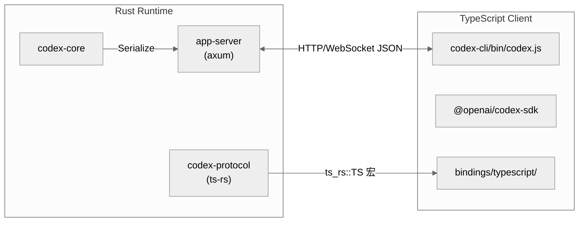

**协议版本不匹配的处理**：
- `codex-protocol/schema/json/` 中维护 JSON schema 版本
- TypeScript SDK 依赖特定 schema 版本，不兼容时编译期报错
- Rust 侧通过 `ts_rs::TS` 宏确保源码改动自动触发 schema 更新

**无 FFI 的安全收益**：
- app-server 崩溃不会内存破坏 TypeScript 进程
- WebSocket 连接天然支持断线重连和优雅降级
- TypeScript 侧无需处理 Rust 所有权语义

进程层级：

```
codex (CLI binary)
├─ spawns → app-server (HTTP/WebSocket)
│   ├─ spawns → exec-server (WebSocket daemon)
│   └─ spawns → mcp-server (if enabled)
└─ connects to → TUI (via WebSocket/in-process)
```

## 六层分层模型

Codex 的分层可以概括为：

```
CLI 包装层 → TUI 编排层 → App Server 会话层 → Core Agent 层 → Tool/Sandbox 执行层 → State 持久化层
```

| 层 | 对应目录 | 职责 |
| --- | --- | --- |
| CLI 包装层 | `codex-cli`, `codex-rs/cli` | 平台二进制分发、命令行参数解析、子命令分流 |
| TUI 编排层 | `codex-rs/tui` | 终端 UI 初始化、事件循环、会话切换、渲染 |
| 会话/RPC 层 | `codex-rs/app-server` | 统一 RPC（stdio/WebSocket）、线程/配置/事件接口 |
| Agent 核心层 | `codex-rs/core` | Prompt 构建、模型调用、工具路由、线程生命周期 |
| 执行与权限层 | `codex-rs/core/src/tools/*`, `codex-rs/sandboxing` | 工具 handler、审批、沙箱隔离 |
| 持久化层 | `codex-rs/state` | SQLite（WAL）、Rollout JSONL、日志 |

这种结构把"交互"和"执行"拆得彻底，所以同一套 core 可被 TUI、exec 模式和 app-server 复用。

## 核心抽象

### ThreadManager / CodexThread

`ThreadManager` 是线程生命周期总控（`codex/codex-rs/core/src/thread_manager.rs:239-264`）。它持有 `PluginsManager`、`McpManager`、`SkillsManager`、`ModelsManager`、`file_watcher` 与 `AuthManager`，把这些全挂进 `ThreadManagerState`。

关键方法：

| 方法 | 行号 | 作用 |
| --- | --- | --- |
| `new()` | 239-264 | 组装所有 Manager，创建状态 |
| `start_thread()` | 406 | 新建线程（统一入口）|
| `resume_thread_from_rollout()` | 455 | 从 rollout 恢复线程 |
| `fork_thread()` | 598 | 从已有线程分叉 |
| `spawn_thread()` | 内部 | start/resume/fork 都汇合到此 |

线程实例存储在 `Arc<RwLock<HashMap<ThreadId, Arc<CodexThread>>>>`，创建事件通过 `broadcast::channel`（容量 1024）广播。

### ModelClient / ModelClientSession

这一对抽象分离"会话级 API 状态"和"单轮流式请求状态"（`codex/codex-rs/core/src/client.rs:182-250`）：

- `ModelClient`：缓存认证、provider 配置、WebSocket 开关
- `ModelClientSession`：每轮新建，持有 WebSocket 连接缓存和 sticky routing token

### ToolRouter / ToolRegistry / ToolOrchestrator

三件套完成工具执行闭环（`codex/codex-rs/core/src/tools/`）：

- `ToolRegistry`：存储 handler，按名称分发
- `ToolRouter`：解析模型输出为 `ToolCall`，路由到 handler
- `ToolOrchestrator`：审批 → 沙箱选择 → 执行 → 沙箱拒绝升级重试

### MessageProcessor / CodexMessageProcessor

`app-server` 不直接耦合 TUI，而是通过 `MessageProcessor` 统一处理配置、线程、认证、文件、事件订阅等 RPC 请求（`codex/codex-rs/app-server/src/message_processor.rs`; `codex/codex-rs/app-server/src/codex_message_processor.rs`）。

## 技术选型一览

| 维度 | 选型 | 角色 |
| --- | --- | --- |
| 主语言 | Rust (Edition 2024) | 主运行时：CLI、TUI、app-server、core、state、sandbox |
| 包装层 | Node.js ≥22 | 跨平台二进制分发 |
| 异步运行时 | Tokio | 线程事件、模型流式响应、工具执行、RPC |
| TUI | `ratatui` + `crossterm` | 终端 UI、事件循环、绘制 |
| Web/API | `axum` + `reqwest` + WebSocket/SSE | app-server 协议、模型 API 连接 |
| 持久化 | SQLite + `sqlx` | 线程元数据、日志、回放 |
| MCP 协议 | `rmcp` | 外部工具、资源、Apps/Connector 集成 |
| 类型同步 | `ts-rs` | Rust struct → TypeScript 类型声明 |
| 构建 | Cargo + Bazel + Just | 本地开发、CI、测试、发布 |
| 包管理 | pnpm v10.29+ | JS/TS monorepo 管理 |

## 心智模型

> 把 Codex 看成"以线程协议为中心、可以被 CLI、app-server、SDK 和其他宿主复用的 Rust runtime"。

四个直接源码支点：

1. 宿主很多，但入口统一由 `Subcommand` 与 `cli_main()` 暴露和分流（`codex/codex-rs/cli/src/main.rs:88-152`; `codex/codex-rs/cli/src/main.rs:590-715`）。
2. 运行时能力集中在 `codex-core`，尤其是 `ThreadManager` 对 start/resume/fork 的统一装配。
3. app-server 把线程生命周期和内容模型公开成稳定协议：`Thread*Params`、`Thread`、`Turn`、`ThreadItem`。
4. JS/TS 层不复制实现，只桥接二进制和协议。

## 启动链路：入口点、CLI 参数解析、初始化顺序与 Subcommand 分发

# 启动链路：入口点、CLI 参数解析、初始化顺序与 Subcommand 分发

主向导对应章节：`启动链路`

## 双层入口

Codex 严格来说有两层入口：

1. **分发入口**：`codex-cli/bin/codex.js`
2. **真实业务入口**：`codex-rs/cli/src/main.rs::main`

如果从源码运行，唯一业务入口就是 Rust 的 `main()`。npm 层只是找到正确平台二进制再 `spawn`。

## JavaScript 启动器

`codex-cli/bin/codex.js`（行 1-230）完成三件事：

| 步骤 | 行号 | 动作 |
| --- | --- | --- |
| 平台检测 | 24-67 | 检测 `process.platform` / `process.arch`，映射到 target triple |
| 包解析 | 73-115 | 从 npm 平台包或本地 `vendor/` 定位 `codex` 可执行文件 |
| PATH 修改 | 126-166 | 前置平台特定路径、设置包管理器环境变量 |
| 子进程启动 | 175-178 | `spawn(binaryPath, process.argv.slice(2), { stdio: "inherit", env })` |
| 信号转发 | 189-206 | 转发 SIGINT/SIGTERM/SIGHUP 给子进程 |
| 退出码镜像 | 213-229 | 镜像子进程退出码/信号给父进程 |

核心设计：**Node 层是忠实的进程代理，不做业务决策**。

## arg0 多工具分发

Rust 入口 `main()` 的第一件事是调用 `arg0_dispatch_or_else()`（`codex/codex-rs/arg0/src/lib.rs:153-182`）：

```rust
fn main() -> anyhow::Result<()> {
    arg0_dispatch_or_else(|arg0_paths| async { cli_main(arg0_paths).await })
}
```

这个函数做了五件关键的事：

1. **检查特殊可执行模式**：根据 `argv[0]` 判断是否以 `codex-execve-wrapper`、`codex-linux-sandbox` 或 `apply_patch`/`applypatch` 身份运行（行 53-128），若是则直接执行对应逻辑，永不返回
2. **加载 `.env`**：从 `~/.codex/.env` 加载环境变量，但**只过滤 `CODEX_*` 前缀**以防安全泄漏
3. **创建 PATH 条目**：在 `~/.codex/tmp/arg0/` 创建临时目录，放置指向当前可执行文件的符号链接（`apply_patch`、`codex-linux-sandbox`、`codex-execve-wrapper`）
4. **构建 Tokio 运行时**：16MB 栈大小的多线程运行时
5. **返回 `Arg0DispatchPaths`**：包含 `codex_self_exe`、`codex_linux_sandbox_exe`、`main_execve_wrapper_exe`

**关键不变量**：argv[0] 分发在 Tokio 启动**之前**完成，因为 `set_var()` 不是线程安全的。

## CLI 参数解析

### MultitoolCli 结构体

`cli_main()` 首先解析 `MultitoolCli`（`codex/codex-rs/cli/src/main.rs:59-86`）：

```rust
struct MultitoolCli {
    config_overrides: CliConfigOverrides,    // -c key=value
    feature_toggles: FeatureToggles,         // --enable/--disable FEATURE
    remote: InteractiveRemoteOptions,        // --remote, --remote-auth-token-env
    interactive: TuiCli,                     // prompt, images 等
    subcommand: Option<Subcommand>,          // exec, review, login 等
}
```

### Config 覆盖优先级（从高到低）

1. 子命令级 `-c` 标志
2. 子命令 feature toggle
3. 根级 `-c` 标志
4. 根级 `--enable/--disable`
5. `config.toml` 文件
6. 默认值

合并实现在 `prepend_config_flags()`（行 1137-1144）。

### Subcommand 枚举

`Subcommand`（行 88-153）一次性摊开了所有运行形态：

| 分类 | 子命令 | 处理行号 | 用途 |
| --- | --- | --- | --- |
| **交互式** | （无） | 618 | 默认交互 TUI |
| | Resume | 751 | 恢复之前的会话 |
| | Fork | 777 | 从之前的会话分叉 |
| **非交互** | Exec | 642 | 代码生成 |
| | Review | 650 | 代码审查 |
| | Cloud | 854 | 云任务 |
| **认证** | Login | 788 | 用户登录 |
| | Logout | 834 | 移除凭证 |
| **MCP/服务** | Mcp | 674 | 管理 MCP 服务器 |
| | McpServer | 664 | 作为 MCP 服务器运行 |
| | AppServer | 692 | App Server 模式 |
| **工具** | Apply | 945 | 应用 git patch |
| | Completion | 842 | Shell 补全 |
| | Sandbox | 857 | 在沙箱中运行 |
| | Debug | 907 | 调试工具 |
| | Execpolicy | 932 | 策略检查 |
| | Features | 966 | 特性管理 |
| | App | 732 | 桌面 app（macOS）|
| **内部** | ResponsesApiProxy | 953 | 内部代理 |
| | StdioToUds | 963 | 内部中继 |

## 分发逻辑

### 无子命令 → 交互式 TUI（默认路径）

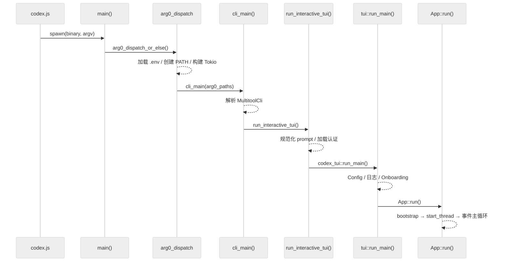

### TUI 初始化序列

`tui::run_main()`（`codex/codex-rs/tui/src/lib.rs:590-921`）的详细初始化步骤：

| 阶段 | 行号 | 动作 |
| --- | --- | --- |
| 预初始化 | 598-630 | 验证远程认证传输、确定沙箱/审批模式 |
| Config 加载 | 647-687 | `find_codex_home()` → `load_config_as_toml_with_cli_overrides()` |
| OSS 模式 | 707-741 | 解析 OSS provider → 解析模型 → 按需提示用户 |
| Config 覆盖 | 745-758 | model, approval_policy, sandbox_mode, cwd 等 |
| 系统检查 | 768-802 | Exec policy 验证、附加目录检查、登录限制 |
| 日志设置 | 804-904 | 创建日志目录 → 打开日志文件（Unix chmod 600）→ File/OTEL/LogDB 层 |
| OSS 就绪 | 849-862 | `ensure_oss_provider_ready()` |

### run_ratatui_app() 进一步初始化

`run_ratatui_app()`（行 924-1359）做终端级准备：

1. **终端设置**（938-955）：安装 panic hook → `tui::init()` → `TerminalRestoreGuard`
2. **Onboarding 流程**（957-1076）：更新检查 → 判断是否需要信任/登录 → `run_onboarding_app()`
3. **会话查找**（1094-1231）：Resume/Fork 需要按 ID/名称/`--last` 查找、CWD 解析
4. **主题与显示**（1291-1316）：语法主题、alt-screen 模式（尊重 `--no-alt-screen`，自动检测 Zellij）
5. **App Server 启动**（1317-1334）：确定目标（Remote 或 Embedded）→ `start_app_server()` → `AppServerSession`

### App::run() Bootstrap

`App::run()`（`codex/codex-rs/tui/src/app.rs:3483-3562`）：

1. 设置事件 channel
2. 发出初始警告
3. `app_server.bootstrap()` → default_model, available_models, auth_mode, plan_type
4. 处理模型迁移提示
5. 创建模型目录
6. 设置会话遥测
7. 进入事件主循环

## Exec 模式

`exec` 子命令（`codex/codex-rs/exec/src/lib.rs:177-326`）的初始化与 TUI 类似但更简洁：

1. 设置 originator
2. 解析 CLI
3. 设置日志
4. 解析沙箱模式
5. 解析 config 覆盖
6. 查找 codex_home
7. 加载 config TOML
8. 解析 OSS provider → 确定模型
9. **启动内嵌 app-server**
10. 处理命令 → 输出结果

关键区别：Exec 拒绝远程模式、非交互执行、结果以 JSON 事件流输出。

## App Server 模式

`app-server` 子命令（`codex/codex-rs/app-server/src/lib.rs:351-432`）：

1. 设置消息 channel
2. 解析 CLI 覆盖
3. 预加载 config（检查 cloud 需求）
4. 构建完整 config
5. 设置日志（JSON 或默认）
6. 启动传输（**stdio 或 WebSocket**）
7. JSON-RPC 消息循环

传输选择：`AppServerTransport::Stdio` 或 `AppServerTransport::WebSocket(addr)`。

## 关键初始化不变量

| 不变量 | 原因 |
| --- | --- |
| argv[0] 分发在 Tokio **之前** | `set_var()` 不是线程安全的 |
| PATH 在线程启动**之前**更新 | 所有子进程都能看到符号链接 |
| .env 在 Tokio **之前**加载 | Config 依赖环境变量覆盖 |
| 终端检查在 TUI 早期 | 检测 "dumb" 终端后再进 alt-screen |
| Config 在 env 加载**之后**构建 | Config 依赖 env override |
| Onboarding 在事件循环**之前** | 认证状态在启动前锁定 |
| App server 在 config 加载**之后** | 使用最终 config |
| Restore guard 尽早创建 | 保证 panic/exit 时清理终端 |

## 核心执行循环：Agent 决策链、Prompt 构建、LLM 调用与流式响应处理

# 核心执行循环：Agent 决策链、Prompt 构建、LLM 调用与流式响应处理

主向导对应章节：`核心执行循环`

## 三层嵌套循环总览

Codex 的 Agent 执行由四层嵌套函数驱动：

| 层级 | 函数 | 文件:行号 | 职责 |
| --- | --- | --- | --- |
| 会话层 | `submission_loop()` | `codex.rs:4417` | 接收并分发所有 Op（UserInput、Interrupt、Shutdown 等）|
| 回合层 | `run_turn()` | `codex.rs:5714` | 单轮执行控制，含循环重试 |
| 采样层 | `run_sampling_request()` | `codex.rs:6493` | LLM 编排与重试 |
| 流式层 | `try_run_sampling_request()` | `codex.rs:7306` | 流式响应消费与工具调度 |

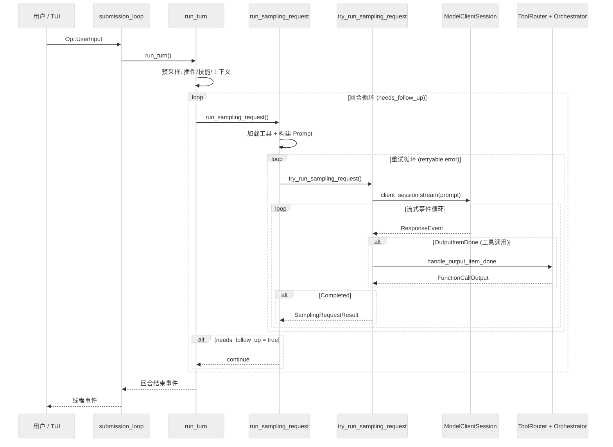

## 第一层：submission_loop（会话事件分发器）

**位置**：`codex/codex-rs/core/src/codex.rs:4417`

submission_loop 是每个会话的单线程事件消费者。它通过 bounded channel（容量 512）接收 `Submission`：

```rust
pub struct Submission {
    pub id: String,                      // 唯一提交 ID
    pub op: Op,                          // 操作枚举（20+ 种）
    pub trace: Option<W3cTraceContext>,  // OpenTelemetry 追踪
}
```

主循环 `while let Ok(sub) = rx_sub.recv().await` 逐一处理操作，不做批处理。操作类型包括 `UserInput`、`Interrupt`、`ExecApproval`、`DynamicToolResponse`、`Shutdown` 等 20+ 种。

## 第二层：run_turn（回合执行控制器）

**位置**：`codex/codex-rs/core/src/codex.rs:5714`

### 预采样准备（行 5714-5920）

1. **上下文压缩检查**：如果 token 接近上下文窗口，触发 compaction
2. **加载插件**：解析 mention、构建 skill/plugin injection
3. **运行 session start hooks**
4. **记录用户 prompt**

### 回合循环（行 5936-6013）

```rust
loop {
    let sampling_request_input = sess.clone_history().await.for_prompt(...);
    match run_sampling_request(...).await {
        Ok(result) => {
            if result.needs_follow_up { continue; } else { break; }
        }
        Err(...) => break,
    }
}
```

**`needs_follow_up` 为 true 的条件**：
1. 有工具调用需要后续处理
2. 存在待处理的用户输入（pending_input）

返回值：`Option<String>` — 最后一条 agent 消息文本。

## 第三层：run_sampling_request（LLM 编排与重试）

**位置**：`codex/codex-rs/core/src/codex.rs:6493`

### 核心序列

1. **加载工具**：`built_tools()`（行 6505）
2. **获取基础指令**：`get_user_instructions()`（行 6515）— 读取层级 `AGENTS.md`，受字节预算限制
3. **构建 Prompt**：`build_prompt()`（行 6517）

### Prompt 构建（行 6453）

```rust
pub(crate) fn build_prompt(
    input: Vec<ResponseItem>,          // 对话历史
    router: &ToolRouter,               // 工具
    turn_context: &TurnContext,        // 设置
    base_instructions: BaseInstructions,
) -> Prompt {
    let tools = router.model_visible_specs()
        .filter(|spec| !deferred_dynamic_tools.contains(spec.name()))
        .collect();
    Prompt {
        input, tools,
        parallel_tool_calls: turn_context.model_info.supports_parallel_tool_calls,
        base_instructions,
        personality: turn_context.personality,
        output_schema: turn_context.final_output_json_schema.clone(),
    }
}
```

**关键细节**：延迟加载的 dynamic tools 不会塞进模型可见工具列表，先控制 prompt 体积，再按需启用。

### 重试循环（行 6539-6626）

重试策略：

1. 调用 `try_run_sampling_request()`
2. 若出错，检查 `is_retryable()`
3. 若可重试且 retries < max_retries：指数退避 `200ms * 2^retries`（±10% 抖动），如有 server-provided delay 则使用之
4. 若可重试且 retries >= max_retries：尝试 WebSocket 到 HTTPS 回退（会话级一次性），重置重试计数器
5. 若不可重试：返回错误

## 第四层：try_run_sampling_request（流式响应循环）

**位置**：`codex/codex-rs/core/src/codex.rs:7306`

### 流式事件处理（行 7348-7650）

```rust
loop {
    let event = stream.next().await?;
    match event {
        ResponseEvent::Created => { /* 响应已创建 */ },

        ResponseEvent::OutputItemAdded(item) => {
            sess.emit_turn_item_started(...).await;
        },

        ResponseEvent::OutputTextDelta(delta) => {
            emit_streamed_assistant_text_delta(...).await;
        },

        ResponseEvent::OutputItemDone(item) => {
            // 工具调用在这里触发
            let output_result = handle_output_item_done(...).await?;
            if let Some(tool_future) = output_result.tool_future {
                in_flight.push_back(tool_future);
            }
            needs_follow_up |= output_result.needs_follow_up;
        },

        ResponseEvent::ReasoningSummaryDelta { delta, .. } => {
            // 推理内容流式输出
        },

        ResponseEvent::RateLimits(snapshot) => {
            // 速率限制更新
        },

        ResponseEvent::Completed { response_id, token_usage } => {
            sess.update_token_usage_info(...).await;
            needs_follow_up |= sess.has_pending_input().await;
            break Ok(SamplingRequestResult {
                needs_follow_up,
                last_agent_message,
            });
        },
    }
}
```

### 关键状态追踪

| 变量 | 类型 | 用途 |
| --- | --- | --- |
| `in_flight` | `FuturesOrdered<...>` | 并发工具调用队列（有序） |
| `active_item` | `Option<TurnItem>` | 当前正在流式传输的消息 |
| `needs_follow_up` | `bool` | 控制回合循环是否继续 |

## 传输层：WebSocket vs HTTPS

### 传输选择（`client.rs:1294`）

```rust
pub async fn stream(...) -> Result<ResponseStream> {
    if self.client.responses_websocket_enabled() {
        match self.stream_responses_websocket(...).await? {
            WebsocketStreamOutcome::Stream(s) => return Ok(s),
            WebsocketStreamOutcome::FallbackToHttp => {
                self.try_switch_fallback_transport(...);
            }
        }
    }
    self.stream_responses_api(...).await  // HTTPS 回退
}
```

### WebSocket 路径（`client.rs:1100`）

- **延迟连接**：首次请求时打开，turn 内缓存复用
- **跨重试复用**：同一 turn 内的重试共享 WebSocket 连接
- **增量请求**：通过 `previous_response_id` 支持增量
- **Sticky routing**：`x-codex-turn-state` header 保证路由一致性
- **超时**：provider-specific（默认 10s）

### HTTPS 路径（`client.rs:1003`）

- 标准 HTTP POST + SSE 流式
- 认证恢复循环（401 时刷新 token）
- 压缩：ChatGPT 认证使用 Zstd

### 关键不变量

- **每轮新建 `ModelClientSession`**：确保 sticky routing token 不跨轮复用
- **WebSocket 会话 turn 内缓存、turn 边界丢弃**
- **WebSocket 到 HTTPS 回退是会话级一次性操作**（`AtomicBool` 保证单次激活）

## 上下文管理

### ContextManager（`context_manager/history.rs:34`）

```rust
pub(crate) struct ContextManager {
    items: Vec<ResponseItem>,           // 最旧到最新
    token_info: Option<TokenUsageInfo>,
    reference_context_item: Option<TurnContextItem>,
}
```

关键方法：

| 方法 | 用途 |
| --- | --- |
| `record_items()` | 追加并过滤 items |
| `for_prompt()` | 归一化并返回 prompt 所需的历史（行 117）|
| `estimate_token_count()` | 基于字节的 token 估算 |

### 历史流转

1. `sess.clone_history().await` 得到 ContextManager
2. `history.for_prompt(&input_modalities)` 得到 `Vec<ResponseItem>`
3. `build_prompt(history, tools, ...)` 得到 Prompt
4. 流式响应
5. 工具输出记录，进入下一轮历史

## 核心数据结构

### TurnContext（`codex.rs:843`）

每轮不可变设置，约 40 个字段：

- `sub_id`, `model_info`, `reasoning_effort`, `collaboration_mode`
- `approval_policy`, `sandbox_policy`, `network_sandbox_policy`
- `tools_config`, `features`, `turn_metadata_state`
- `personality`, `final_output_json_schema`

### ActiveTurn（`state/turn.rs:27`）

```rust
pub(crate) struct ActiveTurn {
    pub(crate) tasks: IndexMap<String, RunningTask>,
    pub(crate) turn_state: Arc<Mutex<TurnState>>,
}
```

TurnState 包含：
- `pending_approvals` — 待审批的工具调用
- `pending_request_permissions` — 待请求的权限
- `pending_user_input` — 待用户输入
- `pending_dynamic_tools` — 待动态工具响应
- `pending_input: Vec<ResponseInputItem>` — 待处理输入
- `mailbox_delivery_phase` — 控制邮箱消息加入当前轮还是下一轮
- `tool_calls: u64` — 本轮工具调用计数
- `token_usage_at_turn_start` — 轮开始时的 token 用量

### SamplingRequestResult（`codex.rs:6756`）

```rust
struct SamplingRequestResult {
    needs_follow_up: bool,
    last_agent_message: Option<String>,
}
```

### Prompt Cache

- Prompt cache key 设为对话 ID，跨轮复用缓存
- 启用 OpenAI prompt caching 特性

## 并发模型

| 维度 | 策略 |
| --- | --- |
| Agent 循环 | **单线程**：每个 session 的所有操作在单个 Tokio task 上顺序执行 |
| 工具调用 | **轮内并发**：`FuturesOrdered` 隐式等待结果，保持有序并发 |
| 多会话 | **无同步**：每个 session 独立 Tokio task |

## 工具调用机制：工具注册、权限控制、执行闭环与结果回传

# 工具调用机制：工具注册、权限控制、执行闭环与结果回传

主向导对应章节：`工具调用机制`

## 工具系统目录结构

```
codex-rs/core/src/tools/
├── mod.rs                 # 模块导出 & 输出格式化
├── spec.rs                # 工具注册 & handler 实例化
├── registry.rs            # Handler 存储 & 分发（652 行）
├── router.rs              # ToolCall 构建 & 路由（254 行）
├── context.rs             # 调用载荷 & 上下文类型（17 KB）
├── orchestrator.rs        # 审批 + 沙箱 + 重试流程（16 KB）
├── sandboxing.rs          # 审批/沙箱 trait（13 KB）
├── network_approval.rs    # 网络访问审批（22 KB）
├── parallel.rs            # 并行执行协调
├── events.rs              # 工具事件发射
├── handlers/              # 30+ handler 实现
│   ├── shell.rs           # Shell 执行
│   ├── mcp.rs             # MCP 工具分发
│   ├── apply_patch.rs     # 文件 patch
│   ├── unified_exec.rs    # 高级执行
│   ├── dynamic.rs         # 动态工具
│   ├── js_repl.rs         # JavaScript REPL
│   ├── multi_agents_v2.rs # 多代理管理
│   └── [20+ 其他]
└── runtimes/              # 运行时实现
    ├── shell.rs           # Shell 运行时（审批/沙箱）
    ├── apply_patch.rs     # Patch 运行时
    └── unified_exec.rs    # 统一执行运行时
```

## 工具注册机制

### 入口：build_specs_with_discoverable_tools()

**位置**：`codex/codex-rs/core/src/tools/spec.rs:32-236`

注册过程：

1. **调用 `build_tool_registry_plan()`**（codex_tools crate）：生成工具规范，按 `ToolHandlerKind` 分类
2. **创建 Handler 实例**（Arc 包装）：Shell、UnifiedExec、ApplyPatch、Mcp、McpResource、JsRepl、CodeModeExecute/Wait、ListDir、ViewImage、Plan、RequestPermissions、RequestUserInput、ToolSearch、ToolSuggest、DynamicTool、TestSync、MultiAgent V1/V2、AgentJob
3. **注册 Handler**：

```rust
for handler in plan.handlers {
    match handler.kind {
        ToolHandlerKind::Shell => builder.register_handler(name, handler),
        ToolHandlerKind::Mcp => builder.register_handler(name, handler),
        // ... 30+ 变体 ...
    }
}
```

4. **返回** `ToolRegistryBuilder`，包含累积的 specs 和 handlers

### 工具来源

| 来源 | 注册方式 | 示例 |
| --- | --- | --- |
| 内建工具 | `build_tool_registry_plan()` 静态注册 | shell, apply_patch, list_dir |
| MCP 工具 | `McpConnectionManager` 动态发现 | `mcp__server__tool` |
| 动态工具 | 运行时注册 | DynamicToolSpec |
| App/Connector | 经 MCP 层代理 | ChatGPT Apps |

## 工具调用生命周期（4 阶段）

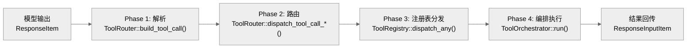

### Phase 1：解析模型输出为 ToolCall

**函数**：`ToolRouter::build_tool_call()`（`router.rs:116-211`）

- **输入**：模型返回的 `ResponseItem`
- **输出**：`ToolCall { tool_name, tool_namespace, call_id, payload }`
- **Payload 类型**（5 种）：

```rust
enum ToolPayload {
    Function { arguments: String },           // JSON 参数
    ToolSearch { arguments: SearchToolCallParams },
    Custom { input: String },                 // 任意格式
    LocalShell { params: ShellToolCallParams },
    Mcp { server: String, tool: String, raw_arguments: String },
}
```

### Phase 2：构建 ToolInvocation 并路由

**函数**：`ToolRouter::dispatch_tool_call_with_code_mode_result()`（`router.rs:214-250`）

- 创建 `ToolInvocation`（包含 session、turn、tracker、payload）
- 检查 `js_repl_tools_only` 限制
- 调用 `self.registry.dispatch_any(invocation)`

### Phase 3：注册表分发

**函数**：`ToolRegistry::dispatch_any()`（`registry.rs:213-437`）

执行步骤：

1. **Handler 查找**（找不到则报错）
2. **Kind 验证**（payload 类型检查）
3. **Pre-tool-use hooks**（可阻断执行）
4. **Mutating 检查**（变异工具门控）
5. **Handler 执行**（含遥测）
6. **Post-tool-use hooks**（可修改输出）
7. **AfterToolUse hooks**（兼容旧版）

### Phase 4：编排执行（ToolOrchestrator）

**函数**：`ToolOrchestrator::run()`（`orchestrator.rs:101-370+`）

三阶段流程：

#### 阶段 A：审批检查（行 119-172）

```rust
let requirement = tool.exec_approval_requirement(req)
    .unwrap_or_else(|| default_exec_approval_requirement(...));

match requirement {
    ExecApprovalRequirement::Skip { bypass_sandbox, .. } => {
        // 无需审批
    },
    ExecApprovalRequirement::Forbidden { reason } => {
        return Err(ToolError::Rejected(reason));
    },
    ExecApprovalRequirement::NeedsApproval { reason, .. } => {
        let decision = tool.start_approval_async(req, ctx).await;
        // 处理 Approved / Denied / Abort / ApprovedForSession
    },
}
```

#### 阶段 B：首次沙箱尝试（行 174-225）

```rust
let initial_sandbox = self.sandbox.select_initial(
    &turn_ctx.file_system_sandbox_policy,
    turn_ctx.network_sandbox_policy,
    tool.sandbox_preference(),
    turn_ctx.windows_sandbox_level,
    has_managed_network_requirements,
);
let (first_result, deferred_network) = Self::run_attempt(...).await;
```

#### 阶段 C：沙箱拒绝升级（行 227-370）

```rust
if first_result.is_sandbox_denied() && tool.escalate_on_failure() {
    // 重新请求审批（无沙箱执行）
    let decision = tool.start_approval_async(req, escalation_ctx).await;
    // 若获批，以 SandboxType::None 重试
    Self::run_attempt(tool, req, tool_ctx, &escalated_attempt, ...).await
}
```

## 权限与审批模型

### 审批策略枚举

```rust
enum AskForApproval {
    Never,                          // 从不询问
    OnFailure,                      // 沙箱拒绝时询问
    OnRequest,                      // 受限文件系统时询问
    Granular(GranularApprovalConfig),  // 细粒度控制
    UnlessTrusted,                  // 总是询问
}
```

### 审批缓存（`sandboxing.rs:70-116`）

```rust
pub async fn with_cached_approval<K, F, Fut>(
    services: &SessionServices,
    tool_name: &str,
    keys: Vec<K>,
    fetch: F,
) -> ReviewDecision
```

- 检查所有 key 是否已在本会话中获批
- 若全部已批准，跳过重复提示
- 缓存粒度：per-key（序列化为 JSON 的类型擦除 HashMap）

### 审批决定类型

| 类型 | 含义 |
| --- | --- |
| `Approved` | 单次批准 |
| `ApprovedForSession` | 会话内批准（缓存） |
| `ApprovedExecpolicyAmendment` | 策略修正批准 |
| `Denied` | 拒绝 |
| `Abort` | 中止 |
| `NetworkPolicyAmendment` | 网络策略修正 |

### 默认审批判定（`sandboxing.rs:171-207`）

```rust
pub fn default_exec_approval_requirement(
    policy: AskForApproval,
    file_system_sandbox_policy: &FileSystemSandboxPolicy,
) -> ExecApprovalRequirement {
    let needs_approval = match policy {
        Never | OnFailure => false,
        OnRequest | Granular(_) => matches!(fs_policy.kind, Restricted),
        UnlessTrusted => true,
    };
    // ...
}
```

## 沙箱类型

| 沙箱类型 | 平台 | 实现 |
| --- | --- | --- |
| `None` | 全平台 | 无隔离 |
| `MacosSeatbelt` | macOS | `/usr/bin/sandbox-exec` + SBPL 策略文件 |
| `LinuxSeccomp` | Linux | bubblewrap + seccomp + landlock |
| `WindowsRestrictedToken` | Windows | Job objects + restricted tokens |

沙箱选择逻辑（`manager.rs:138-165`）基于三个输入：

1. `file_system_sandbox_policy`：ReadOnly / WorkspaceWrite / FullAccess
2. `network_sandbox_policy`：Enabled / Restricted / Disabled
3. `tool.sandbox_preference()`：Auto / Prefer / Require / Forbid

## 网络审批系统

**位置**：`network_approval.rs`（22 KB）

```rust
enum NetworkApprovalMode { Immediate, Deferred }

struct NetworkApprovalSpec {
    pub network: Option<NetworkProxy>,
    pub mode: NetworkApprovalMode,
}
```

网络审批缓存按 `(host, protocol, port)` 三元组存储：

```rust
struct HostApprovalKey {
    host: String,
    protocol: &'static str,  // "http", "https", "socks5-tcp", "socks5-udp"
    port: u16,
}
```

## 内建工具类型（30+）

| 分类 | 工具 | 说明 |
| --- | --- | --- |
| 执行 | Shell, UnifiedExec, ApplyPatch | 命令执行、高级执行、补丁应用 |
| 文件 | ListDir, ViewImage | 目录列出、图像查看（只读） |
| 代码 | JsRepl, CodeModeExecute/Wait | JavaScript REPL、代码模式 |
| 搜索 | ToolSearch, ToolSuggest | 工具搜索、工具建议 |
| 权限 | RequestPermissions, RequestUserInput | 请求权限、请求用户输入 |
| MCP | McpHandler, McpResourceHandler | MCP 工具分发、MCP 资源访问 |
| 多代理 | V1 (Spawn/Close/Send/Wait), V2 (改进版) | 多代理协作 |
| 其他 | Plan, DynamicTool, TestSync, AgentJobs | 规划、动态工具、测试同步、批量任务 |

## 工具输出与结果回传

### ToolOutput trait（`context.rs:80-94`）

```rust
pub trait ToolOutput: Send {
    fn log_preview(&self) -> String;
    fn success_for_logging(&self) -> bool;
    fn to_response_item(&self, call_id: &str, payload: &ToolPayload) -> ResponseInputItem;
    fn post_tool_use_response(&self, call_id: &str, payload: &ToolPayload) -> Option<JsonValue>;
    fn code_mode_result(&self, payload: &ToolPayload) -> JsonValue;
}
```

### 输出格式化

**结构化格式**（`mod.rs:30-67`）：

```json
{
  "output": "<text>",
  "metadata": {
    "exit_code": 0,
    "duration_seconds": 1.23
  }
}
```

**自由格式**（`mod.rs:69-94`）：

```
Exit code: 0
Wall time: 1.23 seconds
Total output lines: 42
Output:
<text>
```

### 截断策略

- `Lines(usize)` — 按行数截断
- `Tokens(usize)` — 按 token 数截断
- `Bytes(usize)` — 按字节数截断

### 遥测限制

- `TELEMETRY_PREVIEW_MAX_BYTES`: 2 KiB
- `TELEMETRY_PREVIEW_MAX_LINES`: 64

## 并行工具执行

**位置**：`parallel.rs`

```rust
pub struct ToolCallRuntime {
    router: Arc<ToolRouter>,
    session: Arc<Session>,
    turn_context: Arc<TurnContext>,
    tracker: SharedTurnDiffTracker,
    parallel_execution: Arc<RwLock<()>>,  // 同步点
}
```

锁策略：

```rust
let _guard = if supports_parallel {
    Either::Left(lock.read().await)    // 多读者并行
} else {
    Either::Right(lock.write().await)  // 独占锁串行
};
```

取消：`CancellationToken` + `tokio::select!`

## Hooks 集成

| Hook 类型 | 触发时机 | 能力 |
| --- | --- | --- |
| Pre-tool-use | Handler 执行前 | 可阻断执行，接收命令字符串 |
| Post-tool-use | 成功执行后 | 可修改输出或停止，接收 tool_response JSON |
| AfterToolUse | 旧版兼容 | 可中止操作 |

## 完整调用链总结

```
模型输出 (ResponseItem)
         |
ToolRouter::build_tool_call()  ->  ToolCall
         |
ToolRouter::dispatch_tool_call_with_code_mode_result()  ->  ToolInvocation
         |
ToolRegistry::dispatch_any()
  |-- Lookup handler
  |-- Validate kind
  |-- Pre-hooks (can block)
  |-- is_mutating() check
  |-- Handler::handle() execution
  |-- Post-hooks (can modify)
  +-- AfterToolUse hooks
         |
ToolOrchestrator::run()
  |-- Phase A: Approval check
  |-- Phase B: First sandbox attempt
  +-- Phase C: Escalate on denial
         |
SandboxAttempt  ->  Execution (Shell, MCP, etc.)
         |
ToolOutput implementations
         |
Format for Model (Structured / Freeform)
         |
ResponseInputItem (回传给模型)
```

## 状态管理：Thread/Turn/ThreadItem 模型、持久化与并发控制

# 状态管理：Thread/Turn/ThreadItem 模型、持久化与并发控制

主向导对应章节：`状态管理`

## 三层状态模型

Codex 的状态模型分为三层：Thread（线程）、Turn（回合）、ThreadItem（回合内容项）。这不是"当前 prompt"为中心的设计，而是"线程协议"为中心的设计。

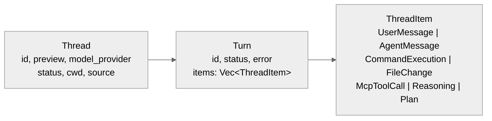

### Thread（`v2.rs:3575-3612`）

Thread 保存线程级元信息：

| 字段 | 类型 | 含义 |
| --- | --- | --- |
| `id` | String | 线程唯一 ID |
| `preview` | bool | 是否为预览线程 |
| `ephemeral` | bool | 是否为临时线程 |
| `model_provider` | String | 模型提供商 |
| `created_at` / `updated_at` | Unix 秒 | 创建/更新时间 |
| `cwd` | PathBuf | 工作目录 |
| `cli_version` | String | CLI 版本 |
| `source` | String | 来源（CLI/app-server/SDK）|
| `git_info` | Option | Git 信息（SHA、分支、URL）|
| `agent_nickname` / `agent_role` | Option | 代理昵称/角色 |
| `name` | Option | 线程名称 |
| `turns` | Vec&lt;Turn&gt; | 回合列表（仅 resume/fork/read 时填充）|

### Turn（`v2.rs:3683-3692`）

Turn 描述一次回合的状态与错误边界：

| 字段 | 类型 | 含义 |
| --- | --- | --- |
| `id` | String | 回合 ID |
| `items` | Vec&lt;ThreadItem&gt; | 回合内容（仅 resume/fork 时填充）|
| `status` | TurnStatus | 回合状态 |
| `error` | Option | 错误信息 |

### ThreadItem（`v2.rs:4232+`）

ThreadItem 是回合内部的内容实体化，有 8+ 主要变体：

| 变体 | 含义 |
| --- | --- |
| `UserMessage` | 用户消息 |
| `HookPrompt` | Hook 注入的 prompt |
| `AgentMessage` | Agent 回复文本 |
| `Plan` | 任务规划 |
| `Reasoning` | 推理内容 |
| `CommandExecution` | 命令执行记录（shell 命令 + 输出 + 退出码）|
| `FileChange` | 文件变更记录 |
| `McpToolCall` | MCP 工具调用记录 |
| `DynamicToolCall` | 动态工具调用 |
| `CollabAgentToolCall` | 协作代理调用 |

## 线程生命周期参数

### ThreadStartParams（`v2.rs:2546-2600`）

创建线程的完整参数集：

- `model`, `provider`, `service_tier`, `cwd`
- `approval_policy`, `sandbox`
- `base_instructions`, `developer_instructions`
- `personality`, `dynamic_tools`
- `persist_extended_history`（实验性：保存丰富事件用于重建）

### ThreadResumeParams（`v2.rs:2650-2703`）

恢复线程的参数，有三种来源（优先级递降）：

1. `history`（不稳定）— 直接传入历史
2. `path`（不稳定）— 从文件路径加载
3. `thread_id` — 从数据库查找

### ThreadForkParams（`v2.rs:2734-2780`）

分叉线程的参数：

- `thread_id` — 源线程 ID
- `path`（不稳定）— rollout 文件路径
- `ephemeral` — 是否临时
- `persist_extended_history`

### 响应结构

`ThreadStartResponse`、`ThreadResumeResponse`、`ThreadForkResponse` 都返回线程快照（`v2.rs:2528-2703`）：

- `thread`, `model`, `model_provider`
- `cwd`, `approval_policy`, `sandbox`
- `reasoning_effort`

## 内存状态管理

### ThreadManagerState（`thread_manager.rs:199-212`）

```rust
threads: Arc<RwLock<HashMap<ThreadId, Arc<CodexThread>>>>
thread_created_tx: broadcast::Sender<ThreadId>  // 容量 1024
```

- **多读者**：`threads.read().await` 并发读取
- **单写者**：`threads.write().await` 独占写入
- **Arc&lt;CodexThread&gt;** 可跨 task 共享

### SessionState（`state/session.rs:19-36`）

```rust
pub(crate) struct SessionState {
    history: ContextManager,
    latest_rate_limits: Option<RateLimitSnapshot>,
    dependency_env: HashMap<String, String>,
    mcp_dependency_prompted: HashSet<String>,
    previous_turn_settings: Option<TurnSettings>,
    startup_prewarm: Option<StartupPrewarm>,
    granted_permissions: GrantedPermissions,
}
```

### ActiveTurn（`state/turn.rs:26-78`）

```rust
pub(crate) struct ActiveTurn {
    pub(crate) tasks: IndexMap<String, RunningTask>,
    pub(crate) turn_state: Arc<Mutex<TurnState>>,
}
```

TurnState 含：
- `pending_approvals: HashMap<String, oneshot::Sender<ReviewDecision>>`
- `pending_request_permissions: HashMap<...>`
- `pending_user_input: HashMap<...>`
- `pending_dynamic_tools: HashMap<...>`
- `pending_input: Vec<ResponseInputItem>`
- `mailbox_delivery_phase: MailboxDeliveryPhase`
- `tool_calls: u64`
- `token_usage_at_turn_start: TokenUsage`

**MailboxDeliveryPhase 状态机**：控制待处理的子消息加入当前请求还是排队到下一轮。

## 持久化：双 SQLite 数据库

### 双数据库设计（`state/runtime.rs:70-76`）

| 数据库 | 文件名 | 用途 |
| --- | --- | --- |
| State DB | `state_5.sqlite` | 线程元数据、状态 |
| Logs DB | `logs_2.sqlite` | 日志记录 |

**分库原因**：降低日志写入和状态读写之间的锁竞争。

### SQLite 配置

```sql
PRAGMA journal_mode = WAL;        -- Write-Ahead Logging
PRAGMA synchronous = NORMAL;      -- 安全/速度平衡
PRAGMA busy_timeout = 5000;       -- 5 秒锁重试
PRAGMA auto_vacuum = INCREMENTAL; -- 增量回收
-- max_connections: 5 (每个数据库)
```

### State DB Schema（`migrations/0001_threads.sql`）

threads 表：

| 列 | 类型 | 说明 |
| --- | --- | --- |
| `id` | TEXT PK | 线程 ID |
| `rollout_path` | TEXT | Rollout 文件路径 |
| `created_at` / `updated_at` | INTEGER | Unix 时间戳 |
| `source` | TEXT | 来源 |
| `model_provider` | TEXT | 模型提供商 |
| `cwd` | TEXT | 工作目录 |
| `title` | TEXT | 标题 |
| `sandbox_policy` / `approval_mode` | TEXT | 策略 |
| `tokens_used` | INTEGER | Token 使用量 |
| `archived` | BOOLEAN | 是否归档 |
| `git_sha` / `git_branch` / `git_url` | TEXT | Git 信息 |

索引：`created_at DESC`、`updated_at DESC`、`archived`、`source`、`provider`。

### Logs DB Schema（`migrations/0001_logs.sql`）

logs 表：

| 列 | 类型 | 说明 |
| --- | --- | --- |
| `id` | AI PK | 自增 ID |
| `ts` / `ts_nanos` | INTEGER | 时间戳 |
| `level` | TEXT | 日志级别 |
| `target` / `message` | TEXT | 目标/消息 |
| `module_path` / `file` / `line` | TEXT | 源码位置 |

日志分区：每 10 MiB 一个分区（按 thread_id 桶分）。

### LogDbLayer（`state/log_db.rs:48-80`）

- `mpsc::Sender<LogDbCommand>` channel（容量 512）
- `process_uuid: String`（每进程唯一）
- 后台任务批量插入（batch size 128，flush 间隔 2s）
- 集成 `tokio::tracing`

## Rollout 记录与回放

### RolloutItem 提取（`extract.rs:15-41`）

```rust
pub fn apply_rollout_item(
    metadata: &mut ThreadMetadata,
    item: &RolloutItem,
    default_provider: &str,
)
```

提取规则：

| RolloutItem 类型 | 提取字段 |
| --- | --- |
| `SessionMeta` | id, source, agent 元数据, model_provider, cwd, git |
| `TurnContext` | model, reasoning_effort, sandbox/approval 策略 |
| `EventMsg::TokenCount` | tokens_used |
| `EventMsg::UserMessage` | first_user_message, title |
| `ResponseItem` / `Compacted` | 无操作 |

### 线程生命周期流转

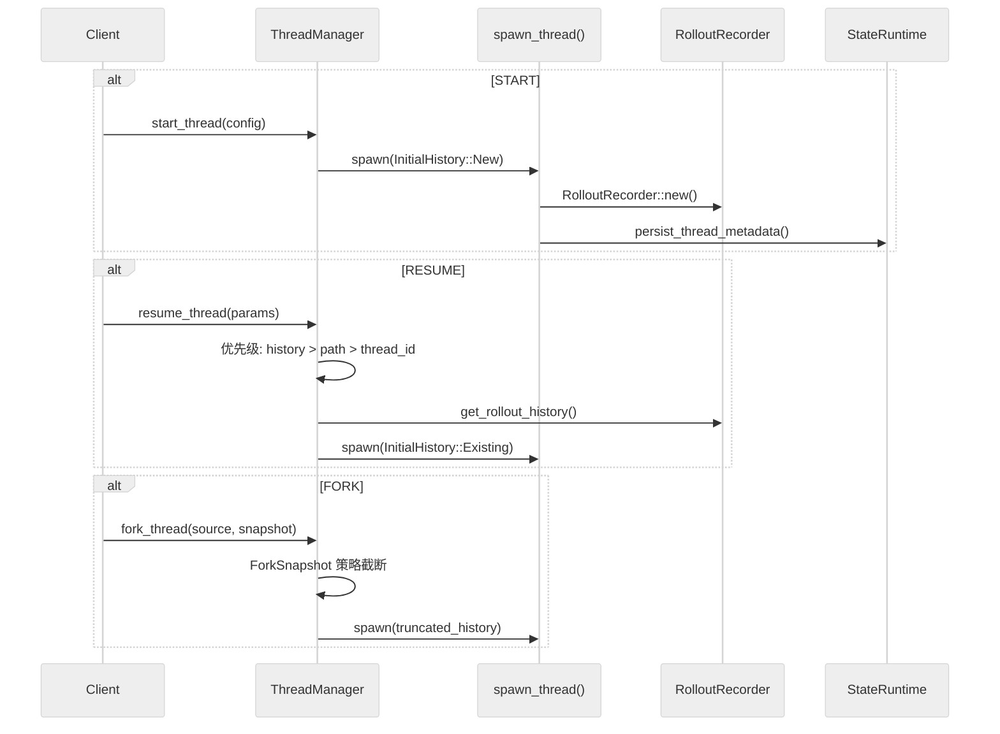

### ForkSnapshot 策略（`thread_manager.rs:147-166`）

| 策略 | 行为 |
| --- | --- |
| `TruncateBeforeNthUserMessage(n)` | 在第 n 条用户消息前截断 |
| `Interrupted` | 视为当前被中断（追加 turn_aborted）|

### ThreadMetadata 模型（`model/thread_metadata.rs:57-102`）

```rust
pub struct ThreadMetadata {
    id, rollout_path, created_at, updated_at,
    source, agent_nickname, agent_role, agent_path,
    model_provider, model, reasoning_effort,
    cwd, cli_version, title,
    sandbox_policy, approval_mode,
    tokens_used, first_user_message, archived_at,
    git_sha, git_branch, git_origin_url,
}
```

使用 Builder 模式构建（`ThreadMetadataBuilder`），带合理默认值。

## 并发控制模式总结

| 模式 | 使用场景 | 实现 |
| --- | --- | --- |
| `Arc<RwLock<HashMap>>` | 线程存储 | 多读/单写 |
| `broadcast::channel` | 线程创建事件 | 有损广播（容量 1024）|
| `oneshot::channel` | 回合审批/响应 | 一次性同步 |
| `watch::channel` | Shell 快照更新 | 响应式模式 |
| `mpsc::channel` | 日志写入 | 批量异步（容量 512）|
| `Arc<Mutex<TurnState>>` | 回合状态 | 异步安全互斥 |

## 关键函数签名

| 函数 | 文件 | 行号 |
| --- | --- | --- |
| `ThreadManager::start_thread()` | `thread_manager.rs` | 406 |
| `ThreadManager::resume_thread_from_rollout()` | `thread_manager.rs` | 455 |
| `ThreadManager::fork_thread()` | `thread_manager.rs` | 598 |
| `StateRuntime::init()` | `state/runtime.rs` | 84 |
| `apply_rollout_item()` | `extract.rs` | 15 |
| `ThreadMetadataBuilder::build()` | `model/thread_metadata.rs` | 173 |

## 实验性特性

- `persist_extended_history: bool` — 保存丰富 EventMsg 变体用于精确重建
- `experimental_raw_events: bool` — 原始 Responses API items（仅内部）
- `history/path overrides` — 不稳定，供 Codex Cloud 使用

## 分发、SDK 与 shell 层：`codex.js`、TypeScript SDK、`shell-tool-mcp` 怎样把 Rust runtime 包出去

# 分发、SDK 与 shell 层：`codex.js`、TypeScript SDK、`shell-tool-mcp` 怎样把 Rust runtime 包出去

主向导对应章节：`分发、SDK 与 shell 层`

npm 层最核心的文件是 `codex-cli/bin/codex.js`。它用 `PLATFORM_PACKAGE_BY_TARGET` 把 target triple 映射到平台包名，再根据 `process.platform` / `process.arch` 选出当前二进制，必要时从已安装的平台包或本地 `vendor` 目录定位 `codex` 可执行文件（`codex/codex-cli/bin/codex.js:15-21`; `codex/codex-cli/bin/codex.js:27-118`）。后续 `spawn(binaryPath, process.argv.slice(2), { stdio: "inherit", env })` 和 `forwardSignal()` 只是把 Node 包装层变成一个忠实的过程代理（`codex/codex-cli/bin/codex.js:168-220`）。换句话说，这一层做的是分发与进程桥接，不做业务决策。

TypeScript SDK 也是类似思路。`sdk/typescript/src/codex.ts` 的 `Codex` 类只在构造时创建 `CodexExec`，然后让 `startThread()` / `resumeThread()` 返回 `Thread` 包装对象（`codex/sdk/typescript/src/codex.ts:11-37`）。真正的调用细节在 `sdk/typescript/src/exec.ts` 的 `CodexExec.run()`：它把 JS 侧参数翻译成 `exec --experimental-json` 命令行，写 stdin，逐行读取 stdout，并在子进程非零退出时抛出错误（`codex/sdk/typescript/src/exec.ts:72-226`）。

`sdk/typescript/src/thread.ts` 再在此基础上把“线程”暴露成更顺手的对象接口。`Thread.runStreamedInternal()` 先整理输入，再把 thread id、working directory、sandbox、approval policy、web search 等选项传给 `CodexExec.run()`；当收到 `thread.started` 事件时，它会把 `_id` 更新成真正的线程 id（`codex/sdk/typescript/src/thread.ts:70-112`）。`Thread.run()` 则继续把事件流折叠成 `items`、`finalResponse` 和 `usage` 三元组（`codex/sdk/typescript/src/thread.ts:115-138`）。所以 SDK 其实是在消费 app/CLI 已经存在的线程事件协议。

`shell-tool-mcp` 展示的是另一种包装方式。`src/index.ts` 的 `main()` 先解析平台，再调用 `resolveBashPath()` 输出当前应使用的 Bash 路径（`codex/shell-tool-mcp/src/index.ts:9-25`）。`src/bashSelection.ts` 里的 `selectLinuxBash()`、`selectDarwinBash()`、`resolveBashPath()` 则把 OS 识别、版本偏好和 fallback 路径明确编码出来（`codex/shell-tool-mcp/src/bashSelection.ts:10-115`）。它和主 CLI 一样，也是把运行时能力打包成可分发、可在外部系统消费的接口，而不是再造一套执行引擎。

把这三层连起来看，Codex 的外部表面有一个很统一的哲学：核心逻辑留在 Rust；Node/TypeScript 只做宿主对接、参数编译和事件解码。这样做的好处是所有宿主都共享同一条线程协议与行为语义，不会因为包装层不同而分叉实现。

## 扩展性：MCP Server 集成、Plugin/Skill 加载与新增工具的修改点

# 扩展性：MCP Server 集成、Plugin/Skill 加载与新增工具的修改点

主向导对应章节：`扩展性`

## 扩展机制总览

Codex 的扩展体系分为五层：

| 层 | 机制 | 管理器 | 注册路径 |
| --- | --- | --- | --- |
| MCP 协议层 | 标准 MCP tool/resource 发现与执行 | `McpManager` + `McpConnectionManager` | config.toml `[mcp_servers]` |
| 插件管理层 | 把 skills + MCP servers + apps 打包成可安装单元 | `PluginsManager` | config.toml `[plugins]` / marketplace |
| 技能系统层 | 声明式可复用能力，带依赖注入 | `SkillsManager` | skill 目录结构 |
| 动态工具层 | 运行时注册的工具 | Session 内 `dynamic_tools` | 程序化注册 |
| 内建工具层 | 硬编码的 30+ handler | `ToolRegistry` | 代码修改 |

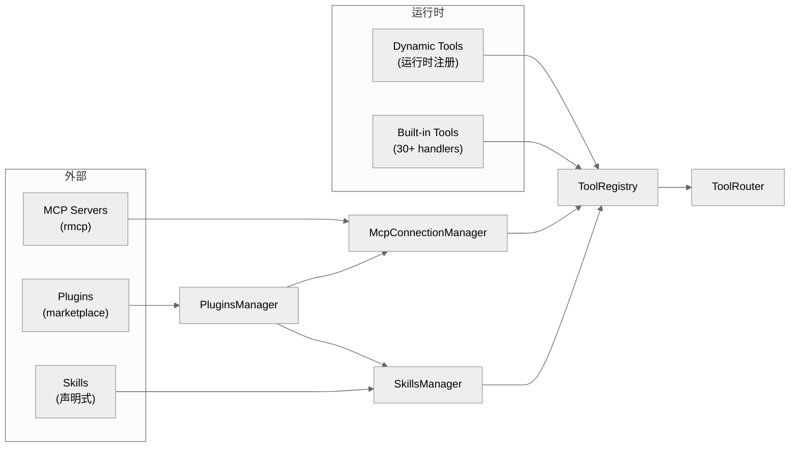

## MCP Server 集成

### McpManager（`core/src/mcp.rs:14-41`）

```rust
impl McpManager {
    pub fn new(plugins_manager: Arc<PluginsManager>) -> Self
    pub fn configured_servers(&self, config: &Config) -> HashMap<String, McpServerConfig>
    pub fn effective_servers(&self, config: &Config, auth: Option<&CodexAuth>) -> HashMap<String, McpServerConfig>
    pub fn tool_plugin_provenance(&self, config: &Config) -> ToolPluginProvenance
}
```

- `configured_servers()`：列出配置中声明的所有 MCP server
- `effective_servers()`：应用认证过滤后的可用 server
- `tool_plugin_provenance()`：映射工具到其所属插件

### McpConnectionManager（`codex-mcp/src/mcp_connection_manager.rs`）

每个 MCP server 对应一个 `RmcpClient` 连接。工具聚合规则：

1. **全限定名**：`mcp__<server>__<tool>`
2. **名称清洗**：仅保留字母数字和下划线（OpenAI Responses API 要求）
3. **冲突处理**：名称过长或冲突时使用 SHA1 哈希后缀（最长 64 字符）

ToolInfo 结构（行 184-195）：

```rust
pub struct ToolInfo {
    server_name: String,
    tool_name: String,
    tool_namespace: String,
    tool: McpTool,
    connector_id: Option<String>,
    connector_name: Option<String>,
    plugin_display_names: Vec<String>,
    connector_description: Option<String>,
}
```

### McpConfig（`codex-mcp/src/mcp/mod.rs:72-101`）

```rust
pub struct McpConfig {
    pub chatgpt_base_url: String,
    pub codex_home: PathBuf,
    pub mcp_oauth_credentials_store_mode: OAuthCredentialsStoreMode,
    pub mcp_oauth_callback_port: Option<u16>,
    pub skill_mcp_dependency_install_enabled: bool,
    pub approval_policy: Constrained<AskForApproval>,
    pub apps_enabled: bool,
    pub configured_mcp_servers: HashMap<String, McpServerConfig>,
    pub plugin_capability_summaries: Vec<PluginCapabilitySummary>,
}
```

## 插件系统

### PluginsManager（`core/src/plugins/manager.rs`，1813 行）

核心结构（行 311-346）：

```rust
pub struct PluginsManager {
    codex_home: PathBuf,
    store: PluginStore,
    featured_plugin_ids_cache: RwLock<Option<CachedFeaturedPluginIds>>,
    cached_enabled_outcome: RwLock<Option<PluginLoadOutcome>>,
    remote_sync_lock: Mutex<()>,
    restriction_product: Option<Product>,
    analytics_events_client: RwLock<Option<AnalyticsEventsClient>>,
}
```

### 主要操作

| 操作 | 行号 | 签名 |
| --- | --- | --- |
| 发现 | 366-395 | `plugins_for_config(&self, config: &Config) -> PluginLoadOutcome` |
| 安装 | 497-589 | `install_plugin(request) -> Result<PluginInstallOutcome>` |
| 卸载 | 591-642 | `uninstall_plugin(&self, plugin_id) -> Result<()>` |
| 远程同步 | 644-845 | `sync_plugins_from_remote(&self, config, auth, additive_only)` |
| 列出市场 | 847-910 | `list_marketplaces_for_config(&self, config, additional_roots)` |
| 读取插件 | 912-1004 | `read_plugin_for_config(&self, config, request)` |

### McpManager（`core/src/mcp.rs:14-41`）

| 方法 | 行号 | 作用 |
| --- | --- | --- |
| `new()` | 14 | 构造实例，注入 PluginsManager |
| `configured_servers()` | 21 | 返回 config.toml 中声明的所有 MCP server |
| `effective_servers()` | 28 | 应用认证过滤后的可用 server 映射 |
| `tool_plugin_provenance()` | 35 | 建立工具→插件的归属映射 |

### McpConnectionManager（`codex-mcp/src/mcp_connection_manager.rs:48-120`）

| 方法 | 行号 | 作用 |
| --- | --- | --- |
| `connect()` | 71 | 建立单个 MCP server 的 RmcpClient 连接 |
| `disconnect()` | 88 | 断开指定 server 连接 |
| `list_tools()` | 103 | 发现并返回所有已连接 server 的工具清单 |
| `call_tool()` | 115 | 通过 server 执行工具调用 |
| `get_effective_tools()` | 95 | 聚合全限定名、去冲突（SHA1 后缀） |

### SkillsManager（`core/src/skills.rs:20-42`）

| 方法 | 行号 | 作用 |
| --- | --- | --- |
| `skills_load_input_from_config()` | 44-54 | 从 config 和 skill root 构建加载输入 |
| `resolve_skill_dependencies_for_turn()` | 56-96 | 解析技能依赖，缺失时通过 UI 请求 |
| `maybe_emit_implicit_skill_invocation()` | 171-230 | 检测隐式技能调用，发射遥测计数器 |

### DynamicTool 注册路径（`core/src/codex.rs:6459-6471`）

| 步骤 | 行号 | 说明 |
| --- | --- | --- |
| 延迟加载注册 | 6459 | dynamic_tools 不进入首轮 prompt |
| 按需启用 | 6465 | deferred_dynamic_tools 从模型可见列表排除 |
| 执行响应 | 4529 | `Op::DynamicToolResponse` 路由到工具输出 |

### 插件清单结构

每个插件的目录结构：

```
<plugin_root>/
├── .codex-plugin/
│   └── plugin.json          # 插件清单
├── skills/                   # 技能目录（默认路径）
├── .mcp.json                 # MCP server 配置
└── .app.json                 # App/Connector 配置
```

### 插件加载管线（行 1390-1487）

1. 从 config name 解析 plugin ID
2. 从 PluginStore 解析 active root
3. 加载 `.codex-plugin/plugin.json` 清单
4. 从 manifest.paths.skills 加载技能
5. 从 `.mcp.json` 加载 MCP servers
6. 从 `.app.json` 加载 Apps

### MCP Server 加载（行 1711-1809）

`load_mcp_servers_from_file()` 的规范化处理：

- 移除 transport type 字段
- 将相对 CWD 路径转为绝对路径
- 对不支持的 OAuth 回调发出警告
- 按 `McpServerConfig` schema 验证

### LoadedPlugin 结构

```rust
pub struct LoadedPlugin {
    config_name: String,
    manifest_name: Option<String>,
    manifest_description: Option<String>,
    root: AbsolutePathBuf,
    enabled: bool,
    skill_roots: Vec<PathBuf>,
    disabled_skill_paths: HashSet<PathBuf>,
    has_enabled_skills: bool,
    mcp_servers: HashMap<String, McpServerConfig>,
    apps: Vec<AppConnectorId>,
    error: Option<String>,
}
```

### Marketplace 系统

- **策划仓库**：OpenAI marketplace（`openai-curated`）
- **同步进程**（行 1037-1077）：每进程运行一次（原子标志防重复），后台线程刷新缓存
- **远程同步**（行 644-845）：与 ChatGPT 后端对账，返回 `installed / enabled / disabled / uninstalled` 列表

## 技能系统

### SkillsManager（`core/src/skills.rs:20-42`）

从 `codex_core_skills` crate 重导出：

- `SkillsManager` — 主技能加载器
- `SkillLoadOutcome` / `SkillMetadata` — 技能信息
- `SkillError` / `SkillPolicy` — 错误/策略类型
- `SkillDependencyInfo` — 依赖定义

### 技能加载（行 44-54）

```rust
pub(crate) fn skills_load_input_from_config(
    config: &Config,
    effective_skill_roots: Vec<PathBuf>,
) -> SkillsLoadInput {
    SkillsLoadInput::new(
        config.cwd.clone().to_path_buf(),
        effective_skill_roots,
        config.config_layer_stack.clone(),
        config.bundled_skills_enabled(),
    )
}
```

### 依赖解析（行 56-96）

```rust
pub(crate) async fn resolve_skill_dependencies_for_turn(
    sess: &Arc<Session>,
    turn_context: &Arc<TurnContext>,
    dependencies: &[SkillDependencyInfo],
)
```

流程：
1. 检查现有 session env
2. 从 `env::var()` 加载缺失值
3. 通过 UI 请求缺失值（标记为 secret/密码输入）
4. 存储到 session dependency env

### 隐式技能调用（行 171-230）

```rust
pub(crate) async fn maybe_emit_implicit_skill_invocation(
    sess: &Session,
    turn_context: &TurnContext,
    command: &str,
    workdir: &Path,
)
```

- 检测命令是否匹配技能名称
- 每轮跟踪已见技能（防重复）
- 发射 `codex.skill.injected` 遥测计数器

## 动态工具

### DynamicToolSpec（`codex_protocol::dynamic_tools`）

Session 级动态工具注册：

```rust
pub(crate) dynamic_tools: Vec<DynamicToolSpec>,
```

来源：
1. 显式 session 参数
2. 从 rollout 数据库持久化
3. 从对话历史检索

### 工具过滤（`codex.rs:6459-6471`）

延迟加载的动态工具不会进入模型可见工具列表，等待按需启用：

```rust
let deferred_dynamic_tools = turn_context.dynamic_tools
    .iter()
    .map(|spec| spec.name())
    .collect::<Vec<_>>();

let tools = effective_mcp_tools()
    .filter(|spec| !deferred_dynamic_tools.contains(spec.name()));
```

### 事件流

- `EventMsg::DynamicToolCallRequest(_)` — 工具执行请求
- `EventMsg::DynamicToolCallResponse(_)` — 工具结果
- Handler：`Op::DynamicToolResponse { id, response }`（行 4529）

### 持久化（`state_db_bridge.rs:5,11`）

```rust
pub use codex_rollout::state_db::get_dynamic_tools;
pub use codex_rollout::state_db::persist_dynamic_tools;
```

## MCP Server 模式（codex 作为 MCP server）

### 入口（`mcp-server/src/lib.rs:56-179`）

```rust
pub async fn run_main(
    arg0_paths: Arg0DispatchPaths,
    cli_config_overrides: CliConfigOverrides,
) -> IoResult<()>
```

架构：3 个并发任务 + channel 通信

| 任务 | 职责 |
| --- | --- |
| stdin reader | 反序列化 JSON-RPC |
| message processor | 处理请求/响应 |
| stdout writer | 序列化输出消息 |

### MessageProcessor（`message_processor.rs:52-158`）

处理的请求类型：

| 请求 | 用途 |
| --- | --- |
| `InitializeRequest` | 初始化 MCP server |
| `ListToolsRequest` | 列出可用工具 |
| `CallToolRequest` | 执行工具 |
| `ListPromptsRequest` / `GetPromptRequest` | Prompts API |
| `ListResourcesRequest` / `ReadResourceRequest` | Resources API |

### CodexToolRunner（`codex_tool_runner.rs:55-142`）

```rust
pub async fn run_codex_tool_session(
    id: RequestId,
    initial_prompt: String,
    config: CodexConfig,
    outgoing: Arc<OutgoingMessageSender>,
    thread_manager: Arc<ThreadManager>,
    ...
)
```

执行流程：
1. 通过 `thread_manager.start_thread(config)` 启动新线程
2. 提交初始 prompt（`sub_id = MCP request_id`）
3. 流式传送所有回合事件作为 MCP notifications
4. 返回最终结果为 `CallToolResult`（含 `thread_id` 和回合完成消息）

## Connector / App 发现

### list_accessible_connectors_from_mcp_tools（`connectors.rs:95-100`）

```rust
pub async fn list_accessible_connectors_from_mcp_tools(
    config: &Config,
) -> anyhow::Result<Vec<AppInfo>>
```

缓存策略：
- Key：Account ID + ChatGPT User ID + workspace status
- TTL：15 分钟（`CONNECTORS_CACHE_TTL`）
- 静态缓存 + instant-based 过期

## 新增工具的修改点

### 情况 A：新增外部 MCP server 暴露的工具

通常**不需要改 core 主链路**。原因：
- `ToolRouter::build_tool_call()` 已能识别 namespaced MCP tool
- `build_specs_with_discoverable_tools()` 会把 MCP tools 纳入注册
- `McpHandler` 已是通用处理器

需要做的工作：
1. 让新 server/tool 出现在 MCP 配置或插件发现结果里
2. 确认 tool schema 能被 `rmcp` 和 tool registry 正常发现
3. 若是 Apps/Connector 工具，检查启用条件和 connector 过滤逻辑

### 情况 B：新增 Codex 内建的一类新工具

需要修改以下核心位置：

| 修改位置 | 文件 | 说明 |
| --- | --- | --- |
| Handler 实现 | `core/src/tools/handlers/<new>.rs` | 实现 `ToolHandler` trait |
| 工具规范 | `core/src/tools/spec.rs` | 注册到 `build_specs_with_discoverable_tools()` |
| 路由器 | `core/src/tools/router.rs` | 添加新的 `ToolHandlerKind` 变体 |
| 协议类型 | `codex_protocol` | 若涉及新参数类型 |
| 编排器 | `core/src/tools/orchestrator.rs` | 若涉及新审批/沙箱语义 |

### 缓存策略总结

| 对象 | 缓存机制 | TTL |
| --- | --- | --- |
| Plugins | `RwLock` 保护，force reload 重算 | 按需 |
| Featured Plugins | 时间戳缓存 | 3 小时 |
| Accessible Connectors | 静态缓存 + 认证 key | 15 分钟 |
| MCP Tools | 每用户账户缓存 | 连接生命周期 |

## 错误处理与安全性：异常捕获、重试策略、沙箱隔离与敏感文件防泄漏

# 错误处理与安全性：异常捕获、重试策略、沙箱隔离与敏感文件防泄漏

主向导对应章节：`错误处理与安全性`

## 统一错误类型体系

### CodexErr（`core/src/error.rs:66`）

Codex 定义了统一错误枚举 `CodexErr`，包含 27+ 变体：

| 分类 | 变体 | 含义 |
| --- | --- | --- |
| **连接/流** | `Stream(String, Option<Duration>)` | SSE 流断连（可选重试延迟）|
| | `ConnectionFailed(ConnectionFailedError)` | 网络连接失败 |
| | `ResponseStreamFailed(ResponseStreamFailed)` | SSE 流失败（含 request ID）|
| | `Timeout` | 超时 |
| **模型/配额** | `ContextWindowExceeded` | 上下文窗口溢出 |
| | `UsageLimitReached(UsageLimitReachedError)` | 用量限制 |
| | `QuotaExceeded` | 配额耗尽 |
| | `ServerOverloaded` | 服务端过载 |
| | `InternalServerError` | 服务端内部错误 |
| **认证** | `RefreshTokenFailed(RefreshTokenFailedError)` | Token 刷新失败 |
| | `UnexpectedStatus(UnexpectedResponseError)` | HTTP 异常状态码 |
| **沙箱** | `Sandbox(SandboxErr)` | 沙箱错误 |
| | `LandlockSandboxExecutableNotProvided` | Linux sandbox 可执行文件缺失 |
| **线程** | `ThreadNotFound(ThreadId)` | 线程未找到 |
| | `AgentLimitReached { max_threads }` | Agent 数量上限 |
| | `InternalAgentDied` | 内部 Agent 异常终止 |
| **流程控制** | `TurnAborted` | 回合被中止 |
| | `Interrupted` | 被用户中断 |
| | `Spawn` | 进程创建失败 |
| **通用** | `Fatal(String)` | 致命错误 |
| | `InvalidRequest(String)` | 无效请求 |
| | `UnsupportedOperation(String)` | 不支持的操作 |
| | `RetryLimit(RetryLimitReachedError)` | 重试上限 |

### SandboxErr（`error.rs:31`）

```rust
pub enum SandboxErr {
    Denied { output: Box<ExecToolCallOutput>, network_policy_decision: Option<...> },
    SeccompInstall(seccompiler::Error),      // Linux only
    SeccompBackend(seccompiler::BackendError),
    Timeout { output: Box<ExecToolCallOutput> },
    Signal(i32),
    LandlockRestrict,
}
```

### 可重试 vs 不可重试分类（`error.rs:197-232`）

`is_retryable()` 是重试逻辑的核心判定点：

**不可重试**（返回 false）：

| 变体 | 原因 |
| --- | --- |
| `TurnAborted`, `Interrupted` | 用户主动中止 |
| `Fatal`, `InvalidRequest`, `InvalidImageRequest` | 逻辑错误 |
| `ContextWindowExceeded` | 需要压缩而非重试 |
| `UsageLimitReached`, `QuotaExceeded`, `UsageNotIncluded` | 配额问题 |
| `Sandbox(*)`, `LandlockSandboxExecutableNotProvided` | 安全策略 |
| `RefreshTokenFailed` | 认证失败 |
| `RetryLimit` | 已用尽重试预算 |
| `ServerOverloaded` | 需要等待而非立即重试 |

**可重试**（返回 true）：

| 变体 | 原因 |
| --- | --- |
| `Stream(*, *)` | 网络断连 |
| `Timeout` | 超时可恢复 |
| `UnexpectedStatus(*)` | HTTP 暂时异常 |
| `ResponseStreamFailed(*)` | SSE 流暂时中断 |
| `ConnectionFailed(*)` | 网络暂时不可达 |
| `InternalServerError` | 服务端暂时异常 |
| `InternalAgentDied` | Agent 意外终止 |
| `Io(*)`, `Json(*)`, `TokioJoin(*)` | 系统/解析暂时错误 |

### 附加错误结构

| 结构 | 行号 | 关键字段 |
| --- | --- | --- |
| `UnexpectedResponseError` | 267 | HTTP status, body, URL, CloudFlare ray ID, request ID |
| `ConnectionFailedError` | 236 | 包装 reqwest::Error |
| `ResponseStreamFailed` | 247 | SSE 错误 + request ID |
| `RetryLimitReachedError` | 385 | 最后尝试的 status code |
| `UsageLimitReachedError` | 405 | plan type, reset time, rate limit, promo message |
| `EnvVarError` | 538 | 变量名 + 设置说明 |

### UI 错误展示

`get_error_message_ui()`（`error.rs:618-652`）对错误消息做长度裁剪，避免终端被刷爆。

## 重试策略

### 指数退避（`util.rs:204-209`）

```rust
const INITIAL_DELAY_MS: u64 = 200;
const BACKOFF_FACTOR: f64 = 2.0;

pub fn backoff(attempt: u64) -> Duration {
    let exp = BACKOFF_FACTOR.powi(attempt.saturating_sub(1) as i32);
    let base = (INITIAL_DELAY_MS as f64 * exp) as u64;
    let jitter = rand::rng().random_range(0.9..1.1);  // +/-10% 抖动
    Duration::from_millis((base as f64 * jitter) as u64)
}
```

退避时间表：

| 尝试次数 | 基准延迟 | 实际范围（含抖动） |
| --- | --- | --- |
| 1 | 200ms | 180-220ms |
| 2 | 400ms | 360-440ms |
| 3 | 800ms | 720-880ms |
| 4 | 1600ms | 1440-1760ms |

### 流式重试机制（`codex.rs` 约行 6571）

```
if !err.is_retryable() -> 立即返回错误

if retries < provider.stream_max_retries():
    retries += 1
    wait backoff(retries) or server-provided delay
    retry

if retries >= max_retries:
    if try_switch_fallback_transport() succeeds:
        emit warning("Falling back from WebSockets to HTTPS transport")
        retries = 0  // 为新传输重置计数器
        continue on HTTPS
    else:
        return error
```

### 特殊重试处理

- `CodexErr::Stream(_, Some(requested_delay))`：优先使用服务端建议的重试延迟
- **WebSocket 到 HTTPS 回退**：会话级一次性（`AtomicBool` 原子交换保证单次激活）
- **401 认证恢复**：`handle_unauthorized()` 尝试刷新凭证

## 沙箱隔离

### 沙箱类型

| 类型 | 平台 | 技术 | 路径 |
| --- | --- | --- | --- |
| `None` | 全平台 | 无隔离 | — |
| `MacosSeatbelt` | macOS | `/usr/bin/sandbox-exec` + SBPL | 硬编码路径防 PATH 注入 |
| `LinuxSeccomp` | Linux | bubblewrap + seccomp + landlock | `codex-linux-sandbox` 二进制 |
| `WindowsRestrictedToken` | Windows | Job objects + restricted tokens | 原生 API |

### 沙箱策略模式

**ReadOnly**：

```rust
ReadOnly {
    access: ReadOnlyAccess,      // Full 或 Restricted(readable_roots)
    network_access: bool,
}
```

**WorkspaceWrite**：

```rust
WorkspaceWrite {
    writable_roots: Vec<AbsolutePathBuf>,  // 如 [/project/dir]
    read_only_access: ReadOnlyAccess,
    network_access: bool,
    exclude_tmpdir_env_var: bool,
    exclude_slash_tmp: bool,
}
```

**ExternalSandbox**：由外部系统管理，仅控制网络访问。

**DangerFullAccess**：无限制，仅在显式审批后允许。

### 沙箱选择逻辑（`manager.rs:138-165`）

```rust
pub fn select_initial(
    &self,
    file_system_policy: &FileSystemSandboxPolicy,
    network_policy: NetworkSandboxPolicy,
    pref: SandboxablePreference,
    windows_sandbox_level: WindowsSandboxLevel,
    has_managed_network_requirements: bool,
) -> SandboxType {
    match pref {
        Forbid => SandboxType::None,
        Require => get_platform_sandbox(...).unwrap_or(None),
        Auto => {
            if should_require_platform_sandbox(...) {
                get_platform_sandbox(...)
            } else {
                SandboxType::None
            }
        }
    }
}
```

### 沙箱命令转换（`manager.rs:167-259`）

`SandboxManager::transform()` 把原始命令包装成沙箱执行请求：

```
原始命令: ["bash", "-c", "ls /tmp"]
                |
        transform()
                |
macOS:   ["/usr/bin/sandbox-exec", "-p", "<sbpl_policy>", "bash", "-c", "ls /tmp"]
Linux:   ["codex-linux-sandbox", "--sandbox-policy", "<json>", "--", "bash", "-c", "ls /tmp"]
Windows: 原始命令 + restricted token + job object
```

### 沙箱拒绝升级流程

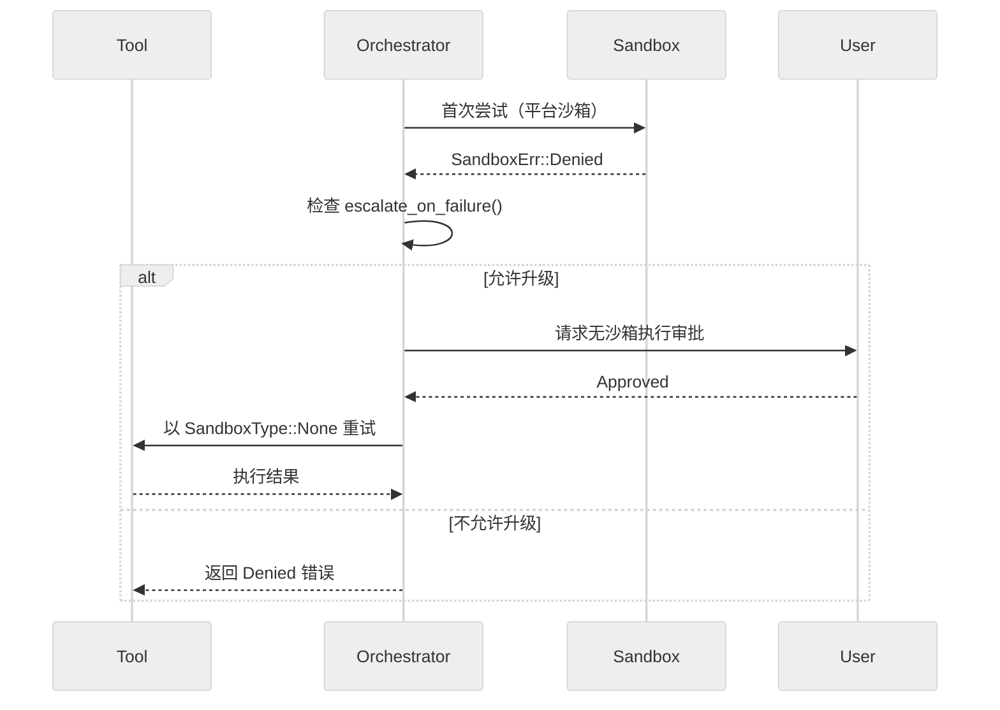

## 路径安全

### AbsolutePathBuf 类型系统

Codex 全面使用 `AbsolutePathBuf`（来自 `codex_utils_absolute_path`）：

- **类型安全的绝对路径表示**：构造时验证
- **防止相对路径意外**：类型系统层面阻止
- **符号链接规范化**：通过 `canonicalize()` 解析

### 路径规范化（`seatbelt.rs:140-154`）

```rust
fn normalize_path_for_sandbox(path: &Path) -> Option<AbsolutePathBuf> {
    if !path.is_absolute() {
        return None;  // 显式拒绝相对路径
    }
    let absolute_path = AbsolutePathBuf::from_absolute_path(path).ok()?;
    absolute_path.as_path()
        .canonicalize()  // 解析符号链接和 .. 遍历
        .ok()
        .and_then(|p| AbsolutePathBuf::from_absolute_path(p).ok())
        .or(Some(absolute_path))
}
```

### 权限路径规范化（`policy_transforms.rs:166-184`）

```rust
fn normalize_permission_paths(paths: Vec<AbsolutePathBuf>, _kind: &str) -> Vec<AbsolutePathBuf> {
    let mut out = Vec::with_capacity(paths.len());
    let mut seen = HashSet::new();
    for path in paths {
        let canonicalized = canonicalize(path.as_path())
            .ok()
            .and_then(|p| AbsolutePathBuf::from_absolute_path(p).ok())
            .unwrap_or(path);
        if seen.insert(canonicalized.clone()) {  // 去重
            out.push(canonicalized);
        }
    }
    out
}
```

## apply_patch 拦截机制

### 目的

防止模型通过 `exec_command` 绕过 `apply_patch` 的权限控制。

### 拦截函数（`apply_patch.rs:257-298`）

```rust
pub async fn intercept_apply_patch(
    command: &[String],
    cwd: &Path,
    timeout_ms: Option<u64>,
    session: Arc<Session>,
    turn: Arc<TurnContext>,
    tracker: Option<&SharedTurnDiffTracker>,
    call_id: &str,
    tool_name: &str,
) -> Result<Option<FunctionToolOutput>, FunctionCallError>
```

行为：
1. 检测命令是否为 `apply_patch` 调用
2. 如果是，发出模型警告："请使用 apply_patch 工具而非 exec_command"
3. 计算 patch 所需的写入权限（仅目标文件所在目录）
4. 通过正规权限审批流程执行 patch

### 权限计算（`apply_patch.rs:63-91`）

```rust
fn write_permissions_for_paths(
    file_paths: &[AbsolutePathBuf],
    file_system_sandbox_policy: &FileSystemSandboxPolicy,
    cwd: &Path,
) -> Option<PermissionProfile>
```

- 提取 patch 涉及的所有文件路径的父目录
- 过滤掉已在沙箱策略中允许写入的路径
- 构建最小权限 `PermissionProfile`

## 权限合并与升级

### 权限 Profile 合并（`policy_transforms.rs:63-109`）

```rust
pub fn merge_permission_profiles(
    base: Option<&PermissionProfile>,
    permissions: Option<&PermissionProfile>,
) -> Option<PermissionProfile>
```

合并规则：
- **网络**：OR 逻辑 — 任一方授予则合并结果授予
- **文件系统**：路径并集（read + write 分别合并）

### 有效文件系统策略（`policy_transforms.rs:275-293`）

```rust
pub fn effective_file_system_sandbox_policy(
    file_system_policy: &FileSystemSandboxPolicy,
    additional_permissions: Option<&PermissionProfile>,
) -> FileSystemSandboxPolicy
```

仅在 `FileSystemSandboxKind::Restricted` 模式下追加额外写入路径；Unrestricted 和 ExternalSandbox 模式不做升级。

### 有效网络策略（`policy_transforms.rs:327-340`）

```rust
pub fn effective_network_sandbox_policy(
    network_policy: NetworkSandboxPolicy,
    additional_permissions: Option<&PermissionProfile>,
) -> NetworkSandboxPolicy
```

若额外权限授予网络访问，升级为 Enabled；若有额外权限但未授予网络，降级为 Restricted。

## 敏感文件防泄漏的多层防御

Codex 的敏感文件保护不是靠单点过滤，而是**多层约束**：

| 层 | 机制 | 作用 |
| --- | --- | --- |
| 1. 工具白名单 | `ToolRegistry` 只注册已知工具 | 防止任意命令执行 |
| 2. 工作目录解析 | `resolve_path()` 基于 turn context 而非模型传参 | 防止路径注入 |
| 3. 文件系统沙箱 | ReadOnly / WorkspaceWrite / Restricted | 物理隔离文件访问 |
| 4. 审批链 | `AskForApproval` + 缓存 | 人工/自动审批门控 |
| 5. apply_patch 拦截 | `intercept_apply_patch()` | 防止绕过 patch 权限 |
| 6. 环境变量过滤 | .env 加载仅 `CODEX_*` 前缀 | 防止密钥泄漏 |
| 7. Unix socket 白名单 | `UnixDomainSocketPolicy::Restricted` | 精确控制 IPC |
| 8. 网络策略 | NetworkSandboxPolicy + host 审批 | 防止未授权外联 |

### 环境变量安全

`arg0_dispatch_or_else()`（`arg0/src/lib.rs`）加载 `~/.codex/.env` 时**仅过滤 `CODEX_*` 前缀**，阻止将敏感变量（如 `AWS_SECRET_KEY`、`DATABASE_URL`）注入子进程环境。

### Windows 世界可写目录警告

`app-server` 启动阶段会检查 Windows 平台上的世界可写目录风险并发出提示。

## 关键函数签名

| 函数 | 文件 | 行号 |
| --- | --- | --- |
| `CodexErr::is_retryable()` | `error.rs` | 197 |
| `CodexErr::to_codex_protocol_error()` | `error.rs` | 566 |
| `get_error_message_ui()` | `error.rs` | 618 |
| `backoff()` | `util.rs` | 204 |
| `SandboxManager::select_initial()` | `manager.rs` | 138 |
| `SandboxManager::transform()` | `manager.rs` | 167 |
| `ToolOrchestrator::run()` | `orchestrator.rs` | 101 |
| `with_cached_approval()` | `sandboxing.rs` | 70 |
| `default_exec_approval_requirement()` | `sandboxing.rs` | 171 |
| `intercept_apply_patch()` | `apply_patch.rs` | 257 |
| `merge_permission_profiles()` | `policy_transforms.rs` | 63 |
| `effective_file_system_sandbox_policy()` | `policy_transforms.rs` | 275 |
| `normalize_permission_paths()` | `policy_transforms.rs` | 166 |

## 性能与代码质量：大文件处理、流式传输、优缺点分析与潜在改进点

# 性能与代码质量：大文件处理、流式传输、优缺点分析与潜在改进点

主向导对应章节：`性能与代码质量`

## 流式渲染管线 Mermaid 图

### 五阶段管线

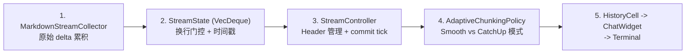

### 自适应分块策略状态机

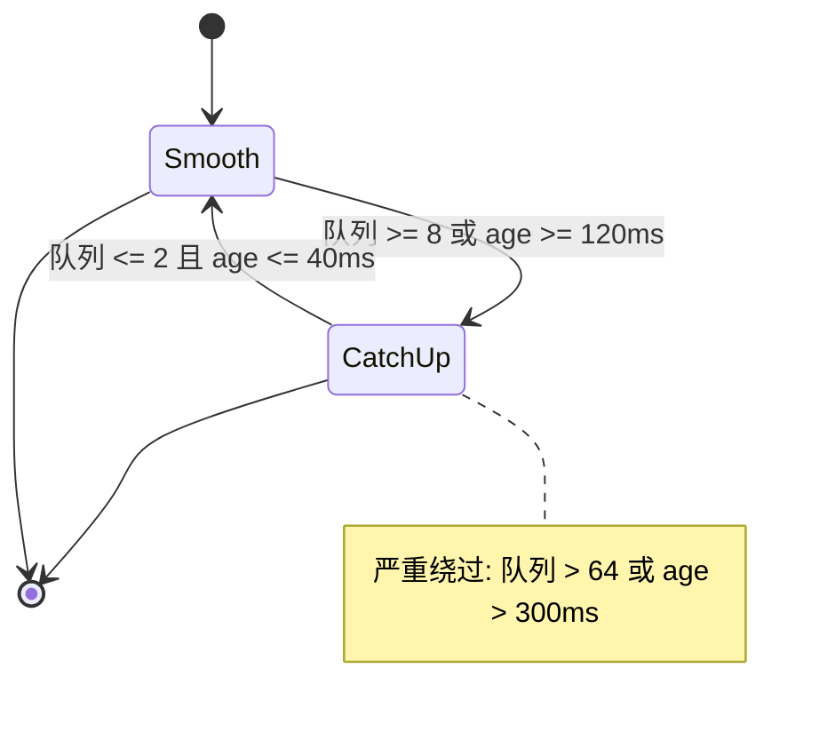

## TUI 事件循环架构

### Reactor 模式（`app.rs:3799-3852`）

`App::run()` 使用 `tokio::select!` 同时监听 4 个并发事件流：

```rust
tokio::select! {
    Some(app_event) = app_events_rx.recv() => { /* App 内部事件 */ },
    Some(thread_event) = active_thread_rx.recv(), if active_thread_rx_guard => { /* 活跃线程事件 */ },
    Some(tui_event) = tui_events.next(), if tui_events_guard => { /* TUI 输入 + 绘制事件 */ },
    Some(server_event) = server_events_rx.recv() => { /* 服务器事件 */ },
}
```

| 事件源 | Channel 容量 | 用途 |
| --- | --- | --- |
| App 事件 | 内部 | 应用级控制（模型切换、设置变更等）|
| 线程事件 | 32,768 | 活跃线程的 agent 输出 |
| TUI 事件 | — | 键盘/鼠标/resize + 定时绘制 |
| 服务器事件 | — | app-server 状态变更 |

### 帧率控制

- **目标帧率**：120 FPS（最小 8.33ms 间隔）
- **实现**：`FrameRateLimiter`（`frame_rate_limiter.rs:23`）通过 deadline clamping
- **Guard 条件**：防止在 handler 不可用时冗余轮询

### 事件流管理

`EventBroker` 模式支持 pause/resume：
- 在外部编辑器启动时暂停 stdin 事件
- 编辑器退出后恢复
- 防止 stdin 竞争

## 流式渲染管线（LLM 输出到终端）

### 五阶段管线


### 阶段 1：MarkdownStreamCollector

累积原始 `OutputTextDelta` 事件。

### 阶段 2：StreamState（`streaming/mod.rs:30-102`）

```rust
pub struct StreamState {
    queue: VecDeque<StreamLine>,
    pending: Option<StreamLine>,    // 未完成的行
    newest_queued: Option<Instant>,
    oldest_queued: Option<Instant>,
}
```

**关键设计：换行门控渲染**

- 只有换行符触发行完成和队列入列
- 未完成的行留在 `pending` 缓冲区
- **好处**：防止部分行渲染导致的视觉闪烁
- Markdown 渲染发生在换行时，而非连续进行

O(1) 操作：`step()`、`drain_n()`、`drain_all()`

### 阶段 3：StreamController（`streaming/controller.rs:35`）

- Header 管理
- Commit tick 驱动渲染刷新

### 阶段 4：AdaptiveChunkingPolicy（`streaming/chunking.rs:180`）

**双档位系统 + 滞后**：

| 模式 | 行为 | 触发条件 |
| --- | --- | --- |
| **Smooth** | 每 8.33ms 输出 1 行 | 队列 <= 2 且 age <= 40ms（保持 250ms）|
| **CatchUp** | 每帧输出全部排队行 | 队列 >= 8 或 age >= 120ms |

**阈值详情**：
- 进入 CatchUp：队列 >= 8 **或** 最老行 age >= 120ms
- 退回 Smooth：队列 <= 2 **且** age <= 40ms（需保持 250ms）
- 严重绕过：队列 > 64 或 age > 300ms（跳过保持期）

**滞后好处**：防止在阈值附近模式震荡。

### 阶段 5：ChatWidget 渲染

最终渲染到 `HistoryCell` -> `ChatWidget` -> Terminal。

## 性能优化汇总

| 优化项 | 位置 | 影响 |
| --- | --- | --- |
| 换行门控渲染 | `controller.rs:35` | 防止子行级闪烁 |
| 时间戳追踪 | `mod.rs:24-26` | 启用 age-based 自适应决策 |
| 自适应分块 | `chunking.rs:180` | 双档位避免显示延迟 |
| 滞后门 | `chunking.rs:159` | 消除模式震荡 |
| VecDeque FIFO | `mod.rs:56-79` | O(1) drain 操作 |
| 帧率上限 | `frame_rate_limiter.rs` | 120 FPS 防止 CPU 浪费 |
| 事件暂停/恢复 | `event_stream.rs:89` | 防止 stdin 与编辑器竞争 |
| 线程缓冲 | `app.rs:166` | 32KB per-thread LRU |
| WebSocket 优先 | `client.rs:1294` | 低延迟双向流 |
| HTTPS 回退 | `client.rs:1003` | 鲁棒性保证 |
| Dynamic tools 延迟加载 | `codex.rs:6459` | 减少 prompt 膨胀 |
| SQLite WAL + 增量 vacuum | `state/runtime.rs:70` | 降低写入竞争 |
| 双数据库分离 | `state/runtime.rs:70-76` | 日志/状态锁解耦 |
| 日志批量写入 | `log_db.rs:48-80` | batch=128, flush=2s |
| app-server 按需监听 | `codex_message_processor.rs` | 非全量轮询 |
| Prompt cache | 对话 ID 作 key | 跨轮复用 OpenAI prompt caching |
| Zstd 压缩 | ChatGPT 认证路径 | 减少传输体积 |
| Cursor-based 分页 | state DB 查询 | 避免全表扫描 |

## 传输层性能

### WebSocket（优先）

- **双向流式**：低延迟实时通信
- **连接复用**：turn 内缓存，跨重试共享
- **增量请求**：`previous_response_id` 支持增量
- **Sticky routing**：`x-codex-turn-state` 保证服务端路由一致性

### HTTPS（回退）

- **SSE 流式**：单向流，但兼容性更好
- **认证恢复**：401 自动刷新 token
- **Zstd 压缩**：减少 payload 大小

### 回退策略

WebSocket 重试耗尽后自动回退到 HTTPS，会话级一次性切换。`AtomicBool` 保证多线程环境下只触发一次。

## SQLite 调优详情

```sql
PRAGMA journal_mode = WAL;         -- 写前日志，读写并发
PRAGMA synchronous = NORMAL;       -- 安全/速度平衡
PRAGMA busy_timeout = 5000;        -- 5 秒锁等待
PRAGMA auto_vacuum = INCREMENTAL;  -- 增量空间回收
-- max_connections: 5 per database
```

### 查询模式

- **Cursor-based 分页**（非 offset）：避免大表全扫描
- **锚点 (timestamp, uuid)**：大数据集稳定排序
- **后台回填**：异步 spawn，不阻塞应用启动
- **优雅降级**：DB 可选，不可用时应用继续运行

### 日志数据库优化

- **分库**：日志和状态分离，减少锁竞争
- **批量写入**：batch size 128，flush 间隔 2 秒
- **日志分区**：每 10 MiB 一个分区

## 代码质量评估

### 优点

| 维度 | 评价 |
| --- | --- |
| 架构边界 | 清晰：CLI/TUI/app-server/core/state 分层自然 |
| 工具执行链 | 抽象完整：审批、沙箱、重试没有散落在各 handler 中 |
| 长会话支持 | 成熟：线程 resume/fork 模型统一 |
| 错误处理 | 不是简单 `anyhow` 透传，做了可重试分类和用户可读映射 |
| 流式渲染 | 精巧：换行门控 + 自适应分块 + 滞后防震荡 |
| 持久化 | 务实：双 DB + WAL + 批量写入 |
| 类型安全 | AbsolutePathBuf 防路径注入，ts-rs 跨语言类型同步 |
| 测试覆盖 | chatwidget/tests/ 15+ 测试文件，streaming/ 单元测试 |

### 风险与改进点

| 优先级 | 问题 | 建议 |
| --- | --- | --- |
| **高** | `chatwidget.rs` 11,070 行、`app.rs` 10,837 行 — 过大 | 按职责拆分为多个模块 |
| **高** | app-server 与 core 间事件类型和状态机较多 | 新人上手成本高，需更好文档 |
| **高** | 32KB per-thread channel 容量硬编码 | 改为可配置，加显式背压处理 |
| **中** | 工具/审批/权限 feature flag 组合复杂 | 测试矩阵快速膨胀，需组合测试策略 |
| **中** | 无性能基准测试套件 | 增加流式吞吐量、渲染延迟、内存负载测试 |
| **中** | WebSocket 到 HTTPS 回退无反向恢复 | 考虑在 WebSocket 恢复后切回 |
| **低** | "内建工具"和"MCP 工具"扩展路径不完全一致 | 统一扩展文档 |
| **低** | 帧率遥测缺失 | 增加帧率/延迟监控指标 |
| **低** | 流式策略参数不可配置 | 暴露为用户配置项 |

### 超大文件详情

| 文件 | 行数 | 复杂度评估 |
| --- | --- | --- |
| `chatwidget.rs` | 11,070 | 极高 — 单体 widget，渲染/事件/状态混合 |
| `app.rs` | 10,837 | 极高 — 主循环、bootstrap、所有子系统协调 |
| `history_cell.rs` | 4,682 | 高 — 历史记录 cell 渲染 |
| `codex.rs` | 7,000+ | 高 — Agent 核心循环 |
| `client.rs` | 1,300+ | 中等 — 传输层 |
| `streaming/*` | 模块化 | 良好 — 职责清晰拆分 |

### 异步模式质量

- **Multi-threaded Tokio runtime**：16MB stack per worker
- **`Arc<Mutex<T>>`** 共享状态：async-safe
- **`color_eyre::Result<T>`** 丰富错误上下文
- **优雅降级模式**：`Option<T>` 保护可选组件

## 综合判断

这是一个**工程化程度很高的本地代理系统**。其优势不在单个算法点，而在把模型流、工具系统、审批、安全和 UI 事件流收敛成了一个一致的运行时。真正的复杂度集中在 `core` 和 `tui/app-server` 交界处。

**如果后续要继续扩展，最值得优先治理的三件事**：

1. **超大文件拆分**：`chatwidget.rs` 和 `app.rs` 都超过 10K 行，维护成本递增
2. **权限组合测试覆盖**：审批策略 x 沙箱模式 x 网络策略的组合爆炸需要系统化测试
3. **性能基准建立**：无基准则无优化方向，需要流式吞吐量和渲染延迟的持续监控

**生产就绪度**：高。Codex 在流式传输、沙箱安全、状态持久化方面都有精心的工程设计，适合作为本地代理系统的参考架构。

## Codex 项目初始化分析报告

# Codex 项目初始化分析报告

## 目录导航

- [1. 核心价值](#1-核心价值)
- [2. 技术选型](#2-技术选型)
- [3. 目录地图](#3-目录地图)
- [4. 启动链路](#4-启动链路)
- [5. 分层模型](#5-分层模型)
- [6. 核心抽象](#6-核心抽象)
- [7. 设计模式](#7-设计模式)
- [8. 并发与状态管理](#8-并发与状态管理)
- [9. 请求生命周期](#9-请求生命周期)
- [10. 工程健壮性专项分析](#10-工程健壮性专项分析)
- [11. 代码质量评估](#11-代码质量评估)

## 1. 核心价值

Codex CLI 的核心目标不是“再做一个聊天终端”，而是把本地代码仓库、模型推理、工具执行、审批/沙箱、安全边界和 TUI 反馈整合成一个可持续运行的编码代理系统。它解决的是三类问题：

1. 把自然语言请求转成可执行的工程动作。
2. 在本地执行 `shell`、`apply_patch`、MCP、子代理等工具时维持可审计的权限边界。
3. 在长会话、多线程、恢复/分叉、UI 渲染之间保持一致的状态模型。

## 2. 技术选型

| 维度 | 选型 | 角色 |
| --- | --- | --- |
| 主语言 | Rust | 主运行时，承载 CLI、TUI、app-server、core、state、sandbox |
| 包装层 | Node.js | `codex-cli/bin/codex.js` 负责跨平台分发、PATH 注入、启动原生二进制 |
| 异步运行时 | Tokio | 线程事件、模型流式响应、工具执行、app-server RPC |
| TUI | `ratatui` + `crossterm` | 终端 UI、事件循环、绘制和交互 |
| Web/API | `axum`、`reqwest`、WebSocket/SSE | app-server 对外协议、模型 API 连接 |
| 持久化 | SQLite + `sqlx` | 线程元数据、日志、回放、动态工具等状态 |
| 协议扩展 | MCP (`rmcp`) | 外部工具、资源、Apps/Connector 集成 |
| 构建/测试 | Cargo、Bazel、Just | 本地开发、CI、测试、发布 |

相关入口命令集中在仓库根的 `justfile`，例如 `just codex`、`just exec`、`just test`、`just mcp-server-run`。

## 3. 目录地图

这里最值得先读的不是顶层目录，而是实际承载运行链路的 5 个核心目录：

| 目录 | 作用 |
| --- | --- |
| `codex-rs/cli` | 命令行参数解析、子命令分发、进入 TUI 或 Exec 模式 |
| `codex-rs/tui` | TUI 初始化、事件循环、会话切换、UI 更新 |
| `codex-rs/app-server` | 统一 RPC 层，向 TUI 暴露线程/配置/事件接口 |
| `codex-rs/core` | Agent 核心，含 Prompt 构建、模型调用、工具路由、线程生命周期 |
| `codex-rs/state` | SQLite 状态与日志存储，支撑恢复、历史、审计 |

补充目录：

- `codex-cli`：npm 安装后的 JS 包装入口。
- `sdk`：对 app-server 的 SDK 封装，不在主 CLI 热路径上。
- `docs`：安装、贡献、用户文档。

## 4. 启动链路

严格说有两层入口：

1. 分发入口：`codex-cli/bin/codex.js`
2. 真实业务入口：`codex-rs/cli/src/main.rs::main`

如果从源码运行，唯一业务入口就是 Rust 的 `main()`。npm 层只是找到正确平台二进制再 `spawn`。

### 初始化顺序


### 关键函数清单

| 模块 | 关键函数 | 作用 |
| --- | --- | --- |
| `codex-rs/cli/src/main.rs` | `main` | 总入口，先做 `arg0` 分派 |
| `codex-rs/cli/src/main.rs` | `cli_main` | 解析 `MultitoolCli`，决定进入哪种子命令 |
| `codex-rs/cli/src/main.rs` | `run_interactive_tui` | 规范化 prompt、加载认证、进入 TUI |
| `codex-rs/tui/src/lib.rs` | `run_main` | 组装 config、启动 app-server、准备 UI 环境 |
| `codex-rs/tui/src/app.rs` | `App::run` | bootstrap、线程创建/恢复、事件主循环 |

## 5. 分层模型

Codex 的分层非常清晰，可以概括为：

`CLI 包装层 -> TUI 编排层 -> App Server 会话层 -> Core Agent 层 -> Tool/Sandbox 执行层 -> State 持久化层`

具体对应关系：

- CLI 包装层：`codex-cli`、`codex-rs/cli`
- TUI 编排层：`codex-rs/tui`
- 会话/RPC 层：`codex-rs/app-server`
- Agent 核心层：`codex-rs/core`
- 执行与权限层：`codex-rs/core/src/tools/*`、`codex-rs/sandboxing`
- 持久化层：`codex-rs/state`

这种结构把“交互”和“执行”拆得比较彻底，所以同一套 core 可以被 TUI、exec 模式和 app-server 复用。

## 6. 核心抽象

### 6.1 ThreadManager / CodexThread

`ThreadManager` 是线程生命周期总控，负责新建、恢复、分叉、订阅创建事件，并持有模型、MCP、技能、插件、环境等管理器。真正的线程实例由 `Codex::spawn(...)` 创建，之后包装成 `CodexThread`。

关键函数清单：

- `codex-rs/core/src/thread_manager.rs::ThreadManager::new`
- `codex-rs/core/src/thread_manager.rs::spawn_new_thread`
- `codex-rs/core/src/thread_manager.rs::resume_thread_from_rollout_with_source`
- `codex-rs/core/src/thread_manager.rs::spawn_thread_with_source`

### 6.2 ModelClient / ModelClientSession

这一对抽象把“会话级 API 状态”和“单轮流式请求状态”分开。前者缓存认证和 provider，后者缓存 WebSocket 会话、turn-state 和本轮重试/回退状态。

关键函数清单：

- `codex-rs/core/src/client.rs::ModelClient::new_session`
- `codex-rs/core/src/client.rs::ModelClientSession::stream`
- `codex-rs/core/src/client.rs::stream_responses_websocket`
- `codex-rs/core/src/client.rs::stream_responses_api`
- `codex-rs/core/src/client.rs::handle_unauthorized`

### 6.3 ToolRouter / ToolRegistry / ToolOrchestrator

这组抽象完成三件事：注册工具、把模型输出解析成工具调用、在审批与沙箱下执行工具。它们让工具执行与模型推理解耦。

关键函数清单：

- `codex-rs/core/src/tools/spec.rs::build_specs_with_discoverable_tools`
- `codex-rs/core/src/tools/router.rs::ToolRouter::from_config`
- `codex-rs/core/src/tools/router.rs::build_tool_call`
- `codex-rs/core/src/tools/router.rs::dispatch_tool_call_with_code_mode_result`
- `codex-rs/core/src/tools/orchestrator.rs::ToolOrchestrator::run`

### 6.4 MessageProcessor

`app-server` 并不直接耦合 TUI，而是通过 `MessageProcessor` 和 `CodexMessageProcessor` 统一处理配置、线程、认证、文件、事件订阅等 RPC 请求。

关键函数清单：

- `codex-rs/app-server/src/in_process.rs::start`
- `codex-rs/app-server/src/in_process.rs::start_uninitialized`
- `codex-rs/app-server/src/message_processor.rs::MessageProcessor::new`
- `codex-rs/app-server/src/codex_message_processor.rs::ensure_conversation_listener`
- `codex-rs/app-server/src/codex_message_processor.rs::ensure_listener_task_running_task`

## 7. 设计模式

### 7.1 Registry + Strategy

`build_specs_with_discoverable_tools(...)` 先生成可见 spec，再根据 `ToolHandlerKind` 注册不同 handler。工具本身通过 handler 策略对象切换，新增工具不需要修改推理主循环。

### 7.2 Orchestrator

`ToolOrchestrator::run(...)` 把“审批 -> 选沙箱 -> 执行 -> 按需升级重试”封装成统一流程，避免每个工具重复写权限逻辑。

### 7.3 Reactor / Event Loop

`App::run(...)` 用 `tokio::select!` 同时监听 UI 事件、线程事件、app-server 事件和内部 app 事件，是标准的 reactor 风格。

### 7.4 Adapter

`app-server` 的 in-process client 把本地 core 线程适配成统一 RPC 接口，使内嵌模式和远程模式共享同一套会话协议。

## 8. 并发与状态管理

并发模型以 Tokio 为核心，状态模型则是“内存索引 + SQLite 持久化”的双层结构。

- 线程表：`ThreadManagerState` 使用 `Arc<RwLock<HashMap<ThreadId, Arc<CodexThread>>>>`
- 事件广播：线程创建使用 `broadcast::channel`
- UI 主循环：`App::run` 中的 `select!`
- 模型长连接：优先 WebSocket，失败回退 HTTPS Responses API
- 数据持久化：`StateRuntime` 初始化 state db 与 logs db，使用 WAL、`busy_timeout`、增量 vacuum

`StateRuntime::init(...)` 还把日志库单独拆出去，降低日志写入和状态读写之间的锁竞争，这个设计很实用。

## 9. 请求生命周期

### 9.1 用户输入解析

CLI 参数在 `cli_main()` 完成第一轮分派；交互模式下 `run_interactive_tui()` 负责把命令行 prompt、image、审批策略、sandbox 策略等转成 TUI 启动参数。真正的会话创建发生在 `App::run()` 里，通过 `app_server.start_thread / resume_thread / fork_thread` 打开主线程。

### 9.2 Agent 决策链

Prompt 构建和模型调用都在 `codex-rs/core/src/codex.rs`。

- `get_user_instructions(...)` 会读取层级 `AGENTS.md`，并受字节预算限制
- `build_prompt(...)` 组合输入消息、可见工具、base instructions、personality、输出 schema
- `run_sampling_request(...)` 构建工具路由、启动 code mode worker、调用 `ModelClientSession::stream(...)`

这里一个很关键的细节是：延迟加载的 dynamic tools 不会直接塞进模型可见工具列表，先控制 prompt 体积，再按需启用。

### 9.3 Tool Use 机制、权限控制与执行闭环

模型返回的 `ResponseItem` 先由 `ToolRouter::build_tool_call(...)` 解析成 `ToolCall`。随后 `handle_output_item_done(...)` 记录事件并把工具调用放入异步 future。真正执行时：

1. `ToolRouter::dispatch_tool_call_with_code_mode_result(...)` 找到对应 handler
2. `ShellHandler::run_exec_like(...)` 或其他 handler 组装请求
3. `ToolOrchestrator::run(...)` 先判断 `ExecApprovalRequirement`
4. 选择首个 sandbox，执行工具
5. 若因沙箱拒绝且策略允许，则走升级重试
6. 结果通过 `FunctionCallOutput` 回注到后续模型轮次

`ShellHandler::run_exec_like(...)` 里还能看到两个重要安全钩子：

- `normalize_and_validate_additional_permissions(...)`：规范化并校验附加权限
- `intercept_apply_patch(...)`：把 shell 中的 `apply_patch` 拦截成受控内建工具，而不是裸命令执行

### 9.4 结果回传与 UI 更新

模型流中的非工具输出和工具输出最终都会走回线程事件，再由 app-server 订阅机制推给 TUI。`CodexMessageProcessor::ensure_listener_task_running_task(...)` 会为线程建立持续监听，把新事件广播给已订阅连接；`App::run(...)` 的主循环消费这些事件并刷新 `ChatWidget`。

### 9.5 生命周期顺序图

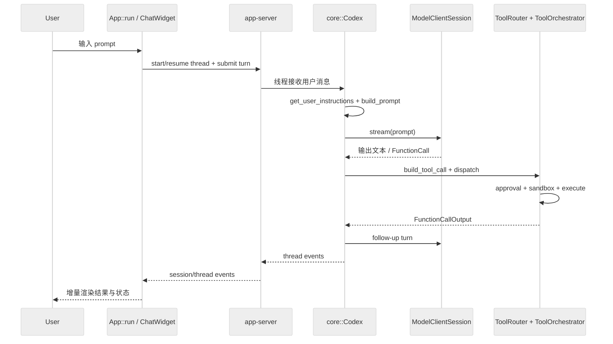

## 10. 工程健壮性专项分析

### 10.1 错误处理机制

`codex-rs/core/src/error.rs` 定义了统一错误枚举 `CodexErr`，并通过 `is_retryable()` 明确区分“可自动重试”和“应立即失败”的错误。

关键点：

- 流式断连对应 `CodexErr::Stream`，会自动退避重试
- WebSocket 重试耗尽后，会回退到 HTTPS transport
- 401 会触发 `handle_unauthorized(...)` 尝试刷新凭证
- UI 展示错误时使用 `get_error_message_ui(...)` 做长度裁剪，避免终端刷爆

### 10.2 安全性分析

安全控制主要集中在工具执行链路：

- sandbox 模式可区分只读、工作区可写、危险全访问
- 审批策略通过 `AskForApproval` 控制何时需要人工/自动 reviewer 批准
- 显式提权在非 `OnRequest` 模式下会被拒绝
- `workdir` 解析基于 turn context，而不是直接信任模型传参
- `apply_patch` 被专门拦截，避免变成任意 shell 修改
- `app-server` 启动阶段还会做 Windows world-writable 目录风险提示

如果要回答“如何防止敏感文件泄露”，更准确的说法是：它不是靠单点过滤完成，而是靠“工具白名单 + 工作目录解析 + 文件系统沙箱 + 审批链”多层约束实现。

### 10.3 性能优化

当前实现比较成熟，优化点很具体：

- WebSocket 优先，失败才退 HTTPS，兼顾低延迟和鲁棒性
- 模型输出流式消费，`OutputTextDelta` 级别更新 UI
- dynamic tools 支持延迟加载，减少 prompt 膨胀
- SQLite 使用 WAL、增量 vacuum、日志库拆分，减少竞争
- app-server 对线程监听是按需建立，不是全量轮询

### 10.4 扩展性：新增 MCP tool 要改哪些文件

分两种情况：

#### 情况 A：新增“外部 MCP server 暴露的工具”

通常不需要改 core 主链路。原因是：

- `ToolRouter::build_tool_call(...)` 已能识别 namespaced MCP tool
- `build_specs_with_discoverable_tools(...)` 会把 MCP tools 纳入注册计划
- `McpHandler` 已是通用处理器

这时主要工作是：

1. 让新的 server/tool 出现在 MCP 配置或插件发现结果里。
2. 确认 tool schema 能被 `rmcp` 和 tool registry 正常发现。
3. 若是 Apps/Connector 工具，检查启用条件和 connector 过滤逻辑。

#### 情况 B：新增“Codex 内建的一类新工具”

需要改这些核心位置：

1. `codex-rs/core/src/tools/handlers/*`
2. `codex-rs/core/src/tools/spec.rs`
3. `codex-rs/core/src/tools/router.rs`
4. 必要时修改协议参数类型所在的 `codex_protocol`
5. 若涉及新审批/沙箱语义，还要改 `tools/orchestrator.rs` 或对应 runtime

## 11. 代码质量评估

### 优点

- 架构边界清楚，CLI、TUI、app-server、core、state 分层自然。
- 工具执行链条抽象完整，审批、沙箱、重试没有散落在各 handler 中。
- 对长会话和恢复/分叉支持较成熟，线程模型统一。
- 错误处理不是简单 `anyhow` 透传，而是做了可重试分类和用户可读映射。

### 风险与改进点

- `core/src/codex.rs` 和 `tui/src/app.rs` 都偏大，主流程清晰但局部维护成本高。
- app-server 与 core 间的事件类型和状态机较多，新人上手成本不低。
- 工具/审批/权限相关 feature flag 很强大，但组合复杂，测试矩阵会快速膨胀。
- “内建工具”和“MCP 工具”的扩展路径并不完全一致，文档仍可再统一。

### 综合判断

这是一个工程化程度很高的本地代理系统。其优势不在单个算法点，而在把模型流、工具系统、审批、安全和 UI 事件流收敛成了一个一致的运行时。真正的复杂度集中在 `core` 和 `tui/app-server` 交界处；如果后续要继续扩展，最值得优先治理的是超大文件拆分与权限组合测试覆盖。
