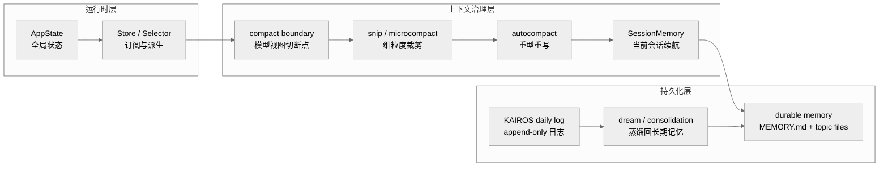
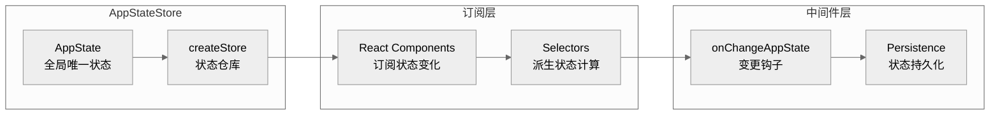
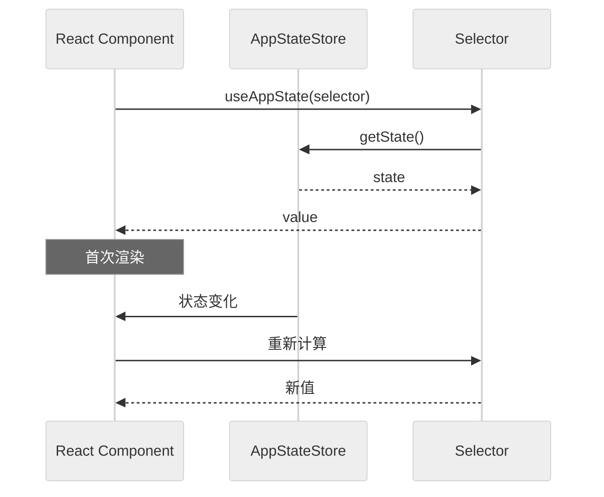
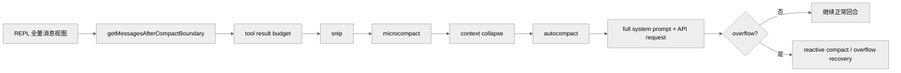
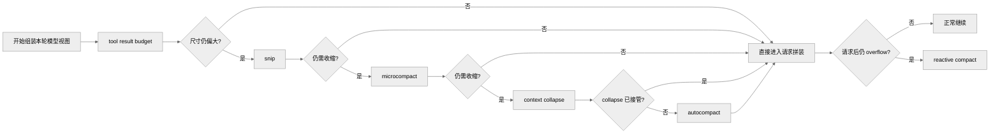
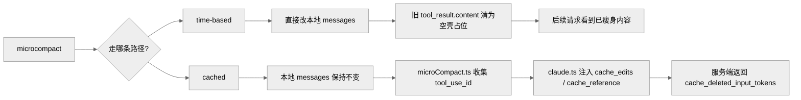
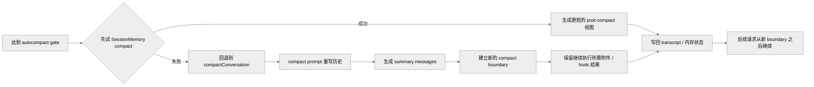
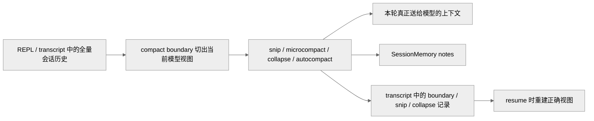
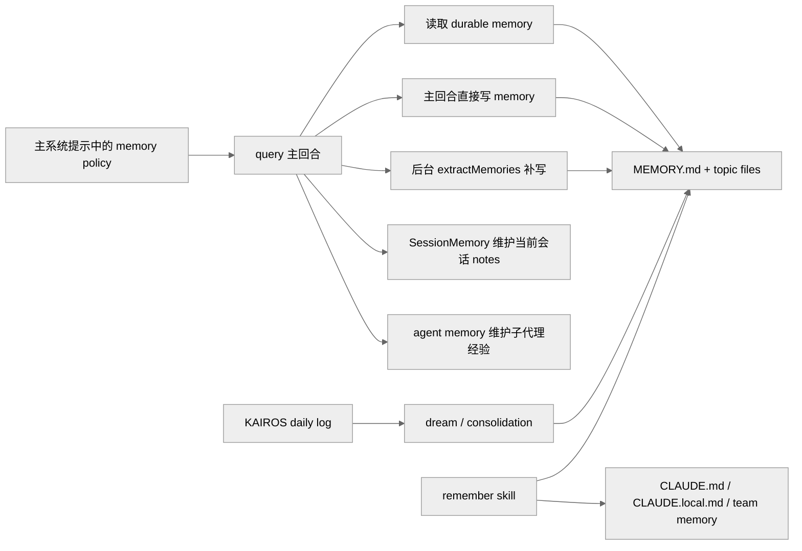
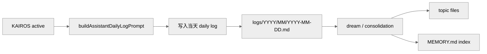

# Claude Code 的状态、会话与记忆系统

**目录**

- [1. 概述](#1-概述)
- [2. 实现机制](#2-实现机制)
  - [2.1 状态管理](#21-状态管理)
  - [2.2 上下文管理](#22-上下文管理)
  - [2.3 记忆系统](#23-记忆系统)
- [3. 实际使用模式](#3-实际使用模式)
- [4. 代码示例](#4-代码示例)
- [5. 关键函数清单](#5-关键函数清单)
- [6. 代码质量评估](#6-代码质量评估)

---

## 1. 概述

Claude Code 的运行时持久化能力由三个正交子系统共同构成：

- **状态管理**（AppState / Store / Selector）：维护进程内的全局运行时状态，是 UI 渲染和工具执行的单一数据源。
- **上下文管理**（compact 梯度体系）：在每轮请求前重新计算"真正值得进入模型视图的内容"，防止历史消息无限膨胀。
- **记忆系统**（durable memory / KAIROS / dream）：把跨会话有价值的上下文持久化到磁盘，并在未来查询时按需注入。

三者的协作边界如下：



- AppState 是进程内唯一可信状态源，不持久化到磁盘。
- 上下文管理决定每轮模型看到什么，结果写入 transcript 供 resume 恢复。
- 记忆系统负责跨会话的长期知识，通过系统提示或 attachment 注入当前上下文。

---

## 2. 实现机制

### 2.1 状态管理

**位置**: `src/state/AppStateStore.ts`、`src/state/store.ts`、`src/state/selectors.ts`

#### 2.1.1 AppState 类型定义

AppState 使用 `DeepImmutable<T>` 包裹，将所有属性递归标记为 `readonly`。这是编译时约束，运行时没有 `Object.freeze`。

```typescript
export type AppState = DeepImmutable<{
  // ── 设置 ────────────────────────────────────────────────────
  settings: SettingsJson                    // 用户设置
  verbose: boolean                          // 详细输出模式
  mainLoopModel: ModelSetting              // 主循环模型
  mainLoopModelForSession: ModelSetting    // 会话级模型覆盖

  // ── 视图状态 ────────────────────────────────────────────────
  statusLineText: string | undefined
  expandedView: 'none' | 'tasks' | 'teammates'
  isBriefOnly: boolean
  coordinatorTaskIndex: number
  viewSelectionMode: 'none' | 'selecting-agent' | 'viewing-agent'

  // ── 工具权限 ────────────────────────────────────────────────
  toolPermissionContext: ToolPermissionContext

  // ── 任务系统 ────────────────────────────────────────────────
  tasks: TaskState[]

  // ── MCP ────────────────────────────────────────────────────
  mcp: {
    clients: MCPServerConnection[]
    commands: Command[]
    tools: Tools
    resources: Record<string, ServerResource[]>
    installationErrors: PluginError[]
  }

  // ── 桥接 ───────────────────────────────────────────────────
  replBridgeEnabled: boolean
  replBridgeConnected: boolean
  replBridgeSessionActive: boolean
  replBridgeReconnecting: boolean
  replBridgeConnectUrl: string | undefined

  // ── 特性 ────────────────────────────────────────────────────
  agent: string | undefined
  kairosEnabled: boolean
  remoteConnectionStatus: 'connecting' | 'connected' | 'reconnecting' | 'disconnected'
  remoteBackgroundTaskCount: number

  // ── 推测执行 ────────────────────────────────────────────────
  speculation: SpeculationState

  // ── 文件历史 / 归因 / 主题 ──────────────────────────────────
  fileHistory: FileHistoryState
  attribution: AttributionState
  theme: ThemeName
  terminalTheme: TerminalTheme | undefined
}>
```

#### 2.1.2 Store 实现

**位置**: `src/state/store.ts`

```typescript
export function createStore<S>(initialState: S): Store<S> {
  let state = initialState
  const listeners = new Set<Listener>()

  return {
    getState(): S {
      return state
    },

    setState(updater: (prev: S) => S): void {
      const newState = updater(state)
      // 引用比较优化：相同引用不触发通知
      if (newState === state) return
      state = newState
      for (const listener of listeners) {
        listener()
      }
    },

    subscribe(listener: Listener): Unsubscribe {
      listeners.add(listener)
      return () => listeners.delete(listener)
    }
  }
}
```

Store 架构示意：



#### 2.1.3 AppStateStore 初始状态

**位置**: `src/state/AppStateStore.ts`

```typescript
const createInitialState = (): AppState => ({
  settings: getInitialSettings(),
  verbose: false,
  mainLoopModel: 'claude-sonnet-4-5',
  mainLoopModelForSession: 'claude-sonnet-4-5',
  expandedView: 'none',
  isBriefOnly: false,
  coordinatorTaskIndex: -1,
  viewSelectionMode: 'none',
  toolPermissionContext: getEmptyToolPermissionContext(),
  tasks: [],
  mcp: { clients: [], commands: [], tools: [], resources: {}, installationErrors: [] },
  replBridgeEnabled: false,
  replBridgeConnected: false,
  replBridgeSessionActive: false,
  replBridgeReconnecting: false,
  kairosEnabled: false,
  remoteConnectionStatus: 'disconnected',
  remoteBackgroundTaskCount: 0,
  speculation: IDLE_SPECULATION_STATE,
  fileHistory: createEmptyFileHistoryState(),
  attribution: createEmptyAttributionState(),
})
```

#### 2.1.4 状态选择器

**位置**: `src/state/selectors.ts`

选择器使用上一次结果缓存（非 LRU），输入引用不变则直接返回缓存值：

```typescript
// 任务选择器
export const selectTasks = (state: AppState) => state.tasks
export const selectTaskById = (state: AppState, id: string) =>
  state.tasks.find(t => t.id === id)

// MCP 选择器
export const selectMcpTools = (state: AppState) => state.mcp.tools
export const selectMcpClients = (state: AppState) => state.mcp.clients

// 桥接选择器
export const selectBridgeState = (state: AppState) => ({
  enabled: state.replBridgeEnabled,
  connected: state.replBridgeConnected,
  sessionActive: state.replBridgeSessionActive,
})

// 模型选择器
export const selectMainLoopModel = (state: AppState) =>
  state.mainLoopModel ?? state.settings.model
```

#### 2.1.5 状态变更处理

**位置**: `src/state/onChangeAppState.ts`

```typescript
// 任务变更处理
export function onTasksChange(handler: (tasks: TaskState[]) => void): () => void {
  return onAppStateChange((prev, next) => {
    if (prev.tasks !== next.tasks) {
      handler(next.tasks)
    }
  })
}

// MCP 工具变更处理
export function onMcpToolsChange(handler: (tools: Tools) => void): () => void {
  return onAppStateChange((prev, next) => {
    if (prev.mcp.tools !== next.mcp.tools) {
      handler(next.mcp.tools)
    }
  })
}
```

#### 2.1.6 状态更新模式

不可变更新（spread 展开）：

```typescript
// 添加任务
setAppState(prev => ({ ...prev, tasks: [...prev.tasks, newTask] }))

// 更新任务
setAppState(prev => ({
  ...prev,
  tasks: prev.tasks.map(t =>
    t.id === taskId ? { ...t, status: 'running' } : t
  )
}))

// 删除任务
setAppState(prev => ({
  ...prev,
  tasks: prev.tasks.filter(t => t.id !== taskId)
}))
```

批量更新在单次 `setState` 调用中合并多个字段变更，只触发一次监听器通知。

#### 2.1.7 React 集成



#### 2.1.8 持久化

**设置持久化**（`src/utils/settings/settings.ts`）：`loadSettings()` 读取 `settings.json`，不存在则返回默认值。

**会话持久化**（`src/utils/sessionStorage.ts`）：

```typescript
interface SessionData {
  messages: Message[]
  taskState: TaskState[]
}

export async function saveSession(data: SessionData): Promise<void> {
  await writeFile(getSessionPath(), JSON.stringify(data), { mode: 'fsync' })
}

export async function loadSession(): Promise<SessionData | null> {
  if (!existsSync(getSessionPath())) return null
  return JSON.parse(await readFile(getSessionPath(), 'utf-8'))
}
```

注意：`mcp.clients`（连接对象）、`replBridgeConnected`（运行时状态）等字段不会持久化，恢复时需重新初始化。

#### 2.1.9 状态调试

```typescript
export function getStateSnapshot(): string {
  return JSON.stringify(appStore.getState(), null, 2)
}

export function enableStateLogging(): void {
  appStore.subscribe(() => {
    console.debug('[State]', JSON.stringify(appStore.getState(), null, 2))
  })
}
```

---

### 2.2 上下文管理

**位置**: `src/query.ts`、`src/services/compact/*`、`src/services/api/claude.ts`

本节讨论 Claude Code 如何在长会话里持续控制"真正送给模型的上下文"。上下文管理不是单一压缩器，而是一组按顺序尝试、彼此联动的梯度机制。

#### 2.2.1 主链路位置

`query()` 在每轮发请求前，不是直接把全部消息原样送给模型，而是经过以下流水线：



#### 2.2.2 梯度体系

这不是"四层同时工作"，而是按需逐层升级：



#### 2.2.3 compact boundary：模型视图的切断点

**位置**: `src/query.ts:365`、`src/utils/messages.ts`

- REPL 保留完整 scrollback，但模型只看最近 boundary 之后的消息。
- UI 历史 ≠ 模型上下文。
- transcript 恢复时需围绕 boundary 重建正确链路。

#### 2.2.4 tool result budget：第一层尺寸治理

**位置**: `src/query.ts:369-394`

避免单条 tool result 直接撑爆上下文，在更重的压缩机制介入前做最小粒度的预算裁剪。

#### 2.2.5 snip：直接删消息，不做摘要

**位置**: `src/query.ts:396-410`、`src/utils/sessionStorage.ts:1840-1983`

- 直接删掉中间区段消息，不生成摘要替代旧内容。
- 通过 `parentUuid` 重连消息链。
- 返回值包含 `messages`、`tokensFreed`、`boundaryMessage`。
- headless/SDK 路径会在 replay 后直接裁掉内存中的消息，避免无 UI 长会话持续膨胀。

#### 2.2.6 microcompact：对 tool result 做细粒度压缩

**位置**: `src/services/compact/microCompact.ts`、`src/services/api/claude.ts`

microcompact 有两条明确不同的实现路径：



- **time-based microcompact**：服务端 prompt cache 大概率已冷时触发，直接把旧 `tool_result.content` 清成 `[Old tool result content cleared]`，属于内容级压缩。
- **cached microcompact**：只在主线程、支持模型、feature 打开时可用，本地消息不改，通过 `cache_edits` 在 API 层编辑 cache，属于 cache-layer editing。

#### 2.2.7 context collapse：维护投影视图

**位置**: `src/query.ts:428-447`、`src/commands/context/context.tsx`

- 维护 collapse store，每轮按 commit log 重放成投影视图。
- collapse summary 不住在 REPL message array 里。
- transcript 会把 commit 与 snapshot 写成 `marble-origami-commit` / snapshot entries。
- overflow 恢复时先调用 `contextCollapse.recoverFromOverflow()`。
- context collapse 打开后，proactive autocompact 会被 suppress。

#### 2.2.8 autocompact：最后的重型上下文重写

**位置**: `src/services/compact/autoCompact.ts`、`src/services/compact/compact.ts`

触发阈值：

```
effectiveContextWindow = getContextWindowForModel(model) - reservedTokensForSummary
autoCompactThreshold = effectiveContextWindow - 13_000
```

autocompact 命中后先试 `SessionMemory compact`，只有快路径走不通时才回退到 `compactConversation()`：



传统 compact 路径下，`NO_TOOLS_PREAMBLE` 进入 compact prompt，强制 compaction agent 只输出 `<analysis> + <summary>`，不调用任何工具。

#### 2.2.9 reactive compact：失败后的恢复式压缩

当真正出现 API overflow、prompt-too-long 或其他上下文相关失败时，系统进入 reactive compact / overflow recovery 路径，而不是立即终止。这说明上下文管理同时包含预防式压缩和失败后恢复式压缩两类能力。

#### 2.2.10 与 SessionMemory、transcript、compact prompt 的对接

- **SessionMemory** 是 autocompact 的第一条快路径，利用已有 notes 保留最近消息尾部，尽量避免进入传统 full compact summary。
- **transcript** 不是单纯聊天记录，而是长会话上下文治理结果的持久化底座：compact boundary、snip 删除记录、context collapse commit/snapshot 都写入 transcript，供 resume 时重建正确视图。
- **compact prompt**（`src/services/compact/prompt.ts`）是上下文管理系统中的重型重写器，要求模型输出结构化 summary 并为继续执行做准备。



---

### 2.3 记忆系统

**位置**: `src/memdir/`、`src/services/autoDream/`、`src/services/SessionMemory/`、`src/tools/AgentTool/`

#### 2.3.1 八类子系统总图

| 子系统 | 关键源码 | 存储形态 | 作用域 | 主要用途 |
| --- | --- | --- | --- | --- |
| auto-memory | `src/memdir/memdir.ts`、`src/memdir/memoryTypes.ts` | `MEMORY.md` + topic files | 用户 / 项目 | 保存长期有价值、又不能从仓库直接推导出的上下文 |
| team memory | `src/memdir/teamMemPrompts.ts` | private/team 双目录 | 个人 / 团队 | 把 durable memory 从个人扩展到协作范围 |
| relevant memory recall | `src/memdir/findRelevantMemories.ts`、`src/utils/attachments.ts` | attachment 注入 | 当前 turn | 在查询时只注入最相关的 memory files |
| KAIROS daily log | `src/memdir/memdir.ts`、`src/memdir/paths.ts` | `logs/YYYY/MM/YYYY-MM-DD.md` | assistant 会话 | 把长期写入改成 append-only 日志流 |
| dream / consolidation | `src/services/autoDream/*` | 从 logs/transcripts 回写 topic files | durable memory | 把日志和近期信号蒸馏回长期记忆 |
| SessionMemory | `src/services/SessionMemory/prompts.ts` | 当前会话 notes 文件 | 当前 session | 保持 compact / resume 之后的会话连续性 |
| agent memory | `src/tools/AgentTool/agentMemory.ts` | 每类 agent 自己的 `MEMORY.md` | agent 级 | 给子代理保留跨会话、跨任务经验 |
| `remember` skill | `src/skills/bundled/remember.ts` | 审阅报告 | 人工治理 | 审查 memory、`CLAUDE.md`、`CLAUDE.local.md` 的边界与提升路径 |



#### 2.3.2 durable memory 主线

**位置**: `src/memdir/memdir.ts`、`src/memdir/memoryTypes.ts`

durable memory 的核心原则：只保存未来仍有价值、又不能从当前仓库直接推导出的上下文。

源码中的原生 memory type 分类（`src/memdir/memoryTypes.ts`）：

| 类型 | 主要内容 | 典型例子 |
| --- | --- | --- |
| `user` | 用户画像、知识背景、协作偏好 | 用户是 SRE、偏好简洁回答 |
| `feedback` | 用户对工作方式的纠偏或确认 | 不要先写测试桩、先给最小补丁 |
| `project` | 项目中的非代码事实 | 截止日期、事故背景、决策原因 |
| `reference` | 外部系统入口与引用关系 | Grafana 面板、Linear 看板、Slack 频道 |

明确不应写入 durable memory 的内容：代码结构、目录树、file paths、git history、debugging recipe、已写进 `CLAUDE.md` 的内容、当前对话里的临时任务状态。

默认存储结构：`MEMORY.md` 作为索引入口，真正内容落在独立 topic files。`loadMemoryPrompt()` 的返回值进入主系统提示，意味着 auto-memory 是主回合必须遵守的行为约束。

**team memory**（`src/memdir/teamMemPrompts.ts`）启用后，durable memory 增加 scope 维度：

- type（user / feedback / project / reference）
- scope（private / shared team）

`buildCombinedMemoryPrompt()` 要求模型在写入前判断内容应归属 private 还是 team，shared memory 中绝不能保存敏感信息。

#### 2.3.3 查询时读取 durable memory

**默认模式**（`src/context.ts`、`src/utils/claudemd.ts`）：通过 `getClaudeMds(filterInjectedMemoryFiles(await getMemoryFiles()))` 把 memory / instructions 注入 `userContext`。

**实验路径：按需召回**（`src/memdir/findRelevantMemories.ts`）：


三个关键设计：
1. 精确度优先于召回率：只选明显有用的 memory，最多 5 个，不确定就不选。
2. 相关性判断是另一条 Sonnet side query，不是本地关键词匹配。
3. 异步 prefetch，不阻塞主回合；到 collect point 还没完成就直接跳过。

#### 2.3.4 KAIROS：把长期写入改成 daily log 模式

**位置**: `src/main.tsx`、`src/bootstrap/state.ts`、`src/memdir/memdir.ts`

KAIROS 是 assistant-mode runtime latch，激活条件：
1. build-time `feature('KAIROS')`
2. assistant mode 判定为真
3. 工作目录已通过 trust dialog
4. `kairosGate.isKairosEnabled()` 通过，或由 `--assistant` 强制

启用后，`loadMemoryPrompt()` 直接返回 `buildAssistantDailyLogPrompt(skipIndex)`，优先级高于 TEAMMEM。

目标文件路径（`src/memdir/paths.ts`）：

```
<autoMemPath>/logs/YYYY/MM/YYYY-MM-DD.md
```

KAIROS 核心特征：append-only、按时间顺序累积、不在主回合里直接维护 `MEMORY.md` index。

| 维度 | 普通 auto-memory | KAIROS daily log |
| --- | --- | --- |
| 主写入目标 | topic files + `MEMORY.md` index | 当天的 `logs/YYYY/MM/YYYY-MM-DD.md` |
| 写入风格 | 语义化、可更新、可去重 | append-only、按时间顺序累积 |
| 是否立即维护 index | 是 | 否 |
| 对话假设 | 普通会话，按任务推进 | assistant / perpetual session |
| 是否与 TEAMMEM 组合 | 可以 | 不组合，KAIROS 优先 |
| 后续整理方式 | 直接维护 topic files | 依赖后续 consolidation / `/dream` |



#### 2.3.5 dream / consolidation：把日志蒸馏回 durable memory

**位置**: `src/services/autoDream/consolidationPrompt.ts`、`src/services/autoDream/autoDream.ts`

`buildConsolidationPrompt()` 把 dream 流程拆成四步：

1. **Orient**：看 memory dir、`MEMORY.md`、现有 topic files
2. **Gather recent signal**：优先看 daily logs，再看 drift，再 grep transcripts
3. **Consolidate**：把值得长期保存的信息合并进 memory files
4. **Prune and index**：更新 `MEMORY.md`，清理 stale pointer，让索引保持短小

KAIROS 与非 KAIROS 的 consolidation 路径不同：

```typescript
// autoDream.ts 中的关键分支
if (getKairosActive()) return false // KAIROS mode uses disk-skill dream
```

- 非 KAIROS 模式：走后台 `autoDream`
- KAIROS 模式：改用 disk-skill 版本的 `dream`（需 `feature('KAIROS') || feature('KAIROS_DREAM')`）

#### 2.3.6 相邻机制

**SessionMemory**（`src/services/SessionMemory/prompts.ts`）：面向当前会话在 compact / resume / continuation 之后还能接得上，不是 durable memory taxonomy 的一部分。默认结构化模板包含：`# Session Title`、`# Current State`、`# Task specification`、`# Files and Functions`、`# Workflow`、`# Errors & Corrections`、`# Codebase and System Documentation`、`# Learnings`、`# Key results`、`# Worklog`。

**extractMemories**（`src/services/extractMemories/prompts.ts`）：主 durable memory policy 的后台补写器。只看最近若干条消息，不准额外调查，shell 只允许只读命令，memory 目录内才允许 `Edit` / `Write`。如果主 agent 本回合已经自己写了 memory，extract 流程会跳过。

**agent memory**（`src/tools/AgentTool/agentMemory.ts`）：给子代理保留跨会话、跨任务经验，scope 分为 user / project / local，`loadAgentMemoryPrompt()` 复用通用 memory prompt builder 并附加 scope note。

**`remember` skill**（`src/skills/bundled/remember.ts`）：人工治理层，同时审视 auto-memory、`CLAUDE.md`、`CLAUDE.local.md`、team memory，给出 Promotions / Cleanup / Ambiguous / No action needed 四类建议，只提案不直接改，模糊项必须交给用户确认。

#### 2.3.7 "7 层记忆"映射到源码

| 常见图中层 | 关键代码 | 更准确归类 |
| --- | --- | --- |
| Tool Result Storage | `src/query.ts`、`src/services/compact/microCompact.ts` | 会话内 tool-result 尺寸治理 |
| Microcompaction | `src/services/compact/microCompact.ts`、`src/services/api/claude.ts` | 细粒度上下文压缩 / cache editing |
| Session Memory | `src/services/SessionMemory/*` | 当前会话续航 |
| Full Compaction | `src/services/compact/*` | 重型上下文重写 |
| Auto Memory Extraction | `src/services/extractMemories/*`、`src/memdir/*` | durable memory 的后台补写 |
| Dreaming | `src/services/autoDream/*`、`src/skills/bundled/index.ts` | durable memory consolidation |
| Cross-Agent Communication | `src/tools/AgentTool/*`、`src/tools/SendMessageTool/*` | 协作 / 通信平面 |

结论：前四层大部分属于上下文治理，不属于长期记忆后端；`Cross-Agent Communication` 属于协作平面，不属于 memory backend。

---

## 3. 实际使用模式

三个子系统在实际场景中的协同方式如下：

### 3.1 普通会话（无 KAIROS）

1. 启动时，`AppState` 初始化为默认值，`kairosEnabled: false`。
2. 每轮 `query()` 前，上下文管理流水线按需裁剪历史消息。
3. durable memory 通过 `loadMemoryPrompt()` 进入主系统提示，具体 topic files 通过 `userContext` 注入。
4. 主回合结束后，`extractMemories` 后台补写器检查是否有新内容值得写入 durable memory。
5. 如果上下文达到 autocompact 阈值，先试 `SessionMemory compact`，再回退到传统 full compact。
6. compact 结果写入 transcript，下次 resume 时重建正确视图。

### 3.2 KAIROS / assistant 模式

1. `kairosEnabled: true`，`loadMemoryPrompt()` 切换到 `buildAssistantDailyLogPrompt()`。
2. 每轮有价值的信息 append 到当天 `logs/YYYY/MM/YYYY-MM-DD.md`，不直接维护 `MEMORY.md`。
3. 上下文管理流水线与普通模式相同，但 KAIROS 不与 TEAMMEM 组合。
4. 定期或手动触发 `/dream`，把 daily log 蒸馏回 topic files 和 `MEMORY.md` index。

### 3.3 多代理场景

1. 主代理持有 `AppState`，子代理通过 `AgentTool` 启动。
2. 子代理有独立的 `agent memory`（`~/.claude/agent-memory/<agentType>/`），跨任务积累经验。
3. 子代理的上下文管理独立运行，compact 结果不影响主代理的 `AppState`。
4. 主代理通过 `selectTasks` 选择器监听任务状态变化，驱动 UI 更新。

### 3.4 会话恢复

1. `loadSession()` 从 transcript 读取 `messages` 和 `taskState`。
2. 根据 transcript 中的 compact boundary 重建模型视图。
3. snip 删除记录通过 `parentUuid` 重连消息链。
4. context collapse 的 commit/snapshot 重放成投影视图。
5. `AppState` 中的运行时字段（`mcp.clients`、`replBridgeConnected` 等）重新初始化。
6. durable memory 通过 `loadMemoryPrompt()` 重新注入，relevant memory recall 按需 prefetch。

---

## 4. 代码示例

以下代码示例均来自原三章，完整保留。

### 4.1 DeepImmutable 类型

```typescript
// 深度不可变类型：递归将所有属性标记为 readonly
type DeepImmutable<T> = {
  readonly [K in keyof T]: T[K] extends object
    ? DeepImmutable<T[K]>
    : T[K]
}
```

注意：这只是编译时约束，运行时没有任何 `Object.freeze` 操作。

### 4.2 createStore 完整实现

```typescript
export function createStore<S>(initialState: S): Store<S> {
  let state = initialState
  const listeners = new Set<Listener>()

  return {
    getState(): S {
      return state
    },

    setState(updater: (prev: S) => S): void {
      const newState = updater(state)
      if (newState === state) {
        return
      }
      state = newState
      for (const listener of listeners) {
        listener()
      }
    },

    subscribe(listener: Listener): Unsubscribe {
      listeners.add(listener)
      return () => listeners.delete(listener)
    }
  }
}
```

### 4.3 状态不可变更新模式

```typescript
// 添加任务
setAppState(prev => ({
  ...prev,
  tasks: [...prev.tasks, newTask]
}))

// 更新任务
setAppState(prev => ({
  ...prev,
  tasks: prev.tasks.map(t =>
    t.id === taskId ? { ...t, status: 'running' } : t
  )
}))

// 删除任务
setAppState(prev => ({
  ...prev,
  tasks: prev.tasks.filter(t => t.id !== taskId)
}))
```

### 4.4 会话持久化

```typescript
interface SessionData {
  messages: Message[]
  taskState: TaskState[]
}

export async function saveSession(data: SessionData): Promise<void> {
  const sessionPath = getSessionPath()
  await writeFile(
    sessionPath,
    JSON.stringify(data),
    { mode: 'fsync' }
  )
}

export async function loadSession(): Promise<SessionData | null> {
  const sessionPath = getSessionPath()
  if (!existsSync(sessionPath)) {
    return null
  }
  const content = await readFile(sessionPath, 'utf-8')
  return JSON.parse(content)
}
```

### 4.5 状态变更监听

```typescript
// 任务变更处理
export function onTasksChange(handler: (tasks: TaskState[]) => void): () => void {
  return onAppStateChange((prev, next) => {
    if (prev.tasks !== next.tasks) {
      handler(next.tasks)
    }
  })
}

// MCP 工具变更处理
export function onMcpToolsChange(handler: (tools: Tools) => void): () => void {
  return onAppStateChange((prev, next) => {
    if (prev.mcp.tools !== next.mcp.tools) {
      handler(next.mcp.tools)
    }
  })
}
```

### 4.6 状态调试工具

```typescript
export function getStateSnapshot(): string {
  const state = appStore.getState()
  return JSON.stringify(state, null, 2)
}

export function enableStateLogging(): void {
  appStore.subscribe(() => {
    const state = appStore.getState()
    console.debug('[State]', JSON.stringify(state, null, 2))
  })
}
```

---

## 5. 关键函数清单

### 5.1 状态管理

| 函数/类型 | 文件 | 职责 |
|----------|------|------|
| `AppState` | `src/state/AppStateStore.ts` | 全局状态类型定义（DeepImmutable 包裹） |
| `createStore<S>()` | `src/state/store.ts` | 工厂函数：创建带订阅的 observable store |
| `createAppStore()` | `src/state/AppStateStore.ts` | 创建 AppState 专用 store 实例 |
| `getAppState()` | `src/state/AppStateStore.ts` | 读取当前全局状态 |
| `setAppState()` | `src/state/AppStateStore.ts` | 状态变更入口，触发订阅者通知 |
| `subscribeAppState()` | `src/state/AppStateStore.ts` | 订阅状态变化 |
| `selectTasks()` | `src/state/selectors.ts` | 任务列表选择器 |
| `selectMcpTools()` | `src/state/selectors.ts` | MCP 工具选择器 |
| `selectBridgeState()` | `src/state/selectors.ts` | 桥接状态选择器 |
| `selectMainLoopModel()` | `src/state/selectors.ts` | 主循环模型选择器 |
| `onTasksChange()` | `src/state/onChangeAppState.ts` | 任务变更钩子 |
| `onMcpToolsChange()` | `src/state/onChangeAppState.ts` | MCP 工具变更钩子 |
| `useAppState()` hook | `src/REPL.tsx` | React hook：订阅状态变更，触发 TUI 重渲染 |
| `getStateSnapshot()` | — | 获取状态快照用于调试 |
| `enableStateLogging()` | — | 启用状态变更日志 |

### 5.2 上下文管理

| 函数/类型 | 文件 | 职责 |
|----------|------|------|
| `query()` 上下文治理段 | `src/query.ts:365-468` | boundary、budget、snip、microcompact、collapse、autocompact 的调用顺序 |
| `getMessagesAfterCompactBoundary()` | `src/utils/messages.ts` | 从 compact boundary 之后取模型视图 |
| `snipCompactIfNeeded()` | `src/query.ts:396-410` | 最细粒度删消息路径 |
| `projectSnippedView()` | `src/services/compact/snipProjection.ts` | 从 API 视图中过滤 snipped messages |
| `microCompact()` | `src/services/compact/microCompact.ts` | time-based 与 cached 两条路径 |
| cache editing 请求拼装 | `src/services/api/claude.ts` | `cache_edits` / `cache_reference` 注入 |
| `projectView()` | `src/commands/context/context.tsx` | context collapse 投影视图入口 |
| `contextCollapse.recoverFromOverflow()` | `src/services/contextCollapse/*` | overflow 恢复时重建 collapse 视图 |
| `trySessionMemoryCompaction()` | `src/services/compact/autoCompact.ts` | autocompact 的 SessionMemory 快路径 |
| `compactConversation()` | `src/services/compact/compact.ts` | 传统 full compact summary |
| compact prompt | `src/services/compact/prompt.ts` | `NO_TOOLS_PREAMBLE` 与结构化 summary |

### 5.3 记忆系统

| 函数/类型 | 文件 | 职责 |
|----------|------|------|
| `loadMemoryPrompt()` | `src/memdir/memdir.ts` | 加载 memory 规则进入主系统提示 |
| `buildAssistantDailyLogPrompt()` | `src/memdir/memdir.ts` | KAIROS 模式下的 daily log 写入规则 |
| `buildCombinedMemoryPrompt()` | `src/memdir/teamMemPrompts.ts` | team memory 的 type + scope 双维判断 |
| `getAutoMemDailyLogPath()` | `src/memdir/paths.ts` | KAIROS daily log 路径生成 |
| `startRelevantMemoryPrefetch()` | `src/memdir/findRelevantMemories.ts` | 异步 prefetch 相关 memory files |
| `selectRelevantMemories()` | `src/memdir/findRelevantMemories.ts` | Sonnet side query 选择相关 memory |
| `buildConsolidationPrompt()` | `src/services/autoDream/consolidationPrompt.ts` | dream 四步流程（Orient/Gather/Consolidate/Prune） |
| `autoDream()` | `src/services/autoDream/autoDream.ts` | 非 KAIROS 模式的后台 consolidation 触发器 |
| `loadAgentMemoryPrompt()` | `src/tools/AgentTool/agentMemory.ts` | 子代理 memory prompt 加载 |
| `extractMemories` prompt | `src/services/extractMemories/prompts.ts` | 后台补写器的受限子代理规则 |
| `remember` skill | `src/skills/bundled/remember.ts` | 人工治理：审阅并提案 memory 变更 |

---

## 6. 代码质量评估

### 6.1 优点

**状态管理**
- **单向数据流**：所有状态通过 `setAppState()` 变更，UI 只读不写，数据流向单一，竞态条件大幅减少。
- **选择器模式**：组件只订阅自己关心的状态切片，避免无关状态变更触发不必要的重渲染，Ink TUI 性能受益明显。
- **状态类型完整**：`AppState` 明确定义了所有运行时状态字段，没有隐式 mutable 全局变量，状态追踪成本低。
- **引用比较优化**：`setState` 内部使用严格相等（`===`）比较新旧状态，相同引用不触发通知，在 REPL 渲染循环中每秒数十次 `setState` 调用只有真正变化的才触发 UI 重渲染。

**上下文管理**
- **梯度上下文体系**：按需逐层升级，不是每轮固定跑完整条链，token 预算随会话状态动态调配。
- **Compact prompt 自愈**：上下文溢出时主动触发 compact，生成 summary 而不是截断，保留语义连贯性。
- **Prompt cache 友好设计**：session 级 `cache_control` 标签让 Anthropic API 在多轮请求间复用 prompt 前缀，降低 API 调用延迟和 token 成本。
- **预防 + 恢复双保险**：既有预防式压缩链路，又有 reactive compact 兜底，真正 overflow 时不会直接终止。

**记忆系统**
- **三层内存作用域精细化**：user（持久全局）/ session（会话临时）/ repo（项目范围）三层分离，记忆不同重要性信息时有明确归属。
- **对话压缩延长有效上下文**：通过 LLM 摘要压缩历史，在 context window 限制内尽可能保留更长的有效对话信息。
- **内存文件可直接编辑**：内存存储为 Markdown 文件，用户可直接用文本编辑器查看和修改，无 lock-in。
- **精确度优先于召回率**：relevant memory recall 最多选 5 个，不确定就不选，避免把不相关记忆塞进当前上下文。
- **自动提取 + 人工治理分离**：`extractMemories` 负责自动收集，`remember` skill 负责人工审阅，不是全自动治理。

### 6.2 风险与改进点

**状态管理**
- **状态持久化方案缺失**：`AppState` 是纯内存状态，进程崩溃后丢失所有会话状态，会话恢复依赖外部 transcript 文件而非状态 snapshot。
- **选择器无 memoization**：若选择器函数涉及复杂计算（如 message 过滤），每次触发都重算，在长会话场景下可能产生性能热点。
- **`AppState` 耦合度高**：随着功能迭代，越来越多的字段被追加进 `AppState`，类型体积持续膨胀，容易变成"上帝状态"。
- **DeepImmutable 仅编译时约束**：运行时没有 `Object.freeze`，绕过 TypeScript 类型检查直接修改状态不会有运行时错误。

**上下文管理**
- **`compact` 触发语义不透明**：用户不知道当前会话是"正常运行"还是"正在压缩上下文"，compact 的语义损失率也无法量化。
- **记忆系统与上下文管理松耦合**：`Memory.md` 注入与 transcript 恢复是两条独立路径，恢复 session 时记忆文件变更不会自动同步到恢复后的对话上下文。
- **过大的 system prompt 抵消 compact 收益**：若 system prompt 本身（tools + instructions + memory）已占 context 窗口 30%+，compact 产生的 summary 也会被大 system prompt 挤压。

**记忆系统**
- **compactMemory 策略不可配置**：内存裁剪逻辑固定按时间顺序删除，无法配置"保留特定标签的条目"等语义化保留策略。
- **对话压缩引入 LLM 调用**：压缩本身消耗 token 和延迟，在网络条件差或 quota 紧张时，压缩操作可能失败导致 context 截断。
- **repo 内存无 gitignore 协调**：repo scope 内存文件存储在项目目录，若未加入 `.gitignore` 可能被误提交，暴露调试内容或 API key。
- **KAIROS 分支实现不完整**：当前反编译树中 `src/assistant/index.ts` 仍是 stub，`isAssistantMode()` 等函数没有完整还原，KAIROS 相关行为只能从结构和分支设计推断。

---

## 关键源码锚点

| 主题 | 代码锚点 |
|------|---------|
| AppState 类型定义 | `src/state/AppStateStore.ts` |
| Store 实现 | `src/state/store.ts` |
| 状态选择器 | `src/state/selectors.ts` |
| 状态变更钩子 | `src/state/onChangeAppState.ts` |
| query 上下文治理顺序 | `src/query.ts:365-468` |
| snip 调用点 | `src/query.ts:396-410` |
| microcompact 主体 | `src/services/compact/microCompact.ts` |
| cache editing 请求拼装 | `src/services/api/claude.ts` |
| autocompact gate | `src/services/compact/autoCompact.ts` |
| compact prompt | `src/services/compact/prompt.ts` |
| transcript 中的 snip / collapse 恢复 | `src/utils/sessionStorage.ts` |
| durable memory 类型定义 | `src/memdir/memoryTypes.ts` |
| memory prompt 加载 | `src/memdir/memdir.ts` |
| team memory scope 判断 | `src/memdir/teamMemPrompts.ts` |
| KAIROS daily log 路径 | `src/memdir/paths.ts` |
| relevant memory recall | `src/memdir/findRelevantMemories.ts` |
| dream consolidation prompt | `src/services/autoDream/consolidationPrompt.ts` |
| autoDream 触发器 | `src/services/autoDream/autoDream.ts` |
| SessionMemory 模板 | `src/services/SessionMemory/prompts.ts` |
| agent memory | `src/tools/AgentTool/agentMemory.ts` |
| remember skill | `src/skills/bundled/remember.ts` |
| KAIROS 激活分支 | `src/main.tsx` |

---

*文档版本: 1.0*
*分析日期: 2026-03-31*
*合并自: 05-state-management.md、11-context-management.md、16-memory-system.md*
