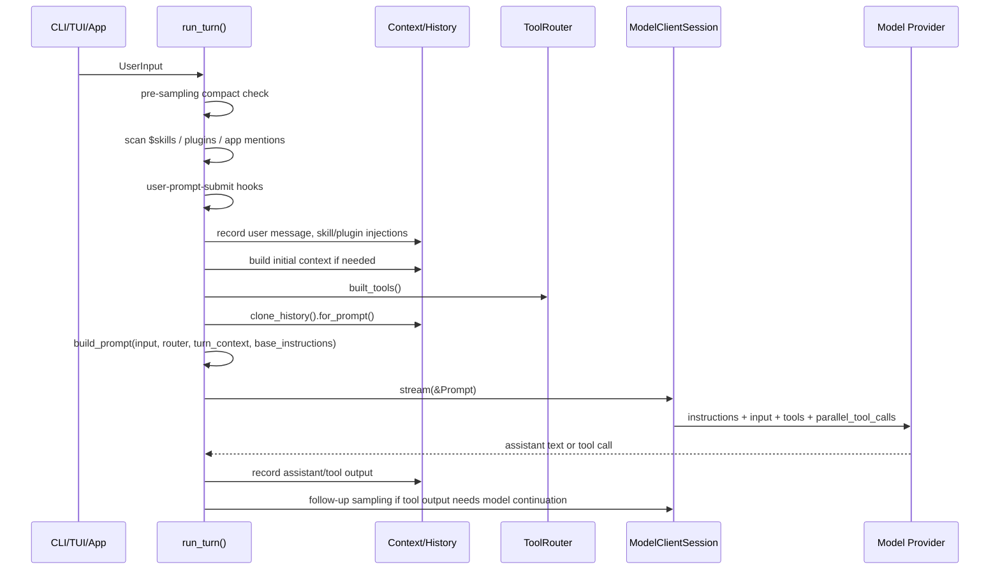

# Prompt 系统：一次请求中的指令、上下文与工具声明

Codex 的 Prompt 系统不应理解为一个独立模板目录，也不应简化成 `build_prompt()` 拼字符串。当前 Rust runtime 里，Prompt 是一次 turn 采样请求的类型化输入编译结果：`base_instructions`、上下文化 user/developer messages、历史、skill/plugin 注入、工具声明和并行工具能力，最终一起进入 Responses/WebSocket 请求。

本章按“一次用户请求”的生命周期说明：哪些提示词在什么节点进入，分别控制什么行为。

**目录**

- [1. 一句话结论](#1-一句话结论)
- [2. 一次请求流：Prompt 在哪里发挥作用](#2-一次请求流prompt-在哪里发挥作用)
- [3. 提示词节点清单](#3-提示词节点清单)
- [4. 最终闭合点：`Prompt` 结构](#4-最终闭合点prompt-结构)
- [5. `AGENTS.md` 与用户指令](#5-agentsmd-与用户指令)
- [6. Skill、Plugin、MCP 与工具声明](#6-skillpluginmcp-与工具声明)
- [7. Compact Prompt：失败前的上下文降级](#7-compact-prompt失败前的上下文降级)
- [8. 与其他系统的对比](#8-与其他系统的对比)
- [9. 代码质量评估](#9-代码质量评估)

---

## 1. 一句话结论

Codex 的 Prompt 系统是 `run_turn()` 内部的请求输入编译层，而不是静态模板系统。它把四类东西收束到同一个 provider request：

| 类别 | 进入位置 | 作用 |
| --- | --- | --- |
| Base instructions | `Prompt.base_instructions` | 作为 Responses API 的 `instructions` 字段，提供最高层运行规则 |
| Contextual messages | `Prompt.input` | 把权限、项目指令、技能内容、用户消息、历史和工具结果排列成模型可见上下文 |
| Tool specs | `Prompt.tools` | 让模型知道本轮可以调用哪些本地、MCP、app、dynamic tools |
| Turn flags | `parallel_tool_calls`、schema/personality | 控制并行工具调用、输出格式、人格等采样参数 |

源码闭合点是 `codex/codex-rs/core/src/session/turn.rs:942` 的 `build_prompt()`，它返回 `Prompt`，而不是一段字符串。`codex/codex-rs/core/src/client.rs:1485` 的 `stream()` 再把这个结构发给 provider。

## 2. 一次请求流：Prompt 在哪里发挥作用

下面以用户输入“帮我修一个测试”为例，不关心具体模型回答，而关心各类 prompt/control text 的注入时机。

关键点在于：Codex 不是在用户输入到达时一次性拼一个大 system prompt，而是在 turn 中逐步把“规则、上下文、能力面、历史”写入不同通道。`run_turn()` 的入口在 `codex/codex-rs/core/src/session/turn.rs:138`；正式采样前会克隆历史并调用 `for_prompt()`，对应 `codex/codex-rs/core/src/session/turn.rs:433` 和 `codex/codex-rs/core/src/context_manager/history.rs:120`。

## 3. 提示词节点清单

| 节点 | 源码锚点 | 进入 Prompt 的形态 | 本轮作用 |
| --- | --- | --- | --- |
| Base instructions | `codex/codex-rs/protocol/src/models.rs:602`, `codex/codex-rs/core/src/session/mod.rs:1115` | `Prompt.base_instructions` | 决定 provider request 的 `instructions` 字段；这是基础行为协议，不等同于项目文档 |
| 权限/沙箱说明 | `codex/codex-rs/core/src/session/mod.rs:2496`, `codex/codex-rs/core/src/context/permissions_instructions.rs:128` | developer message | 告诉模型当前 approval、sandbox、cwd 与执行边界；但真正执行仍由工具 runtime 校验 |
| AGENTS.md / 用户指令 | `codex/codex-rs/core/src/agents_md.rs:115`, `codex/codex-rs/core/src/session/mod.rs:2620`, `codex/codex-rs/core/src/context/user_instructions.rs:9` | contextual user message | 把项目/用户约束放入模型上下文，影响代码风格、命令偏好、协作规则 |
| 可用 Skill 列表 | `codex/codex-rs/core/src/session/mod.rs:2576`, `codex/codex-rs/core/src/session/mod.rs:2590` | developer message | 让模型知道有哪些可被显式触发或隐式调用的 skill；这是目录曝光，不是完整 skill 内容 |
| 显式 Skill 内容 | `codex/codex-rs/core/src/session/turn.rs:220`, `codex/codex-rs/core/src/session/turn.rs:254`, `codex/codex-rs/core/src/session/turn.rs:268` | contextual user message | 用户提到 `$skill` 后，`SKILL.md` 内容被转成模型可见指令，影响本轮执行流程 |
| Plugin / app context | `codex/codex-rs/core/src/session/mod.rs:2603`, `codex/codex-rs/core/src/session/turn.rs:273` | developer/context items | 暴露可用 plugin/app 能力，或把显式 plugin 注入为上下文 |
| User prompt submit hook | `codex/codex-rs/core/src/session/turn.rs:309` | 可追加上下文或停止 turn | 在用户消息记录前后拦截，可增加上下文、阻断或改变后续采样输入 |
| 历史与工具结果 | `codex/codex-rs/core/src/session/turn.rs:433`, `codex/codex-rs/core/src/context_manager/history.rs:120` | `Prompt.input` | 决定模型本轮实际看到哪些旧消息、工具输出和系统上下文 |
| 工具声明 | `codex/codex-rs/core/src/session/turn.rs:1160`, `codex/codex-rs/core/src/session/turn.rs:1249`, `codex/codex-rs/core/src/session/turn.rs:1287` | `Prompt.tools` | 给模型函数/namespace/schema；权限不是由 schema 保证，而是在执行阶段处理 |
| Dynamic tool 过滤 | `codex/codex-rs/core/src/session/turn.rs:948`, `codex/codex-rs/core/src/session/turn.rs:977` | filtered tool specs | 延迟加载的 dynamic tools 可从模型可见工具列表中暂时隐藏 |
| Compact prompt | `codex/codex-rs/core/src/compact.rs:43`, `codex/codex-rs/core/src/compact.rs:73` | 独立 compact turn 的 user prompt | 长会话超限或模型下切时，用摘要替换历史，为下一次正常采样降级 |

这个表比“系统消息 + 工具描述 + 历史”三分法更准确：Codex 的提示词不是只有 system prompt，一个请求会经过 base instructions、developer context、contextual user instructions、tool specs、compact prompt 等多个通道。

## 4. 最终闭合点：`Prompt` 结构

`build_prompt()` 的签名说明了 Codex 的真实抽象边界：

| 字段 | 来源 | 下游影响 |
| --- | --- | --- |
| `input` | `clone_history().for_prompt()` 的结果，包括用户消息、上下文更新、skill/plugin 注入、工具结果 | 成为 Responses/WebSocket request 的 conversation input |
| `tools` | `ToolRouter.model_visible_specs()`，再按 dynamic tool deferral 过滤 | 经 `create_tools_json_for_responses_api()` 变成 provider tools 字段 |
| `parallel_tool_calls` | `turn_context.model_info.supports_parallel_tool_calls` | 映射到请求参数，决定模型能否并行发工具调用 |
| `base_instructions` | session configuration 中的 base instructions | 映射到 provider 的 `instructions` 字段 |
| `personality` / output schema | turn context | 控制人格和最终输出 JSON schema 等附加采样约束 |

相关源码锚点：

- `codex/codex-rs/core/src/session/turn.rs:942` 定义 `build_prompt()`。
- `codex/codex-rs/core/src/session/turn.rs:964` 构造 `Prompt`。
- `codex/codex-rs/core/src/session/turn.rs:967` 写入 `parallel_tool_calls`。
- `codex/codex-rs/core/src/session/turn.rs:968` 写入 `base_instructions`。
- `codex/codex-rs/core/src/client.rs:438` 读取 `prompt.base_instructions.text`。
- `codex/codex-rs/core/src/client.rs:440` 把 `prompt.tools` 转成 Responses API tools JSON。
- `codex/codex-rs/core/src/client.rs:879` 组装 `ResponsesApiRequest`。
- `codex/codex-rs/core/src/client.rs:885` 把 parallel flag 写入请求。

因此，Prompt 的“最终注入点”不是 `AGENTS.md` 读取，也不是工具注册，而是 `Prompt` 被 `client.stream()` 消费的那一刻。

## 5. `AGENTS.md` 与用户指令

Codex 对项目指令的处理分两段：

1. `AgentsMdResolver` 发现、读取并组合配置指令与项目文档。
2. session 构造 initial/context update 时，把结果渲染成 contextual user message。

`codex/codex-rs/core/src/agents_md.rs:37` 定义默认文件名 `AGENTS.md`，`codex/codex-rs/core/src/agents_md.rs:39` 定义本地覆盖文件 `AGENTS.override.md`，`codex/codex-rs/core/src/agents_md.rs:43` 定义配置指令与项目文档之间的分隔符。`codex/codex-rs/core/src/agents_md.rs:100` 会优先检查 override 文件，再检查默认文件。

需要注意两个边界：

- `AGENTS.md` 不是 `base_instructions`。它通常作为 contextual user instructions 进入 `Prompt.input`，而 base instructions 来自协议默认或 session configuration。
- Skill 内容不会简单追加到 `AGENTS.md`。显式 skill 由 turn 中的 mention 扫描和 `build_skill_injections()` 注入；可用 skill 列表则由 initial context 的 developer section 曝光。

这解释了为什么同一条用户请求中会同时存在“项目规则”和“skill 工作流”：前者是长期项目约束，后者是本轮触发的执行规程。

## 6. Skill、Plugin、MCP 与工具声明

Codex 里“提示词让模型知道能力”和“runtime 允许能力执行”是两件事。

### 6.1 Skill 内容是上下文，不是工具 schema

用户输入包含 `$skill` 或结构化 skill mention 时，`codex/codex-rs/core/src/session/turn.rs:220` 收集匹配的 skills，`codex/codex-rs/core/src/session/turn.rs:254` 构造 skill injections，`codex/codex-rs/core/src/session/turn.rs:268` 把它们转成 `ResponseItem`。这些 items 随后被记录到 history，成为本轮 `Prompt.input` 的一部分。

这类 prompt 的作用是改变模型的执行策略，例如要求先做验证、先读某些文件、按某个工作流拆解任务。它不会自动增加 shell 权限，也不会跳过 approval policy。

### 6.2 MCP / app / dynamic tools 是工具声明

工具面由 `built_tools()` 构造。它会读取 MCP 连接、app/connectors、显式启用项、dynamic tools 等，再通过 `ToolRouter::from_config()` 得到模型可见 specs。相关锚点是 `codex/codex-rs/core/src/session/turn.rs:1160`、`codex/codex-rs/core/src/session/turn.rs:1249` 和 `codex/codex-rs/core/src/session/turn.rs:1287`。

这些 specs 进入 `Prompt.tools`。模型可以据此发起 tool call，但 tool call 后还要回到统一 runtime，经过 sandbox、approval、handler、输出截断、历史记录。也就是说：

| 层 | 负责什么 | 不负责什么 |
| --- | --- | --- |
| Prompt tools | 告诉模型“有哪些工具、参数长什么样” | 不批准危险命令 |
| Permission prompt | 告诉模型当前策略和边界 | 不执行策略 |
| Tool runtime | 实际执行、沙箱、审批、错误返回 | 不负责模型如何选择工具 |

这个分层是 Codex Prompt 系统最重要的工程边界。

## 7. Compact Prompt：失败前的上下文降级

Compact 不是普通用户请求的一部分，但它会改变下一次普通请求的 Prompt 输入。

`run_turn()` 开头会做 pre-sampling compact 检查，入口在 `codex/codex-rs/core/src/session/turn.rs:156`。如果历史 token 已达到模型阈值，`codex/codex-rs/core/src/session/turn.rs:726` 会触发 `run_auto_compact()`。采样后如果工具继续执行且上下文达到限制，`codex/codex-rs/core/src/session/turn.rs:490` 会触发 mid-turn compact。

compact 使用专门模板，`codex/codex-rs/core/src/compact.rs:43` 引入 `templates/compact/prompt.md`，`codex/codex-rs/core/src/compact.rs:73` 把 compact prompt 作为合成用户输入发起 compact task。完成后，`codex/codex-rs/core/src/compact.rs:259` 构造 replacement history，`codex/codex-rs/core/src/compact.rs:283` 替换 session history。

所以 compact prompt 的作用不是“指导当前模型回答”，而是把长历史降级成摘要，让下一次 `clone_history().for_prompt()` 仍能形成可发送的 `Prompt.input`。

## 8. 与其他系统的对比

| 维度 | Codex | Claude Code | Gemini CLI | OpenCode |
| --- | --- | --- | --- | --- |
| 最终闭合点 | `Prompt { input, tools, base_instructions, parallel_tool_calls }` | query/request 前的 system/user/tool 输入 | `PromptProvider` 片段进入 `sendMessageStream()` | durable message + `LLM.stream()` |
| 项目指令 | `AGENTS.md` / `AGENTS.override.md` 作为 contextual user instructions | `CLAUDE.md` / memory 更像产品级 prompt 资产 | `GEMINI.md` / settings snippets | command、agent、config prompt 编译为 message parts |
| Skill 注入 | 可用列表 developer section；显式 skill 内容进 history | skill/loaders 更深地影响 agent 工作流 | discover/activate skill 工具化 | config/command/agent prompt 化 |
| 工具边界 | specs 进 `Prompt.tools`，执行回到 runtime approval/sandbox | 工具 prompt 与 permission mode 紧耦合 | tool registry + scheduler | tool schema + durable part 写回 |
| 长上下文降级 | compact prompt 替换 history | compaction / resume | chat compression | session compaction/projection |

横向看，Codex 的特点不是“prompt 文案最多”，而是把 prompt 编译边界做成强类型请求对象。这让章节分析应优先追字段和调用链，而不是追一个想象中的模板拼装函数。

## 9. 代码质量评估

**优点**

- **闭合点清晰**：`Prompt` 结构把输入、工具、base instructions 和采样 flag 明确分开，便于检查哪些内容最终进入 provider request。
- **权限边界没有混入 prompt**：权限说明会提示模型，但真正执行仍由 tool runtime、sandbox、approval policy 约束，降低“模型自觉遵守”的风险。
- **Skill 与 AGENTS.md 分层明确**：项目指令是长期上下文，显式 skill 是本轮上下文；二者不会混成同一个不可追踪字符串。
- **Compact 是显式降级路径**：长会话失败前有 pre-turn/mid-turn compact，且会替换 history，而不是只在请求前盲目裁剪。

**风险与改进点**

- **Prompt 输入分散在多个阶段**：base instructions、initial context、skill injection、tool specs、compact 都在不同模块，读者很容易误以为只有 `build_prompt()` 一处负责。
- **行号级实现易漂移**：`turn.rs` 和 `session/mod.rs` 是大文件，Prompt 相关节点多，后续版本变化时需要重新校验引用。
- **项目指令冲突仍靠模型解释**：`AGENTS.md` 与配置用户指令拼接后，没有结构化冲突解决机制；冲突语义主要由 prompt 内容和模型优先级理解决定。
- **工具声明和执行治理需要联读**：只看 `Prompt.tools` 会高估模型权限；必须同时读工具 runtime、approval、sandbox 章节才能完整理解安全边界。

---

## 关键函数清单

| 函数/类型 | 文件 | 职责 |
| --- | --- | --- |
| `run_turn()` | `codex/codex-rs/core/src/session/turn.rs:138` | 单次用户请求的主循环，串起 compact、hooks、history、tools、sampling、follow-up |
| `build_initial_context()` | `codex/codex-rs/core/src/session/mod.rs:2465` | 构造 developer/contextual user sections，包括权限、skills、apps、plugins、AGENTS.md 等 |
| `AgentsMdResolver::get_user_instructions()` | `codex/codex-rs/core/src/agents_md.rs:115` | 合并配置用户指令与 `AGENTS.md`/override/fallback docs |
| `built_tools()` | `codex/codex-rs/core/src/session/turn.rs:1160` | 构造本轮 tool router，包括 MCP、connectors、dynamic tools |
| `build_prompt()` | `codex/codex-rs/core/src/session/turn.rs:942` | 将 prompt input、tool specs、base instructions、turn flags 收束为 `Prompt` |
| `ModelClientSession::stream()` | `codex/codex-rs/core/src/client.rs:1485` | 消费 `Prompt` 并选择 WebSocket/HTTP Responses API 发起模型请求 |
| `run_inline_auto_compact_task()` | `codex/codex-rs/core/src/compact.rs:66` | 用 compact prompt 生成摘要并替换历史 |
