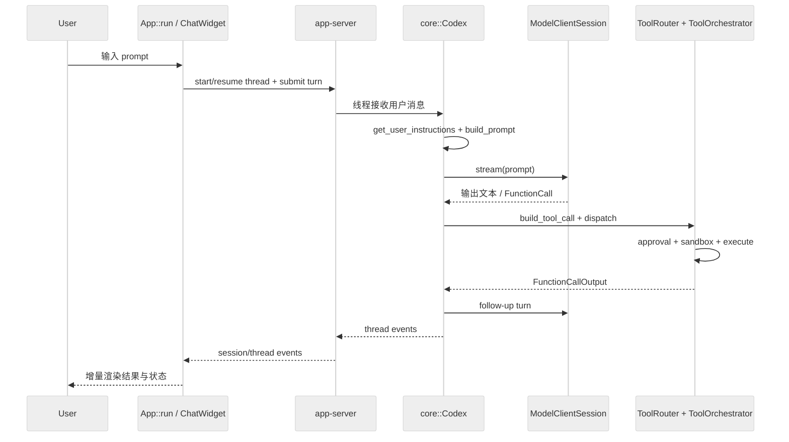

# Codex 项目初始化分析报告

## 目录导航

- [1. 核心价值](#1-核心价值)
- [2. 技术选型](#2-技术选型)
- [3. 目录地图](#3-目录地图)
- [4. 启动链路](#4-启动链路)
- [5. 分层模型](#5-分层模型)
- [6. 核心抽象](#6-核心抽象)
- [7. 设计模式](#7-设计模式)
- [8. 并发与状态管理](#8-并发与状态管理)
- [9. 请求生命周期](#9-请求生命周期)
- [10. 工程健壮性专项分析](#10-工程健壮性专项分析)
- [11. 代码质量评估](#11-代码质量评估)

## 1. 核心价值

Codex CLI 的核心目标不是“再做一个聊天终端”，而是把本地代码仓库、模型推理、工具执行、审批/沙箱、安全边界和 TUI 反馈整合成一个可持续运行的编码代理系统。它解决的是三类问题：

1. 把自然语言请求转成可执行的工程动作。
2. 在本地执行 `shell`、`apply_patch`、MCP、子代理等工具时维持可审计的权限边界。
3. 在长会话、多线程、恢复/分叉、UI 渲染之间保持一致的状态模型。

## 2. 技术选型

| 维度 | 选型 | 角色 |
| --- | --- | --- |
| 主语言 | Rust | 主运行时，承载 CLI、TUI、app-server、core、state、sandbox |
| 包装层 | Node.js | `codex-cli/bin/codex.js` 负责跨平台分发、PATH 注入、启动原生二进制 |
| 异步运行时 | Tokio | 线程事件、模型流式响应、工具执行、app-server RPC |
| TUI | `ratatui` + `crossterm` | 终端 UI、事件循环、绘制和交互 |
| Web/API | `axum`、`reqwest`、WebSocket/SSE | app-server 对外协议、模型 API 连接 |
| 持久化 | SQLite + `sqlx` | 线程元数据、日志、回放、动态工具等状态 |
| 协议扩展 | MCP (`rmcp`) | 外部工具、资源、Apps/Connector 集成 |
| 构建/测试 | Cargo、Bazel、Just | 本地开发、CI、测试、发布 |

相关入口命令集中在仓库根的 `justfile`，例如 `just codex`、`just exec`、`just test`、`just mcp-server-run`。

## 3. 目录地图

这里最值得先读的不是顶层目录，而是实际承载运行链路的 5 个核心目录：

| 目录 | 作用 |
| --- | --- |
| `codex-rs/cli` | 命令行参数解析、子命令分发、进入 TUI 或 Exec 模式 |
| `codex-rs/tui` | TUI 初始化、事件循环、会话切换、UI 更新 |
| `codex-rs/app-server` | 统一 RPC 层，向 TUI 暴露线程/配置/事件接口 |
| `codex-rs/core` | Agent 核心，含 Prompt 构建、模型调用、工具路由、线程生命周期 |
| `codex-rs/state` | SQLite 状态与日志存储，支撑恢复、历史、审计 |

补充目录：

- `codex-cli`：npm 安装后的 JS 包装入口。
- `sdk`：对 app-server 的 SDK 封装，不在主 CLI 热路径上。
- `docs`：安装、贡献、用户文档。

## 4. 启动链路

严格说有两层入口：

1. 分发入口：`codex-cli/bin/codex.js`
2. 真实业务入口：`codex-rs/cli/src/main.rs::main`

如果从源码运行，唯一业务入口就是 Rust 的 `main()`。npm 层只是找到正确平台二进制再 `spawn`。

### 初始化顺序

```mermaid
%%{init: {'theme': 'neutral'}}%%
flowchart LR
    A[codex-cli/bin/codex.js] --> B[codex-rs/cli::main]
    B --> C[cli_main 解析子命令]
    C --> D[run_interactive_tui]
    D --> E[tui::run_main]
    E --> F[启动内嵌或远程 app-server]
    F --> G[App::run]
    G --> H[app_server.bootstrap]
    H --> I[start/resume/fork thread]
    I --> J[ChatWidget + 主事件循环]
```

### 关键函数清单

| 模块 | 关键函数 | 作用 |
| --- | --- | --- |
| `codex-rs/cli/src/main.rs` | `main` | 总入口，先做 `arg0` 分派 |
| `codex-rs/cli/src/main.rs` | `cli_main` | 解析 `MultitoolCli`，决定进入哪种子命令 |
| `codex-rs/cli/src/main.rs` | `run_interactive_tui` | 规范化 prompt、加载认证、进入 TUI |
| `codex-rs/tui/src/lib.rs` | `run_main` | 组装 config、启动 app-server、准备 UI 环境 |
| `codex-rs/tui/src/app.rs` | `App::run` | bootstrap、线程创建/恢复、事件主循环 |

## 5. 分层模型

Codex 的分层非常清晰，可以概括为：

`CLI 包装层 -> TUI 编排层 -> App Server 会话层 -> Core Agent 层 -> Tool/Sandbox 执行层 -> State 持久化层`

具体对应关系：

- CLI 包装层：`codex-cli`、`codex-rs/cli`
- TUI 编排层：`codex-rs/tui`
- 会话/RPC 层：`codex-rs/app-server`
- Agent 核心层：`codex-rs/core`
- 执行与权限层：`codex-rs/core/src/tools/*`、`codex-rs/sandboxing`
- 持久化层：`codex-rs/state`

这种结构把“交互”和“执行”拆得比较彻底，所以同一套 core 可以被 TUI、exec 模式和 app-server 复用。

## 6. 核心抽象

### 6.1 ThreadManager / CodexThread

`ThreadManager` 是线程生命周期总控，负责新建、恢复、分叉、订阅创建事件，并持有模型、MCP、技能、插件、环境等管理器。真正的线程实例由 `Codex::spawn(...)` 创建，之后包装成 `CodexThread`。

关键函数清单：

- `codex-rs/core/src/thread_manager.rs::ThreadManager::new`
- `codex-rs/core/src/thread_manager.rs::spawn_new_thread`
- `codex-rs/core/src/thread_manager.rs::resume_thread_from_rollout_with_source`
- `codex-rs/core/src/thread_manager.rs::spawn_thread_with_source`

### 6.2 ModelClient / ModelClientSession

这一对抽象把“会话级 API 状态”和“单轮流式请求状态”分开。前者缓存认证和 provider，后者缓存 WebSocket 会话、turn-state 和本轮重试/回退状态。

关键函数清单：

- `codex-rs/core/src/client.rs::ModelClient::new_session`
- `codex-rs/core/src/client.rs::ModelClientSession::stream`
- `codex-rs/core/src/client.rs::stream_responses_websocket`
- `codex-rs/core/src/client.rs::stream_responses_api`
- `codex-rs/core/src/client.rs::handle_unauthorized`

### 6.3 ToolRouter / ToolRegistry / ToolOrchestrator

这组抽象完成三件事：注册工具、把模型输出解析成工具调用、在审批与沙箱下执行工具。它们让工具执行与模型推理解耦。

关键函数清单：

- `codex-rs/core/src/tools/spec.rs::build_specs_with_discoverable_tools`
- `codex-rs/core/src/tools/router.rs::ToolRouter::from_config`
- `codex-rs/core/src/tools/router.rs::build_tool_call`
- `codex-rs/core/src/tools/router.rs::dispatch_tool_call_with_code_mode_result`
- `codex-rs/core/src/tools/orchestrator.rs::ToolOrchestrator::run`

### 6.4 MessageProcessor

`app-server` 并不直接耦合 TUI，而是通过 `MessageProcessor` 和 `CodexMessageProcessor` 统一处理配置、线程、认证、文件、事件订阅等 RPC 请求。

关键函数清单：

- `codex-rs/app-server/src/in_process.rs::start`
- `codex-rs/app-server/src/in_process.rs::start_uninitialized`
- `codex-rs/app-server/src/message_processor.rs::MessageProcessor::new`
- `codex-rs/app-server/src/codex_message_processor.rs::ensure_conversation_listener`
- `codex-rs/app-server/src/codex_message_processor.rs::ensure_listener_task_running_task`

## 7. 设计模式

### 7.1 Registry + Strategy

`build_specs_with_discoverable_tools(...)` 先生成可见 spec，再根据 `ToolHandlerKind` 注册不同 handler。工具本身通过 handler 策略对象切换，新增工具不需要修改推理主循环。

### 7.2 Orchestrator

`ToolOrchestrator::run(...)` 把“审批 -> 选沙箱 -> 执行 -> 按需升级重试”封装成统一流程，避免每个工具重复写权限逻辑。

### 7.3 Reactor / Event Loop

`App::run(...)` 用 `tokio::select!` 同时监听 UI 事件、线程事件、app-server 事件和内部 app 事件，是标准的 reactor 风格。

### 7.4 Adapter

`app-server` 的 in-process client 把本地 core 线程适配成统一 RPC 接口，使内嵌模式和远程模式共享同一套会话协议。

## 8. 并发与状态管理

并发模型以 Tokio 为核心，状态模型则是“内存索引 + SQLite 持久化”的双层结构。

- 线程表：`ThreadManagerState` 使用 `Arc<RwLock<HashMap<ThreadId, Arc<CodexThread>>>>`
- 事件广播：线程创建使用 `broadcast::channel`
- UI 主循环：`App::run` 中的 `select!`
- 模型长连接：优先 WebSocket，失败回退 HTTPS Responses API
- 数据持久化：`StateRuntime` 初始化 state db 与 logs db，使用 WAL、`busy_timeout`、增量 vacuum

`StateRuntime::init(...)` 还把日志库单独拆出去，降低日志写入和状态读写之间的锁竞争，这个设计很实用。

## 9. 请求生命周期

### 9.1 用户输入解析

CLI 参数在 `cli_main()` 完成第一轮分派；交互模式下 `run_interactive_tui()` 负责把命令行 prompt、image、审批策略、sandbox 策略等转成 TUI 启动参数。真正的会话创建发生在 `App::run()` 里，通过 `app_server.start_thread / resume_thread / fork_thread` 打开主线程。

### 9.2 Agent 决策链

Prompt 构建和模型调用都在 `codex-rs/core/src/codex.rs`。

- `get_user_instructions(...)` 会读取层级 `AGENTS.md`，并受字节预算限制
- `build_prompt(...)` 组合输入消息、可见工具、base instructions、personality、输出 schema
- `run_sampling_request(...)` 构建工具路由、启动 code mode worker、调用 `ModelClientSession::stream(...)`

这里一个很关键的细节是：延迟加载的 dynamic tools 不会直接塞进模型可见工具列表，先控制 prompt 体积，再按需启用。

### 9.3 Tool Use 机制、权限控制与执行闭环

模型返回的 `ResponseItem` 先由 `ToolRouter::build_tool_call(...)` 解析成 `ToolCall`。随后 `handle_output_item_done(...)` 记录事件并把工具调用放入异步 future。真正执行时：

1. `ToolRouter::dispatch_tool_call_with_code_mode_result(...)` 找到对应 handler
2. `ShellHandler::run_exec_like(...)` 或其他 handler 组装请求
3. `ToolOrchestrator::run(...)` 先判断 `ExecApprovalRequirement`
4. 选择首个 sandbox，执行工具
5. 若因沙箱拒绝且策略允许，则走升级重试
6. 结果通过 `FunctionCallOutput` 回注到后续模型轮次

`ShellHandler::run_exec_like(...)` 里还能看到两个重要安全钩子：

- `normalize_and_validate_additional_permissions(...)`：规范化并校验附加权限
- `intercept_apply_patch(...)`：把 shell 中的 `apply_patch` 拦截成受控内建工具，而不是裸命令执行

### 9.4 结果回传与 UI 更新

模型流中的非工具输出和工具输出最终都会走回线程事件，再由 app-server 订阅机制推给 TUI。`CodexMessageProcessor::ensure_listener_task_running_task(...)` 会为线程建立持续监听，把新事件广播给已订阅连接；`App::run(...)` 的主循环消费这些事件并刷新 `ChatWidget`。

### 9.5 生命周期顺序图

## 10. 工程健壮性专项分析

### 10.1 错误处理机制

`codex-rs/core/src/error.rs` 定义了统一错误枚举 `CodexErr`，并通过 `is_retryable()` 明确区分“可自动重试”和“应立即失败”的错误。

关键点：

- 流式断连对应 `CodexErr::Stream`，会自动退避重试
- WebSocket 重试耗尽后，会回退到 HTTPS transport
- 401 会触发 `handle_unauthorized(...)` 尝试刷新凭证
- UI 展示错误时使用 `get_error_message_ui(...)` 做长度裁剪，避免终端刷爆

### 10.2 安全性分析

安全控制主要集中在工具执行链路：

- sandbox 模式可区分只读、工作区可写、危险全访问
- 审批策略通过 `AskForApproval` 控制何时需要人工/自动 reviewer 批准
- 显式提权在非 `OnRequest` 模式下会被拒绝
- `workdir` 解析基于 turn context，而不是直接信任模型传参
- `apply_patch` 被专门拦截，避免变成任意 shell 修改
- `app-server` 启动阶段还会做 Windows world-writable 目录风险提示

如果要回答“如何防止敏感文件泄露”，更准确的说法是：它不是靠单点过滤完成，而是靠“工具白名单 + 工作目录解析 + 文件系统沙箱 + 审批链”多层约束实现。

### 10.3 性能优化

当前实现比较成熟，优化点很具体：

- WebSocket 优先，失败才退 HTTPS，兼顾低延迟和鲁棒性
- 模型输出流式消费，`OutputTextDelta` 级别更新 UI
- dynamic tools 支持延迟加载，减少 prompt 膨胀
- SQLite 使用 WAL、增量 vacuum、日志库拆分，减少竞争
- app-server 对线程监听是按需建立，不是全量轮询

### 10.4 扩展性：新增 MCP tool 要改哪些文件

分两种情况：

#### 情况 A：新增“外部 MCP server 暴露的工具”

通常不需要改 core 主链路。原因是：

- `ToolRouter::build_tool_call(...)` 已能识别 namespaced MCP tool
- `build_specs_with_discoverable_tools(...)` 会把 MCP tools 纳入注册计划
- `McpHandler` 已是通用处理器

这时主要工作是：

1. 让新的 server/tool 出现在 MCP 配置或插件发现结果里。
2. 确认 tool schema 能被 `rmcp` 和 tool registry 正常发现。
3. 若是 Apps/Connector 工具，检查启用条件和 connector 过滤逻辑。

#### 情况 B：新增“Codex 内建的一类新工具”

需要改这些核心位置：

1. `codex-rs/core/src/tools/handlers/*`
2. `codex-rs/core/src/tools/spec.rs`
3. `codex-rs/core/src/tools/router.rs`
4. 必要时修改协议参数类型所在的 `codex_protocol`
5. 若涉及新审批/沙箱语义，还要改 `tools/orchestrator.rs` 或对应 runtime

## 11. 代码质量评估

### 优点

- 架构边界清楚，CLI、TUI、app-server、core、state 分层自然。
- 工具执行链条抽象完整，审批、沙箱、重试没有散落在各 handler 中。
- 对长会话和恢复/分叉支持较成熟，线程模型统一。
- 错误处理不是简单 `anyhow` 透传，而是做了可重试分类和用户可读映射。

### 风险与改进点

- `core/src/codex.rs` 和 `tui/src/app.rs` 都偏大，主流程清晰但局部维护成本高。
- app-server 与 core 间的事件类型和状态机较多，新人上手成本不低。
- 工具/审批/权限相关 feature flag 很强大，但组合复杂，测试矩阵会快速膨胀。
- “内建工具”和“MCP 工具”的扩展路径并不完全一致，文档仍可再统一。

### 综合判断

这是一个工程化程度很高的本地代理系统。其优势不在单个算法点，而在把模型流、工具系统、审批、安全和 UI 事件流收敛成了一个一致的运行时。真正的复杂度集中在 `core` 和 `tui/app-server` 交界处；如果后续要继续扩展，最值得优先治理的是超大文件拆分与权限组合测试覆盖。
