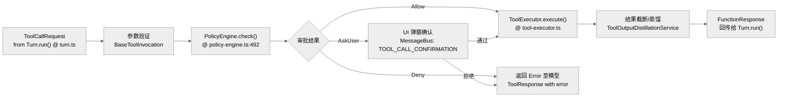

# 工具调用机制：Tool 注册、权限策略与执行闭环

工具系统（Tool System）是 Gemini CLI 具备实际行动能力的核心。它通过一整套安全策略和调度框架，将 LLM 的决策转化为本地代码执行。

**目录**

- [1. 核心抽象与角色（含源码行号）](#1-核心抽象与角色含源码行号)
- [2. 工具注册与发现 (Discovery)](#2-工具注册与发现-discovery)
- [3. 工具执行流水线 (Pipeline)](#3-工具执行流水线-pipeline)
- [4. 权限策略 (Tool Policy) 的实现](#4-权限策略-tool-policy-的实现)
- [5. 关键机制：输出截断与蒸馏](#5-关键机制输出截断与蒸馏)
- [6. 关键函数清单](#6-关键函数清单)
- [7. 代码质量评估 (Code Quality Assessment)](#7-代码质量评估-code-quality-assessment)

---

## 1. 核心抽象与角色（含源码行号）

| 角色 | 代码路径 | 关键方法 | 行号 | 职责 |
| :---| :---| :---| :---| :---|
| **ToolRegistry** | `sources/gemini-cli/packages/core/src/tools/tool-registry.ts` | `discoverAllTools()` | 352 | 工具发现与注册 |
| **ToolRegistry** | `sources/gemini-cli/packages/core/src/tools/tool-registry.ts` | `getFunctionDeclarations()` | 635 | 导出 JSON Schema 给模型 |
| **PolicyEngine** | `sources/gemini-cli/packages/core/src/policy/policy-engine.ts` | `check()` / `checkShellCommand()` | 492 / 336 | 风险评估与 Shell 命令规则决策 |
| **Scheduler** | `sources/gemini-cli/packages/core/src/scheduler/scheduler.ts` | `schedule()` / `_execute()` | 191 / 699 | 工具调用编排入口与单工具执行状态推进 |
| **ToolExecutor** | `sources/gemini-cli/packages/core/src/scheduler/tool-executor.ts` | `execute()` | 60 | 实际执行、错误归一化、输出后处理 |
| **DiscoveredToolInvocation** | `sources/gemini-cli/packages/core/src/tools/tool-registry.ts` | `execute()` | 59 | 命令工具的子进程执行 |

## 2. 工具注册与发现 (Discovery)

系统启动时，`Config` 会调用 `ToolRegistry.discoverAllTools()`。

- **内建工具**：如 `grep_search`、`read_file`、`run_shell_command`。
- **命令工具 (Command Tools)**：基于特定脚本发现的工具。
- **MCP 工具**：从配置的 MCP Server（通过 `McpClientManager`）动态加载的工具。

模型在 `getFunctionDeclarations()`（`sources/gemini-cli/packages/core/src/tools/tool-registry.ts:635`）阶段看到这些工具的 JSON Schema 定义。注册阶段不是单纯扫描目录：`ToolRegistry.registerTool()`（`sources/gemini-cli/packages/core/src/tools/tool-registry.ts:269`）把内建工具、命令工具和 MCP 工具放入同一张注册表，后续 Scheduler 不需要关心工具来源。

## 3. 工具执行流水线 (Pipeline)

一个工具调用的生命周期遵循以下严格步骤：

## 4. 权限策略 (Tool Policy) 的实现

`PolicyEngine.checkShellCommand()` 是最核心的安全防御点。

- **静态规则**：根据工具名和参数（如 Shell 命令中的关键词）进行正则匹配。
- **模式分支**：
  - `YOLO`：全自动执行，无需用户确认。
  - `AUTO_EDIT`：对文件修改操作自动确认，但敏感命令仍需确认。
  - `INTERACTIVE`：默认模式，高风险操作必须用户通过 TUI 确认。
- **安全检查器 (Checkers)**：例如检查是否尝试修改敏感系统文件或环境变量。

## 5. 关键机制：输出截断与蒸馏

当工具输出过大（超过 Token 限制）时，`ToolExecutor` 会触发保护机制：

- **截断 (Truncation)**：保留头部和尾部，中间部分用占位符替代，并将完整输出保存至临时文件。
- **蒸馏 (Distillation)**：调用 `ToolOutputDistillationService` 利用模型对输出进行摘要压缩。
- **历史遮罩 (Masking)**：`ToolOutputMaskingService` 会在上下文重建阶段把已完成工具输出替换为更短的可追溯摘要，避免长会话里旧工具结果持续挤压窗口。

## 6. 关键函数清单

| 函数/类 | 源码锚点 | 作用 |
| :---| :---| :---|
| `ToolRegistry.registerTool()` | `sources/gemini-cli/packages/core/src/tools/tool-registry.ts:269` | 将工具实例写入注册表，是内建工具、发现工具、MCP 工具的共同入口 |
| `ToolRegistry.discoverAllTools()` | `sources/gemini-cli/packages/core/src/tools/tool-registry.ts:352` | 执行命令工具、MCP 工具等动态发现 |
| `ToolRegistry.getFunctionDeclarations()` | `sources/gemini-cli/packages/core/src/tools/tool-registry.ts:635` | 生成模型可见的函数声明 |
| `Scheduler.schedule()` | `sources/gemini-cli/packages/core/src/scheduler/scheduler.ts:191` | 接收模型产生的工具调用请求并进入调度队列 |
| `Scheduler._execute()` | `sources/gemini-cli/packages/core/src/scheduler/scheduler.ts:699` | 单个工具调用的审批、执行、结果状态推进 |
| `ToolExecutor.execute()` | `sources/gemini-cli/packages/core/src/scheduler/tool-executor.ts:60` | 调用工具实现并把异常、输出、metadata 归一成 completed call |
| `PolicyEngine.check()` | `sources/gemini-cli/packages/core/src/policy/policy-engine.ts:492` | 对工具名、参数、approval mode 和 policy 规则做统一决策 |
| `ToolOutputDistillationService` | `sources/gemini-cli/packages/core/src/context/toolDistillationService.ts:39` | 对超长工具输出做截断/摘要并记录遥测 |
| `ToolOutputMaskingService` | `sources/gemini-cli/packages/core/src/context/toolOutputMaskingService.ts:69` | 在上下文管线中遮罩旧工具输出，控制历史 token 增长 |

## 7. 代码质量评估 (Code Quality Assessment)

### 7.1 优点

- **PolicyEngine 策略可扩展**：规则以插件形式注册，新增规则只需实现 `Rule` 接口，无需修改核心逻辑。
- **Scheduler 与 Policy 解耦**：`Scheduler` 通过 `checkPolicy()` 调用 Policy，结果不影响 Scheduler 自身状态。

### 7.2 改进点

- **`DiscoveredToolInvocation.execute()` 使用子进程 `spawn`**：`sources/gemini-cli/packages/core/src/tools/tool-registry.ts:59` 通过子进程执行命令工具，存在参数边界风险，尽管 PolicyEngine 会预检，但建议对参数做二次结构化校验。

## 8. 横向对齐补强：Gemini 的工具闭环是“流后调度”

和 Claude Code 的流式工具执行、OpenCode 的 durable part 写回不同，Gemini CLI 的核心特征是模型流先由 `Turn.run()` 拆成事件，工具请求随后进入 `Scheduler`，完成后再作为 continuation 回注。

| 阶段 | 源码入口 | 作用 |
| --- | --- | --- |
| 工具注册 | `sources/gemini-cli/packages/core/src/tools/tool-registry.ts` | 注册内建、发现型和 MCP 工具 |
| 策略判断 | `sources/gemini-cli/packages/core/src/policy/policy-engine.ts` | 对 shell/tool 调用做 allow/deny/confirm |
| 调度执行 | `sources/gemini-cli/packages/core/src/scheduler/scheduler.ts` | 管理确认、执行、结果状态 |
| 策略适配 | `sources/gemini-cli/packages/core/src/scheduler/policy.ts` | 将 scheduler 请求转给 PolicyEngine |
| 回注模型 | `sources/gemini-cli/packages/cli/src/ui/hooks/useGeminiStream.ts` | 完成工具后触发 continuation |

横向读本章时，应优先关注 Scheduler 三阶段，而不是只看 ToolRegistry。ToolRegistry 解决“有哪些工具”，Scheduler 才解决“什么时候、以什么权限、如何执行并回注”。

- **工具发现链路复杂**：`discoverAllTools()` 涉及文件系统扫描、MCPServer 连接、Shell 命令探测多个阶段，启动时延影响明显。
- **输出蒸馏缺少基准**：未验证蒸馏后的压缩率与语义保真度，生产环境可能出现信息丢失。

## 源码锚点补强：工具闭环要同时看 Registry、Scheduler 和 UI 回注

| 源码位置 | 说明 | 横向意义 |
| --- | --- | --- |
| `sources/gemini-cli/packages/core/src/tools/tool-registry.ts:229` | `ToolRegistry` 主类 | 对应 Claude/OpenCode registry |
| `sources/gemini-cli/packages/core/src/tools/tool-registry.ts:269` | `registerTool()` 统一注册入口 | 内建、发现型、MCP 工具汇聚点 |
| `sources/gemini-cli/packages/core/src/tools/tool-registry.ts:635` | `getFunctionDeclarations()` 暴露给模型 | 对应 Prompt/模型请求工具声明 |
| `sources/gemini-cli/packages/core/src/scheduler/scheduler.ts:191` | `Scheduler.schedule()` 工具请求入口 | 对应 Codex orchestrator |
| `sources/gemini-cli/packages/core/src/scheduler/scheduler.ts:699` | `_execute()` 执行、审批和结果推进 | 对应 OpenCode tool part 状态机 |
| `sources/gemini-cli/packages/cli/src/ui/hooks/useGeminiStream.ts:1822` | 完成工具后回注 continuation | Gemini 工具闭环的 UI 侧关键点 |

---

> 关联阅读：[06-extension-mcp.md](./06-extension-mcp.md) 了解如何通过 MCP 扩展新的工具。
