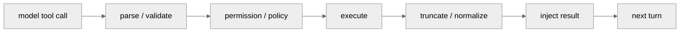

<!-- markdownlint-disable MD060, MD024 -->

# 工具治理横向对比

对应项目章节：

- `hello-claude-code/05-tool-system.md`
- `hello-codex/05-tool-system.md`
- `hello-gemini-cli/05-tool-system.md`
- `hello-opencode/05-tool-system.md`

## 1. 一句话结论

| 项目 | 工具治理模型 |
| --- | --- |
| Claude Code | 工具协议、权限 hook、批处理/流式执行紧耦合在 `query()` 主链路旁 |
| Codex | Rust runtime 中央化治理，approval、sandbox、tool output 截断都在运行时闭环内 |
| Gemini CLI | ToolRegistry + Scheduler + PolicyEngine，模型流结束后批量调度工具 |
| OpenCode | ToolRegistry + Permission + Durable Part，工具状态是持久历史的一部分 |

## 2. 生命周期对比

四个项目都符合这条闭环，但差异在控制点的位置：

| 控制点 | Claude | Codex | Gemini | OpenCode |
| --- | --- | --- | --- | --- |
| 工具声明 | prompt/tool schema 侧 | Rust tool spec | ToolRegistry | ToolRegistry/tools |
| 权限判定 | hook + permission context | approval policy + sandbox | PolicyEngine + scheduler | Permission rule + persisted approval |
| 并发模型 | 支持批次和 streaming executor | futures/turn loop 内控制 | Scheduler 批量调度 | Session loop + durable part |
| 结果归一 | tool_result message | ToolOutput/截断策略 | ToolResult/蒸馏 | part 状态写回 |
| 安全边界 | 反编译快照需谨慎确认 | 最强，sandbox 是核心设计 | policy 清楚但执行仍依赖工具实现 | durable 可审计，交互阻塞成本较高 |

## 3. 代表源码证据

| 项目 | Registry / Schema | Permission / Policy | Execution / Result |
| --- | --- | --- | --- |
| Claude Code | `claude-code/src/Tool.ts:123`, `claude-code/src/tools.ts` | `claude-code/src/hooks/useCanUseTool.tsx`, `claude-code/src/services/tools/toolOrchestration.ts` | `claude-code/src/services/tools/toolExecution.ts`, `claude-code/src/services/tools/StreamingToolExecutor.ts` |
| Codex | `codex/codex-rs/core/src/tools/spec.rs:32` | `codex/codex-rs/core/src/tools/orchestrator.rs:111`, `codex/codex-rs/core/src/exec_policy.rs:234` | `codex/codex-rs/core/src/tools/handlers/unified_exec.rs:170` |
| Gemini CLI | `gemini-cli/packages/core/src/tools/tool-registry.ts:352` | `gemini-cli/packages/core/src/policy/policy-engine.ts` | `gemini-cli/packages/core/src/scheduler/scheduler.ts:191`, `gemini-cli/packages/core/src/scheduler/tool-executor.ts:60` |
| OpenCode | `opencode/packages/opencode/src/tool/registry.ts:36` | `opencode/packages/opencode/src/permission/evaluate.ts:9`, `opencode/packages/opencode/src/permission/index.ts:166` | `opencode/packages/opencode/src/session/index.ts:423` |

## 4. 文档完善要求

每个项目的 `05-tool-system.md` 应固定包含五段：

1. 工具来源：内建、MCP、plugin、skill、custom command。
2. 权限入口：谁做 allow/deny/ask，审批结果是否持久化。
3. 执行模型：串行、并行、批处理、流式执行。
4. 结果回注：如何回到 message/history/part/thread item。
5. 风险点：sandbox 缺口、参数校验、输出截断、权限缓存。

## 5. 合并后的读法

选安全治理优先看 Codex；选可审计 durable history 看 OpenCode；选 prompt/tool 深度编排看 Claude Code；选轻量 TypeScript monorepo 和 policy 可读性看 Gemini CLI。

## 6. 深度对齐矩阵

工具治理横向阅读时，不能只比较“有没有工具”。更稳定的比较单位是一次 tool call 的五个阶段：声明、选择、审批、执行、回注。

| 阶段 | Claude Code | Codex | Gemini CLI | OpenCode |
| --- | --- | --- | --- | --- |
| 声明 | `Tool` 对象携带 schema、prompt、并发能力和权限元信息 | Rust tool spec 进入 `Prompt.tools`，由 runtime 统一暴露 | `ToolRegistry` 汇总内建、MCP、扩展工具，再导出 function declaration | `ToolRegistry.tools()` 汇总内建、MCP、plugin/custom tool |
| 选择 | 模型在 `query()` 流内产出 tool_use block | Responses/WebSocket stream 产出 tool call item | `Turn.run()` 解析 Gemini stream，再交 Scheduler | AI SDK `streamText()` 产出 tool-call 事件 |
| 审批 | `useCanUseTool`、hook、permission context 共同判断 | approval policy、sandbox policy、PermissionRequest hook 共同判断 | `MessageBus.publish()` 先走 `PolicyEngine.check()`，再决定 allow/deny/ask | 工具 context 内 `Permission.ask()`，批准规则可持久化到 `PermissionTable` |
| 执行 | `runTools()` 批处理或 `StreamingToolExecutor` 流水线执行 | `ToolRouter` / handler / runtime 执行，shell 路径可进入 sandbox | `Scheduler` 三阶段队列 + `ToolExecutor` 包装单次调用 | AI SDK 调用 tool `execute()`，processor 把状态写 durable part |
| 回注 | tool result 拼入下一轮 `messages` | function call output 记录为 thread/history item | `handleCompletedTools()` 把结果作为 continuation 再提交 | `Session.updatePart()` 写 SQLite，下一轮从 durable history 重建 |

这张表也给项目章节设置了最低门槛：每个 `05-tool-system.md` 至少要能把一个工具调用从“模型看见 schema”追到“下一轮模型重新看见结果”。只列工具清单不算完整工具系统分析。

## 7. 风险分层

| 风险 | Claude Code | Codex | Gemini CLI | OpenCode |
| --- | --- | --- | --- | --- |
| 权限漂移 | hook、settings、plugin、skill 都可能改变工具可用性，需标注来源 | 中央 runtime 强，但 handler 多，需关注 policy 到 runtime 的传递 | PolicyEngine 清楚，但 UI 确认和 Scheduler 状态分离 | durable approval 可审计，但第三方 plugin/custom tool 信任边界更高 |
| 并发误判 | `isConcurrencySafe()` 判断错误会让写操作并发 | `supports_parallel` 或锁策略错误会破坏顺序 | 模型侧 `wait_for_previous` 语义依赖模型正确表达 | AI SDK 调度抽象隐藏了部分并发细节 |
| 输出污染 | 大 tool result 可能压垮 prompt，依赖预算/compact | tool output 归一化和截断需跟 prompt 编译联读 | distillation/masking 可降低 token 压力，但改变可见内容 | part 最终快照可恢复，delta 丢失时需靠 updated event 补齐 |
| 安全审计 | 反编译快照要分清源码确认与推断 | sandbox 是强项，应优先验证 exec/apply_patch 路径 | policy 可读性好，但工具实现仍需逐个看 | server/API 面宽，需同时审 HTTP auth、permission 和 Bus/SSE |

## 8. 维护补强顺序

项目章继续维护时按这个顺序最稳：

1. 先补 `05-tool-system.md` 的单次 tool call 时序。
2. 再补 `07-error-security.md` 的失败与拒绝路径。
3. 再补 `16-resilience.md` 的重试、回滚、继续同一 turn 的边界。
4. 最后把 MCP/plugin/skill 的工具来源回链到 `06/13/14/24`，避免在 `05` 里展开所有扩展机制。
