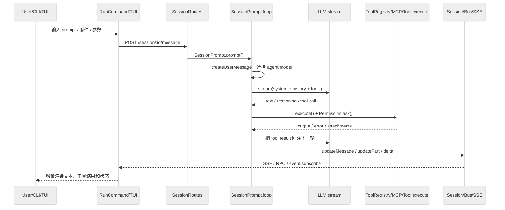

# OpenCode 项目初始化分析报告

## 目录导航

- [1. 核心价值](#1-核心价值)
- [2. 技术选型](#2-技术选型)
- [3. 目录地图](#3-目录地图)
- [4. 启动链路](#4-启动链路)
- [5. 分层模型](#5-分层模型)
- [6. 核心抽象](#6-核心抽象)
- [7. 设计模式](#7-设计模式)
- [8. 并发与状态管理](#8-并发与状态管理)
- [9. 请求生命周期](#9-请求生命周期)
- [10. 工程健壮性专项分析](#10-工程健壮性专项分析)
- [11. 代码质量评估](#11-代码质量评估)

## 1. 核心价值

OpenCode 的核心不是“再做一个 CLI 聊天壳”，而是把本地编码代理拆成一套可复用运行时：

1. 用统一的会话模型承载自然语言请求、工具调用、推理结果和文件变更。
2. 用 client/server 架构同时服务 CLI、TUI、Web、Desktop、ACP 等前端。
3. 在 provider、MCP、插件、技能、LSP、持久化状态之间维持一致的执行闭环。

从代码看，仓库的真正价值在 `packages/opencode`：这里既是 API server，也是 agent runtime。`packages/console/app`、`packages/app` 等客户端只是它的不同视图。

## 2. 技术选型

| 维度 | 选型 | 作用 |
| --- | --- | --- |
| 主语言/运行时 | TypeScript + Bun/Node | 主运行时；CLI、服务端、会话循环、工具系统都在 TS 中实现 |
| Monorepo | Bun workspaces + Turbo | 管理 `packages/*` 多包结构 |
| HTTP/API | Hono + hono-openapi + Bun.serve | 暴露 REST、SSE、WebSocket 接口 |
| AI 编排 | `ai` SDK +大量 provider adapter | 统一 Anthropic/OpenAI/Gemini/GitHub Copilot 等模型调用 |
| 本地 UI | Solid + `@opentui/*` | 终端 TUI 的组件、路由和状态同步 |
| 持久化 | SQLite + Drizzle ORM | 保存 session、message、part、todo、permission |
| 协议扩展 | MCP SDK | 外部 tools、prompts、resources、OAuth 接入 |
| 工程能力 | LSP、文件监听、快照、插件系统 | 支撑编辑后诊断、diff、事件广播与二次扩展 |

## 3. 目录地图

以下 Top 5 指的是主运行链路最值得先读的目录，而不是单纯的顶层目录：

| 目录 | 作用 |
| --- | --- |
| `packages/opencode/src/cli` | yargs 命令、TUI 启动、远端 attach、本地 bootstrap |
| `packages/opencode/src/server` | Hono 服务端、路由装配、SSE 事件流、权限/会话/API 暴露 |
| `packages/opencode/src/session` | 用户消息入库、Prompt 构建、主循环、流式处理、压缩与重试 |
| `packages/opencode/src/tool` | 内建工具、批量执行、输出截断、工具注册表 |
| `packages/opencode/src/provider` | 多 provider 适配、模型能力归一化、消息格式转换 |

补充两个横切目录：

- `packages/opencode/src/permission`：统一审批与规则计算。
- `packages/opencode/src/mcp`：外部 MCP server 连接、工具/资源发现与 OAuth。

## 4. 启动链路

严格说有两层入口：

1. 分发入口：`packages/opencode/bin/opencode`
2. 业务入口：`packages/opencode/src/index.ts`

`bin/opencode` 只负责找到当前平台对应二进制；真正的命令解析、日志初始化、数据库迁移和子命令分发都在 `src/index.ts`。

### 关键函数清单

| 模块 | 关键函数 | 作用 |
| --- | --- | --- |
| `packages/opencode/bin/opencode` | 顶层脚本 | 解析平台/架构并启动正确二进制 |
| `packages/opencode/src/index.ts` | 顶层 `yargs` 配置 | 初始化日志、迁移数据库、注册全部 CLI 子命令 |
| `packages/opencode/src/cli/cmd/run.ts` | `RunCommand.handler` | 拼装用户输入、选择 attach/本地模式、触发 session.prompt |
| `packages/opencode/src/cli/bootstrap.ts` | `bootstrap()` | 以实例上下文启动 runtime，并在结束时释放实例 |
| `packages/opencode/src/project/bootstrap.ts` | `InstanceBootstrap()` | 初始化 Plugin、LSP、Watcher、VCS、Snapshot |
| `packages/opencode/src/server/server.ts` | `createApp()` / `listen()` | 组装 Hono 路由并启动 Bun server |

## 5. 分层模型

OpenCode 的主执行链路可以抽象成：

`包装入口层 -> CLI/TUI/Web 客户端层 -> Server/API 层 -> Session 编排层 -> LLM/Tool 层 -> 持久化/事件层`

对应代码如下：

- 包装入口层：`bin/opencode`
- CLI/TUI/Web 客户端层：`src/cli`、`packages/console/app`、`packages/app`
- Server/API 层：`src/server`
- Session 编排层：`src/session`
- LLM/Tool 层：`src/provider`、`src/tool`、`src/mcp`
- 持久化/事件层：`src/storage`、`src/session/session.sql.ts`、`src/bus`

它的关键架构选择是“客户端只是 driver，`packages/opencode` 才是统一执行内核”。因此同一套 session 和 tool 流程能被 TUI、远程 attach、Web 和 ACP 复用。

## 6. 核心抽象

### 6.1 `Instance`

`src/project/instance.ts` 提供按目录隔离的运行时上下文，负责工作目录、worktree、project 元数据和实例级缓存/清理。它把“当前工程上下文”从全局变量收拢成了一个可切换作用域。

关键函数清单：

| 函数 | 作用 |
| --- | --- |
| `Instance.provide()` | 在指定目录下创建或复用实例上下文 |
| `Instance.containsPath()` | 判断路径是否仍在项目边界内 |
| `Instance.reload()` / `disposeAll()` | 切换或销毁实例，触发全局事件 |
| `Instance.state()` | 创建与实例生命周期绑定的局部状态 |

### 6.2 `Session` 与 `MessageV2`

`Session` 负责 durable state，`MessageV2` 负责消息/分片 schema 与模型转换。前者解决“怎么存”，后者解决“怎么表达”。

关键函数清单：

| 函数 | 作用 |
| --- | --- |
| `Session.create()` / `fork()` | 新建或分叉会话 |
| `Session.updateMessage()` | 持久化消息并广播 `message.updated` |
| `Session.updatePart()` / `updatePartDelta()` | 持久化消息分片并做增量广播 |
| `Session.messages()` / `MessageV2.stream()` | 以时间顺序重放完整会话 |
| `MessageV2.toModelMessages()` | 把持久化消息转换成模型可消费的消息数组 |
| `MessageV2.fromError()` | 把 provider/tool 异常统一归一成命名错误 |

### 6.3 `SessionPrompt`

`src/session/prompt.ts` 是整个代理的主编排器。它负责把一条用户消息转成会话循环中的一轮或多轮执行，处理中断、任务、压缩、结构化输出和 plan/build 切换。

关键函数清单：

| 函数 | 作用 |
| --- | --- |
| `SessionPrompt.prompt()` | 创建用户消息并触发 loop |
| `SessionPrompt.loop()` | 会话主循环，驱动 agent、tools、compaction 和 continuation |
| `SessionPrompt.resolveTools()` | 把内建工具和 MCP 工具包装成 AI SDK tool |
| `createUserMessage()` | 解析 text/file/resource/agent/subtask 输入并落库 |
| `insertReminders()` | 按 plan 模式、最大步数、用户插话等条件补系统提醒 |

### 6.4 `SessionProcessor` 与 `LLM`

`SessionProcessor` 处理一次流式会话的事件消费，`LLM.stream()` 则负责真正调用 provider。前者偏状态机，后者偏模型接入层。

关键函数清单：

| 函数 | 作用 |
| --- | --- |
| `SessionProcessor.create().process()` | 消费 `fullStream`，把 text/tool/reasoning 写成 session parts |
| `LLM.stream()` | 组装 system/messages/tools/options 并调用 `streamText()` |
| `resolveTools()` in `llm.ts` | 根据 agent + session permission 屏蔽禁用工具 |
| `ProviderTransform.message()` | 对不同 provider 的消息格式、tool call、缓存策略做归一化 |

### 6.5 `ToolRegistry` 与 `Tool`

`ToolRegistry` 管“有哪些工具”，`Tool.define()` 管“每个工具怎么执行并自动截断输出”。二者组合后，内建工具、插件工具和 MCP 工具都能进入同一条调用链。

关键函数清单：

| 函数 | 作用 |
| --- | --- |
| `ToolRegistry.tools()` | 汇总内建、自定义、插件工具并按模型能力过滤 |
| `ToolRegistry.register()` | 动态注册额外工具 |
| `Tool.define()` | 包装参数校验、执行和输出截断 |
| `Truncate.output()` | 超长结果落盘并返回可读摘要 |

### 6.6 `Permission`

`Permission` 是 OpenCode 的安全闸门。与沙箱型架构不同，它更偏“规则 + 交互审批”的策略引擎。

关键函数清单：

| 函数 | 作用 |
| --- | --- |
| `Permission.evaluate()` | 计算 `allow / deny / ask` |
| `Permission.ask()` | 触发待审批请求，必要时阻塞当前工具 |
| `Permission.reply()` | 用户答复后放行、永久授权或拒绝同 session 请求 |
| `Permission.disabled()` | 在工具声明阶段直接隐藏被禁用工具 |

### 6.7 `MCP`

`src/mcp/index.ts` 把外部 MCP server 适配到 OpenCode 的本地工具体系中。

关键函数清单：

| 函数 | 作用 |
| --- | --- |
| `create()` | 建立 local/remote MCP client，处理 OAuth 和 transport 选择 |
| `tools()` | 拉取并转换 MCP tool 为 AI SDK tool |
| `readResource()` | 读取 MCP resource 并供 prompt 输入注入 |
| `status()` / `connect()` / `disconnect()` | 暴露运行时连接状态 |

### 6.8 `SyncProvider`

TUI 并不直接操作 session 内部状态，而是通过 `src/cli/cmd/tui/context/sync.tsx` 把 SSE 事件投影成一个 Solid store。

关键函数清单：

| 函数 | 作用 |
| --- | --- |
| `sdk.event.listen(...)` | 订阅全局事件流 |
| `bootstrap()` | 拉取 providers、agents、sessions、status 等初始快照 |
| `session.get()` / store update 分支 | 把 message/part/session/status 映射到 UI 状态 |

## 7. 设计模式

### 7.1 Command Pattern

`src/index.ts` 把每个 CLI 能力封装成独立命令对象，例如 `RunCommand`、`ServeCommand`、`AcpCommand`。命令分发清晰，便于新增入口。

### 7.2 Registry + Plugin

`ToolRegistry`、`Agent`、`Provider`、`Skill` 都在做注册表模式。它的收益是：新增能力多数是注册，不需要改主循环。

### 7.3 Orchestrator / State Machine

`SessionPrompt.loop()` 与 `SessionProcessor.process()` 组成了典型编排器。它们把消息选择、工具执行、压缩、重试、阻塞、结束条件收束为一条状态机。

### 7.4 Adapter

`Provider` 把不同 AI SDK/provider 的差异适配到统一接口；`MCP.convertMcpTool()` 则把 MCP tool 适配到本地 tool schema。

### 7.5 Observer / Event Bus

`Bus`、`GlobalBus`、SSE `/event`、TUI `SyncProvider` 形成标准观察者链：状态变化只广播事件，客户端自行投影。

### 7.6 Scoped Service / Context

`Instance.state()` 与 Effect `ServiceMap` 把很多“单例”收敛成了“按实例作用域的服务”，避免多工作区互相污染。

## 8. 并发与状态管理

OpenCode 的并发模型可以概括为“单 session 主循环 + 流式事件 + 多客户端订阅”。

- `SessionPrompt.state()` 为每个 session 维护一个 `AbortController` 和等待队列，保证同一 session 只跑一条主循环。
- `SessionProcessor` 按 stream event 增量写入 `reasoning/text/tool` parts，而不是等整轮结束后再落库。
- `SessionStatus` 用 `busy / retry / idle` 显式建模长轮询状态。
- `BatchTool` 允许最多 25 个内建工具并行执行；MCP/环境工具则仍走单独调用，避免上下文和权限语义失控。
- `EventRoutes` / `GlobalRoutes` 基于 `AsyncQueue` 推送 SSE；`SyncProvider` 再把事件合并进 Solid store。
- TUI store 对 message 数量做了上限清理，避免长会话直接把前端内存撑爆。

## 9. 请求生命周期

### 9.1 用户输入解析

输入先经过两段：

1. `src/index.ts` 中的 yargs 解析 CLI 参数和子命令。
2. `RunCommand.handler()` 组装最终 prompt：合并 positional 参数与 `--`，读取 stdin，处理 `--dir`、`--file`、`--agent`、`--model`、`--continue`、`--fork`。

随后请求被送到 `/session/:sessionID/message`，再由 `SessionPrompt.prompt()` 创建真正的用户消息。`createUserMessage()` 会继续预处理：

- 解析文件附件、目录附件和 `data:` URL
- 读取 MCP resource
- 对文本文件自动转成“Read tool 的结果 + 文件附件”
- 解析 agent/model/variant，并写入 `MessageV2.User`

### 9.2 Agent 决策链：LLM 调用与 Prompt 构建

核心链路在 `SessionPrompt.loop()`：

1. 从持久化消息流中找出 `lastUser`、`lastAssistant`、`lastFinished` 与待处理 subtask/compaction。
2. 根据最后一条用户消息选 agent 和 model。
3. `insertReminders()` 注入 plan/build 切换、最大步数、用户插话提醒。
4. `SystemPrompt.environment()`、`SystemPrompt.skills()` 和 provider/agent prompt 共同构成系统提示词。
5. `MessageV2.toModelMessages()` 把历史会话转成模型消息。
6. `LLM.stream()` 合并模型配置、agent options、variant、plugin headers/params、tools，最终调用 `streamText()`。

这里有两个重要细节：

- Prompt 不是静态模板，而是“provider prompt + agent prompt + 环境 + 技能 + 用户 system + plugin transform”的动态拼装结果。
- `ProviderTransform` 还会按 provider 差异重写 message/tool-call/caching 细节，因此真正送给模型的内容并不等于数据库原样。

### 9.3 Tool Use 机制：权限控制与执行闭环

工具执行闭环是 OpenCode 最关键的工程链路之一：

1. `SessionPrompt.resolveTools()` 通过 `ToolRegistry.tools()` 取出内建工具，再合并 `MCP.tools()`。
2. 每个工具都会被包装成 AI SDK tool，并注入统一上下文：
   - `ctx.metadata()` 用于运行中 UI 元数据更新
   - `ctx.ask()` 走 `Permission.ask()`
   - `Plugin.trigger("tool.execute.before/after")` 作为扩展钩子
3. 模型发起 tool call 后，`SessionProcessor` 把它落成 `tool` part，并追踪 `pending -> running -> completed/error`。
4. 具体工具内再做细粒度安全控制：
   - `BashTool` 用 tree-sitter-bash 解析命令，分别对 `bash` 和 `external_directory` 请求权限
   - `ApplyPatchTool` 会先 parse/verify patch，再按文件路径请求 `edit` 权限
5. 工具结果回到 `MessageV2` 后，再被转换成下一轮模型输入，形成真正的 tool-use loop。

MCP 工具并没有单独开旁路。它们在 `resolveTools()` 中被转换后，与 `ls/read/edit/bash` 走的是同一条执行和回注链路。

### 9.4 结果回传与 UI 更新

OpenCode 的 UI 更新本质上是“数据库写入 + Bus 广播 + SSE 投影”：

- `Session.updateMessage()` / `updatePart()` / `updatePartDelta()` 先写 SQLite，再发 `message.updated` / `message.part.updated` / `message.part.delta`。
- `server/routes/event.ts` 把实例内 `Bus` 暴露为 `/event` SSE。
- 非 TUI 的 `RunCommand` 直接订阅 `sdk.event.subscribe()`，按 text/tool/reasoning 事件打印终端输出。
- TUI 模式下，`tui/worker.ts` 订阅事件流并通过 RPC 转发；`SyncProvider` 把 session/message/part/status/permission 更新到 Solid store。
- `routes/session/index.tsx` 等页面只消费 store，不直接操作底层循环状态。

## 10. 工程健壮性专项分析

### 10.1 错误处理机制

OpenCode 的错误处理有四层：

1. 进程层：`src/index.ts` 和 `tui/worker.ts` 都安装了 `unhandledRejection` / `uncaughtException` 日志兜底。
2. HTTP 层：`Server.createApp().onError(...)` 会把 `NamedError`、`NotFoundError`、provider/model 错误映射成稳定 JSON。
3. 会话层：`MessageV2.fromError()` 和 `ProviderError.parseAPICallError()` 把 provider 原始错误归一成 `APIError`、`AuthError`、`ContextOverflowError`。
4. 重试层：`SessionProcessor` 遇到 retryable 错误时，调用 `SessionRetry.delay()` 按 `retry-after` 或指数退避进入 `session.status=retry`，然后重试。

此外，context overflow 不是直接失败，而是会触发 `SessionCompaction.create/process()`；未完成的 tool part 在异常和 abort 后也会被统一标记为 `error`，避免 UI 长期卡在 running 状态。

### 10.2 安全性分析

OpenCode 的安全模型更接近“显式权限系统”，而不是“默认全沙箱”：

- 默认 agent 规则对 `.env` 读取、外部目录访问、doom loop 都会拦截或提问。
- `plan` agent 只允许编辑 plan 文件，其余 edit 默认拒绝。
- `BashTool` 会解析命令本身，再对命令模式和外部目录分别请求权限。
- `ApplyPatchTool` 在真正写盘前会做 patch 校验、路径归一化和编辑权限检查。
- 远程 server 可选 Basic Auth，CORS 也只放行 localhost、tauri 与 `*.opencode.ai` 等白名单。
- MCP 远端接入支持 OAuth，并显式区分 `needs_auth` / `needs_client_registration`。

但也要明确边界：OpenCode 当前不是强制 OS 级沙箱。工具一旦被批准，尤其是 `bash`，就是按当前用户权限执行。因此它的安全强项是“可见、可审批、可追踪”，不是“绝不触达本机”。

### 10.3 性能优化

性能优化主要分为四类：

1. 流式输出：`LLM.stream()` + `SessionProcessor` 直接按 delta 写入 `message.part.delta`，UI 不需要等整轮完成。
2. 上下文治理：`SessionCompaction.isOverflow/process/prune()` 会在接近上下文上限时自动压缩会话并裁掉旧工具输出。
3. 大输出治理：`Truncate.output()` 会把完整输出写到截断目录，仅把摘要回喂给模型和 UI；`BatchTool` 支持并行执行内建只读/独立工具。
4. provider 适配优化：`ProviderTransform` 会为特定 provider 注入 cache points、修正 tool-call ID、剥离不兼容的 media/tool-result 结构，减少无谓失败重试。

补充一点：TUI 启动时也区分 blocking 和 non-blocking 拉取，先拿能渲染页面的最小数据集，再补全命令、MCP、formatter、workspace 等二级信息。

### 10.4 扩展性：新增 MCP tool 需要修改哪些核心文件

分两种情况：

#### 情况 A：新增“外部 MCP server 提供的 tool”

这通常不需要改主循环。核心工作是把 server 配进配置文件，让 `src/mcp/index.ts` 能连上它：

- 运行时发现与连接：`src/mcp/index.ts`
- MCP 管理 API：`src/server/routes/mcp.ts`
- CLI 管理入口：`src/cli/cmd/mcp.ts`

只要 server 能成功连接并通过 `MCP.tools()` 暴露 schema，`SessionPrompt.resolveTools()` 就会自动把它纳入 agent 可见工具集。

#### 情况 B：你想改变 MCP tool 的权限、输出形态或 UI 呈现

这时需要看这些文件：

- `src/session/prompt.ts::resolveTools()`：统一包装 MCP tool、调用 `Permission.ask()`、输出截断和附件映射
- `src/permission/index.ts`：如果想增加新权限语义或默认规则
- `src/cli/cmd/tui/context/sync.tsx`：如果要做专门的前端状态投影或交互

#### 情况 C：新增“内建工具”，而不是外部 MCP 工具

这时就要改：

- `src/tool/*.ts`
- `src/tool/registry.ts`
- 需要特殊审批语义时再改 `src/permission/*`

结论是：外部 MCP tool 的接入路径已经比较稳定；真正复杂的是“让它在权限、输出和 UI 上表现得像一等公民”。

## 11. 代码质量评估

### 优点

- client/server 边界很清晰，CLI/TUI/Web 都复用同一套 session runtime。
- 会话状态、消息分片、工具结果先持久化再广播，审计和恢复能力强。
- provider/MCP/plugin 的扩展点都比较成熟，不需要频繁改主循环。
- 权限系统细粒度，特别是 `external_directory`、`.env`、plan mode 的规则设计比较务实。

### 风险与改进点

- `src/session/prompt.ts`、`src/provider/provider.ts`、`src/cli/cmd/tui/app.tsx`、`src/cli/cmd/tui/context/sync.tsx` 都明显过大，维护成本高。
- 安全模型偏审批式而非强沙箱式，适合工程师工作流，但对高风险环境仍需额外隔离。
- provider 兼容逻辑很多，`ProviderTransform` 与 `MessageV2.toModelMessages()` 的边界较复杂，新人上手成本高。
- 事件很多且跨层广播广，虽然灵活，但也会让排查“某个 UI 状态为何变化”变得昂贵。

### 综合判断

OpenCode 是一个完成度很高的“多客户端编码代理运行时”。它真正强的不是某个单点算法，而是把会话、模型、工具、权限、MCP 和 UI 同步做成了统一系统。当前最值得持续治理的点，是拆分超大 orchestration 文件，并把权限式安全进一步补强为更硬的执行隔离选项。

