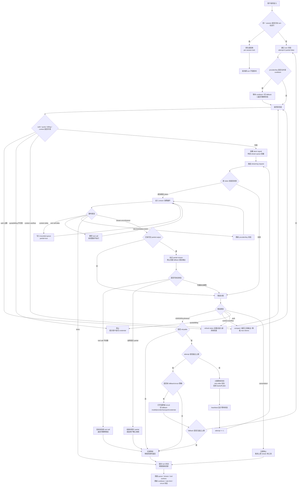

# Streaming 模式下推理服务异常时的 Agent 自保机制分析

> 基于 `sources/` 下 6 个 AI Coding CLI 工程的源码复核
> 分析版本：
>
> - Claude Code v2.1.87
> - Codex rust-v0.141.0
> - Gemini CLI v0.47.0
> - OpenCode v1.4.14
> - Hermes Agent v0.16.0
> - Nanobot v0.2.1

---

## 0. 执行摘要

Streaming agent 的核心稳定性问题是：

> streaming 模式下，当推理服务限流、过载、超时、断流、慢流、返回半截内容或持续报错时，agent 如何避免自己被打挂。

“被打挂”不是单一故障，而是一组工程风险：

- retry storm：大量 agent 或多个会话同时失败、同时重试，把服务压得更差；
- 无限重试：一次 429/529/timeout 演变成永不结束的等待；
- 半截 stream 污染状态：模型已经输出一部分内容，后续 fallback 又重复输出；
- 本地事件堆积：UI、SSE writer 或 session processor 消费不过来，内存持续增长；
- 上下文膨胀：工具输出和历史消息不断增长，下一轮请求必然 context overflow；
- agent 行为死循环：模型反复调用同一个工具或生成重复内容；
- provider 单点持续失败：每一轮都先撞一个已经明显不可用的模型或 provider；
- 多会话雪崩：一个 API key 下多个进程互相不知道对方状态，轮流打到 429。

6 个工程的共同方案是一套分层自保机制：

1. 识别错误：区分 429、529、5xx、timeout、context overflow、auth、quota、billing。
2. 控制重试：最大次数、指数退避、jitter、`retry-after`、persistent mode heartbeat。
3. 降低放大：后台请求少重试或不重试，跨会话共享 cooldown，避免同步重试尖峰。
4. 保住状态：stream cancellation、durable message、半截输出不轻易 fallback。
5. 绕开故障点：fallback model/provider/transport/credential，或打开 circuit breaker。
6. 限制本地资源：bounded channel、per-session lock、tool worker 上限、abort/timeout。
7. 纠正 agent 行为：loop detection、doom-loop、max turns、context compaction。

背压是其中一个边界条件：这些项目大多没有“服务实时压力 -> agent 主动降速”的闭环。更具工程价值的是它们在 streaming 故障面前如何分层止损。

---

## 1. 先理解 retry backoff 和 jitter

源码中多次出现 backoff、jitter、cooldown、retry-after。它们解决的是同一个问题：服务已经不稳时，agent 不能继续用固定节奏撞服务。

### 1.1 固定延迟为什么不够

最朴素的 retry 是固定延迟：

```text
请求失败 -> 等 1 秒 -> 重试
请求失败 -> 等 1 秒 -> 重试
请求失败 -> 等 1 秒 -> 重试
```

如果只有一个 agent，这可以工作。但如果有 100 个 agent 同时遇到 429，它们会在 1 秒后同时重试。服务刚从过载中恢复一点，又被同一批请求同时打回去。这就是 retry storm。

固定延迟的问题是：

- 所有客户端节奏一致，容易同步；
- 服务越差，请求越容易聚集到同一个重试窗口；
- 高并发下会形成一波一波的尖峰。

### 1.2 指数退避

指数退避把每次失败后的等待时间拉长：

```text
第 1 次失败 -> 等 200ms
第 2 次失败 -> 等 400ms
第 3 次失败 -> 等 800ms
第 4 次失败 -> 等 1600ms
```

常见公式：

```text
delay = min(initialDelay * factor^(attempt - 1), maxDelay)
```

它的作用是：

- 短暂网络波动可以快速恢复；
- 连续失败时逐步减少请求频率；
- 给推理服务恢复时间；
- 避免 agent 自己陷入高频 retry loop。

但单纯指数退避仍有同步问题。如果 100 个 agent 同时失败，它们会同时等 200ms、同时等 400ms、同时等 800ms。

### 1.3 jitter 是什么

jitter 是在退避时间上加入随机扰动，让客户端不要同时重试。

例如基准 delay 是 800ms，加 10% jitter：

```text
实际 delay = 800ms * random(0.9, 1.1)
实际范围 = 720ms 到 880ms
```

这样 100 个 agent 不会都在 800ms 那一刻重试，而会分散在一个时间区间内。

jitter 的价值不是让单个请求更快，而是让整个系统在故障时更平滑：

- 降低同步重试尖峰；
- 避免多个进程一起撞服务；
- 给服务端限流、排队和恢复留出空间；
- 在多会话、多 agent、企业共享 API key 场景尤其重要。

### 1.4 常见 jitter 变体

**Equal jitter**：在指数退避结果附近上下浮动。

```text
delay = baseDelay * random(0.9, 1.1)
```

Codex 的 backoff 使用的就是类似策略。

**Full jitter**：在 0 到指数退避上限之间随机。

```text
delay = random(0, exponentialDelay)
```

它更分散，但单个请求可能很快重试。

**Decorrelated jitter**：下一次 delay 基于上一次 delay 随机增长。

```text
delay = min(maxDelay, random(baseDelay, previousDelay * 3))
```

这种方式常用于大规模客户端，能避免固定指数曲线导致的同步。

### 1.5 retry-after 和 jitter 谁优先

如果服务端返回 `retry-after` 或 `retry-after-ms`，应该优先尊重服务端。它表示服务端已经明确告诉客户端“多久以后再来”。

推荐顺序：

1. 有 `retry-after-ms`：用毫秒级 server hint。
2. 有 `retry-after` 秒数或 HTTP date：解析后等待。
3. 有 provider-specific reset header：等待到 reset。
4. 没有任何 hint：使用指数退避 + jitter。
5. 等待过长：分段 sleep，并定期 heartbeat，让 UI 知道 agent 没死。

OpenCode、Claude Code、Nanobot、Hermes 都有不同程度的 server hint 处理。Codex 主要在 stream error/requested delay 和通用 backoff 之间切换。

---

## 2. Streaming 故障面：agent 必须防什么

### 2.1 请求前失败

典型情况：

- auth token 过期；
- provider 选择或模型不可用；
- context 已经超过窗口；
- quota/billing 已经耗尽；
- 本地 session 已经被取消。

正确处理：

- auth 问题先刷新 token，不进入普通 retry；
- quota/billing 不要当 transient error 无限重试；
- context overflow 先压缩或调整 token；
- cancelled/aborted 立即停止。

### 2.2 首 token 前失败

这是最适合 retry/fallback 的阶段，因为用户还没有看到任何模型输出。

典型处理：

- 429/529/5xx 按 retry policy 处理；
- 有 `retry-after` 就等待；
- 连续失败后切 fallback model/provider/transport；
- 达到最大尝试次数后把错误交给用户或上层 runtime。

### 2.3 stream 中途失败

这是最难处理的情况。模型已经输出了一部分内容，可能还包含 tool call 的半截 JSON。

风险：

- 直接重试会重复输出；
- fallback 到另一个模型可能生成不一致内容；
- 半截 tool call 如果被执行，会污染状态；
- UI 看起来像 agent 卡住或说一半停了。

可靠策略：

- 明确标记 partial output；
- 如果已经向用户输出内容，谨慎 fallback；
- tool call 必须完整解析后才能执行；
- consumer drop 时取消上游 stream；
- session 中保存 stream part/error part/retry part，方便恢复和解释。

Nanobot 的 fallback provider 明确限制“已经有内容开始 streaming 后不随意 fallback”，这是一个很重要的设计点。

### 2.4 慢流和无响应

服务没有报错，但长时间没有新 token。

应对手段：

- idle timeout；
- heartbeat；
- 用户可 abort；
- persistent retry 模式下分段等待；
- UI 明确显示 retry/waiting 状态。

没有 heartbeat 的长等待会被用户理解成 agent 挂了。

### 2.5 下游消费慢

推理服务正常生成，但本地 UI、SSE、日志、session processor 消费慢。

风险：

- stream event 队列无限增长；
- 内存上升；
- 用户取消后上游仍继续读流；
- 已没人消费的 response 还在消耗 token 和网络。

Codex 的 bounded channel 和 consumer drop cancellation 是这类问题中最值得借鉴的实现。

---

## 3. Claude Code：按请求重要性分层，避免 529 放大

**核心文件**：`sources/claude-code/src/services/api/withRetry.ts`

Claude Code 的重点是：不是所有请求都值得在服务过载时重试。

### 3.1 识别故障信号

`withRetry()` 处理的信号包括：

- 429 rate limit；
- 529 overloaded；
- `retry-after`；
- `x-should-retry`；
- `anthropic-ratelimit-unified-reset`；
- 401/auth refresh；
- max tokens context overflow；
- SDK streaming 中可能丢失 status code 的 overloaded 文本。

这意味着它没有只依赖 SDK 抛出的标准错误，而是兼容了 streaming 场景中错误信息不完整的问题。

### 3.2 529 前台/后台分层

Claude Code 定义 `FOREGROUND_529_RETRY_SOURCES`。前台用户等待的请求可以 retry，后台 summary、title、suggestion、classifier 这类请求遇到 529 直接放弃。

这个策略很关键：

```text
服务已经 529
  -> 前台主请求继续有限重试
  -> 后台辅助请求直接停止
```

它牺牲非关键体验，保住用户正在等待的主路径，同时避免后台任务放大过载。

如果你实现自己的 agent，应该把请求分成至少三类：

- foreground：用户正在等，允许较强 retry；
- background：标题、摘要、索引、遥测增强，过载时直接跳过；
- maintenance：清理、预热、缓存刷新，过载时延后。

### 3.3 Fast mode cooldown

Claude Code 对 fast mode 做了专门处理：

- 429/529 时先读取 `retry-after`；
- 如果等待很短，可以等完继续 fast mode；
- 如果等待很长或未知，进入 cooldown，切回 standard mode；
- cooldown 有较长保持时间，避免马上又切回 fast mode 撞限流。

这是“失败后动态调整”的典型例子。它不是实时背压，但能避免一个高压模式在服务拒绝后继续冲。

### 3.4 连续 529 后 fallback

连续 529 达到阈值后，如果配置了 fallback model，会抛出专门的 fallback 触发错误，让上层切换模型。

这里要注意：fallback 不应该无限链式扩散。合理做法是：

- 每个 turn 记录 fallback 发生次数；
- fallback model 也失败时停止或降级；
- 明确告诉用户当前服务过载；
- 不要在多个 fallback 之间无限轮转。

### 3.5 Persistent retry 与 heartbeat

persistent/unattended 模式可以等待更久，尤其是 429/529。但长时间 sleep 会让用户以为进程挂了，所以 Claude Code 会把长等待分段，并周期性发 heartbeat。

可借鉴点：

- 长 retry 必须可观测；
- 每 30 秒左右更新状态；
- 支持用户中止；
- 等待理由要明确，例如 rate limit reset。

### 3.6 Claude Code 可借鉴设计

- 过载时不要重试所有请求，先砍后台请求。
- 有 `retry-after` 就优先尊重。
- fast/high-throughput 模式必须有 cooldown。
- 连续 529 要触发 fallback 或停止，不能无限 retry。
- streaming 错误解析要兼容 status code 缺失。
- 长等待必须 heartbeat。

---

## 4. Codex：stream channel 背压 + 传输 fallback

**核心文件**：

- `sources/codex/codex-rs/core/src/client.rs`
- `sources/codex/codex-rs/core/src/session/turn.rs`
- `sources/codex/codex-rs/core/src/responses_retry.rs`
- `sources/codex/codex-rs/core/src/util.rs`

Codex 的重点是把“provider stream”和“agent/session 消费”隔离开，并在 WebSocket 不稳定时切 HTTP。

### 4.1 Turn-scoped client session

Codex 的 `ModelClientSession` 是 turn/session scoped，里面包含：

- auth context；
- provider/model；
- thread id；
- transport fallback state；
- sticky routing token。

好处是：一次 turn 内发生的 WebSocket fallback、auth retry 等状态不会散落在多个全局变量里。

### 4.2 WebSocket 到 HTTP fallback

Codex 支持 WebSocket stream，但 WebSocket 失败后可以切到 HTTP fallback。这个切换是可用性策略：

```text
WebSocket stream 失败
  -> retry 仍失败或达到条件
  -> session 标记 fallback_to_http
  -> 后续请求走 HTTP stream
```

它不减少 provider 压力，但能避免 agent 被某个传输通道的问题打挂。

### 4.3 bounded response channel

Codex 定义 `RESPONSE_STREAM_CHANNEL_CAPACITY: usize = 1600`，把 provider response stream 映射到 bounded `mpsc` channel。

这解决的是下游消费慢：

```text
provider stream -> mapper -> bounded channel -> session/UI consumer
```

如果 consumer 慢，channel 满了，mapper 的 `send(...).await` 会等待。这样事件不会无限堆积。

如果 consumer 已经 drop，mapper 会记录 cancellation，停止继续处理无意义 stream。

这是最清楚的本地 streaming 背压案例。它不保护远端推理服务，但保护 agent 自己不被本地队列撑爆。

### 4.4 retry delay

Codex 的 retry 使用 stream error/requested delay 或通用指数退避。通用 backoff 初始延迟较短，并带 0.9 到 1.1 的 jitter。

这说明 Codex 假设很多 stream 错误是瞬时传输问题，所以初始 retry 较快；同时通过 jitter 避免大量请求同时重试。

### 4.5 UsageLimit 和 ContextWindow 不普通重试

Codex 将 `UsageLimitReached`、`ContextWindowExceeded` 这类错误区别对待：

- usage limit 进入 rate-limit/status 路径；
- context window exceeded 需要 compact；
- 不把它们当成 transient stream error 无限重试。

这点非常重要。agent 自保的第一原则是：只有 transient error 才 retry。

### 4.6 Codex 可借鉴设计

- streaming event 必须有 bounded queue。
- consumer drop 要传播 cancellation。
- 传输层可以 fallback，但要限定在当前 session/turn 状态里。
- context/usage/auth 不要混入普通 retry。
- retry backoff 应加 jitter。

---

## 5. Gemini CLI：重点是防 agent 自己跑偏

**核心文件**：

- `sources/gemini-cli/packages/core/src/core/client.ts`
- `sources/gemini-cli/packages/core/src/utils/retry.ts`
- `sources/gemini-cli/packages/core/src/scheduler/scheduler.ts`
- `sources/gemini-cli/packages/core/src/services/loopDetectionService.ts`

Gemini CLI 对“推理服务压力”的处理不是最强，但对“agent 行为自保”很有价值。

### 5.1 retryWithBackoff

Gemini CLI 的 retry 会处理：

- 429；
- 499；
- 5xx；
- network/fetch failed；
- incomplete JSON 等 transient 问题。

它有默认最大尝试次数、初始 delay、最大 delay。这样至少不会无限 retry。

persistent 429 可以通过 callback 触发 fallback model。这个点和 Claude Code/Nanobot 的 fallback 思路一致：如果当前模型持续被限流，可以转到更可用的模型。

### 5.2 maxSessionTurns

streaming 服务不稳定时，一个常见坏结果是 agent 在工具调用、模型补救、再次工具调用之间长时间循环。Gemini CLI 在 client turn loop 里有 `maxSessionTurns` 约束，避免一次会话无限跑。

这属于 agent 侧硬保险：

```text
不管服务是否正常，一次会话最多允许 N 轮
超过后停止并返回状态
```

### 5.3 LoopDetectionService

Gemini CLI 的 loop detection 会检测：

- 工具调用重复；
- 内容重复；
- 长轮次后调用模型分析是否陷入循环。

第一次检测到循环时，系统可以注入反馈尝试恢复；再次检测到则终止。

这对 streaming 自保很重要。推理服务慢或异常时，模型更容易输出不完整或重复行为；如果 agent 没有 loop guard，可能一直调用同一个工具尝试修复。

### 5.4 tool scheduler 和 wait_for_previous

Gemini CLI 的 tool scheduler 允许模型通过 `wait_for_previous` 指定工具是否要等待前一个工具完成。

它不是推理服务背压，但能避免工具侧并发失控。工具输出越多，下一轮 context 越大，推理服务压力也间接增大。

### 5.5 Gemini CLI 可借鉴设计

- retry 必须有最大次数和最大 delay。
- session 必须有 max turns。
- loop detection 应该覆盖工具调用和内容重复。
- 工具并发不能只靠默认并行，模型或工具 schema 应能表达依赖关系。
- fallback model callback 是处理 persistent 429 的实用扩展点。

---

## 6. OpenCode：尊重 server hint，保证 session 可恢复

**核心文件**：

- `sources/opencode/packages/opencode/src/session/llm.ts`
- `sources/opencode/packages/opencode/src/session/retry.ts`
- `sources/opencode/packages/opencode/src/session/processor.ts`
- `sources/opencode/packages/opencode/src/session/overflow.ts`
- `sources/opencode/packages/opencode/src/session/message-v2.ts`

OpenCode 的重点是：服务端告诉你多久后重试，就按它说的来；session 状态要能从持久层恢复。

### 6.1 retry-after 优先

`retry.ts` 的 delay 逻辑优先级很清楚：

1. `retry-after-ms`
2. `retry-after`
3. 指数退避

这比盲目 backoff 更稳。因为 429/529 时服务端最清楚当前 bucket 或队列什么时候恢复。

对于自己的 agent，实现建议是：

- 同时支持 `retry-after-ms`、`retry-after` 秒数、`retry-after` HTTP date；
- 解析失败时 fallback 到 backoff；
- 对异常长的 retry-after 设置上限或进入 persistent mode；
- UI 显示“等待服务端 retry-after”，而不是静默等待。

### 6.2 Context overflow 不 retry

OpenCode 明确把 context overflow 排除出普通 retry。

这非常重要。context overflow 不是瞬时错误，重试同一个 payload 只会再次失败。正确动作是：

```text
context overflow
  -> 标记需要 compaction
  -> 压缩历史或裁剪工具输出
  -> 用新上下文再发请求
```

### 6.3 Durable retry 和 session processor

OpenCode 的 session 处理依赖持久化消息流。stream 中的 part、error、retry 状态都会进入 session processor 的状态机。

好处：

- 进程崩溃后能重建历史；
- UI 能显示 retry 状态；
- 错误和重试不是隐藏在一段 async 函数里；
- tool call、retry、compaction 都能作为 session 事件被审计。

### 6.4 Doom-loop

OpenCode 检测重复工具调用，避免模型不断执行同一个动作。

这类机制看似和服务压力无关，但实际很关键：服务一旦慢，agent 如果还在反复调用工具、反复追加历史，就会把后续每个 model request 变得更大、更慢、更容易失败。

### 6.5 OpenCode 可借鉴设计

- `retry-after` 优先级应高于本地 backoff。
- context overflow 走 compaction，不走 retry。
- stream/retry/error 状态要进入持久化 session。
- doom-loop 是 streaming 自保的一部分。
- abort signal 必须贯穿 LLM stream。

---

## 7. Hermes Agent：跨会话 rate-limit guard 和 credential 恢复

**核心文件**：

- `sources/hermes-agent/agent/conversation_loop.py`
- `sources/hermes-agent/agent/agent_runtime_helpers.py`
- `sources/hermes-agent/agent/rate_limit_tracker.py`
- `sources/hermes-agent/agent/nous_rate_guard.py`
- `sources/hermes-agent/agent/retry_utils.py`
- `sources/hermes-agent/agent/tool_executor.py`

Hermes Agent 的价值在于：它不只处理当前 stream，还尝试让同一 provider 的多个会话共享限流状态。

### 7.1 rate-limit header tracker

`rate_limit_tracker.py` 解析 `x-ratelimit-*` header，形成 request/token 的 minute/hour bucket。

这类数据可以用于：

- UI 展示当前 quota 压力；
- 判断 429 是否真的是账号 bucket 耗尽；
- 决定是否进入 cooldown；
- 给 fallback 和 credential rotation 提供上下文。

这还不是实时服务背压，但已经比只看 HTTP status 更接近“压力感知”。

### 7.2 Nous cross-session guard

`nous_rate_guard.py` 针对 Nous Portal 做了跨会话 guard：

- 首次确认 Nous Portal 账号 bucket 被限流时，把状态写入本地文件；
- 其他会话请求前可以检查该状态；
- 如果 cooldown 未过，避免继续 hammer 同一个 provider；
- 区分账号 quota 429 和 upstream provider 429，避免错误熔断整个 Nous。

这是很有建设性的设计。它解决了单进程 retry 无法解决的问题：

```text
会话 A 遇到真实 429
  -> 记录 provider/key cooldown
会话 B/C/D 请求前读取 cooldown
  -> 不再同时撞同一个 provider
```

如果你的 agent 面向企业、多实例或多窗口运行，这比单个请求内 backoff 更重要。

### 7.3 credential pool recovery

`recover_with_credential_pool()` 支持：

- 429 首次可重试；
- 连续 429 或 usage limit 后轮换 credential；
- billing/auth 问题区别处理；
- fallback provider 激活时避免污染 primary credential pool。

这说明 Hermes 把“服务拉胯”拆成不同原因：

- 账号限流；
- credential 不可用；
- billing/usage 耗尽；
- provider fallback 激活；
- transient transport error。

不同原因走不同恢复路径，而不是全部 retry。

### 7.4 jittered backoff

Hermes 的 retry 工具强调 jittered backoff，目标是降低多个会话同时重试的尖峰。

结合 Nous guard，Hermes 的模式可以概括为：

```text
单请求：jittered retry
单会话：fallback/credential recovery
多会话：provider cooldown guard
```

这比只有“请求失败后 sleep”更适合压力场景。

### 7.5 工具并发保护

Hermes 的 tool executor 有 worker 上限、heartbeat 和 cancellation。它保护的是本地工具执行，不是 LLM provider。但工具并发过高会造成：

- 本地 CPU/IO 被打满；
- 工具输出过多；
- 下一轮 prompt 膨胀；
- streaming 响应更慢。

所以工具侧限流是 agent 自保的一部分。

### 7.6 Hermes 可借鉴设计

- provider/key 级 cooldown 应该跨会话共享。
- 429 要区分账号 quota 和 upstream provider overload。
- credential rotation 必须避免污染 fallback/primary 状态。
- jittered backoff 和跨会话 guard 要配合使用。
- 工具 worker 上限是压力治理的一部分。

---

## 8. Nanobot：结构化 retry + fallback circuit breaker

**核心文件**：

- `sources/nanobot/nanobot/providers/base.py`
- `sources/nanobot/nanobot/providers/fallback_provider.py`
- `sources/nanobot/nanobot/agent/runner.py`
- `sources/nanobot/nanobot/api/server.py`

Nanobot 的 provider 层很适合作为“怎样设计 streaming retry API”的参考。

### 8.1 LLMResponse 携带结构化错误

`LLMResponse` 不只是 `content` 和 `finish_reason`，还包含：

- `retry_after`
- `error_status_code`
- `error_kind`
- `error_type`
- `error_code`
- `error_retry_after_s`
- `error_should_retry`

这使上层不用从错误文本里猜测所有信息。

好的 agent runtime 应该把 provider 错误标准化为内部结构：

```text
status_code
retry_after
is_retryable
is_quota_error
is_billing_error
is_context_error
is_stream_partial
provider
model
```

### 8.2 429 细分

Nanobot 区分 retryable 429 和 non-retryable 429：

- quota/billing/insufficient credits 这类 429 不应该普通 retry；
- rate-limit/overload/temporarily unavailable 可以 retry；
- unknown 429 默认按等待重试处理。

这比“所有 429 都指数退避”更安全。否则 billing 耗尽会导致 agent 长时间无意义等待。

### 8.3 chat_stream_with_retry

provider base 提供统一的 `chat_stream_with_retry()`：

- standard retry；
- persistent retry；
- 从 response/header/content 中提取 retry-after；
- heartbeat；
- retry delay fallback。

这说明 retry 不应该散落在每个 provider 实现里。应该有一层统一 wrapper，provider 只负责把错误结构化。

### 8.4 fallback provider 和 circuit breaker

`fallback_provider.py` 做了几件重要事情：

- primary 失败后按顺序尝试 fallback model；
- fallback 也失败时继续下一个；
- primary repeated failure 后打开 circuit；
- circuit open 时跳过 primary，避免每轮都先撞失败点；
- 如果 stream 已经开始输出内容，则谨慎 fallback，避免重复输出。

这是一套很实用的 provider 自保策略。

关键点是 circuit breaker：

```text
primary 连续失败达到阈值
  -> circuit open
  -> 一段时间内直接跳 fallback
  -> cooldown 后再试 primary
```

它避免了“每个 turn 都先失败一次再 fallback”的固定损耗。

### 8.5 per-session lock 和 SSE queue

Nanobot API 对同一 session 使用 `asyncio.Lock`，避免同一会话并发执行多个 agent turn。

这能防止：

- 两个请求同时修改同一 session；
- stream 输出互相交错；
- 上下文历史顺序错乱；
- 多个 turn 同时打同一 provider。

SSE 路径使用 `asyncio.Queue` 连接 agent callback 和 writer。需要注意：默认 queue 不是 bounded queue，所以它是解耦，不是严格本地背压。如果 writer 慢，最好设置 maxsize 并定义满队列策略。

### 8.6 Nanobot 可借鉴设计

- provider 错误要结构化。
- 429 必须区分 retryable 与 non-retryable。
- streaming retry 应集中在 provider wrapper。
- fallback circuit breaker 比每次先撞 primary 更稳。
- 已经输出 partial content 后 fallback 要非常谨慎。
- 同一 session 要串行化。
- SSE/stream queue 最好 bounded。

---

## 9. 横向对比：几个工程具体怎么处理服务拉胯

| 工程 | 主要风险模型 | 关键处理 | 最值得借鉴的点 |
|---|---|---|---|
| Claude Code | 429/529、fast mode 过载、后台请求放大 | 前后台 529 分层、fast-mode cooldown、fallback model、persistent heartbeat | 过载时先砍后台请求，保护前台主路径 |
| Codex | WebSocket/stream 中断、本地消费慢 | HTTP fallback、bounded channel、consumer drop cancellation、jittered backoff | 本地 stream pipeline 要有 bounded queue 和 cancellation |
| Gemini CLI | agent 自循环、无限 turn、transient retry | retryWithBackoff、maxSessionTurns、LoopDetectionService、tool scheduler | 服务异常时更要防 agent 自己进入循环 |
| OpenCode | 429/5xx、context overflow、session crash | `retry-after` 优先、compaction、durable retry、doom-loop | retry/error/stream 状态要持久化且可恢复 |
| Hermes Agent | 多会话同 provider 限流、credential/provider 故障 | rate-limit tracker、Nous guard、credential rotation、fallback、jitter | provider/key cooldown 应跨会话共享 |
| Nanobot | provider 失败、429 语义复杂、primary 持续坏 | structured error、chat_stream_with_retry、fallback circuit breaker、per-session lock | fallback 要配 circuit breaker，partial stream 后谨慎切换 |

---

## 10. 这些机制和真正背压的关系

背压需要明确边界。

### 10.1 本地 streaming 背压

本地背压解决的是 agent 内部链路：

```text
provider stream -> parser/mapper -> queue -> session/UI/SSE consumer
```

如果 consumer 慢，bounded queue 能让 producer 等待；consumer drop 后 cancellation 能停止无意义处理。

代表实现：

- Codex：bounded `mpsc` channel，capacity 1600；
- Nanobot：SSE queue 解耦 callback 和 writer，但默认不是 strict bounded；
- OpenCode：Effect/AI SDK stream 和 session processor；
- 各工程普遍使用 abort/cancel。

这类机制能防止本地内存和任务堆积，是 agent 不被打挂的必要条件。

### 10.2 推理服务压力背压

严格的 provider-load backpressure 是：

```text
服务端暴露压力信号
  -> agent 请求前主动降速
  -> 动态调整模型调用并发/QPS/token/tool planning
```

6 个工程没有看到通用实现。它们主要依赖：

- 429/529；
- `retry-after`；
- rate-limit reset；
- 5xx/timeout；
- 本地失败计数；
- circuit breaker；
- provider-specific guard。

这些都是“失败后或拒绝后”的信号，不是实时负载前馈。

### 10.3 为什么这个结论仍然重要

如果你要保证任何压力下 agent 不被打挂，不能只说“没有背压”。更实际的结论是：

- 单进程 agent：必须实现 bounded stream queue、abort、retry-after、jitter、max retries、context compaction。
- 多会话 agent：必须实现 provider/key 级共享 cooldown。
- 企业级 agent：最好把限流放到 gateway，而不是每个 CLI 自己猜。
- 自建推理服务：应该暴露 pressure signal，否则客户端只能靠 429/latency 做近似控制。

---

## 11. 设计自己的 streaming agent：自保清单

下面的流程图把前面 6 个工程中最值得借鉴的机制合并成一条完整控制流。重点不是让每个 agent 都实现所有分支，而是保证 streaming 请求从进入、执行、失败、重试、fallback 到退出都有明确状态和资源释放路径。



### 11.1 错误分类

必须先把 provider 错误标准化：

| 类型 | 是否 retry | 正确动作 |
|---|---|---|
| 429 rate limit | 通常 retry | 优先 `retry-after`，否则 backoff+jitter |
| 529 overloaded | 前台有限 retry，后台少 retry | cooldown/fallback，砍低优先级请求 |
| 5xx transient | retry | backoff+jitter，达到阈值 fallback |
| timeout/断流 | 视 partial output 而定 | 未输出可 retry，已输出要标记 partial |
| context overflow | 不普通 retry | compact/裁剪/降低 max tokens |
| quota/billing | 不 retry | 提示用户或切 credential/account |
| auth | 不普通 retry | refresh token 或重新登录 |
| cancel/abort | 不 retry | 立即停止，释放资源 |

### 11.2 Retry 策略

推荐顺序：

1. 解析 `retry-after-ms`。
2. 解析 `retry-after` 秒数或 HTTP date。
3. 解析 provider-specific reset header。
4. 使用指数退避 + jitter。
5. 达到最大尝试次数后停止。
6. persistent 模式才允许长等，但必须 heartbeat。

最小伪代码：

```typescript
function retryDelay(error: ApiError, attempt: number): number {
  const serverDelay = parseRetryAfter(error.headers)
  if (serverDelay !== null) return clamp(serverDelay, 0, MAX_SERVER_DELAY)

  const base = Math.min(INITIAL_DELAY * 2 ** (attempt - 1), MAX_BACKOFF)
  return base * random(0.8, 1.2)
}
```

### 11.3 Streaming partial output 策略

必须显式区分：

- 首 token 前失败：可以 retry/fallback；
- 已输出自然语言：不要无脑 fallback，避免重复回答；
- 已输出 tool call 但 JSON 不完整：不能执行工具；
- 已输出完整 tool call：执行前要确认 stream finish 或 schema 完整；
- fallback 后输出要标记来源和状态。

推荐状态：

```text
stream_started
content_emitted
tool_call_started
tool_call_complete
stream_failed
retry_scheduled
fallback_attempted
```

### 11.4 本地资源保护

必须有：

- bounded event queue；
- consumer drop cancellation；
- per-session lock；
- abort signal 贯穿 provider/tool/session；
- idle timeout；
- max wall-clock timeout；
- tool worker 上限；
- session max turns；
- context budget 和 compaction。

没有这些，推理服务不需要真的崩，agent 自己就会因为队列、上下文或循环被拖垮。

### 11.5 Fallback 和 circuit breaker

fallback 不应该只是“失败了换模型”。它需要 circuit breaker：

```text
primary failed count >= threshold
  -> circuit open for cooldown
  -> skip primary, try fallback
  -> cooldown elapsed, half-open probe primary
  -> success close circuit, failure reopen
```

还要注意：

- 已有 partial output 后不要轻易 fallback；
- fallback 次数必须有限；
- fallback 失败要停止而不是无限轮转；
- primary 和 fallback 的 credential/provider 状态不要互相污染。

### 11.6 多会话共享 cooldown

如果同一个 API key 可能被多个 agent/session 使用，单请求内 retry 不够。

需要一个 provider/key 级状态：

```text
provider = anthropic
model = claude-x
api_key_hash = abc
cooldown_until = timestamp
reason = 429 retry-after
scope = requests_per_minute
```

请求前先检查：

- cooldown 未过：排队、降级或返回可解释状态；
- cooldown 已过：允许一个 probe 请求；
- probe 成功：清除 cooldown；
- probe 失败：延长 cooldown。

Hermes 的 Nous guard 是这种思路的项目内案例。

---

## 12. 推荐实现优先级

如果目标是“任何压力下 agent 不被打挂”，优先级建议如下。

### P0：没有这些就不可靠

- 错误分类：429/529/5xx/timeout/context/quota/auth/cancel 分开。
- `retry-after` 优先。
- 指数退避 + jitter。
- 最大 retry 次数。
- abort/cancel 贯穿 stream。
- bounded stream queue。
- per-session lock。
- context overflow 走 compaction，不普通 retry。
- max turns 或 loop guard。

### P1：压力场景会明显更稳

- foreground/background 请求分级。
- provider/model fallback。
- circuit breaker。
- persistent retry heartbeat。
- partial stream 状态机。
- tool worker 上限。
- durable session event。

### P2：多实例/企业场景需要

- provider/key 级共享 cooldown。
- quota bucket tracker。
- gateway 统一限流。
- priority queue：交互请求优先，后台任务可丢弃。
- latency/error EWMA，动态调整并发。

### P3：只有自建推理服务才真正可做

- 服务端 pressure signal；
- queue depth；
- recommended request interval；
- stream-level slow-down frame；
- per-tenant budget telemetry；
- 客户端按 pressure 动态调 QPS/concurrency/token budget。

---

## 13. 最终结论

1. 6 个工程展示了 streaming agent 在服务异常时的多层自保模式。
2. Claude Code 的关键经验是请求分级：服务 529 时保前台、砍后台，避免 retry amplification。
3. Codex 的关键经验是本地 stream pipeline：bounded channel 和 cancellation 防止本地消费链路被打挂。
4. Gemini CLI 的关键经验是行为保护：max turns 和 loop detection 防止 agent 自己跑偏。
5. OpenCode 的关键经验是 server hint 和 durable session：`retry-after` 优先，错误/retry 状态可恢复。
6. Hermes Agent 的关键经验是跨会话 guard：provider/key 级 cooldown 比单请求 retry 更适合多会话压力。
7. Nanobot 的关键经验是 structured provider error 和 circuit breaker：fallback 前先判断错误语义，primary 持续坏时不要每轮都撞。
8. 真正的 provider-load backpressure 在 6 个工程中都不是通用能力；要实现它，需要服务端暴露更明确的 pressure signal，或者在企业网关层统一做限流和调度。

---

## 关键代码索引

| 工程 | 代码位置 | 关注点 |
|---|---|---|
| Claude Code | `sources/claude-code/src/services/api/withRetry.ts` | 429/529、fast-mode cooldown、foreground 529、fallback model、persistent retry |
| Codex | `sources/codex/codex-rs/core/src/client.rs` | stream mapper、bounded channel、transport fallback、consumer cancellation |
| Codex | `sources/codex/codex-rs/core/src/responses_retry.rs` | retry/fallback decision |
| Codex | `sources/codex/codex-rs/core/src/session/turn.rs` | turn-level retry、usage/rate-limit event |
| Codex | `sources/codex/codex-rs/core/src/util.rs` | exponential backoff + jitter |
| Gemini CLI | `sources/gemini-cli/packages/core/src/utils/retry.ts` | retryWithBackoff、persistent 429 fallback callback |
| Gemini CLI | `sources/gemini-cli/packages/core/src/services/loopDetectionService.ts` | loop detection |
| Gemini CLI | `sources/gemini-cli/packages/core/src/scheduler/scheduler.ts` | `wait_for_previous` tool scheduling |
| OpenCode | `sources/opencode/packages/opencode/src/session/retry.ts` | `retry-after-ms` / `retry-after` |
| OpenCode | `sources/opencode/packages/opencode/src/session/processor.ts` | stream/retry/error/tool part processing |
| OpenCode | `sources/opencode/packages/opencode/src/session/overflow.ts` | context overflow pre-check |
| Hermes Agent | `sources/hermes-agent/agent/rate_limit_tracker.py` | `x-ratelimit-*` parsing |
| Hermes Agent | `sources/hermes-agent/agent/nous_rate_guard.py` | Nous cross-session rate-limit guard |
| Hermes Agent | `sources/hermes-agent/agent/agent_runtime_helpers.py` | credential rotation、fallback、transport recovery |
| Hermes Agent | `sources/hermes-agent/agent/tool_executor.py` | tool worker 上限、heartbeat、cancel |
| Nanobot | `sources/nanobot/nanobot/providers/base.py` | structured retry metadata、retry-after、stream retry |
| Nanobot | `sources/nanobot/nanobot/providers/fallback_provider.py` | fallback provider、circuit breaker、partial stream fallback 限制 |
| Nanobot | `sources/nanobot/nanobot/api/server.py` | per-session lock、SSE queue |

---

**文档版本**：v1.2
**最后更新**：2026-06-19
**作者**：基于 hello-olleh 项目源码复核
