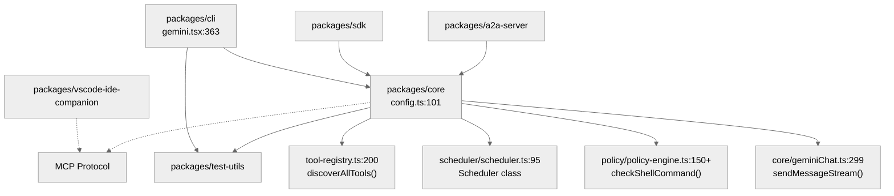
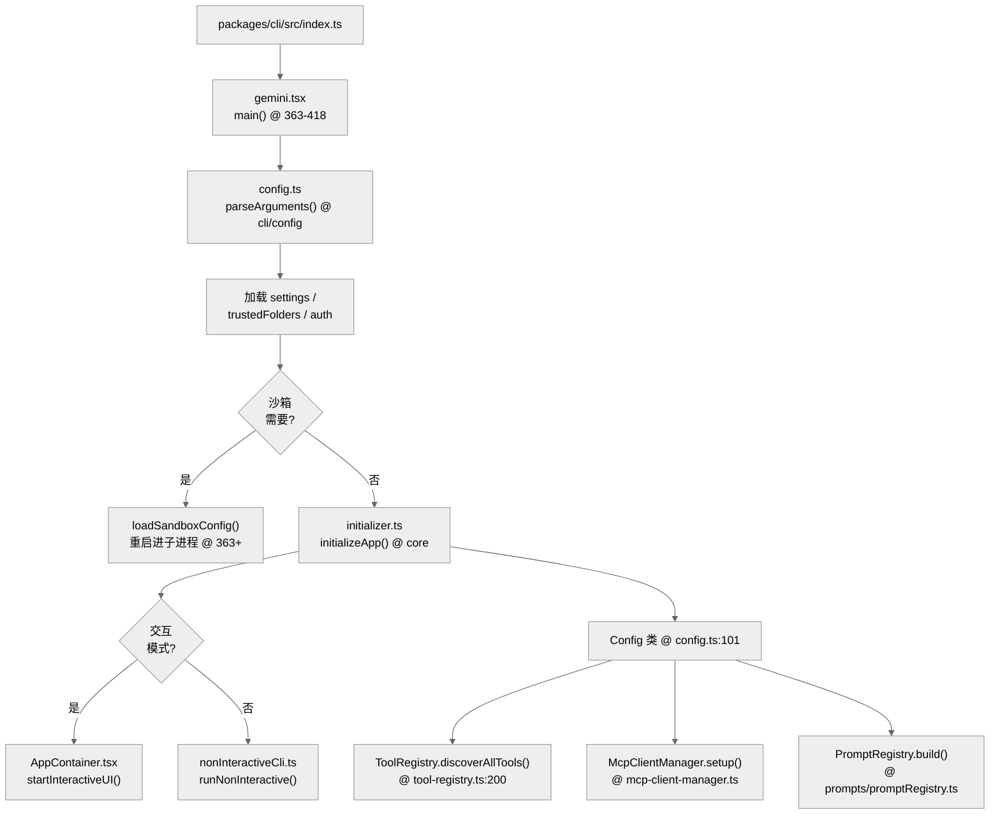
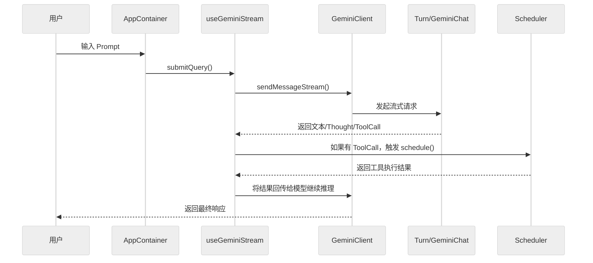
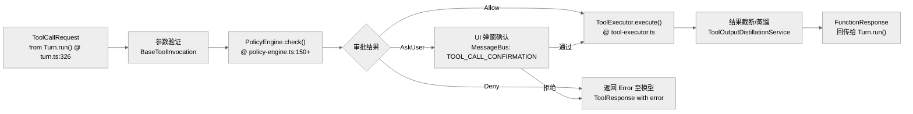
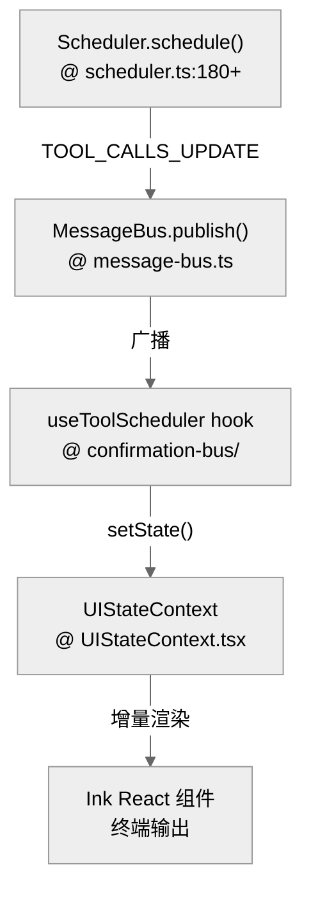
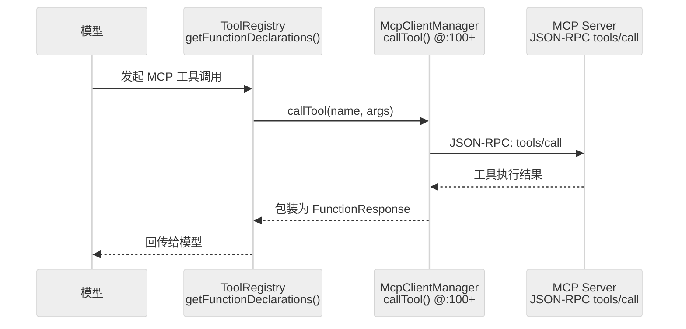
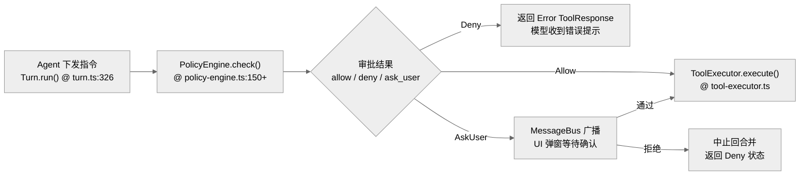
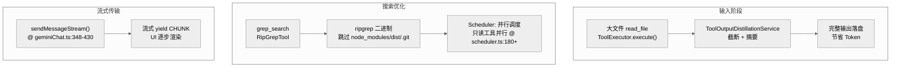

% Gemini CLI 源码深度解析
% 基于 Gemini CLI v0.36.0
% feuyeux

# Gemini CLI 源码深度解析

*基于 Gemini CLI v0.36.0*

---

## 架构全景：Gemini CLI 的分层模型与核心抽象

# 架构全景：Gemini CLI 的分层模型与核心抽象

Gemini CLI 不是一个简单的命令行包装器，而是一个以 `packages/core` 为中心的 **Agent Engine**，通过多宿主（CLI, SDK, IDE）进行能力投射。

## 1. Monorepo 包拓扑

项目采用 TypeScript Monorepo 结构，各子包职责明确：

| 包名 | 职责 | 核心依赖 |
| --- | --- | --- |
| `packages/core` | **系统内核**：负责模型调用、工具调度、策略引擎与 Prompt 构建 | `@google/genai`, `@modelcontextprotocol/sdk` |
| `packages/cli` | **终端宿主**：提供 TUI 交互（React/Ink）、参数解析与沙箱管理 | `@google/gemini-cli-core`, `ink` |
| `packages/sdk` | **集成接口**：为外部应用提供程序化调用 Gemini CLI 的能力 | `@google/gemini-cli-core` |
| `packages/a2a-server` | **服务网关**：将 Agent 能力封装为 HTTP/SSE 接口 | `@google/gemini-cli-core`, `express` |
| `packages/vscode-ide-companion` | **IDE 桥梁**：连接 VS Code 与 CLI，提供 Diff 和工作区上下文 | `@modelcontextprotocol/sdk` |

### 依赖关系图（含源码行号）


## 2. 分层模型

Gemini CLI 遵循清晰的纵向分层，确保了核心逻辑与展示逻辑的解耦：

| 层级 | 实现文件 | 核心函数/类 | 行号 |
|---|---|---|---|
| **宿主协议层 (Host Protocol)** | `cli/src/gemini.tsx`, `a2a-server`, `vscode-ide-companion` | `main()`, `startInteractiveUI()` | :363, :100+ |
| **运行时组装层 (Runtime Assembly)** | `core/src/config/config.ts` | `Config._initialize()` | :200+ |
| **调度编排层 (Orchestration)** | `core/src/scheduler/scheduler.ts` | `Scheduler.schedule()` | :180+ |
| **原子功能层 (Atomic Functions)** | `core/src/tools/`, `core/src/policy/` | `ToolRegistry`, `PolicyEngine`, `PromptRegistry` | :200, :150+, :100+ |
| **模型交互层 (LLM Interaction)** | `core/src/core/geminiChat.ts` | `GeminiChat.sendMessageStream()` | :299 |

## 3. 核心抽象与接口边界

### 3.1 `Config`：系统组合根
`Config` 类（`gemini-cli/packages/core/src/config/config.ts:101`）是整个运行时的上帝对象，它持有并初始化所有核心组件：
- `ToolRegistry` (工具发现与注册)
- `PolicyEngine` (权限策略)
- `GeminiClient` (模型通信)
- `McpClientManager` (MCP 扩展管理)

### 3.2 `Scheduler`：执行内核
`Scheduler`（`gemini-cli/packages/core/src/scheduler/scheduler.ts:95`）实现了工具调用的闭环。它不关心工具的具体逻辑，只负责：
- 接收 `ToolCallRequest`
- 调用 `PolicyEngine` 进行审批
- 驱动 `ToolExecutor` 执行
- 将结果回传给模型

### 3.3 `PolicyEngine`：安全边界
`PolicyEngine`（`gemini-cli/packages/core/src/policy/policy-engine.ts:150+`）定义了系统能做什么。它通过一系列规则（Rules）和检查器（Checkers）对 Shell 命令、文件读写等操作进行风险评估，返回 `allow`, `deny` 或 `ask_user`。

## 4. 接口边界设计

- **UI 与 Core 的边界**：通过 `MessageBus`（`gemini-cli/packages/core/src/confirmation-bus/message-bus.ts`）进行异步通信，UI 只负责订阅状态变更并投影到界面，不直接控制执行细节。
- **工具与模型的边界**：模型只看到 `FunctionDeclaration`，真实执行被封装在 `BaseToolInvocation` 及其子类中，实现了"逻辑"与"声明"的彻底分离。

## 5. 代码质量评估 (Code Quality Assessment)

### 5.1 架构优点
- **高可组合性**：`Config` 作为 Composition Root，通过依赖注入将 `ToolRegistry`、`PolicyEngine`、`GeminiClient` 等解耦，各层可独立测试。
- **事件驱动解耦**：MessageBus 模式使 UI 层与核心逻辑完全异步化，React/Ink 只做状态投影。
- **工具声明/执行分离**：`FunctionDeclaration`（声明）vs `BaseToolInvocation`（执行）的抽象，使模型看到干净接口。

### 5.2 技术债务与改进点
- **`Config` 类过于臃肿**：3726 行的巨型类承担了初始化、工具注册、MCP 配置、沙箱策略等多重职责，建议拆分为 `CoreBuilder` 或 `RuntimeAssembler`。
- **Scheduler 状态管理复杂**：`SchedulerStateManager` + `MessageBus` 双通道状态管理增加了并发调试难度。
- **缺少统一的错误分类体系**：`ToolErrorType` 与通用 `Error` 混用，导致某些边界错误被隐式吞掉。

### 5.3 核心模块行号速查

| 模块 | 关键函数/类 | 行号区间 |
|---|---|---|
| `config.ts` | `Config` 类 / `_initialize()` | :101-3726 / :200+ |
| `turn.ts` | `Turn.run()` 事件循环 | :253-447 |
| `geminiChat.ts` | `sendMessageStream()` | :299-430 |
| `scheduler.ts` | `Scheduler.schedule()` | :180+ |
| `policy-engine.ts` | `checkShellCommand()` | :150+ |

---

> 关联阅读：[03-agent-loop.md](./03-agent-loop.md) 了解这些抽象如何协作完成一次会话。

## 启动链路：从入口到运行模式的分发

# 启动链路：从入口到运行模式的分发

Gemini CLI 的启动不仅仅是加载 UI，它包含了一个复杂的环境预热与权限校验链。

## 1. 启动全景图（含源码行号）



## 2. 核心函数清单 (Function List)

| 函数/方法 | 文件路径 | 行号 | 职责 |
|---|---|---|---|
| `main()` | `packages/cli/src/gemini.tsx` | :363-418 | 程序入口，参数解析，沙箱决策 |
| `parseArguments()` | `packages/cli/src/config/config.ts` | — | Yargs 子命令解析 |
| `loadSandboxConfig()` | `packages/cli/src/gemini.tsx` | :363+ | 沙箱进程重新拉起 |
| `initializeApp()` | `packages/cli/src/initializer.ts` | — | 返回预热的 `Config` 实例 |
| `Config._initialize()` | `packages/core/src/config/config.ts` | :200+ | 工具/MCP/技能/Auth 初始化 |
| `startInteractiveUI()` | `packages/cli/src/ui/AppContainer.tsx` | — | React + Ink TUI 挂载 |
| `runNonInteractive()` | `packages/cli/src/nonInteractiveCli.ts` | — | Headless stdin/stdout 模式 |
| `trustedFolders.validate()` | `packages/cli/src/config/trustedFolders.ts` | — | 工作区信任校验 |

## 3. 核心初始化顺序

### 3.1 参数解析 (Yargs)
系统在 `packages/cli/src/config/config.ts` 中使用 `yargs` 定义了丰富的子命令和运行标志。解析后的 `argv` 决定了：
- 运行模式（交互 vs. 非交互）
- 认证方式
- 是否启用特定的扩展或 MCP 服务

### 3.2 宿主环境预热
在进入业务逻辑前，`main()` 会执行关键的系统级操作：
- **清理与隔离**：清理过期的 tool output 和 checkpoint 文件。
- **权限拉齐**：校验 `trustedFolders`，判断当前工作区是否受信任。
- **沙箱重启**（`gemini-cli/packages/cli/src/gemini.tsx:363-418`）：如果配置要求沙箱且当前不在沙箱内，程序会通过 `loadSandboxConfig` 重新拉起自身进入受限环境。

### 3.3 运行时核心初始化
通过 `initializer.ts` 的 `initializeApp()` 返回一个已预热的 `Config` 实例。此过程会依次完成：
- `Config._initialize()` (工具库、MCP、技能挂载)
- 刷新 Auth 状态
- IDE 连接状态同步

## 4. 运行模式分发

Gemini CLI 支持两种主要的运行模式，它们共享相同的 `packages/core` 核心，但外壳协议不同：

### 4.1 交互模式 (Interactive TUI)
调用 `startInteractiveUI()`。它会初始化 React + Ink 容器 `AppContainer`，将整个 TUI 挂载到终端。此模式下，状态管理由 React Context 和 `UIStateContext` 驱动。

### 4.2 非交互模式 (Non-Interactive Headless)
调用 `runNonInteractive()`（`gemini-cli/packages/cli/src/nonInteractiveCli.ts`）。
- **同步 IO**：从 stdin 读取输入，并将其折叠成一次 Agent Loop 执行。
- **线性输出**：适合流水线集成，支持以 JSON 格式输出结果。

## 5. 代码质量评估 (Code Quality Assessment)

### 5.1 优点
- **沙箱策略前置**：沙箱决策在 `main()` 早期完成，避免核心逻辑在非沙箱环境下泄露。
- **初始化分层**：`initializeApp()` 返回 `Config` 后 TUI/Headless 才 fork，职责清晰。

### 5.2 改进点
- **`main()` 方法过长**：363-418 行的单一方法混合了日志初始化、参数解析、沙箱检测、模式分发等多重逻辑，建议拆分为 `bootstrap()` → `resolveSandbox()` → `dispatchMode()` 三个方法。
- **沙箱检测与重启耦合**：检测到需要沙箱时直接在 `main()` 中调用 `loadSandboxConfig` 重新拉起自身，这种"自我替换"模式难以测试，建议提取为独立进程管理器。
- **Headless 模式缺少会话恢复路径**：`runNonInteractive()` 不支持 `--resume`，长流程任务无法断点续跑。

### 5.3 章节导航 (Chapter Breakdown)

| 子章节 | 核心议题 |
|---|---|
| §1 启动全景图 | main() → initializeApp() → TUI/Headless 全流程 |
| §2 核心函数清单 | 关键函数的源码定位 |
| §3 初始化顺序 | Config._initialize() 的 3 阶段初始化链 |
| §4 模式分发 | 交互 vs. 非交互的协议差异 |
| §5 代码质量 | main() 臃肿、沙箱自重启难测试、Headless 缺 resume |

---

> 关联阅读：[03-agent-loop.md](./03-agent-loop.md) 深入了解模式分发后的执行主循环。

## 核心执行循环：Agent 决策链与 LLM 调用

# 核心执行循环：Agent 决策链与 LLM 调用

Gemini CLI 的核心是一个由模型驱动的**自治执行循环**。它不仅仅是单次交互，而是能够根据模型反馈持续调用工具直到任务完成的过程。

## 1. Agent 循环序列图

整个循环跨越了 UI 宿主层、模型客户端层与工具调度层。



## 2. Agent 决策链的关键环节

### 2.1 Prompt 构建：PromptProvider
Prompt 不是硬编码的模板，而是由 `packages/core/src/prompts/promptProvider.ts` 动态生成的。
- **系统提示词 (Core System Prompt)**：汇总审批模式、可用工具列表、挂载的技能。
- **上下文感知**：自动包含当前工作区的 `GEMINI.md`、用户记忆 (User Memory) 和 tracker 状态。
- **行号与引用**：生成的提示词会指导模型如何引用代码片段及文件路径。

### 2.2 LLM 调用与流处理：GeminiChat
`packages/core/src/core/geminiChat.ts` 封装了底层的模型通信：
- **流式响应 (Streaming)**：通过 `sendMessageStream()` 将原始流拆分为文本、`thought` (思考过程) 和 `tool_call` 事件。
- **回合持久化 (Turn Recording)**：每轮对话及工具结果都会通过 `recordCompletedToolCalls()` 写回存储层。

### 2.3 消息编排：Turn
`packages/core/src/core/turn.ts` 是具体的“回合”控制器：
- **内容路由**：将模型输出的混合内容分发给 UI 渲染或工具调度。
- **循环检测**：检测模型是否在反复调用同一组工具而无进展，并在适当时机终止循环（防止无限消耗 Token）。

## 3. 工具执行与回注 (Feedback Loop)

循环的核心在于其**闭环特性**：
1. 模型输出 `ToolCallRequest`。
2. `useGeminiStream` (或 Headless 模式下的 `nonInteractiveCli`) 将请求提交给 `Scheduler`。
3. 工具执行完成后，结果被格式化为 `FunctionResponse`。
4. 模型收到执行结果，进行下一轮推理（决定是任务已完成返回最终文本，还是需要更多工具调用）。

## 4. 关键代码定位

- **循环控制核心**：`packages/core/src/core/turn.ts:253-447` (`Turn.run()` AsyncGenerator 事件流)
- **流式会话封装**：`packages/core/src/core/geminiChat.ts:299-430` (`sendMessageStream()` 含重试机制)
- **系统提示词生成**：`packages/core/src/prompts/promptProvider.ts` (`getCoreSystemPrompt()`)

## 5. 技术深度：AsyncGenerator 流式架构

### 5.1 Turn.run() 作为 AsyncGenerator
`Turn.run()` 不是普通 async 函数，而是一个 **AsyncGenerator**（`core/turn.ts:253`）。这意味着：

```typescript
async *run(modelConfigKey, req, signal, displayContent?, role?): AsyncGenerator<ServerGeminiStreamEvent>
```

每个 `yield` 都对应一个 UI 可订阅的事件（`Thought`、`Content`、`ToolCallRequest`、`Finished` 等）。这种设计使事件流可以被**部分消费**——UI 不必等整个回合结束就能逐步渲染。

### 5.2 sendMessageStream() 的 3 层包装
`geminiChat.ts:348-430` 的 `streamWithRetries` 实现了 3 层：
1. **外层重试循环**（`attempt < maxAttempts`）：429 降级时指数退避
2. **中层 API 调用**（`makeApiCallAndProcessStream`）：处理 SSE 流并 yield CHUNK
3. **内层事件转换**：将 `GenerateContentResponse` 拆解为 `Thought` / `Content` / `FunctionCall` 事件

### 5.3 循环检测机制
`turn.ts` 中 `callCounter` 跟踪同一回合内的工具调用次数。当检测到模型反复调用同一组工具时，触发 `LoopDetected` 事件，防止无限消耗 Token。

## 6. 代码质量评估 (Code Quality Assessment)

### 6.1 优点
- **AsyncGenerator 模式优雅**：事件流部分消费使 UI 可以逐步渲染，无需等完整响应。
- **重试逻辑透明**：429 降级在 `sendMessageStream` 内部自动处理，上层无需感知。
- **类型安全的事件联合**：`ServerGeminiStreamEvent` 联合类型覆盖所有 16 种事件，TypeScript 穷举检查。

### 6.2 改进点
- **`Turn.run()` 行数过多**：253-447 近 200 行，包含了事件解析、循环检测、finishReason 判断等多重逻辑，建议按事件类型拆分为 `handleFunctionCalls()`、`handleContent()` 等方法。
- **流式事件与 UI 状态绑定隐晦**：`useGeminiStream` hook 的实现分散在多个文件中，追踪"用户看到 Thought 的完整路径"较困难。
- **缺少背压机制**：当模型快速连续输出大量 `FunctionCall` 时，Scheduler 可能被瞬时淹没，建议在 `Turn.run()` 中增加批次控制。

---

> 关联阅读：[04-tool-system.md](./04-tool-system.md) 了解工具是如何被执行与授权的。

## 工具调用机制：Tool 注册、权限策略与执行闭环

# 工具调用机制：Tool 注册、权限策略与执行闭环

工具系统（Tool System）是 Gemini CLI 具备实际行动能力的核心。它通过一整套安全策略和调度框架，将 LLM 的决策转化为本地代码执行。

## 1. 核心抽象与角色（含源码行号）

| 角色 | 代码路径 | 关键方法 | 行号 | 职责 |
|---|---|---|---|---|
| **ToolRegistry** | `packages/core/src/tools/tool-registry.ts` | `discoverAllTools()` | :200 | 工具发现与注册 |
| **ToolRegistry** | `packages/core/src/tools/tool-registry.ts` | `getFunctionDeclarations()` | :300+ | 导出 JSON Schema 给模型 |
| **PolicyEngine** | `packages/core/src/policy/policy-engine.ts` | `checkShellCommand()` | :150+ | 风险评估与决策 |
| **Scheduler** | `packages/core/src/scheduler/scheduler.ts` | `schedule()` | :180+ | 工具调用编排入口 |
| **ToolExecutor** | `packages/core/src/scheduler/tool-executor.ts` | `execute()` | — | 实际执行 + 输出截断 |
| **DiscoveredToolInvocation** | `packages/core/src/tools/tool-registry.ts` | `execute()` | :58 | 命令工具的子进程执行 |

## 2. 工具注册与发现 (Discovery)

系统启动时，`Config` 会调用 `ToolRegistry.discoverAllTools()`。
- **内建工具**：如 `grep_search`、`read_file`、`run_shell_command`。
- **命令工具 (Command Tools)**：基于特定脚本发现的工具。
- **MCP 工具**：从配置的 MCP Server（通过 `McpClientManager`）动态加载的工具。

模型在 `getFunctionDeclarations()`（`gemini-cli/packages/core/src/tools/tool-registry.ts`）阶段看到这些工具的 JSON Schema 定义。

## 3. 工具执行流水线 (Pipeline)

一个工具调用的生命周期遵循以下严格步骤：



## 4. 权限策略 (Tool Policy) 的实现

`PolicyEngine.checkShellCommand()` 是最核心的安全防御点。
- **静态规则**：根据工具名和参数（如 Shell 命令中的关键词）进行正则匹配。
- **模式分支**：
    - `YOLO`：全自动执行，无需用户确认。
    - `AUTO_EDIT`：对文件修改操作自动确认，但敏感命令仍需确认。
    - `INTERACTIVE`：默认模式，高风险操作必须用户通过 TUI 确认。
- **安全检查器 (Checkers)**：例如检查是否尝试修改敏感系统文件或环境变量。

## 5. 关键机制：输出截断与蒸馏

当工具输出过大（超过 Token 限制）时，`ToolExecutor` 会触发保护机制：
- **截断 (Truncation)**：保留头部和尾部，中间部分用占位符替代，并将完整输出保存至临时文件。
- **蒸馏 (Distillation)**：调用 `ToolOutputDistillationService` 利用模型对输出进行摘要压缩。

## 6. 代码质量评估 (Code Quality Assessment)

### 6.1 优点
- **PolicyEngine 策略可扩展**：规则以插件形式注册，新增规则只需实现 `Rule` 接口，无需修改核心逻辑。
- **Scheduler 与 Policy 解耦**：`Scheduler` 通过 `checkPolicy()` 调用 Policy，结果不影响 Scheduler 自身状态。

### 6.2 改进点
- **`DiscoveredToolInvocation.execute()` 使用子进程 `spawn`**：`tool-registry.ts:82-100` 通过 `child_process.spawn` 执行命令工具，存在 shell 注入风险，尽管 PolicyEngine 会预检，但建议对参数做二次 `shell-quote` 转义。
- **工具发现链路复杂**：`discoverAllTools()` 涉及文件系统扫描、MCPServer 连接、Shell 命令探测多个阶段，启动时延影响明显。
- **输出蒸馏缺少基准**：未验证蒸馏后的压缩率与语义保真度，生产环境可能出现信息丢失。

---

> 关联阅读：[06-extension-mcp.md](./06-extension-mcp.md) 了解如何通过 MCP 扩展新的工具。

## 状态管理：会话持久化与并发控制

# 状态管理：会话持久化与并发控制

Gemini CLI 是一个有状态的 Agent 系统。它需要管理长会话历史、并发工具执行状态，以及在进程重启后恢复会话的能力。

## 1. 核心状态组件（含源码行号）

| 组件 | 代码路径 | 关键方法 | 行号 | 职责 |
|---|---|---|---|---|
| **Storage** | `packages/core/src/storage/storage.ts` | `save()`, `load()` | — | 持久层：配置、历史、checkpoint |
| **ChatRecordingService** | `packages/core/src/core/recordingContentGenerator.ts` | `recordMessage()` | — | 实时捕获交互并序列化落盘 |
| **UIStateContext** | `packages/cli/src/ui/context/UIStateContext.tsx` | `setState()` | — | UI 状态容器 |
| **MessageBus** | `packages/core/src/confirmation-bus/message-bus.ts` | `publish()`, `subscribe()` | — | 事件总线广播 |
| **SessionSelector** | `packages/cli/src/core/sessionSelector.ts` | `resolveSession()` | — | 会话创建/列表查询/resume |
| **GitService** | `packages/core/src/services/gitService.ts` | `getDiff()` | — | Checkpoint 时捕获 Git 状态 |

## 2. 会话持久化与恢复 (Resume)

会话状态并不是一次性保存的，而是伴随每一轮交互增量更新的。

### 2.1 会话恢复流程
当用户运行 `gemini --resume <id>` 时：
1. `SessionSelector.resolveSession()` 将会话 ID 解析为具体的存储路径。
2. `Config` 初始化时从 `Storage` 加载对应的 `ChatHistory`。
3. `GeminiChat` 构造函数验证加载的历史记录（`gemini-cli/packages/core/src/core/geminiChat.ts:256-271`）。
4. 系统恢复上下文，Agent 可以继续之前的对话而无需重新输入。

### 2.2 状态落盘：Checkpointing
系统会周期性地或在关键节点创建 checkpoint。这不仅包含对话文本，还包含：
- **Git 状态**：捕获当前工作区的 diff（由 `GitService` 提供）。
- **环境变量**：保存执行过程中必要的上下文环境变量。

## 3. 并发控制与状态投影

Gemini CLI 的并发模型是基于 **事件总线 (Message Bus)** 的状态投影。



- **工具并发**：`Scheduler` 允许只读工具（如 `ls` 或 `read_file`）并行执行。为了防止竞态，写操作会被顺序化。
- **提交控制**：`useGeminiStream.submitQuery()` 在有活跃流时会拒绝新的用户提交。
- **UI 增量渲染**：React + Ink 的组合使得复杂的 Agent 状态可以被增量投影到终端，而不是频繁地重绘整个屏幕。

## 4. 关键代码定位

- **持久化接口**：`packages/core/src/storage/storage.ts`
- **UI 状态主入口**：`packages/cli/src/ui/context/UIStateContext.tsx`
- **会话恢复核心逻辑**：`packages/cli/src/gemini.tsx:553-585`
- **历史验证**：`packages/core/src/core/geminiChat.ts:256-271` (GeminiChat 构造函数中验证加载的 ChatHistory)

## 5. 代码质量评估 (Code Quality Assessment)

### 5.1 优点
- **MessageBus 解耦**：工具执行状态通过事件总线广播，Scheduler 不直接依赖 UI 层。
- **Checkpoint 包含 Git 状态**：确保 Agent 恢复时可还原完整工作区上下文。

### 5.2 改进点
- **React Context 状态镜像开销大**：`UIStateContext` 在长会话下持有大量历史消息，可能导致 Ink 重绘卡顿，建议引入虚拟化列表。
- **Storage 无原子性保证**：多进程并发写入同一会话文件时缺乏文件锁机制。
- **Checkpoint 频率不透明**：没有明确配置项控制 checkpoint 间隔，高频工具调用场景下可能产生大量磁盘 IO。

---

> 关联阅读：[07-error-security.md](./07-error-security.md) 了解在状态异常时系统如何进行错误处理与自愈。

## 扩展性：MCP 与扩展机制的加载与隔离

# 扩展性：MCP 与扩展机制的加载与隔离

Gemini CLI 的扩展性主要体现在两方面：**MCP (Model Context Protocol)** 的集成与**内建扩展 (Extensions)** 的加载。它允许系统在不修改内核的情况下，动态获得新的工具、资源和提示词能力。

## 1. MCP 集成机制

MCP 是 Gemini CLI 扩展能力的基石。它将外部服务的工具能力映射到本地 Agent 中。

### 1.1 McpClientManager：连接枢纽
`packages/core/src/tools/mcp-client-manager.ts` 是 MCP 的核心。
- **配置与发现**：读取 `settings` 中定义的 MCP 服务器列表。
- **声明映射**：将 MCP 服务器暴露的 `tools` 转换为 Gemini 的 `FunctionDeclaration`。
- **协议适配**：处理 JSON-RPC 通信，将 Agent 的工具调用请求转发给远端服务器。

### 1.2 MCP 工具执行流


## 2. 核心函数清单 (Function List)

| 函数/类 | 文件路径 | 行号 | 职责 |
|---|---|---|---|
| `McpClientManager` | `packages/core/src/tools/mcp-client-manager.ts` | — | MCP 连接管理与工具映射 |
| `McpClientManager.callTool()` | `packages/core/src/tools/mcp-client-manager.ts` | :100+ | 转发工具调用至 MCP Server |
| `McpClient` | `packages/core/src/tools/mcp-client.ts` | — | 单个 MCP Server 的 JSON-RPC 客户端 |
| `activate-skill.ts` | `packages/core/src/tools/activate-skill.ts` | — | Skill 动态激活 |
| `extensions.ts` | `packages/core/src/commands/extensions.ts` | — | 内建扩展加载入口 |
| `Config.createToolRegistry()` | `packages/core/src/config/config.ts` | — | 工具注册（内建 + MCP） |

## 2. 内建扩展与技能 (Extensions & Skills)

除了 MCP，系统还支持通过 `packages/core/src/commands/extensions.ts` 加载内建扩展。
- **Extensions**：通常是更高层的功能模块，如特定的 IDE 适配或大型工作流。
- **Skills**：即插即用的功能片段（如 `packages/core/src/skills`），可以动态挂载到 `Config` 中。

## 3. 隔离与安全性

扩展的加载并不是无限制的，它受到多重隔离机制的保护：
- **工作区信任 (Workspace Trust)**：系统会校验 `trustedFolders.ts`，只有在受信任的目录下才会加载 `.env` 或工作区特定的扩展。
- **沙箱隔离 (Sandbox)**：如果是通过 `--sandbox` 启动，所有扩展代码都在受限环境下执行，无法直接访问敏感宿主资源。
- **权限拦截**：无论工具源自 MCP 还是内建扩展，其执行都必须经过 `PolicyEngine` 的统一审批。

## 4. 如何新增一个工具：修改点指南

### 情况 A：通过外部 MCP Server 扩展
1. 运行一个符合 MCP 协议的服务器。
2. 在 `gemini configure` 或配置文件中添加服务器地址。
3. **无需修改源码**：Agent 会在启动时自动发现并注册该工具。

### 情况 B：新增仓库内建工具
1. 在 `packages/core/src/tools` 下定义新的 `BaseToolInvocation` 实现。
2. 在 `packages/core/src/config/config.ts` 的 `createToolRegistry()` 中进行手动注册。
3. （可选）在 `packages/cli/src/ui` 中添加自定义的工具渲染组件。

## 5. 代码质量评估 (Code Quality Assessment)

### 5.1 优点
- **MCP 工具透明接入**：无需修改内核代码，只需配置 MCP Server 地址即可动态扩展。
- **技能系统即插即用**：`activate-skill.ts` 允许运行时动态挂载功能片段。

### 5.2 改进点
- **MCP Server 连接缺乏熔断**：如果某个 MCP Server 无响应或挂起，`McpClientManager` 可能无限等待，影响整体 Agent 响应，建议引入 per-Server 超时与重试。
- **Skill 注册点隐蔽**：`Config._initialize()` 中的技能挂载逻辑分散，不易发现新 Skill 需要在此处注册。
- **Extension 缺少沙箱隔离保障**：内建扩展（`extensions.ts`）与 MCP 工具不同，不经过 MCP 沙箱通道，如果扩展直接调用 Node.js API（如 `fs`），PolicyEngine 无法拦截。

---

> 关联阅读：[01-architecture.md](./01-architecture.md) 了解扩展是如何被组装进全局 Config 的。

## 错误处理与安全性：Agent 的自愈与边界防护

# 错误处理与安全性：Agent 的自愈与边界防护

作为一个具有本地代码执行能力的 Agent，安全性（Security）与鲁棒性（Robustness）是 Gemini CLI 的生命线。

## 1. 深度安全防御体系

Gemini CLI 采用多层嵌套防御机制，确保 Agent 在处理复杂任务时不越权、不泄密。

| 防御层 | 实现模块 | 核心机制 | 行号 |
| --- | --- | --- | --- |
| **沙箱层 (Sandbox)** | `cli/src/sandbox` | **物理隔离**：利用 `bubblewrap` (Linux) 或子进程隔离，限制文件系统与网络访问。 | — |
| **策略层 (Policy)** | `core/src/policy/policy-engine.ts` | **逻辑控制**：`PolicyEngine.check()` 实时评估风险 | :150+ |
| **环境层 (Env)** | `cli/src/config/env` | **数据清洗**：`sanitizeEnvVar` 白名单环境变量过滤 | — |
| **工作区层 (Trust)** | `cli/src/config/trustedFolders.ts` | **信任校验**：禁用非信任目录的自动执行 | — |

### 1.1 敏感文件防泄漏 (Secret Masking)
在执行 `grep_search` 或 `read_file` 时，系统会自动避开 `.git`、`node_modules`、`.env` 等目录。此外，在 Linux 沙箱模式下，会使用 mask file 覆盖宿主的敏感路径（如 `/etc/shadow`）。

## 2. 错误处理与自愈 (Self-Healing)

系统不仅要捕获错误，还要尝试从模型生成的错误指令中恢复。

### 2.1 请求级重试
`GeminiClient.generateContent()`（`gemini-cli/packages/core/src/core/client.ts`）内置了 `retryWithBackoff`：
- **429 降级**：当触发速率限制时，自动进行指数退避重试。
- **坏流恢复**：`GeminiChat.sendMessageStream()` 对模型产出的无效或截断响应进行实时纠偏。

### 2.2 工具执行级的异常捕获
`Scheduler` 在调用 `ToolExecutor` 时会包裹完整的 try-catch。
- **软错误 (Soft Error)**：如文件不存在。错误信息被格式化为 `ToolResponse` 返回给模型，提示模型修正指令。
- **硬错误 (Hard Error)**：如沙箱崩溃。系统会触发 `uncaughtException` 兜底，并引导用户进行重启或环境检查。

## 3. 安全审批流 (Confirmation Flow)



- **YOLO 模式下的例外**：即使用户开启了 `--yolo` 模式，某些极高风险的操作（如删除关键目录）仍可能被 `PolicyEngine` 强制拦截或要求二次确认。

## 4. 关键代码定位

- **策略引擎核心**：`packages/core/src/policy/policy-engine.ts` (`check()` @ :150+, `checkShellCommand()` @ :200+)
- **沙箱管理器**：`packages/cli/src/config/sandboxPolicyManager.ts`
- **环境变量清洗**：`packages/cli/src/config/env.ts` (`sanitizeEnvVar`)
- **重试机制**：`packages/core/src/core/client.ts` (`retryWithBackoff`) + `geminiChat.ts:348` (内层重试循环)

## 5. 核心函数清单 (Function List)

| 函数/类 | 文件路径 | 行号 | 职责 |
|---|---|---|---|
| `PolicyEngine.check()` | `packages/core/src/policy/policy-engine.ts` | :150+ | 工具调用风险评估 |
| `PolicyEngine.checkShellCommand()` | `packages/core/src/policy/policy-engine.ts` | :200+ | Shell 命令正则规则匹配 |
| `retryWithBackoff()` | `packages/core/src/core/client.ts` | — | 429 降级指数退避 |
| `Scheduler.scheduleTry()` | `packages/core/src/scheduler/scheduler.ts` | :180+ | 工具执行 try-catch 封装 |
| `ToolExecutor.execute()` | `packages/core/src/scheduler/tool-executor.ts` | — | 软错误格式化为 ToolResponse |
| `sanitizeEnvVar()` | `packages/cli/src/config/env.ts` | — | 环境变量白名单过滤 |
| `trustedFolders.validate()` | `packages/cli/src/config/trustedFolders.ts` | — | 工作区信任校验 |

## 6. 代码质量评估 (Code Quality Assessment)

### 6.1 优点
- **4 层防御体系完整**：沙箱（物理）→ PolicyEngine（逻辑）→ Env 清洗（数据）→ Trust 校验（工作区），纵深防御设计清晰。
- **YOLO 模式有强制例外**：即使 `--yolo` 也无法绕过极高风险操作，安全性不退让。

### 6.2 改进点
- **PolicyEngine 规则数量不透明**：外部用户无法直观了解当前策略覆盖了哪些 pattern，debug "为什么这个命令被拦截" 较困难。
- **沙箱检测非原子性**：`loadSandboxConfig()` 检测与拉起之间存在时间窗口，非沙箱模式的进程可能已在做危险操作。
- **错误恢复路径不完整**：`uncaughtException` 仅引导重启，缺乏现场保护（如 checkpoint 强制落盘），重启后可能丢失当前会话状态。

---

> 关联阅读：[08-performance.md](./08-performance.md) 了解安全检查对系统性能的影响。

## 性能与代码质量：大仓库处理与架构评估

# 性能与代码质量：大仓库处理与架构评估

Gemini CLI 在处理超大规模代码库（数百万行代码）和长周期会话时，面临着严峻的性能挑战。系统通过一系列工程化手段来平衡模型推理成本与本地执行效率。

## 1. 性能关键路径 Mermaid 图



## 2. 核心函数清单 (Function List)

| 函数/类 | 文件路径 | 行号 | 性能相关职责 |
|---|---|---|---|
| `RipGrepTool.execute()` | `packages/core/src/tools/ripGrep.ts` | — | 调用 ripgrep 二进制，跳过 node_modules |
| `GrepTool.execute()` | `packages/core/src/tools/grep.ts` | — | fallback grep 实现 |
| `ToolExecutor.execute()` | `packages/core/src/scheduler/tool-executor.ts` | — | 检测输出大小，超阈值触发蒸馏 |
| `ToolOutputDistillationService` | `packages/core/src/tools/` | — | 调用模型对大输出进行摘要压缩 |
| `Scheduler.scheduleTry()` | `packages/core/src/scheduler/scheduler.ts` | :180+ | 只读工具并行调度 |
| `sendMessageStream()` | `packages/core/src/core/geminiChat.ts` | :348-430 | AsyncGenerator 流式 yield |
| `tokenLimit.check()` | `packages/core/src/core/tokenLimits.ts` | — | Token 数量预估与截断 |
| `canUseRipgrep()` | `packages/core/src/tools/ripGrep.ts` | — | 检测 ripgrep 可用性 |

## 3. 大文件与大输出的处理优化

### 3.1 工具输出蒸馏 (Distillation)
当工具执行（如 `cat` 一个 10MB 的文件）产生的输出过大时，`ToolExecutor` 会调用 `ToolOutputDistillationService`：
- **实时压缩**：利用模型的能力对冗长的输出进行摘要。
- **本地落盘**：完整输出保存在本地磁盘，仅将摘要发给 LLM，既节省 Token 又保证了后续任务的上下文完整性。

### 3.2 搜索性能优化
为了在大型 Monorepo 中高效搜索，内建工具集成了 `ripgrep` 等高性能二进制程序：
- **路径排除**：在检索时默认跳过 `node_modules`、`dist` 和 `.git`。
- **并行调度**：`Scheduler` 允许只读工具并行执行，极大地缩短了扫描多个文件的时间。

## 4. 性能测试保障

项目在 `integration-tests/` 中包含了专门的性能与行为回归用例：
- `policy-headless.test.ts`（`gemini-cli/integration-tests/policy-headless.test.ts`）：验证无头模式下的策略决策速度。
- `browser-agent.test.ts`（`gemini-cli/integration-tests/browser-agent.test.ts`）：验证加载真实浏览器时的端到端响应时间。

## 5. 代码质量分析 (Pros & Cons)

### 5.1 架构优点
- **高解耦性**：`Config` 类作为 Composition Root 组装核心依赖，使得 CLI 和 SDK 可以轻松共用逻辑。
- **高可观察性**：通过 `MessageBus` 实现了详细的运行状态投影，便于调试与交互反馈。
- **安全优先设计**：沙箱与 Policy 引擎不是外挂件，而是深度耦合在启动与执行链路中。
- **流式架构高效**：AsyncGenerator 使 UI 可以增量渲染，无需等待完整响应。

### 5.2 潜在改进点
- **文件臃肿**：`AppContainer.tsx` 和 `Config.ts`（3726 行）等核心文件已经超过 1000 行，业务逻辑与组装逻辑混杂，维护门槛较高。
- **状态镜像开销**：UI 层维护了一份与运行时核心近似镜像的状态，长会话下可能导致渲染卡顿，可考虑进一步下放状态管理职责。
- **Prompt 动态性过高**：复杂的 Prompt 构建分支使得调试"模型为什么没看到某工具"变得困难。
- **蒸馏缺乏量化指标**：未在 benchmark 中验证蒸馏压缩率与语义保真度。
- **Checkpoint IO 频率不透明**：没有配置项控制 checkpoint 间隔，高频工具调用时可能产生大量磁盘 IO。

## 6. 总结与改进建议

| 优先级 | 改进建议 | 影响 |
|---|---|---|
| **高** | 引入更轻量的状态分发机制（Zustand），减少超大 React Context 带来的无效重绘 | UI 渲染性能 |
| **高** | 模块化 Prompt 生成器：将 `getCoreSystemPrompt()` 拆分为独立插件 | 可调试性 |
| **中** | 持久化上下文增强：引入 RAG 机制处理极长历史记录 | 长会话质量 |
| **中** | 添加蒸馏基准测试，量化压缩率与语义保真度 | 可靠性 |
| **中** | 添加可配置的 Checkpoint 频率控制 | IO 性能 |

---

> 关联阅读：[00-gemini-cli_ko.md](./00-gemini-cli_ko.md) 回到分析主索引。
