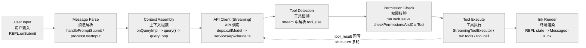
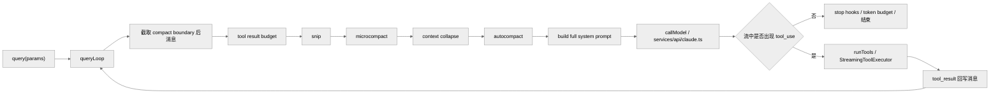

---
layout: content
title: "query() 主循环与请求构造"
---
# `query()` 主循环与请求构造

本篇将 `query()` 视为多轮状态机来拆解，覆盖请求前上下文治理、流式模型调用、工具回流与错误恢复。

**目录**

- [1. 定义](#1-定义)
- [2. 高层流程图](#2-高层流程图)
- [3. `query()` 与 `queryLoop()` 的关系](#3-query-与-queryloop-的关系)
- [4. `queryLoop()` 的 state 说明它是一个“多轮状态机”](#4-queryloop-的-state-说明它是一个多轮状态机)
- [5. 每一轮开始前先做哪些事](#5-每一轮开始前先做哪些事)
- [5.1 发 `stream_request_start`](#51-发-stream_request_start)
- [5.2 生成 query chain tracking](#52-生成-query-chain-tracking)
- [5.3 请求前的上下文治理入口](#53-请求前的上下文治理入口)
- [6. 请求前的系统提示词是最后拼出来的](#6-请求前的系统提示词是最后拼出来的)
- [7. 进入 API 调用前的 setup](#7-进入-api-调用前的-setup)
- [8. `callModel` 如何真正构造请求](#8-callmodel-如何真正构造请求)
- [8.1 系统提示词拼装](#81-系统提示词拼装)
- [8.2 请求参数不只是 model/messages/system](#82-请求参数不只是-modelmessagessystem)
- [8.3 streaming 请求是通过 `anthropic.beta.messages.create(...).withResponse()`](#83-streaming-请求是通过-anthropicbetamessagescreatewithresponse)
- [9. streaming 过程中 query 在干什么](#9-streaming-过程中-query-在干什么)
- [9.1 每条 message 先决定“要不要立即 yield”](#91-每条-message-先决定要不要立即-yield)
- [9.2 assistant 消息里的 `tool_use` 会被提取出来](#92-assistant-消息里的-tool_use-会被提取出来)
- [9.3 流式工具执行可以边收边跑](#93-流式工具执行可以边收边跑)
- [10. 如果没有 `tool_use`，query 怎么结束](#10-如果没有-tool_usequery-怎么结束)
- [11. 如果有 `tool_use`，如何进入下一轮](#11-如果有-tool_use如何进入下一轮)
- [12. `runTools()` 为何还要分并发安全批次](#12-runtools-为何还要分并发安全批次)
- [13. Query 与请求构造之间的边界](#13-query-与请求构造之间的边界)
- [14. `fetchSystemPromptParts()` 的位置很关键](#14-fetchsystempromptparts-的位置很关键)
- [15. 关键源码锚点](#15-关键源码锚点)
- [16. 一段伪代码复原](#16-一段伪代码复原)
- [17. 总结](#17-总结)

---

## 1. 定义

`src/query.ts` 里的 `query()` 不是“调用一次模型 API”的薄包装，而是整个系统的对话执行状态机。

一次用户 turn 在这里可能经历：

1. 请求前上下文处理。
2. 向模型发起 streaming 请求。
3. 收到 `tool_use`。
4. 执行工具并回写 `tool_result`。
5. 继续下一轮模型请求。
6. 在输出超限、上下文过长、stop hooks、token budget 等场景下恢复或结束。

## 2. 高层流程图

### 2.1 请求生命周期调用链示意图

下图展示“**从用户输入到终端渲染**”的调用链；这一视角与后文 `queryLoop()` 的内部状态机不同。



补充说明如下：

- 图里把 `tool_result` 回写、消息追加、再次进入 `queryLoop` 的过程折叠成了 `Tool Execute -> API Client` 这条回环。
- `Ink Render` 在真实运行时并不是最后一步才发生；streaming 文本、tool progress、权限确认 UI 都会持续驱动 REPL/Ink 更新。图里只是把它抽象成“用户最终看到的渲染出口”。

### 2.2 `query()` 内部状态机图



## 3. `query()` 与 `queryLoop()` 的关系

关键代码：

- `src/query.ts:219-238`
- `src/query.ts:241-279`

`query()` 外层只做一件特别重要的事：

- 调用 `queryLoop(params, consumedCommandUuids)`
- 正常返回后，把已消费队列命令标记为 completed

真正复杂的逻辑全部在 `queryLoop()`。

## 4. `queryLoop()` 的 state 说明它是一个“多轮状态机”

关键代码：`src/query.ts:263-279`

内部 state 包括：

- `messages`
- `toolUseContext`
- `maxOutputTokensOverride`
- `autoCompactTracking`
- `stopHookActive`
- `maxOutputTokensRecoveryCount`
- `hasAttemptedReactiveCompact`
- `turnCount`
- `pendingToolUseSummary`
- `transition`

这些字段共同给出两个事实：

- 这里的“turn”不是用户 turn，而是 query 内部递归轮次。
- 一次 query 可能自己继续好几轮。

## 5. 每一轮开始前先做哪些事

关键代码：`src/query.ts:323-460`

## 5.1 发 `stream_request_start`

`src/query.ts:337`

这是给上层 UI/SDK 的控制事件，表示一次新的 API 请求即将开始。

## 5.2 生成 query chain tracking

`src/query.ts:346-363`

这里会生成：

- `chainId`
- `depth`

用于：

- telemetry
- 多轮/递归查询链追踪

## 5.3 请求前的上下文治理入口

从 `src/query.ts:365-468` 可以确认，模型请求前会先经过一条上下文治理流水线：

1. 从 `compact boundary` 之后截取模型视图
2. 对 tool result 做预算裁剪
3. 再按顺序尝试 `snip -> microcompact -> context collapse -> autocompact`
4. 真正失败时进入 reactive recovery

完整机制说明已经独立到：

- [11-context-management.md](./04-state-session-memory.md)

本篇只保留与 `query()` 主循环直接相关的两条事实：

- 这些机制都发生在 `callModel` 之前，因此它们是请求状态机的一部分，而不是 API 层的后处理。
- `context collapse` 与 `autocompact` 不是平行兜底关系；`autocompact` 命中后也不是总是直接走传统 summary，而会先试 `SessionMemory compact`。

## 6. 请求前的系统提示词是最后拼出来的

关键代码：

- `src/query.ts:449-450`
- `src/utils/queryContext.ts:44-73`

`queryLoop` 在请求前会得到：

- 基础 `systemPrompt`
- `systemContext`

然后通过 `appendSystemContext(systemPrompt, systemContext)` 得到最终发送给模型的 full system prompt。

### 6.1 为什么 system prompt 不在更前面就一次性定死

因为：

- `systemContext` 可能依赖 trust、环境、当前状态。
- `appendSystemPrompt`、agent prompt、custom prompt、memory mechanics 都可能参与最终拼装。

## 7. 进入 API 调用前的 setup

关键代码：`src/query.ts:551-580`

这一段会准备：

- `assistantMessages`
- `toolResults`
- `toolUseBlocks`
- `needsFollowUp`
- streamingToolExecutor
- 当前 permission mode 对应的运行模型

一个很关键的点是：

- 当前实际模型可能不是配置里的名义模型，而会被 permission mode、上下文长度等因素影响。

## 8. `callModel` 如何真正构造请求

关键文件：`src/services/api/claude.ts`

重点代码：

- `src/services/api/claude.ts:1358-1379`
- `src/services/api/claude.ts:1538-1728`
- `src/services/api/claude.ts:1777-1833`

## 8.1 系统提示词拼装

在真正发请求前，`claude.ts` 会再次在 system prompt 前后追加一批系统块：

- attribution header
- CLI system prompt prefix
- advisor instructions
- chrome tool search instructions

然后用 `buildSystemPromptBlocks(...)` 处理成 API 需要的 block 结构。

### 8.1.1 这解释了为什么 prompt cache 如此敏感

因为：

- 任何一个系统块、beta header、tool schema 的变化，都可能导致缓存前缀失效。

## 8.2 请求参数不只是 model/messages/system

`paramsFromContext(...)` 里会构造：

- `model`
- `messages`
- `system`
- `tools`
- `tool_choice`
- `betas`
- `metadata`
- `max_tokens`
- `thinking`
- `temperature`
- `context_management`
- `output_config`
- `speed`

这说明请求构造层承担了大量策略组合工作：

- prompt cache
- thinking 配置
- structured outputs
- task budget
- fast mode
- context management

## 8.3 streaming 请求是通过 `anthropic.beta.messages.create(...).withResponse()`

关键代码：`src/services/api/claude.ts:1822-1833`

这里会：

- 设置 `stream: true`
- 传入 signal
- 可能带 client request id header
- 拿 response headers、request id 和 raw stream

源码注释还明确提到：

- 使用 raw stream 是为了避免 SDK 的 O(n²) partial JSON parsing 成本。

这又是一个典型的生产级性能优化点。

## 9. streaming 过程中 query 在干什么

关键代码：`src/query.ts:652-864`

这一段是主循环最核心的实时路径。

## 9.1 每条 message 先决定“要不要立即 yield”

有些错误消息会先被 withheld，例如：

- prompt too long 可恢复错误
- media size error
- `max_output_tokens`

原因是：

- 系统想先尝试恢复。
- 如果恢复成功，用户就不需要看到中间错误。

## 9.2 assistant 消息里的 `tool_use` 会被提取出来

`src/query.ts:829-845`

如果 assistant content 里有 `tool_use` block：

- 追加到 `toolUseBlocks`
- 标记 `needsFollowUp = true`
- 如果启用流式工具执行，立刻交给 `StreamingToolExecutor`

## 9.3 流式工具执行可以边收边跑

这意味着系统不必等整条 assistant 完整结束，才能开始执行所有工具。

从产品体验看，这能显著降低：

- 工具启动延迟
- 长响应中的空转时间

## 10. 如果没有 `tool_use`，query 怎么结束

关键代码：`src/query.ts:1185-1357`

在没有后续工具需要执行时，系统还要经过几道结束前检查：

- `max_output_tokens` 恢复
- API error 短路
- stop hooks
- token budget continuation

### 10.1 `max_output_tokens` 恢复机制

如果命中输出 token 限制：

1. 可能先将默认 cap 从 8k 提升到 64k 再重试。
2. 如果还不够，会注入一条 meta user message，让模型直接续写，不要道歉不要 recap。
3. 超过恢复上限后才真正把错误抛给用户。

这是一种典型的“会话连续性优先”策略。

### 10.2 stop hooks 可以阻止继续

`handleStopHooks(...)` 的返回值可以：

- prevent continuation
- 返回 blocking errors

从而阻止 query 继续递归。

### 10.3 token budget continuation

如果当前 turn 的 token 花费达到了预算阈值，系统可以插入一条 meta user message，让模型把剩余工作拆小继续。

这进一步说明 query 的终止条件不是单一的 API stop reason。

## 11. 如果有 `tool_use`，如何进入下一轮

关键代码：`src/query.ts:1363-1435`

流程是：

1. 选择 `StreamingToolExecutor.getRemainingResults()` 或 `runTools(...)`
2. 消费每个 tool update
3. 把得到的 tool result message 再转成适用于 API 的 user message
4. 更新 `updatedToolUseContext`
5. 生成 tool use summary
6. 把新的 messages 与 context 带入下一轮 `continue`

这就形成了：

`assistant(tool_use) -> user(tool_result) -> assistant(next turn)`

## 12. `runTools()` 为何还要分并发安全批次

这个属于工具系统的内容，但和 query 强耦合。

`runTools()` 会按工具的 `isConcurrencySafe` 把工具块分成：

- 只读可并发批
- 有状态/非安全工具单独串行批

这样做能在保证正确性的前提下尽量并发执行 read-only 工具。

## 13. Query 与请求构造之间的边界

可以这样理解：

- `query.ts` 负责“什么时候调用模型、什么时候执行工具、什么时候继续”。
- `services/api/claude.ts` 负责“这次调用模型到底发什么参数、怎么处理 streaming 原始协议”。

前者是会话状态机，后者是模型协议适配器。

## 14. `fetchSystemPromptParts()` 的位置很关键

关键代码：`src/utils/queryContext.ts:44-73`

它只负责获取三块上下文原料：

- `defaultSystemPrompt`
- `userContext`
- `systemContext`

它不直接决定最终 prompt 形态。最终组装留给 REPL 或 QueryEngine。

这是一种很好的分层：

- 原料获取
- 最终 prompt 拼装

分开。

## 15. StreamingToolExecutor 深入解析

### 15.1 流式并发执行架构

`StreamingToolExecutor`（`src/services/tools/StreamingToolExecutor.ts`）实现了模型流式输出期间的**流水线并行工具执行**。当模型还在流式输出时，已经完成解析的 `tool_use` 块会被立即排入执行队列。

**入队** — `StreamingToolExecutor.ts:83`：

```typescript
addTool(block: ToolUseBlock, assistantMessage: AssistantMessage): void {
  const parsedInput = toolDefinition.inputSchema.safeParse(block.input)
  const isConcurrencySafe = parsedInput?.success
    ? Boolean(toolDefinition.isConcurrencySafe(parsedInput.data))
    : false
  this.tools.push({
    id: block.id, block, assistantMessage,
    status: 'queued', isConcurrencySafe, pendingProgress: [],
  })
  void this.processQueue()  // 立即尝试启动
}
```

**并发门控** — `StreamingToolExecutor.ts:137-143`：

```typescript
private canExecuteTool(isConcurrencySafe: boolean): boolean {
  const executingTools = this.tools.filter(t => t.status === 'executing')
  return (
    executingTools.length === 0 ||
    (isConcurrencySafe && executingTools.every(t => t.isConcurrencySafe))
  )
}
```

规则：当前无工具在执行，或当前所有执行中工具都是只读 (`isConcurrencySafe`) 且新工具也是只读时，才允许并行。

**队列处理** — `StreamingToolExecutor.ts:153`：

```typescript
private async processQueue(): Promise<void> {
  for (const tool of this.tools) {
    if (tool.status !== 'queued') continue
    if (this.canExecuteTool(tool.isConcurrencySafe)) {
      await this.executeTool(tool)
    } else {
      if (!tool.isConcurrencySafe) break  // 维护非并发工具的顺序性
    }
  }
}
```

### 15.2 与 runTools() 批处理模式的对比

| 维度 | `StreamingToolExecutor` | `runTools()` |
|------|------------------------|--------------|
| 触发时机 | 模型流式输出期间 | 模型响应完成后 |
| 入口 | `addTool()` 逐个添加 | `runTools(toolUseBlocks)` 批量 |
| 分组策略 | 单工具粒度的并发门控 | `partitionToolCalls()` 预先分批 |
| 并发控制 | `canExecuteTool()` 实时判断 | 连续只读工具合并为一批 |
| 适用场景 | 长响应中提前启动工具 | 短响应或 fallback |

### 15.3 `partitionToolCalls()` 分批算法

`src/services/tools/toolOrchestration.ts:96-119`

```typescript
function partitionToolCalls(toolUseMessages, toolUseContext): Batch[] {
  return toolUseMessages.reduce((acc, toolUse) => {
    const isConcurrencySafe = tool?.isConcurrencySafe(parsedInput.data) || false
    if (isConcurrencySafe && acc[acc.length - 1]?.isConcurrencySafe) {
      acc[acc.length - 1].blocks.push(toolUse)  // 合并到同一批
    } else {
      acc.push({ isConcurrencySafe, blocks: [toolUse] })
    }
    return acc
  }, [])
}
```

最大并发度 — `toolOrchestration.ts:9-11`：

```typescript
function getMaxToolUseConcurrency(): number {
  return parseInt(process.env.CLAUDE_CODE_MAX_TOOL_USE_CONCURRENCY || '', 10) || 10
}
```

---

## 16. 四级上下文压缩体系

Claude Code 拥有业界最复杂的上下文压缩机制，四级压缩按以下顺序在每轮迭代中依次生效：

| 级别 | 函数 | 代码位置 | 触发条件 | 职责 |
|------|------|----------|----------|------|
| History Snip | `snipModule.snipCompactIfNeeded()` | `query.ts:346-353` | 特性门控 `HISTORY_SNIP` | 裁剪老旧历史，释放 token |
| Microcompact | `deps.microcompact()` | `query.ts:353-375` | **每轮迭代**都运行 | 轻量级工具结果裁剪 |
| Autocompact | `deps.autocompact()` | `query.ts:404-545` | token 接近上限 | 主动摘要压缩 |
| Reactive Compact | `reactiveCompact.tryReactiveCompact()` | `query.ts:1171-1220` | API 返回 `prompt_too_long` | 被动紧急压缩 |

Reactive Compact 是最后一道防线，只在 API 请求因上下文过长而失败后才触发（`query.ts:1171`）：

```typescript
if ((isWithheld413 || isWithheldMedia) && reactiveCompact) {
  const compacted = await reactiveCompact.tryReactiveCompact({
    hasAttempted: hasAttemptedReactiveCompact,
    messages: messagesForQuery,
  })
  if (compacted) {
    state = { ...state, messages: buildPostCompactMessages(compacted) }
    continue  // 用压缩后的上下文重试
  }
}
```

---

## 17. 退出条件完整清单

| 退出路径 | 代码位置 | 条件 | 返回值 |
|----------|----------|------|--------|
| 正常完成 | `query.ts:1336` | `!needsFollowUp` 且无待恢复错误 | `{ reason: 'completed' }` |
| 达到 maxTurns | `query.ts:1705-1710` | `nextTurnCount > maxTurns` | `{ reason: 'max_turns' }` |
| 用户中断 | `query.ts:984-1048` | `abortController.signal.aborted` | `{ reason: 'aborted_streaming' }` |
| Stop hook 阻止 | `query.ts:1243-1380` | hook 返回 stop 指令 | `{ reason: 'stop_hook' }` |
| Max output tokens 耗尽 | `query.ts:1206-1260` | 3 次恢复尝试均失败 | 错误上抛 |
| 上下文不可恢复 | `query.ts:1171-1220` | reactive compact 失败 | 错误上抛 |

**Max Output Tokens 恢复机制**（`query.ts:1206-1260`）：

`MAX_OUTPUT_TOKENS_RECOVERY_LIMIT = 3`（行 164）。每次恢复时注入一条 meta user message `"Output token limit hit. Resume directly..."`，要求模型从断点续写而非重新开始。

---

## 18. 错误恢复关键路径

### 18.1 模型 fallback

`query.ts:735-1060`：当主模型因 demand/rate limit 失败时，可切换到 `fallbackModel` 重试：

```typescript
catch (innerError) {
  if (innerError instanceof FallbackTriggeredError && fallbackModel) {
    currentModel = fallbackModel
    attemptWithFallback = true
    continue
  }
  throw innerError
}
```

### 18.2 协议层重试

`src/services/api/withRetry.ts:178`：`withRetry()` 处理 429（rate limit）和 5xx 错误的指数退避重试，同时集成 auth refresh 和 fallback 模型切换。

---

## 19. 关键源码锚点

| 主题 | 代码锚点 | 说明 |
| --- | --- | --- |
| query 入口 | `src/query.ts:219-238` | generator 外层包装 |
| queryLoop 初始 state | `src/query.ts:241-279` | 多轮状态机的状态定义 |
| 请求前上下文治理 | `src/query.ts:365-468` | budget, snip, microcompact, collapse, autocompact |
| API streaming 调用 | `src/query.ts:652-864` | `deps.callModel(...)` 的主循环 |
| max token 恢复与 stop hooks | `src/query.ts:1185-1357` | query 结束前的恢复/阻断策略 |
| 工具回流 | `src/query.ts:1363-1435` | `tool_use -> tool_result -> 下一轮` |
| 系统提示词拼装 | `src/services/api/claude.ts:1358-1379` | system prompt block 的最终构造 |
| 请求参数生成 | `src/services/api/claude.ts:1538-1728` | thinking、betas、context_management、output_config |
| 真正发请求 | `src/services/api/claude.ts:1777-1833` | raw streaming create + response headers |

## 16. 一段伪代码复原

下面这段伪代码比逐行读更容易把握 query 的灵魂：

```ts
while (true) {
  messagesForQuery = compactBoundaryTail(messages)
  messagesForQuery = applyToolResultBudget(messagesForQuery)
  messagesForQuery = snipIfNeeded(messagesForQuery)
  messagesForQuery = microcompact(messagesForQuery)
  messagesForQuery = collapseContextIfNeeded(messagesForQuery)
  messagesForQuery = autocompactIfNeeded(messagesForQuery)

  response = await callModel({
    messages: prependUserContext(messagesForQuery),
    systemPrompt: fullSystemPrompt,
    tools,
  })

  if (!response.hasToolUse) {
    maybeRecoverFromErrors()
    maybeRunStopHooks()
    maybeContinueForBudget()
    return
  }

  toolResults = await runTools(response.toolUses)
  messages = [...messagesForQuery, ...assistantMessages, ...toolResults]
}
```

## 17. 总结

`query()` 是这个工程真正的运行时内核。它把：

- 上下文治理
- 模型请求
- 工具执行
- 递归继续
- 错误恢复

统一到一个 generator 状态机中。

REPL 负责交互控制，`query.ts` 负责会话执行，`services/api/claude.ts` 负责模型协议组装与调用。

---

## 关键函数清单

| 函数 | 文件 | 行号 | 职责 |
|------|------|------|------|
| `query()` | `src/query.ts` | — | 单次用户 turn 的状态机入口：上下文治理、模型调用、工具执行 |
| `queryLoop()` | `src/query.ts` | 241 | 内层无限循环：每轮推理 + tool_use 批处理 |
| `callModel()` | `src/services/api/claude.ts` | — | 发出流式模型请求，yield 流事件 |
| `runTools()` | `src/query.ts` | — | 批量工具执行入口 |
| `runToolUse()` | `src/query.ts` | — | 单工具执行：权限检查 + 调用 `tool.call()` |
| `getMessagesAfterCompactBoundary()` | `src/query.ts` | — | 获取 compact 边界后的有效历史消息 |
| `paramsFromContext()` | `src/services/api/claude.ts` | — | 将 ToolUseContext 折叠为 API 请求参数（cache/thinking/betas）|
| `withRetry()` | `src/services/api/claude.ts` | — | 重试 + fallback + auth refresh + context overflow 状态机 |
| `asSystemPrompt()` | `src/query.ts` | 449 | 组装最终 system prompt |

---

## 代码质量评估

**优点**

- **async generator 状态机**：`queryLoop()` 用 generator 表达单轮推理状态，状态流转在函数体内可线性阅读，比事件 callback 链更直观。
- **tool_use 批处理**：一次模型响应可能包含多个 tool_use，`runTools()` 批量并发执行后统一回注 `tool_result`，减少来回轮次。
- **两层循环职责分离**：`query()` 管理会话级别的前置/收尾工作，`queryLoop()` 只负责单轮推理循环，职责边界清晰。
- **`withRetry()` 显式状态机**：重试逻辑不是靠 try/catch 堆叠，而是编码为显式状态（正常、可重试、auth 刷新、上下文溢出），可预测性高。

**风险与改进点**

- **`queryLoop()` 内联多条分支**：stop hook、compact、工具批处理、消息追加都在同一个大循环里，测试分支需要 mock 大量上下文。
- **工具结果回注顺序无保证**：`runTools()` 并发执行后 `Promise.allSettled()` 按照 resolve 顺序，若工具间有隐式依赖则可能产生顺序问题。
- **`query.ts` 文件体量**：函数定义超过 4000 行，找到一个具体的工具回注路径需要大量滚屏或全局搜索。
