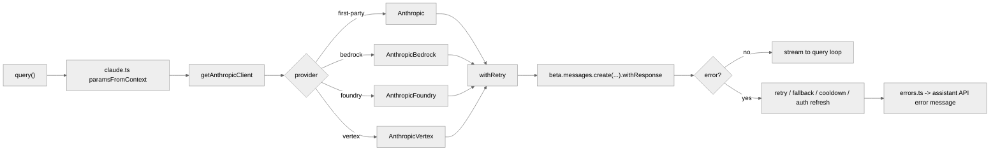

# API Provider 选择、请求构造、重试与错误治理

本篇梳理 `query()` 如何落到不同 provider、如何构造请求、如何重试，以及如何把底层错误翻译成会话消息。

**目录**

- [1. 为什么这一块不能只看 `claude.ts`](#1-为什么这一块不能只看-claudets)
- [2. `getAnthropicClient()` 是 provider 路由器，不只是 client factory](#2-getanthropicclient-是-provider-路由器不只是-client-factory)
- [3. 不同 provider 的认证与构造方式完全不同](#3-不同-provider-的认证与构造方式完全不同)
- [4. headers 与 fetch wrapper 也有 provider 语义](#4-headers-与-fetch-wrapper-也有-provider-语义)
- [5. `paramsFromContext()` 才是请求构造的真正核心](#5-paramsfromcontext-才是请求构造的真正核心)
- [6. beta headers 不是一次性常量，而是动态拼装](#6-beta-headers-不是一次性常量而是动态拼装)
- [7. thinking / effort / task budget 也都在请求层统一落地](#7-thinking-effort-task-budget-也都在请求层统一落地)
- [8. streaming 调用前后有清晰的性能观察点](#8-streaming-调用前后有清晰的性能观察点)
- [9. `withRetry()` 是项目自己的重试状态机](#9-withretry-是项目自己的重试状态机)
- [10. 529 重试是按 query source 分层的](#10-529-重试是按-query-source-分层的)
- [11. fast mode 失败后不是立刻崩，而是会降级/cooldown](#11-fast-mode-失败后不是立刻崩而是会降级cooldown)
- [12. fallback model 触发是显式事件，不是隐式黑箱](#12-fallback-model-触发是显式事件不是隐式黑箱)
- [13. unattended/persistent retry 说明系统支持“长时间无人值守等待”](#13-unattendedpersistent-retry-说明系统支持长时间无人值守等待)
- [14. context overflow 也在 retry 层被自动修正](#14-context-overflow-也在-retry-层被自动修正)
- [15. `errors.ts` 把 provider/raw error 翻译成对话内语义](#15-errorsts-把-providerraw-error-翻译成对话内语义)
- [16. 429 不是统一文案，而是会读新版 rate-limit headers](#16-429-不是统一文案而是会读新版-rate-limit-headers)
- [17. streaming 与 non-streaming fallback 的边界被谨慎处理](#17-streaming-与-non-streaming-fallback-的边界被谨慎处理)
- [18. 一张总图](#18-一张总图)
- [19. 关键源码锚点](#19-关键源码锚点)
- [20. 总结](#20-总结)

---

## 1. 为什么这一块不能只看 `claude.ts`

现有文档已经讲过：

- `query()` 会进入 `services/api/claude.ts`
- 请求参数里有 system prompt、betas、thinking、prompt cache

但如果只停在 `claude.ts`，仍然会漏掉四件关键事：

1. client 实际连接的是 first-party、Bedrock、Foundry 还是 Vertex。
2. 重试不是 SDK 默认行为，而是项目自己的 `withRetry()` 状态机。
3. 错误不是原样上抛，而是被系统性翻译成 assistant API error message。
4. provider 差异会反向影响请求参数、beta header、认证和 fallback 逻辑。

## 2. `getAnthropicClient()` 是 provider 路由器，不只是 client factory

关键代码：`src/services/api/client.ts:88-316`

它支持至少四类 provider：

1. first-party direct API
2. AWS Bedrock
3. Azure Foundry
4. Vertex AI

而且不是简单按 CLI 参数切换，而是主要受环境变量与 provider routing 控制，例如：

- `CLAUDE_CODE_USE_BEDROCK`
- `CLAUDE_CODE_USE_FOUNDRY`
- `CLAUDE_CODE_USE_VERTEX`

provider 选择在这里被当成：

> 进程级运行环境，而不是单次 query 的轻量选项。

## 3. 不同 provider 的认证与构造方式完全不同

关键代码：`src/services/api/client.ts:150-297`

### 3.1 first-party

- API key 或 Claude AI OAuth token
- 会走 `checkAndRefreshOAuthTokenIfNeeded()`
- 非订阅用户还会补 API key helper / auth token header

### 3.2 Bedrock

- region 可能按 model 特殊覆盖
- 可从缓存中刷新 AWS credentials
- 也支持 `AWS_BEARER_TOKEN_BEDROCK`

### 3.3 Foundry

- 有 API key 模式
- 没 key 时走 Azure AD token provider

### 3.4 Vertex

- 会在需要时刷新 GCP 凭证
- 还会小心避免 google-auth-library 触发 metadata server 超时

这不是抽象接口式“统一 provider”，而是：

> 在统一调用面之下，保留每个 provider 自己的认证与网络现实。

## 4. headers 与 fetch wrapper 也有 provider 语义

关键代码：

- `src/services/api/client.ts:101-148`
- `src/services/api/client.ts:356-385`

这里至少有三个值得注意的点：

1. 会统一补 `X-Claude-Code-Session-Id`、container/session 标识、`x-client-app` 等 header。
2. `buildFetch()` 只会在 first-party 且 base URL 合适时注入 `x-client-request-id`。
3. 自定义 header 和代理 fetch 也会在这一层统一接入。

`x-client-request-id` 的注释很说明问题：

- 就算超时拿不到 server request ID，也要能和服务端日志对齐

API 层不是单纯发送请求，而是已经内建了：

- 相关性追踪
- provider 兼容边界
- 可观测性

## 5. `paramsFromContext()` 才是请求构造的真正核心

关键代码：`src/services/api/claude.ts:1539-1731`

`claude.ts` 里真正把请求参数拼出来的，不是散落的辅助函数，而是：

- `paramsFromContext(retryContext)`

它会把这些因素同时考虑进去：

- model normalization
- messages + cache breakpoints
- system prompt
- tools / tool_choice
- betas
- max_tokens
- thinking
- temperature
- context_management
- `output_config`
- `speed`
- provider-specific extraBodyParams

request builder 不是静态 pure config，而是：

> 一个会被 retry context、provider、feature state、fast mode、structured output 等因素动态影响的闭包。

## 6. beta headers 不是一次性常量，而是动态拼装

关键代码：`src/services/api/claude.ts:1540-1701`

几个典型例子：

- Sonnet 1M 实验会动态加入 `CONTEXT_1M_BETA_HEADER`
- Bedrock 的某些 beta 要进 `extraBodyParams` 而不是普通 betas array
- structured outputs 需要额外 beta header
- fast mode、afk mode、cache editing 都有“header latched, body live”式处理

这个“latched”概念很重要，它背后的目标是：

- 让 cache key 尽量稳定
- 但又允许运行期行为继续动态变化

所以这里是“请求能力开关”和“prompt cache 稳定性”之间的一次精细平衡。

## 7. thinking / effort / task budget 也都在请求层统一落地

关键代码：`src/services/api/claude.ts:1567-1695`

这里集中处理：

- adaptive thinking vs budget thinking
- `effort`
- `task_budget`
- structured `output_config`

而且有明确限制：

- thinking 开启时 temperature 不能乱传
- budget 需要给实际 `max_tokens` 留出空间

`query()` 层只是在表达意图，真正把这些意图翻译成 provider 可接受参数的是 API 层。

## 8. streaming 调用前后有清晰的性能观察点

关键代码：`src/services/api/claude.ts:1779-1834`

这一段会显式打点：

- `query_client_creation_start`
- `query_client_creation_end`
- `query_api_request_sent`
- `query_response_headers_received`

然后通过：

- `anthropic.beta.messages.create(...).withResponse()`

拿到 response headers 和 stream。

API 层不仅关心“能不能请求成功”，也关心：

- client 初始化耗时
- 网络 TTFB
- headers 到达时间

## 9. `withRetry()` 是项目自己的重试状态机

关键代码：`src/services/api/withRetry.ts:170-516`

它不是 SDK `maxRetries` 的薄封装，而是：

- 自己维护 `RetryContext`
- 自己决定何时重建 client
- 自己区分 foreground / background query source
- 自己决定 529、429、401、cloud auth error、context overflow 的处理

retry 语义是 Claude Code 运行时的一部分，不是 SDK 默认策略。

## 10. 529 重试是按 query source 分层的

关键代码：

- `src/services/api/withRetry.ts:58-84` `FOREGROUND_529_RETRY_SOURCES`
- `src/services/api/withRetry.ts:318-323`

只有用户真正阻塞等待的 query source 才会对 529 进行重试，例如：

- `repl_main_thread`
- `sdk`
- `agent:*`
- `compact`
- `hook_agent`

而很多背景型请求则直接放弃，避免在容量抖动时放大负载。

这背后的设计判断非常明确：

> 不是所有失败都值得重试；是否重试取决于用户是否真的在等待这个结果。

## 11. fast mode 失败后不是立刻崩，而是会降级/cooldown

关键代码：`src/services/api/withRetry.ts:261-316`

如果 fast mode 下遇到：

- 429
- 529
- API 明确拒绝 fast mode

系统可能会：

- 短等待后重试，尽量保住 prompt cache
- 进入 cooldown，切回 standard speed
- 永久禁用本次 fast mode 语义

fast mode 不是简单的布尔开关，而是：

> 带有运行期退避与降级路径的优化模式。

## 12. fallback model 触发是显式事件，不是隐式黑箱

关键代码：

- `src/services/api/withRetry.ts:328-361`
- `src/services/api/withRetry.ts:160-166` `FallbackTriggeredError`

当连续 529 达到阈值时，若配置了 fallback model：

- 会打 telemetry
- 抛出 `FallbackTriggeredError`

这个设计把“主模型切到 fallback 模型”从内部细节提升成了一个显式状态转换。

## 13. unattended/persistent retry 说明系统支持“长时间无人值守等待”

关键代码：

- `src/services/api/withRetry.ts:90-99`
- `src/services/api/withRetry.ts:431-516`

如果启用了 unattended retry：

- 429/529 可以长时间持续重试
- 长等待会被拆成 heartbeat chunk
- QueryEngine 会收到系统消息，避免宿主误判 idle

retry 层已经考虑了：

- cron/daemon/unattended workload
- 长时间限流窗口
- host idle detection

## 14. context overflow 也在 retry 层被自动修正

关键代码：`src/services/api/withRetry.ts:383-428`

当 API 报 max tokens context overflow 时，retry 层会：

- 从错误中解析 `inputTokens` 和 `contextLimit`
- 计算安全 buffer
- 自动下调下一次请求的 `max_tokens`

retry 层不仅是在“等一下再试”，还在：

> 依据错误类型对下一次请求参数做有针对性的修正。

## 15. `errors.ts` 把 provider/raw error 翻译成对话内语义

关键代码：`src/services/api/errors.ts`

这层做的不是日志格式化，而是把底层错误转成 assistant message，例如：

- 统一 rate limit 消息
- prompt too long
- request too large
- image/PDF 错误
- auto mode beta unavailable
- repeated 529 overloaded

这意味着 API 失败在会话里不是“throw exception 结束”，而是：

> 被翻译成一条模型和用户都能继续处理的系统化消息。

## 16. 429 不是统一文案，而是会读新版 rate-limit headers

关键代码：`src/services/api/errors.ts:470-554`

如果 429 带有 unified quota headers，系统会解析：

- representative claim
- overage status
- reset 时间
- overage disabled reason

然后生成更具体的 quota/rate-limit 消息。

如果没有这些 header，又会退回成更接近原始 API 细节的“request rejected (429)”信息。

这说明错误翻译层的目标不是一味抽象，而是：

- 有结构化配额信息时给出更友好的解释
- 没结构化信息时保留真实失败细节

## 17. streaming 与 non-streaming fallback 的边界被谨慎处理

关键代码：

- `src/services/api/claude.ts:2310-2468`
- `src/services/api/claude.ts:2899` `cleanupStream()`

源码注释明确提到：

- 某些 mid-stream fallback 会导致重复 tool_use 风险
- stream/native resource 需要专门 cleanup

API 层最怕的不是单纯网络错误，而是：

> streaming 半途中失败后，把“已部分暴露给运行时的消息状态”重新收束回一致状态。

## 18. 一张总图

## 19. 关键源码锚点

| 主题 | 代码锚点 | 说明 |
| --- | --- | --- |
| provider client 路由 | `src/services/api/client.ts:88-316` | first-party / Bedrock / Foundry / Vertex |
| API key / OAuth headers | `src/services/api/client.ts:318-324` | first-party 认证补全 |
| request ID fetch wrapper | `src/services/api/client.ts:356-385` | first-party request correlation |
| 请求参数构造 | `src/services/api/claude.ts:1539-1731` | betas、thinking、cache、context_management |
| 真正发流式请求 | `src/services/api/claude.ts:1779-1834` | `withRetry` + `.withResponse()` |
| retry 状态机 | `src/services/api/withRetry.ts:170-516` | 429/529/401/cloud auth/context overflow |
| foreground 529 策略 | `src/services/api/withRetry.ts:58-84`, `318-323` | 按 query source 分层 |
| fallback / unattended retry | `src/services/api/withRetry.ts:328-516` | fallback model 与长期等待 |
| 错误转会话消息 | `src/services/api/errors.ts:439-930` | 429、413、prompt-too-long、media 错误 |
| repeated 529 信号 | `src/services/api/errors.ts:166`, `983-1015` | overloaded 错误统一表达 |

## 20. 总结

这条 API 主线的核心不是“把 messages 发给模型”，而是：

1. 按运行环境选择真正的 provider client 与认证路径。
2. 用 `paramsFromContext()` 把 cache、thinking、betas、fast mode 等状态统一折叠进请求。
3. 用 `withRetry()` 把重试、fallback、auth refresh、context overflow 修正做成显式状态机。
4. 用 `errors.ts` 把底层 provider/raw error 翻译成会话内可消费的 assistant message。

`services/api` 目录虽然位于 `query()` 之后，但实际承担了大量运行时策略。

---

## 关键函数清单

| 函数 | 文件 | 职责 |
|------|------|------|
| `getAnthropicClient()` | `src/services/api/claude.ts` | API client 工厂 + provider 路由器（Anthropic/GCP/Bedrock）|
| `paramsFromContext()` | `src/services/api/claude.ts` | 将 ToolUseContext 转换为 API 请求参数（cache/thinking/betas）|
| `withRetry()` | `src/services/api/claude.ts` | 重试状态机：可重试错误、auth refresh、context overflow 处理 |
| `buildApiError()` | `src/errors.ts` | 将 provider/raw 错误翻译为会话内可消费的 AssistantMessage |
| `checkPermissionsAndCallTool()` | `src/query.ts` | 权限校验后执行工具，可弹出 approval UI |
| `validateToolInput()` | — | Zod schema 校验工具入参 |
| `setupTelemetry()` | — | 初始化 telemetry sinks，监控错误率和请求延迟 |

---

## 代码质量评估

**优点**

- **`withRetry()` 显式状态机**：重试逻辑（可重试判断、auth refresh、fallback model 降级、context overflow 修正、unattended 等待）全部在一个函数中集中处理，而非散落在各调用点，行为可预测、可测试。
- **按 query source 分层重试**：`withRetry()` 区分 background/assistant/user source，不同来源使用不同重试窗口，避免 UI 层请求和后台任务竞争相同的重试 quota。
- **`errors.ts` 翻译层避免 raw error 泄漏**：provider 错误在 `buildApiError()` 统一翻译为会话内可消费的 `AssistantMessage`，不直接暴露 SDK 内部结构给上层。
- **Streaming fallback 有兜底**：streaming 失败后有非 streaming fallback 路径，生产环境网络不稳定时不会直接崩溃。

**风险与改进点**

- **`paramsFromContext()` 参数增长风险**：所有请求层标志（cache、thinking、betas、fast mode）都在此函数中处理，随时间参数列表可能无限增长，当前已经是高复杂度函数。
- **`fastModeFailureCooldown` 缺乏配置化**：fast mode 失败后的 cooldown 时间硬编码在函数内，云端速率限制严格时无法外部调整，运维灵活性差。
- **context overflow 修正逻辑与重试逻辑耦合**：`withRetry()` 同时承担了"重试"和"修正上下文"两种职责，若 context overflow 修正失败，错误路径与网络错误重试路径重叠，难以区分。
