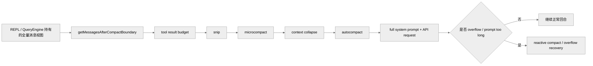
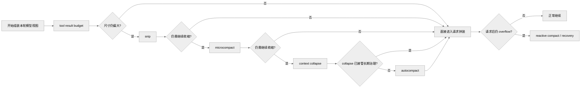
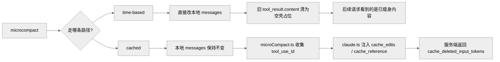
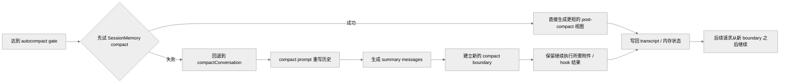
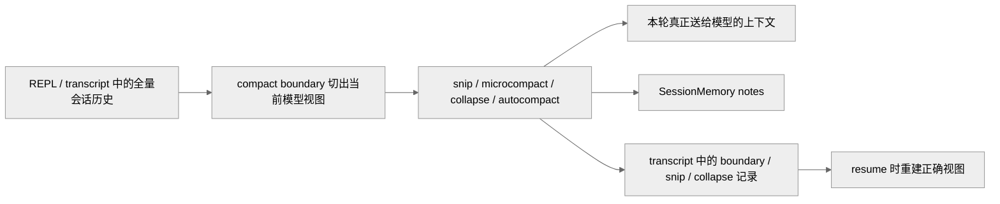

# Claude Code 的上下文管理系统

本篇只讨论一件事：Claude Code 如何在长会话里持续控制“真正送给模型的上下文”。

这里的“上下文管理”不是单一压缩器，而是一组按顺序尝试、彼此联动的机制。它们共同解决以下问题：

- 历史消息持续膨胀
- tool result 占满窗口
- prompt cache 冷却后旧内容继续占 token
- 长会话恢复时模型视图与 UI scrollback 不一致
- 真正 overflow 之后如何继续执行

需要先划清三个边界：

- 上下文管理不等于 prompt cache，但两者紧密耦合。
- 上下文管理不等于 transcript 持久化，但 transcript 负责把部分结果写盘并在 resume 时恢复。
- 上下文管理不等于 SessionMemory，不过 `SessionMemory compact` 是 autocompact 的第一条快路径。

---

## 1. 上下文管理在主链路里的位置

关键文件：

- `src/query.ts`
- `src/services/compact/*`
- `src/services/api/claude.ts`
- `src/utils/sessionStorage.ts`

`query()` 在每轮发请求前，并不是直接把 REPL 里的全部消息原样送去模型。真实路径是：

1. 先从 `compact boundary` 之后取模型视图。
2. 对 tool result 做预算裁剪。
3. 再进入上下文治理流水线。
4. 处理完后才进入系统提示词拼装和 API 请求。

### 1.1 主链路示意图

这张图里有两个容易混淆的点：

- `compact boundary` 不是压缩机制本身，而是当前模型视图的切断点。
- `reactive compact` 不在正常预防链路里，而是在真正出错后参与恢复。

---

## 2. 这不是“四层同时工作”，而是梯度体系

在代码层，更准确的顺序是：

1. tool result budget
2. `snip`
3. `microcompact`
4. `context collapse`
5. `autocompact`
6. 必要时 `reactive compact`

这条链路要这样理解：

- 不是每一轮都全部生效。
- `snip` 和 `microcompact` 可能在同一轮都运行。
- `microcompact` 自己还分成两条实现路径。
- `context collapse` 启用后会 suppress proactive autocompact。
- `autocompact` 命中后也不是立刻走传统 summary，而是先试 `SessionMemory compact`。

还需要明确一个反编译边界：

- `src/services/compact/snipCompact.ts`
- `src/services/compact/snipProjection.ts`
- `src/services/contextCollapse/*`

这几块在当前仓库里仍有 stub，因此一些结论来自 `query.ts`、`sessionStorage.ts`、`/context`、`QueryEngine.ts` 的调用点与注释，而不是完整实现体。

### 2.1 梯度触发示意图

这张图强调的是“按需逐层升级”，不是每轮固定跑完整条链。

---

## 3. 每一层机制分别做什么

### 3.1 `compact boundary`：模型视图的切断点

关键位置：`src/query.ts:365`、`src/utils/messages.ts`

`compact boundary` 的作用很简单：

- REPL 可以保留完整 scrollback
- 但模型看到的消息只从最近 boundary 之后开始

因此：

- UI 历史不等于模型上下文
- transcript 恢复时也需要围绕 boundary 重建正确链路

这是整套上下文管理能成立的基础前提。

### 3.2 tool result budget：第一层尺寸治理

关键位置：`src/query.ts:369-394`

这一步还不是完整压缩，但已经属于上下文治理的第一层。它的目标是：

- 避免单条 tool result 把上下文直接撑爆
- 在更重的压缩机制介入前，先做最小粒度的预算裁剪

如果只保留一个理解，可将它视为：

> 单条结果的尺寸上限控制，而不是整段历史的折叠。

### 3.3 `snip`：直接删消息，不做摘要

关键位置：

- `src/query.ts:396-410`
- `src/utils/sessionStorage.ts:1840-1983`
- `src/utils/messages.ts`

`snip` 是最轻的一层历史裁剪，它的特征非常明确：

- 直接删掉中间区段消息
- 不生成摘要替代旧内容
- 通过 parentUuid 重连消息链

代码里能确认的事实包括：

- `query.ts` 调用 `snipCompactIfNeeded(messagesForQuery)`
- 返回值包含 `messages`、`tokensFreed`、`boundaryMessage`
- `snipTokensFreed` 会继续传给 blocking-limit 判断和 `autocompact`
- `projectSnippedView()` 会把 snipped messages 从 API 视图中过滤掉
- headless/SDK 路径会在 replay 后直接裁掉内存中的消息，避免无 UI 长会话持续膨胀

因此，`snip` 的代码级定义是：

> 最细粒度、直接删消息、不做摘要的历史裁剪。

### 3.4 `microcompact`：对 tool result 做细粒度压缩

关键文件：

- `src/services/compact/microCompact.ts`
- `src/services/api/claude.ts`
- `src/query.ts`

`microcompact` 重点不是全局总结，而是：

- 对特定 tool result 做更细粒度的压缩
- 或在支持时利用 cache editing 减少输入 token

它有两条明确不同的实现路径。

#### 3.4.1 time-based microcompact

特征：

- 当服务端 prompt cache 大概率已经冷掉时触发
- 直接把更老的 `tool_result.content` 清成 `[Old tool result content cleared]`
- 会重置 microcompact state，并通知 prompt-cache break detection

这是一条 **内容级压缩** 路径。

#### 3.4.2 cached microcompact

特征：

- 只在主线程、支持模型、feature 打开时可用
- 本地消息不改
- `microCompact.ts` 只收集待删的 `tool_use_id`
- `claude.ts` 在请求体里插入 `cache_edits` 和 `cache_reference`
- API 返回后，`query.ts` 再根据 `cache_deleted_input_tokens` 计算实际释放量

这是一条 **cache-layer editing** 路径。

因此，`microcompact` 不能被统一描述成“它不改消息内容”。代码上必须区分：

- cached microcompact：不改本地消息，改 API cache 视图
- time-based microcompact：直接改本地消息内容

#### 3.4.3 `microcompact` 双路径示意图

如果只想抓住本质，这一层做的是“优先处理 tool result 的细粒度体积问题”，而且代码里同时存在内容层和 cache 层两种实现。

### 3.5 `context collapse`：维护投影视图，不是简单摘要

关键位置：

- `src/query.ts:428-447`
- `src/commands/context/context.tsx`
- `src/utils/sessionStorage.ts`

`context collapse` 的设计重点不是“生成一条摘要消息”，而是：

- 维护 collapse store
- 每轮按 commit log 重放成投影视图
- 让长会话能持续复用 collapse 结果

当前可稳定确认的事实包括：

- collapse summary 不住在 REPL message array 里
- `/context` 必须先 `projectView()` 才能接近模型真实视图
- transcript 会把 commit 与 snapshot 写成 `marble-origami-commit` / snapshot entries
- overflow 恢复时会先调用 `contextCollapse.recoverFromOverflow()`

从代码口径看，它更接近：

> 类似 commit log 的 collapse store + 每轮投影视图。

更重要的是，它和 autocompact 不是并列兜底关系：

- `autoCompact.ts` 明确写明，context collapse 打开后，proactive autocompact 会被 suppress

### 3.6 `autocompact`：最后的重型上下文重写

关键文件：

- `src/services/compact/autoCompact.ts`
- `src/services/compact/compact.ts`
- `src/services/compact/prompt.ts`

`autocompact` 是更强的一层，但它也不是“把历史压成一段话”这么简单。

#### 3.6.1 触发阈值

源码里稳定可确认的公式是：

- `effectiveContextWindow = getContextWindowForModel(model) - reservedTokensForSummary`
- `autoCompactThreshold = effectiveContextWindow - 13_000`

因此，最准确的表述是：

> autocompact 在 effective context window 基础上预留 13,000 token buffer。

这不是一个在所有模型和配置下固定不变的百分比阈值。

#### 3.6.2 先试 `SessionMemory compact`

autocompact 命中后，会先试：

- `trySessionMemoryCompaction()`

只有这条快路径走不通时，才回退到：

- `compactConversation()`

这就是为什么 autocompact 不能被描述成“始终调一次模型写一段大摘要”。

#### 3.6.3 legacy full compact summary

传统 compact 路径下，`NO_TOOLS_PREAMBLE` 会进入 compact prompt，强制 compaction agent：

- 只输出 `<analysis> + 
`
- 不调用任何工具

这条路径最终产出的也不是“单段摘要文本”，而是：

- `compact boundary`
- `summary messages`
- 恢复上下文需要的附件和 hook 结果

所以 autocompact 的代码级定义更接近：

> 最后的重型上下文重写机制，产物是新的 post-compact 上下文包。

#### 3.6.4 `autocompact` 产物示意图

### 3.7 `reactive compact`：真实失败后的恢复式压缩

当真正出现：

- API overflow
- prompt-too-long
- 其他上下文相关失败

系统并不是立即终止，而会进入 reactive compact / overflow recovery 路径。

这说明 Claude Code 的上下文管理同时包含两类能力：

- 预防式压缩
- 失败后的恢复式压缩

---

## 4. 它如何与 SessionMemory、transcript、compact prompt 对接

### 4.1 `SessionMemory` 是 autocompact 的第一条快路径

`SessionMemory` 本身不是长期记忆后端，但它直接参与上下文管理：

- 命中 autocompact gate 后，先试 `SessionMemory compact`
- 这条路径会利用已有 notes 保留最近消息尾部
- 目标是尽量避免直接进入传统 full compact summary

所以，`SessionMemory` 在这里扮演的是：

> 当前会话续航层，同时也是 compact 的低成本快路径。

### 4.2 transcript 会把上下文管理结果写盘

关键文件：`src/utils/sessionStorage.ts`

上下文管理的若干结果不会只存在于内存中：

- `compact boundary` 会切断消息链
- `snip` 会删除中间区段并在 resume 时重连 parentUuid
- `context collapse` 的 commit / snapshot 会写入 transcript

这意味着 transcript 不是单纯的聊天记录，而是：

> 长会话上下文治理结果的持久化底座。

### 4.3 compact prompt 属于这套系统的“重写器”

关键文件：`src/services/compact/prompt.ts`

compact prompt 的职责不是普通摘要，而是上下文重编译。  
它要求模型输出结构化 summary，并为继续执行做准备。

因此 compact prompt 更适合被理解为：

> 上下文管理系统中的重型重写器，而不是独立总结工具。

### 4.4 全量会话、模型视图与写盘结果的关系

---

## 5. 与性能、缓存、恢复文档的关系

上下文管理现在独立成篇后，相关文档的分工可以明确为：

- [03-agent-loop.md](./03-agent-loop.md)
  负责 `query()` 主循环和调用时序，只保留上下文管理的入口位置
- [08-performance.md](./08-performance.md)
  负责性能、cache、GC、观测和长会话稳定性，只保留上下文管理的性能侧影响
- [10-session-resume.md](./10-session-resume.md)
  负责 transcript / resume 如何恢复 boundary、snip、collapse 结果
- [12-prompt-system.md](./12-prompt-system.md)
  负责 compact prompt 和相关二级 prompt 的提示词层设计

如果需要抓主线，推荐阅读顺序是：

1. 本篇 [11-context-management.md](./11-context-management.md)
2. [03-agent-loop.md](./03-agent-loop.md)
3. [08-performance.md](./08-performance.md)
4. [10-session-resume.md](./10-session-resume.md)
5. [12-prompt-system.md](./12-prompt-system.md)

---

## 6. 关键源码锚点

| 主题 | 代码锚点 | 说明 |
| --- | --- | --- |
| query 入口中的上下文治理顺序 | `src/query.ts:365-468` | boundary、budget、snip、microcompact、collapse、autocompact |
| `snip` 调用点 | `src/query.ts:396-410` | 最细粒度删消息路径 |
| `microcompact` 主体 | `src/services/compact/microCompact.ts` | time-based 与 cached 两条路径 |
| cache editing 请求拼装 | `src/services/api/claude.ts` | `cache_edits` / `cache_reference` |
| `context collapse` 投影入口 | `src/query.ts`、`src/commands/context/context.tsx` | `projectView()` 语义 |
| autocompact gate | `src/services/compact/autoCompact.ts` | 阈值、失败熔断、SessionMemory 快路径 |
| compact prompt | `src/services/compact/prompt.ts` | `NO_TOOLS_PREAMBLE` 与结构化 summary |
| transcript 中的 snip / collapse 恢复 | `src/utils/sessionStorage.ts` | boundary、snip relink、collapse commit/snapshot |

---

## 7. 总结

Claude Code 的上下文管理系统并不是一个单独模块，而是 query 主回合前的一条治理流水线：

1. 先用 boundary 和 tool-result budget 控制模型视图
2. 再按轻到重的顺序尝试 `snip -> microcompact -> context collapse -> autocompact`
3. 真正失败时，再进入 reactive recovery
4. 其中 `SessionMemory`、transcript、compact prompt 都分别承担快路径、持久化、重写器角色

如果只保留一句话，那么它应当是：

> Claude Code 不是把“历史越积越长地喂给模型”，而是在每轮请求前重新计算一次“这次真正值得进入上下文的视图”。
