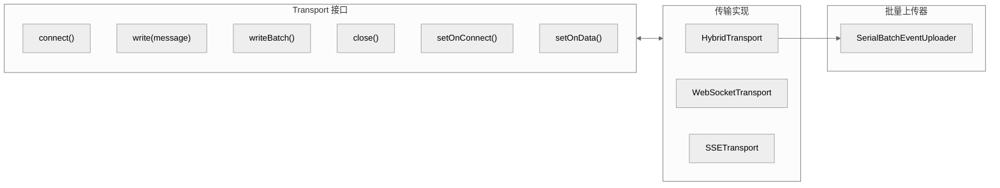
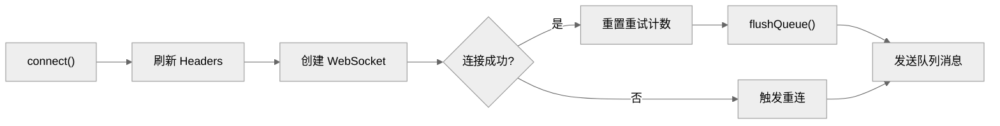
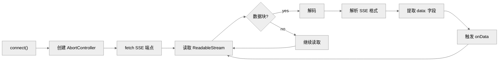
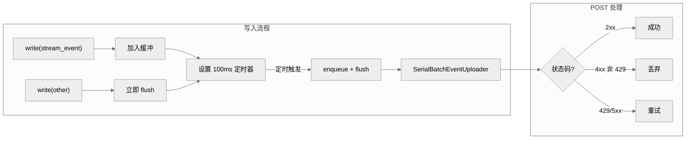
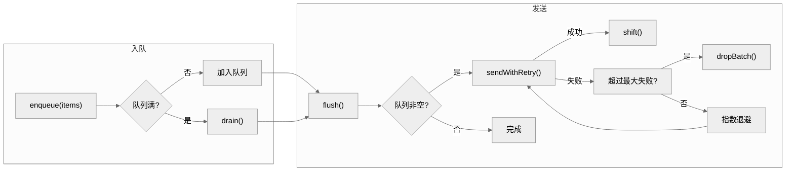
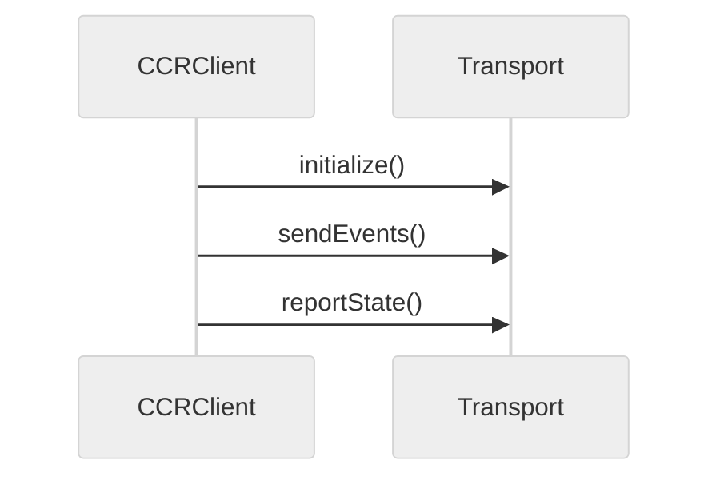
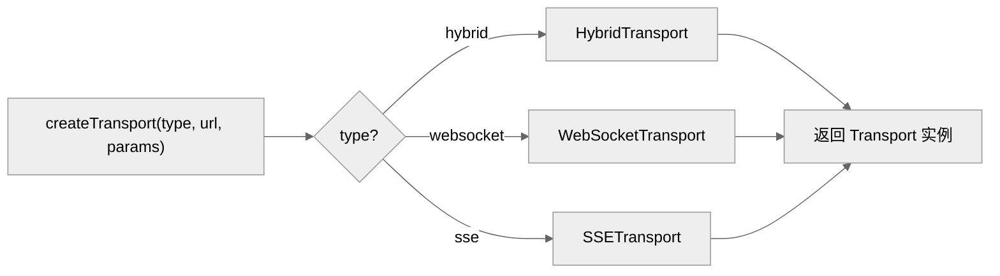
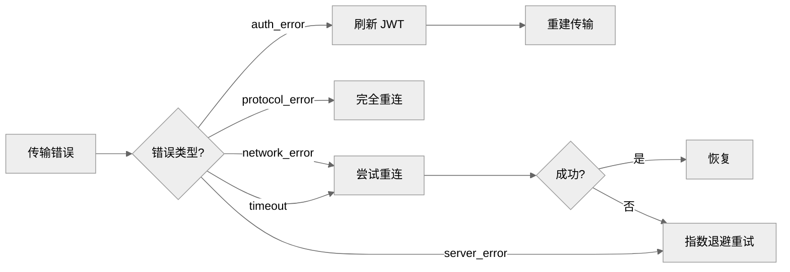
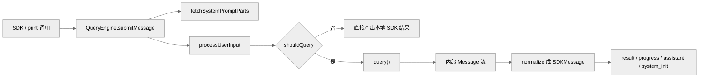

---
layout: content
title: "Claude Code 的传输系统"
---
# Claude Code 的传输系统


**目录**

- [1. 传输系统概述](#1-传输系统概述)
- [2. 传输接口定义](#2-传输接口定义)
- [3. WebSocket 传输](#3-websocket-传输)
- [4. SSE 传输](#4-sse-传输)
- [5. 混合传输 (HybridTransport)](#5-混合传输-hybridtransport)
- [6. 批量事件上传器](#6-批量事件上传器)
- [7. CCR 客户端](#7-ccr-客户端)
- [8. Worker 状态上传器](#8-worker-状态上传器)
- [9. 传输工厂](#9-传输工厂)
- [10. 错误处理与恢复](#10-错误处理与恢复)
- [10. 补充：关键实现细节](#10-补充关键实现细节)
- [附录：QueryEngine 与非交互路径（原 17-queryengine-sdk）](#附录queryengine-与非交互路径原-17-queryengine-sdk)
- [1. 为什么还要专门讲 `QueryEngine`](#1-为什么还要专门讲-queryengine)
- [2. `QueryEngine` 的角色](#2-queryengine-的角色)
- [3. `submitMessage()` 是非交互模式的总入口](#3-submitmessage-是非交互模式的总入口)
- [4. `submitMessage()` 前半段：构造本次 headless turn](#4-submitmessage-前半段构造本次-headless-turn)
- [4.1 先拉配置并固定 cwd](#41-先拉配置并固定-cwd)
- [4.2 包装 `canUseTool` 以跟踪 permission denials](#42-包装-canusetool-以跟踪-permission-denials)
- [4.3 预取 system prompt parts](#43-预取-system-prompt-parts)
- [5. structured output 在这里被专门接管](#5-structured-output-在这里被专门接管)
- [6. `processUserInputContext`：在 headless 环境里重建 ToolUseContext 近似物](#6-processuserinputcontext在-headless-环境里重建-toolusecontext-近似物)
- [7. orphaned permission 在 QueryEngine 里有专门恢复逻辑](#7-orphaned-permission-在-queryengine-里有专门恢复逻辑)
- [8. 然后它也会走 `processUserInput(...)`](#8-然后它也会走-processuserinput)
- [9. transcript 持久化在 QueryEngine 里被非常认真地处理](#9-transcript-持久化在-queryengine-里被非常认真地处理)
- [10. 然后发一个 `system_init` 给 SDK 消费方](#10-然后发一个-system_init-给-sdk-消费方)
- [11. 如果本次输入不需要 query，会直接产出本地结果](#11-如果本次输入不需要-query会直接产出本地结果)
- [12. 真正进入 query 后，它主要做三类工作](#12-真正进入-query-后它主要做三类工作)
- [13. 为什么 `mutableMessages` 与 `messages` 要并存](#13-为什么-mutablemessages-与-messages-要并存)
- [14. QueryEngine 与 REPL 的差异总结](#14-queryengine-与-repl-的差异总结)
- [15. QueryEngine 与 `query()` 的关系](#15-queryengine-与-query-的关系)
- [16. 非交互路径总体图](#16-非交互路径总体图)
- [17. 关键源码锚点](#17-关键源码锚点)
- [18. 总结](#18-总结)

---

## 1. 传输系统概述

本篇讨论 WebSocket、SSE、HybridTransport 与批量上传器如何构成 Claude Code 的网络传输层。

如果要继续看这层能力如何被组织成远程桥接与会话控制，请继续看 [23-bridge-system.md](./21-bridge-system.md)。



## 2. 传输接口定义

**位置**: `src/cli/transports/transport.ts`

```typescript
export interface Transport {
  // 连接管理
  connect(): void
  close(): void

  // 写入
  write(message: StdoutMessage): Promise<void>
  writeBatch(messages: StdoutMessage[]): Promise<void>

  // 回调设置
  setOnConnect(handler: () => void): void
  setOnData(handler: (data: string) => void): void
  setOnClose(handler: (code?: number) => void): void
  setOnError(handler: (error: Error) => void): void

  // 状态
  getLastSequenceNum(): number
  reportState(state: 'idle' | 'running' | 'requires_action'): void
}
```

## 3. WebSocket 传输

**位置**: `src/cli/transports/WebSocketTransport.ts`

### 3.1 基本实现



### 3.2 重连机制

```typescript
private handleReconnect(): void {
  if (this.reconnectAttempts >= this.options?.maxReconnectAttempts ?? 5) {
    this.onClose?.(1006)  // 异常关闭
    return
  }

  // 指数退避
  const delay = Math.min(
    1000 * 2 ** this.reconnectAttempts,
    30000  // 最大 30 秒
  )

  this.reconnectTimer = setTimeout(() => {
    this.reconnectAttempts++
    this.connect()
  }, delay)
}
```

## 4. SSE 传输

**位置**: `src/cli/transports/SSETransport.ts`

### 4.1 SSE 客户端实现



## 5. 混合传输 (HybridTransport)

**位置**: `src/cli/transports/HybridTransport.ts`

### 5.1 设计原理



### 5.2 实现细节

```typescript
export class HybridTransport extends WebSocketTransport {
  private postUrl: string
  private uploader: SerialBatchEventUploader<StdoutMessage>
  private streamEventBuffer: StdoutMessage[] = []

  // 写入消息
  async write(message: StdoutMessage): Promise<void> {
    if (message.type === 'stream_event') {
      // 缓冲流事件
      this.streamEventBuffer.push(message)
      if (!this.streamEventTimer) {
        this.streamEventTimer = setTimeout(
          () => this.flushStreamEvents(),
          BATCH_FLUSH_INTERVAL_MS
        )
      }
      return
    }

    // 非流事件: 立即 flush 缓冲 + POST
    await this.uploader.enqueue([...this.takeStreamEvents(), message])
    return this.uploader.flush()
  }

  // 单次 HTTP POST
  private async postOnce(events: StdoutMessage[]): Promise<void> {
    const sessionToken = getSessionIngressAuthToken()

    const response = await axios.post(
      this.postUrl,
      { events },
      {
        headers: {
          Authorization: `Bearer ${sessionToken}`,
          'Content-Type': 'application/json',
        },
        timeout: POST_TIMEOUT_MS,
      }
    )

    if (response.status >= 200 && response.status < 300) {
      return  // 成功
    }

    if (response.status >= 400 && response.status < 500 && response.status !== 429) {
      return  // 永久失败
    }

    throw new Error(`POST failed with ${response.status}`)  // 可重试
  }
}
```

## 6. 批量事件上传器

**位置**: `src/cli/transports/SerialBatchEventUploader.ts`

### 6.1 核心功能



### 6.2 发送与重试

```typescript
private async sendWithRetry(batch: T[]): Promise<void> {
  let attempts = 0

  while (true) {
    try {
      await this.config.send(batch)
      return  // 成功
    } catch (error) {
      attempts++

      // 计算延迟: 指数退避 + 抖动
      const baseDelay = Math.min(
        this.config.baseDelayMs * 2 ** attempts,
        this.config.maxDelayMs
      )
      const jitter = (Math.random() - 0.5) * 2 * this.config.jitterMs
      const delay = baseDelay + jitter

      await sleep(delay)
    }
  }
}
```

## 7. CCR 客户端

**位置**: `src/cli/transports/ccrClient.ts`

CCR (Cloud Code Runtime) 是远程执行协议：



## 8. Worker 状态上传器

**位置**: `src/cli/transports/WorkerStateUploader.ts`

### 8.1 后台状态报告

```typescript
export class WorkerStateUploader {
  private pending: StateUpdate[] = []
  private timer: ReturnType<typeof setInterval> | null = null

  constructor(private transport: Transport) {
    // 定期发送状态
    this.timer = setInterval(() => {
      this.flush()
    }, 1000)
  }

  push(update: StateUpdate): void {
    this.pending.push(update)
  }

  private async flush(): Promise<void> {
    if (this.pending.length === 0) return

    const updates = this.pending.splice(0, this.pending.length)

    await this.transport.write({
      type: 'worker_state',
      updates,
    })
  }
}
```

## 9. 传输工厂

**位置**: `src/cli/transports/transportUtils.ts`



## 10. 错误处理与恢复

### 10.1 错误类型

```typescript
enum TransportErrorType {
  NETWORK_ERROR = 'network_error',
  TIMEOUT = 'timeout',
  AUTH_ERROR = 'auth_error',      // 401
  PROTOCOL_ERROR = 'protocol_error', // 409
  SERVER_ERROR = 'server_error',  // 5xx
}
```

### 10.2 恢复策略



## 10. 补充：关键实现细节

### 10.1 具体退避参数

SerialBatchEventUploader 的 sendWithRetry 使用以下参数：
- baseDelayMs: 1000（1 秒）
- maxDelayMs: 30000（30 秒）
- 抖动：每次延迟加上 0-50% 的随机值
- maxConsecutiveFailures: 5（超过后永久标记为 failed）

### 10.2 HTTP POST 状态码处理

HybridTransport 的 POST 请求处理逻辑：
- 2xx：成功，继续下一批
- 401：触发 JWT 刷新，然后重建整个传输层
- 409：协议错误（epoch 不匹配），触发完全重连
- 429：指数退避重试
- 其他 4xx：永久失败，不重试
- 5xx：指数退避重试

### 10.3 CCR 客户端

Cloud Code Runtime (CCR) 客户端是一个独立的通信通道，用于远程会话管理。它不走 HybridTransport，而是直接 HTTP POST。CCR 客户端负责：
- initialize()：注册 worker
- sendEvents()：上报事件
- reportState()：定期状态快照

WorkerStateUploader 以 1 秒间隔批量上报 worker 状态，包括当前活动的工具、消息队列长度等。

### 10.4 流式传输的背压控制

streamEventBuffer 使用固定的 100ms 批量间隔，但当缓冲区超过 1000 条消息时（实际上不太可能），会立即 flush。这个设计在 99.9% 的情况下是按时间触发的，只在极端流量下才触发大小限制。

---

*文档版本: 1.0*
*分析日期: 2026-03-31*

---

## 附录：QueryEngine 与非交互路径（原 17-queryengine-sdk）

本篇说明没有 REPL 时，系统如何通过 `QueryEngine` 复用同一套 query 内核。

## 1. 为什么还要专门讲 `QueryEngine`

前面几篇文档主要以交互式 REPL 为主线，但这个仓库并不只有一种运行方式。

当系统处于：

- SDK
- print/headless
- 某些远程/控制模式

时，核心执行入口会变成：

- `src/QueryEngine.ts`

这一层主要解释以下问题：

1. 非交互模式如何复用 `query()` 主循环。
2. 没有 REPL 时，消息、权限、transcript、structured output 怎么处理。
3. SDK 看到的消息流是如何从内部消息归一化出来的。

## 2. `QueryEngine` 的角色

关键代码：`src/QueryEngine.ts:184-207`

它维护的内部状态包括：

- `config`
- `mutableMessages`
- `abortController`
- `permissionDenials`
- `totalUsage`
- `readFileState`
- `discoveredSkillNames`
- `loadedNestedMemoryPaths`

`QueryEngine` 不是一次性的纯函数，而是：

> 面向一个 headless 会话的执行控制器

## 3. `submitMessage()` 是非交互模式的总入口

关键代码：`src/QueryEngine.ts:209-1047`

这个方法本质上是在模拟 REPL 那条交互主链路，但去掉了 UI，换成 SDKMessage 流输出。

## 4. `submitMessage()` 前半段：构造本次 headless turn

## 4.1 先拉配置并固定 cwd

关键代码：`src/QueryEngine.ts:213-240`

这一步会拿到：

- `cwd`
- `commands`
- `tools`
- `mcpClients`
- `thinkingConfig`
- `maxTurns`
- `maxBudgetUsd`
- `taskBudget`
- `customSystemPrompt`
- `appendSystemPrompt`
- `jsonSchema`

然后 `setCwd(cwd)`。

结论如下：

- 非交互模式仍然是“项目上下文敏感”的。

## 4.2 包装 `canUseTool` 以跟踪 permission denials

关键代码：`src/QueryEngine.ts:243-271`

在 SDK 模式下，权限拒绝不仅要影响执行，还要写进最终 result：

- `permission_denials`

因此实现里包了一层 wrapper。

## 4.3 预取 system prompt parts

关键代码：`src/QueryEngine.ts:284-325`

这里调用：

- `fetchSystemPromptParts(...)`

然后再拼：

- default system prompt
- custom system prompt
- memory mechanics prompt
- append system prompt

### 4.3.1 memory mechanics prompt 是一个重要区别

如果 SDK 调用者提供了 custom system prompt，且开启了 memory path override，QueryEngine 会额外注入 memory mechanics prompt。

这意味着：

- SDK 调用方可能接入了自定义 memory directory
- 因此需要显式告诉模型如何使用这套 memory 机制

## 5. structured output 在这里被专门接管

关键代码：`src/QueryEngine.ts:327-333`

如果：

- `jsonSchema` 存在
- 当前 tools 里有 synthetic output tool

则会注册 structured output enforcement。

QueryEngine 比 REPL 更强调：

- 可程序化输出约束

## 6. `processUserInputContext`：在 headless 环境里重建 ToolUseContext 近似物

关键代码：`src/QueryEngine.ts:335-395`

虽然没有 REPL，但 QueryEngine 仍然要构造一个足够完整的上下文对象，包含：

- messages
- commands/tools/mcpClients
- `getAppState / setAppState`
- `abortController`
- `readFileState`
- nested memory / dynamic skill tracking
- attribution 与 file history 更新器
- `setSDKStatus`

headless 模式不是简化版 runtime，而是“去 UI 的同内核 runtime”。

## 7. orphaned permission 在 QueryEngine 里有专门恢复逻辑

关键代码：`src/QueryEngine.ts:397-408`

如果存在 `orphanedPermission`，它会在本轮输入开始前先处理掉。

SDK/远程等模式会考虑：

- 上一次会话可能停在“等待权限”中间态

并试图恢复。

## 8. 然后它也会走 `processUserInput(...)`

关键代码：`src/QueryEngine.ts:410-428`

关键点在于：

- QueryEngine 没有另写一套输入语义逻辑。
- 它复用了与 REPL 相同的 `processUserInput(...)`。

所以 slash command、附件、技能 prompt、hook 注入等语义，在非交互模式里仍然生效。

## 9. transcript 持久化在 QueryEngine 里被非常认真地处理

关键代码：`src/QueryEngine.ts:436-463`

源码注释点明：

- 如果用户消息不在进入 query 前就写入 transcript，那么进程中途被杀时，resume 可能找不到任何有效会话。

因此 QueryEngine 会：

- 在进入 query 前就持久化用户消息
- bare 模式 fire-and-forget
- 否则必要时 await 并 flush

这是一段很值得学习的“恢复性设计”。

## 10. 然后发一个 `system_init` 给 SDK 消费方

关键代码：`src/QueryEngine.ts:529-551`

它会把当前 headless session 的能力快照发出去，包括：

- tools
- mcpClients
- model
- permissionMode
- commands
- agents
- skills
- enabled plugins
- fastMode

这让 SDK consumer 在第一条真正业务消息前，就知道当前 session 环境。

## 11. 如果本次输入不需要 query，会直接产出本地结果

关键代码：`src/QueryEngine.ts:556-637`

这和 REPL 中本地 slash command 的行为一致，只不过这里会把结果转成 SDK 可消费的消息类型：

- user replay
- local command output as assistant-style message
- compact boundary message
- 最终 success result

QueryEngine 也承担了协议转换责任。

## 12. 真正进入 query 后，它主要做三类工作

关键代码：`src/QueryEngine.ts:675-1047`

### 12.1 把内部消息记录到 `mutableMessages` 与 transcript

它会处理：

- assistant
- progress
- attachment
- user
- system compact boundary

并按需要记录 transcript。

### 12.2 把内部消息归一化成 SDKMessage

例如：

- assistant -> SDK assistant message
- progress -> SDK progress
- compact boundary -> SDK system compact message
- tool use summary -> SDK summary

### 12.3 管理 headless 模式的终止条件

包括：

- max turns
- max budget USD
- structured output retries
- result success / error_during_execution

## 13. 为什么 `mutableMessages` 与 `messages` 要并存

从实现细节可看出：

- `mutableMessages` 是 QueryEngine 自己维护的长期会话视图
- `messages` 更像本轮 query 期间使用和写 transcript 的工作数组

这样做有助于：

- 在 compact boundary 后主动裁剪旧消息
- 在 SDK 会话里减少长时间堆积

## 14. QueryEngine 与 REPL 的差异总结

| 维度 | REPL | QueryEngine |
| --- | --- | --- |
| 入口 | `onSubmit` / `handlePromptSubmit` | `submitMessage()` |
| 输出 | 更新 UI 状态 | 产出 `SDKMessage` 流 |
| 权限交互 | 可弹对话框 | 通过 handler/control channel |
| transcript | `useLogMessages` 等 UI 路径配合 | 引擎内显式控制 |
| structured output | 可用但不是主目标 | 是重要能力，专门追踪重试上限 |
| 会话环境展示 | UI 上下文 | `system_init` 消息 |

## 15. QueryEngine 与 `query()` 的关系

关系可以概括为：

- `query()` 是内核状态机。
- `QueryEngine` 是 headless 编排器与协议适配层。

它负责：

- 在进入 `query()` 前把 headless session 组织好。
- 在 `query()` 返回消息时把其翻译成 SDK 协议。

## 16. 非交互路径总体图



## 17. 关键源码锚点

| 主题 | 代码锚点 | 说明 |
| --- | --- | --- |
| QueryEngine 状态 | `src/QueryEngine.ts:184-207` | headless session 控制器内部状态 |
| submitMessage 开始 | `src/QueryEngine.ts:209-325` | system prompt parts、memory prompt、structured output enforcement |
| processUserInputContext 构造 | `src/QueryEngine.ts:335-395` | headless 下的运行时上下文 |
| processUserInput 复用 | `src/QueryEngine.ts:410-428` | 与 REPL 共享输入语义层 |
| 预先写 transcript | `src/QueryEngine.ts:436-463` | resume 正确性的关键 |
| system_init | `src/QueryEngine.ts:529-551` | 向 SDK 暴露能力快照 |
| 进入 query | `src/QueryEngine.ts:675-686` | 复用 query 内核 |
| result / budget / structured output 结束条件 | `src/QueryEngine.ts:971-1047` | headless 模式特有结果控制 |

## 18. 总结

`QueryEngine` 证明了这套工程真正复用的是“内核”，不是“界面”。

- REPL 负责交互表现。
- QueryEngine 负责 headless 编排。
- 两者共用同一个输入语义层、同一个 query 内核、同一套工具与权限机制。

从架构质量上看，这是一种很强的分层：UI 可以换，协议可以换，但对话执行内核仍然稳定复用。

---

## 关键函数清单

| 函数/类型 | 文件 | 职责 |
|----------|------|------|
| `Anthropic` client | `@anthropic-ai/sdk` | 官方 SDK client：管理 API key、base URL、重试策略 |
| `client.messages.stream()` | `@anthropic-ai/sdk` | 流式消息接口：返回 async iterable 事件流 |
| `ApiStream` | `src/api/stream.ts` | 对 SDK stream 的封装：标准化事件格式，支持取消和超时 |
| `withExponentialBackoff()` | `src/utils/retry.ts` | 指数退避重试：处理 429/529/5xx 响应 |
| `ApiKeyManager` | `src/auth/apiKey.ts` | API key 来源链：env `ANTHROPIC_API_KEY` → config file |
| `BaseURLConfig` | `src/config/types.ts` | base URL 配置：支持 custom endpoint（企业代理/本地测试） |

---

## 代码质量评估

**优点**

- **官方 SDK 保证兼容性**：`@anthropic-ai/sdk` 由 Anthropic 官方维护，协议变更时随 SDK 升级自动适配，无需手写 HTTP 层。
- **流式 API 原生支持**：SDK 提供 async iterable 流式接口，TypeScript 类型安全，event 类型完整覆盖（text/tool/usage）。
- **custom base URL 支持**：允许配置代理 endpoint，适配企业内网 API 网关和本地开发测试环境。

**风险与改进点**

- **SDK 版本升级可能引入 breaking change**：`@anthropic-ai/sdk` 未锁定 patch 版本，次版本升级可能导致流事件格式变化。
- **重试逻辑依赖 SDK 内置策略**：SDK 内置重试参数（maxRetries）固定，高延迟/高波动环境可能需要更激进的退避策略，但无法从外部覆盖。
- **stream 取消信号不统一**：ApiStream 的取消机制（AbortController）与 SDK 内部重试的取消时机存在竞态，可能导致取消后仍有 event 流出。
