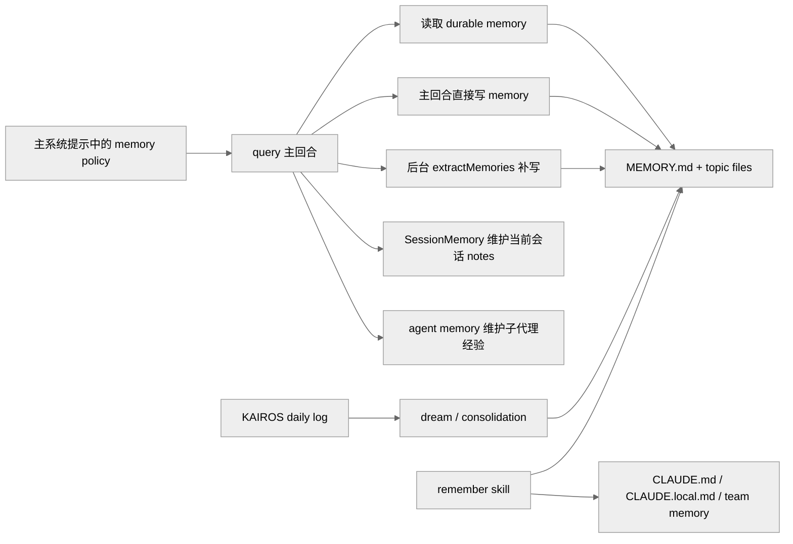
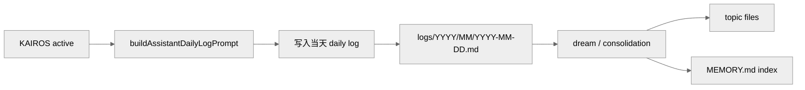

# Claude Code 的记忆系统

本篇只回答一个问题：Claude Code 在源码里到底有哪些“记忆相关机制”，它们分别解决什么问题，又如何串成一条完整的持久化主线。

结论先行：

- 代码里没有一个字面上的“七层记忆管理器”。
- 源码中的原生分类不是 Tulving 式的 `episodic / semantic / procedural`，而是面向产品和工程实现的多套子系统。
- 真正需要区分的是四件事：长期 durable memory、KAIROS daily log、当前会话续航、后台/人工治理。

---

## 1. 先建立总图

Claude Code 的 memory 相关能力可以先按职责分成八类：

| 子系统 | 关键源码 | 存储形态 | 作用域 | 主要用途 |
| --- | --- | --- | --- | --- |
| auto-memory | `src/memdir/memdir.ts`、`src/memdir/memoryTypes.ts` | `MEMORY.md` + topic files | 用户 / 项目 | 保存长期有价值、又不能从仓库直接推导出的上下文 |
| team memory | `src/memdir/teamMemPrompts.ts` | private/team 双目录 | 个人 / 团队 | 把 durable memory 从个人扩展到协作范围 |
| relevant memory recall | `src/memdir/findRelevantMemories.ts`、`src/utils/attachments.ts` | attachment 注入 | 当前 turn | 在查询时只注入最相关的 memory files |
| KAIROS daily log | `src/memdir/memdir.ts`、`src/memdir/paths.ts` | `logs/YYYY/MM/YYYY-MM-DD.md` | assistant 会话 | 把长期写入改成 append-only 日志流 |
| dream / consolidation | `src/services/autoDream/*` | 从 logs/transcripts 回写 topic files | durable memory | 把日志和近期信号蒸馏回长期记忆 |
| SessionMemory | `src/services/SessionMemory/prompts.ts` | 当前会话 notes 文件 | 当前 session | 保持 compact / resume 之后的会话连续性 |
| agent memory | `src/tools/AgentTool/agentMemory.ts` | 每类 agent 自己的 `MEMORY.md` | agent 级 | 给子代理保留跨会话、跨任务经验 |
| `remember` skill | `src/skills/bundled/remember.ts` | 审阅报告 | 人工治理 | 审查 memory、`CLAUDE.md`、`CLAUDE.local.md` 的边界与提升路径 |

### 1.1 总体结构示意图



这张图对应三个边界：

- `MEMORY.md + topic files` 是 durable memory 的主存储形态。
- `SessionMemory` 不属于长期记忆，而属于当前会话续航。
- `KAIROS` 不是在普通 memory 上“再叠一层”，而是把长期写入路径切换成 `daily log -> consolidation`。

### 1.2 代码里真正存在的分类

如果只看 memory type taxonomy，源码中的原生闭集是：

- `user`
- `feedback`
- `project`
- `reference`

这些类型定义在 `src/memdir/memoryTypes.ts`，它们才是模型在 durable memory 中真正要遵守的分类。

一些常见的外部类比，例如：

- `episodic`
- `semantic`
- `procedural`

可以作为阅读辅助，但不是代码里的原生类型系统。

### 1.3 “7 层记忆”应该如何理解

外部常见的“7 层记忆”说法抓住了一个方向：Claude Code 不是单一 `MEMORY.md` 文件，而是多套职责不同的机制。

但从代码口径看，更准确的表述是：

> Claude Code 把 memory 拆成若干正交子系统，而不是一条字面存在的七层 class hierarchy。

这一点在文末会统一映射，不在前文反复展开。

---

## 2. durable memory 的主线：auto-memory 与 team memory

durable memory 的核心不是“尽量多记住”，而是“只保存未来仍有价值、又不能从当前仓库直接推导出的上下文”。

### 2.1 durable memory 存什么，不存什么

关键文件：`src/memdir/memoryTypes.ts`

四类 durable memory 的设计意图如下：

| 类型 | 主要内容 | 典型例子 |
| --- | --- | --- |
| `user` | 用户画像、知识背景、协作偏好 | 用户是 SRE、偏好简洁回答、熟悉某类系统 |
| `feedback` | 用户对工作方式的纠偏或确认 | 不要先写测试桩、先给最小补丁 |
| `project` | 项目中的非代码事实 | 截止日期、事故背景、决策原因、外部约束 |
| `reference` | 外部系统入口与引用关系 | Grafana 面板、Linear 看板、Slack 频道、控制台地址 |

明确不应写入 durable memory 的内容包括：

- 代码结构、目录树、函数分布
- file paths
- git history / blame / 谁改了什么
- debugging recipe
- 已经写进 `CLAUDE.md` 的内容
- 当前对话里的临时任务状态

因此，durable memory 不是第二份项目文档，而是：

> 对未来对话仍然有价值、但又不应从仓库状态重复推导的上下文。

### 2.2 durable memory 的主存储形态

关键文件：

- `src/memdir/memdir.ts`
- `src/memdir/paths.ts`
- `src/constants/prompts.ts`

`loadMemoryPrompt()` 的返回值会进入主系统提示，这意味着 auto-memory 不是外置插件，而是主回合必须遵守的行为约束。

默认情况下，durable memory 的存储结构是：

1. `MEMORY.md` 作为索引入口。
2. 真正的内容落在独立 topic files。
3. 下一次启动或查询时，再由索引和相关文件进入上下文。

这种结构比单个大文件更稳定，原因很简单：

- 索引可以保持短小。
- topic file 可以按语义拆分。
- 单条 memory 的更新不会拖累整个索引重写。

### 2.3 team memory 让 durable memory 增加 scope 维度

关键文件：`src/memdir/teamMemPrompts.ts`

team memory 启用后，durable memory 不再只有“类型”一个维度，而是同时拥有：

- type
- scope

scope 至少分成：

- private
- shared team

`buildCombinedMemoryPrompt()` 明确要求模型在写入前判断：

- 哪些内容永远应该留在 private memory
- 哪些内容可以在项目级约束成立时提升为 team memory
- 哪些内容天然属于团队规则，应该优先共享
- shared memory 中绝不能保存敏感信息

这里的关键不是“多了一个目录”，而是：

> durable memory 的写入规则被扩展成了 `type + scope` 的双维判断。

这也是为什么下面两类信息必须分开：

- “我个人喜欢你回答简短”属于 private preference
- “这个仓库的集成测试必须打真实数据库”属于 team rule

---

## 3. 查询时如何读取 durable memory

durable memory 的读取并不是“把整个 memory 目录塞进上下文”。源码里至少存在两种读取模式。

### 3.1 默认模式：把 memory/instructions 拼进上下文

关键文件：

- `src/context.ts`
- `src/utils/claudemd.ts`

默认路径下，`context.ts` 会通过 `getClaudeMds(filterInjectedMemoryFiles(await getMemoryFiles()))` 把 memory / instructions 注入 `userContext`。

这意味着：

- `MEMORY.md` 是 durable memory 的默认入口。
- 记忆规则从主系统提示进入。
- 具体 durable memory 内容再通过 user-context 侧通道进入查询上下文。

### 3.2 实验路径：按需召回 relevant memories

关键文件：

- `src/memdir/findRelevantMemories.ts`
- `src/utils/attachments.ts`
- `src/utils/claudemd.ts`

当相关 feature gate 打开时，读取路径会变成：

1. 不再直接把整个 `MEMORY.md` / team memory index 常驻塞进主上下文。
2. 先扫描 memory files 的 manifest。
3. 再为当前 query 选出最相关的几份文件。
4. 最后通过 `relevant_memories` attachment 注入。

这本质上是把 durable memory 从“静态常驻上下文”改造成“按需召回上下文”。

### 3.3 读取路径示意图


### 3.4 relevant memory recall 的三个关键设计

第一，精确度优先于召回率。  
`SELECT_MEMORIES_SYSTEM_PROMPT` 明确要求 selector：

- 只选明显有用的 memory
- 最多 5 个
- 不确定就不要选
- 没有明显相关内容时允许返回空列表

第二，相关性判断是另一条 Sonnet side query。  
`selectRelevantMemories()` 并不是本地关键词匹配，而是：

- 先扫描 memory 文件
- 只读取前 30 行 frontmatter
- 抽取 `filename / mtimeMs / description / type`
- 组装 manifest
- 再通过 `sideQuery(...)` 做选择

第三，它是异步 prefetch，不阻塞主回合。  
`startRelevantMemoryPrefetch()` 会与主模型 streaming / 工具执行并行。如果到 collect point 还没完成，就直接跳过，等待下一轮机会。

这一整套设计的工程结论很清楚：

> Claude Code 更在意“不要把不相关记忆塞进当前上下文”，而不是“尽量多召回”。

---

## 4. KAIROS：把长期写入改成 daily log 模式

`KAIROS` 不是只在 prompt 上追加一段 addendum，而是改变长期记忆的写入范式。

### 4.1 KAIROS 的激活条件

关键文件：

- `src/main.tsx`
- `src/bootstrap/state.ts`
- `src/assistant/index.ts`

从 `main.tsx` 能确认，assistant 模式启用并不只是看 `feature('KAIROS')`：

1. 需要 build-time `feature('KAIROS')`
2. 需要 assistant mode 判定为真
3. 需要工作目录已经通过 trust dialog
4. 需要 `kairosGate.isKairosEnabled()` 通过，或者由 `--assistant` 强制
5. 最后调用 `setKairosActive(true)`

因此，`KAIROS` 是 assistant-mode runtime latch，不是普通布尔开关。

需要额外说明的一点是：当前反编译树中的 [`src/assistant/index.ts`](../claude-code/src/assistant/index.ts) 仍是 stub，`isAssistantMode()` 等函数没有完整还原。  
这意味着当前仓库里更可靠的是结构和分支设计，而不是对这一分支是否在此构建中真实运行的断言。

### 4.2 KAIROS 启用后，durable memory 写入路径会切换

关键文件：`src/memdir/memdir.ts`

`loadMemoryPrompt()` 的分支逻辑很直接：

1. 先检查 auto-memory 是否启用
2. 如果 `feature('KAIROS') && autoEnabled && getKairosActive()`，直接返回 `buildAssistantDailyLogPrompt(skipIndex)`
3. 这个分支优先级高于 TEAMMEM

源码注释写得非常明确：

- `KAIROS daily-log mode takes precedence over TEAMMEM`
- append-only log paradigm does not compose with team sync

这里的含义只有一个：

> KAIROS 不是在普通 durable memory 上叠功能，而是切换到另一条长期写入范式。

### 4.3 KAIROS 的目标文件不是 `MEMORY.md`

关键文件：`src/memdir/paths.ts`

`getAutoMemDailyLogPath(date)` 的路径模式是：

```text
<autoMemPath>/logs/YYYY/MM/YYYY-MM-DD.md
```

`buildAssistantDailyLogPrompt()` 要求模型：

- 把值得记住的信息 append 到当天的 daily log
- 每条写成带时间戳的短 bullet
- 第一次写入时自动创建目录和文件
- 不要重写、不要整理、不要重排

因此 KAIROS 的核心特征是：

- append-only
- 按时间顺序累积
- 不在主回合里直接维护 `MEMORY.md` index

### 4.4 KAIROS 与普通 auto-memory 的差别

| 维度 | 普通 auto-memory | KAIROS daily log |
| --- | --- | --- |
| 主写入目标 | topic files + `MEMORY.md` index | 当天的 `logs/YYYY/MM/YYYY-MM-DD.md` |
| 写入风格 | 语义化、可更新、可去重 | append-only、按时间顺序累积 |
| 是否立即维护 index | 是 | 否 |
| 对话假设 | 普通会话，按任务推进 | assistant / perpetual session |
| 是否与 TEAMMEM 组合 | 可以 | 不组合，KAIROS 优先 |
| 后续整理方式 | 直接维护 topic files | 依赖后续 consolidation / `/dream` |

### 4.5 KAIROS pipeline 示意图



KAIROS 的设计原因也很直接：

- assistant session 是长期存在的
- 长会话里频繁重写 `MEMORY.md` 会造成索引抖动
- append-only daily log 更适合持续写入
- 后续再通过 dream 做集中蒸馏

它更像 event sourcing，而不是在线编辑 wiki。

---

## 5. dream / consolidation：把日志蒸馏回 durable memory

关键文件：

- `src/services/autoDream/consolidationPrompt.ts`
- `src/services/autoDream/autoDream.ts`
- `src/skills/bundled/index.ts`

`buildConsolidationPrompt()` 把 dream 流程拆成四步：

1. Orient：看 memory dir、`MEMORY.md`、现有 topic files
2. Gather recent signal：优先看 daily logs，再看 drift，再 grep transcripts
3. Consolidate：把值得长期保存的信息合并进 memory files
4. Prune and index：更新 `MEMORY.md`，清理 stale pointer，让索引保持短小

因此，dream 的职责只有一个：

> 把 append-only 日志和近期会话信号蒸馏回 durable topic memory。

### 5.1 非 KAIROS 与 KAIROS 的 consolidation 路径不同

`autoDream.ts` 中有一句非常关键的注释：

```ts
if (getKairosActive()) return false // KAIROS mode uses disk-skill dream
```

由此可以确认：

- 非 KAIROS 模式下，可以走后台 `autoDream`
- KAIROS 模式下，不走这条后台 consolidate 触发器，而是改用 disk-skill 版本的 `dream`

`src/skills/bundled/index.ts` 里也能看到：

- 只有 `feature('KAIROS') || feature('KAIROS_DREAM')` 时才注册 `dream`

### 5.2 当前仓库中的可确认边界

当前反编译树中，`dream` skill 的完整实现没有完全落盘。  
因此可以稳定确认的是：

- dream 机制存在
- 它与 KAIROS / KAIROS_DREAM 直接相关
- `consolidationPrompt.ts` 已经给出了 dream 的核心工作流
- `autoDream.ts` 明确区分了 KAIROS 与非 KAIROS 的 consolidate 路径

更细的命令层行为，需要限定在当前可见代码范围内解读。

---

## 6. 与 durable memory 相邻、但不是同一层的机制

这一组机制经常与 memory 混写，但职责并不相同。

### 6.1 SessionMemory：当前会话续航，不是长期知识库

关键文件：`src/services/SessionMemory/prompts.ts`

`SessionMemory` 与 auto-memory 的根本区别是：

- auto-memory 面向未来会话
- SessionMemory 面向当前会话在 compact / resume / continuation 之后还能接得上

它的默认结构化模板包括：

- `# Session Title`
- `# Current State`
- `# Task specification`
- `# Files and Functions`
- `# Workflow`
- `# Errors & Corrections`
- `# Codebase and System Documentation`
- `# Learnings`
- `# Key results`
- `# Worklog`

因此它更接近：

> 为当前任务连续性服务的结构化 notes 文件。

它不是 durable memory taxonomy 的一部分。

### 6.2 extractMemories：后台补写器，不是另一套 policy

关键文件：`src/services/extractMemories/prompts.ts`

`extractMemories` 的 prompt 明显是一个受限后台子代理：

1. 只看最近若干条消息
2. 不准额外调查，也不准去读代码做验证
3. shell 只允许只读命令
4. memory 目录内才允许 `Edit` / `Write`
5. 明确建议两阶段执行：先 `Read`，再 `Write/Edit`

源码注释还说明：

- extract agent 是主对话的 perfect fork
- 主系统 prompt 已带完整 memory 规则
- 如果主 agent 本回合已经自己写了 memory，extract 流程会跳过

因此，`extractMemories` 的定位非常明确：

> 它是主 durable memory policy 的后台补写器，而不是另一套 memory 规则。

### 6.3 agent memory：子代理也有自己的长期经验

关键文件：`src/tools/AgentTool/agentMemory.ts`

Claude Code 不只给主会话保留长期记忆，也给 agent 定义了独立 scope：

- `user`
- `project`
- `local`

对应目录大致是：

- user：`~/.claude/agent-memory/<agentType>/`
- project：`.claude/agent-memory/<agentType>/`
- local：`.claude/agent-memory-local/<agentType>/`

`loadAgentMemoryPrompt()` 会复用通用 memory prompt builder，再附加 scope note。  
这意味着 agent 不是一次性 worker，而是可累积经验的运行实体。

### 6.4 `remember` skill：人工治理层

关键文件：`src/skills/bundled/remember.ts`

`remember` skill 不直接修改 memory，而是让模型同时审视：

- auto-memory
- `CLAUDE.md`
- `CLAUDE.local.md`
- team memory

然后给出四类建议：

1. `Promotions`
2. `Cleanup`
3. `Ambiguous`
4. `No action needed`

最重要的约束是：

- 只提案，不直接改
- 模糊项必须交给用户确认

这说明 Claude Code 对 memory 的态度并不是“全自动治理”，而是：

> 自动提取负责收集，人工流程负责治理。

---

## 7. 怎样把常见“7 层记忆”图映射回源码

如果把常见示意图中的七层逐一映射，最准确的表述如下：

| 常见图中层 | 关键代码 | 更准确归类 |
| --- | --- | --- |
| Tool Result Storage | `src/query.ts`、`src/services/compact/microCompact.ts` | 会话内 tool-result 尺寸治理 |
| Microcompaction | `src/services/compact/microCompact.ts`、`src/services/api/claude.ts` | 细粒度上下文压缩 / cache editing |
| Session Memory | `src/services/SessionMemory/*` | 当前会话续航 |
| Full Compaction | `src/services/compact/*` | 重型上下文重写 |
| Auto Memory Extraction | `src/services/extractMemories/*`、`src/memdir/*` | durable memory 的后台补写 |
| Dreaming | `src/services/autoDream/*`、`src/skills/bundled/index.ts` | durable memory consolidation |
| Cross-Agent Communication | `src/tools/AgentTool/*`、`src/tools/SendMessageTool/*`、`src/tasks/LocalAgentTask/*` | 协作 / 通信平面 |

这个映射的关键结论只有两个：

第一，前四层大部分属于上下文治理，不属于长期记忆后端。  
第二，`Cross-Agent Communication` 属于协作平面，不属于 memory backend。

所以，更贴代码的说法应当是：

> 常见“7 层记忆”图描述的是一条“上下文治理 + durable memory 写入 + 协作机制”的混合瀑布，而不是字面存在的七层 memory 类型系统。

### 7.1 “最低成本优先”在代码里确实存在

这一点可以成立，但它不是一个总调度器，而是多个局部 gate 的共同结果：

1. `paths.ts` 里先判断 auto-memory 是否启用
2. relevant memory recall 先过 feature gate、单词 prompt 过滤、字节预算检查
3. `extractMemories.ts` 在主回合已写 memory 时直接跳过
4. `autoDream.ts` 先过 time / sessions / lock 等 gate
5. compact 路径里先试 `SessionMemory`，再回退到传统 `compactConversation()`

因此，代码确实遵循“先走便宜、先走低干扰方案”的方向，但这是一组分散编码的策略，而不是一个中心化的 memory scheduler。

---

## 8. 关键源码锚点

可按以下顺序核对相关源码：

1. `src/memdir/memdir.ts`
2. `src/memdir/memoryTypes.ts`
3. `src/memdir/teamMemPrompts.ts`
4. `src/memdir/paths.ts`
5. `src/memdir/findRelevantMemories.ts`
6. `src/utils/attachments.ts`
7. `src/services/extractMemories/prompts.ts`
8. `src/services/extractMemories/extractMemories.ts`
9. `src/services/SessionMemory/prompts.ts`
10. `src/services/autoDream/consolidationPrompt.ts`
11. `src/services/autoDream/autoDream.ts`
12. `src/services/compact/sessionMemoryCompact.ts`
13. `src/services/compact/autoCompact.ts`
14. `src/tools/AgentTool/agentMemory.ts`
15. `src/skills/bundled/remember.ts`
16. `src/skills/bundled/index.ts`
17. `src/main.tsx` 中 `KAIROS` 与 assistant-mode 的相关分支

---

## 9. 总结

Claude Code 的记忆系统可以收敛为一条非常清楚的主线：

1. durable memory 由 auto-memory / team memory 提供长期存储规则
2. 查询时可通过 relevant memory recall 做按需注入
3. KAIROS 会把长期写入切换成 daily log 模式
4. dream / consolidation 再把日志蒸馏回 topic memory
5. SessionMemory 负责当前会话续航，agent memory 负责子代理经验，`remember` 负责人工治理

如果只保留一个判断标准，那么它应当是：

> 先区分“长期 durable memory”和“当前会话连续性”，再区分“主回合直接写入”和“后台/人工治理”，整套系统的边界就会立刻清晰起来。
