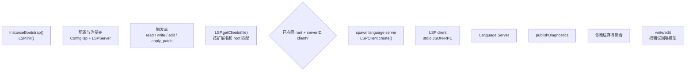

# Claude Code LSP 集成：代码理解与符号定位

本文档分析 Claude Code 的 LSP（Language Server Protocol）集成情况。


**目录**

- [1. LSP 集成现状](#1-lsp-集成现状)
- [2. OpenCode 的 LSP 架构参考](#2-opencode-的-lsp-架构参考)
- [3. Claude Code 现有的代码理解能力](#3-claude-code-现有的代码理解能力)
- [4. LSP 的替代方案](#4-lsp-的替代方案)
- [5. 实现 LSP 的建议](#5-实现-lsp-的建议)
- [6. 关键源码锚点](#6-关键源码锚点)
- [7. 总结](#7-总结)

---

## 1. LSP 集成现状

### 1.1 基本评估

Claude Code **当前没有原生 LSP 集成**：

- 没有独立的 LSP client 实现
- 没有 LSP server 懒启动机制
- 没有 symbol 查询、definition 跳转等 LSP 能力

### 1.2 与 OpenCode 的对比

| 特性 | OpenCode | Claude Code |
| --- | --- | --- |
| LSP 架构 | 五层完整架构 | 无 |
| 懒启动 | 支持 | 无 |
| 多 Server | 支持 | 无 |
| 诊断反馈 | publishDiagnostics | 无 |
| Symbol 查询 | definition/references/hover | 无 |

---

## 2. OpenCode 的 LSP 架构参考

### 2.1 OpenCode 的五层 LSP 架构

| 层 | 代码坐标 | 角色 |
| --- | --- | --- |
| 配置层 | `config.ts:1152-1187` | LSP 配置 schema |
| Server 注册层 | `lsp/server.ts:35-53` | 语言 server 声明 |
| Runtime 调度层 | `lsp/index.ts:80-300` | 按文件懒启动 client |
| JSON-RPC client | `lsp/client.ts:43-245` | stdio 通信 |
| 消费层 | `tool/read.ts:215-217` | LSP 能力接入主链路 |

### 2.2 OpenCode 的 LSP 工作原理



---

## 3. Claude Code 现有的代码理解能力

### 3.1 工具层面的代码理解

虽然没有 LSP，Claude Code 通过工具提供部分代码理解：

| 工具 | 能力 |
| --- | --- |
| `Read` | 读取文件内容 |
| `Glob` | 按模式搜索文件 |
| `Grep` | 搜索文件内容 |
| `LSPTool` | 有限的 LSP 功能（如果有 MCP server） |

### 3.2 MCP 扩展的 LSP

Claude Code 可以通过 MCP 扩展获得 LSP 能力：

- 如果 MCP server 实现了 `workspace/executeCommand`
- 或者通过其他 MCP 工具提供代码理解

---

## 4. LSP 的替代方案

### 4.1 基于工具的代码理解

Claude Code 采用更传统的方式：


### 4.2 MCP 扩展的 LSP

如果有 MCP server 提供 LSP 功能：

```typescript
// 通过 MCP server 的 tools/list 获取 LSP 工具
const tools = await mcpClient.listTools()
// 例如：textDocument/definition
```

---

## 5. 实现 LSP 的建议

### 5.1 短期方案：MCP LSP 扩展

通过 MCP 扩展接入 LSP：

```json
{
  "mcpServers": {
    "typescript": {
      "command": "typescript-language-server",
      "args": ["--stdio"]
    }
  }
}
```

### 5.2 长期方案：原生 LSP 集成

参考 OpenCode 的五层架构实现：

| 层级 | 实现建议 |
| --- | --- |
| 配置层 | `settings.json` 添加 LSP 配置 |
| Server 注册 | 声明每种语言的 server |
| Runtime 调度 | 按文件懒启动 client |
| JSON-RPC client | 实现标准 LSP 协议 |
| 消费层 | 在 Read/Edit 工具中集成 |

### 5.3 核心功能

| 功能 | 实现优先级 |
| --- | --- |
| publishDiagnostics | P0 |
| textDocument/definition | P1 |
| textDocument/references | P2 |
| textDocument/hover | P2 |
| textDocument/completion | P3 |

---

## 6. 关键源码锚点

| 主题 | 代码锚点 | 说明 |
| --- | --- | --- |
| 当前工具 | `src/tools/*.ts` | 代码理解工具 |
| MCP 集成 | `src/services/mcp/client.ts` | MCP 客户端 |
| 扩展总线 | `src/commands.ts` | 命令扩展 |

---

## 7. 总结

Claude Code **当前没有原生 LSP 集成**，主要通过：

1. **工具层面的代码理解**：Read、Glob、Grep
2. **MCP 扩展**：通过 MCP server 间接获得 LSP 能力

相比 OpenCode 的五层完整 LSP 架构，Claude Code 在代码理解方面存在差距。建议：

1. **短期**：通过 MCP 扩展接入 LSP server
2. **长期**：参考 OpenCode 实现原生 LSP 集成

---

> 关联阅读：[26-mcp-system.md](./24-mcp-system.md) 了解 MCP 扩展机制。

---

## 关键函数清单

| 函数/类型 | 文件 | 职责 |
|----------|------|------|
| `LspManager` | `src/services/lsp/lspManager.ts` | LSP 生命周期管理：根据文件类型启动/复用对应 LSP server |
| `LspClient.openDocument()` | `src/services/lsp/lspClient.ts` | 发送 `textDocument/didOpen`，通知 LSP server 文件打开 |
| `LspClient.getDiagnostics()` | `src/services/lsp/lspClient.ts` | 收集 `publishDiagnostics` 通知，返回错误/警告列表 |
| `LspClient.getCompletion()` | `src/services/lsp/lspClient.ts` | 调用 `textDocument/completion`，获取代码补全列表 |
| `LspConfig` | `src/config/types.ts` | settings 中 LSP server 配置：语言 → command 映射 |
| workspace root resolver | `src/services/lsp/workspace.ts` | 从文件路径向上查找 workspace root，决定 LSP server 作用域 |

---

## 代码质量评估

**优点**

- **诊断反馈加速 fix 循环**：LLM 修改代码后立即获取 LSP 诊断，无需运行编译器，实时发现语法/类型错误，减少无效迭代。
- **多语言按需启动**：LspManager 按文件类型懒启动 LSP server，不使用的语言不消耗资源。
- **`textDocument/completion` 支持精准补全**：Claude Code 可利用 LSP 补全建议验证 API 名称，减少 hallucinated API 调用。

**风险与改进点**

- **LSP 诊断异步推送导致竞争**：`publishDiagnostics` 是异步通知，文件保存后可能需要等待数百毫秒才有诊断，过早读取可能返回空诊断集。
- **LSP server 崩溃无自动重启**：LSP server 子进程崩溃后 LspManager 无自动重启机制，后续文件操作将失去诊断反馈。
- **多 workspace 下 LSP 作用域混乱**：monorepo 中多子项目各有 LSP root，LspManager 的 root 解析如果出错会导致补全/诊断范围不正确。

## 横向对齐补强：Claude LSP 是代码理解侧通道

Claude Code 的 LSP 能力应理解为工具和上下文增强侧通道，而不是 agent loop 的主状态源。

| 能力 | 横向对比 |
| --- | --- |
| diagnostics | 强于 Gemini 文本工具，但弱于完整 IDE |
| symbol lookup | 可辅助 Read/Edit/Agent |
| workspace root | monorepo 风险点 |
| crash recovery | 需要和 resilience 章节联读 |

## LSP 结果进入系统的位置

| 结果类型 | 进入路径 | 用户可见面 | 横向意义 |
| --- | --- | --- | --- |
| Diagnostics | diagnostic tracking 服务聚合状态 | 工具后诊断、问题提示、调试信息 | 对应 OpenCode read/write/apply_patch 后追加 diagnostics |
| Completion / Symbol | LSP manager 向 server 发请求 | 代码理解和补全辅助，不是主 prompt 模板 | 弱于 IDE，但强于纯文本 grep |
| Workspace root | LSP server 初始化参数 | monorepo 下影响诊断/补全范围 | 四项目共同风险 |
| Server lifecycle | LSPServerInstance 管理连接、请求、退出 | 崩溃后能力降级，agent loop 仍可继续 | 与 resilience 章节联读 |

因此 Claude 的 LSP 结果不是 durable conversation 的主数据源，而是通过诊断跟踪、工具反馈和 UI 状态给模型/用户提供侧通道信号。`claude-code/src/services/diagnosticTracking.ts:188` 和 `claude-code/src/services/diagnosticTracking.ts:352` 体现诊断聚合，`claude-code/src/services/lsp/manager.ts:143`、`claude-code/src/services/lsp/LSPServerInstance.ts:343`、`claude-code/src/services/lsp/LSPServerInstance.ts:393` 体现 LSP 请求生命周期。

## 源码锚点补强：Claude 的代码理解要从诊断和 LSP 管理器看

| 源码位置 | 说明 | 横向意义 |
| --- | --- | --- |
| `claude-code/src/services/diagnosticTracking.ts:30` | 诊断跟踪命名空间 | 对应 IDE/LSP 诊断输入面 |
| `claude-code/src/services/diagnosticTracking.ts:188` | diagnostic 状态变更处理 | 说明 Claude 也消费代码问题信号 |
| `claude-code/src/services/diagnosticTracking.ts:352` | 诊断输出/聚合路径 | 可和 OpenCode LSP 章节对照 |
| `claude-code/src/services/lsp/manager.ts:143` | LSP manager 连接管理 | 说明 Claude 不是纯文本工具链 |
| `claude-code/src/services/lsp/LSPServerInstance.ts:343` | LSP server instance 生命周期 | 对应 OpenCode 的 language server runtime |
| `claude-code/src/services/lsp/LSPServerInstance.ts:393` | LSP 请求/响应边界 | 用于补足“源码级能力边界” |
