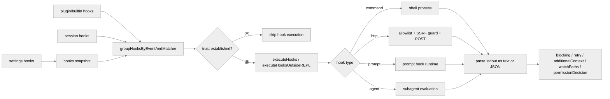

# Hooks 生命周期与运行时语义

本篇梳理 hooks 的来源、执行方式以及独立的安全和运行时约束。

**目录**

- [1. 为什么 hooks 需要单独成篇](#1-为什么-hooks-需要单独成篇)
- [2. Hook 事件模型非常宽](#2-hook-事件模型非常宽)
- [3. hook 来源不是一处，而是三路汇聚](#3-hook-来源不是一处而是三路汇聚)
- [4. hooks 可见性先经过 policy snapshot 过滤](#4-hooks-可见性先经过-policy-snapshot-过滤)
- [5. startup 为什么要 capture hook snapshot](#5-startup-为什么要-capture-hook-snapshot)
- [6. trust 是所有 hooks 的统一硬门槛](#6-trust-是所有-hooks-的统一硬门槛)
- [7. `executeHooks()` 与 `executeHooksOutsideREPL()` 代表两种消费方式](#7-executehooks-与-executehooksoutsiderepl-代表两种消费方式)
- [8. hook 输出协议已经远超 stdout/stderr](#8-hook-输出协议已经远超-stdoutstderr)
- [9. 执行器支持多种 hook 形态](#9-执行器支持多种-hook-形态)
- [10. HTTP hooks 有独立安全模型](#10-http-hooks-有独立安全模型)
- [11. session hooks 与 function hooks 是运行时内存结构，不写磁盘](#11-session-hooks-与-function-hooks-是运行时内存结构不写磁盘)
- [12. 技能与代理的 frontmatter hooks 会被“翻译”成 session hooks](#12-技能与代理的-frontmatter-hooks-会被翻译成-session-hooks)
- [13. async hooks 有独立 registry 与进度事件](#13-async-hooks-有独立-registry-与进度事件)
- [14. `ConfigChange`、`CwdChanged`、`FileChanged` 说明 hooks 还能反过来塑造运行环境](#14-configchangecwdchangedfilechanged-说明-hooks-还能反过来塑造运行环境)
- [15. 一张总图](#15-一张总图)
- [16. 关键源码锚点](#16-关键源码锚点)
- [17. 总结](#17-总结)

---

## 1. 为什么 hooks 需要单独成篇

现有文档已经多次提到 hooks：

- startup 受 hooks 顺序约束
- 输入提交前会跑 hooks
- stop hooks 会影响 query 结束
- 子代理也有自己的 hooks

但源码里 hooks 实际上已经形成了一个完整子系统：

1. 有独立事件模型。
2. 有独立的 source 合并与 managed-only 策略。
3. 有命令 hook、prompt hook、HTTP hook、agent hook、function hook 五类执行形态。
4. 有 async registry、watch path、permission request、elicitation 等扩展协议。

换句话说，hooks 在这个仓库里不是“脚本回调”，而是：

> 一个能在运行时拦截、补充、阻断、重试和观察主流程的事件总线。

## 2. Hook 事件模型非常宽

关键代码：`src/utils/hooks/hooksConfigManager.ts:26-268`

`getHookEventMetadata()` 已经基本把 hooks 的协议面暴露出来了，包括：

- `PreToolUse`
- `PostToolUse`
- `PostToolUseFailure`
- `PermissionDenied`
- `PermissionRequest`
- `UserPromptSubmit`
- `SessionStart`
- `Stop`
- `StopFailure`
- `SubagentStart`
- `SubagentStop`
- `PreCompact`
- `PostCompact`
- `Setup`
- `ConfigChange`
- `InstructionsLoaded`
- `CwdChanged`
- `FileChanged`
- `Elicitation`
- `ElicitationResult`

hooks 已经覆盖了：

- 用户输入前后
- 工具调用前后
- 权限判定
- 会话生命周期
- 压缩生命周期
- 配置变化
- 文件系统变化
- MCP 交互
- 子代理生命周期

## 3. hook 来源不是一处，而是三路汇聚

关键代码：

- `src/utils/hooks/hooksConfigSnapshot.ts:9-52`
- `src/utils/hooks/hooksConfigManager.ts:270-361`
- `src/utils/hooks/sessionHooks.ts`

运行时真正参与组装的 hooks 至少有三类：

1. settings 文件中的 hooks
2. 已注册的 plugin/builtin hooks
3. session-scoped hooks

其中 session hooks 又包括：

- skill frontmatter 注入
- agent frontmatter 注入
- function hooks
- 某些只存在于当前 session 内存态的临时 hook

这意味着“我在 settings.json 里配了一个 hook”和“技能/插件/子代理临时注册了一个 hook”，最终都会在同一执行器里碰头。

## 4. hooks 可见性先经过 policy snapshot 过滤

关键代码：`src/utils/hooks/hooksConfigSnapshot.ts:9-121`

这里的关键不是“读取 hooks”，而是“读取 allowed hooks”。

过滤规则大致是：

- managed settings 的 `disableAllHooks=true`：全部 hooks 禁用
- managed settings 的 `allowManagedHooksOnly=true`：只保留 managed hooks
- `strictPluginOnlyCustomization`：阻断 user/project/local settings hooks，但 plugin hooks 不受这个 execution-time 过滤影响
- 非 managed settings 的 `disableAllHooks=true`：只能禁用非 managed hooks，managed hooks 仍然保留

hooks 子系统的安全模型明显高于一般配置项：

> 非托管配置不能完全关闭托管 hooks，也不能随意越权影响插件/策略层的 hook 通道。

## 5. startup 为什么要 capture hook snapshot

关键代码：

- `src/utils/hooks/hooksConfigSnapshot.ts:95-121`
- `src/setup.ts` 中的 `captureHooksConfigSnapshot()` 调用

snapshot 的意义不是简单 cache，而是：

1. 在启动早期冻结“本 session 当前允许看到的 hooks 集合”。
2. 避免 trust 前后、cwd 切换、外部编辑抖动导致读取面漂移。
3. 在用户显式修改 hooks 后，再通过 `updateHooksConfigSnapshot()` 重新同步。

这与 settings cache 类似，但目标更偏向：

- 启动一致性
- 安全边界
- 运行期稳定性

## 6. trust 是所有 hooks 的统一硬门槛

关键代码：`src/utils/hooks.ts:286-299`

`shouldSkipHookDueToTrust()` 的规则很明确：

- 非交互模式：默认可信，hooks 可运行
- 交互模式：所有 hooks 都要求 trust 已建立

源码注释还明确提到，这个统一 trust gate 是为了防未来 bug 和历史漏洞重现，例如：

- SessionEnd hooks 在用户拒绝 trust 后仍被执行
- SubagentStop hooks 在 trust 建立前就落地

所以这里不是“某些危险 hook 才需要 trust”，而是：

> 交互态下，所有 hook 执行都被视为潜在的任意命令执行面。

## 7. `executeHooks()` 与 `executeHooksOutsideREPL()` 代表两种消费方式

关键代码：

- `src/utils/hooks.ts:2034-3072` `executeHooks()`
- `src/utils/hooks.ts:3086-3504` `executeHooksOutsideREPL()`

两者的区别不是“一个同步一个异步”，而是：

- `executeHooks()` 走 REPL/消息流语义，可 yield 消息给模型或 UI
- `executeHooksOutsideREPL()` 更偏 command-style 执行，返回聚合结果

这对应了 hooks 在系统里的两种角色：

1. 参与当前对话回合
2. 参与后台/非 UI 生命周期事件

## 8. hook 输出协议已经远超 stdout/stderr

关键代码：

- `src/utils/hooks.ts:399-566` `parseHookOutput()` / `parseHttpHookOutput()`
- `src/utils/hooks.ts:568-775` `processHookJSONOutput()`

如果 stdout 以 `{` 开头，系统会按 hook JSON schema 解释，而不是纯文本。

它支持的语义包括：

- `continue: false`
- `stopReason`
- `decision: approve | block`
- `permissionDecision`
- `updatedInput`
- `additionalContext`
- `watchPaths`
- `retry`
- `worktreePath`
- elicitation response override

hook 已经不是“打印一段提示词给模型看”，而是：

> 一个结构化的控制协议，能够回写权限决策、工具输入、MCP 响应、文件观察集甚至 worktree 路径。

## 9. 执行器支持多种 hook 形态

关键代码：

- `src/utils/hooks.ts`
- `src/utils/hooks/execPromptHook.ts`
- `src/utils/hooks/execAgentHook.ts`
- `src/utils/hooks/execHttpHook.ts`

当前至少有四类主要执行形态：

1. shell command hook
2. prompt hook
3. agent hook
4. HTTP hook

其中最值得注意的是：

- agent hook 会启动一个受限子代理来判定条件是否满足
- HTTP hook 会走 allowlist、env var allowlist、SSRF 防护、proxy 路由
- prompt hook 与 agent hook 都说明 hooks 并不局限于“系统外部脚本”

## 10. HTTP hooks 有独立安全模型

关键代码：

- `src/utils/hooks/execHttpHook.ts:44-201`
- `src/utils/hooks/ssrfGuard.ts:6-287`

HTTP hook 的设计明显比 shell hook 更谨慎：

- URL 必须匹配 `allowedHttpHookUrls`
- 只有显式列入 `allowedEnvVars` 的变量才允许插值进 header
- policy 层还能继续收紧 env var allowlist
- 会检查 SSRF 风险，阻断 private/link-local address
- loopback 被明确允许，便于本地开发

这说明团队已经把 HTTP hooks 当作一个“可能把本地秘密和网络访问联动起来”的高风险面来治理。

## 11. session hooks 与 function hooks 是运行时内存结构，不写磁盘

关键代码：`src/utils/hooks/sessionHooks.ts:47-214`

`sessionHooks` 用 `Map<string, SessionStore>` 保存，而且有一段很重要的注释解释为什么不用普通对象：

- `.set()` / `.delete()` 不改变容器 identity
- 可以让 store 的监听器不被无谓触发
- 在高并发 schema-mode agents 场景下避免 O(N²) copy 成本

此外 function hooks：

- 只存在于 session 内存中
- 直接运行 TypeScript callback
- 不能被序列化成普通 HookMatcher

hooks 子系统既支持持久配置，也支持：

> 仅为当前会话或当前代理临时挂上的内存态运行时约束。

## 12. 技能与代理的 frontmatter hooks 会被“翻译”成 session hooks

关键代码：

- `src/utils/hooks/registerFrontmatterHooks.ts`
- `src/utils/hooks/registerSkillHooks.ts`

这里有两个很有代表性的行为：

- skill hooks 注册成 session-scoped hooks，可伴随 session 生命周期存在
- agent frontmatter 的 `Stop` hook 会被改写成 `SubagentStop`

后者尤其重要，因为它说明：

> hook event 并不是纯粹的静态配置名，而是会根据运行实体类型被重映射。

另外，skill hooks 的 `once: true` 会在成功执行后自动移除，也再次证明 session hooks 是动态集合。

## 13. async hooks 有独立 registry 与进度事件

关键代码：`src/utils/hooks/AsyncHookRegistry.ts:30-101`

异步 hooks 不会简单放飞不管，而是会：

- 注册到 pending async hook registry
- 发 hook started / progress / response 事件
- 在后台完成时回传 stdout/stderr/outcome

hook 在系统里也是可观测对象，而不是“黑盒外部进程”。

## 14. `ConfigChange`、`CwdChanged`、`FileChanged` 说明 hooks 还能反过来塑造运行环境

关键代码：

- `src/utils/hooks.ts:4309-4383`
- `src/utils/hooks/fileChangedWatcher.ts`

尤其是：

- `ConfigChange` 可以阻止配置变化应用到当前 session
- `CwdChanged` / `FileChanged` hook 可以返回 `watchPaths`
- `CLAUDE_ENV_FILE` 可供 hook 写入，影响后续 BashTool 环境

这里已经不是“生命周期通知”，而是：

> hooks 可以参与塑造后续环境、后续 watch 集和后续工具执行条件。

## 15. 一张总图

## 16. 关键源码锚点

| 主题 | 代码锚点 | 说明 |
| --- | --- | --- |
| hook 可见性过滤 | `src/utils/hooks/hooksConfigSnapshot.ts:9-121` | managed-only / disable-all 规则 |
| 事件元数据与 matcher | `src/utils/hooks/hooksConfigManager.ts:26-399` | hook 事件协议面 |
| trust gate | `src/utils/hooks.ts:286-299` | 交互态所有 hooks 统一要求 trust |
| REPL 内执行器 | `src/utils/hooks.ts:2034-3072` | 参与消息流的 hooks |
| 非 REPL 执行器 | `src/utils/hooks.ts:3086-3504` | 后台/生命周期 hook 执行 |
| hook JSON 输出处理 | `src/utils/hooks.ts:399-775` | 结构化控制协议 |
| session hooks | `src/utils/hooks/sessionHooks.ts:47-214`, `302-437` | 内存态 hook store 与 callback |
| HTTP hook 安全策略 | `src/utils/hooks/execHttpHook.ts:44-201` | URL allowlist、env allowlist、proxy |
| SSRF guard | `src/utils/hooks/ssrfGuard.ts:6-287` | 拒绝 private/link-local 地址 |
| frontmatter hook 注册 | `src/utils/hooks/registerFrontmatterHooks.ts`, `src/utils/hooks/registerSkillHooks.ts` | 技能/代理 hook 动态注入 |
| async hook registry | `src/utils/hooks/AsyncHookRegistry.ts:30-101` | 后台 hook 进度与收尾 |

## 17. 总结

这套 hooks 系统的本质不是“在某些节点跑脚本”，而是：

1. 用 settings/policy/snapshot 控制 hooks 是否可见。
2. 用统一执行器把 command/prompt/agent/http hook 拉进主运行时。
3. 用结构化 JSON 输出让 hook 反向控制权限、输入、重试和 watch 行为。
4. 用 session hooks、frontmatter hooks、async registry 扩展成一个真正的事件总线。

如果忽略这条主线，就很难解释为什么启动顺序、query 结束条件、子代理行为和配置变更都与 hooks 深度耦合。

---

## 关键函数清单

| 函数/类型 | 文件 | 职责 |
|----------|------|------|
| `HookRunner.runPreTool()` | `src/hooks/hookRunner.ts` | 前置钩子执行器：工具调用前运行，可修改参数或中止调用 |
| `HookRunner.runPostTool()` | `src/hooks/hookRunner.ts` | 后置钩子执行器：工具调用后运行，可审计或转换结果 |
| `LifecycleEvent` enum | `src/hooks/types.ts` | 生命周期事件类型：PreToolUse / PostToolUse / Stop / SubagentStop |
| `HookConfig` | `src/config/types.ts` | settings.json 中 hooks 配置：event type → command 映射 |
| `SessionLifecycle.start()` | `src/agent/sessionLifecycle.ts` | session 启动钩子：初始化内存、MCP、LSP 按序 |
| `SessionLifecycle.stop()` | `src/agent/sessionLifecycle.ts` | session 终止钩子：持久化状态、关闭 MCP 连接 |

---

## 代码质量评估

**优点**

- **Stop/SubagentStop 分级钩子**：区分顶层 agent 停止和子 agent 停止，允许父子 agent 独立触发不同的收尾逻辑。
- **配置驱动钩子注册**：钩子通过 settings.json 注册而非代码，非开发者用户也可配置，无需 fork 代码。
- **串行执行保证顺序**：多个同类钩子串行执行，结果可预期，不会因并行执行顺序不确定导致审计日志乱序。

**风险与改进点**

- **前置钩子中止语义不明确**：钩子退出非零码时是否中止工具调用未在文档中明确说明，用户需实验确认行为。
- **钩子无沙盒隔离**：钩子以宿主进程权限执行外部命令，恶意项目 settings.json 注入的钩子可执行任意本地命令。
- **生命周期事件无顺序保证文档化**：多个钩子注册同一事件时，执行顺序依赖注册顺序，但顺序规则未公开文档化。
