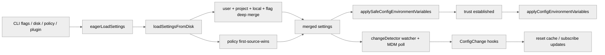

# 设置系统、托管策略与环境变量注入

本篇梳理 `settings` 如何通过多源合并、托管策略和 trust 前后分阶段注入影响运行时行为。

## 1. 为什么这是一条独立主线

现有文档已经提到：

- 启动时会提前加载 settings。
- MDM 会被提前预读。
- trust 之后会重新应用某些环境变量。

但源码里真正复杂的地方不是“读一个 settings.json”，而是：

1. 设置有多个来源，而且不是简单覆盖。
2. `policySettings` 自己内部又是一套单独优先级链。
3. 环境变量不是一次性全量注入，而是分“安全子集”和“完整注入”两段。
4. 运行中的文件变化、registry/plist 变化、drop-in 目录变化，还会走 watcher + hook 体系。

所以如果不单独把 settings 当成一个运行时子系统来读，很容易误判很多行为来源。

## 2. 设置源不是一层，而是一个合并栈

关键代码：

- `src/utils/settings/constants.ts:7-22` `SETTING_SOURCES`
- `src/utils/settings/constants.ts:128-175` `parseSettingSourcesFlag()` / `getEnabledSettingSources()`
- `src/utils/settings/settings.ts:645-865` `loadSettingsFromDisk()`

源码定义的设置源顺序是：

1. `userSettings`
2. `projectSettings`
3. `localSettings`
4. `flagSettings`
5. `policySettings`

这表示普通设置链路默认是：

> 低优先级在前，高优先级在后，后者覆盖前者。

但这里有两个重要例外：

- 插件设置先作为更低优先级 base 合进来，然后才轮到文件型 sources。
- `policySettings` 自己内部不是 deep merge 链，而是 “first source wins”。

仅记住“用户 < 项目 < 本地 < CLI < 托管”的顺序并不足以解释实际行为。

## 3. `--setting-sources` 不是装饰参数，而是初始化边界条件

关键代码：

- `src/main.tsx:432-499` `loadSettingsFromFlag()` / `loadSettingSourcesFromFlag()`
- `src/main.tsx:502-515` `eagerLoadSettings()`

`main.tsx` 会在 `init()` 之前就解析：

- `--settings`
- `--setting-sources`

其中 `--setting-sources` 只接受：

- `user`
- `project`
- `local`

而 `flagSettings` 和 `policySettings` 会被强制包含，见：

- `src/utils/settings/constants.ts:159-172`

这说明设计目标不是“让调用方把一切都关掉”，而是：

> 允许 SDK/CLI 隔离普通本地配置，但不能绕开显式 CLI 注入和企业托管策略。

## 4. `--settings` 的临时文件路径为什么要做 content hash

关键代码：`src/main.tsx:434-463`

当 `--settings` 传入 JSON 字符串时，代码不会随便生成一个随机临时文件，而是：

- 先校验 JSON
- 再用内容哈希生成稳定的 temp path

源码注释给出的原因非常关键：

- settings 文件路径会间接进入 Bash 工具的 sandbox denyWithinAllow 列表
- 这个列表又会进入发给模型的 tool description
- 如果路径每次都带随机 UUID，就会不断破坏 prompt cache prefix

这里的目的不是“为了方便调试”，而是：

> 配置文件路径本身会变成请求语义的一部分，因此连临时文件名都要为 cache 稳定性服务。

## 5. `policySettings` 不是普通 override，而是“单一获胜者”

关键代码：

- `src/utils/settings/settings.ts:667-729`
- `src/utils/settings/mdm/settings.ts:11-18`
- `src/utils/settings/mdm/settings.ts:67-132`

`loadSettingsFromDisk()` 对大多数 source 的处理是 deep merge，但遇到 `policySettings` 会改成：

1. remote managed settings
2. admin MDM: HKLM / macOS plist
3. `managed-settings.json` 与 drop-in
4. HKCU

只要某一层有内容，下面的层就不再提供 policy settings，只继续贡献 validation errors。

这条规则的本质不是“优先级更高”，而是：

> 企业托管策略必须有一个明确的 authoritative source，不能把不同托管来源再混合深合并。

## 6. MDM 读取为什么被拆成 raw read 和 parse/cache 两层

关键代码：

- `src/utils/settings/mdm/rawRead.ts`
- `src/utils/settings/mdm/settings.ts:67-106`

这层设计值得单独注意：

- `rawRead.ts` 只负责尽早发子进程读取 `plutil` / `reg query`
- `settings.ts` 负责等待结果、解析、缓存、区分 MDM 与 HKCU

这么拆的原因是：

1. `main.tsx` 顶层 import 阶段只能容纳极轻量模块。
2. 读取 subprocess 越早启动越能与重型 imports 并行。
3. 真正的 schema parse、错误聚合、first-source-wins 逻辑可以延后。

所以 MDM 预热不是一个小优化，而是 settings 子系统被明确切成了：

- 启动抢跑层
- 运行期解析层

## 7. 环境变量注入分成 trust 前后两段

关键代码：

- `src/utils/managedEnv.ts:124-184` `applySafeConfigEnvironmentVariables()`
- `src/utils/managedEnv.ts:187-198` `applyConfigEnvironmentVariables()`

这是当前文档里几乎没展开，但实际非常关键的一条语义线。

### 7.1 trust 前：只注入安全子集，但 trusted source 可更宽

`applySafeConfigEnvironmentVariables()` 的策略是：

- 先应用 global config
- 再应用 trusted setting sources 中的 env
- 计算 remote managed settings eligibility
- 再应用 policy env
- 最后只把 merged settings 中属于 `SAFE_ENV_VARS` 的键写回 `process.env`

这里“trusted source”主要指：

- user settings
- flag settings
- policy settings

而 project/local source 即使参与 merged settings，也只允许安全白名单 env 在 trust 前生效。

### 7.2 trust 后：完整环境变量才真正落地

`applyConfigEnvironmentVariables()` 则会：

- 把 global config 和 merged settings 的 env 全量写入 `process.env`
- 清掉 CA cert / mTLS / proxy cache
- 重新配置 global agents

trust 不只是 UI gating，而是：

> 决定是否允许项目级配置去影响真实运行环境。

## 8. settings change detector 不只是 watcher，而是“运行期配置治理器”

关键代码：

- `src/utils/settings/changeDetector.ts:84-173` `initialize()` / `subscribe`
- `src/utils/settings/changeDetector.ts:268-344` `handleChange()`
- `src/utils/settings/changeDetector.ts:381-430` `startMdmPoll()`

这层做的事至少有四类：

1. 用 `chokidar` 监听 settings 文件和 `managed-settings.d/`。
2. 维护 deletion grace，避免 delete-and-recreate 被误判成删除。
3. 轮询 MDM registry/plist，因为这类变化无法可靠走普通 FS watch。
4. 在发现变化后执行 `ConfigChange` hooks，并允许 hook 阻止本次变更应用到当前 session。

它不是“发现变化然后 reset cache”这么简单，而是：

> 把磁盘级配置变化，升级成一套带审查、带抑制、带 hook 的运行期事件。

## 9. `internal write` 与 `deletion grace` 说明团队遇到过真实抖动问题

关键代码：`src/utils/settings/changeDetector.ts:23-58`

两个细节非常工程化：

- `INTERNAL_WRITE_WINDOW_MS`
- `DELETION_GRACE_MS`

它们分别在对抗：

- Claude Code 自己写 settings 时，watcher 不应再把它当成外部变更。
- 编辑器/自动更新常见的“先删再原子替换”模式，不应被误报成删除。

settings 变更链路已经从“能跑”推进到“要在真实编辑器和真实文件系统行为下稳定运行”。

## 10. 某些设置读取会故意绕开 project settings

关键代码：

- `src/utils/settings/settings.ts:882-906`

例如：

- `hasSkipDangerousModePermissionPrompt()`
- `hasAutoModeOptIn()`

它们有意排除 `projectSettings`，原因也写得很直白：

> 恶意项目不应通过共享 project config 自动接受危险权限对话框或 auto mode opt-in。

settings 并不是单纯消费 merge 结果，而是：

- 某些行为读 merged settings
- 某些安全决策只信任 user/local/flag/policy

## 11. 一张总图



## 12. 一组常见 env 配置的源码解读

如下配置可视为一组偏保守、偏隐私的 runtime profile：

```json
{
  "env": {
    "ENABLE_TOOL_SEARCH": "true",
    "CLAUDE_CODE_DISABLE_1M_CONTEXT": "1",
    "CLAUDE_CODE_ATTRIBUTION_HEADER": "0",
    "CLAUDE_CODE_DISABLE_NONESSENTIAL_TRAFFIC": "1",
    "CLAUDE_CODE_DISABLE_TERMINAL_TITLE": "1",
    "DISABLE_EXTRA_USAGE_COMMAND": "1"
  }
}
```

边界首先需要明确：这不是 Claude Code 的“默认推荐配置”，也不是一组纯性能开关。  
更准确的归类是 **偏隐私、偏保守、减少非必要表面积** 的 runtime profile。

逐项落到代码，比较可靠的解释如下：

| 变量 | 关键源码 | 直接效果 | 更准确的利弊 |
| --- | --- | --- | --- |
| `ENABLE_TOOL_SEARCH=true` | `src/utils/toolSearch.ts` | 强制走 `tst` 模式，deferred tools 通过 Tool Search 按需发现 | 主上下文里不必内联全部 deferred tool 描述，通常有利于 prompt 体积和 cache；但前提是当前 provider / gateway 支持 `tool_reference` |
| `CLAUDE_CODE_DISABLE_1M_CONTEXT=1` | `src/utils/context.ts` | 禁用 `[1m]` / 1M context 路径，context window 回到默认 200K 语义 | 降低长上下文成本、满足某些合规约束；代价是丢掉超长上下文 headroom |
| `CLAUDE_CODE_ATTRIBUTION_HEADER=0` | `src/constants/system.ts` | 不发送 `x-anthropic-billing-header` attribution header | 更少客户端标识信息；但会关掉 first-party attribution 相关信号 |
| `CLAUDE_CODE_DISABLE_NONESSENTIAL_TRAFFIC=1` | `src/services/mcp/officialRegistry.ts`、`src/utils/privacyLevel.ts` | 禁掉非必要网络流量，例如官方 MCP registry 预取 | 更隐私、更少出网；代价是某些体验型预热信息不再可用 |
| `CLAUDE_CODE_DISABLE_TERMINAL_TITLE=1` | `src/main.tsx`、`src/utils/gracefulShutdown.ts` | 不设置 / 不恢复终端标题 | 主要是终端整洁度和 shell 习惯问题，几乎不影响核心能力 |
| `DISABLE_EXTRA_USAGE_COMMAND=1` | `src/commands/extra-usage/index.ts` | 隐藏 `extra-usage` 命令入口 | 这是命令面板/能力入口收敛，不是性能优化 |

### 12.1 成本、隐私与产品表面积需要分开看

更接近源码事实的拆法如下：

- **偏成本 / cache / prompt 体积**：`ENABLE_TOOL_SEARCH`、`CLAUDE_CODE_DISABLE_1M_CONTEXT`
- **偏隐私 / 减少出网**：`CLAUDE_CODE_DISABLE_NONESSENTIAL_TRAFFIC`、`CLAUDE_CODE_ATTRIBUTION_HEADER`
- **偏 UI / 产品表面积收敛**：`CLAUDE_CODE_DISABLE_TERMINAL_TITLE`、`DISABLE_EXTRA_USAGE_COMMAND`

因此，把这组配置概括成“提速配置”会失真。它更像：

> 让客户端行为更保守、更少暴露、上下文上限更克制的一组偏好

### 12.2 如果这些键写在 `settings.json` 的 `env` 里，它们还不是同一时刻生效

这一点很容易被忽略。

`managedEnv.ts` 明确把 env 注入拆成两阶段：

- `applySafeConfigEnvironmentVariables()`：trust 前，只注入 `SAFE_ENV_VARS`
- `applyConfigEnvironmentVariables()`：trust 后，才把 merged settings 里的 env 全量写进 `process.env`

结合 `managedEnvConstants.ts` 可以看到：

- `ENABLE_TOOL_SEARCH`
- `CLAUDE_CODE_DISABLE_NONESSENTIAL_TRAFFIC`
- `CLAUDE_CODE_DISABLE_TERMINAL_TITLE`

属于 safe allowlist，更容易在 trust 前就影响运行时。

而下面这些则不在那份 safe allowlist 里：

- `CLAUDE_CODE_DISABLE_1M_CONTEXT`
- `CLAUDE_CODE_ATTRIBUTION_HEADER`
- `DISABLE_EXTRA_USAGE_COMMAND`

如果它们来自 `settings.json` 的 `env`，更接近 **trust 后全量 env 生效** 的路径。

这组配置展示的不是“一组同时翻转的启动开关”，而是一个跨 trust 边界的 runtime profile。

## 13. 关键源码锚点

| 主题 | 代码锚点 | 说明 |
| --- | --- | --- |
| 提前解析 settings flag | `src/main.tsx:432-515` | `--settings` / `--setting-sources` 必须早于 `init()` |
| source 列表与启用逻辑 | `src/utils/settings/constants.ts:7-22`, `128-175` | 普通 source 与 always-on source 的边界 |
| settings 真正合并 | `src/utils/settings/settings.ts:645-865` | 插件 base、deep merge、policy 特殊链 |
| policy first-source-wins | `src/utils/settings/mdm/settings.ts:11-18`, `67-132` | remote / MDM / managed file / HKCU |
| trust 前 env 注入 | `src/utils/managedEnv.ts:124-184` | trusted env + safe env 两阶段 |
| trust 后 env 注入 | `src/utils/managedEnv.ts:187-198` | 完整 env、生效后清 cache/rebuild agents |
| 变更检测入口 | `src/utils/settings/changeDetector.ts:84-173` | watcher 初始化与订阅 |
| 文件变化处理 | `src/utils/settings/changeDetector.ts:268-344` | reset cache + ConfigChange hooks |
| MDM 轮询 | `src/utils/settings/changeDetector.ts:381-430` | registry/plist 变化需要 poll |

## 14. 总结

这套 settings 系统的核心不是“读配置文件”，而是：

1. 用多源合并表达普通用户配置。
2. 用 `policySettings` 的 first-source-wins 表达企业托管策略。
3. 用 trust 前后的 env 两阶段注入保证安全边界。
4. 用 watcher、MDM poll 和 `ConfigChange` hooks 把配置变化纳入运行期治理。

启动链路、权限系统、hooks 与 provider 选择都依赖这条设置主线。
