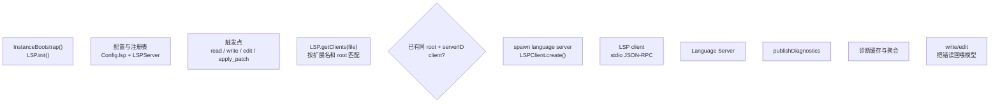

# Claude Code LSP 集成：代码理解与符号定位

本文档分析 Claude Code 的 LSP（Language Server Protocol）集成情况。

## 1. LSP 集成现状

### 1.1 基本评估

Claude Code **当前没有原生 LSP 集成**：

- 没有独立的 LSP client 实现
- 没有 LSP server 懒启动机制
- 没有 symbol 查询、definition 跳转等 LSP 能力

### 1.2 与 OpenCode 的对比

| 特性 | OpenCode | Claude Code |
| --- | --- | --- |
| LSP 架构 | 五层完整架构 | 无 |
| 懒启动 | 支持 | 无 |
| 多 Server | 支持 | 无 |
| 诊断反馈 | publishDiagnostics | 无 |
| Symbol 查询 | definition/references/hover | 无 |

---

## 2. OpenCode 的 LSP 架构参考

### 2.1 OpenCode 的五层 LSP 架构

| 层 | 代码坐标 | 角色 |
| --- | --- | --- |
| 配置层 | `config.ts:1152-1187` | LSP 配置 schema |
| Server 注册层 | `lsp/server.ts:35-53` | 语言 server 声明 |
| Runtime 调度层 | `lsp/index.ts:80-300` | 按文件懒启动 client |
| JSON-RPC client | `lsp/client.ts:43-245` | stdio 通信 |
| 消费层 | `tool/read.ts:215-217` | LSP 能力接入主链路 |

### 2.2 OpenCode 的 LSP 工作原理



---

## 3. Claude Code 现有的代码理解能力

### 3.1 工具层面的代码理解

虽然没有 LSP，Claude Code 通过工具提供部分代码理解：

| 工具 | 能力 |
| --- | --- |
| `Read` | 读取文件内容 |
| `Glob` | 按模式搜索文件 |
| `Grep` | 搜索文件内容 |
| `LSPTool` | 有限的 LSP 功能（如果有 MCP server） |

### 3.2 MCP 扩展的 LSP

Claude Code 可以通过 MCP 扩展获得 LSP 能力：

- 如果 MCP server 实现了 `workspace/executeCommand`
- 或者通过其他 MCP 工具提供代码理解

---

## 4. LSP 的替代方案

### 4.1 基于工具的代码理解

Claude Code 采用更传统的方式：


### 4.2 MCP 扩展的 LSP

如果有 MCP server 提供 LSP 功能：

```typescript
// 通过 MCP server 的 tools/list 获取 LSP 工具
const tools = await mcpClient.listTools()
// 例如：textDocument/definition
```

---

## 5. 实现 LSP 的建议

### 5.1 短期方案：MCP LSP 扩展

通过 MCP 扩展接入 LSP：

```json
{
  "mcpServers": {
    "typescript": {
      "command": "typescript-language-server",
      "args": ["--stdio"]
    }
  }
}
```

### 5.2 长期方案：原生 LSP 集成

参考 OpenCode 的五层架构实现：

| 层级 | 实现建议 |
| --- | --- |
| 配置层 | `settings.json` 添加 LSP 配置 |
| Server 注册 | 声明每种语言的 server |
| Runtime 调度 | 按文件懒启动 client |
| JSON-RPC client | 实现标准 LSP 协议 |
| 消费层 | 在 Read/Edit 工具中集成 |

### 5.3 核心功能

| 功能 | 实现优先级 |
| --- | --- |
| publishDiagnostics | P0 |
| textDocument/definition | P1 |
| textDocument/references | P2 |
| textDocument/hover | P2 |
| textDocument/completion | P3 |

---

## 6. 关键源码锚点

| 主题 | 代码锚点 | 说明 |
| --- | --- | --- |
| 当前工具 | `src/tools/*.ts` | 代码理解工具 |
| MCP 集成 | `src/services/mcp/client.ts` | MCP 客户端 |
| 扩展总线 | `src/commands.ts` | 命令扩展 |

---

## 7. 总结

Claude Code **当前没有原生 LSP 集成**，主要通过：

1. **工具层面的代码理解**：Read、Glob、Grep
2. **MCP 扩展**：通过 MCP server 间接获得 LSP 能力

相比 OpenCode 的五层完整 LSP 架构，Claude Code 在代码理解方面存在差距。建议：

1. **短期**：通过 MCP 扩展接入 LSP server
2. **长期**：参考 OpenCode 实现原生 LSP 集成

---

> 关联阅读：[10-mcp-system.md](./10-mcp-system.md) 了解 MCP 扩展机制。
