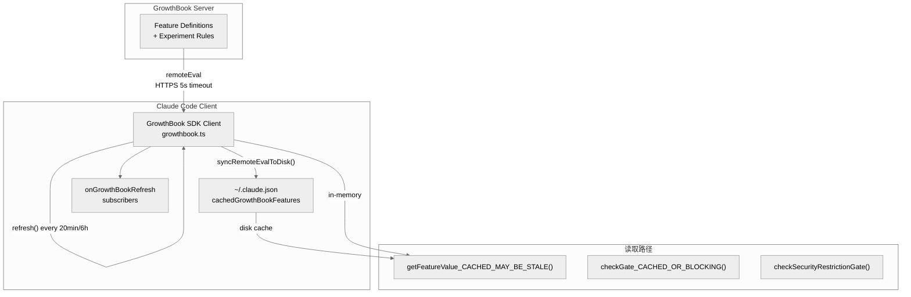
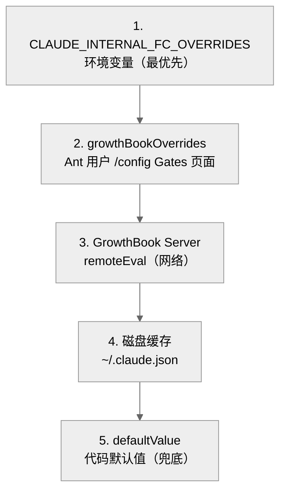
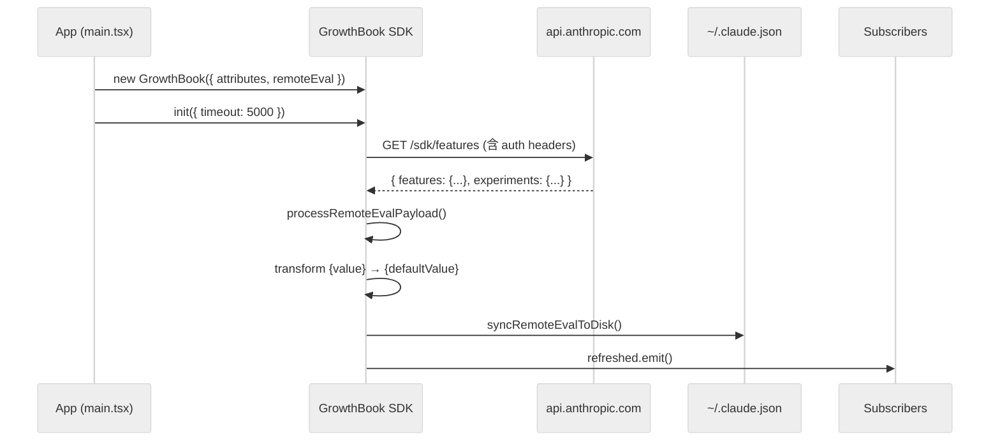

# Claude Code 的 GrowthBook 远程配置门控系统

Claude Code 使用 **GrowthBook** 作为远程 feature flag 平台，通过 `tengu_*` 前缀的 feature key 控制从 UI 展示到后端功能的一切行为。这是一个集中化的远程配置系统，使 Anthropic 可以在不发版的情况下灰度发布功能、控制 A/B 实验、管理 kill switch，以及向企业客户推送定制化配置。

**目录**

- [1. 系统架构总览](#1-系统架构总览)
- [2. GrowthBook SDK 集成](#2-growthbook-sdk-集成)
- [3. 特征值读取 API](#3-特征值读取-api)
- [4. 覆盖机制：三层优先级](#4-覆盖机制三层优先级)
- [5. 生命周期：init / 刷新 / 重置](#5-生命周期init--刷新--重置)
- [6. tengu_* Feature 分类](#6-tengu_-feature-分类)
- [7. 关键函数清单](#7-关键函数清单)

---

## 1. 系统架构总览



### 核心文件

| 文件 | 职责 |
|------|------|
| `services/analytics/growthbook.ts` | GrowthBook SDK 封装、init、refresh、缓存 |
| `utils/config.ts` | 全局配置读写（含 `cachedGrowthBookFeatures` 持久化）|
| `analytics/firstPartyEventLogger.ts` | 实验曝光事件记录 |
| `analytics/growthbook.ts` (同文件) | 全文 1156 行，完整实现 |

## 2. GrowthBook SDK 集成

### 2.1 客户端初始化

```typescript
// services/analytics/growthbook.ts:526-546
const thisClient = new GrowthBook({
  apiHost: baseUrl,
  clientKey: getGrowthBookClientKey(),
  attributes: getUserAttributes(),
  remoteEval: true,        // 服务端预计算，返回即用
  cacheKeyAttributes: ['id', 'organizationUUID'],  // 按设备/组织缓存
  ...(authHeaders.error ? {} : {
    apiHostRequestHeaders: authHeaders.headers   // 认证请求头
  }),
})

client = thisClient
thisClient.init({ timeout: 5000 })
```

**关键设计**：
- `remoteEval: true` — 服务端预计算，直接返回已评估的值，无需客户端规则引擎
- `cacheKeyAttributes` — 确保 org 切换时重新获取
- `apiHostRequestHeaders` — 认证头随请求发送，使服务端能按用户/组织定向

### 2.2 用户属性（Targeting）

```typescript
// services/analytics/growthbook.ts:454-485
function getUserAttributes(): GrowthBookUserAttributes {
  const user = getUserForGrowthBook()
  return {
    id: user.deviceId,
    sessionId: user.sessionId,
    deviceID: user.deviceId,
    platform: user.platform,
    apiBaseUrlHost: getApiBaseUrlHost(),  // 企业代理主机名
    organizationUUID: user.organizationUuid,
    accountUUID: user.accountUuid,
    userType: user.userType,
    subscriptionType: user.subscriptionType,
    rateLimitTier: user.rateLimitTier,
    firstTokenTime: user.firstTokenTime,
    email: email,
    appVersion: user.appVersion,
    githubActionsMetadata: user.githubActionsMetadata,
  }
}
```

这些属性用于 GrowthBook 的 targeting rules——比如按 `subscriptionType === 'pro'` 开启某功能、按 `platform === 'darwin'` 灰度发布。

### 2.3 remoteEval 响应格式修正

GrowthBook API 返回的响应格式与 SDK 期望不一致：

```typescript
// services/analytics/growthbook.ts:330-356
// WORKAROUND: API 返回 { "value": ... } 但 SDK 期望 { "defaultValue": ... }
const transformedFeatures: Record<string, MalformedFeatureDefinition> = {}
for (const [key, feature] of Object.entries(payload.features)) {
  const f = feature as MalformedFeatureDefinition
  if ('value' in f && !('defaultValue' in f)) {
    transformedFeatures[key] = { ...f, defaultValue: f.value }
  } else {
    transformedFeatures[key] = f
  }
}
await gbClient.setPayload({ ...payload, features: transformedFeatures })
```

## 3. 特征值读取 API

GrowthBook 封装了 4 种读取函数，分别用于不同场景：

### 3.1 同步缓存读取（首选）

```typescript
// services/analytics/growthbook.ts:734-775
export function getFeatureValue_CACHED_MAY_BE_STALE<T>(
  feature: string,
  defaultValue: T,
): T {
  // 优先级: envOverrides > configOverrides > memory > disk
  if (remoteEvalFeatureValues.has(feature)) {
    return remoteEvalFeatureValues.get(feature) as T  // 内存优先
  }
  return getGlobalConfig().cachedGrowthBookFeatures?.[feature] ?? defaultValue
}
```

**适用场景**：启动关键路径（sync context）、热路径（渲染循环中反复调用）。值可能是上一个进程写入的磁盘缓存——对于 kill switch 类 flag，这通常可以接受。

### 3.2 阻塞刷新读取

```typescript
// services/analytics/growthbook.ts:904-935
export async function checkGate_CACHED_OR_BLOCKING(gate: string): Promise<boolean> {
  // 快速路径：磁盘缓存说 true → 直接返回（信任）
  const cached = getGlobalConfig().cachedGrowthBookFeatures?.[gate]
  if (cached === true) return true
  // 慢速路径：磁盘缓存说 false/missing → 等待网络请求（最多 5s）
  return getFeatureValueInternal(gate, false, true)
}
```

**适用场景**：用户主动触发的功能（如 `/remote-control`），`false` 会阻止用户操作——需要获取最新值以避免误拦。

### 3.3 安全门控（等待重初始化）

```typescript
// services/analytics/growthbook.ts:851-889
export async function checkSecurityRestrictionGate(gate: string): Promise<boolean> {
  if (reinitializingPromise) {
    await reinitializingPromise  // 等待 GrowthBook 重初始化完成
  }
  const statsigCached = config.cachedStatsigGates?.[gate]
  if (statsigCached !== undefined) return Boolean(statsigCached)
  const gbCached = config.cachedGrowthBookFeatures?.[gate]
  if (gbCached !== undefined) return Boolean(gbCached)
  return false
}
```

**适用场景**：安全相关的 gate（如权限检查），需要确保登录后拿到新值。

### 3.4 Statsig 兼容（迁移期）

```typescript
// services/analytics/growthbook.ts:804-837
export function checkStatsigFeatureGate_CACHED_MAY_BE_STALE(gate: string): boolean {
  const config = getGlobalConfig()
  const gbCached = config.cachedGrowthBookFeatures?.[gate]
  if (gbCached !== undefined) return Boolean(gbCached)
  return config.cachedStatsigGates?.[gate] ?? false  // 降级到 Statsig 缓存
}
```

Claude Code 正在从 Statsig 迁移到 GrowthBook，此函数在过渡期内提供向后兼容。

## 4. 覆盖机制：三层优先级



### 4.1 环境变量覆盖（ANT 用户）

```typescript
// services/analytics/growthbook.ts:170-192
// CLAUDE_INTERNAL_FC_OVERRIDES='{"tengu_kairos_brief": true}'
function getEnvOverrides(): Record<string, unknown> | null {
  if (process.env.USER_TYPE === 'ant') {
    const raw = process.env.CLAUDE_INTERNAL_FC_OVERRIDES
    if (raw) {
      envOverrides = JSON.parse(raw)
    }
  }
  return envOverrides
}
```

用于测试特定 flag 配置的 eval harness，使评估结果可复现。

### 4.2 用户级覆盖（ANT /config Gates）

```typescript
// services/analytics/growthbook.ts:211-220
// ~/.claude.json 中 growthBookOverrides 字段
function getConfigOverrides(): Record<string, unknown> | undefined {
  if (process.env.USER_TYPE !== 'ant') return undefined
  return getGlobalConfig().growthBookOverrides
}
```

ANT 用户可以在 Claude Code 的 `/config` 界面直接修改 flag 值，修改后通过 `refreshed.emit()` 通知所有订阅者。

### 4.3 刷新监听器

```typescript
// services/analytics/growthbook.ts:139-157
export function onGrowthBookRefresh(listener: GrowthBookRefreshListener): () => void {
  const unsubscribe = refreshed.subscribe(() => callSafe(listener))
  if (remoteEvalFeatureValues.size > 0) {
    queueMicrotask(() => callSafe(listener))  // catch-up for late subscribers
  }
  return () => { subscribed = false; unsubscribe() }
}
```

将 flag 值 baked 进长生命周期对象（如 LoggerProvider）的系统订阅此事件重建状态。`firstPartyEventLogger` 在 init 时读取 `tengu_1p_event_batch_config` 构建日志批处理配置，就需要这种重建能力。

## 5. 生命周期：init / 刷新 / 重置

### 5.1 Init 流程



### 5.2 定期刷新

```typescript
// services/analytics/growthbook.ts:1013-1016
const GROWTHBOOK_REFRESH_INTERVAL_MS =
  process.env.USER_TYPE !== 'ant'
    ? 6 * 60 * 60 * 1000  // 外部用户：6 小时
    : 20 * 60 * 1000      // ANT 用户：20 分钟

// services/analytics/growthbook.ts:1027-1078
export async function refreshGrowthBookFeatures(): Promise<void> {
  const growthBookClient = await initializeGrowthBook()
  await growthBookClient.refreshFeatures()  // 轻量刷新，不重建客户端
  await processRemoteEvalPayload(growthBookClient)  // 更新内存缓存
  syncRemoteEvalToDisk()  // 同步到磁盘
  refreshed.emit()  // 通知订阅者
}
```

关键：定期刷新解决了长会话下 flag 值过旧的问题（`tengu_max_version_config` kill switch 在长会话中不生效曾是一个 bug）。

### 5.3 Auth 变更重置

```typescript
// services/analytics/growthbook.ts:943-982
export function refreshGrowthBookAfterAuthChange(): void {
  resetGrowthBook()  // 销毁旧客户端
  reinitializingPromise = initializeGrowthBook()  // 用新 auth headers 重建
  // 旧 auth headers 无法更新到已有客户端（GrowthBook SDK 限制）
}
```

## 6. tengu_* Feature 分类

通过源码分析，tengu_* flags 覆盖以下主要领域：

### 6.1 桥接与远程控制

| Feature | 用途 |
|---------|------|
| `tengu_ccr_bridge` | CCR (Claude Code Remote) 桥接 |
| `tengu_bridge_repl_v2` | REPL v2 桥接模式 |
| `tengu_cobalt_harbor` | Cobalt Harbor 远程服务 |
| `tengu_ccr_mirror` | CCR 会话镜像 |
| `tengu_bridge_system_init` | 桥接系统初始化 |

### 6.2 UI / 视图

| Feature | 用途 |
|---------|------|
| `tengu_terminal_panel` | 终端面板 |
| `tengu_terminal_sidebar` | 终端侧边栏 |
| `tengu_willow_mode` | Willow 视图模式 |
| `tengu_slate_prism` | Slate Prism UI 主题 |

### 6.3 模型与推理

| Feature | 用途 |
|---------|------|
| `tengu_ant_model_override` | 模型覆盖（ANT 用户）|
| `tengu_ultraplan_model` | UltraPlan 模型选择 |
| `tengu_kairos_brief` | Kairos 简洁视图 |
| `tengu_otk_slot_v1` | OTK slot v1 推理 |
| `tengu_max_version_config` | 最大版本配置 kill switch |

### 6.4 记忆与上下文

| Feature | 用途 |
|---------|------|
| `tengu_session_memory` | Session Memory 功能 |
| `tengu_bramble_lintel` | Bramble Lintel 上下文提取 |
| `tengu_passport_quail` | Passport Quail 功能 |
| `tengu_herring_clock` | Herring Clock 记忆路径 |
| `tengu_miraculo_the_bard` | Miraculo The Bard 功能 |

### 6.5 MCP 与权限

| Feature | 用途 |
|---------|------|
| `tengu_harbor` | Harbor MCP 通道 |
| `tengu_harbor_permissions` | Harbor 权限控制 |
| `tengu_birch_trellis` | Bash 工具权限 |
| `tengu_glacier_2xr` | Tool Search 工具 |

### 6.6 Compact 与性能

| Feature | 用途 |
|---------|------|
| `tengu_cobalt_raccoon` | 自动 Compact |
| `tengu_cicada_nap_ms` | CICADA 休眠间隔 |
| `tengu_chomp_inflection` | Prompt 建议 |
| `tengu_quartz_lantern` | FileWrite 工具 |

### 6.7 日志与分析

| Feature | 用途 |
|---------|------|
| `tengu_1p_event_batch_config` | 1P 日志批处理配置 |
| `tengu_ccr_bundle_seed_enabled` | CCR bundle seed |
| `tengu_hive_evidence` | TaskUpdate 证据 |

### 6.8 远程后端

| Feature | 用途 |
|---------|------|
| `tengu_remote_backend` | Remote TUI 后端 |
| `tengu_surreal_dali` | Remote agent scheduling |
| `tengu_cobalt_lantern` | Remote setup |
| `tengu_managed_settings_security_dialog_*` | 托管设置安全对话框 |

### 6.9 实验性

| Feature | 用途 |
|---------|------|
| `tengu_strap_foyer` | Settings sync |
| `tengu_jade_anvil_4` | Rate limit options |
| `tengu_amber_quartz_disabled` | Voice mode disable |

---

## 7. 关键函数清单

| 函数/变量 | 文件 | 行号 | 职责 |
|----------|------|------|------|
| `GrowthBookUserAttributes` | `services/analytics/growthbook.ts` | 32 | 用户属性类型（Targeting 依据）|
| `getGrowthBookClient` | `services/analytics/growthbook.ts` | 490 | 创建 GrowthBook 客户端（memoized）|
| `initializeGrowthBook` | `services/analytics/growthbook.ts` | 622 | 异步初始化入口 |
| `processRemoteEvalPayload` | `services/analytics/growthbook.ts` | 327 | API 响应 → 内存缓存 + 磁盘缓存 |
| `syncRemoteEvalToDisk` | `services/analytics/growthbook.ts` | 407 | 内存 → `~/.claude.json` 持久化 |
| `getFeatureValue_CACHED_MAY_BE_STALE` | `services/analytics/growthbook.ts` | 734 | **主读取 API**：同步，优先内存 |
| `checkGate_CACHED_OR_BLOCKING` | `services/analytics/growthbook.ts` | 904 | 阻塞读取：用户触发的功能门控 |
| `checkSecurityRestrictionGate` | `services/analytics/growthbook.ts` | 851 | 安全 gate：等待重初始化 |
| `checkStatsigFeatureGate_CACHED_MAY_BE_STALE` | `services/analytics/growthbook.ts` | 804 | Statsig 兼容（迁移期）|
| `onGrowthBookRefresh` | `services/analytics/growthbook.ts` | 139 | 刷新监听器注册 |
| `refreshGrowthBookAfterAuthChange` | `services/analytics/growthbook.ts` | 943 | Auth 变更后重置 GrowthBook |
| `refreshGrowthBookFeatures` | `services/analytics/growthbook.ts` | 1027 | 定期轻量刷新（20min/6h）|
| `setGrowthBookConfigOverride` | `services/analytics/growthbook.ts` | 245 | Ant 用户通过 /config Gates 覆盖 |
| `getEnvOverrides` | `services/analytics/growthbook.ts` | 170 | 读取 `CLAUDE_INTERNAL_FC_OVERRIDES` |

---

*文档版本: 1.0*
*分析日期: 2026-04-07*
