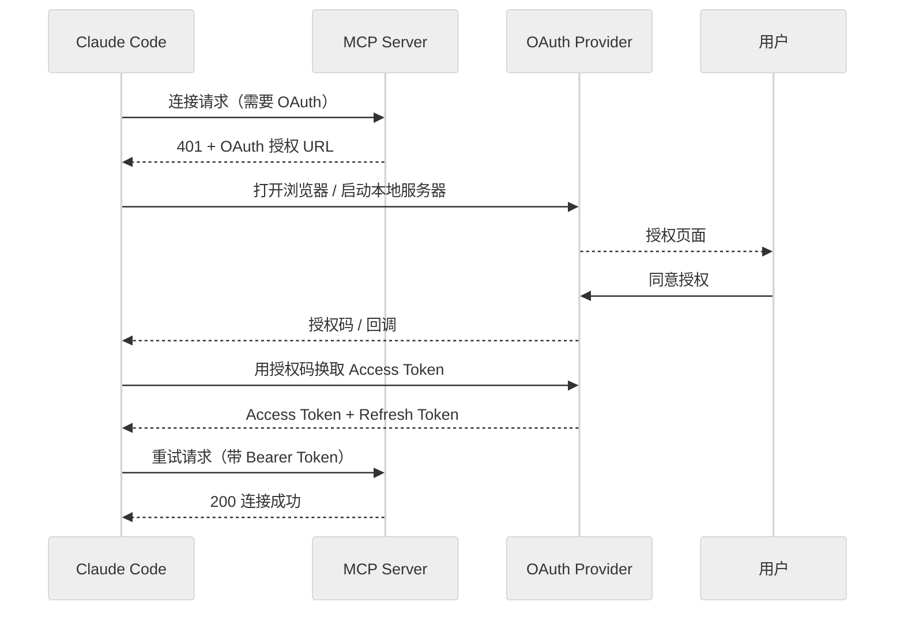
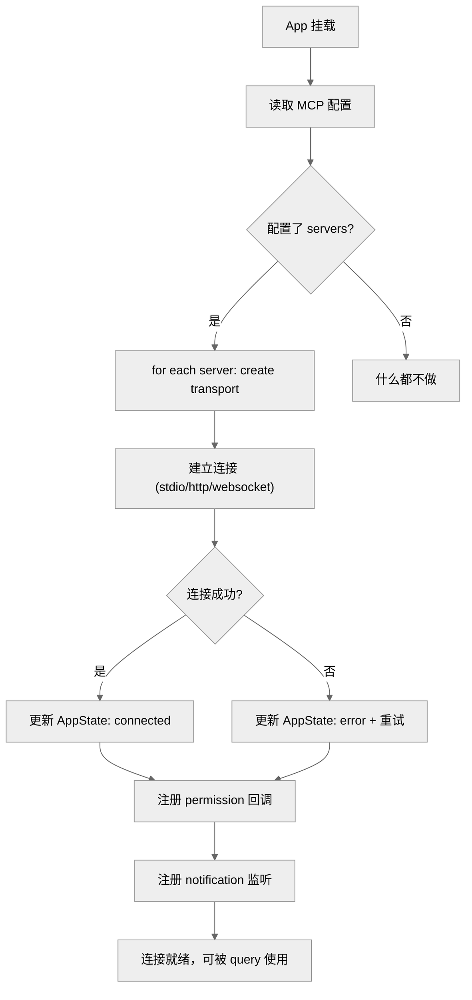

# Claude Code MCP 深度专题：OAuth 认证、生命周期钩子与渠道权限

> 本章为 [26-mcp-system.md](./26-mcp-system.md) 的补充，展开 26 章中未细化的实现细节。基础概念（Mcphub、传输类型、JSON-RPC 格式）请先阅读 26 章。

**目录**

- [1. OAuth 2.0 与 XAA 认证体系](#1-oauth-20-与-xaa-认证体系)
- [2. useManageMCPConnections：React 生命周期钩子](#2-usemanagemcpconnectionsreact-生命周期钩子)
- [3. envExpansion：MCP 配置中的环境变量展开](#4-envexpansionmcp-配置中的环境变量展开)
- [5. 渠道权限体系（channelPermissions）](#4-渠道权限体系channelpermissions)
- [6. 关键源码锚点](#5-关键源码锚点)

---

## 1. OAuth 2.0 与 XAA 认证体系

**位置**：`src/services/mcp/auth.ts`（2465 行）、`xaa.ts`（511 行）、`xaaIdpLogin.ts`（487 行）

Claude Code 的 MCP 认证支持四种模式，复杂度从低到高：

### 四种认证模式

| 模式 | 复杂度 | 适用场景 |
|------|--------|---------|
| Bearer Token | 低 | 简单的静态令牌认证 |
| OAuth 2.0 | 中 | 标准授权码流程，需要用户交互授权 |
| XAA | 高 | Anthropic 自有的外部认证扩展 |
| XAA-IDP | 最高 | 通过第三方身份提供商（IdP）间接认证 |

### OAuth 2.0 流程



### URL Elicitation 协议

当 MCP server 需要用户在浏览器中完成认证时，会触发 URL 诱导协议：

```typescript
// MCP server 发送 elicitation 请求
{ method: "elicitation", params: {
    message: "Please authenticate at: https://...",
    url: "https://auth.example.com/oauth/authorize",
    requestId: "req-123"
}}

// Claude Code 处理流程：
// 1. 打开浏览器或启动本地回调服务器
// 2. 监听回调，提取授权码
// 3. 换取 token 后重试原请求
// 4. 带重试逻辑（自动重试次数 + 间隔）
```

**核心文件**：`auth.ts` 中的 `authenticateWithOAuth()` 函数（行 800+）处理完整的 OAuth 流程，包括 PKCE 支持、token 刷新、错误恢复。

### XAA（eXternal Auth for Anthropic）

XAA 是 Anthropic 对 OAuth 的扩展，增加了：

- **动态客户端注册**：MCP server 可以动态注册为 OAuth 客户端
- **Scope 协商**：细粒度的权限 scope 协商
- **令牌轮转**：自动刷新并轮转 Access Token

### XAA-IDP：间接认证

当 MCP server 配置为使用 IdP（身份提供商）时：

```
用户 → MCP Server → IdP（Google Workspace / Okta / Auth0）→ 用户授权
```

`xaaIdpLogin.ts` 处理 IdP 登录流程，包括：
- SAML/OIDC 联合登录
- 会话管理
- 登出传播

### 认证结果缓存

成功认证后，令牌被缓存以避免重复授权。缓存键基于 `{serverName, userId, scope}` 组合，TTL 由 token 本身决定（expire_in 字段）。

---

## 2. useManageMCPConnections：React 生命周期钩子

**位置**：`src/services/mcp/useManageMCPConnections.ts`（1141 行）

这是一个 React hook，负责在 REPL 生命周期内管理 MCP 连接：

### 核心职责

```typescript
// useManageMCPConnections.ts 的主要职责
1. onMount: 初始化所有已配置的 MCP 连接
2. onUpdate: 当 AppState.mcp 配置变化时，增量添加/移除连接
3. onUnmount: 断开所有连接，清理子进程
4. 状态同步: 将连接状态写回 AppState.mcp.clients
```

### 挂载流程



### 连接状态转换

```typescript
type MCPConnectionState =
  | { status: 'idle' }                           // 未启动
  | { status: 'loading' }                        // 正在连接
  | { status: 'connected'; server: MCPServer }  // 已连接
  | { status: 'disconnected' }                  // 已断开
  | { status: 'error'; error: string }          // 错误状态
```

### 配置变更检测

```typescript
// 依赖 AppState.mcp.configs（server 配置数组）
// 当数组引用变化时（非深度比较），触发增量更新
const prevConfigs = usePrevious(configs)
const added = configs.filter(c => !prevConfigs?.find(p => p.name === c.name))
const removed = prevConfigs?.filter(p => !configs.find(c => c.name === p.name))
// 增量添加新连接，移除旧连接
```

### 错误恢复与重连

- 连接失败后自动重试（指数退避）
- 最大重试次数可配置
- `disconnect` 事件触发后，通知 AppState 并可选自动重连

---

## 3. envExpansion：MCP 配置中的环境变量展开

**位置**：`src/services/mcp/envExpansion.ts`（38 行）

MCP server 配置（JSON/YAML）中支持 `${VAR}` 和 `${VAR:-default}` 语法：

```typescript
// config.json
{
  "mcpServers": {
    "filesystem": {
      "command": "npx",
      "args": ["-y", "@modelcontextprotocol/server-filesystem", "${HOME}/projects"],
      "env": {
        "API_KEY": "${ANTHROPIC_API_KEY:-default_key}"
      }
    }
  }
}
```

展开规则：

| 语法 | 行为 |
|------|------|
| `${VAR}` | 直接替换为环境变量值 |
| `${VAR:-default}` | 优先用环境变量，未定义则用 default |
| `${VAR}`（未定义）| 保留原样（`${VAR}`），并在 `missingVars` 中报告 |

```typescript
expandEnvVarsInString("${HOME}/projects")
// → { expanded: "/Users/han/projects", missingVars: [] }

expandEnvVarsInString("${ANTHROPIC_API_KEY:-default}")
// → 如果 ANTHROPIC_API_KEY 未定义
// → { expanded: "default", missingVars: [] }

expandEnvVarsInString("${UNDEFINED_VAR}")
// → { expanded: "${UNDEFINED_VAR}", missingVars: ["UNDEFINED_VAR"] }
```

**注意**：展开在连接建立前完成，`missingVars` 非空时会记录 warning 但不阻塞连接。

---

## 4. 渠道权限体系（channelPermissions）

**位置**：`src/services/mcp/channelPermissions.ts`、`channelAllowlist.ts`

这是 MCP 权限系统的一个子维度——允许通过通信渠道（Telegram、iMessage、Discord 等）接收权限审批回复：

### 设计背景

Claude Code 在 REPL 内弹权限对话框时，可以通过 bridge 将审批请求转发到活跃的通信渠道，让用户在 IM 中回复 "yes" 来批准。第一个回复渠道优先。

```typescript
// 权限对话框触发时，同时向所有活跃渠道广播
{ method: "claude/channel/permission",
  params: {
    requestId: "req-abc123",
    message: "Allow Bash tool to run `rm -rf`?",
    channel: "telegram:tg"
}}

// 渠道回复格式
{ requestId: "req-abc123", behavior: "allow", fromServer: "plugin:telegram:tg" }
```

### 安全模型

- **信任边界**：审批方是渠道中的人类，不是 Claude Code 本身
- **allowlist 机制**：只有 GrowthBook `tengu_harbor_ledger` 白名单中的 marketplace+plugin 组合才允许启用渠道权限转发
- **零自我审批**：Claude 无法通过渠道为自己审批（`behavior` 由人类控制）
- **已知风险**：若渠道 server 被入侵，可以伪造 "yes" 答复。但被入侵的渠道本身就能注入对话内容（social engineering），这是可接受的风险权衡

### channelAllowlist

来自 GrowthBook 的运行时配置，决定哪些插件允许使用渠道权限转发：

```typescript
type ChannelAllowlistEntry = {
  marketplace: string  // e.g., "marketplace.anthropic.com"
  plugin: string      // e.g., "telegram-bridge"
}
```

### GrowthBook Feature Flag

`tengu_harbor_permissions` 独立于 `tengu_harbor` 门控（允许渠道存在，但不一定启用权限转发）。在 `useManageMCPConnections` 挂载时检查一次，session 中途改变 flag 不会生效。

---

## 5. 关键源码锚点

| 文件 | 行数 | 职责 |
|------|------|------|
| `src/services/mcp/auth.ts` | 2465 | OAuth 2.0、XAA、XAA-IDP 认证核心逻辑 |
| `src/services/mcp/xaa.ts` | 511 | XAA 协议实现 |
| `src/services/mcp/xaaIdpLogin.ts` | 487 | XAA-IdP 联合登录 |
| `src/services/mcp/useManageMCPConnections.ts` | 1141 | React hook：连接生命周期管理 |
| `src/services/mcp/elicitationHandler.ts` | 313 | URL 诱导（OAuth 浏览器授权回调）|
| `src/services/mcp/channelNotification.ts` | 316 | 渠道通知处理（来自 bridge 的 inbound 事件）|
| `src/services/mcp/channelPermissions.ts` | 240 | 渠道权限审批协议 |
| `src/services/mcp/channelAllowlist.ts` | 76 | 渠道插件白名单（GrowthBook 驱动）|
| `src/services/mcp/envExpansion.ts` | 38 | 环境变量展开工具 |

---

## 与 26 章的关系

| 话题 | 26 章覆盖深度 | 本章补充 |
|------|--------------|---------|
| OAuth/XAA 基础 | 13.1 节一句话概述 | 完整流程图 + URL Elicitation 协议 + XAA-IDP |
| 生命周期管理 | 生命周期节约 5 段落 | 独立 React hook 机制详解 |
| 渠道权限 | 完全未提及 | 本章第 4 节完整展开 |
| envExpansion | 未提及 | 本章第 3 节 |
| 通知系统 | 未提及 | channelNotification.ts 在源码中存在，本章列出位置 |

---

*文档版本: 1.1*
*分析日期: 2026-04-08*
