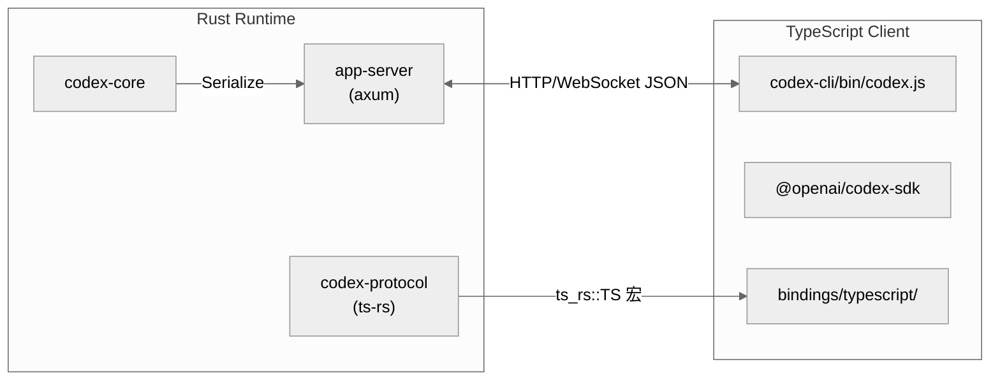

# 架构全景：仓库形态、Crate/Package 拓扑、分层模型与核心抽象

主向导对应章节：`架构全景`

## 仓库形态判断

判断 Codex 仓库重心最简单的方法，是看谁在组织真正的依赖图。`codex-rs/Cargo.toml` 的 workspace 收进了 **86 个 crate**，涵盖 `cli`、`core`、`app-server`、`app-server-protocol`、`mcp-server`、`exec`、`tui`、`cloud-tasks` 以及大量 utils crate（`codex/codex-rs/Cargo.toml:1-140`）。这不是"一个 CLI 带若干子模块"的规模，而是**一个运行时平台被拆成多宿主与多服务**的规模。

JS/TS 层则由 pnpm monorepo 管理，包含 3 个 package：

| Package | 路径 | 角色 |
| --- | --- | --- |
| `@openai/codex` | `codex-cli/` | npm 二进制分发壳 |
| `@openai/codex-sdk` | `sdk/typescript/` | TypeScript SDK（消费 exec JSON 协议）|
| `responses-api-proxy/npm` | `codex-rs/responses-api-proxy/npm/` | Responses API 代理 npm 包装 |

核心结论：**Rust workspace 是运行时与协议中心，JS/TS 只做分发、封装和生态接入**（`codex/codex-cli/bin/codex.js:15-220`; `codex/sdk/typescript/src/codex.ts:11-37`）。

## Crate 拓扑与依赖图

### 86 个 Crate 的分类

| 分类 | 数量 | 代表 |
| --- | --- | --- |
| 二进制入口 | 6 | `cli`, `tui`, `app-server`, `exec`, `mcp-server`, `exec-server` |
| 核心逻辑 | 4 | `core`, `app-server`, `codex-api`, `codex-mcp` |
| 协议定义 | 4 | `protocol`, `app-server-protocol`, `codex-api`, `codex-client` |
| 基础设施 | 25+ | `config`, `state`, `login`, `skills`, `hooks`, `sandboxing` |
| 工具 | 26 | `codex-utils-*`（absolute-path, cache, cli, elapsed, pty 等）|
| 集成 | 5+ | `backend-client`, `lmstudio`, `ollama`, `chatgpt` |

### 分层依赖模型


**零循环依赖**：每一层只依赖更低层，不存在层间回引。

### 核心依赖扇入

```
codex-protocol     ← 20+ crate 引用（序列化、消息类型、数据结构）
codex-core         ← cli, tui, exec, mcp-server, app-server, app-server-client
app-server-protocol ← app-server, tui, exec, app-server-client
codex-config       ← app-server, mcp-server, codex-mcp, core
codex-state        ← app-server, core, tui
```

## IPC/FFI 边界：纯协议通信，无 N-API/WASM

Codex 的 Rust/TypeScript 跨界**不使用 N-API 或 WASM**，而是采用纯 HTTP/WebSocket JSON 协议。这种设计的核心考量是：

| 考量 | FFI (N-API/WASM) | 纯协议 |
| --- | --- | --- |
| 跨语言类型安全 | 需手写绑定，容易出错 | `ts-rs` 编译时自动生成，零手写 |
| 平台兼容 | 需为每平台编译二进制 | 协议与平台无关 |
| 升级节奏 | 绑定层需随 API 重编 | 仅需 JSON schema 兼容 |
| 沙箱隔离边界 | 模糊（内存共享） | 清晰（进程隔离）|

### ts-rs 类型生成管线

```rust
// codex-protocol 中的典型类型（行 98-101）
#[derive(Serialize, Deserialize, ts_rs::TS)]
pub struct ResponseEvent { ... }
// → 自动生成 ResponseEvent.ts
```

生成产物示例（`codex-protocol/bindings/typescript/ResponseEvent.ts`）：

```typescript
// 编译时自动生成，与 Rust struct 完全对齐
export interface ResponseEvent {
  type: 'created' | 'output_item_added' | 'output_text_delta' | ...;
  data: {...};
}
```

### 进程边界与协议契约



**协议版本不匹配的处理**：
- `codex-protocol/schema/json/` 中维护 JSON schema 版本
- TypeScript SDK 依赖特定 schema 版本，不兼容时编译期报错
- Rust 侧通过 `ts_rs::TS` 宏确保源码改动自动触发 schema 更新

**无 FFI 的安全收益**：
- app-server 崩溃不会内存破坏 TypeScript 进程
- WebSocket 连接天然支持断线重连和优雅降级
- TypeScript 侧无需处理 Rust 所有权语义

进程层级：

```
codex (CLI binary)
├─ spawns → app-server (HTTP/WebSocket)
│   ├─ spawns → exec-server (WebSocket daemon)
│   └─ spawns → mcp-server (if enabled)
└─ connects to → TUI (via WebSocket/in-process)
```

## 六层分层模型

Codex 的分层可以概括为：

```
CLI 包装层 → TUI 编排层 → App Server 会话层 → Core Agent 层 → Tool/Sandbox 执行层 → State 持久化层
```

| 层 | 对应目录 | 职责 |
| --- | --- | --- |
| CLI 包装层 | `codex-cli`, `codex-rs/cli` | 平台二进制分发、命令行参数解析、子命令分流 |
| TUI 编排层 | `codex-rs/tui` | 终端 UI 初始化、事件循环、会话切换、渲染 |
| 会话/RPC 层 | `codex-rs/app-server` | 统一 RPC（stdio/WebSocket）、线程/配置/事件接口 |
| Agent 核心层 | `codex-rs/core` | Prompt 构建、模型调用、工具路由、线程生命周期 |
| 执行与权限层 | `codex-rs/core/src/tools/*`, `codex-rs/sandboxing` | 工具 handler、审批、沙箱隔离 |
| 持久化层 | `codex-rs/state` | SQLite（WAL）、Rollout JSONL、日志 |

这种结构把"交互"和"执行"拆得彻底，所以同一套 core 可被 TUI、exec 模式和 app-server 复用。

## 核心抽象

### ThreadManager / CodexThread

`ThreadManager` 是线程生命周期总控（`codex/codex-rs/core/src/thread_manager.rs:239-264`）。它持有 `PluginsManager`、`McpManager`、`SkillsManager`、`ModelsManager`、`file_watcher` 与 `AuthManager`，把这些全挂进 `ThreadManagerState`。

关键方法：

| 方法 | 行号 | 作用 |
| --- | --- | --- |
| `new()` | 239-264 | 组装所有 Manager，创建状态 |
| `start_thread()` | 406 | 新建线程（统一入口）|
| `resume_thread_from_rollout()` | 455 | 从 rollout 恢复线程 |
| `fork_thread()` | 598 | 从已有线程分叉 |
| `spawn_thread()` | 内部 | start/resume/fork 都汇合到此 |

线程实例存储在 `Arc<RwLock<HashMap<ThreadId, Arc<CodexThread>>>>`，创建事件通过 `broadcast::channel`（容量 1024）广播。

### ModelClient / ModelClientSession

这一对抽象分离"会话级 API 状态"和"单轮流式请求状态"（`codex/codex-rs/core/src/client.rs:182-250`）：

- `ModelClient`：缓存认证、provider 配置、WebSocket 开关
- `ModelClientSession`：每轮新建，持有 WebSocket 连接缓存和 sticky routing token

### ToolRouter / ToolRegistry / ToolOrchestrator

三件套完成工具执行闭环（`codex/codex-rs/core/src/tools/`）：

- `ToolRegistry`：存储 handler，按名称分发
- `ToolRouter`：解析模型输出为 `ToolCall`，路由到 handler
- `ToolOrchestrator`：审批 → 沙箱选择 → 执行 → 沙箱拒绝升级重试

### MessageProcessor / CodexMessageProcessor

`app-server` 不直接耦合 TUI，而是通过 `MessageProcessor` 统一处理配置、线程、认证、文件、事件订阅等 RPC 请求（`codex/codex-rs/app-server/src/message_processor.rs`; `codex/codex-rs/app-server/src/codex_message_processor.rs`）。

## 技术选型一览

| 维度 | 选型 | 角色 |
| --- | --- | --- |
| 主语言 | Rust (Edition 2024) | 主运行时：CLI、TUI、app-server、core、state、sandbox |
| 包装层 | Node.js ≥22 | 跨平台二进制分发 |
| 异步运行时 | Tokio | 线程事件、模型流式响应、工具执行、RPC |
| TUI | `ratatui` + `crossterm` | 终端 UI、事件循环、绘制 |
| Web/API | `axum` + `reqwest` + WebSocket/SSE | app-server 协议、模型 API 连接 |
| 持久化 | SQLite + `sqlx` | 线程元数据、日志、回放 |
| MCP 协议 | `rmcp` | 外部工具、资源、Apps/Connector 集成 |
| 类型同步 | `ts-rs` | Rust struct → TypeScript 类型声明 |
| 构建 | Cargo + Bazel + Just | 本地开发、CI、测试、发布 |
| 包管理 | pnpm v10.29+ | JS/TS monorepo 管理 |

## 心智模型

> 把 Codex 看成"以线程协议为中心、可以被 CLI、app-server、SDK 和其他宿主复用的 Rust runtime"。

四个直接源码支点：

1. 宿主很多，但入口统一由 `Subcommand` 与 `cli_main()` 暴露和分流（`codex/codex-rs/cli/src/main.rs:88-152`; `codex/codex-rs/cli/src/main.rs:590-715`）。
2. 运行时能力集中在 `codex-core`，尤其是 `ThreadManager` 对 start/resume/fork 的统一装配。
3. app-server 把线程生命周期和内容模型公开成稳定协议：`Thread*Params`、`Thread`、`Turn`、`ThreadItem`。
4. JS/TS 层不复制实现，只桥接二进制和协议。
