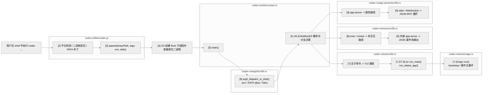
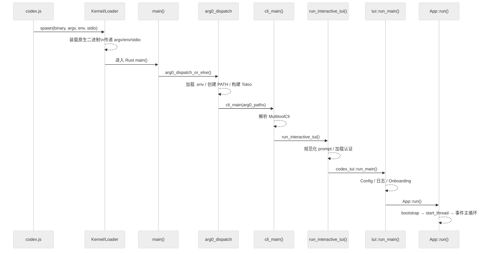

# 启动链路：入口点、CLI 参数解析、初始化顺序与 Subcommand 分发

主向导对应章节：`启动链路`

## 1. 总体流程图

先看整条启动链，再看每一段细节。下面各节按这个顺序展开：



## 2. 双层入口

Codex 严格来说有两层入口：

1. **分发入口**：`codex-cli/bin/codex.js`
2. **真实业务入口**：`codex-rs/cli/src/main.rs::main`

如果从源码运行，唯一业务入口就是 Rust 的 `main()`。npm 层只是找到正确平台二进制再 `spawn`。

## 3. JavaScript 启动器

`codex-cli/bin/codex.js`（行 1-230）完成六件事：

| 步骤 | 行号 | 动作 |
| --- | --- | --- |
| 平台检测 | 24-67 | 检测 `process.platform` / `process.arch`，映射到 target triple |
| 包解析 | 73-115 | 从 npm 平台包或本地 `vendor/` 定位 `codex` 可执行文件 |
| PATH 修改 | 126-166 | 前置平台特定路径、设置包管理器环境变量 |
| 子进程启动 | 175-178 | `spawn(binaryPath, process.argv.slice(2), { stdio: "inherit", env })` |
| 信号转发 | 189-206 | 转发 SIGINT/SIGTERM/SIGHUP 给子进程 |
| 退出码镜像 | 213-229 | 镜像子进程退出码/信号给父进程 |

核心设计：**Node 层是忠实的进程代理，不做业务决策**。

## 4. 从 `spawn()` 到 Rust `main()` 的交接层

这里最容易误解的一点是：`codex.js` **不是**用 `exec()` 把自己替换掉，而是继续保留为父进程；真正的 Rust CLI 是它拉起的一个子进程（`codex/codex-cli/bin/codex.js:175-229`）。因此进程树更接近：

```text
shell / terminal
└─ node .../codex.js
   └─ codex   # Rust 原生二进制
```

从 `spawn()` 到 Rust `main()`，关键不是抽象表格，而是下面这段实际执行的代码（`codex/codex-cli/bin/codex.js:161-178`）：

```javascript
const updatedPath = getUpdatedPath(additionalDirs);

const env = { ...process.env, PATH: updatedPath };
const packageManagerEnvVar =
  detectPackageManager() === "bun"
    ? "CODEX_MANAGED_BY_BUN"
    : "CODEX_MANAGED_BY_NPM";
env[packageManagerEnvVar] = "1";

const child = spawn(binaryPath, process.argv.slice(2), {
  stdio: "inherit",
  env,
});
```

这段代码可以按“交接了什么”来读：

1. `binaryPath`
   Node 前面已经根据平台和架构把原生二进制路径解析出来，这里真正传给 `child_process.spawn()` 的 `command` 就是这个文件路径。按 Node 官方文档的语义，`spawn(command, args, options)` 会“用给定 command 和 args 创建一个新进程”；而这段代码**没有**设置 `shell: true`，所以不会先经过 `/bin/sh -c`、`bash -lc` 或 `cmd.exe /c` 这一跳。也就是说，`spawn()` 在这里做的就是“请操作系统直接执行这个 Rust 原生二进制”，而不是“先起一个 shell，再让 shell 帮我跑 Rust”。

2. `process.argv.slice(2)`
   这里把 `node` 可执行文件路径和 `codex.js` 自身路径都剥掉，只把用户真正输入的参数转交给 Rust。比如用户执行 `codex exec --json "hi"`，Rust 子进程看到的参数就是 `["exec", "--json", "hi"]`。因此 Rust 侧 `clap` 解析到的是“原汁原味”的用户 CLI 参数，而不是 npm 包装层参数。

3. `env`
   这里不是简单透传环境变量，而是在继承 `process.env` 的基础上做了两层补丁：先把平台附带工具目录前置到 `PATH`，再打上 `CODEX_MANAGED_BY_NPM` / `CODEX_MANAGED_BY_BUN` 安装来源标记。结果是 Rust 进程一启动，就已经处在 Codex 期望的 PATH 和安装上下文里，不需要在 `main()` 之前再回头问 Node。

4. `stdio: "inherit"`
   这是启动链里最关键但最容易被忽略的一点。它表示 Rust 子进程直接复用当前终端的 stdin、stdout、stderr，而不是通过 Node 建一层 pipe 做转发。所以后面的 TUI、终端能力探测、alt-screen、信号响应，都是 Rust 进程直接面对真实终端完成的；Node 在这里没有充当“协议桥”。

5. `child = spawn(...)`
   真正“拉起 Rust 进程”的动作就发生在这一行。可以把它理解成 Node 向 OS 提交了一份启动请求：`binaryPath` 是要跑的程序，`process.argv.slice(2)` 是它的 argv，`env` 是它的环境变量，`stdio: "inherit"` 是它该绑定哪组三大标准流。OS 接到这个请求后才会创建新的原生子进程、装载对应平台二进制、初始化进程上下文，然后进入 Rust 可执行文件自己的入口代码。`spawn()` 返回的是一个 `ChildProcess` 句柄，这也解释了为什么包装层还能继续注册 `child.on("error")`、转发 `SIGINT/SIGTERM/SIGHUP`，并在子进程退出后镜像退出码（`codex/codex-cli/bin/codex.js:180-229`）。

把上面五点串起来，`spawn` 之后真正发生的是：Node 把“要执行哪个原生文件、带什么 argv、带什么 env、复用哪组 stdio”交给操作系统；操作系统据此创建 Rust 子进程并装载二进制；Rust 运行时完成最初的进程入口收尾后，控制权才落到仓库里的第一个业务入口 `cli/src/main.rs::main()`。整个过程中，完全依赖操作系统提供的“新建进程 + 传递 argv/env/stdio”机制；Codex 自己的业务启动，是从下面这个同步入口才正式开始的（`codex/codex-rs/cli/src/main.rs:595-600`）：

```rust
fn main() -> anyhow::Result<()> {
    arg0_dispatch_or_else(|arg0_paths: Arg0DispatchPaths| async move {
        cli_main(arg0_paths).await?;
        Ok(())
    })
}
```

## 5. `main()` 之后的第一站：`arg0` 多工具分发

Rust 入口 `main()` 的第一件事是调用 `arg0_dispatch_or_else()`（`codex/codex-rs/arg0/src/lib.rs:153-182`）：

```rust
fn main() -> anyhow::Result<()> {
    arg0_dispatch_or_else(|arg0_paths| async { cli_main(arg0_paths).await })
}
```

这个函数做了五件关键的事：

1. **检查特殊可执行模式**：根据 `argv[0]` 判断是否以 `codex-execve-wrapper`、`codex-linux-sandbox` 或 `apply_patch`/`applypatch` 身份运行（行 53-128），若是则直接执行对应逻辑，永不返回
2. **加载 `.env`**：从 `~/.codex/.env` 加载环境变量，但**只过滤 `CODEX_*` 前缀**以防安全泄漏
3. **创建 PATH 条目**：在 `~/.codex/tmp/arg0/` 创建临时目录，放置指向当前可执行文件的符号链接（`apply_patch`、`codex-linux-sandbox`、`codex-execve-wrapper`）
4. **构建 Tokio 运行时**：16MB 栈大小的多线程运行时
5. **返回 `Arg0DispatchPaths`**：包含 `codex_self_exe`、`codex_linux_sandbox_exe`、`main_execve_wrapper_exe`

**关键不变量**：argv[0] 分发在 Tokio 启动**之前**完成，因为 `set_var()` 不是线程安全的。

## 6. CLI 参数解析与分支决策

### 6.1 `MultitoolCli` 结构体

`cli_main()` 首先解析 `MultitoolCli`（`codex/codex-rs/cli/src/main.rs:59-86`）：

```rust
struct MultitoolCli {
    config_overrides: CliConfigOverrides,    // -c key=value
    feature_toggles: FeatureToggles,         // --enable/--disable FEATURE
    remote: InteractiveRemoteOptions,        // --remote, --remote-auth-token-env
    interactive: TuiCli,                     // prompt, images 等
    subcommand: Option<Subcommand>,          // exec, review, login 等
}
```

### 6.2 Config 覆盖优先级

从高到低依次是：

1. 子命令级 `-c` 标志
2. 子命令 feature toggle
3. 根级 `-c` 标志
4. 根级 `--enable/--disable`
5. `config.toml` 文件
6. 默认值

合并实现在 `prepend_config_flags()`（行 1137-1144）。

### 6.3 `Subcommand` 枚举

`Subcommand`（行 88-153）一次性摊开了所有运行形态：

| 分类 | 子命令 | 处理行号 | 用途 |
| --- | --- | --- | --- |
| **交互式** | （无） | 618 | 默认交互 TUI |
| | Resume | 751 | 恢复之前的会话 |
| | Fork | 777 | 从之前的会话分叉 |
| **非交互** | Exec | 642 | 代码生成 |
| | Review | 650 | 代码审查 |
| | Cloud | 854 | 云任务 |
| **认证** | Login | 788 | 用户登录 |
| | Logout | 834 | 移除凭证 |
| **MCP/服务** | Mcp | 674 | 管理 MCP 服务器 |
| | McpServer | 664 | 作为 MCP 服务器运行 |
| | AppServer | 692 | App Server 模式 |
| **工具** | Apply | 945 | 应用 git patch |
| | Completion | 842 | Shell 补全 |
| | Sandbox | 857 | 在沙箱中运行 |
| | Debug | 907 | 调试工具 |
| | Execpolicy | 932 | 策略检查 |
| | Features | 966 | 特性管理 |
| | App | 732 | 桌面 app（macOS） |
| **内部** | ResponsesApiProxy | 953 | 内部代理 |
| | StdioToUds | 963 | 内部中继 |

## 7. 默认路径：无子命令进入交互式 TUI

### 7.1 详细时序



### 7.2 `tui::run_main()` 初始化序列

`tui::run_main()`（`codex/codex-rs/tui/src/lib.rs:590-921`）的详细初始化步骤：

| 阶段 | 行号 | 动作 |
| --- | --- | --- |
| 预初始化 | 598-630 | 验证远程认证传输、确定沙箱/审批模式 |
| Config 加载 | 647-687 | `find_codex_home()` → `load_config_as_toml_with_cli_overrides()` |
| OSS 模式 | 707-741 | 解析 OSS provider → 解析模型 → 按需提示用户 |
| Config 覆盖 | 745-758 | model, approval_policy, sandbox_mode, cwd 等 |
| 系统检查 | 768-802 | Exec policy 验证、附加目录检查、登录限制 |
| 日志设置 | 804-904 | 创建日志目录 → 打开日志文件（Unix chmod 600）→ File/OTEL/LogDB 层 |
| OSS 就绪 | 849-862 | `ensure_oss_provider_ready()` |

### 7.3 `run_ratatui_app()` 进一步初始化

`run_ratatui_app()`（行 924-1359）做终端级准备：

1. **终端设置**（938-955）：安装 panic hook → `tui::init()` → `TerminalRestoreGuard`
2. **Onboarding 流程**（957-1076）：更新检查 → 判断是否需要信任/登录 → `run_onboarding_app()`
3. **会话查找**（1094-1231）：Resume/Fork 需要按 ID/名称/`--last` 查找、CWD 解析
4. **主题与显示**（1291-1316）：语法主题、alt-screen 模式（尊重 `--no-alt-screen`，自动检测 Zellij）
5. **App Server 启动**（1317-1334）：确定目标（Remote 或 Embedded）→ `start_app_server()` → `AppServerSession`

### 7.4 `App::run()` Bootstrap

`App::run()`（`codex/codex-rs/tui/src/app.rs:3483-3562`）：

1. 设置事件 channel
2. 发出初始警告
3. `app_server.bootstrap()` → default_model, available_models, auth_mode, plan_type
4. 处理模型迁移提示
5. 创建模型目录
6. 设置会话遥测
7. 进入事件主循环

## 8. 非交互分支：Exec 模式

`exec` 子命令（`codex/codex-rs/exec/src/lib.rs:177-326`）的初始化与 TUI 类似但更简洁：

1. 设置 originator
2. 解析 CLI
3. 设置日志
4. 解析沙箱模式
5. 解析 config 覆盖
6. 查找 `codex_home`
7. 加载 config TOML
8. 解析 OSS provider → 确定模型
9. **启动内嵌 app-server**
10. 处理命令 → 输出结果

关键区别：Exec 拒绝远程模式、非交互执行、结果以 JSON 事件流输出。

## 9. 服务分支：App Server 模式

`app-server` 子命令（`codex/codex-rs/app-server/src/lib.rs:351-432`）：

1. 设置消息 channel
2. 解析 CLI 覆盖
3. 预加载 config（检查 cloud 需求）
4. 构建完整 config
5. 设置日志（JSON 或默认）
6. 启动传输（**stdio 或 WebSocket**）
7. JSON-RPC 消息循环

传输选择：`AppServerTransport::Stdio` 或 `AppServerTransport::WebSocket(addr)`。

## 10. 关键初始化不变量

| 不变量 | 原因 |
| --- | --- |
| argv[0] 分发在 Tokio **之前** | `set_var()` 不是线程安全的 |
| PATH 在线程启动**之前**更新 | 所有子进程都能看到符号链接 |
| .env 在 Tokio **之前**加载 | Config 依赖环境变量覆盖 |
| 终端检查在 TUI 早期 | 检测 "dumb" 终端后再进 alt-screen |
| Config 在 env 加载**之后**构建 | Config 依赖 env override |
| Onboarding 在事件循环**之前** | 认证状态在启动前锁定 |
| App server 在 config 加载**之后** | 使用最终 config |
| Restore guard 尽早创建 | 保证 panic/exit 时清理终端 |
