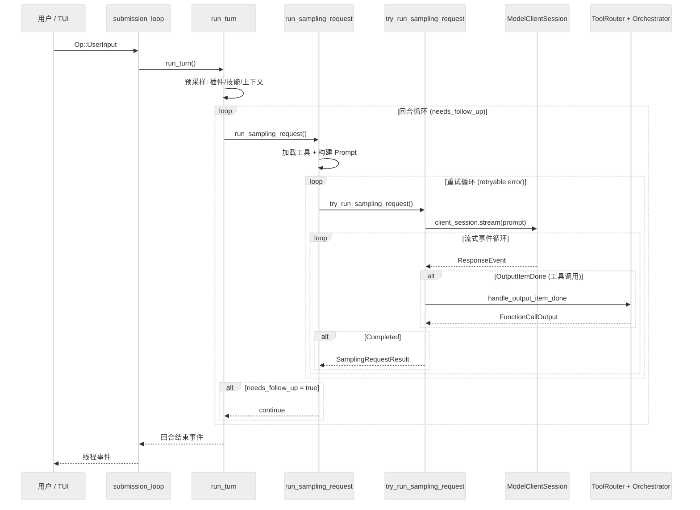

# 核心执行循环：Agent 决策链、Prompt 构建、LLM 调用与流式响应处理

主向导对应章节：`核心执行循环`

## 三层嵌套循环总览

Codex 的 Agent 执行由四层嵌套函数驱动：

| 层级 | 函数 | 文件:行号 | 职责 |
| --- | --- | --- | --- |
| 会话层 | `submission_loop()` | `codex.rs:4289` | 接收并分发所有 Op（UserInput、Interrupt、Shutdown 等）|
| 回合层 | `run_turn()` | `codex.rs:5584` | 单轮执行控制，含循环重试 |
| 采样层 | `run_sampling_request()` | `codex.rs:6363` | LLM 编排与重试 |
| 流式层 | `try_run_sampling_request()` | `codex.rs:7176` | 流式响应消费与工具调度 |



## 第一层：submission_loop（会话事件分发器）

**位置**：`codex/codex-rs/core/src/codex.rs:4417`

submission_loop 是每个会话的单线程事件消费者。它通过 bounded channel（容量 512）接收 `Submission`：

```rust
pub struct Submission {
    pub id: String,                      // 唯一提交 ID
    pub op: Op,                          // 操作枚举（20+ 种）
    pub trace: Option<W3cTraceContext>,  // OpenTelemetry 追踪
}
```

主循环 `while let Ok(sub) = rx_sub.recv().await` 逐一处理操作，不做批处理。操作类型包括 `UserInput`、`Interrupt`、`ExecApproval`、`DynamicToolResponse`、`Shutdown` 等 20+ 种。

## 第二层：run_turn（回合执行控制器）

**位置**：`codex/codex-rs/core/src/codex.rs:5714`

### 预采样准备（行 5714-5920）

1. **上下文压缩检查**：如果 token 接近上下文窗口，触发 compaction
2. **加载插件**：解析 mention、构建 skill/plugin injection
3. **运行 session start hooks**
4. **记录用户 prompt**

### 回合循环（行 5936-6013）

```rust
loop {
    let sampling_request_input = sess.clone_history().await.for_prompt(...);
    match run_sampling_request(...).await {
        Ok(result) => {
            if result.needs_follow_up { continue; } else { break; }
        }
        Err(...) => break,
    }
}
```

**`needs_follow_up` 为 true 的条件**：
1. 有工具调用需要后续处理
2. 存在待处理的用户输入（pending_input）

返回值：`Option<String>` — 最后一条 agent 消息文本。

## 第三层：run_sampling_request（LLM 编排与重试）

**位置**：`codex/codex-rs/core/src/codex.rs:6493`

### 核心序列

1. **加载工具**：`built_tools()`（行 6505）
2. **获取基础指令**：`get_user_instructions()`（行 6515）— 读取层级 `AGENTS.md`，受字节预算限制
3. **构建 Prompt**：`build_prompt()`（行 6517）

### Prompt 构建（行 6453）

```rust
pub(crate) fn build_prompt(
    input: Vec<ResponseItem>,          // 对话历史
    router: &ToolRouter,               // 工具
    turn_context: &TurnContext,        // 设置
    base_instructions: BaseInstructions,
) -> Prompt {
    let tools = router.model_visible_specs()
        .filter(|spec| !deferred_dynamic_tools.contains(spec.name()))
        .collect();
    Prompt {
        input, tools,
        parallel_tool_calls: turn_context.model_info.supports_parallel_tool_calls,
        base_instructions,
        personality: turn_context.personality,
        output_schema: turn_context.final_output_json_schema.clone(),
    }
}
```

**关键细节**：延迟加载的 dynamic tools 不会塞进模型可见工具列表，先控制 prompt 体积，再按需启用。

### 重试循环（行 6539-6626）

重试策略：

1. 调用 `try_run_sampling_request()`
2. 若出错，检查 `is_retryable()`
3. 若可重试且 retries < max_retries：指数退避 `200ms * 2^retries`（±10% 抖动），如有 server-provided delay 则使用之
4. 若可重试且 retries >= max_retries：尝试 WebSocket 到 HTTPS 回退（会话级一次性），重置重试计数器
5. 若不可重试：返回错误

## 第四层：try_run_sampling_request（流式响应循环）

**位置**：`codex/codex-rs/core/src/codex.rs:7306`

### 流式事件处理（行 7348-7650）

```rust
loop {
    let event = stream.next().await?;
    match event {
        ResponseEvent::Created => { /* 响应已创建 */ },

        ResponseEvent::OutputItemAdded(item) => {
            sess.emit_turn_item_started(...).await;
        },

        ResponseEvent::OutputTextDelta(delta) => {
            emit_streamed_assistant_text_delta(...).await;
        },

        ResponseEvent::OutputItemDone(item) => {
            // 工具调用在这里触发
            let output_result = handle_output_item_done(...).await?;
            if let Some(tool_future) = output_result.tool_future {
                in_flight.push_back(tool_future);
            }
            needs_follow_up |= output_result.needs_follow_up;
        },

        ResponseEvent::ReasoningSummaryDelta { delta, .. } => {
            // 推理内容流式输出
        },

        ResponseEvent::RateLimits(snapshot) => {
            // 速率限制更新
        },

        ResponseEvent::Completed { response_id, token_usage } => {
            sess.update_token_usage_info(...).await;
            needs_follow_up |= sess.has_pending_input().await;
            break Ok(SamplingRequestResult {
                needs_follow_up,
                last_agent_message,
            });
        },
    }
}
```

### 关键状态追踪

| 变量 | 类型 | 用途 |
| --- | --- | --- |
| `in_flight` | `FuturesOrdered<...>` | 并发工具调用队列（有序） |
| `active_item` | `Option<TurnItem>` | 当前正在流式传输的消息 |
| `needs_follow_up` | `bool` | 控制回合循环是否继续 |

## 传输层：WebSocket vs HTTPS

### 传输选择（`client.rs:1294`）

```rust
pub async fn stream(...) -> Result<ResponseStream> {
    if self.client.responses_websocket_enabled() {
        match self.stream_responses_websocket(...).await? {
            WebsocketStreamOutcome::Stream(s) => return Ok(s),
            WebsocketStreamOutcome::FallbackToHttp => {
                self.try_switch_fallback_transport(...);
            }
        }
    }
    self.stream_responses_api(...).await  // HTTPS 回退
}
```

### WebSocket 路径（`client.rs:1100`）

- **延迟连接**：首次请求时打开，turn 内缓存复用
- **跨重试复用**：同一 turn 内的重试共享 WebSocket 连接
- **增量请求**：通过 `previous_response_id` 支持增量
- **Sticky routing**：`x-codex-turn-state` header 保证路由一致性
- **超时**：provider-specific（默认 10s）

### HTTPS 路径（`client.rs:1003`）

- 标准 HTTP POST + SSE 流式
- 认证恢复循环（401 时刷新 token）
- 压缩：ChatGPT 认证使用 Zstd

### 关键不变量

- **每轮新建 `ModelClientSession`**：确保 sticky routing token 不跨轮复用
- **WebSocket 会话 turn 内缓存、turn 边界丢弃**
- **WebSocket 到 HTTPS 回退是会话级一次性操作**（`AtomicBool` 保证单次激活）

## 上下文管理

### ContextManager（`context_manager/history.rs:34`）

```rust
pub(crate) struct ContextManager {
    items: Vec<ResponseItem>,           // 最旧到最新
    token_info: Option<TokenUsageInfo>,
    reference_context_item: Option<TurnContextItem>,
}
```

关键方法：

| 方法 | 用途 |
| --- | --- |
| `record_items()` | 追加并过滤 items |
| `for_prompt()` | 归一化并返回 prompt 所需的历史（行 117）|
| `estimate_token_count()` | 基于字节的 token 估算 |

### 历史流转

1. `sess.clone_history().await` 得到 ContextManager
2. `history.for_prompt(&input_modalities)` 得到 `Vec<ResponseItem>`
3. `build_prompt(history, tools, ...)` 得到 Prompt
4. 流式响应
5. 工具输出记录，进入下一轮历史

## 核心数据结构

### TurnContext（`codex.rs:839`）

每轮不可变设置，约 40 个字段：

- `sub_id`, `model_info`, `reasoning_effort`, `collaboration_mode`
- `approval_policy`, `sandbox_policy`, `network_sandbox_policy`
- `tools_config`, `features`, `turn_metadata_state`
- `personality`, `final_output_json_schema`

### ActiveTurn（`state/turn.rs:27`）

```rust
pub(crate) struct ActiveTurn {
    pub(crate) tasks: IndexMap<String, RunningTask>,
    pub(crate) turn_state: Arc<Mutex<TurnState>>,
}
```

TurnState 包含：
- `pending_approvals` — 待审批的工具调用
- `pending_request_permissions` — 待请求的权限
- `pending_user_input` — 待用户输入
- `pending_dynamic_tools` — 待动态工具响应
- `pending_input: Vec<ResponseInputItem>` — 待处理输入
- `mailbox_delivery_phase` — 控制邮箱消息加入当前轮还是下一轮
- `tool_calls: u64` — 本轮工具调用计数
- `token_usage_at_turn_start` — 轮开始时的 token 用量

### SamplingRequestResult（`codex.rs:6627`）

```rust
struct SamplingRequestResult {
    needs_follow_up: bool,
    last_agent_message: Option<String>,
}
```

### Prompt Cache

- Prompt cache key 设为对话 ID，跨轮复用缓存
- 启用 OpenAI prompt caching 特性

## 并发模型

| 维度 | 策略 |
| --- | --- |
| Agent 循环 | **单线程**：每个 session 的所有操作在单个 Tokio task 上顺序执行 |
| 工具调用 | **轮内并发**：`FuturesOrdered` 隐式等待结果，保持有序并发 |
| 多会话 | **无同步**：每个 session 独立 Tokio task |
