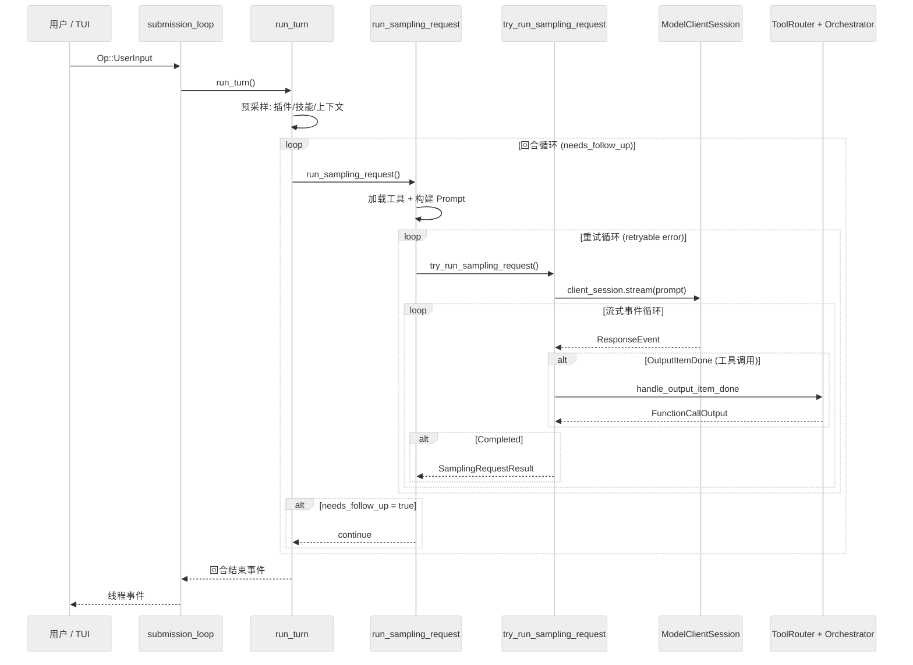
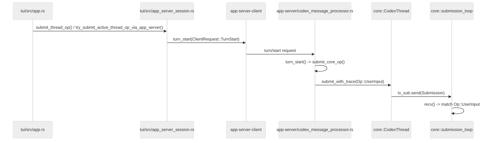

# 核心执行循环：Agent 决策链、Prompt 构建、LLM 调用与流式响应处理

主向导对应章节：`核心执行循环`

## 三层嵌套循环总览

Codex 的 Agent 执行由四层嵌套函数驱动：

| 层级 | 函数 | 文件:行号 | 职责 |
| --- | --- | --- | --- |
| 会话层 | `submission_loop()` | `codex.rs:4289` | 接收并分发所有 Op（UserInput、Interrupt、Shutdown 等）|
| 回合层 | `run_turn()` | `codex.rs:5584` | 单轮执行控制，含循环重试 |
| 采样层 | `run_sampling_request()` | `codex.rs:6363` | LLM 编排与重试 |
| 流式层 | `try_run_sampling_request()` | `codex.rs:7176` | 流式响应消费与工具调度 |



## 第一层：submission_loop（会话事件分发器）

**位置**：`codex/codex-rs/core/src/codex.rs:4289`

submission_loop 是每个会话的单线程事件消费者。它通过 bounded channel（容量 512）接收 `Submission`：

```rust
pub struct Submission {
    pub id: String,                      // 唯一提交 ID
    pub op: Op,                          // 操作枚举（20+ 种）
    pub trace: Option<W3cTraceContext>,  // OpenTelemetry 追踪
}
```

主循环 `while let Ok(sub) = rx_sub.recv().await` 逐一处理操作，不做批处理。操作类型包括 `UserInput`、`Interrupt`、`ExecApproval`、`DynamicToolResponse`、`Shutdown` 等 20+ 种。

要先澄清一个边界：**submission_loop 不是 WebSocket/HTTP server 的监听循环**。监听连接的是 app-server 传输层，在 `codex/codex-rs/app-server/src/lib.rs` 里按 `stdio` 或 `WebSocket` 启动连接接入；submission_loop 只负责消费已经进入 core 的 `Submission` 队列。

### TUI 请求如何进入 submission_loop

默认 TUI 把用户输入，先经过 app-server 抽象层，再由 app-server 把请求翻译成 `Op::UserInput` 送入 core。

默认路径是 **Embedded/InProcess**，只有显式 `--remote` 时才会走 remote WebSocket app-server（`codex/codex-rs/tui/src/lib.rs:598-604`; `codex/codex-rs/tui/src/lib.rs:348-372`）。



### 关键代码文件与方法

| 层次 | 文件 | 关键方法 | 作用 |
| --- | --- | --- | --- |
| TUI 事件入口 | `codex/codex-rs/tui/src/app.rs` | `submit_thread_op()`（1812）、`try_submit_active_thread_op_via_app_server()`（2051） | 决定一个 `AppCommand` 是本地处理，还是经 app-server 提交 |
| TUI RPC 包装 | `codex/codex-rs/tui/src/app_server_session.rs` | `turn_start()`（397） | 把用户输入包装成 `ClientRequest::TurnStart` 发给 app-server client |
| TUI 模式选择 | `codex/codex-rs/tui/src/lib.rs` | `start_app_server()`（348）、`AppServerTarget::Embedded/Remote`（598） | 默认走 embedded in-process app-server；只有 `--remote` 才连远端 WebSocket |
| app-server 请求处理 | `codex/codex-rs/app-server/src/codex_message_processor.rs` | `turn_start()`（6360）、`submit_core_op()`（2157） | 把 `turn/start` 映射成 `Op::UserInput`，并提交给目标线程 |
| core 提交入口 | `codex/codex-rs/core/src/codex.rs` | `submit_with_trace()`（697）、`submit_with_id()`（714） | 生成 `Submission`，经 `tx_sub.send(...)` 放入线程队列 |
| core 消费循环 | `codex/codex-rs/core/src/codex.rs` | `submission_loop()`（4289） | 从 `rx_sub.recv().await` 取出提交，按 `Op` 分发；`UserInput/UserTurn` 进入 `handlers::user_input_or_turn()`（4373） |

因此，`submission_loop` 更准确的定位是：**线程级 Op 队列消费者**。WebSocket/stdio 负责把外部请求送到 app-server，app-server 再把它变成 `Submission` 丢进这里；它本身不直接监听网络端口。

## 第二层：run_turn（回合执行控制器）

**位置**：`codex/codex-rs/core/src/codex.rs:5584`

`run_turn` 是单轮执行的核心控制器，分为**预采样准备**和**回合循环**两个阶段。

### 上下文与记忆管理核心数据结构

#### ContextManager（`context_manager/history.rs:34`）

```rust
pub(crate) struct ContextManager {
    /// 按时间顺序：最旧 → 最新
    items: Vec<ResponseItem>,
    token_info: Option<TokenUsageInfo>,
    /// 参考上下文快照，用于 diff 和生成模型可见的设置更新项
    reference_context_item: Option<TurnContextItem>,
}
```

**关键不变量**：
- `reference_context_item` 为 `None` 时，下一轮会注入完整初始上下文
- `reference_context_item` 存在时，只追加 diff 项，避免重复注入

---

### 预采样准备（行 5595-5805）

在正式调用 LLM 之前，Codex 需要完成一系列准备工作：

#### 1. 上下文压缩检查（行 5601）

```rust
if run_pre_sampling_compact(&sess, &turn_context).await.is_err() {
    return None;
}
```

**压缩触发逻辑**（`compact.rs:6076`）：

```rust
async fn run_pre_sampling_compact(sess, turn_context) -> CodexResult<()> {
    // 1. 模型切换时压缩旧模型上下文
    maybe_run_previous_model_inline_compact(...).await?;

    // 2. 检查是否达到 auto_compact_limit
    let total_usage_tokens = sess.get_total_token_usage().await;
    let auto_compact_limit = turn_context.model_info.auto_compact_token_limit()?;
    if total_usage_tokens >= auto_compact_limit {
        run_auto_compact(sess, turn_context, DoNotInject).await?;
    }
}
```

#### 2. 上下文压缩流程（`compact.rs:90-232`）

压缩是将长对话历史转换为摘要的核心机制：

```
历史记录 → 循环调用 LLM 生成摘要 → 替换为摘要
```

**详细步骤**：

1. **创建压缩标记**：`TurnItem::ContextCompaction`
2. **克隆历史**：`history = sess.clone_history().await`
3. **记录用户输入**：追加到历史
4. **循环调用 LLM**：
   - 调用 `drain_to_completed()` 直到成功
   - 若 `ContextWindowExceeded` 且 `turn_input_len > 1`：从头移除最旧项（保留最近消息），继续重试
5. **构建压缩后历史**：
   - 收集用户消息 + 生成摘要：`format!("{SUMMARY_PREFIX}\n{summary_suffix}")`
   - 决定是否注入初始上下文（`BeforeLastUserMessage` 或 `DoNotInject`）
   - 保留 GhostSnapshot
6. **替换历史**：
   ```rust
   sess.replace_compacted_history(new_history, reference_context_item, compacted_item).await;
   ```

**压缩触发场景**：
- 预采样检查：token 用量超过 `auto_compact_limit`
- 轮内检查：token 用量超过 `auto_compact_limit` 且 `needs_follow_up == true`

#### 3. 记录上下文更新（行 5611）

```rust
sess.record_context_updates_and_set_reference_context_item(turn_context.as_ref()).await;
```

**作用**：建立或更新参考上下文基线

```rust
// codex.rs:3677
pub(crate) async fn record_context_updates_and_set_reference_context_item(&self, turn_context) {
    let reference_context_item = state.reference_context_item();

    // 参考上下文为空 → 首次注入完整初始上下文
    let should_inject_full_context = reference_context_item.is_none();

    let context_items = if should_inject_full_context {
        self.build_initial_context(turn_context).await  // 从 AGENTS.md 等层级读取
    } else {
        // 后续轮次：只追加 diff 项，最小化 token 开销
        self.build_settings_update_items(reference_context_item.as_ref(), turn_context).await
    };

    // 记录并更新基线
    self.record_conversation_items(turn_context, &context_items).await;
    state.set_reference_context_item(Some(turn_context_item));
}
```

**初始上下文构建**（`build_initial_context`）：
- 从 `AGENTS.md` 等层级读取基础指令
- 注入当前 `TurnContext` 的完整设置项（模型信息、工具配置等）

#### 4. 加载插件（行 5614-5621）

```rust
let loaded_plugins = sess.services.plugins_manager.plugins_for_config(&turn_context.config);
let mentioned_plugins = collect_explicit_plugin_mentions(&input, loaded_plugins.capability_summaries());
```

- 从插件管理器获取当前会话已加载的插件
- 从用户输入中解析 `plugin://` 格式的显式引用

#### 5. 加载 MCP 工具（行 5622-5641）

```rust
let mcp_tools = if turn_context.apps_enabled() || !mentioned_plugins.is_empty() {
    sess.services.mcp_connection_manager.read().await.list_all_tools()
} else {
    HashMap::new()
};
```

当应用功能启用或存在显式插件引用时，列出所有可用 MCP 工具。

#### 6. 收集可用连接器（行 5642-5650）

```rust
let available_connectors = if turn_context.apps_enabled() {
    connectors::merge_plugin_apps_with_accessible(loaded_plugins.effective_apps(), ...)
} else {
    Vec::new()
};
```

合并插件提供的应用与可访问的 MCP 工具。

#### 7. 解析技能引用（行 5652-5664）

```rust
let skill_name_counts_lower = build_skill_name_counts(&outcome.skills, &outcome.disabled_paths).1;
let mentioned_skills = collect_explicit_skill_mentions(&input, &outcome.skills, ...);
```

从用户输入中解析 `skill://` 格式的技能 mention。

#### 8. 处理技能依赖（行 5666-5680）

- 若启用 `SkillEnvVarDependencyPrompt` 特性：`collect_env_var_dependencies()` + `resolve_skill_dependencies_for_turn()`
- `maybe_prompt_and_install_mcp_dependencies()` 检查并提示安装 MCP 依赖

#### 9. 构建技能注入（行 5689-5703）

```rust
let SkillInjections { items: skill_items, warnings } = build_skill_injections(...).await;
for message in skill_warnings {
    sess.send_event(&turn_context, EventMsg::Warning(...)).await;
}
```

核心函数 `build_skill_injections()` 根据提及的技能生成技能注入内容。

#### 10. 构建插件注入（行 5705-5710）

```rust
let plugin_items = build_plugin_injections(&mentioned_plugins, &mcp_tools, &available_connectors);
```

将提及的插件和 MCP 工具转换为可注入的对话项。

#### 11. 处理显式启用的连接器（行 5712-5731）

```rust
explicitly_enabled_connectors.extend(collect_explicit_app_ids_from_skill_items(
    &skill_items, &available_connectors, &skill_name_counts_lower,
));
```

#### 12. 运行 Session Start Hooks（行 5733-5735）

```rust
if run_pending_session_start_hooks(&sess, &turn_context).await {
    return None;
}
```

执行待处理的会话启动钩子，可能终止本轮。

#### 13. 记录用户 Prompt（行 5736-5759）

```rust
let user_prompt_submit_outcome = run_user_prompt_submit_hooks(...).await;
if user_prompt_submit_outcome.should_stop {
    record_additional_contexts(...);
    return None;
}
sess.record_user_prompt_and_emit_turn_item(...).await;
```

#### 14. 追踪分析事件（行 5760-5767）

```rust
sess.services.analytics_events_client.track_app_mentioned(...);
sess.services.analytics_events_client.track_plugin_used(...);
```

#### 15. 合并连接器选择（行 5768-5769）

```rust
sess.merge_connector_selection(explicitly_enabled_connectors.clone()).await;
```

#### 16. 记录对话项（行 5782-5789）

```rust
if !skill_items.is_empty() { sess.record_conversation_items(&turn_context, &skill_items).await; }
if !plugin_items.is_empty() { sess.record_conversation_items(&turn_context, &plugin_items).await; }
```

**历史写入流程**（`codex.rs:3331`）：

```rust
pub(crate) async fn record_conversation_items(&self, turn_context, items) {
    self.record_into_history(items, turn_context).await;    // 写入 ContextManager
    self.persist_rollout_response_items(items).await;     // 持久化到 rollout
    self.send_raw_response_items(turn_context, items).await; // 推送 UI
}
```

**写入 ContextManager**（`history.rs:96`）：

```rust
pub(crate) fn record_items<I>(&mut self, items: I, policy: TruncationPolicy) {
    for item in items {
        // 只保留 API 消息和 GhostSnapshot
        if !is_api_message(item_ref) && !is_ghost_snapshot {
            continue;
        }
        let processed = self.process_item(item_ref, policy);  // 截断处理
        self.items.push(processed);
    }
}
```

#### 17. 启动 Ghost Snapshot（行 5792）

```rust
sess.maybe_start_ghost_snapshot(Arc::clone(&turn_context), cancellation_token.child_token()).await;
```

可能启动影子快照，用于后续上下文恢复。

#### 18. 创建客户端会话（行 5803-5804）

```rust
let mut client_session = prewarmed_client_session.unwrap_or_else(|| sess.services.model_client.new_session());
```

---

### 回合循环（行 5806 起）

```rust
loop {
    // 1. 处理待处理输入
    let pending_input = sess.get_pending_input().await;

    // 2. 构造 Prompt 输入
    let sampling_request_input = sess.clone_history().await.for_prompt(...);

    // 3. 调用采样请求
    match run_sampling_request(...).await {
        Ok(result) => {
            if result.needs_follow_up { continue; } else { break; }
        }
        Err(...) => break,
    }

    // 4. 可能的 auto-compact
    if token_limit_reached && needs_follow_up {
        run_auto_compact(...).await?;
        continue;
    }
}
```

#### 待处理输入检查（行 5820-5854）

```rust
let pending_input = sess.get_pending_input().await;
for pending_input_item in pending_input {
    match inspect_pending_input(&sess, &turn_context, pending_input_item).await {
        PendingInputHookDisposition::Accepted(pending_input) => { ... }
        PendingInputHookDisposition::Blocked { additional_contexts } => {
            // 重新排队或中断
        }
    }
}
```

处理用户在模型运行期间通过 UI 提交的消息，可能被 hook 阻止或重新排队。

#### Prompt 输入构造（行 5857-5861）

```rust
let sampling_request_input = sess.clone_history().await
    .for_prompt(&turn_context.model_info.input_modalities);
```

**历史归一化**（`history.rs:117`）：

```rust
pub(crate) fn for_prompt(mut self, input_modalities) -> Vec<ResponseItem> {
    self.normalize_history(input_modalities);  // 修复 call/output 对、剥离图片
    self.items.retain(|item| !matches!(item, ResponseItem::GhostSnapshot { .. }));
    self.items
}
```

**normalize_history 保证**：
1. 每个 call 有对应的 output
2. 每个 output 有对应的 call
3. 当模型不支持图片时，从消息和工具输出中剥离图片

#### 轮结束条件

**`needs_follow_up` 为 true 时继续循环**：
1. 工具调用需要后续处理（执行结果待返回）
2. 存在待处理的用户输入（`sess.has_pending_input()`）

**返回值**：`Option<String>` — 最后一条 agent 消息文本，或 None（被 hook 中断）。

---

### 上下文管理关键流程图

```
用户输入
    │
    ├─ run_pre_sampling_compact() ──── 检查/执行压缩
    │       │
    │       └─ total_tokens >= auto_compact_limit？
    │               └─ run_auto_compact() → 生成摘要，替换历史
    │
    ├─ record_context_updates_and_set_reference_context_item()
    │       └─ reference_context_item 为空？
    │               └─ 是 → build_initial_context() 注入完整上下文
    │               └─ 否 → build_settings_update_items() 追加 diff
    │
    ├─ collect_explicit_plugin_mentions() ──── 解析 plugin:// 引用
    ├─ collect_explicit_skill_mentions() ──── 解析 skill:// 引用
    │
    ├─ build_skill_injections() ──── 生成技能注入项
    ├─ build_plugin_injections() ──── 生成插件注入项
    │
    ├─ run_pending_session_start_hooks() ──── 可能会中断
    ├─ run_user_prompt_submit_hooks() ──── 记录用户消息
    │
    └─ record_conversation_items() ──── 写入历史
            │
            ▼
    ┌─────────────────────────────┐
    │      回合循环开始            │
    └─────────────────────────────┘
            │
            ├─ clone_history().for_prompt()
            │       └─ normalize_history() 修复 call/output 对、剥离图片
            │
            ├─ build_prompt() ──── 组装 Prompt
            ├─ run_sampling_request() ──── 调用 LLM
            │
            └─ 工具调用结果 → record_conversation_items() → 写入历史
                    │
                    ▼
            ┌─────────────────────────────┐
            │ needs_follow_up?            │
            │   ├─ 是 → 继续循环            │
            │   └─ 否 → 返回结果            │
            └─────────────────────────────┘
```

## 第三层：run_sampling_request（LLM 编排与重试）

**位置**：`codex/codex-rs/core/src/codex.rs:6363`

### 核心序列

1. **加载工具**（行 6375）：`built_tools()` 构建 ToolRouter
2. **获取基础指令**（行 6385）：`get_base_instructions()` 读取层级的 `AGENTS.md`，受字节预算限制
3. **构建 Prompt**（行 6387）：`build_prompt()` 组装 input、tools、base_instructions 等
4. **创建工具运行时**（行 6393）：`ToolCallRuntime::new()`
5. **启动 Code Mode Worker**（行 6399）：`code_mode_service.start_turn_worker()`
6. **重试循环**（行 6410-6495）：调用 `try_run_sampling_request()`

### Prompt 构建（行 6323）

```rust
pub(crate) fn build_prompt(
    input: Vec<ResponseItem>,          // 对话历史
    router: &ToolRouter,               // 工具路由
    turn_context: &TurnContext,        // 设置
    base_instructions: BaseInstructions,
) -> Prompt {
    // 过滤延迟加载的 dynamic tools
    let deferred_dynamic_tools = turn_context.dynamic_tools.iter()
        .filter(|tool| tool.defer_loading)
        .map(|tool| tool.name.as_str())
        .collect::<HashSet<_>>();
    let tools = router.model_visible_specs()
        .filter(|spec| !deferred_dynamic_tools.contains(spec.name()))
        .collect();
    Prompt {
        input, tools,
        parallel_tool_calls: turn_context.model_info.supports_parallel_tool_calls,
        base_instructions,
        personality: turn_context.personality,
        output_schema: turn_context.final_output_json_schema.clone(),
    }
}
```

**关键细节**：延迟加载的 dynamic tools 不会塞进模型可见工具列表，先控制 prompt 体积，再按需启用。

### 重试循环（行 6410-6495）

```rust
let mut retries = 0;
loop {
    let err = match try_run_sampling_request(...).await {
        Ok(output) => return Ok(output),
        Err(CodexErr::ContextWindowExceeded) => return Err(...),
        Err(CodexErr::UsageLimitReached(e)) => return Err(...),
        Err(err) => err,
    };

    if !err.is_retryable() { return Err(err); }

    // WebSocket -> HTTPS 回退（会话级一次性）
    if retries >= max_retries
        && client_session.try_switch_fallback_transport(...)
    {
        retries = 0;
        continue;
    }

    if retries < max_retries {
        retries += 1;
        let delay = /* 指数退避 200ms * 2^retries (±10% 抖动) 或 server-provided delay */;
        tokio::time::sleep(delay).await;
    } else {
        return Err(err);
    }
}
```

**重试策略**：

1. 调用 `try_run_sampling_request()`
2. 若 `ContextWindowExceeded` 或 `UsageLimitReached`：直接返回错误
3. 若不可重试（`is_retryable() == false`）：返回错误
4. 若可重试且 `retries >= max_retries`：尝试 WebSocket 到 HTTPS 回退，重置计数器继续
5. 若可重试且 `retries < max_retries`：指数退避 `200ms * 2^retries`（±10% 抖动），如有 server-provided delay 则使用之

## 第四层：try_run_sampling_request（流式响应循环）

**位置**：`codex/codex-rs/core/src/codex.rs:7176`

### 核心流程

1. **发起流式请求**（行 7195）：`client_session.stream(prompt, ...)`
2. **初始化状态**（行 7208-7216）：
   - `in_flight`：并发工具调用队列（`FuturesOrdered`）
   - `needs_follow_up`：控制回合循环是否继续
   - `active_item`：当前正在流式传输的消息
   - `plan_mode_state`：Plan Mode 协作模式的状态
3. **流式事件循环**（行 7218-7480）：逐个处理 `ResponseEvent`

### 流式事件处理（行 7252-7479）

```rust
loop {
    let event = stream.next().await?;
    match event {
        // 响应已创建
        ResponseEvent::Created => {}

        // 新增输出项：处理非工具调用的内容
        ResponseEvent::OutputItemAdded(item) => {
            if let Some(turn_item) = handle_non_tool_response_item(...).await {
                sess.emit_turn_item_started(&turn_context, &turn_item).await;
                active_item = Some(turn_item);
            }
        }

        // 工具调用完成：触发工具执行
        ResponseEvent::OutputItemDone(item) => {
            let output_result = handle_output_item_done(&mut ctx, item, previously_active_item).await?;
            if let Some(tool_future) = output_result.tool_future {
                in_flight.push_back(tool_future);  // 加入并发队列
            }
            needs_follow_up |= output_result.needs_follow_up;
        }

        // 推理摘要增量（o4-mini 等模型）
        ResponseEvent::ReasoningSummaryDelta { delta, summary_index } => {
            sess.send_event(&turn_context, EventMsg::ReasoningContentDelta(event)).await;
        }

        // 速率限制更新
        ResponseEvent::RateLimits(snapshot) => {
            sess.update_rate_limits(&turn_context, snapshot).await;
        }

        // 响应完成：返回结果
        ResponseEvent::Completed { response_id, token_usage } => {
            sess.update_token_usage_info(&turn_context, token_usage.as_ref()).await;
            needs_follow_up |= sess.has_pending_input().await;
            break Ok(SamplingRequestResult { needs_follow_up, last_agent_message });
        }
    }
}
```

### 关键状态追踪

| 变量 | 类型 | 用途 |
| --- | --- | --- |
| `in_flight` | `FuturesOrdered<...>` | 并发工具调用队列（有序） |
| `active_item` | `Option<TurnItem>` | 当前正在流式传输的消息 |
| `needs_follow_up` | `bool` | 控制回合循环是否继续 |
| `plan_mode_state` | `Option<PlanModeStreamState>` | Plan Mode 协作模式状态 |

### 收尾处理（行 7490-7507）

```rust
// 1. 排空所有在飞的工具调用
drain_in_flight(&mut in_flight, sess.clone(), turn_context.clone()).await?;

// 2. 可能的 turn diff 发射
if should_emit_turn_diff {
    let unified_diff = turn_diff_tracker.lock().await.get_unified_diff();
    sess.send_event(&turn_context, EventMsg::TurnDiff(TurnDiffEvent { unified_diff })).await;
}
```

## 传输层：WebSocket vs HTTPS

### 传输选择（`client.rs:1294`）

```rust
pub async fn stream(...) -> Result<ResponseStream> {
    if self.client.responses_websocket_enabled() {
        match self.stream_responses_websocket(...).await? {
            WebsocketStreamOutcome::Stream(s) => return Ok(s),
            WebsocketStreamOutcome::FallbackToHttp => {
                self.try_switch_fallback_transport(...);
            }
        }
    }
    self.stream_responses_api(...).await  // HTTPS 回退
}
```

### WebSocket 路径（`client.rs:1101`）

- **延迟连接**：首次请求时打开，turn 内缓存复用
- **跨重试复用**：同一 turn 内的重试共享 WebSocket 连接
- **增量请求**：通过 `previous_response_id` 支持增量
- **Sticky routing**：`x-codex-turn-state` header 保证路由一致性
- **超时**：provider-specific（默认 10s）

### HTTPS 路径（`client.rs:1004`）

- 标准 HTTP POST + SSE 流式
- 认证恢复循环（401 时刷新 token）
- 压缩：ChatGPT 认证使用 Zstd

### 关键不变量

- **每轮新建 `ModelClientSession`**：确保 sticky routing token 不跨轮复用
- **WebSocket 会话 turn 内缓存、turn 边界丢弃**
- **WebSocket 到 HTTPS 回退是会话级一次性操作**（`AtomicBool` 保证单次激活）

## 上下文管理

### ContextManager（`context_manager/history.rs:34`）

```rust
pub(crate) struct ContextManager {
    items: Vec<ResponseItem>,           // 最旧到最新
    token_info: Option<TokenUsageInfo>,
    reference_context_item: Option<TurnContextItem>,
}
```

关键方法：

| 方法 | 用途 |
| --- | --- |
| `record_items()` | 追加并过滤 items |
| `for_prompt()` | 归一化并返回 prompt 所需的历史（行 117）|
| `estimate_token_count()` | 基于字节的 token 估算 |

### 历史流转

1. `sess.clone_history().await` 得到 ContextManager
2. `history.for_prompt(&input_modalities)` 得到 `Vec<ResponseItem>`
3. `build_prompt(history, tools, ...)` 得到 Prompt
4. 流式响应
5. 工具输出记录，进入下一轮历史

## 核心数据结构

### TurnContext（`codex.rs:839`）

每轮不可变设置，约 40 个字段：

- `sub_id`, `model_info`, `reasoning_effort`, `collaboration_mode`
- `approval_policy`, `sandbox_policy`, `network_sandbox_policy`
- `tools_config`, `features`, `turn_metadata_state`
- `personality`, `final_output_json_schema`

### ActiveTurn（`state/turn.rs:27`）

```rust
pub(crate) struct ActiveTurn {
    pub(crate) tasks: IndexMap<String, RunningTask>,
    pub(crate) turn_state: Arc<Mutex<TurnState>>,
}
```

TurnState 包含：
- `pending_approvals` — 待审批的工具调用
- `pending_request_permissions` — 待请求的权限
- `pending_user_input` — 待用户输入
- `pending_dynamic_tools` — 待动态工具响应
- `pending_input: Vec<ResponseInputItem>` — 待处理输入
- `mailbox_delivery_phase` — 控制邮箱消息加入当前轮还是下一轮
- `tool_calls: u64` — 本轮工具调用计数
- `token_usage_at_turn_start` — 轮开始时的 token 用量

### SamplingRequestResult（`codex.rs:6627`）

```rust
struct SamplingRequestResult {
    needs_follow_up: bool,
    last_agent_message: Option<String>,
}
```

### Prompt Cache

- Prompt cache key 设为对话 ID，跨轮复用缓存
- 启用 OpenAI prompt caching 特性

## 并发模型

| 维度 | 策略 |
| --- | --- |
| Agent 循环 | **单线程**：每个 session 的所有操作在单个 Tokio task 上顺序执行 |
| 工具调用 | **轮内并发**：`FuturesOrdered` 隐式等待结果，保持有序并发 |
| 多会话 | **无同步**：每个 session 独立 Tokio task |
