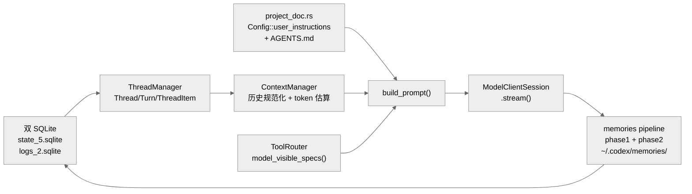
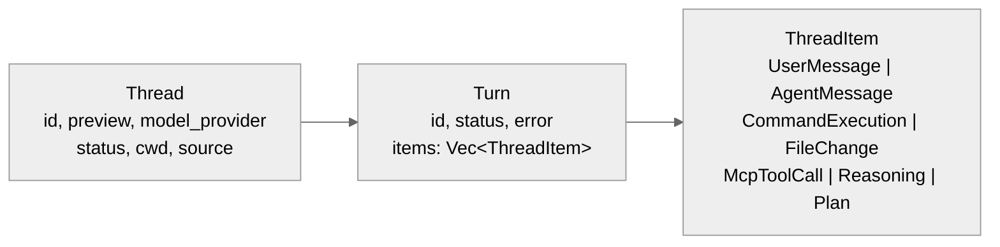
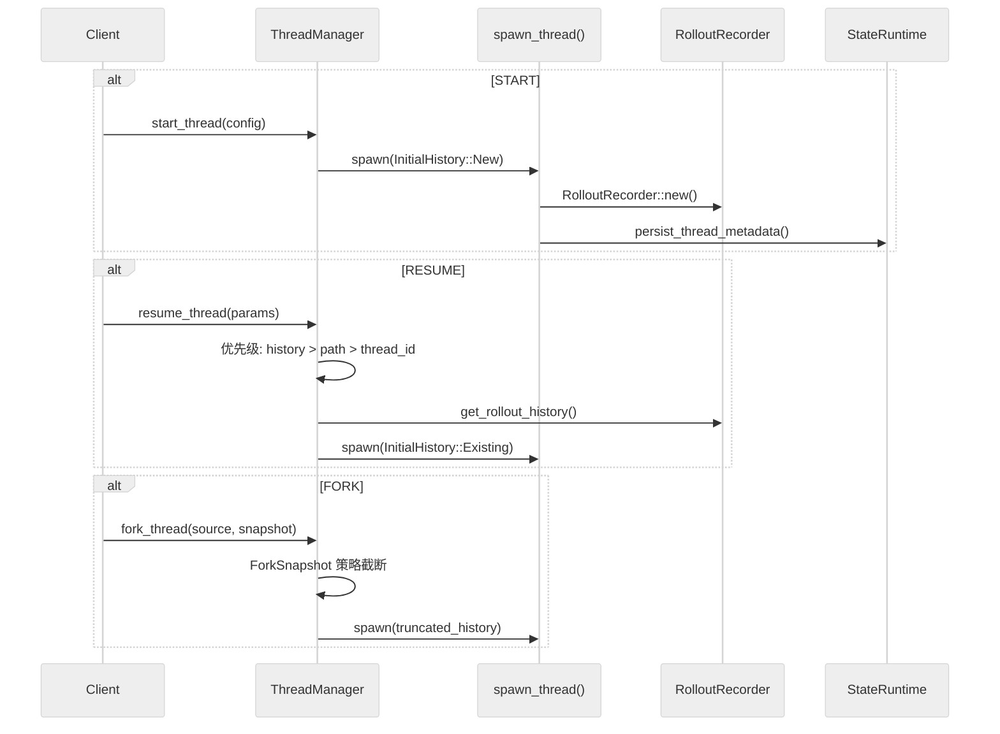
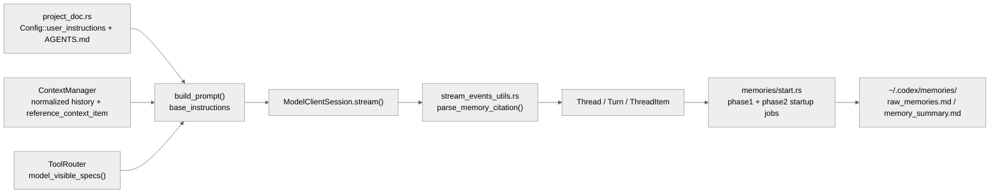

---
layout: content
title: "Codex 的状态、会话与记忆系统"
---
# Codex 的状态、会话与记忆系统

本章将三个紧密关联的子系统合并讲解：**状态管理**（Thread/Turn/ThreadItem 三层模型与持久化）、**上下文管理**（AGENTS.md、ContextManager 与 prompt 构建）、**记忆系统**（会话内 memories pipeline 与跨会话 AGENTS.md）。三者共同决定了"模型在每一轮到底看到了什么"。

**目录**

- [1. 概述](#1-概述)
- [2. 实现机制](#2-实现机制)
  - [2.1 状态管理](#21-状态管理)
  - [2.2 上下文管理](#22-上下文管理)
  - [2.3 记忆系统](#23-记忆系统)
- [3. 实际使用模式](#3-实际使用模式)
- [4. 代码示例](#4-代码示例)
- [5. 关键函数清单](#5-关键函数清单)
- [6. 代码质量评估](#6-代码质量评估)

---

## 1. 概述

Codex 的状态、会话与记忆三个子系统形成一条完整的"输入到模型"链路：



- **状态管理**负责线程的创建、恢复、分叉与持久化，是整个系统的数据基础。
- **上下文管理**决定每一轮请求中模型实际看到的历史与指令边界。
- **记忆系统**从已落盘的 rollout 中异步提取长期知识，并通过 AGENTS.md 实现跨会话持久化。

---

## 2. 实现机制

### 2.1 状态管理

#### 三层状态模型

Codex 的状态模型分为三层：Thread（线程）、Turn（回合）、ThreadItem（回合内容项）。这不是"当前 prompt"为中心的设计，而是"线程协议"为中心的设计。



**Thread**（`v2.rs:3575-3612`）保存线程级元信息：

| 字段 | 类型 | 含义 |
| --- | --- | --- |
| `id` | String | 线程唯一 ID |
| `preview` | bool | 是否为预览线程 |
| `ephemeral` | bool | 是否为临时线程 |
| `model_provider` | String | 模型提供商 |
| `created_at` / `updated_at` | Unix 秒 | 创建/更新时间 |
| `cwd` | PathBuf | 工作目录 |
| `cli_version` | String | CLI 版本 |
| `source` | String | 来源（CLI/app-server/SDK）|
| `git_info` | Option | Git 信息（SHA、分支、URL）|
| `agent_nickname` / `agent_role` | Option | 代理昵称/角色 |
| `name` | Option | 线程名称 |
| `turns` | Vec&lt;Turn&gt; | 回合列表（仅 resume/fork/read 时填充）|

**Turn**（`v2.rs:3683-3692`）描述一次回合的状态与错误边界：

| 字段 | 类型 | 含义 |
| --- | --- | --- |
| `id` | String | 回合 ID |
| `items` | Vec&lt;ThreadItem&gt; | 回合内容（仅 resume/fork 时填充）|
| `status` | TurnStatus | 回合状态 |
| `error` | Option | 错误信息 |

**ThreadItem**（`v2.rs:4232+`）是回合内部的内容实体化，有 8+ 主要变体：

| 变体 | 含义 |
| --- | --- |
| `UserMessage` | 用户消息 |
| `HookPrompt` | Hook 注入的 prompt |
| `AgentMessage` | Agent 回复文本 |
| `Plan` | 任务规划 |
| `Reasoning` | 推理内容 |
| `CommandExecution` | 命令执行记录（shell 命令 + 输出 + 退出码）|
| `FileChange` | 文件变更记录 |
| `McpToolCall` | MCP 工具调用记录 |
| `DynamicToolCall` | 动态工具调用 |
| `CollabAgentToolCall` | 协作代理调用 |

#### 线程生命周期参数

**ThreadStartParams**（`v2.rs:2546-2600`）创建线程的完整参数集：

- `model`, `provider`, `service_tier`, `cwd`
- `approval_policy`, `sandbox`
- `base_instructions`, `developer_instructions`
- `personality`, `dynamic_tools`
- `persist_extended_history`（实验性：保存丰富事件用于重建）

**ThreadResumeParams**（`v2.rs:2650-2703`）恢复线程的参数，有三种来源（优先级递降）：

1. `history`（不稳定）— 直接传入历史
2. `path`（不稳定）— 从文件路径加载
3. `thread_id` — 从数据库查找

**ThreadForkParams**（`v2.rs:2734-2780`）分叉线程的参数：

- `thread_id` — 源线程 ID
- `path`（不稳定）— rollout 文件路径
- `ephemeral` — 是否临时
- `persist_extended_history`

`ThreadStartResponse`、`ThreadResumeResponse`、`ThreadForkResponse` 都返回线程快照（`v2.rs:2528-2703`），包含 `thread`、`model`、`model_provider`、`cwd`、`approval_policy`、`sandbox`、`reasoning_effort`。

#### 内存状态管理

**ThreadManagerState**（`thread_manager.rs:199-212`）：

```rust
threads: Arc<RwLock<HashMap<ThreadId, Arc<CodexThread>>>>
thread_created_tx: broadcast::Sender<ThreadId>  // 容量 1024
```

- 多读者：`threads.read().await` 并发读取
- 单写者：`threads.write().await` 独占写入
- `Arc<CodexThread>` 可跨 task 共享

**SessionState**（`state/session.rs:19-36`）：

```rust
pub(crate) struct SessionState {
    history: ContextManager,
    latest_rate_limits: Option<RateLimitSnapshot>,
    dependency_env: HashMap<String, String>,
    mcp_dependency_prompted: HashSet<String>,
    previous_turn_settings: Option<TurnSettings>,
    startup_prewarm: Option<StartupPrewarm>,
    granted_permissions: GrantedPermissions,
}
```

**ActiveTurn**（`state/turn.rs:26-78`）：

```rust
pub(crate) struct ActiveTurn {
    pub(crate) tasks: IndexMap<String, RunningTask>,
    pub(crate) turn_state: Arc<Mutex<TurnState>>,
}
```

TurnState 含：
- `pending_approvals: HashMap<String, oneshot::Sender<ReviewDecision>>`
- `pending_request_permissions: HashMap<...>`
- `pending_user_input: HashMap<...>`
- `pending_dynamic_tools: HashMap<...>`
- `pending_input: Vec<ResponseInputItem>`
- `mailbox_delivery_phase: MailboxDeliveryPhase`
- `tool_calls: u64`
- `token_usage_at_turn_start: TokenUsage`

**MailboxDeliveryPhase 状态机**：控制待处理的子消息加入当前请求还是排队到下一轮。

#### 持久化：双 SQLite 数据库

**双数据库设计**（`state/runtime.rs:70-76`）：

| 数据库 | 文件名 | 用途 |
| --- | --- | --- |
| State DB | `state_5.sqlite` | 线程元数据、状态 |
| Logs DB | `logs_2.sqlite` | 日志记录 |

分库原因：降低日志写入和状态读写之间的锁竞争。

**SQLite 配置**：

```sql
PRAGMA journal_mode = WAL;        -- Write-Ahead Logging
PRAGMA synchronous = NORMAL;      -- 安全/速度平衡
PRAGMA busy_timeout = 5000;       -- 5 秒锁重试
PRAGMA auto_vacuum = INCREMENTAL; -- 增量回收
-- max_connections: 5 (每个数据库)
```

**State DB Schema**（`migrations/0001_threads.sql`）threads 表：

| 列 | 类型 | 说明 |
| --- | --- | --- |
| `id` | TEXT PK | 线程 ID |
| `rollout_path` | TEXT | Rollout 文件路径 |
| `created_at` / `updated_at` | INTEGER | Unix 时间戳 |
| `source` | TEXT | 来源 |
| `model_provider` | TEXT | 模型提供商 |
| `cwd` | TEXT | 工作目录 |
| `title` | TEXT | 标题 |
| `sandbox_policy` / `approval_mode` | TEXT | 策略 |
| `tokens_used` | INTEGER | Token 使用量 |
| `archived` | BOOLEAN | 是否归档 |
| `git_sha` / `git_branch` / `git_url` | TEXT | Git 信息 |

索引：`created_at DESC`、`updated_at DESC`、`archived`、`source`、`provider`。

**Logs DB Schema**（`migrations/0001_logs.sql`）logs 表：

| 列 | 类型 | 说明 |
| --- | --- | --- |
| `id` | AI PK | 自增 ID |
| `ts` / `ts_nanos` | INTEGER | 时间戳 |
| `level` | TEXT | 日志级别 |
| `target` / `message` | TEXT | 目标/消息 |
| `module_path` / `file` / `line` | TEXT | 源码位置 |

日志分区：每 10 MiB 一个分区（按 thread_id 桶分）。

**LogDbLayer**（`state/log_db.rs:48-80`）：`mpsc::Sender<LogDbCommand>` channel（容量 512），后台任务批量插入（batch size 128，flush 间隔 2s），集成 `tokio::tracing`。

#### Rollout 记录与回放

**RolloutItem 提取**（`extract.rs:15-41`）：

```rust
pub fn apply_rollout_item(
    metadata: &mut ThreadMetadata,
    item: &RolloutItem,
    default_provider: &str,
)
```

提取规则：

| RolloutItem 类型 | 提取字段 |
| --- | --- |
| `SessionMeta` | id, source, agent 元数据, model_provider, cwd, git |
| `TurnContext` | model, reasoning_effort, sandbox/approval 策略 |
| `EventMsg::TokenCount` | tokens_used |
| `EventMsg::UserMessage` | first_user_message, title |
| `ResponseItem` / `Compacted` | 无操作 |

**线程生命周期流转**：



**ForkSnapshot 策略**（`thread_manager.rs:147-166`）：

| 策略 | 行为 |
| --- | --- |
| `TruncateBeforeNthUserMessage(n)` | 在第 n 条用户消息前截断 |
| `Interrupted` | 视为当前被中断（追加 turn_aborted）|

**ThreadMetadata 模型**（`model/thread_metadata.rs:57-102`）：

```rust
pub struct ThreadMetadata {
    id, rollout_path, created_at, updated_at,
    source, agent_nickname, agent_role, agent_path,
    model_provider, model, reasoning_effort,
    cwd, cli_version, title,
    sandbox_policy, approval_mode,
    tokens_used, first_user_message, archived_at,
    git_sha, git_branch, git_origin_url,
}
```

使用 Builder 模式构建（`ThreadMetadataBuilder`），带合理默认值。

#### 并发控制模式总结

| 模式 | 使用场景 | 实现 |
| --- | --- | --- |
| `Arc<RwLock<HashMap>>` | 线程存储 | 多读/单写 |
| `broadcast::channel` | 线程创建事件 | 有损广播（容量 1024）|
| `oneshot::channel` | 回合审批/响应 | 一次性同步 |
| `watch::channel` | Shell 快照更新 | 响应式模式 |
| `mpsc::channel` | 日志写入 | 批量异步（容量 512）|
| `Arc<Mutex<TurnState>>` | 回合状态 | 异步安全互斥 |

---

### 2.2 上下文管理

#### 三层链路

| 层 | 关键代码 | 作用 |
| --- | --- | --- |
| 项目级指令层 | `codex/codex-rs/core/src/project_doc.rs` | 读取 `Config::user_instructions`、层级 `AGENTS.md`、可选 JS REPL / child-agents 附加说明 |
| 会话上下文层 | `codex/codex-rs/core/src/context_manager/history.rs` | 维护模型可见历史、做规范化、估算 token、处理 compaction 与 rollback 基线 |
| 轻量记忆层 | `codex/codex-rs/core/src/memories/*` | 从 rollout 抽取 raw memories、做两阶段 consolidation，并把 memory citation 写回线程结果 |



#### build_prompt() 的四类输入收束

`core/src/codex.rs` 里的 `build_prompt()` 把四类东西拼到一起：

1. `ContextManager::for_prompt()` 产出的历史 `input`
2. `ToolRouter::model_visible_specs()` 产出的工具声明
3. `BaseInstructions`
4. 人格、并行工具调用能力、结构化输出 schema

`project_doc.rs::get_user_instructions()` 构造 `base_instructions` 的路径：

- 先取 `config.user_instructions`
- 再按"项目根 -> 当前目录"的顺序拼接所有 `AGENTS.md`
- 受 `project_doc_max_bytes` 限制，超出预算时截断
- 按 feature flag 追加 JS REPL / child-agents 的运行时附加说明

这意味着 Codex 的项目级约束并不是某个单点 prompt 文件，而是配置层和目录层共同生成的一段 developer context。

#### ContextManager 的三件事

`ContextManager` 同时承担三件事：

1. **历史规范化**：`for_prompt()` 会丢掉不适合发给模型的项，并在无图像输入模态时剥离图片内容。
2. **上下文基线维护**：`reference_context_item` 记录下一轮 settings diff 的参考快照；发生 compaction、rollback 或历史替换时，这个基线会一起被重置。
3. **窗口压力治理**：`estimate_token_count_with_base_instructions()` 用近似 token 估算配合 compaction 任务判断是否需要压缩。

#### memories pipeline 的异步特性

`codex.rs` 会在启动后触发 `memories::start_memories_startup_task()`，由四个模块协作：

- `memories/phase1.rs`：选择 rollout、提取 stage-1 raw memories
- `memories/phase2.rs`：选择可用 raw memories、做 consolidation
- `memories/storage.rs`：同步 `raw_memories.md` 与 rollout summary 文件
- `memories/prompts.rs`：构建 memory tool 的 developer instructions 与 consolidation prompt

这套 pipeline 的中心不是当前 turn，而是已经落盘的 rollout，因此 memory 更偏离线整理，而不是每轮都做复杂注入。

`mcp_tool_call.rs` 与 `stream_events_utils.rs` 都会在满足条件时把 thread 标记为 `memory_mode_polluted`。配置里的 `no_memories_if_mcp_or_web_search` 说明：一旦上下文掺入外部 MCP 或 web search 结果，memory 会被主动降级，避免把高噪声输入错误固化。

#### 横向对照特点

- **比 Claude Code 更协议化**：Claude 会把 prompt、memory、context collapse 明确分成多个运行时专题；Codex 更强调"线程历史 + 指令拼接 + 异步 memory pipeline"。
- **比 Gemini CLI 更少依赖层级文件常驻注入**：Gemini CLI 会持续读取 `GEMINI.md` 分层记忆；Codex 更依赖 `AGENTS.md` + rollout 反刍。
- **比 OpenCode 更少显式 prompt compiler**：OpenCode 有很强的 `prompt -> loop -> processor -> durable writeback` 主线；Codex 在这一主题上把复杂度藏进 `ContextManager`、`project_doc` 和 memories startup 里。

---

### 2.3 记忆系统

#### 两种形式对比

| 类型 | 实现 | 生命周期 | 控制方式 |
|------|------|---------|---------|
| **会话内 Memory** | `memories pipeline`（自动提取） | 单次会话 | 自动 |
| **跨会话 Memory** | `AGENTS.md`（手动维护） | 永久 | 用户手动更新 |

#### 会话内记忆管道

每个 turn 结束后，Codex 会从当前 rollout（执行历史）中自动提取"值得记住"的信息：

```rust
// codex-rs/core/src/memories/extractor.rs
pub async fn extract_memories(rollout: &[ThreadItem]) -> Vec<RawMemory> {
    // 使用轻量模型从 rollout 中识别关键信息
    // 例如：用户偏好、项目约定、错误模式
    let prompt = build_extraction_prompt(rollout);
    llm_extract(prompt).await
}
```

**两阶段 Consolidation 流程**：

```
新会话 memories
    ↓ 阶段一：去重与合并
合并后的 memories
    ↓ 阶段二：重要性评分与筛选
精简 memory 列表
    ↓ 注入当前 Prompt
模型可见的 memory 上下文
```

```rust
// codex-rs/core/src/memories/consolidator.rs
pub async fn consolidate(
    existing: Vec<Memory>,
    new_memories: Vec<RawMemory>,
) -> Vec<Memory> {
    let merged = deduplicate(existing, new_memories);
    rank_by_importance(merged).truncate(MAX_MEMORY_COUNT)
}
```

**Memory 注入 Prompt 示例**：

```
System Prompt:
  [内置指令]
  [AGENTS.md 内容]
  [Memory 块]
    - 用户偏好使用 snake_case 命名
    - 项目使用 PostgreSQL 14 数据库
    - 上次修复的 auth bug 相关路径：src/auth/token.rs
```

#### 跨会话长期记忆：AGENTS.md

Codex 没有自动化的跨会话 Memory 存储。长期记忆由用户通过 `AGENTS.md` 手动维护：

```markdown
# AGENTS.md（跨会话知识库）

## 项目约定
- 使用 sqlx 进行数据库操作（不使用 diesel）
- 错误类型统一定义在 `src/errors.rs`
- 所有公开 API 需要集成测试

## 已知问题
- `src/auth/refresh.rs` 中的 token 刷新逻辑在并发场景下有竞争条件
- 测试数据库连接池配置参见 `tests/conftest.py`

## 重要路径
- 配置加载入口：`src/config/mod.rs`
- 数据库 migration：`migrations/`
```

用户可以让 Codex 主动将重要信息写入 `AGENTS.md`：

```
用户：请把我们今天发现的这个架构决策记录到 AGENTS.md 中
```

#### 与其他系统的对比

| 特性 | Codex | Claude Code | Gemini CLI | OpenCode |
|------|-------|-------------|-----------|---------|
| **会话内 Memory** | memories pipeline（自动） | 无独立机制 | 分层 `GEMINI.md` + JIT context | 无独立机制 |
| **跨会话 Memory** | `AGENTS.md`（手动） | `CLAUDE.md` + memory files | 全局/项目 `GEMINI.md` + `save_memory` | Memory 系统 |
| **自动持久化** | 部分（会话内提取） | 无 | 部分（文件持久化，非自动总结） | 是（SQLite） |
| **用户控制** | `AGENTS.md` 手动编辑 | `CLAUDE.md` 手动编辑 | `/memory` + `GEMINI.md` | 配置驱动 |

#### 设计权衡

Codex 的 Memory 设计偏向简洁：
- 自动 memories 仅存在于当前会话，降低"幽灵记忆"风险
- 跨会话知识通过显式的 `AGENTS.md` 管理，用户完全可见、可控
- 无需维护单独的 Memory 数据库，降低复杂度

局限：
- 缺乏自动跨会话 Memory（需用户手动维护 `AGENTS.md`）
- 会话内 memories 消耗额外 LLM 调用
- 大规模项目的 `AGENTS.md` 可能变得难以维护

---

## 3. 实际使用模式

三个子系统在实际场景中的协同方式：

**场景一：新会话启动**

1. `ThreadManager::start_thread()` 创建 Thread，写入 `state_5.sqlite`
2. `project_doc.rs` 读取 `AGENTS.md` 与 `config.user_instructions`，构建 `base_instructions`
3. `memories::start_memories_startup_task()` 异步启动，从历史 rollout 提取 memories
4. `build_prompt()` 将 base_instructions + 工具声明 + 空历史收束为首轮请求

**场景二：会话恢复（resume）**

1. `ThreadManager::resume_thread_from_rollout()` 按优先级（history > path > thread_id）定位历史
2. `ContextManager` 加载历史并做规范化，重置 `reference_context_item` 基线
3. memories pipeline 从已有 rollout 中补充 phase1/phase2 记忆
4. 恢复后的会话对模型透明，历史连续

**场景三：上下文窗口压力**

1. `estimate_token_count_with_base_instructions()` 检测 token 接近上限
2. `auto_compact_limit` 在 `run_turn()` 入口触发 compaction 任务
3. `ContextManager` 压缩历史，`reference_context_item` 基线随之重置
4. memories pipeline 将压缩前的关键信息异步固化到 `~/.codex/memories/`

**场景四：MCP/Web Search 污染降级**

1. 工具调用引入外部 MCP 或 web search 结果
2. `mcp_tool_call.rs` 将 thread 标记为 `memory_mode_polluted`
3. memories pipeline 跳过本轮提取，避免高噪声内容固化为长期记忆
4. 下一轮无污染时，pipeline 恢复正常运行

---

## 4. 代码示例

### ThreadMetadata Builder 模式

```rust
pub struct ThreadMetadata {
    id, rollout_path, created_at, updated_at,
    source, agent_nickname, agent_role, agent_path,
    model_provider, model, reasoning_effort,
    cwd, cli_version, title,
    sandbox_policy, approval_mode,
    tokens_used, first_user_message, archived_at,
    git_sha, git_branch, git_origin_url,
}
```

### SessionState 结构

```rust
pub(crate) struct SessionState {
    history: ContextManager,
    latest_rate_limits: Option<RateLimitSnapshot>,
    dependency_env: HashMap<String, String>,
    mcp_dependency_prompted: HashSet<String>,
    previous_turn_settings: Option<TurnSettings>,
    startup_prewarm: Option<StartupPrewarm>,
    granted_permissions: GrantedPermissions,
}
```

### ActiveTurn 与 TurnState

```rust
pub(crate) struct ActiveTurn {
    pub(crate) tasks: IndexMap<String, RunningTask>,
    pub(crate) turn_state: Arc<Mutex<TurnState>>,
}
```

### RolloutItem 提取函数

```rust
pub fn apply_rollout_item(
    metadata: &mut ThreadMetadata,
    item: &RolloutItem,
    default_provider: &str,
)
```

### memories 提取与 consolidation

```rust
// codex-rs/core/src/memories/extractor.rs
pub async fn extract_memories(rollout: &[ThreadItem]) -> Vec<RawMemory> {
    let prompt = build_extraction_prompt(rollout);
    llm_extract(prompt).await
}

// codex-rs/core/src/memories/consolidator.rs
pub async fn consolidate(
    existing: Vec<Memory>,
    new_memories: Vec<RawMemory>,
) -> Vec<Memory> {
    let merged = deduplicate(existing, new_memories);
    rank_by_importance(merged).truncate(MAX_MEMORY_COUNT)
}
```

---

## 5. 关键函数清单

### 状态管理

| 函数 | 文件 | 行号 |
| --- | --- | --- |
| `ThreadManager::start_thread()` | `thread_manager.rs` | 406 |
| `ThreadManager::resume_thread_from_rollout()` | `thread_manager.rs` | 455 |
| `ThreadManager::fork_thread()` | `thread_manager.rs` | 598 |
| `StateRuntime::init()` | `state/runtime.rs` | 84 |
| `apply_rollout_item()` | `extract.rs` | 15 |
| `ThreadMetadataBuilder::build()` | `model/thread_metadata.rs` | 173 |

### 上下文管理

| 函数/类型 | 文件 | 职责 |
|----------|------|------|
| `ContextManager` | `codex-rs/core/src/context_manager.rs` | 管理模型可见历史边界：决定哪些 turn/item 进入请求 |
| `build_prompt()` | `codex-rs/core/src/codex.rs` | 三类输入收束：system message + tool descriptions + conversation history |
| `auto_compact_limit` check | `codex-rs/core/src/codex.rs:5584` | token 预算在 `run_turn()` 入口检查，触发 compaction 或停止 |
| `MemoryManager` (async pipeline) | `codex-rs/core/src/memory/` | 异步 memory 提取 pipeline：从历史中提取结构化记忆 |
| `TurnContext.token_usage_at_turn_start` | `codex-rs/core/src/codex.rs:839` | 记录每轮 token 基线，用于判断本轮消耗 |

### 记忆系统

| 函数/类型 | 文件 | 职责 |
|----------|------|------|
| `RollingWindowContext` | `codex-rs/core/src/context.rs` | 滚动窗口上下文：限制消息历史到最近 N 条 |
| `TokenBudgetManager` | `codex-rs/core/src/context.rs` | token budget 管理：根据模型限制截断历史 |
| `context_trim()` | `codex-rs/core/src/context.rs` | 触发历史消息裁剪，保留最新消息优先 |
| `ConversationHistory` | `codex-rs/core/src/conversation.rs` | 内存中的完整消息历史，有序追加 |
| `write_history_file()` | `codex-rs/core/src/persist.rs` | 将对话历史序列化写入 `~/.codex/history/` |
| `load_history_file()` | `codex-rs/core/src/persist.rs` | 从磁盘加载历史文件，用于 `--resume` 场景 |
| `extract_memories()` | `codex-rs/core/src/memories/extractor.rs` | 从 rollout 中提取 raw memories |
| `consolidate()` | `codex-rs/core/src/memories/consolidator.rs` | 两阶段去重、评分与筛选 memories |
| `start_memories_startup_task()` | `codex-rs/core/src/memories/start.rs` | 启动异步 memories pipeline |

---

## 6. 代码质量评估

### 优点

**状态管理层面**：
- **三层状态分离清晰**：内存操作态（TurnContext）、可持久线程态（Thread）、持久会话态（Session）三层边界明确，避免了单一大状态对象带来的锁竞争和难以追踪的状态混乱。
- **双 SQLite 职责分离**：state DB 和 logs DB 各司其职，日志可单独清理而不影响线程结构，符合最小耦合原则。
- **Rollout 记录与回放**：`record_conversation_items()` 持续记录，支持无损重建会话，使 session resume 成为一等公民而非事后补丁。
- **并发控制简洁**：每个 session 单线程操作，借助 Tokio actor 模式消除绝大多数状态同步代码。

**上下文管理层面**：
- **三层收束模型清晰**：system message / tool descriptions / conversation history 三类输入在 `build_prompt()` 统一汇聚，无隐式注入路径。
- **token 预算双重保险**：`run_turn()` 入口和 `try_run_sampling_request()` 出口各有一次 token 检查，防止无限膨胀。
- **Memory 异步管道不占用主循环**：记忆提取在独立 pipeline 中异步运行，不阻塞 submission_loop 的主请求路径。

**记忆系统层面**：
- **滚动窗口保证实时性**：RollingWindowContext 保留最新 N 条消息，LLM 始终能看到最新上下文，不会因历史过长遗漏最近指令。
- **磁盘持久化支持恢复**：对话历史写入本地文件，`--resume` 标志可续接上次会话，无需依赖服务端状态。
- **token budget 自适应**：TokenBudgetManager 根据当前模型的 context window 动态调整裁剪阈值，兼容不同容量模型。

### 风险与改进点

**状态管理层面**：
- **实验性特性标记不清**：`persist_extended_history`、`experimental_raw_events` 等字段虽标注 experimental，但没有统一的 feature flag 管控，测试覆盖和弃用路径不明确。
- **ThreadMetadataBuilder 字段多**：`build()` 方法依赖大量字段正确填充，缺少运行时校验，字段遗漏会导致缺省值静默生效而非快速失败。
- **history/path overrides 供内部服务使用**：这类"内部专用但对外可见"的字段存在 API 泄露风险，若外部用户意外使用，未来难以安全移除。
- **文件系统路径硬编码风险**：history db 路径与 thread db 路径的构造逻辑散落在 Config 初始化中，难以在测试环境中替换为内存 DB。

**上下文管理层面**：
- **`ContextManager` 裁剪策略不可配置**：历史裁剪的阈值和保留策略硬编码，不同任务类型（长代码分析 vs 短对话）无法动态调整。
- **Memory pipeline 与 submission_loop 无同步点**：异步 memory 更新可能在下一轮请求前未完成，导致该轮请求用到的是上一轮的记忆快照。
- **`build_prompt()` 无工具声明 token 预算**：工具描述会随注册工具数量增长占用大量 token，当前无独立的工具描述 token 上限，可能挤压可用 context 窗口。

**记忆系统层面**：
- **纯内存历史无对话隔离**：多个并发 shell 实例共享同一历史文件，并发写入可能导致历史文件损坏。
- **trim 策略不可配置**：`context_trim()` 固定截取最旧消息，无法配置为"保留工具调用对""保留重要标记消息"等策略。
- **历史文件无加密**：`~/.codex/history/` 中以明文存储对话历史，包含的代码片段和指令无访问控制保护。

