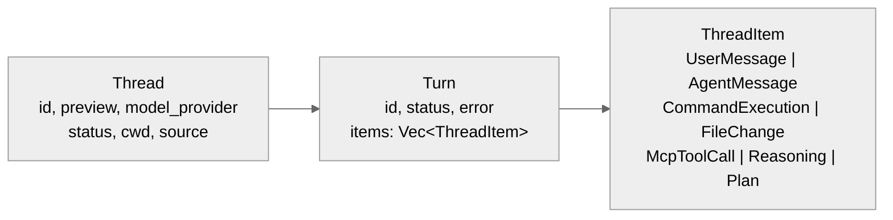
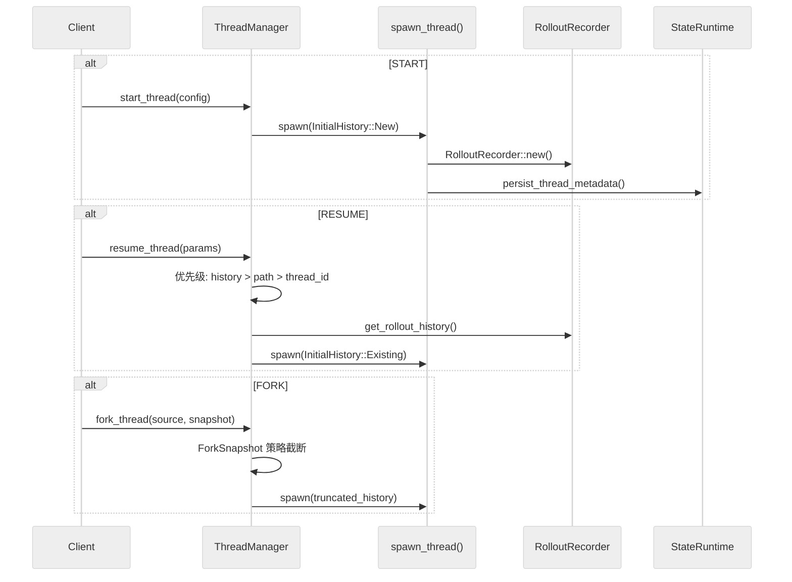

# 状态管理：Thread/Turn/ThreadItem 模型、持久化与并发控制

主向导对应章节：`状态管理`


**目录**

- [三层状态模型](#三层状态模型)
- [线程生命周期参数](#线程生命周期参数)
- [内存状态管理](#内存状态管理)
- [持久化：双 SQLite 数据库](#持久化双-sqlite-数据库)
- [Rollout 记录与回放](#rollout-记录与回放)
- [并发控制模式总结](#并发控制模式总结)
- [关键函数签名](#关键函数签名)
- [实验性特性](#实验性特性)

---

## 三层状态模型

Codex 的状态模型分为三层：Thread（线程）、Turn（回合）、ThreadItem（回合内容项）。这不是"当前 prompt"为中心的设计，而是"线程协议"为中心的设计。



### Thread（`v2.rs:3575-3612`）

Thread 保存线程级元信息：

| 字段 | 类型 | 含义 |
| --- | --- | --- |
| `id` | String | 线程唯一 ID |
| `preview` | bool | 是否为预览线程 |
| `ephemeral` | bool | 是否为临时线程 |
| `model_provider` | String | 模型提供商 |
| `created_at` / `updated_at` | Unix 秒 | 创建/更新时间 |
| `cwd` | PathBuf | 工作目录 |
| `cli_version` | String | CLI 版本 |
| `source` | String | 来源（CLI/app-server/SDK）|
| `git_info` | Option | Git 信息（SHA、分支、URL）|
| `agent_nickname` / `agent_role` | Option | 代理昵称/角色 |
| `name` | Option | 线程名称 |
| `turns` | Vec&lt;Turn&gt; | 回合列表（仅 resume/fork/read 时填充）|

### Turn（`v2.rs:3683-3692`）

Turn 描述一次回合的状态与错误边界：

| 字段 | 类型 | 含义 |
| --- | --- | --- |
| `id` | String | 回合 ID |
| `items` | Vec&lt;ThreadItem&gt; | 回合内容（仅 resume/fork 时填充）|
| `status` | TurnStatus | 回合状态 |
| `error` | Option | 错误信息 |

### ThreadItem（`v2.rs:4232+`）

ThreadItem 是回合内部的内容实体化，有 8+ 主要变体：

| 变体 | 含义 |
| --- | --- |
| `UserMessage` | 用户消息 |
| `HookPrompt` | Hook 注入的 prompt |
| `AgentMessage` | Agent 回复文本 |
| `Plan` | 任务规划 |
| `Reasoning` | 推理内容 |
| `CommandExecution` | 命令执行记录（shell 命令 + 输出 + 退出码）|
| `FileChange` | 文件变更记录 |
| `McpToolCall` | MCP 工具调用记录 |
| `DynamicToolCall` | 动态工具调用 |
| `CollabAgentToolCall` | 协作代理调用 |

## 线程生命周期参数

### ThreadStartParams（`v2.rs:2546-2600`）

创建线程的完整参数集：

- `model`, `provider`, `service_tier`, `cwd`
- `approval_policy`, `sandbox`
- `base_instructions`, `developer_instructions`
- `personality`, `dynamic_tools`
- `persist_extended_history`（实验性：保存丰富事件用于重建）

### ThreadResumeParams（`v2.rs:2650-2703`）

恢复线程的参数，有三种来源（优先级递降）：

1. `history`（不稳定）— 直接传入历史
2. `path`（不稳定）— 从文件路径加载
3. `thread_id` — 从数据库查找

### ThreadForkParams（`v2.rs:2734-2780`）

分叉线程的参数：

- `thread_id` — 源线程 ID
- `path`（不稳定）— rollout 文件路径
- `ephemeral` — 是否临时
- `persist_extended_history`

### 响应结构

`ThreadStartResponse`、`ThreadResumeResponse`、`ThreadForkResponse` 都返回线程快照（`v2.rs:2528-2703`）：

- `thread`, `model`, `model_provider`
- `cwd`, `approval_policy`, `sandbox`
- `reasoning_effort`

## 内存状态管理

### ThreadManagerState（`thread_manager.rs:199-212`）

```rust
threads: Arc<RwLock<HashMap<ThreadId, Arc<CodexThread>>>>
thread_created_tx: broadcast::Sender<ThreadId>  // 容量 1024
```

- **多读者**：`threads.read().await` 并发读取
- **单写者**：`threads.write().await` 独占写入
- **Arc&lt;CodexThread&gt;** 可跨 task 共享

### SessionState（`state/session.rs:19-36`）

```rust
pub(crate) struct SessionState {
    history: ContextManager,
    latest_rate_limits: Option<RateLimitSnapshot>,
    dependency_env: HashMap<String, String>,
    mcp_dependency_prompted: HashSet<String>,
    previous_turn_settings: Option<TurnSettings>,
    startup_prewarm: Option<StartupPrewarm>,
    granted_permissions: GrantedPermissions,
}
```

### ActiveTurn（`state/turn.rs:26-78`）

```rust
pub(crate) struct ActiveTurn {
    pub(crate) tasks: IndexMap<String, RunningTask>,
    pub(crate) turn_state: Arc<Mutex<TurnState>>,
}
```

TurnState 含：
- `pending_approvals: HashMap<String, oneshot::Sender<ReviewDecision>>`
- `pending_request_permissions: HashMap<...>`
- `pending_user_input: HashMap<...>`
- `pending_dynamic_tools: HashMap<...>`
- `pending_input: Vec<ResponseInputItem>`
- `mailbox_delivery_phase: MailboxDeliveryPhase`
- `tool_calls: u64`
- `token_usage_at_turn_start: TokenUsage`

**MailboxDeliveryPhase 状态机**：控制待处理的子消息加入当前请求还是排队到下一轮。

## 持久化：双 SQLite 数据库

### 双数据库设计（`state/runtime.rs:70-76`）

| 数据库 | 文件名 | 用途 |
| --- | --- | --- |
| State DB | `state_5.sqlite` | 线程元数据、状态 |
| Logs DB | `logs_2.sqlite` | 日志记录 |

**分库原因**：降低日志写入和状态读写之间的锁竞争。

### SQLite 配置

```sql
PRAGMA journal_mode = WAL;        -- Write-Ahead Logging
PRAGMA synchronous = NORMAL;      -- 安全/速度平衡
PRAGMA busy_timeout = 5000;       -- 5 秒锁重试
PRAGMA auto_vacuum = INCREMENTAL; -- 增量回收
-- max_connections: 5 (每个数据库)
```

### State DB Schema（`migrations/0001_threads.sql`）

threads 表：

| 列 | 类型 | 说明 |
| --- | --- | --- |
| `id` | TEXT PK | 线程 ID |
| `rollout_path` | TEXT | Rollout 文件路径 |
| `created_at` / `updated_at` | INTEGER | Unix 时间戳 |
| `source` | TEXT | 来源 |
| `model_provider` | TEXT | 模型提供商 |
| `cwd` | TEXT | 工作目录 |
| `title` | TEXT | 标题 |
| `sandbox_policy` / `approval_mode` | TEXT | 策略 |
| `tokens_used` | INTEGER | Token 使用量 |
| `archived` | BOOLEAN | 是否归档 |
| `git_sha` / `git_branch` / `git_url` | TEXT | Git 信息 |

索引：`created_at DESC`、`updated_at DESC`、`archived`、`source`、`provider`。

### Logs DB Schema（`migrations/0001_logs.sql`）

logs 表：

| 列 | 类型 | 说明 |
| --- | --- | --- |
| `id` | AI PK | 自增 ID |
| `ts` / `ts_nanos` | INTEGER | 时间戳 |
| `level` | TEXT | 日志级别 |
| `target` / `message` | TEXT | 目标/消息 |
| `module_path` / `file` / `line` | TEXT | 源码位置 |

日志分区：每 10 MiB 一个分区（按 thread_id 桶分）。

### LogDbLayer（`state/log_db.rs:48-80`）

- `mpsc::Sender<LogDbCommand>` channel（容量 512）
- `process_uuid: String`（每进程唯一）
- 后台任务批量插入（batch size 128，flush 间隔 2s）
- 集成 `tokio::tracing`

## Rollout 记录与回放

### RolloutItem 提取（`extract.rs:15-41`）

```rust
pub fn apply_rollout_item(
    metadata: &mut ThreadMetadata,
    item: &RolloutItem,
    default_provider: &str,
)
```

提取规则：

| RolloutItem 类型 | 提取字段 |
| --- | --- |
| `SessionMeta` | id, source, agent 元数据, model_provider, cwd, git |
| `TurnContext` | model, reasoning_effort, sandbox/approval 策略 |
| `EventMsg::TokenCount` | tokens_used |
| `EventMsg::UserMessage` | first_user_message, title |
| `ResponseItem` / `Compacted` | 无操作 |

### 线程生命周期流转



### ForkSnapshot 策略（`thread_manager.rs:147-166`）

| 策略 | 行为 |
| --- | --- |
| `TruncateBeforeNthUserMessage(n)` | 在第 n 条用户消息前截断 |
| `Interrupted` | 视为当前被中断（追加 turn_aborted）|

### ThreadMetadata 模型（`model/thread_metadata.rs:57-102`）

```rust
pub struct ThreadMetadata {
    id, rollout_path, created_at, updated_at,
    source, agent_nickname, agent_role, agent_path,
    model_provider, model, reasoning_effort,
    cwd, cli_version, title,
    sandbox_policy, approval_mode,
    tokens_used, first_user_message, archived_at,
    git_sha, git_branch, git_origin_url,
}
```

使用 Builder 模式构建（`ThreadMetadataBuilder`），带合理默认值。

## 并发控制模式总结

| 模式 | 使用场景 | 实现 |
| --- | --- | --- |
| `Arc<RwLock<HashMap>>` | 线程存储 | 多读/单写 |
| `broadcast::channel` | 线程创建事件 | 有损广播（容量 1024）|
| `oneshot::channel` | 回合审批/响应 | 一次性同步 |
| `watch::channel` | Shell 快照更新 | 响应式模式 |
| `mpsc::channel` | 日志写入 | 批量异步（容量 512）|
| `Arc<Mutex<TurnState>>` | 回合状态 | 异步安全互斥 |

## 关键函数签名

| 函数 | 文件 | 行号 |
| --- | --- | --- |
| `ThreadManager::start_thread()` | `thread_manager.rs` | 406 |
| `ThreadManager::resume_thread_from_rollout()` | `thread_manager.rs` | 455 |
| `ThreadManager::fork_thread()` | `thread_manager.rs` | 598 |
| `StateRuntime::init()` | `state/runtime.rs` | 84 |
| `apply_rollout_item()` | `extract.rs` | 15 |
| `ThreadMetadataBuilder::build()` | `model/thread_metadata.rs` | 173 |

## 实验性特性

- `persist_extended_history: bool` — 保存丰富 EventMsg 变体用于精确重建
- `experimental_raw_events: bool` — 原始 Responses API items（仅内部）
- `history/path overrides` — 不稳定，供 Codex Cloud 使用

---

## 代码质量评估

**优点**

- **三层状态分离清晰**：内存操作态（TurnContext）、可持久线程态（Thread）、持久会话态（Session）三层边界明确，避免了单一大状态对象带来的锁竞争和难以追踪的状态混乱。
- **双 SQLite 职责分离**：history DB 和 thread DB 各司其职，history 可单独清理而不影响 thread 结构，符合最小耦合原则。
- **Rollout 记录与回放**：`record_conversation_items()` 持续记录，支持无损重建会话，使 session resume 成为一等公民而非事后补丁。
- **并发控制简洁**：每个 session 单线程操作，借助 Tokio actor 模式消除绝大多数状态同步代码。

**风险与改进点**

- **实验性特性标记不清**：`persist_extended_history`、`experimental_raw_events` 等字段虽标注 experimental，但没有统一的 feature flag 管控，测试覆盖和弃用路径不明确。
- **ThreadMetadataBuilder 字段多**：`build()` 方法依赖大量字段正确填充，缺少运行时校验，字段遗漏会导致缺省值静默生效而非快速失败。
- **history/path overrides 供内部服务使用**：这类"内部专用但对外可见"的字段存在 API 泄露风险，若外部用户意外使用，未来难以安全移除。
- **文件系统路径硬编码风险**：history db 路径与 thread db 路径的构造逻辑散落在 Config 初始化中，难以在测试环境中替换为内存 DB。
