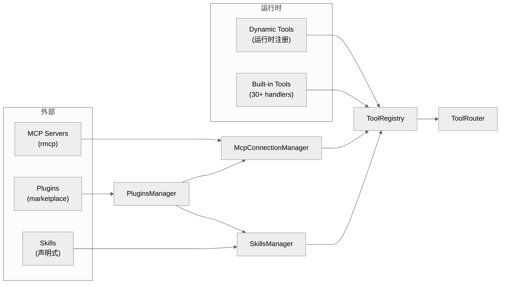

# 扩展性：MCP Server 集成、Plugin/Skill 加载与新增工具的修改点

主向导对应章节：`扩展性`


**目录**

- [扩展机制总览](#扩展机制总览)
- [MCP Server 集成](#mcp-server-集成)
- [插件系统](#插件系统)
- [技能系统](#技能系统)
- [动态工具](#动态工具)
- [MCP Server 模式（codex 作为 MCP server）](#mcp-server-模式codex-作为-mcp-server)
- [Connector / App 发现](#connector-app-发现)
- [新增工具的修改点](#新增工具的修改点)

---

## 扩展机制总览

Codex 的扩展体系分为五层：

| 层 | 机制 | 管理器 | 注册路径 |
| --- | --- | --- | --- |
| MCP 协议层 | 标准 MCP tool/resource 发现与执行 | `McpManager` + `McpConnectionManager` | config.toml `[mcp_servers]` |
| 插件管理层 | 把 skills + MCP servers + apps 打包成可安装单元 | `PluginsManager` | config.toml `[plugins]` / marketplace |
| 技能系统层 | 声明式可复用能力，带依赖注入 | `SkillsManager` | skill 目录结构 |
| 动态工具层 | 运行时注册的工具 | Session 内 `dynamic_tools` | 程序化注册 |
| 内建工具层 | 硬编码的 30+ handler | `ToolRegistry` | 代码修改 |



## MCP Server 集成

### McpManager（`core/src/mcp.rs:14-41`）

```rust
impl McpManager {
    pub fn new(plugins_manager: Arc<PluginsManager>) -> Self
    pub fn configured_servers(&self, config: &Config) -> HashMap<String, McpServerConfig>
    pub fn effective_servers(&self, config: &Config, auth: Option<&CodexAuth>) -> HashMap<String, McpServerConfig>
    pub fn tool_plugin_provenance(&self, config: &Config) -> ToolPluginProvenance
}
```

- `configured_servers()`：列出配置中声明的所有 MCP server
- `effective_servers()`：应用认证过滤后的可用 server
- `tool_plugin_provenance()`：映射工具到其所属插件

### McpConnectionManager（`codex-mcp/src/mcp_connection_manager.rs`）

每个 MCP server 对应一个 `RmcpClient` 连接。工具聚合规则：

1. **全限定名**：`mcp__<server>__<tool>`
2. **名称清洗**：仅保留字母数字和下划线（OpenAI Responses API 要求）
3. **冲突处理**：名称过长或冲突时使用 SHA1 哈希后缀（最长 64 字符）

ToolInfo 结构（行 184-195）：

```rust
pub struct ToolInfo {
    server_name: String,
    tool_name: String,
    tool_namespace: String,
    tool: McpTool,
    connector_id: Option<String>,
    connector_name: Option<String>,
    plugin_display_names: Vec<String>,
    connector_description: Option<String>,
}
```

### McpConfig（`codex-mcp/src/mcp/mod.rs:72-101`）

```rust
pub struct McpConfig {
    pub chatgpt_base_url: String,
    pub codex_home: PathBuf,
    pub mcp_oauth_credentials_store_mode: OAuthCredentialsStoreMode,
    pub mcp_oauth_callback_port: Option<u16>,
    pub skill_mcp_dependency_install_enabled: bool,
    pub approval_policy: Constrained<AskForApproval>,
    pub apps_enabled: bool,
    pub configured_mcp_servers: HashMap<String, McpServerConfig>,
    pub plugin_capability_summaries: Vec<PluginCapabilitySummary>,
}
```

## 插件系统

### PluginsManager（`core/src/plugins/manager.rs`，1813 行）

核心结构（行 311-346）：

```rust
pub struct PluginsManager {
    codex_home: PathBuf,
    store: PluginStore,
    featured_plugin_ids_cache: RwLock<Option<CachedFeaturedPluginIds>>,
    cached_enabled_outcome: RwLock<Option<PluginLoadOutcome>>,
    remote_sync_lock: Mutex<()>,
    restriction_product: Option<Product>,
    analytics_events_client: RwLock<Option<AnalyticsEventsClient>>,
}
```

### 主要操作

| 操作 | 行号 | 签名 |
| --- | --- | --- |
| 发现 | 366-395 | `plugins_for_config(&self, config: &Config) -> PluginLoadOutcome` |
| 安装 | 497-589 | `install_plugin(request) -> Result<PluginInstallOutcome>` |
| 卸载 | 591-642 | `uninstall_plugin(&self, plugin_id) -> Result<()>` |
| 远程同步 | 644-845 | `sync_plugins_from_remote(&self, config, auth, additive_only)` |
| 列出市场 | 847-910 | `list_marketplaces_for_config(&self, config, additional_roots)` |
| 读取插件 | 912-1004 | `read_plugin_for_config(&self, config, request)` |

### McpManager（`core/src/mcp.rs:14-41`）

| 方法 | 行号 | 作用 |
| --- | --- | --- |
| `new()` | 14 | 构造实例，注入 PluginsManager |
| `configured_servers()` | 21 | 返回 config.toml 中声明的所有 MCP server |
| `effective_servers()` | 28 | 应用认证过滤后的可用 server 映射 |
| `tool_plugin_provenance()` | 35 | 建立工具→插件的归属映射 |

### McpConnectionManager（`codex-mcp/src/mcp_connection_manager.rs:48-120`）

| 方法 | 行号 | 作用 |
| --- | --- | --- |
| `connect()` | 71 | 建立单个 MCP server 的 RmcpClient 连接 |
| `disconnect()` | 88 | 断开指定 server 连接 |
| `list_tools()` | 103 | 发现并返回所有已连接 server 的工具清单 |
| `call_tool()` | 115 | 通过 server 执行工具调用 |
| `get_effective_tools()` | 95 | 聚合全限定名、去冲突（SHA1 后缀） |

### SkillsManager（`core/src/skills.rs:20-42`）

| 方法 | 行号 | 作用 |
| --- | --- | --- |
| `skills_load_input_from_config()` | 44-54 | 从 config 和 skill root 构建加载输入 |
| `resolve_skill_dependencies_for_turn()` | 56-96 | 解析技能依赖，缺失时通过 UI 请求 |
| `maybe_emit_implicit_skill_invocation()` | 171-230 | 检测隐式技能调用，发射遥测计数器 |

### DynamicTool 注册路径（`core/src/codex.rs:577+`）

| 步骤 | 行号 | 说明 |
| --- | --- | --- |
| 延迟加载注册 | 577+ | dynamic_tools 不进入首轮 prompt |
| 按需启用 | 594+ | deferred_dynamic_tools 从模型可见列表排除 |
| 执行响应 | 4856 | `Op::DynamicToolResponse` 路由到工具输出 |

### 插件清单结构

每个插件的目录结构：

```
<plugin_root>/
├── .codex-plugin/
│   └── plugin.json          # 插件清单
├── skills/                   # 技能目录（默认路径）
├── .mcp.json                 # MCP server 配置
└── .app.json                 # App/Connector 配置
```

### 插件加载管线（行 1390-1487）

1. 从 config name 解析 plugin ID
2. 从 PluginStore 解析 active root
3. 加载 `.codex-plugin/plugin.json` 清单
4. 从 manifest.paths.skills 加载技能
5. 从 `.mcp.json` 加载 MCP servers
6. 从 `.app.json` 加载 Apps

### MCP Server 加载（行 1711-1809）

`load_mcp_servers_from_file()` 的规范化处理：

- 移除 transport type 字段
- 将相对 CWD 路径转为绝对路径
- 对不支持的 OAuth 回调发出警告
- 按 `McpServerConfig` schema 验证

### LoadedPlugin 结构

```rust
pub struct LoadedPlugin {
    config_name: String,
    manifest_name: Option<String>,
    manifest_description: Option<String>,
    root: AbsolutePathBuf,
    enabled: bool,
    skill_roots: Vec<PathBuf>,
    disabled_skill_paths: HashSet<PathBuf>,
    has_enabled_skills: bool,
    mcp_servers: HashMap<String, McpServerConfig>,
    apps: Vec<AppConnectorId>,
    error: Option<String>,
}
```

### Marketplace 系统

- **策划仓库**：OpenAI marketplace（`openai-curated`）
- **同步进程**（行 1037-1077）：每进程运行一次（原子标志防重复），后台线程刷新缓存
- **远程同步**（行 644-845）：与 ChatGPT 后端对账，返回 `installed / enabled / disabled / uninstalled` 列表

## 技能系统

### SkillsManager（`core/src/skills.rs:20-42`）

从 `codex_core_skills` crate 重导出：

- `SkillsManager` — 主技能加载器
- `SkillLoadOutcome` / `SkillMetadata` — 技能信息
- `SkillError` / `SkillPolicy` — 错误/策略类型
- `SkillDependencyInfo` — 依赖定义

### 技能加载（行 44-54）

```rust
pub(crate) fn skills_load_input_from_config(
    config: &Config,
    effective_skill_roots: Vec<PathBuf>,
) -> SkillsLoadInput {
    SkillsLoadInput::new(
        config.cwd.clone().to_path_buf(),
        effective_skill_roots,
        config.config_layer_stack.clone(),
        config.bundled_skills_enabled(),
    )
}
```

### 依赖解析（行 56-96）

```rust
pub(crate) async fn resolve_skill_dependencies_for_turn(
    sess: &Arc<Session>,
    turn_context: &Arc<TurnContext>,
    dependencies: &[SkillDependencyInfo],
)
```

流程：
1. 检查现有 session env
2. 从 `env::var()` 加载缺失值
3. 通过 UI 请求缺失值（标记为 secret/密码输入）
4. 存储到 session dependency env

### 隐式技能调用（行 171-230）

```rust
pub(crate) async fn maybe_emit_implicit_skill_invocation(
    sess: &Session,
    turn_context: &TurnContext,
    command: &str,
    workdir: &Path,
)
```

- 检测命令是否匹配技能名称
- 每轮跟踪已见技能（防重复）
- 发射 `codex.skill.injected` 遥测计数器

## 动态工具

### DynamicToolSpec（`codex_protocol::dynamic_tools`）

Session 级动态工具注册：

```rust
pub(crate) dynamic_tools: Vec<DynamicToolSpec>,
```

来源：
1. 显式 session 参数
2. 从 rollout 数据库持久化
3. 从对话历史检索

### 工具过滤（`codex.rs:577-599`）

延迟加载的动态工具不会进入模型可见工具列表，等待按需启用：

```rust
let deferred_dynamic_tools = turn_context.dynamic_tools
    .iter()
    .map(|spec| spec.name())
    .collect::<Vec<_>>();

let tools = effective_mcp_tools()
    .filter(|spec| !deferred_dynamic_tools.contains(spec.name()));
```

### 事件流

- `EventMsg::DynamicToolCallRequest(_)` — 工具执行请求
- `EventMsg::DynamicToolCallResponse(_)` — 工具结果
- Handler：`Op::DynamicToolResponse { id, response }`（行 4529）

### 持久化（`state_db_bridge.rs:5,11`）

```rust
pub use codex_rollout::state_db::get_dynamic_tools;
pub use codex_rollout::state_db::persist_dynamic_tools;
```

## MCP Server 模式（codex 作为 MCP server）

### 入口（`mcp-server/src/lib.rs:56-179`）

```rust
pub async fn run_main(
    arg0_paths: Arg0DispatchPaths,
    cli_config_overrides: CliConfigOverrides,
) -> IoResult<()>
```

架构：3 个并发任务 + channel 通信

| 任务 | 职责 |
| --- | --- |
| stdin reader | 反序列化 JSON-RPC |
| message processor | 处理请求/响应 |
| stdout writer | 序列化输出消息 |

### MessageProcessor（`message_processor.rs:52-158`）

处理的请求类型：

| 请求 | 用途 |
| --- | --- |
| `InitializeRequest` | 初始化 MCP server |
| `ListToolsRequest` | 列出可用工具 |
| `CallToolRequest` | 执行工具 |
| `ListPromptsRequest` / `GetPromptRequest` | Prompts API |
| `ListResourcesRequest` / `ReadResourceRequest` | Resources API |

### CodexToolRunner（`codex_tool_runner.rs:55-142`）

```rust
pub async fn run_codex_tool_session(
    id: RequestId,
    initial_prompt: String,
    config: CodexConfig,
    outgoing: Arc<OutgoingMessageSender>,
    thread_manager: Arc<ThreadManager>,
    ...
)
```

执行流程：
1. 通过 `thread_manager.start_thread(config)` 启动新线程
2. 提交初始 prompt（`sub_id = MCP request_id`）
3. 流式传送所有回合事件作为 MCP notifications
4. 返回最终结果为 `CallToolResult`（含 `thread_id` 和回合完成消息）

## Connector / App 发现

### list_accessible_connectors_from_mcp_tools（`connectors.rs:95-100`）

```rust
pub async fn list_accessible_connectors_from_mcp_tools(
    config: &Config,
) -> anyhow::Result<Vec<AppInfo>>
```

缓存策略：
- Key：Account ID + ChatGPT User ID + workspace status
- TTL：15 分钟（`CONNECTORS_CACHE_TTL`）
- 静态缓存 + instant-based 过期

## 新增工具的修改点

### 情况 A：新增外部 MCP server 暴露的工具

通常**不需要改 core 主链路**。原因：
- `ToolRouter::build_tool_call()` 已能识别 namespaced MCP tool
- `build_specs_with_discoverable_tools()` 会把 MCP tools 纳入注册
- `McpHandler` 已是通用处理器

需要做的工作：
1. 让新 server/tool 出现在 MCP 配置或插件发现结果里
2. 确认 tool schema 能被 `rmcp` 和 tool registry 正常发现
3. 若是 Apps/Connector 工具，检查启用条件和 connector 过滤逻辑

### 情况 B：新增 Codex 内建的一类新工具

需要修改以下核心位置：

| 修改位置 | 文件 | 说明 |
| --- | --- | --- |
| Handler 实现 | `core/src/tools/handlers/<new>.rs` | 实现 `ToolHandler` trait |
| 工具规范 | `core/src/tools/spec.rs` | 注册到 `build_specs_with_discoverable_tools()` |
| 路由器 | `core/src/tools/router.rs` | 添加新的 `ToolHandlerKind` 变体 |
| 协议类型 | `codex_protocol` | 若涉及新参数类型 |
| 编排器 | `core/src/tools/orchestrator.rs` | 若涉及新审批/沙箱语义 |

### 缓存策略总结

| 对象 | 缓存机制 | TTL |
| --- | --- | --- |
| Plugins | `RwLock` 保护，force reload 重算 | 按需 |
| Featured Plugins | 时间戳缓存 | 3 小时 |
| Accessible Connectors | 静态缓存 + 认证 key | 15 分钟 |
| MCP Tools | 每用户账户缓存 | 连接生命周期 |

---

## 关键函数清单

| 函数/类型 | 文件 | 职责 |
|----------|------|------|
| `McpClient::connect()` | `codex-rs/core/src/mcp/...` | 连接 MCP server（stdio / SSE）|
| `McpClient::list_tools()` | `codex-rs/core/src/mcp/...` | 拉取远程工具声明列表 |
| `McpClient::call_tool()` | `codex-rs/core/src/mcp/...` | 调用单个 MCP 工具 |
| `PluginManager::load_plugins()` | `codex-rs/core/src/...` | 发现并加载 plugin 配置 |
| `PluginManager::get_featured()` | — | 带时间戳缓存（3 小时）的 featured plugin 获取 |
| `SkillManager::discover_skills()` | `codex-rs/core/src/...` | 扫描工作目录中的 `.md` skill 文件 |
| `DynamicTool::resolve()` | `codex-rs/core/src/...` | 延迟加载动态工具 schema |
| `codex_serve()` | — | Codex 作为 MCP server 模式的入口函数 |

---

## 代码质量评估

**优点**

- **四类扩展点统一**：MCP 工具、Plugin、Skill、Dynamic Tool 通过统一的工具注册表接入，扩展机制不需要修改核心 loop。
- **缓存策略分级**：Featured Plugins 3 小时、Connector 15 分钟、MCP 连接内缓存，不同生命周期的数据有各自合适的 TTL。
- **Codex 能反向作为 MCP server**：`codex_serve()` 让 Codex 自身能被其它 AI 工具复用，拓展了生态集成场景。

**风险与改进点**

- **MCP 连接错误无 fallback**：MCP server 不可用时工具直接消失，模型会收到"工具不存在"错误而非降级提示。
- **Plugin `RwLock` 阻塞读写**：并发请求场景下，force reload 会独占写锁导致所有读请求阻塞，可考虑 per-plugin 细粒度锁。
- **Skill 文件信任边界模糊**：Skill 是 `.md` + prompt 注入，文件内容直接注入 system prompt，若 skill 文件被篡改，后果等价于 prompt injection。
- **动态工具 schema 无版本校验**：远程 MCP 工具升级 schema 后，客户端无感知更新，可能在工具调用时才发生参数类型不兼容。
