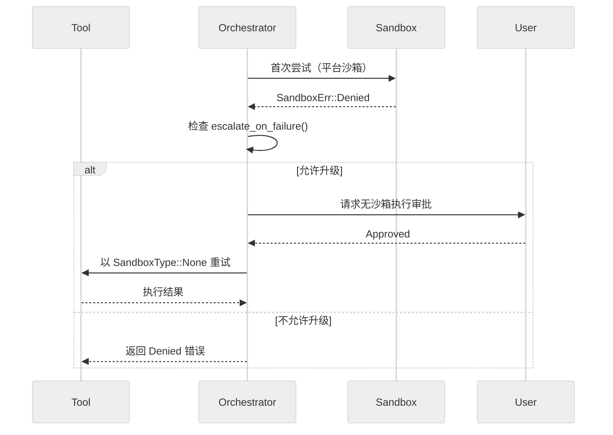

# 错误处理与安全性：异常捕获、重试策略、沙箱隔离与敏感文件防泄漏

主向导对应章节：`错误处理与安全性`

## 统一错误类型体系

### CodexErr（`core/src/error.rs:66`）

Codex 定义了统一错误枚举 `CodexErr`，包含 27+ 变体：

| 分类 | 变体 | 含义 |
| --- | --- | --- |
| **连接/流** | `Stream(String, Option<Duration>)` | SSE 流断连（可选重试延迟）|
| | `ConnectionFailed(ConnectionFailedError)` | 网络连接失败 |
| | `ResponseStreamFailed(ResponseStreamFailed)` | SSE 流失败（含 request ID）|
| | `Timeout` | 超时 |
| **模型/配额** | `ContextWindowExceeded` | 上下文窗口溢出 |
| | `UsageLimitReached(UsageLimitReachedError)` | 用量限制 |
| | `QuotaExceeded` | 配额耗尽 |
| | `ServerOverloaded` | 服务端过载 |
| | `InternalServerError` | 服务端内部错误 |
| **认证** | `RefreshTokenFailed(RefreshTokenFailedError)` | Token 刷新失败 |
| | `UnexpectedStatus(UnexpectedResponseError)` | HTTP 异常状态码 |
| **沙箱** | `Sandbox(SandboxErr)` | 沙箱错误 |
| | `LandlockSandboxExecutableNotProvided` | Linux sandbox 可执行文件缺失 |
| **线程** | `ThreadNotFound(ThreadId)` | 线程未找到 |
| | `AgentLimitReached { max_threads }` | Agent 数量上限 |
| | `InternalAgentDied` | 内部 Agent 异常终止 |
| **流程控制** | `TurnAborted` | 回合被中止 |
| | `Interrupted` | 被用户中断 |
| | `Spawn` | 进程创建失败 |
| **通用** | `Fatal(String)` | 致命错误 |
| | `InvalidRequest(String)` | 无效请求 |
| | `UnsupportedOperation(String)` | 不支持的操作 |
| | `RetryLimit(RetryLimitReachedError)` | 重试上限 |

### SandboxErr（`error.rs:31`）

```rust
pub enum SandboxErr {
    Denied { output: Box<ExecToolCallOutput>, network_policy_decision: Option<...> },
    SeccompInstall(seccompiler::Error),      // Linux only
    SeccompBackend(seccompiler::BackendError),
    Timeout { output: Box<ExecToolCallOutput> },
    Signal(i32),
    LandlockRestrict,
}
```

### 可重试 vs 不可重试分类（`error.rs:197-232`）

`is_retryable()` 是重试逻辑的核心判定点：

**不可重试**（返回 false）：

| 变体 | 原因 |
| --- | --- |
| `TurnAborted`, `Interrupted` | 用户主动中止 |
| `Fatal`, `InvalidRequest`, `InvalidImageRequest` | 逻辑错误 |
| `ContextWindowExceeded` | 需要压缩而非重试 |
| `UsageLimitReached`, `QuotaExceeded`, `UsageNotIncluded` | 配额问题 |
| `Sandbox(*)`, `LandlockSandboxExecutableNotProvided` | 安全策略 |
| `RefreshTokenFailed` | 认证失败 |
| `RetryLimit` | 已用尽重试预算 |
| `ServerOverloaded` | 需要等待而非立即重试 |

**可重试**（返回 true）：

| 变体 | 原因 |
| --- | --- |
| `Stream(*, *)` | 网络断连 |
| `Timeout` | 超时可恢复 |
| `UnexpectedStatus(*)` | HTTP 暂时异常 |
| `ResponseStreamFailed(*)` | SSE 流暂时中断 |
| `ConnectionFailed(*)` | 网络暂时不可达 |
| `InternalServerError` | 服务端暂时异常 |
| `InternalAgentDied` | Agent 意外终止 |
| `Io(*)`, `Json(*)`, `TokioJoin(*)` | 系统/解析暂时错误 |

### 附加错误结构

| 结构 | 行号 | 关键字段 |
| --- | --- | --- |
| `UnexpectedResponseError` | 267 | HTTP status, body, URL, CloudFlare ray ID, request ID |
| `ConnectionFailedError` | 236 | 包装 reqwest::Error |
| `ResponseStreamFailed` | 247 | SSE 错误 + request ID |
| `RetryLimitReachedError` | 385 | 最后尝试的 status code |
| `UsageLimitReachedError` | 405 | plan type, reset time, rate limit, promo message |
| `EnvVarError` | 538 | 变量名 + 设置说明 |

### UI 错误展示

`get_error_message_ui()`（`error.rs:618-652`）对错误消息做长度裁剪，避免终端被刷爆。

## 重试策略

### 指数退避（`util.rs:204-209`）

```rust
const INITIAL_DELAY_MS: u64 = 200;
const BACKOFF_FACTOR: f64 = 2.0;

pub fn backoff(attempt: u64) -> Duration {
    let exp = BACKOFF_FACTOR.powi(attempt.saturating_sub(1) as i32);
    let base = (INITIAL_DELAY_MS as f64 * exp) as u64;
    let jitter = rand::rng().random_range(0.9..1.1);  // +/-10% 抖动
    Duration::from_millis((base as f64 * jitter) as u64)
}
```

退避时间表：

| 尝试次数 | 基准延迟 | 实际范围（含抖动） |
| --- | --- | --- |
| 1 | 200ms | 180-220ms |
| 2 | 400ms | 360-440ms |
| 3 | 800ms | 720-880ms |
| 4 | 1600ms | 1440-1760ms |

### 流式重试机制（`codex.rs` 约行 6571）

```
if !err.is_retryable() -> 立即返回错误

if retries < provider.stream_max_retries():
    retries += 1
    wait backoff(retries) or server-provided delay
    retry

if retries >= max_retries:
    if try_switch_fallback_transport() succeeds:
        emit warning("Falling back from WebSockets to HTTPS transport")
        retries = 0  // 为新传输重置计数器
        continue on HTTPS
    else:
        return error
```

### 特殊重试处理

- `CodexErr::Stream(_, Some(requested_delay))`：优先使用服务端建议的重试延迟
- **WebSocket 到 HTTPS 回退**：会话级一次性（`AtomicBool` 原子交换保证单次激活）
- **401 认证恢复**：`handle_unauthorized()` 尝试刷新凭证

## 沙箱隔离

### 沙箱类型

| 类型 | 平台 | 技术 | 路径 |
| --- | --- | --- | --- |
| `None` | 全平台 | 无隔离 | — |
| `MacosSeatbelt` | macOS | `/usr/bin/sandbox-exec` + SBPL | 硬编码路径防 PATH 注入 |
| `LinuxSeccomp` | Linux | bubblewrap + seccomp + landlock | `codex-linux-sandbox` 二进制 |
| `WindowsRestrictedToken` | Windows | Job objects + restricted tokens | 原生 API |

### 沙箱策略模式

**ReadOnly**：

```rust
ReadOnly {
    access: ReadOnlyAccess,      // Full 或 Restricted(readable_roots)
    network_access: bool,
}
```

**WorkspaceWrite**：

```rust
WorkspaceWrite {
    writable_roots: Vec<AbsolutePathBuf>,  // 如 [/project/dir]
    read_only_access: ReadOnlyAccess,
    network_access: bool,
    exclude_tmpdir_env_var: bool,
    exclude_slash_tmp: bool,
}
```

**ExternalSandbox**：由外部系统管理，仅控制网络访问。

**DangerFullAccess**：无限制，仅在显式审批后允许。

### 沙箱选择逻辑（`manager.rs:138-165`）

```rust
pub fn select_initial(
    &self,
    file_system_policy: &FileSystemSandboxPolicy,
    network_policy: NetworkSandboxPolicy,
    pref: SandboxablePreference,
    windows_sandbox_level: WindowsSandboxLevel,
    has_managed_network_requirements: bool,
) -> SandboxType {
    match pref {
        Forbid => SandboxType::None,
        Require => get_platform_sandbox(...).unwrap_or(None),
        Auto => {
            if should_require_platform_sandbox(...) {
                get_platform_sandbox(...)
            } else {
                SandboxType::None
            }
        }
    }
}
```

### 沙箱命令转换（`manager.rs:167-259`）

`SandboxManager::transform()` 把原始命令包装成沙箱执行请求：

```
原始命令: ["bash", "-c", "ls /tmp"]
                |
        transform()
                |
macOS:   ["/usr/bin/sandbox-exec", "-p", "<sbpl_policy>", "bash", "-c", "ls /tmp"]
Linux:   ["codex-linux-sandbox", "--sandbox-policy", "<json>", "--", "bash", "-c", "ls /tmp"]
Windows: 原始命令 + restricted token + job object
```

### 沙箱拒绝升级流程



## 路径安全

### AbsolutePathBuf 类型系统

Codex 全面使用 `AbsolutePathBuf`（来自 `codex_utils_absolute_path`）：

- **类型安全的绝对路径表示**：构造时验证
- **防止相对路径意外**：类型系统层面阻止
- **符号链接规范化**：通过 `canonicalize()` 解析

### 路径规范化（`seatbelt.rs:140-154`）

```rust
fn normalize_path_for_sandbox(path: &Path) -> Option<AbsolutePathBuf> {
    if !path.is_absolute() {
        return None;  // 显式拒绝相对路径
    }
    let absolute_path = AbsolutePathBuf::from_absolute_path(path).ok()?;
    absolute_path.as_path()
        .canonicalize()  // 解析符号链接和 .. 遍历
        .ok()
        .and_then(|p| AbsolutePathBuf::from_absolute_path(p).ok())
        .or(Some(absolute_path))
}
```

### 权限路径规范化（`policy_transforms.rs:166-184`）

```rust
fn normalize_permission_paths(paths: Vec<AbsolutePathBuf>, _kind: &str) -> Vec<AbsolutePathBuf> {
    let mut out = Vec::with_capacity(paths.len());
    let mut seen = HashSet::new();
    for path in paths {
        let canonicalized = canonicalize(path.as_path())
            .ok()
            .and_then(|p| AbsolutePathBuf::from_absolute_path(p).ok())
            .unwrap_or(path);
        if seen.insert(canonicalized.clone()) {  // 去重
            out.push(canonicalized);
        }
    }
    out
}
```

## apply_patch 拦截机制

### 目的

防止模型通过 `exec_command` 绕过 `apply_patch` 的权限控制。

### 拦截函数（`apply_patch.rs:257-298`）

```rust
pub async fn intercept_apply_patch(
    command: &[String],
    cwd: &Path,
    timeout_ms: Option<u64>,
    session: Arc<Session>,
    turn: Arc<TurnContext>,
    tracker: Option<&SharedTurnDiffTracker>,
    call_id: &str,
    tool_name: &str,
) -> Result<Option<FunctionToolOutput>, FunctionCallError>
```

行为：
1. 检测命令是否为 `apply_patch` 调用
2. 如果是，发出模型警告："请使用 apply_patch 工具而非 exec_command"
3. 计算 patch 所需的写入权限（仅目标文件所在目录）
4. 通过正规权限审批流程执行 patch

### 权限计算（`apply_patch.rs:63-91`）

```rust
fn write_permissions_for_paths(
    file_paths: &[AbsolutePathBuf],
    file_system_sandbox_policy: &FileSystemSandboxPolicy,
    cwd: &Path,
) -> Option<PermissionProfile>
```

- 提取 patch 涉及的所有文件路径的父目录
- 过滤掉已在沙箱策略中允许写入的路径
- 构建最小权限 `PermissionProfile`

## 权限合并与升级

### 权限 Profile 合并（`policy_transforms.rs:63-109`）

```rust
pub fn merge_permission_profiles(
    base: Option<&PermissionProfile>,
    permissions: Option<&PermissionProfile>,
) -> Option<PermissionProfile>
```

合并规则：
- **网络**：OR 逻辑 — 任一方授予则合并结果授予
- **文件系统**：路径并集（read + write 分别合并）

### 有效文件系统策略（`policy_transforms.rs:275-293`）

```rust
pub fn effective_file_system_sandbox_policy(
    file_system_policy: &FileSystemSandboxPolicy,
    additional_permissions: Option<&PermissionProfile>,
) -> FileSystemSandboxPolicy
```

仅在 `FileSystemSandboxKind::Restricted` 模式下追加额外写入路径；Unrestricted 和 ExternalSandbox 模式不做升级。

### 有效网络策略（`policy_transforms.rs:327-340`）

```rust
pub fn effective_network_sandbox_policy(
    network_policy: NetworkSandboxPolicy,
    additional_permissions: Option<&PermissionProfile>,
) -> NetworkSandboxPolicy
```

若额外权限授予网络访问，升级为 Enabled；若有额外权限但未授予网络，降级为 Restricted。

## 敏感文件防泄漏的多层防御

Codex 的敏感文件保护不是靠单点过滤，而是**多层约束**：

| 层 | 机制 | 作用 |
| --- | --- | --- |
| 1. 工具白名单 | `ToolRegistry` 只注册已知工具 | 防止任意命令执行 |
| 2. 工作目录解析 | `resolve_path()` 基于 turn context 而非模型传参 | 防止路径注入 |
| 3. 文件系统沙箱 | ReadOnly / WorkspaceWrite / Restricted | 物理隔离文件访问 |
| 4. 审批链 | `AskForApproval` + 缓存 | 人工/自动审批门控 |
| 5. apply_patch 拦截 | `intercept_apply_patch()` | 防止绕过 patch 权限 |
| 6. 环境变量过滤 | .env 加载仅 `CODEX_*` 前缀 | 防止密钥泄漏 |
| 7. Unix socket 白名单 | `UnixDomainSocketPolicy::Restricted` | 精确控制 IPC |
| 8. 网络策略 | NetworkSandboxPolicy + host 审批 | 防止未授权外联 |

### 环境变量安全

`arg0_dispatch_or_else()`（`arg0/src/lib.rs`）加载 `~/.codex/.env` 时**仅过滤 `CODEX_*` 前缀**，阻止将敏感变量（如 `AWS_SECRET_KEY`、`DATABASE_URL`）注入子进程环境。

### Windows 世界可写目录警告

`app-server` 启动阶段会检查 Windows 平台上的世界可写目录风险并发出提示。

## 关键函数签名

| 函数 | 文件 | 行号 |
| --- | --- | --- |
| `CodexErr::is_retryable()` | `error.rs` | 197 |
| `CodexErr::to_codex_protocol_error()` | `error.rs` | 566 |
| `get_error_message_ui()` | `error.rs` | 618 |
| `backoff()` | `util.rs` | 204 |
| `SandboxManager::select_initial()` | `manager.rs` | 138 |
| `SandboxManager::transform()` | `manager.rs` | 167 |
| `ToolOrchestrator::run()` | `orchestrator.rs` | 101 |
| `with_cached_approval()` | `sandboxing.rs` | 70 |
| `default_exec_approval_requirement()` | `sandboxing.rs` | 171 |
| `intercept_apply_patch()` | `apply_patch.rs` | 257 |
| `merge_permission_profiles()` | `policy_transforms.rs` | 63 |
| `effective_file_system_sandbox_policy()` | `policy_transforms.rs` | 275 |
| `normalize_permission_paths()` | `policy_transforms.rs` | 166 |
