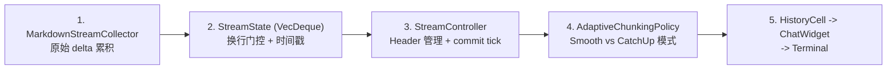
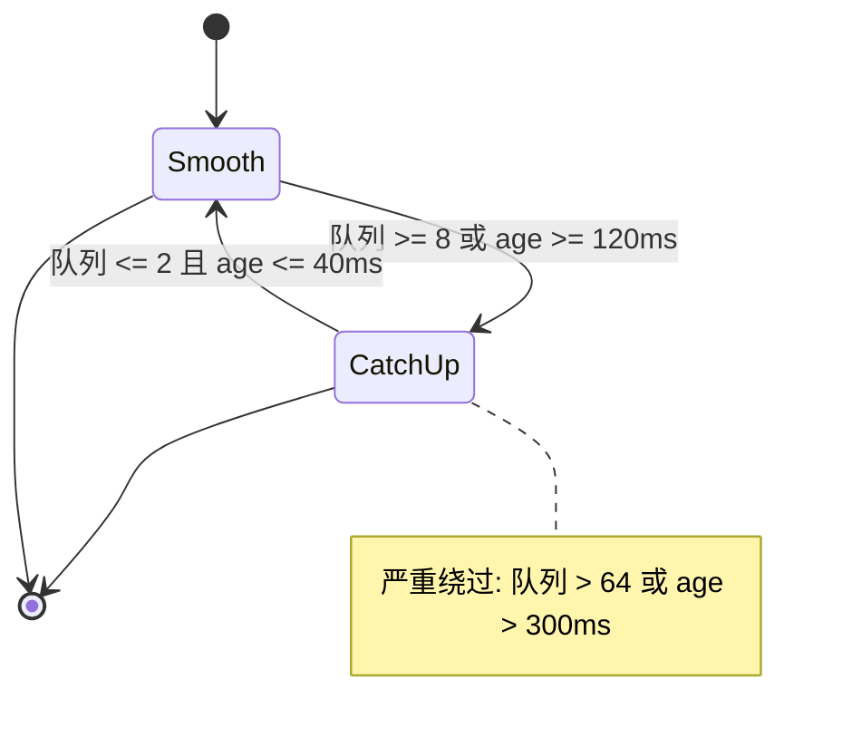

# 性能与代码质量：大文件处理、流式传输、优缺点分析与潜在改进点

主向导对应章节：`性能与代码质量`

## 流式渲染管线 Mermaid 图

### 五阶段管线



### 自适应分块策略状态机



## TUI 事件循环架构

### Reactor 模式（`app.rs:3799-3852`）

`App::run()` 使用 `tokio::select!` 同时监听 4 个并发事件流：

```rust
tokio::select! {
    Some(app_event) = app_events_rx.recv() => { /* App 内部事件 */ },
    Some(thread_event) = active_thread_rx.recv(), if active_thread_rx_guard => { /* 活跃线程事件 */ },
    Some(tui_event) = tui_events.next(), if tui_events_guard => { /* TUI 输入 + 绘制事件 */ },
    Some(server_event) = server_events_rx.recv() => { /* 服务器事件 */ },
}
```

| 事件源 | Channel 容量 | 用途 |
| --- | --- | --- |
| App 事件 | 内部 | 应用级控制（模型切换、设置变更等）|
| 线程事件 | 32,768 | 活跃线程的 agent 输出 |
| TUI 事件 | — | 键盘/鼠标/resize + 定时绘制 |
| 服务器事件 | — | app-server 状态变更 |

### 帧率控制

- **目标帧率**：120 FPS（最小 8.33ms 间隔）
- **实现**：`FrameRateLimiter`（`frame_rate_limiter.rs:23`）通过 deadline clamping
- **Guard 条件**：防止在 handler 不可用时冗余轮询

### 事件流管理

`EventBroker` 模式支持 pause/resume：
- 在外部编辑器启动时暂停 stdin 事件
- 编辑器退出后恢复
- 防止 stdin 竞争

## 流式渲染管线（LLM 输出到终端）

### 五阶段管线


### 阶段 1：MarkdownStreamCollector

累积原始 `OutputTextDelta` 事件。

### 阶段 2：StreamState（`streaming/mod.rs:30-102`）

```rust
pub struct StreamState {
    queue: VecDeque<StreamLine>,
    pending: Option<StreamLine>,    // 未完成的行
    newest_queued: Option<Instant>,
    oldest_queued: Option<Instant>,
}
```

**关键设计：换行门控渲染**

- 只有换行符触发行完成和队列入列
- 未完成的行留在 `pending` 缓冲区
- **好处**：防止部分行渲染导致的视觉闪烁
- Markdown 渲染发生在换行时，而非连续进行

O(1) 操作：`step()`、`drain_n()`、`drain_all()`

### 阶段 3：StreamController（`streaming/controller.rs:35`）

- Header 管理
- Commit tick 驱动渲染刷新

### 阶段 4：AdaptiveChunkingPolicy（`streaming/chunking.rs:180`）

**双档位系统 + 滞后**：

| 模式 | 行为 | 触发条件 |
| --- | --- | --- |
| **Smooth** | 每 8.33ms 输出 1 行 | 队列 <= 2 且 age <= 40ms（保持 250ms）|
| **CatchUp** | 每帧输出全部排队行 | 队列 >= 8 或 age >= 120ms |

**阈值详情**：
- 进入 CatchUp：队列 >= 8 **或** 最老行 age >= 120ms
- 退回 Smooth：队列 <= 2 **且** age <= 40ms（需保持 250ms）
- 严重绕过：队列 > 64 或 age > 300ms（跳过保持期）

**滞后好处**：防止在阈值附近模式震荡。

### 阶段 5：ChatWidget 渲染

最终渲染到 `HistoryCell` -> `ChatWidget` -> Terminal。

## 性能优化汇总

| 优化项 | 位置 | 影响 |
| --- | --- | --- |
| 换行门控渲染 | `controller.rs:35` | 防止子行级闪烁 |
| 时间戳追踪 | `mod.rs:24-26` | 启用 age-based 自适应决策 |
| 自适应分块 | `chunking.rs:180` | 双档位避免显示延迟 |
| 滞后门 | `chunking.rs:159` | 消除模式震荡 |
| VecDeque FIFO | `mod.rs:56-79` | O(1) drain 操作 |
| 帧率上限 | `frame_rate_limiter.rs` | 120 FPS 防止 CPU 浪费 |
| 事件暂停/恢复 | `event_stream.rs:89` | 防止 stdin 与编辑器竞争 |
| 线程缓冲 | `app.rs:166` | 32KB per-thread LRU |
| WebSocket 优先 | `client.rs:1294` | 低延迟双向流 |
| HTTPS 回退 | `client.rs:1003` | 鲁棒性保证 |
| Dynamic tools 延迟加载 | `codex.rs:577+` | 减少 prompt 膨胀 |
| SQLite WAL + 增量 vacuum | `state/runtime.rs:70` | 降低写入竞争 |
| 双数据库分离 | `state/runtime.rs:70-76` | 日志/状态锁解耦 |
| 日志批量写入 | `log_db.rs:48-80` | batch=128, flush=2s |
| app-server 按需监听 | `codex_message_processor.rs` | 非全量轮询 |
| Prompt cache | 对话 ID 作 key | 跨轮复用 OpenAI prompt caching |
| Zstd 压缩 | ChatGPT 认证路径 | 减少传输体积 |
| Cursor-based 分页 | state DB 查询 | 避免全表扫描 |

## 传输层性能

### WebSocket（优先）

- **双向流式**：低延迟实时通信
- **连接复用**：turn 内缓存，跨重试共享
- **增量请求**：`previous_response_id` 支持增量
- **Sticky routing**：`x-codex-turn-state` 保证服务端路由一致性

### HTTPS（回退）

- **SSE 流式**：单向流，但兼容性更好
- **认证恢复**：401 自动刷新 token
- **Zstd 压缩**：减少 payload 大小

### 回退策略

WebSocket 重试耗尽后自动回退到 HTTPS，会话级一次性切换。`AtomicBool` 保证多线程环境下只触发一次。

## SQLite 调优详情

```sql
PRAGMA journal_mode = WAL;         -- 写前日志，读写并发
PRAGMA synchronous = NORMAL;       -- 安全/速度平衡
PRAGMA busy_timeout = 5000;        -- 5 秒锁等待
PRAGMA auto_vacuum = INCREMENTAL;  -- 增量空间回收
-- max_connections: 5 per database
```

### 查询模式

- **Cursor-based 分页**（非 offset）：避免大表全扫描
- **锚点 (timestamp, uuid)**：大数据集稳定排序
- **后台回填**：异步 spawn，不阻塞应用启动
- **优雅降级**：DB 可选，不可用时应用继续运行

### 日志数据库优化

- **分库**：日志和状态分离，减少锁竞争
- **批量写入**：batch size 128，flush 间隔 2 秒
- **日志分区**：每 10 MiB 一个分区

## 代码质量评估

### 优点

| 维度 | 评价 |
| --- | --- |
| 架构边界 | 清晰：CLI/TUI/app-server/core/state 分层自然 |
| 工具执行链 | 抽象完整：审批、沙箱、重试没有散落在各 handler 中 |
| 长会话支持 | 成熟：线程 resume/fork 模型统一 |
| 错误处理 | 不是简单 `anyhow` 透传，做了可重试分类和用户可读映射 |
| 流式渲染 | 精巧：换行门控 + 自适应分块 + 滞后防震荡 |
| 持久化 | 务实：双 DB + WAL + 批量写入 |
| 类型安全 | AbsolutePathBuf 防路径注入，ts-rs 跨语言类型同步 |
| 测试覆盖 | chatwidget/tests/ 15+ 测试文件，streaming/ 单元测试 |

### 风险与改进点

| 优先级 | 问题 | 建议 |
| --- | --- | --- |
| **高** | `chatwidget.rs` 11,070 行、`app.rs` 10,837 行 — 过大 | 按职责拆分为多个模块 |
| **高** | app-server 与 core 间事件类型和状态机较多 | 新人上手成本高，需更好文档 |
| **高** | 32KB per-thread channel 容量硬编码 | 改为可配置，加显式背压处理 |
| **中** | 工具/审批/权限 feature flag 组合复杂 | 测试矩阵快速膨胀，需组合测试策略 |
| **中** | 无性能基准测试套件 | 增加流式吞吐量、渲染延迟、内存负载测试 |
| **中** | WebSocket 到 HTTPS 回退无反向恢复 | 考虑在 WebSocket 恢复后切回 |
| **低** | "内建工具"和"MCP 工具"扩展路径不完全一致 | 统一扩展文档 |
| **低** | 帧率遥测缺失 | 增加帧率/延迟监控指标 |
| **低** | 流式策略参数不可配置 | 暴露为用户配置项 |

### 超大文件详情

| 文件 | 行数 | 复杂度评估 |
| --- | --- | --- |
| `chatwidget.rs` | 11,070 | 极高 — 单体 widget，渲染/事件/状态混合 |
| `app.rs` | 10,837 | 极高 — 主循环、bootstrap、所有子系统协调 |
| `history_cell.rs` | 4,682 | 高 — 历史记录 cell 渲染 |
| `codex.rs` | 7,000+ | 高 — Agent 核心循环 |
| `client.rs` | 1,300+ | 中等 — 传输层 |
| `streaming/*` | 模块化 | 良好 — 职责清晰拆分 |

### 异步模式质量

- **Multi-threaded Tokio runtime**：16MB stack per worker
- **`Arc<Mutex<T>>`** 共享状态：async-safe
- **`color_eyre::Result<T>`** 丰富错误上下文
- **优雅降级模式**：`Option<T>` 保护可选组件

## 综合判断

这是一个**工程化程度很高的本地代理系统**。其优势不在单个算法点，而在把模型流、工具系统、审批、安全和 UI 事件流收敛成了一个一致的运行时。真正的复杂度集中在 `core` 和 `tui/app-server` 交界处。

**如果后续要继续扩展，最值得优先治理的三件事**：

1. **超大文件拆分**：`chatwidget.rs` 和 `app.rs` 都超过 10K 行，维护成本递增
2. **权限组合测试覆盖**：审批策略 x 沙箱模式 x 网络策略的组合爆炸需要系统化测试
3. **性能基准建立**：无基准则无优化方向，需要流式吞吐量和渲染延迟的持续监控

**生产就绪度**：高。Codex 在流式传输、沙箱安全、状态持久化方面都有精心的工程设计，适合作为本地代理系统的参考架构。
