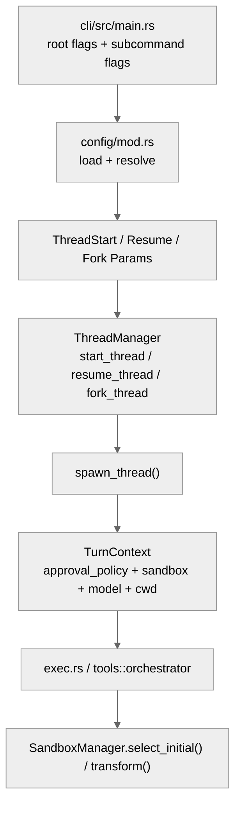

# 配置、恢复与安全边界：`config.toml`、`resume/fork`、approval 与 sandbox 的收束点

这篇补充稿横向对照 Claude Code 的配置/恢复主题、Gemini CLI 的配置与 session 恢复主题，以及 OpenCode 的启动配置与 worktree/sandbox 主题。这里不再沿用旧文件编号，直接使用当前仓库里的文档名。

**目录**

- [1. 这条链的收束点不在 CLI，而在统一线程参数](#1-这条链的收束点不在-cli而在统一线程参数)
- [2. 配置优先级是“根级 + 子命令级 override”双层叠加](#2-配置优先级是根级-子命令级-override双层叠加)
- [3. `resume` / `fork` 都是协议级能力，不只是 TUI 小功能](#3-resume-fork-都是协议级能力不只是-tui-小功能)
- [4. 安全边界同时存在于协议层、执行层和错误层](#4-安全边界同时存在于协议层执行层和错误层)
- [5. 这套设计和另外三套系统的差异](#5-这套设计和另外三套系统的差异)
- [6. 对应阅读](#6-对应阅读)

---

## 1. 这条链的收束点不在 CLI，而在统一线程参数

| 模块 | 关键代码 | 作用 |
| --- | --- | --- |
| CLI 参数拼装 | `codex/codex-rs/cli/src/main.rs` | 把 `resume` / `fork` / 根级 flags 合并成最终 `TuiCli` |
| 配置解析 | `codex/codex-rs/core/src/config/mod.rs` | 合并 `config.toml`、环境变量、CLI override，并解析 sandbox / memories / project-doc 预算 |
| 协议层 | `codex/codex-rs/app-server-protocol/src/protocol/v2.rs` | 定义 `ThreadStartParams`、`ThreadResumeParams`、`ThreadForkParams` |
| 生命周期枢纽 | `codex/codex-rs/core/src/thread_manager.rs` | `start/resume/fork` 最终都汇合到 `spawn_thread()` |
| 执行边界 | `codex/codex-rs/core/src/exec.rs`, `tools/orchestrator.rs`, `tools/sandboxing.rs` | 把 approval policy 与 sandbox policy 变成真实执行约束 |

## 2. 配置优先级是“根级 + 子命令级 override”双层叠加

`cli/src/main.rs` 里最值得注意的不是参数枚举，而是 `finalize_resume_interactive()`、`finalize_fork_interactive()` 和 `merge_interactive_cli_flags()`。它们让 `codex resume ...`、`codex fork ...` 拥有和默认交互模式相同的参数形状，但又允许 resume/fork 专属标志拥有更高优先级。

落到 `config/mod.rs` 后，Codex 再统一处理：

- `config.toml`
- CLI `-c key=value`
- feature toggles
- 环境变量
- `developer_instructions` / `compact_prompt`
- `project_doc_max_bytes` / fallback filenames
- `memories.*`

因此在 Codex 里，“恢复会话”不是把旧状态原样捞回来，而是“拿旧线程历史，再套用一轮新的配置解析”。

## 3. `resume` / `fork` 都是协议级能力，不只是 TUI 小功能

`app-server-protocol/v2.rs` 对三类入口做了很明确的建模：

- `ThreadStartParams`
- `ThreadResumeParams`
- `ThreadForkParams`

其中 resume 有三种来源：

1. `thread_id`
2. `history`
3. `path`

fork 则允许基于：

1. 现有 `thread_id`
2. rollout `path`

再配上 `persist_extended_history` 之类的实验位，说明 Codex 在设计上就是把“恢复和分叉”当作一等线程操作，而不是某个界面层快捷入口。

## 4. 安全边界同时存在于协议层、执行层和错误层

Codex 的安全模型不是单一的 `sandbox=true/false`。

### 4.1 协议层保存的是 `SandboxPolicy`

`config/mod.rs` 最终解析出的可能是：

- `ReadOnly`
- `WorkspaceWrite`
- `DangerFullAccess`
- `ExternalSandbox`

而且 `WorkspaceWrite` 还会把 `memories` 根目录一并纳入可写根，避免 memory pipeline 自己被 sandbox 卡死。

### 4.2 执行层才决定平台沙箱实现

真正执行命令时，`exec.rs` 和 `tools/orchestrator.rs` 会调用 `SandboxManager::select_initial()` 与 `transform()`，把抽象策略转换成：

- macOS `sandbox-exec`
- Linux seccomp / landlock
- Windows restricted token
- 或无沙箱执行

### 4.3 错误层再决定能否升级

`error.rs` 把 `SandboxErr::Denied`、`RetryLimit`、`Interrupted` 等都纳入统一错误枚举；工具编排层再根据 `approval_policy` 判断是否允许从“沙箱失败”升级到“请求无沙箱执行审批”。

所以 Codex 的审批与沙箱关系是：

1. 先按线程策略运行
2. 如果被拒绝，看工具是否允许 escalation
3. 再看当前 approval policy 是否允许向用户要权限

## 5. 这套设计和另外三套系统的差异

- **比 Gemini CLI 更协议先行**：Gemini 的 trust / hooks / sandbox 更偏宿主与配置中心；Codex 直接把 start/resume/fork 暴露成线程协议。
- **比 Claude Code 更少显式 trust UX**：Claude 与 Gemini 都把“当前目录是否可信”做成很强的用户感知流程；Codex 更强调 `approval_policy + sandbox_policy` 的组合。
- **比 OpenCode 更强调多宿主共享语义**：OpenCode 的默认主线是 session durable writeback；Codex 则把恢复、分叉、审批、沙箱都提前定义在统一线程参数上。

## 6. 对应阅读

- Claude Code: [19-settings-config.md](../hello-claude-code/19-settings-config.md), [10-session-resume.md](../hello-claude-code/10-session-resume.md)
- Gemini CLI: [19-settings-config.md](../hello-gemini-cli/19-settings-config.md), [10-session-resume.md](../hello-gemini-cli/10-session-resume.md)
- OpenCode: [19-settings-config.md](../hello-opencode/19-settings-config.md), [34-worktree-sandbox.md](../hello-opencode/34-worktree-sandbox.md), [10-session-resume.md](../hello-opencode/10-session-resume.md)

---

## 关键函数清单

| 函数/类型 | 文件 | 职责 |
|----------|------|------|
| `ThreadManager::start_thread()` | `codex-rs/core/src/thread_manager.rs:406` | 创建新会话线程，装配所有运行时参数 |
| `ThreadManager::resume_thread_from_rollout()` | `codex-rs/core/src/thread_manager.rs:455` | 从 rollout 记录恢复会话，重放历史事件 |
| `ThreadManager::fork_thread()` | `codex-rs/core/src/thread_manager.rs:598` | Fork 现有会话到新线程（带独立快照）|
| `Config::load()` / `Config::merge()` | `codex-rs/core/src/config/` | 双层配置叠加：根级全局配置 + 子命令级 override |
| `Subcommand::Resume` | `codex-rs/cli/src/main.rs` | `--resume` / `--fork` CLI 参数解析与分发 |
| `apply_rollout_item()` | `codex-rs/core/src/extract.rs:15` | 历史事件重放：将 rollout item 应用到当前状态 |

---

## 代码质量评估

**优点**

- **Resume/Fork 是协议级一等公民**：`ThreadManagerParams` 的 start/resume/fork 三种模式统一参数，不是"加 flag 的 hack"，语义清晰。
- **Rollout 重放机制**：历史记录以可重放的 rollout item 序列存储，不仅可以恢复，还可以派生 fork，实现分支会话。
- **双层配置叠加**：根级配置提供默认值，子命令级 override 精确覆盖，不存在"环境变量 vs 配置文件"的优先级歧义。

**风险与改进点**

- **Rollout 记录无压缩**：长会话的 rollout 记录会无限增长，大型代码库任务结束后 SQLite 文件可能数十 MB，无自动归档/压缩机制。
- **Fork 独立快照内存占用双倍**：Fork 创建独立快照，内存中同时持有父线程和子线程的完整状态，内存压力随 Fork 数量线性增长。
- **Resume 不恢复 pending approval**：从 rollout 恢复后，会话前一次中断时的 pending 工具调用和审批状态归零，需要模型重新推理，可能产生重复操作。
