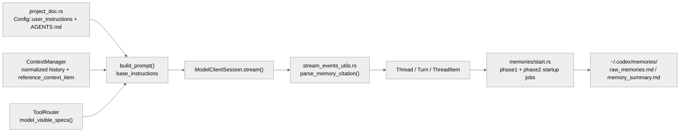

# 上下文、Prompt 与轻量 Memory：`AGENTS.md`、`ContextManager` 与 memories pipeline 的拼装边界

这篇补充稿对应 Claude Code 的上下文/提示词/记忆主题，也对应 Gemini CLI 与 OpenCode 的同类专题。这里直接引用当前仓库里的实际文件名，避免继续沿用旧编号。Codex 主线文档已经把 `run_turn()`、`build_prompt()` 和线程协议讲清楚，但如果要和另外三套文档横向对照，仍然需要单独把“模型到底看到了什么”拎出来看。

## 1. 这条链真正由哪三层组成

| 层 | 关键代码 | 作用 |
| --- | --- | --- |
| 项目级指令层 | `codex/codex-rs/core/src/project_doc.rs` | 读取 `Config::user_instructions`、层级 `AGENTS.md`、可选 JS REPL / child-agents 附加说明 |
| 会话上下文层 | `codex/codex-rs/core/src/context_manager/history.rs` | 维护模型可见历史、做规范化、估算 token、处理 compaction 与 rollback 基线 |
| 轻量记忆层 | `codex/codex-rs/core/src/memories/*` | 从 rollout 抽取 raw memories、做两阶段 consolidation，并把 memory citation 写回线程结果 |

## 2. Prompt 不是大模板，而是三种输入的收束结果

`core/src/codex.rs` 里的 `build_prompt()` 很克制。它只把四类东西拼到一起：

1. `ContextManager::for_prompt()` 产出的历史 `input`
2. `ToolRouter::model_visible_specs()` 产出的工具声明
3. `BaseInstructions`
4. 人格、并行工具调用能力、结构化输出 schema

这里最关键的不是 `Prompt` 结构体本身，而是 `project_doc.rs::get_user_instructions()` 怎么构造 `base_instructions`。这条路径会：

- 先取 `config.user_instructions`
- 再按“项目根 -> 当前目录”的顺序拼接所有 `AGENTS.md`
- 受 `project_doc_max_bytes` 限制，超出预算时截断
- 按 feature flag 追加 JS REPL / child-agents 的运行时附加说明

这意味着 Codex 的项目级约束并不是某个单点 prompt 文件，而是配置层和目录层共同生成的一段 developer context。

## 3. `ContextManager` 才是模型可见历史的真正边界

`ContextManager` 的工作并不只是“存历史”，它同时承担了三件和另外三套系统可对照的事：

1. **历史规范化**：`for_prompt()` 会丢掉不适合发给模型的项，并在无图像输入模态时剥离图片内容。
2. **上下文基线维护**：`reference_context_item` 记录下一轮 settings diff 的参考快照；发生 compaction、rollback 或历史替换时，这个基线会一起被重置。
3. **窗口压力治理**：`estimate_token_count_with_base_instructions()` 用近似 token 估算配合 compaction 任务判断是否需要压缩。

和 Claude Code / OpenCode 的差异在于，Codex 把“上下文治理”更多做成协议归一化和回放基线问题，而不是把大段 prompt 片段动态拼来拼去。

## 4. Codex 的 memory 是异步 pipeline，不是常驻 prompt runtime

Codex 也有 memory，但它的工程形态和 Claude Code、Gemini CLI、OpenCode 都不完全一样。

### 4.1 启动时跑两阶段 memories pipeline

`codex.rs` 会在启动后触发 `memories::start_memories_startup_task()`。后续由：

- `memories/phase1.rs` 选择 rollout、提取 stage-1 raw memories
- `memories/phase2.rs` 选择可用 raw memories、做 consolidation
- `memories/storage.rs` 同步 `raw_memories.md` 与 rollout summary 文件
- `memories/prompts.rs` 构建 memory tool 的 developer instructions 与 consolidation prompt

### 4.2 它更像“从 rollout 里反刍长期知识”

这套 pipeline 的中心不是当前 turn，而是已经落盘的 rollout。也因此：

- memory 更偏离线整理，而不是每轮都做复杂注入
- memory summary 文件位于 `~/.codex/memories`
- 模型输出中的隐藏 citation 会被 `stream_events_utils.rs` 解析成 `memory_citation`

### 4.3 记忆会被上下文污染规则主动降级

`mcp_tool_call.rs` 与 `stream_events_utils.rs` 都会在满足条件时把 thread 标记为 `memory_mode_polluted`。配置里的 `no_memories_if_mcp_or_web_search` 也说明：一旦上下文掺入外部 MCP 或 web search 结果，memory 可能被主动降级，避免把高噪声输入错误固化。

## 5. 横向对照下，Codex 这条主题的特点

- **比 Claude Code 更协议化**：Claude 会把 prompt、memory、context collapse 明确分成多个运行时专题；Codex 更强调“线程历史 + 指令拼接 + 异步 memory pipeline”。
- **比 Gemini CLI 更少依赖层级文件常驻注入**：Gemini CLI 会持续读取 `GEMINI.md` 分层记忆；Codex 更依赖 `AGENTS.md` + rollout 反刍。
- **比 OpenCode 更少显式 prompt compiler**：OpenCode 有很强的 `prompt -> loop -> processor -> durable writeback` 主线；Codex 在这一主题上把复杂度藏进 `ContextManager`、`project_doc` 和 memories startup 里。

## 6. 对应阅读

- Claude Code: [11-context-management.md](../hello-claude-code/11-context-management.md), [12-prompt-system.md](../hello-claude-code/12-prompt-system.md), [16-memory-system.md](../hello-claude-code/16-memory-system.md)
- Gemini CLI: [11-context-management.md](../hello-gemini-cli/11-context-management.md), [12-prompt-system.md](../hello-gemini-cli/12-prompt-system.md), [16-memory-system.md](../hello-gemini-cli/16-memory-system.md)
- OpenCode: [11-context-management.md](../hello-opencode/11-context-management.md), [12-prompt-system.md](../hello-opencode/12-prompt-system.md), [16-memory-system.md](../hello-opencode/16-memory-system.md)
