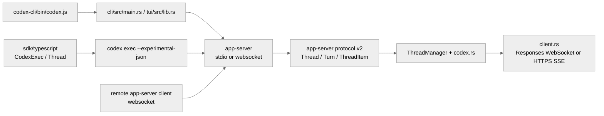

# 宿主表面与传输层：`app-server`、remote websocket、TypeScript SDK 与多宿主复用

这篇补充稿对齐 Claude Code 的 QueryEngine/transport/bridge 主题，也对应 Gemini CLI 的 session+SDK 主题，以及 OpenCode 的入口传输、路由边界和模型请求主题。这里直接引用当前仓库里的实际文件名。

**目录**

- [1. Codex 的外部表面其实只有一套语义](#1-codex-的外部表面其实只有一套语义)
- [2. 不要把两类 WebSocket 混为一谈](#2-不要把两类-websocket-混为一谈)
- [3. app-server protocol 才是多宿主复用的稳定面](#3-app-server-protocol-才是多宿主复用的稳定面)
- [4. Remote app-server 更像“把本地 runtime 移出去”](#4-remote-app-server-更像把本地-runtime-移出去)
- [5. 横向对照下，Codex 这条主题的特点](#5-横向对照下codex-这条主题的特点)
- [6. 对应阅读](#6-对应阅读)
- [附录：分发层详解（原 07-packaging-sdk-and-shell-layer）](#附录分发层详解原-07-packaging-sdk-and-shell-layer)

---

## 1. Codex 的外部表面其实只有一套语义

| 表面 | 关键代码 | 作用 |
| --- | --- | --- |
| npm 启动器 | `codex/codex-cli/bin/codex.js` | 选择平台包、定位二进制、转发信号 |
| CLI / TUI 宿主 | `codex/codex-rs/cli/src/main.rs`, `tui/src/lib.rs` | 本地交互入口 |
| app-server | `codex/codex-rs/app-server/src/lib.rs` | 以 stdio 或 WebSocket 暴露 JSON-RPC 协议 |
| app-server client | `codex/codex-rs/app-server-client/src/lib.rs`, `remote.rs` | in-process 或 remote websocket 客户端 |
| TypeScript SDK | `codex/sdk/typescript/src/codex.ts`, `exec.ts`, `thread.ts` | 通过 `codex exec --experimental-json` 消费线程事件 |
| 模型传输 | `codex/codex-rs/core/src/client.rs` | 单轮内部在 Responses WebSocket 与 HTTPS SSE 之间切换 |

## 2. 不要把两类 WebSocket 混为一谈

Codex 里至少有两层“传输”：

### 2.1 宿主层传输

`app-server` 这层决定 CLI / TUI / 外部程序怎么接入 Codex runtime：

- 本地 `stdio`
- remote `ws://` / `wss://`
- in-process app-server client

`app-server-client/src/remote.rs` 还单独处理了 remote initialize、request/event 队列、鉴权 token 与连接超时。这层是“宿主和 runtime”之间的通道。

### 2.2 模型层传输

`core/src/client.rs` 的 WebSocket / HTTPS 则是“runtime 和模型服务”之间的通道：

- 优先尝试 Responses WebSocket
- 失败时回退到 HTTPS SSE
- turn 内复用 sticky routing 信息
- 会话级只做一次 WebSocket -> HTTPS 回退

这两层都叫 transport，但职责完全不同。

## 3. app-server protocol 才是多宿主复用的稳定面

Codex 之所以能同时服务 TUI、`exec`、SDK 和 remote client，关键不在于每层都写了一遍逻辑，而在于 `app-server-protocol/src/protocol/v2.rs` 已经把核心对象固定下来：

- `Thread`
- `Turn`
- `ThreadItem`
- `ThreadStart/Resume/Fork`
- streaming event / request / response

这也是为什么 TypeScript SDK 其实只需要做三件事：

1. 把参数翻译成 `codex exec --experimental-json`
2. 逐行读取 stdout 事件
3. 把事件重新包装成 `Thread.run()` / `runStreamed()` 更好用的接口

SDK 不是第二实现，而是事件协议的消费者。

## 4. Remote app-server 更像“把本地 runtime 移出去”

`tui/src/lib.rs` 和 `app-server-client/src/remote.rs` 都说明，remote 模式不是“换一个简化 API”，而是把完整 app-server 语义挪到远端：

- remote auth token 只允许 `wss://` 或 loopback `ws://`
- 连接后先做 initialize
- 事件、请求、通知分多条 channel 转发
- 队列满时会明确丢弃或报错

这和 Claude Code 的 bridge 思路最接近，但 Codex 仍然保持在“线程协议 + app-server transport”这一层，不把移动端或 Web 会话同步抽成更大的 bridge runtime。

## 5. 横向对照下，Codex 这条主题的特点

- **比 Gemini SDK 更统一**：Gemini CLI 的 SDK、A2A、IDE companion 仍有多套入口；Codex 更像统一线程协议下的多宿主适配。
- **比 OpenCode 更显式区分协议层和模型层传输**：OpenCode 主线更强调 Session/Processor；Codex 明确区分 app-server transport 与模型 Responses transport。
- **比 Claude Code 更收敛**：Claude 的 bridge / transport / QueryEngine 分层更丰富；Codex 目前更聚焦在 CLI、app-server 和 SDK 三类宿主。

## 6. 对应阅读

- Claude Code: [17-sdk-transport.md](../hello-claude-code/17-sdk-transport.md), [23-bridge-system.md](../hello-claude-code/23-bridge-system.md)
- Gemini CLI: [10-session-resume.md](../hello-gemini-cli/10-session-resume.md), [17-sdk-transport.md](../hello-gemini-cli/17-sdk-transport.md)
- OpenCode: [17-sdk-transport.md](../hello-opencode/17-sdk-transport.md), [26-server-routing.md](../hello-opencode/26-server-routing.md), [29-llm-request.md](../hello-opencode/29-llm-request.md)

---

## 附录：分发层详解（原 07-packaging-sdk-and-shell-layer）

主向导对应章节：`分发、SDK 与 shell 层`

npm 层最核心的文件是 `codex-cli/bin/codex.js`。它用 `PLATFORM_PACKAGE_BY_TARGET` 把 target triple 映射到平台包名，再根据 `process.platform` / `process.arch` 选出当前二进制，必要时从已安装的平台包或本地 `vendor` 目录定位 `codex` 可执行文件（`codex/codex-cli/bin/codex.js:15-21`; `codex/codex-cli/bin/codex.js:27-118`）。后续 `spawn(binaryPath, process.argv.slice(2), { stdio: "inherit", env })` 和 `forwardSignal()` 只是把 Node 包装层变成一个忠实的过程代理（`codex/codex-cli/bin/codex.js:168-220`）。换句话说，这一层做的是分发与进程桥接，不做业务决策。

TypeScript SDK 也是类似思路。`sdk/typescript/src/codex.ts` 的 `Codex` 类只在构造时创建 `CodexExec`，然后让 `startThread()` / `resumeThread()` 返回 `Thread` 包装对象（`codex/sdk/typescript/src/codex.ts:11-37`）。真正的调用细节在 `sdk/typescript/src/exec.ts` 的 `CodexExec.run()`：它把 JS 侧参数翻译成 `exec --experimental-json` 命令行，写 stdin，逐行读取 stdout，并在子进程非零退出时抛出错误（`codex/sdk/typescript/src/exec.ts:72-226`）。

`sdk/typescript/src/thread.ts` 再在此基础上把“线程”暴露成更顺手的对象接口。`Thread.runStreamedInternal()` 先整理输入，再把 thread id、working directory、sandbox、approval policy、web search 等选项传给 `CodexExec.run()`；当收到 `thread.started` 事件时，它会把 `_id` 更新成真正的线程 id（`codex/sdk/typescript/src/thread.ts:70-112`）。`Thread.run()` 则继续把事件流折叠成 `items`、`finalResponse` 和 `usage` 三元组（`codex/sdk/typescript/src/thread.ts:115-138`）。所以 SDK 其实是在消费 app/CLI 已经存在的线程事件协议。

`shell-tool-mcp` 展示的是另一种包装方式。`src/index.ts` 的 `main()` 先解析平台，再调用 `resolveBashPath()` 输出当前应使用的 Bash 路径（`codex/shell-tool-mcp/src/index.ts:9-25`）。`src/bashSelection.ts` 里的 `selectLinuxBash()`、`selectDarwinBash()`、`resolveBashPath()` 则把 OS 识别、版本偏好和 fallback 路径明确编码出来（`codex/shell-tool-mcp/src/bashSelection.ts:10-115`）。它和主 CLI 一样，也是把运行时能力打包成可分发、可在外部系统消费的接口，而不是再造一套执行引擎。

把这三层连起来看，Codex 的外部表面有一个很统一的哲学：核心逻辑留在 Rust；Node/TypeScript 只做宿主对接、参数编译和事件解码。这样做的好处是所有宿主都共享同一条线程协议与行为语义，不会因为包装层不同而分叉实现。

---

## 关键函数清单

| 函数/类型 | 文件 | 职责 |
|----------|------|------|
| `HttpTransport::new()` | `codex-rs/core/src/transport.rs` | 创建 HTTPS 传输层：配置 base_url、API key、超时 |
| `HttpTransport::stream()` | `codex-rs/core/src/transport.rs` | 发起 SSE 流式请求，返回 `Stream<Event>` |
| `BackoffRetry` | `codex-rs/core/src/retry.rs` | 指数退避重试包装器：处理 429/503 响应 |
| `StreamDecoder` | `codex-rs/core/src/transport.rs` | SSE 字节流解码为结构化 `Event` 类型 |
| `ApiKeyProvider` | `codex-rs/core/src/auth.rs` | API key 解析优先级：env → config file → keychain |
| `ProviderConfig` | `codex-rs/core/src/config.rs` | 提供商配置：base_url、model_name、max_tokens 映射 |

---

## 代码质量评估

**优点**

- **Rust async 流式处理**：基于 `tokio` + `reqwest` 的异步 SSE 处理，无阻塞、高吞吐，适合长时间流式响应。
- **指数退避内置**：`BackoffRetry` 直接处理 rate limit 和服务器错误，调用方无需关心重试逻辑。
- **API key 多源解析**：env → config → keychain 优先级链，开发环境和生产环境均可无缝配置。

**风险与改进点**

- **SSE 重连无 `Last-Event-ID`**：断线后重连时不携带 `Last-Event-ID`，从流开头重新消费，可能丢失断线期间的 token。
- **`reqwest` 无连接池复用配置**：未暴露连接池参数，高频会话切换时 TLS 握手开销累积。
- **仅支持 HTTPS/SSE**：不支持 WebSocket，某些本地 provider（如 Ollama）可能仅支持 WebSocket 流，需要额外适配。
