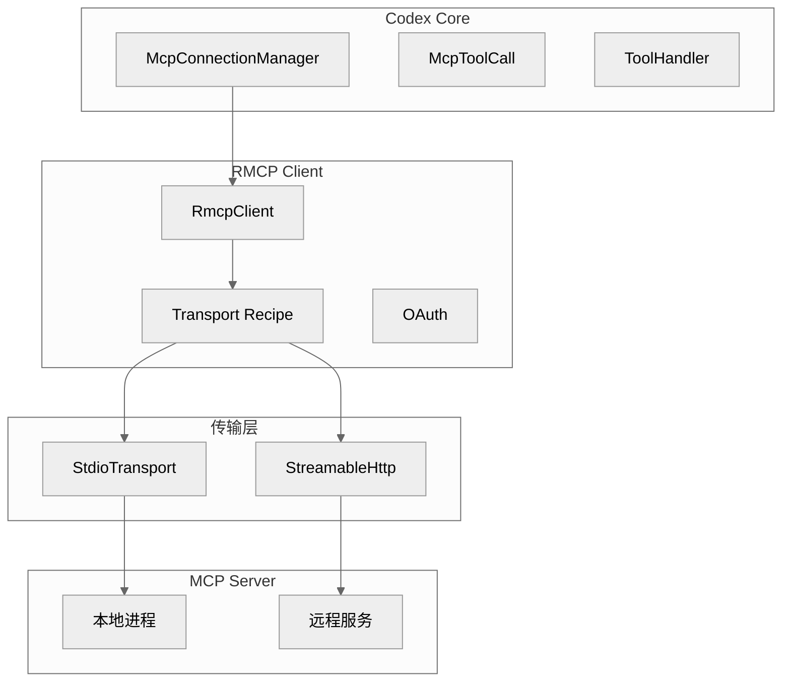
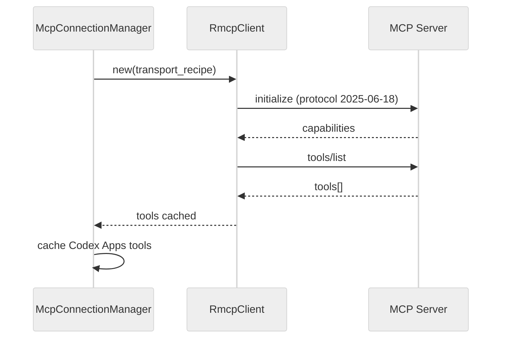
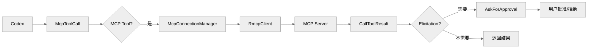
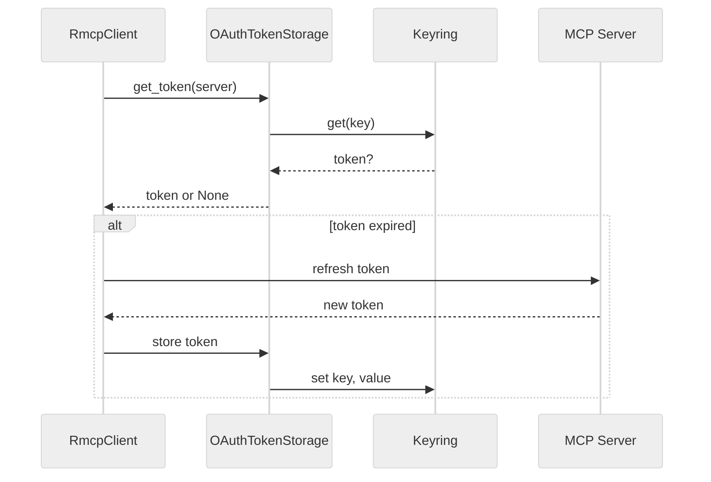
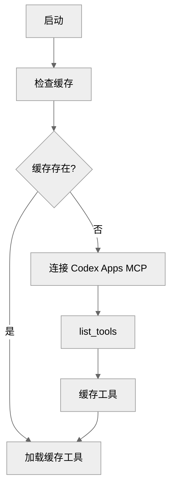

# Codex 的 MCP/RMCP 系统

本篇讨论 Codex 的 MCP 客户端实现、RMCP 远程协议、工具调用审批流程和 OAuth 认证。


**目录**

- [1. MCP 系统概述](#1-mcp-系统概述)
- [2. 核心组件](#2-核心组件)
- [3. RMCP 客户端架构](#3-rmcp-客户端架构)
- [4. 连接管理](#4-连接管理)
- [5. 工具管理](#5-工具管理)
- [6. 工具调用与审批](#6-工具调用与审批)
- [7. OAuth 认证](#7-oauth-认证)
- [8. MCP 协议类型](#8-mcp-协议类型)
- [9. 沙箱状态能力](#9-沙箱状态能力)
- [10. 超时配置](#10-超时配置)
- [11. Codex Apps 集成](#11-codex-apps-集成)
- [12. 与 Claude Code 的差异](#12-与-claude-code-的差异)
- [13. 关键源码锚点](#13-关键源码锚点)
- [14. 总结](#14-总结)

---

## 1. MCP 系统概述



## 2. 核心组件

| 组件 | 路径 | 职责 |
|------|------|------|
| McpConnectionManager | `codex-rs/core/src/mcp_connection_manager.rs` | MCP 连接生命周期管理 |
| RmcpClient | `codex-rs/rmcp-client/src/rmcp_client.rs` | 远程 MCP 客户端实现 |
| McpToolCall | `codex-rs/core/src/mcp_tool_call.rs` | 工具调用处理器 |
| ToolHandler | `codex-rs/core/src/tools/handlers/mcp.rs` | MCP 工具入口 |
| OAuth | `codex-rs/rmcp-client/src/oauth.rs` | OAuth token 管理 |
| Protocol Types | `codex-rs/protocol/src/mcp.rs` | MCP 协议类型 |

## 3. RMCP 客户端架构

### 3.1 客户端结构

```rust
// codex-rs/rmcp-client/src/rmcp_client.rs:470-475

pub struct RmcpClient {
    state: Mutex<ClientState>,
    transport_recipe: TransportRecipe,
    initialize_context: Mutex<Option<InitializeContext>>,
    session_recovery_lock: Mutex<()>,
}

enum ClientState {
    Uninitialized,
    Initializing,
    Ready,
    Error(String),
}
```

### 3.2 传输类型

```rust
// codex-rs/rmcp-client/src/rmcp_client.rs:389-405

enum TransportRecipe {
    Stdio {
        program: String,
        args: Vec<String>,
        env: HashMap<String, String>,
        env_vars: Vec<String>,
        cwd: Option<PathBuf>,
    },
    StreamableHttp {
        server_name: String,
        url: Url,
        bearer_token: Option<String>,
        http_headers: HashMap<String, String>,
        store_mode: bool,
    },
}
```

## 4. 连接管理

### 4.1 McpConnectionManager

```rust
// codex-rs/core/src/mcp_connection_manager.rs:579-583

pub(crate) struct McpConnectionManager {
    clients: HashMap<String, AsyncManagedClient>,
    server_origins: HashMap<String, String>,
    elicitation_requests: ElicitationRequestManager,
}

struct AsyncManagedClient {
    client: RmcpClient,
    state: ConnectionState,
    tools: Vec<ToolInfo>,
}
```

### 4.2 连接流程



## 5. 工具管理

### 5.1 ToolInfo 结构

```rust
// codex-rs/core/src/mcp_connection_manager.rs:183-193

pub(crate) struct ToolInfo {
    pub(crate) server_name: String,
    pub(crate) tool_name: String,
    pub(crate) tool_namespace: String,
    pub(crate) tool: Tool,
    pub(crate) connector_id: Option<String>,
    pub(crate) description: Option<String>,
    input_schema: serde_json::Value,
}
```

### 5.2 工具名称限定

MCP 工具名用 `__` 分隔符限定：

```rust
const MCP_TOOL_NAME_DELIMITER: &str = "__";

// 工具名: <server>__<tool>
// 例如: "filesystem__read_file"
```

### 5.3 工具发现

```rust
pub async fn list_tools_with_connector_ids(
    &self,
) -> Result<Vec<ToolInfo>> {
    let response = self.client
        .send_request::<(), ListToolsRequest>("tools/list", None)
        .await?;

    let tools = response.tools.into_iter().map(|t| {
        ToolInfo {
            server_name: self.server_name.clone(),
            tool_name: t.name.clone(),
            tool_namespace: format!("{}{}{}",
                self.server_name,
                MCP_TOOL_NAME_DELIMITER,
                t.name),
            tool: Tool { name: t.name, description: t.description },
            connector_id: None,
            // ...
        }
    }).collect();

    Ok(tools)
}
```

## 6. 工具调用与审批

### 6.1 调用流程



### 6.2 McpToolCall

```rust
// codex-rs/core/src/mcp_tool_call.rs

pub async fn call_mcp_tool(
    call: &ToolCall,
    context: &dyn ToolCallContext,
) -> Result<CallToolResult> {
    let (server_name, tool_name) = split_tool_name(&call.name)?;

    let client = connection_manager.get_client(&server_name)?;
    let result = client.call_tool(&tool_name, &call.arguments).await?;

    Ok(CallToolResult {
        content: vec![Content::Text(result)],
        is_error: false,
    })
}
```

### 6.3 审批策略

```rust
// codex-rs/core/src/mcp_tool_call.rs

enum AskForApproval {
    Never,
    OnFailure,
    OnRequest,
    UnlessTrusted,
}

// Elicitation 请求处理
struct ElicitationRequestManager {
    pending: HashMap<String, ElicitationRequest>,
}
```

## 7. OAuth 认证

### 7.1 Token 持久化

```rust
// codex-rs/rmcp-client/src/oauth.rs

pub struct OAuthTokenStorage {
    store: dyn SecretStore,
    keychain_prefix: String,
}

impl OAuthTokenStorage {
    pub async fn get(&self, server_name: &str) -> Result<Option<OAuthToken>> {
        let key = format!("{}:{}", self.keychain_prefix, server_name);
        self.store.get(&key).await
    }

    pub async fn set(&self, server_name: &str, token: &OAuthToken) -> Result<()> {
        let key = format!("{}:{}", self.keychain_prefix, server_name);
        self.store.set(&key, token).await
    }
}
```

### 7.2 OAuth 流程



## 8. MCP 协议类型

### 8.1 核心类型

```rust
// codex-rs/protocol/src/mcp.rs

pub struct CallToolResult {
    pub content: Vec<Content>,
    pub is_error: Option<bool>,
}

pub struct ListToolsResult {
    pub tools: Vec<Tool>,
}

pub struct Tool {
    pub name: String,
    pub description: Option<String>,
    pub input_schema: serde_json::Value,
}

pub struct Content {
    type: String,  // "text", "image", "resource"
    // ...
}
```

### 8.2 协议版本

```rust
const MCP_PROTOCOL_VERSION: &str = "2025-06-18";
```

## 9. 沙箱状态能力

### 9.1 能力声明

```rust
const MCP_SANDBOX_STATE_CAPABILITY: &str = "codex/sandbox-state";
const MCP_SANDBOX_STATE_METHOD: &str = "codex/sandbox-state/update";
```

### 9.2 沙箱更新通知

```rust
// MCP 服务器可发送此通知更新沙箱状态
struct SandboxStateUpdate {
    sandbox_id: String,
    state: SandboxState,
}
```

## 10. 超时配置

```rust
// codex-rs/core/src/mcp_connection_manager.rs

const DEFAULT_STARTUP_TIMEOUT: Duration = Duration::from_secs(30);
const DEFAULT_TOOL_TIMEOUT: Duration = Duration::from_secs(120);
```

## 11. Codex Apps 集成

### 11.1 工具缓存

Codex Apps MCP 服务器的工具会被缓存：

```rust
const CODEX_APPS_MCP_SERVER_NAME: &str = "codex_apps";
const TOOLS_CACHE_DIR: &str = "cache/codex_apps_tools/";
```

### 11.2 连接流程



## 12. 与 Claude Code 的差异

| 特性 | Claude Code | Codex |
|------|-------------|-------|
| 客户端实现 | TypeScript `@modelcontextprotocol/sdk` | Rust `rmcp-client` |
| 传输类型 | Stdio, SSE, HTTP, WebSocket, in-process | Stdio, StreamableHttp |
| 认证 | XAA, OAuth, Bearer Token | OAuth + Keyring |
| 工具名限定 | 无 | `__` 分隔符 |
| 审批 | `AskForApproval` 枚举 | 同上 |
| 沙箱集成 | 沙箱状态通知 | 沙箱能力声明 |
| 协议版本 | JSON-RPC 2.0 | `2025-06-18` |

## 13. 关键源码锚点

| 主题 | 代码锚点 | 说明 |
|------|----------|------|
| 连接管理 | `codex-rs/core/src/mcp_connection_manager.rs` | 生命周期管理 |
| RMCP 客户端 | `codex-rs/rmcp-client/src/rmcp_client.rs` | 核心客户端 |
| 工具调用 | `codex-rs/core/src/mcp_tool_call.rs` | 调用与审批 |
| 工具处理器 | `codex-rs/core/src/tools/handlers/mcp.rs` | 入口点 |
| OAuth | `codex-rs/rmcp-client/src/oauth.rs` | Token 管理 |
| 协议类型 | `codex-rs/protocol/src/mcp.rs` | 类型定义 |
| MCP Server | `codex-rs/mcp-server/` | MCP 服务器实现 |

## 14. 总结

Codex 的 MCP 系统特点：

1. **Rust-native 实现**：性能与内存安全
2. **RMCP 远程协议**：支持 stdio 和 StreamableHTTP 两种传输
3. **OAuth 集成**：Keyring 安全存储 token
4. **工具名称限定**：避免命名冲突
5. **审批策略**：灵活的批准触发条件
6. **沙箱集成**：通过能力声明支持沙箱状态同步

---

*文档版本: 1.0*
*分析日期: 2026-04-06*

---

## 关键函数清单

| 函数/类型 | 文件 | 职责 |
|----------|------|------|
| `McpServerManager` | `codex-rs/mcp-client/src/manager.rs` | 管理所有 MCP server 的生命周期：启动、健康检查、关闭 |
| `McpClient::list_tools()` | `codex-rs/mcp-client/src/lib.rs` | 查询 MCP server 可用工具列表 |
| `McpClient::call_tool()` | `codex-rs/mcp-client/src/lib.rs` | 发送 `tools/call` 请求并返回结构化结果 |
| `McpClient::list_resources()` | `codex-rs/mcp-client/src/lib.rs` | 获取 MCP server 暴露的资源列表 |
| `StdioTransport` | `codex-rs/mcp-client/src/transport.rs` | stdio 传输层：fork 子进程并通过 stdin/stdout 通信 |
| `SseTransport` | `codex-rs/mcp-client/src/transport.rs` | SSE 传输层：连接远程 MCP server 的 HTTP SSE 端点 |

---

## 代码质量评估

**优点**

- **双传输模式统一接口**：stdio 和 SSE 两种传输实现同一 `Transport` trait，上层 `McpClient` 无需感知传输细节。
- **Rust 实现的内存安全保证**：异步 MCP 通信无数据竞争，tokio runtime 保证并发工具调用的正确性。
- **工具列表懒加载并缓存**：首次需要工具时才查询 MCP server，避免启动时的串行 handshake 延迟。

**风险与改进点**

- **MCP server 健康检查间隔过长**：server 崩溃后 codex 可能在下一个健康检查周期前仍尝试调用，导致工具调用失败。
- **stdio 传输无消息边界处理**：依赖 newline 分隔 JSON-RPC 消息，server 输出截断时解析器行为未定义。
- **多 MCP server 并发调用无隔离**：不同 server 的工具调用共享同一 tokio runtime，一个 server 阻塞可能影响其他 server 的响应。
