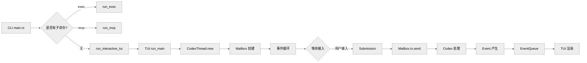
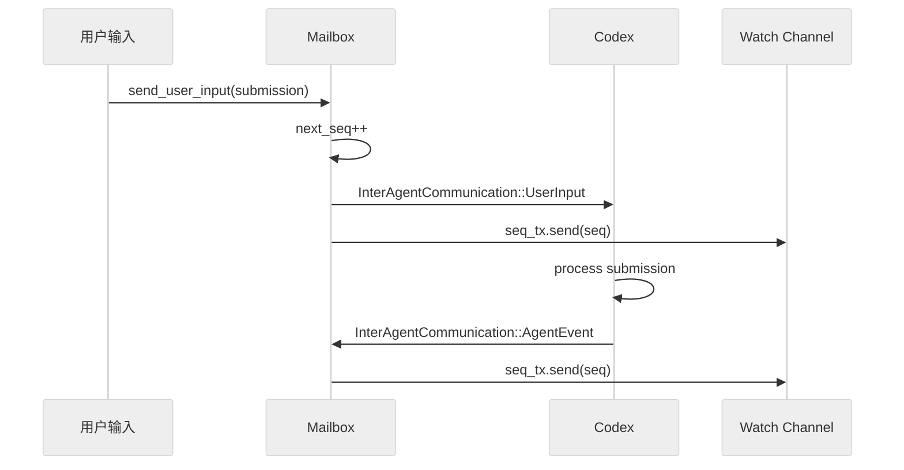
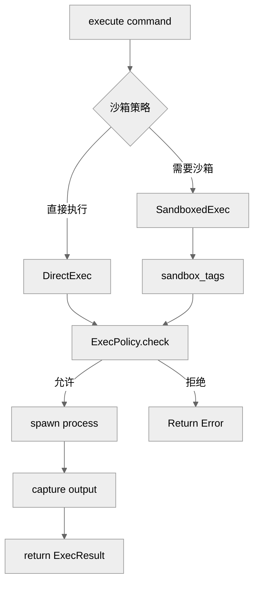

# 用户输入、命令解析与 Mailbox 队列系统

本篇梳理 Codex 中用户提交输入后，系统如何完成命令解析、邮箱队列管理和跨 Agent 通信的完整流程。

## 1. 核心架构概述

Codex 的输入处理涉及以下核心模块：

| 模块 | 路径 | 职责 |
|------|------|------|
| CLI 入口 | `codex-rs/cli/src/main.rs` | 命令行解析，启动 TUI 或 headless |
| TUI | `codex-rs/tui/src/lib.rs` | 交互式界面，事件循环 |
| CodexThread | `codex-rs/core/src/codex_thread.rs` | 主 agent 线程封装 |
| Mailbox | `codex-rs/core/src/agent/mailbox.rs` | Agent 间通信队列 |
| Protocol | `codex-rs/protocol/src/protocol.rs` | Submission/Event 队列协议 |
| 命令规范化 | `codex-rs/core/src/command_canonicalization.rs` | 命令标准化（用于审批缓存） |
| Exec | `codex-rs/core/src/exec.rs` | 命令执行与沙箱 |

## 2. 整体流程图



## 3. CLI 入口与子命令

### 3.1 主入口

```rust
// codex-rs/cli/src/main.rs

fn main() {
    let matches = Command::new("codex")
        .subcommand(Exec::def())
        .subcommand(Mcp::def())
        .subcommand(Resume::def())
        .get_matches();

    match matches.subcommand() {
        Some(("exec", args)) => run_exec(args),
        Some(("mcp", args)) => run_mcp(args),
        Some(("resume", args)) => run_resume(args),
        None => run_interactive_tui(),
    }
}
```

### 3.2 可用子命令

| 子命令 | 路径 | 功能 |
|--------|------|------|
| `exec` | `codex-rs/cli/src/exec.rs` | Headless 命令执行 |
| `mcp` | `codex-rs/cli/src/mcp.rs` | MCP 服务器模式 |
| `mcp-server` | `codex-rs/mcp-server/` | MCP 协议服务器 |
| `resume` | `codex-rs/cli/src/resume.rs` | 恢复历史会话 |
| (无) | TUI | 交互式模式 |

## 4. TUI 事件循环

### 4.1 主循环

```rust
// codex-rs/tui/src/lib.rs:587

pub fn run_main() -> Result<()> {
    let config = load_config()?;
    let mut codex_thread = CodexThread::new(&config)?;

    loop {
        match event::recv()? {
            Event::Input(input) => {
                codex_thread.mailbox().send_user_input(input)?;
            }
            Event::AgentEvent(event) => {
                render(event);
            }
            Event::Key(key) => {
                handle_key(key);
            }
        }
    }
}
```

### 4.2 CodexThread

```rust
// codex-rs/core/src/codex_thread.rs

pub struct CodexThread {
    client: Codex,
    mailbox: Mailbox,
    state: State,
}

impl CodexThread {
    pub fn new(config: &Config) -> Result<Self> {
        let client = Codex::new(config);
        let mailbox = Mailbox::new();
        Ok(Self { client, mailbox, state: State::Idle })
    }

    pub fn mailbox(&self) -> &Mailbox {
        &self.mailbox
    }
}
```

## 5. Mailbox：Agent 间通信队列

### 5.1 核心结构

```rust
// codex-rs/core/src/agent/mailbox.rs:11-49

pub(crate) struct Mailbox {
    tx: mpsc::UnboundedSender<InterAgentCommunication>,
    next_seq: AtomicU64,
    seq_tx: watch::Sender<u64>,
}

pub(crate) enum InterAgentCommunication {
    UserInput(Submission),
    AgentEvent(Event),
    ToolResult(ToolResult),
    Elicitation(ElicitationRequest),
}

pub(crate) struct Submission {
    pub id: String,
    pub op: Op,           // 用户操作
    pub trace: Option<W3cTraceContext>,
}
```

### 5.2 序列号机制



## 6. Submission / Event Queue 模式

### 6.1 SQ/EQ 模式

```rust
// codex-rs/protocol/src/protocol.rs

pub struct Protocol {
    submission_queue: Vec<Submission>,
    event_queue: Vec<AgentEvent>,
}

// Submission Queue: 用户输入 → Codex
// Event Queue: Codex → TUI/用户
```

### 6.2 Op 类型

```rust
// codex-rs/protocol/src/protocol.rs

pub enum Op {
    UserMessage { content: String },
    ToolCall { tool: String, args: serde_json::Value },
    ToolResult { tool: String, result: serde_json::Value },
    Approve { request_id: String },
    Deny { request_id: String },
}
```

## 7. 命令规范化 (Command Canonicalization)

### 7.1 目的

命令规范化用于**审批缓存**：相同逻辑的命令即使文本略有不同，也能匹配到之前的审批决策。

```rust
// codex-rs/core/src/command_canonicalization.rs

pub fn canonicalize_command(cmd: &str) -> String {
    // 1. 识别 shell 类型 (bash/powershell)
    // 2. 规范化脚本内容
    // 3. 添加协议前缀
    match detect_shell(cmd) {
        Shell::Bash => format!("__codex_shell_script__{}", normalize_bash(cmd)),
        Shell::PowerShell => format!("__codex_powershell_script__{}", normalize_ps(cmd)),
    }
}
```

### 7.2 规范化策略

| 原始 | 规范化后 |
|------|----------|
| `bash -c "echo hi"` | `__codex_shell_script__echo hi` |
| `powershell -Command "dir"` | `__codex_powershell_script__dir` |
| `/usr/bin/python3 script.py` | `__codex_shell_script__python3 script.py` |

## 8. 命令解析 (ParsedCommand)

### 8.1 解析类型

```rust
// codex-rs/protocol/src/parse_command.rs

pub enum ParsedCommand {
    Read { cmd: String, name: String, path: String },
    ListFiles { cmd: String, path: String },
    Search { cmd: String, query: String, path: Option<String> },
    Unknown { cmd: String },
}

pub fn parse_command(input: &str) -> ParsedCommand {
    // 模式匹配识别命令类型
}
```

## 9. Exec 模块

### 9.1 命令执行流程



### 9.2 沙箱集成

```rust
// codex-rs/core/src/exec.rs

pub async fn execute(
    cmd: &str,
    cwd: &Path,
    context: &ExecContext,
) -> Result<ExecOutput> {
    let canonical = canonicalize_command(cmd);

    // 检查执行策略
    let policy = ExecPolicy::from_context(context)?;
    if !policy.allows(&canonical) {
        return Err(ExecError::DeniedByPolicy);
    }

    // 确定是否需要沙箱
    let sandboxed = should_sandbox(&cmd, context);

    if sandboxed {
        sandboxed_execute(cmd, cwd, context).await
    } else {
        direct_execute(cmd, cwd, context).await
    }
}
```

## 10. 与 Claude Code 的差异

| 特性 | Claude Code | Codex |
|------|-------------|-------|
| 入口架构 | TypeScript REPL | Rust CLI + TUI |
| 队列实现 | `messageQueueManager.ts` + React hooks | `Mailbox.rs` (mpsc channels) |
| 并发控制 | `QueryGuard` 状态机 | Watch channel 序列号 |
| 命令解析 | `processSlashCommand.tsx` | `parse_command.rs` |
| 命令规范化 | 无 (直接字符串匹配) | `command_canonicalization.rs` |
| 执行策略 | `execPolicy.rs` | 同上 |

## 11. 关键源码锚点

| 主题 | 代码锚点 | 说明 |
|------|----------|------|
| CLI 入口 | `codex-rs/cli/src/main.rs` | 子命令解析 |
| TUI 主循环 | `codex-rs/tui/src/lib.rs:587` | `run_main()` |
| CodexThread | `codex-rs/core/src/codex_thread.rs` | Agent 线程封装 |
| Mailbox | `codex-rs/core/src/agent/mailbox.rs` | 通信队列 |
| Protocol | `codex-rs/protocol/src/protocol.rs` | SQ/EQ 模式 |
| 命令规范化 | `codex-rs/core/src/command_canonicalization.rs` | 审批缓存支持 |
| Exec | `codex-rs/core/src/exec.rs` | 命令执行 |

## 12. 总结

Codex 的输入层特点：

1. **Rust-first 架构**：核心逻辑在 Rust，追求性能与安全
2. **Mailbox 模式**：基于 mpsc 的 Actor-style 通信
3. **Sequence Channel**：Watch channel 追踪处理序列号
4. **命令规范化**：为审批缓存提供稳定匹配
5. **沙箱优先**：命令执行默认考虑沙箱隔离

---

*文档版本: 1.0*
*分析日期: 2026-04-06*
