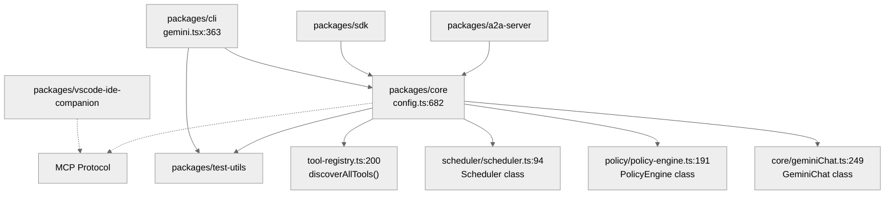

# 架构全景：Gemini CLI 的分层模型与核心抽象

Gemini CLI 不是一个简单的命令行包装器，而是一个以 `packages/core` 为中心的 **Agent Engine**，通过多宿主（CLI, SDK, IDE）进行能力投射。

## 1. Monorepo 包拓扑

项目采用 TypeScript Monorepo 结构，各子包职责明确：

| 包名 | 职责 | 核心依赖 |
| --- | --- | --- |
| `packages/core` | **系统内核**：负责模型调用、工具调度、策略引擎与 Prompt 构建 | `@google/genai`, `@modelcontextprotocol/sdk` |
| `packages/cli` | **终端宿主**：提供 TUI 交互（React/Ink）、参数解析与沙箱管理 | `@google/gemini-cli-core`, `ink` |
| `packages/sdk` | **集成接口**：为外部应用提供程序化调用 Gemini CLI 的能力 | `@google/gemini-cli-core` |
| `packages/a2a-server` | **服务网关**：将 Agent 能力封装为 HTTP/SSE 接口 | `@google/gemini-cli-core`, `express` |
| `packages/vscode-ide-companion` | **IDE 桥梁**：连接 VS Code 与 CLI，提供 Diff 和工作区上下文 | `@modelcontextprotocol/sdk` |

### 依赖关系图（含源码行号）

## 2. 分层模型

Gemini CLI 遵循清晰的纵向分层，确保了核心逻辑与展示逻辑的解耦：

| 层级 | 实现文件 | 核心函数/类 | 行号 |
|---|---|---|---|
| **宿主协议层 (Host Protocol)** | `cli/src/gemini.tsx`, `a2a-server`, `vscode-ide-companion` | `main()`, `startInteractiveUI()` | :363, :100+ |
| **运行时组装层 (Runtime Assembly)** | `core/src/config/config.ts` | `Config._initialize()` | :682+ |
| **调度编排层 (Orchestration)** | `core/src/scheduler/scheduler.ts` | `Scheduler.schedule()` | :94, :191 |
| **原子功能层 (Atomic Functions)** | `core/src/tools/`, `core/src/policy/` | `ToolRegistry`, `PolicyEngine`, `PromptRegistry` | :200, :191, :100+ |
| **模型交互层 (LLM Interaction)** | `core/src/core/geminiChat.ts` | `GeminiChat.sendMessageStream()` | :249, :303 |

## 3. 核心抽象与接口边界

### 3.1 `Config`：系统组合根
`Config` 类（`gemini-cli/packages/core/src/config/config.ts:682`）是整个运行时的上帝对象，它持有并初始化所有核心组件：
- `ToolRegistry` (工具发现与注册)
- `PolicyEngine` (权限策略)
- `GeminiClient` (模型通信)
- `McpClientManager` (MCP 扩展管理)

### 3.2 `Scheduler`：执行内核
`Scheduler`（`gemini-cli/packages/core/src/scheduler/scheduler.ts:94`）实现了工具调用的闭环。它不关心工具的具体逻辑，只负责：
- 接收 `ToolCallRequest`
- 调用 `PolicyEngine` 进行审批
- 驱动 `ToolExecutor` 执行
- 将结果回传给模型

### 3.3 `PolicyEngine`：安全边界
`PolicyEngine`（`gemini-cli/packages/core/src/policy/policy-engine.ts:191`）定义了系统能做什么。它通过一系列规则（Rules）和检查器（Checkers）对 Shell 命令、文件读写等操作进行风险评估，返回 `allow`, `deny` 或 `ask_user`。

## 4. 接口边界设计

- **UI 与 Core 的边界**：通过 `MessageBus`（`gemini-cli/packages/core/src/confirmation-bus/message-bus.ts`）进行异步通信，UI 只负责订阅状态变更并投影到界面，不直接控制执行细节。
- **工具与模型的边界**：模型只看到 `FunctionDeclaration`，真实执行被封装在 `BaseToolInvocation` 及其子类中，实现了"逻辑"与"声明"的彻底分离。

## 5. 代码质量评估 (Code Quality Assessment)

### 5.1 架构优点
- **高可组合性**：`Config` 作为 Composition Root，通过依赖注入将 `ToolRegistry`、`PolicyEngine`、`GeminiClient` 等解耦，各层可独立测试。
- **事件驱动解耦**：MessageBus 模式使 UI 层与核心逻辑完全异步化，React/Ink 只做状态投影。
- **工具声明/执行分离**：`FunctionDeclaration`（声明）vs `BaseToolInvocation`（执行）的抽象，使模型看到干净接口。

### 5.2 技术债务与改进点
- **`Config` 类过于臃肿**：3560 行的巨型类承担了初始化、工具注册、MCP 配置、沙箱策略等多重职责，建议拆分为 `CoreBuilder` 或 `RuntimeAssembler`。
- **Scheduler 状态管理复杂**：`SchedulerStateManager` + `MessageBus` 双通道状态管理增加了并发调试难度。
- **缺少统一的错误分类体系**：`ToolErrorType` 与通用 `Error` 混用，导致某些边界错误被隐式吞掉。

### 5.3 核心模块行号速查

| 模块 | 关键函数/类 | 行号区间 |
|---|---|---|
| `config.ts` | `Config` 类 | :682+ |
| `turn.ts` | `Turn.run()` 事件循环 | :238+ |
| `geminiChat.ts` | `sendMessageStream()` | :303+ |
| `scheduler.ts` | `Scheduler.schedule()` | :191+ |
| `policy-engine.ts` | `PolicyEngine.check()` | :492+ |

---

> 关联阅读：[03-agent-loop.md](./03-agent-loop.md) 了解这些抽象如何协作完成一次会话。
