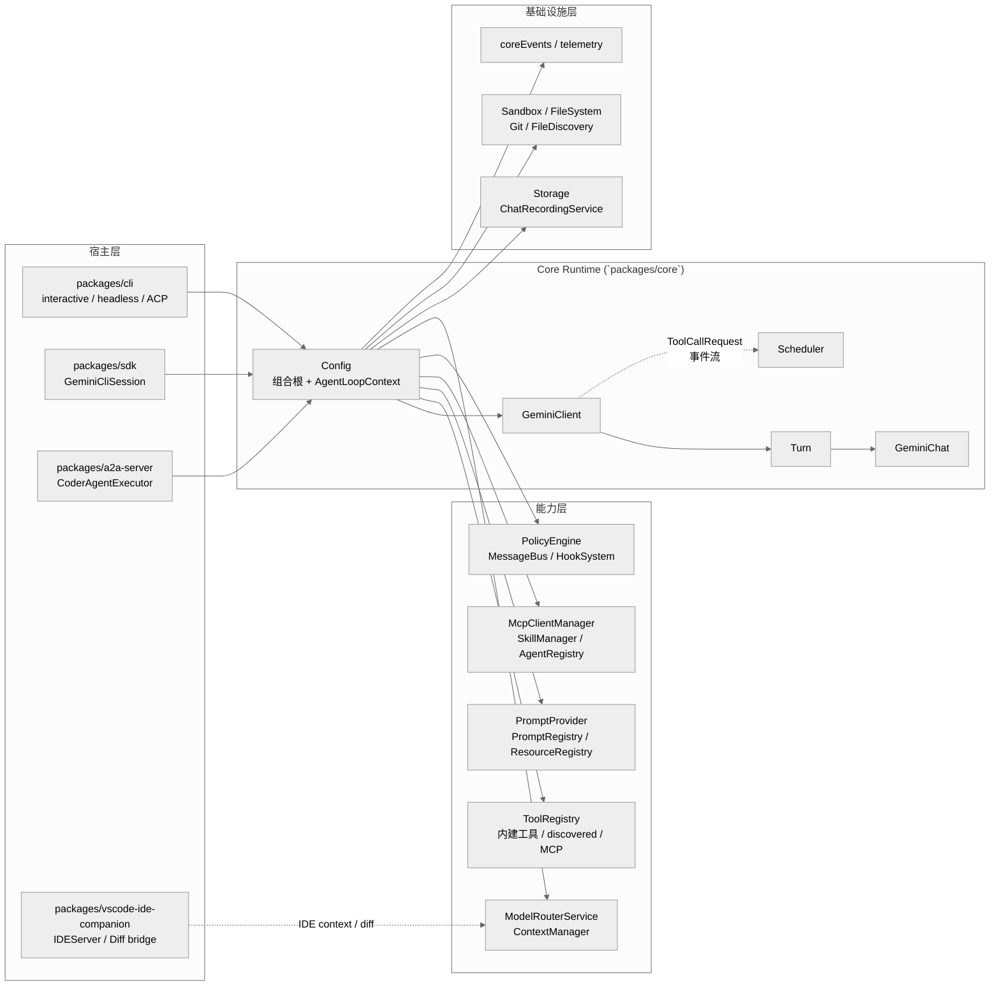

# 架构全景：多宿主外壳、Core 组合根与 Agent 执行闭环

> 基于 `gemini-cli` `v0.36.0` 源码校对。本文重点核对 `packages/cli`、`packages/core`、`packages/sdk`、`packages/a2a-server` 与 `packages/vscode-ide-companion` 的真实调用关系，而不是沿用其它文档里的抽象名称。

**目录**

- [1. 一句话结论](#1-一句话结论)
- [2. 仓库拓扑与角色分工](#2-仓库拓扑与角色分工)
- [3. 分层模型](#3-分层模型)
- [4. 核心抽象](#4-核心抽象)
- [5. 架构上的优点与真实代价](#5-架构上的优点与真实代价)

---

## 1. 一句话结论

Gemini CLI 不是“一个 TUI 外壳 + 一个模型 SDK”，也不是 Codex/OpenCode 那种“CLI 连接独立 app-server”的架构。它更接近一种以 `packages/core` 为运行时内核、由多个宿主在进程内直接装配的 agent runtime：

1. `packages/core` 提供真正的执行内核，核心对象是 `Config`、`GeminiClient`、`Turn`、`Scheduler`。
2. `packages/cli`、`packages/sdk`、`packages/a2a-server` 都会各自在本进程里创建 `Config`，复用同一套工具、策略、Prompt、会话与持久化机制。
3. 一次请求的主闭环是：宿主收集输入 -> `GeminiClient.sendMessageStream()` -> `processTurn()` -> `Turn.run()` -> `GeminiChat.sendMessageStream()` -> 模型产出工具调用 -> UI 层调度 `Scheduler` 执行工具 -> 结果回注模型 -> 宿主/UI 持续渲染。

---

## 2. 仓库拓扑与角色分工

### 2.1 Monorepo 的真实包分层

| 包 | 路径 | 角色 |
| --- | --- | --- |
| `@google/gemini-cli` | `packages/cli` | 主 CLI 宿主，包含交互式 TUI、非交互 headless、ACP client |
| `@google/gemini-cli-core` | `packages/core` | 运行时内核：配置装配、模型循环、工具系统、策略、安全、持久化、MCP、技能、Agent |
| `@google/gemini-cli-sdk` | `packages/sdk` | 程序化宿主，对外暴露 session / tool / skill API，但底层仍直接复用 `core` |
| `@google/gemini-cli-a2a-server` | `packages/a2a-server` | 服务化宿主，把 `core` 封装成 A2A AgentExecutor / HTTP 服务 |
| `gemini-cli-vscode-ide-companion` | `packages/vscode-ide-companion` | IDE 侧桥接层，提供编辑器上下文与 diff 能力，不负责主 agent loop |
| `@google/gemini-cli-devtools` | `packages/devtools` | 调试与活动日志前端 |
| `@google/gemini-cli-test-utils` | `packages/test-utils` | 测试夹具与测试 MCP server |

### 2.2 这不是 app-server 架构

Gemini CLI 很容易被误读成“CLI 调 `core`，`core` 再起个服务”。源码并不是这样组织的。几个主要宿主都会直接创建 `Config`：

| 宿主 | 入口 | 证据 | 含义 |
| --- | --- | --- | --- |
| CLI | `packages/cli/src/config/config.ts` | `loadCliConfig()` 最终 `return new Config(...)` | 主 CLI 直接在本进程装配 runtime |
| SDK | `packages/sdk/src/session.ts` | `GeminiCliSession` 构造函数里 `this.config = new Config(configParams)` | SDK 不是 RPC client，而是嵌入 `core` |
| A2A Server | `packages/a2a-server/src/config/config.ts` | `loadConfig()` 里先后创建 `initialConfig` 与 `config` | 服务端宿主也只是另一层 `core` 装配 |
| VSCode Companion | `packages/vscode-ide-companion/src/extension.ts` | 启动本地 `IDEServer` | 它给 CLI 提供 IDE 上下文，不承载主对话循环 |

这一点决定了 Gemini CLI 的架构气质：

- 优点是没有额外的宿主协议层，复用 `core` 的成本低。
- 代价是每个宿主都需要自己理解并管理一部分启动、认证、初始化与生命周期逻辑。

---

## 3. 分层模型

### 3.1 总体结构图

### 3.2 六层职责表

| 层 | 关键文件 | 责任 |
| --- | --- | --- |
| 宿主入口层 | `packages/cli/src/gemini.tsx`、`packages/sdk/src/session.ts`、`packages/a2a-server/src/config/config.ts` | 解析输入、决定运行模式、创建 `Config` |
| 宿主控制层 | `packages/cli/src/interactiveCli.tsx`、`packages/cli/src/ui/AppContainer.tsx`、`packages/cli/src/ui/hooks/useGeminiStream.ts`、`packages/cli/src/nonInteractiveCli.ts`、`packages/a2a-server/src/agent/executor.ts` | 把用户输入或协议请求映射成 agent loop，负责 UI/流式输出/任务事件 |
| 运行时装配层 | `packages/core/src/config/config.ts` | 组装工具、策略、MCP、技能、模型、存储、沙箱、路由与上下文 |
| Agent 循环层 | `packages/core/src/core/client.ts`、`packages/core/src/core/turn.ts`、`packages/core/src/core/geminiChat.ts` | Prompt 装配、模型调用、流式事件解释、循环检测、压缩、回注 |
| 能力编排层 | `packages/core/src/scheduler/*`、`packages/core/src/tools/*`、`packages/core/src/prompts/*`、`packages/core/src/agents/*`、`packages/core/src/skills/*`、`packages/core/src/policy/*` | 工具调用、审批、MCP 接入、技能/Agent 装载、系统提示词生成 |
| 基础设施层 | `packages/core/src/config/storage.ts`、`packages/core/src/services/chatRecordingService.ts`、`packages/core/src/services/*`、`packages/core/src/telemetry/*` | 会话持久化、文件发现、Git、沙箱、Telemetry、事件总线 |

---

## 4. 核心抽象

### 4.1 `Config`：组合根，同时也是运行时上下文

`Config` 定义在 `packages/core/src/config/config.ts:682`，它不是普通配置对象，而是整个 runtime 的组合根。更关键的是，它直接实现了 `AgentLoopContext`，所以它既负责装配，又直接作为执行上下文被下游复用。

可以把它分成两个阶段理解：

| 阶段 | 主要内容 |
| --- | --- |
| 构造阶段 | 创建 `Storage`、`SandboxPolicyManager`、`PolicyEngine`、`MessageBus`、`GeminiClient`、`A2AClientManager`、`ModelRouterService` 等长期对象 |
| 初始化阶段 | 创建主 registry，发现工具，接入 MCP，加载技能 / agents / hooks / context，并最终初始化 `GeminiClient` |

这也是为什么 `Config` 会显得“很大”：它承接了几乎所有横切关注点。

### 4.2 `GeminiClient -> Turn -> GeminiChat`：真正的 agent loop 栈

这三个类是 Gemini CLI 里最核心的一条执行栈：

| 抽象 | 文件 | 职责 |
| --- | --- | --- |
| `GeminiClient` | `packages/core/src/core/client.ts:95` | 会话级控制器，负责系统提示词、模型路由、IDE 上下文、压缩、循环检测、hook、工具回注 |
| `Turn` | `packages/core/src/core/turn.ts:238` | 单轮解释器，把模型流转换成 `Content` / `Thought` / `ToolCallRequest` / `Finished` 等事件 |
| `GeminiChat` | `packages/core/src/core/geminiChat.ts:249` | 最贴近模型 API 的聊天适配层，维护 history、tool declarations、重试与录制 |

理解这条栈时要特别区分两个层次：

1. `GeminiChat` 管的是“聊天请求如何发给模型，历史如何维护”。
2. `GeminiClient` 管的是“这一轮是否要压缩、是否要注入 IDE 上下文、该选哪个 model、下一轮是否继续”。

所以 Gemini CLI 的 agent loop 并不在 `GeminiChat` 里，而是在 `GeminiClient.sendMessageStream()` 与 `Turn.run()` 这对组合里。

### 4.3 `Scheduler + MessageBus + PolicyEngine`：工具执行的安全闭环

工具调用不是由 UI 直接执行，而是经过一条独立的安全闭环：

| 抽象 | 文件 | 职责 |
| --- | --- | --- |
| `Scheduler` | `packages/core/src/scheduler/scheduler.ts:94` | 批量调度工具请求，管理状态、队列与执行顺序 |
| `MessageBus` | `packages/core/src/confirmation-bus/message-bus.ts:15` | 带 request-response 语义的事件总线，用于审批、确认与 UI 同步 |
| `PolicyEngine` | `packages/core/src/policy/policy-engine.ts:191` | 根据 approval mode、规则、safety checker 决定 `allow/deny/ask_user` |
| `ToolRegistry` | `packages/core/src/tools/tool-registry.ts` | 提供工具 schema 与执行对象，统一承接内建工具、发现式工具、MCP 工具 |

这里还有一个很关键的设计点：`MessageBus` 会在发布 `TOOL_CONFIRMATION_REQUEST` 时先询问 `PolicyEngine`。也就是说，UI 看到的“确认弹窗”并不是默认存在的，它只在策略结果为 `ASK_USER` 时才成为用户交互。

### 4.4 Prompt / 上下文 / 路由是三套不同系统

这是现有文档里最容易混淆的部分，必须拆开看：

| 系统 | 文件 | 真正职责 |
| --- | --- | --- |
| `PromptProvider` | `packages/core/src/prompts/promptProvider.ts:38` | 生成核心 system prompt；会把 approval mode、skills、agents、plan mode、git 状态等拼进去 |
| `PromptRegistry` | `packages/core/src/prompts/prompt-registry.ts:10` | 只保存 MCP 发现到的 prompts，不负责主 system prompt |
| `ResourceRegistry` | `packages/core/src/resources/resource-registry.ts:22` | 跟踪 MCP 资源 |
| `ContextManager` | `packages/core/src/services/contextManager.ts:21` | 管理 `GEMINI.md` / memory 的全局、扩展、项目和 JIT 子目录上下文 |
| `ModelRouterService` | `packages/core/src/routing/modelRouterService.ts:30` | 在 fallback、override、approval mode、classifier 等策略之间做 model routing |

也就是说，Gemini CLI 的“上下文构建”不是单一模块，而是 `PromptProvider + ContextManager + ModelRouterService + GeminiClient` 共同完成。

### 4.5 Agent / Skill / MCP 都是能力扩展面，但边界不同

#### Agent

`packages/core/src/agents/registry.ts:44` 的 `AgentRegistry` 负责加载：

- 内建 agents
- 用户级 agents
- 项目级 agents
- extension 附带 agents

更有意思的是，`Config.createToolRegistry()` 会把子 Agent 注册成 `SubagentTool`。也就是说，本地 subagent 在主循环里是“以工具形态暴露”的。

当真正执行本地 subagent 时，`packages/core/src/agents/local-executor.ts` 会：

1. 从父 registry 克隆出 agent 专属 `ToolRegistry / PromptRegistry / ResourceRegistry`。
2. 用派生的 `MessageBus` 隔离子 agent 的确认请求。
3. 在 agent 内部再次运行一套迷你版的模型-工具循环。

#### Skill

`packages/core/src/skills/skillManager.ts:17` 负责技能发现与优先级覆盖：

- 内建 skills
- extension skills
- 用户 skills
- workspace skills

其中 workspace skills 受 trusted folder 约束，这说明 skill system 本质上被当成一种“可执行提示词扩展”，而不是纯展示型配置。

#### MCP

`packages/core/src/tools/mcp-client-manager.ts:34` 的 `McpClientManager` 管理多个 MCP client 的生命周期，并把发现到的 tools / prompts / resources 注入主 registry。它是 Gemini CLI 最重要的外部扩展总线。

### 4.6 `Storage + ChatRecordingService`：持久化不只是聊天记录

`Storage` 与 `ChatRecordingService` 共同构成 Gemini CLI 的持久化底层：

| 抽象 | 文件 | 作用 |
| --- | --- | --- |
| `Storage` | `packages/core/src/config/storage.ts:29` | 负责全局 `~/.gemini` 目录、项目 ID、tmp/history/plans/policies/skills/agents 等路径组织 |
| `ChatRecordingService` | `packages/core/src/services/chatRecordingService.ts:128` | 把对话、thoughts、tool calls、token usage 持久化成 JSON session 文件 |

这意味着“恢复会话”并不是 UI 层的临时能力，而是 core 层就已经具备的 durability 机制。

---

## 5. 架构上的优点与真实代价

### 5.1 优点

1. `core` 复用性很强。CLI、SDK、A2A server 都直接复用同一个 runtime，不需要再维护一套 RPC 协议和独立 daemon。
2. 工具执行闭环清楚。`Scheduler -> MessageBus -> PolicyEngine -> ToolRegistry/ToolExecutor` 这条链把“是否允许执行”和“如何执行”拆得比较干净。
3. 扩展面丰富且正交。MCP、skills、agents、hooks、IDE context 都能独立接入 `core`，不会全部挤进同一个插件入口。
4. 会话是可恢复的 durable state。`Storage` 和 `ChatRecordingService` 让 headless、interactive、SDK 都能共享同一套恢复语义。

### 5.2 代价

1. `Config` 过于庞大。它同时承担配置对象、服务容器、运行时上下文、状态持有者四种角色，阅读成本很高。
2. 宿主层与 core 层的边界并不完全干净。例如交互式路径把 `config.initialize()` 放进 `AppContainer`，而非交互路径在 `main()` 内完成；这让“真正何时初始化完毕”不够直观。
3. UI 仍承担一部分语义拼接工作。`useGeminiStream` / `useToolScheduler` 里还保留了 tool batch 拼接、回注时机控制等逻辑，说明 core 输出的语义边界还不够高层。
4. 命名上存在认知陷阱。`PromptRegistry` 并不负责主 system prompt，真正的 system prompt 在 `PromptProvider`；如果不读源码，很容易把两者混为一谈。

### 5.3 最准确的架构总结

如果只用一句话概括 Gemini CLI 的真实架构，我会写成：

> Gemini CLI 是一个“多宿主、进程内装配”的 agent runtime monorepo：`packages/core` 提供组合根、模型循环、工具与策略系统，CLI/SDK/A2A 只是不同入口，IDE companion 则为这套 runtime 提供额外上下文桥接。

---

> 关联阅读：
> - [02-startup-flow.md](./02-startup-flow.md)
> - [03-agent-loop.md](./03-agent-loop.md)
> - [04-tool-system.md](./04-tool-system.md)
> - [13-multi-agent-remote.md](./13-multi-agent-remote.md)
> - [17-sdk-transport.md](./17-sdk-transport.md)
> - [22-repl-and-state.md](./22-repl-and-state.md)

---

## 关键类与函数清单

| 类/函数 | 文件 | 职责 |
|--------|------|------|
| `Config` | `packages/core/src/config/config.ts` | 组合根 + 服务容器：持有 GeminiClient、ToolRegistry、PromptProvider、Scheduler 等所有核心依赖 |
| `Config.initialize()` | `config.ts:1289` | 启动初始化：创建 ToolRegistry、MCP 服务器、Skills、GeminiClient |
| `GeminiClient` | `packages/core/src/core/client.ts` | 模型调用门面：管理 GeminiChat、processTurn、工具声明刷新 |
| `GeminiClient.sendMessageStream()` | `client.ts:868` | 对外流式请求入口，循环调用 `processTurn()` |
| `GeminiClient.processTurn()` | `client.ts:585` | 单轮推理：上下文压缩、token 检查、loop detection、调用 `Turn.run()` |
| `Turn` | `packages/core/src/core/turn.ts` | 将 `GeminiChat` 流拆解为高层事件（Thought/Content/ToolCallRequest/Finished） |
| `GeminiChat` | `packages/core/src/core/geminiChat.ts` | 底层 Gemini API 调用封装，维护多轮历史 |
| `Scheduler` | `packages/core/src/scheduler/scheduler.ts` | 工具调度状态机：安全闸门、并发控制、执行入口 |
| `ToolExecutor` | `packages/core/src/scheduler/tool-executor.ts` | 真正执行工具，转换结果为 `functionResponse` |
| `ToolRegistry` | `packages/core/src/tools/tool-registry.ts` | 注册和查询所有内置/MCP/discovered 工具 |
| `PromptProvider` | `packages/core/src/prompts/promptProvider.ts` | 动态组装 system prompt 文本 |
| `useGeminiStream` | `packages/cli/src/ui/hooks/useGeminiStream.ts` | UI hook：管理流处理、工具调度触发、工具结果回注（`handleCompletedTools()`） |
| `AppContainer` | `packages/cli/src/ui/AppContainer.tsx` | CLI 宿主主组件：持有所有 UI Action 和初始化生命周期 |
