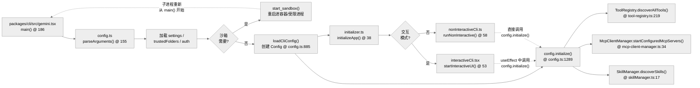
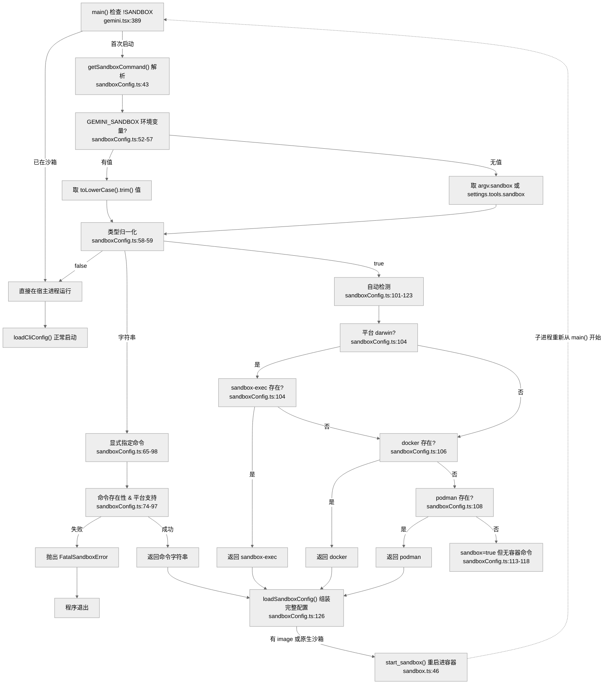

# 启动链路：从入口到运行模式的分发

Gemini CLI 的启动不仅仅是加载 UI，它包含了一个复杂的环境预热与权限校验链。

## 1. 启动全景图



## 2. 核心函数清单 (Function List)

| 函数/方法 | 文件路径 | 行号 | 职责 |
|---|---|---|---|
| `main()` | `packages/cli/src/gemini.tsx` | :186 | 程序入口，参数解析，沙箱决策 |
| `parseArguments()` | `packages/cli/src/config/config.ts` | :155 | Yargs 子命令解析 |
| `loadSandboxConfig()` | `packages/cli/src/config/sandboxConfig.ts` | :126 | 沙箱配置加载（命令检测、镜像路径、allowedPaths） |
| `start_sandbox()` | `packages/cli/src/utils/sandbox.ts` | :46 | 沙箱子进程启动（Docker/LXC/Seatbelt 等） |
| `initializeApp()` | `packages/cli/src/core/initializer.ts` | :38 | Auth 校验、IDE 连接预热、主题验证；返回 `InitializationResult` |
| `Config._initialize()` | `packages/core/src/config/config.ts` | :1299 | 工具注册/MCP 启动/Skill 发现/Hook 系统初始化/GeminiClient 初始化 |
| `startInteractiveUI()` | `packages/cli/src/interactiveCli.tsx` | :53 | React + Ink TUI 挂载 |
| `runNonInteractive()` | `packages/cli/src/nonInteractiveCli.ts` | :58 | Headless stdin/stdout 模式 |
| `loadTrustedFolders()` | `packages/cli/src/config/trustedFolders.ts` | :249 | 工作区信任校验 |

## 3. 核心初始化顺序

### 3.1 参数解析 (Yargs)
系统在 `packages/cli/src/config/config.ts` 中使用 `yargs` 定义了丰富的子命令和运行标志。解析后的 `argv` 决定了：
- 运行模式（交互 vs. 非交互）
- 认证方式
- 是否启用特定的扩展或 MCP 服务

### 3.2 沙箱隔离：重启动模式与实际差异

#### 什么是沙箱
沙箱是一种**进程级隔离**机制。当启用沙箱时，Gemini CLI 不是在当前进程直接运行，而是通过 `start_sandbox()` **重新拉起一个子进程**在受限环境中执行。当前进程等待子进程结束后一同退出。

#### 沙箱决策流程



#### 沙箱内外：实际差异对比

| 维度 | 无沙箱 | 有沙箱 |
|---|---|---|
| **文件系统** | 完全访问宿主机所有文件 | 只能访问工作目录、配置目录、明文允许的路径；其他路径对沙箱内进程不可见 |
| **网络访问** | 完全网络访问 | 可配置为完全隔离（`networkAccess: false`）或通过代理有限访问 |
| **进程环境** | 继承宿主所有环境变量 | 仅传递白名单内的环境变量（API key、模型配置、IDE 端口等） |
| **写操作** | 直接写入宿主机文件系统 | 写操作仅在挂载的卷内生效，容器退出后消失（Docker `--rm`） |
| **Shell 工具** | 直接执行宿主机上的任意命令 | 只能执行沙箱镜像内预设的工具链 |

#### 关键机制：环境变量过滤

`start_sandbox()` 仅传递以下环境变量进沙箱：

```typescript
// 必传：API 凭证
GEMINI_API_KEY / GOOGLE_API_KEY

// 可选：自定义后端
GOOGLE_GEMINI_BASE_URL / GOOGLE_VERTEX_BASE_URL

// 可选：模型配置
GOOGLE_GENAI_USE_VERTEXAI / GOOGLE_GENAI_USE_GCA
GOOGLE_CLOUD_PROJECT / GOOGLE_CLOUD_LOCATION
GEMINI_MODEL

// 传递：终端配置
TERM / COLORTERM

// 传递：IDE 集成
GEMINI_CLI_IDE_SERVER_PORT / GEMINI_CLI_IDE_WORKSPACE_PATH
TERM_PROGRAM
```

#### 关键机制：文件系统挂载（Docker/Podman）

沙箱内可见的路径是明确挂载的：

```
宿主机路径              →  容器内路径
─────────────────────────────────────────
当前工作目录 (cwd)      →  相同绝对路径（读写）
~/.gemini (用户配置)    →  /home/node/.gemini（读写）
os.tmpdir()            →  相同路径（读写）
~/.config/gcloud       →  只读挂载
$GOOGLE_APPLICATION_CREDENTIALS → 只读挂载
sandbox.venv/          →  替换 VIRTUAL_ENV（若工作目录内）
```

`config.allowedPaths` 中的路径以**只读**方式额外挂载。

#### 关键机制：网络隔离

- `networkAccess: true`（默认）：沙箱加入 `gemini-cli-network` 虚拟网络，可访问外部互联网
- `networkAccess: false`：加入内部网络，完全阻断外网访问
- 配合 `GEMINI_SANDBOX_PROXY_COMMAND`：通过代理容器中转流量，可同时满足"有代理"与"隔离网络"

#### 关键机制：Seatbelt（macOS）

macOS 上使用 `sandbox-exec`，通过 `.sb` 配置文件（沙箱 profile）限制系统调用：

```
允许：read / write（仅允许的目录）
允许：网络（可配置）
禁止：fork / exec（除明确批准的二进制）
```

可自定义 `SEATBELT_PROFILE`（默认 `permissive-open`）。

#### 如何启用

**方式一：命令行参数**
```bash
gemini --sandbox                  # 自动检测 docker/podman
gemini --sandbox docker            # 强制使用 docker
gemini --sandbox=false             # 禁用沙箱
```

**方式二：环境变量**
```bash
GEMINI_SANDBOX=true
GEMINI_SANDBOX=docker
```

**方式三：settings.json**
```json
{
  "tools": {
    "sandbox": {
      "enabled": true,
      "command": "docker",
      "networkAccess": false,
      "allowedPaths": ["/Users/me/shared-code"]
    }
  }
}
```

#### 宿主机重启的本质

当 `main()` 检测到需要沙箱时：
1. 父进程准备所有启动参数（环境变量、挂载卷、命令行参数）
2. 通过 `spawn()` 启动沙箱子进程（docker run / sandbox-exec / lxc exec）
3. **父进程 stdin 暂停**，等待子进程
4. 子进程退出后，父进程将子进程退出码作为自己的退出码

沙箱子进程是一个**全新的 Node.js 进程**，它重新走一遍 `main()`，但这次 `process.env['SANDBOX']` 已有值，所以不会再次触发沙箱重启。

### 3.3 运行时核心初始化
通过 `initializer.ts` 的 `initializeApp(config, settings)` 执行启动前预热，返回 `InitializationResult`。此过程依次完成：
- Auth 状态校验与刷新
- IDE 连接状态预热（`IdeClient.connect()`）
- 主题验证

真正的运行时初始化（`Config._initialize()`）发生在模式分发之后：
- **交互模式**：`config.initialize()` 在 `AppContainer.tsx` 的 `useEffect` 中被调用，UI 先挂起再后台完成工具/MCP 初始化
- **非交互模式**：`config.initialize()` 在 `gemini.tsx:627` 同步调用，必须等待初始化完成后才执行

### 3.4 启动流程如何影响后续请求流程

启动阶段不是“只做一次准备”，它会直接决定后续每一轮请求能不能发、带什么 prompt、能调什么工具、以及这些工具在什么权限边界内运行。

#### 影响 1：是否允许用户请求立刻进入 agent loop

交互模式下，`AppContainer` 会先挂载 UI，再异步做运行时初始化：

1. `AppContainer.useEffect()`  
   文件：`packages/cli/src/ui/AppContainer.tsx:398-427`  
   调用点：`404` 调 `config.initialize()`；`406` 初始化完成后置 `setConfigInitialized(true)`。
2. `Config.initialize()` / `Config._initialize()`  
   文件：`packages/core/src/config/config.ts:1289-1397`
3. `useMcpStatus()`  
   文件：`packages/cli/src/ui/hooks/useMcpStatus.ts:15-50`  
   职责：把 MCP discovery 状态折叠成 `isMcpReady`。
4. `AppContainer.handleFinalSubmit()`  
   文件：`packages/cli/src/ui/AppContainer.tsx:1262-1333`  
   调用点：`1298-1329` 只有在 `isConfigInitialized && isMcpReady` 时才真正放行普通 prompt；否则只入队。
5. `useMessageQueue()`  
   文件：`packages/cli/src/ui/hooks/useMessageQueue.ts:30-96`  
   调用点：`68-80` 当 `isConfigInitialized && isMcpReady && streamingState === Idle` 时，才自动冲刷排队消息。

这意味着启动阶段直接塑造了请求入口语义：

- **Config 未初始化完成**：普通 prompt 不能进入 `submitQuery()`，只会排队。
- **MCP 尚未完成 discovery**：slash command 还能用，但普通 prompt 仍然排队。
- **Config + MCP 都就绪**：请求才真正进入 `AppContainer.handleFinalSubmit()` -> `submitQuery()` 主链。

#### 影响 2：首轮请求看到的 system prompt 是启动阶段生成的

1. `Config._initialize()`  
   文件：`packages/core/src/config/config.ts:1395`  
   调用点：`await this._geminiClient.initialize()`。
2. `GeminiClient.initialize()`  
   文件：`packages/core/src/core/client.ts:245-248`  
   调用点：`246` 调 `this.startChat()`。
3. `GeminiClient.startChat()`  
   文件：`packages/core/src/core/client.ts:358-388`  
   调用点：`373-375` 调 `getCoreSystemPrompt(this.config, systemMemory)`，把结果作为 `systemInstruction` 注入 `GeminiChat`。

所以**第一轮请求并不是在提交时才“临时生成上下文”**，而是继承启动阶段已经构建好的 `GeminiChat` 会话壳：

- 启动时已发现的 skills
- 启动时已注册的 tools
- 启动时的 trust / approval mode / settings
- 启动时的 memory / GEMINI.md 内容

这些都会体现在首轮请求使用的 system prompt 和 tool declarations 里。

#### 影响 3：启动阶段注册的工具，决定了请求期 `setTools()` 能下发什么函数声明

1. `Config._initialize()`  
   文件：`packages/core/src/config/config.ts:1335`  
   调用点：创建 `this._toolRegistry = await this.createToolRegistry()`。
2. `Config.createToolRegistry()`  
   文件：`packages/core/src/config/config.ts:3391-3393`  
   调用点：`3391` 执行 `registry.discoverAllTools()`，之后 `sortTools()`。
3. `GeminiClient.setTools()`  
   文件：`packages/core/src/core/client.ts:288-302`  
   调用点：`298-301` 从 `toolRegistry.getFunctionDeclarations(modelId)` 取出函数声明并写入 chat。
4. `GeminiClient.processTurn()`  
   文件：`packages/core/src/core/client.ts:585-865`  
   调用点：`726-727` 在每轮请求前执行 `await this.setTools(modelToUse)`。

这条链说明：**请求阶段虽然每轮都会调用 `setTools()`，但它使用的是启动阶段构建好的 `ToolRegistry`。**  
如果某个工具在启动时没有被发现或注册，模型在请求阶段就根本拿不到对应的 function declaration。

#### 影响 4：MCP 初始化时机决定请求期是否能调用 MCP 工具

1. `Config._initialize()`  
   文件：`packages/core/src/config/config.ts:1337-1362`  
   调用点：`1349-1352` 异步启动 `startConfiguredMcpServers()` 和 `extensionLoader.start(this)`。
2. 在交互模式下  
   调用点：`1347-1358` 不阻塞 UI；`1360-1362` 只在非交互/ACP 模式才 `await this.mcpInitializationPromise`。
3. `useMcpStatus()`  
   文件：`packages/cli/src/ui/hooks/useMcpStatus.ts:15-50`  
   调用点：`42-44` 只有 `discoveryState === COMPLETED` 才算 `isMcpReady`。

因此请求流程会受到两层影响：

- **入口层影响**：普通 prompt 在 `isMcpReady === false` 时会被 `AppContainer.handleFinalSubmit()` 排队。
- **能力层影响**：只有完成 MCP discovery 后，MCP tools 才会进入主 `ToolRegistry`，继而在后续 `GeminiClient.setTools()` 里暴露给模型。

#### 影响 5：启动时的 trust / sandbox / approval 约束会延续到每一轮工具调用

1. `Config.isTrustedFolder()`  
   文件：`packages/core/src/config/config.ts:2742-2749`  
   职责：给出当前工作区是否 trusted。
2. `Config.setApprovalMode()`  
   文件：`packages/core/src/config/config.ts:2389-2394`  
   约束：untrusted folder 下不能启用 `DEFAULT` 之外的特权 approval mode。
3. `Config._initialize()`  
   文件：`packages/core/src/config/config.ts:1367-1371`  
   调用点：`discoverSkills(..., this.isTrustedFolder())`，trust 状态直接影响 skill 发现。
4. 沙箱阶段  
   文档前文已描述 `start_sandbox()` 的文件系统/网络/环境变量过滤。

这些启动约束会一路延续到请求期的工具调度：

- `Scheduler._processToolCall()` 里的 policy / confirmation 判断，建立在启动阶段确定的 approval mode 之上。
- 模型能看到哪些 skill、哪些工具、哪些文件路径、能否联网，都继承启动时确定的 trust / sandbox / MCP / settings 状态。

#### 总结：启动流程不是前置知识，而是请求流程的“地基”

可以把它压缩成一条依赖链：

`main()` / `loadCliConfig()` / `initializeApp()` / `Config._initialize()`  
-> 生成 `GeminiClient + GeminiChat + ToolRegistry + MCP + Skills + Trust/Sandbox/Approval`  
-> `AppContainer.handleFinalSubmit()` 决定是否允许提交  
-> `useGeminiStream.submitQuery()` 进入 agent loop  
-> `GeminiClient.processTurn()` 在每轮里消费这些启动产物

## 4. 运行模式分发

Gemini CLI 支持两种主要的运行模式，它们共享相同的 `packages/core` 核心，但外壳协议不同：

### 4.1 交互模式 (Interactive TUI)
调用 `startInteractiveUI()`。它会初始化 React + Ink 容器 `AppContainer`，将整个 TUI 挂载到终端。此模式下，状态管理由 React Context 和 `UIStateContext` 驱动。

### 4.2 非交互模式 (Non-Interactive Headless)
调用 `runNonInteractive()`（`gemini-cli/packages/cli/src/nonInteractiveCli.ts`）。
- **同步 IO**：从 stdin 读取输入，并将其折叠成一次 Agent Loop 执行。
- **线性输出**：适合流水线集成，支持以 JSON 格式输出结果。

## 5. 代码质量评估 (Code Quality Assessment)

### 5.1 优点
- **沙箱策略前置**：沙箱决策在 `main()` 早期完成，避免核心逻辑在非沙箱环境下泄露。
- **初始化分层**：`loadCliConfig()` 创建 `Config` 实例后，`initializeApp()` 做预热，TUI/Headless 才 fork，职责清晰。
- **按需初始化**：交互模式下工具/MCP 后台初始化，UI 快速响应；非交互模式同步等待初始化完成，保证执行稳定性。

### 5.2 改进点
- **`main()` 方法过长**：363-418 行的单一方法混合了日志初始化、参数解析、沙箱检测、模式分发等多重逻辑，建议拆分为 `bootstrap()` → `resolveSandbox()` → `dispatchMode()` 三个方法。
- **沙箱检测与重启耦合**：检测到需要沙箱时直接在 `main()` 中调用 `loadSandboxConfig` 重新拉起自身，这种"自我替换"模式难以测试，建议提取为独立进程管理器。
- **Headless 模式缺少会话恢复路径**：`runNonInteractive()` 不支持 `--resume`，长流程任务无法断点续跑。

### 5.3 章节导航 (Chapter Breakdown)

| 子章节 | 核心议题 |
|---|---|
| §1 启动全景图 | main() → loadCliConfig() → initializeApp() → TUI/Headless → config.initialize() |
| §2 核心函数清单 | 关键函数的源码定位 |
| §3 初始化顺序 | loadCliConfig() 创建 Config → initializeApp() 预热 → 模式分发 → config.initialize() |
| §3.2 沙箱隔离 | 有无沙箱的实际差异：文件系统、网络、环境变量；六种沙箱实现；配置方式 |
| §4 模式分发 | 交互 vs. 非交互的协议差异；initialize() 调用时机的差异 |
| §5 代码质量 | main() 臃肿、沙箱自重启难测试、Headless 缺 resume |

---

> 关联阅读：[03-agent-loop.md](./03-agent-loop.md) 深入了解模式分发后的执行主循环。
