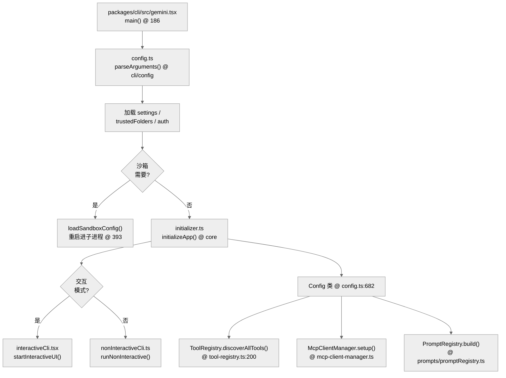

# 启动链路：从入口到运行模式的分发

Gemini CLI 的启动不仅仅是加载 UI，它包含了一个复杂的环境预热与权限校验链。

## 1. 启动全景图（含源码行号）

## 2. 核心函数清单 (Function List)

| 函数/方法 | 文件路径 | 行号 | 职责 |
|---|---|---|---|
| `main()` | `packages/cli/src/gemini.tsx` | :186 | 程序入口，参数解析，沙箱决策 |
| `parseArguments()` | `packages/cli/src/config/config.ts` | — | Yargs 子命令解析 |
| `loadSandboxConfig()` | `packages/cli/src/gemini.tsx` | :393 | 沙箱进程重新拉起 |
| `initializeApp()` | `packages/cli/src/initializer.ts` | — | 返回预热的 `Config` 实例 |
| `Config._initialize()` | `packages/core/src/config/config.ts` | :682 | 工具/MCP/技能/Auth 初始化 |
| `startInteractiveUI()` | `packages/cli/src/ui/AppContainer.tsx` | — | React + Ink TUI 挂载 |
| `runNonInteractive()` | `packages/cli/src/nonInteractiveCli.ts` | — | Headless stdin/stdout 模式 |
| `trustedFolders.validate()` | `packages/cli/src/config/trustedFolders.ts` | — | 工作区信任校验 |

## 3. 核心初始化顺序

### 3.1 参数解析 (Yargs)
系统在 `packages/cli/src/config/config.ts` 中使用 `yargs` 定义了丰富的子命令和运行标志。解析后的 `argv` 决定了：
- 运行模式（交互 vs. 非交互）
- 认证方式
- 是否启用特定的扩展或 MCP 服务

### 3.2 宿主环境预热
在进入业务逻辑前，`main()` 会执行关键的系统级操作：
- **清理与隔离**：清理过期的 tool output 和 checkpoint 文件。
- **权限拉齐**：校验 `trustedFolders`，判断当前工作区是否受信任。
- **沙箱重启**（`gemini-cli/packages/cli/src/gemini.tsx:186,393`）：如果配置要求沙箱且当前不在沙箱内，程序会通过 `loadSandboxConfig` 重新拉起自身进入受限环境。

### 3.3 运行时核心初始化
通过 `initializer.ts` 的 `initializeApp()` 返回一个已预热的 `Config` 实例。此过程会依次完成：
- `Config._initialize()` (工具库、MCP、技能挂载)
- 刷新 Auth 状态
- IDE 连接状态同步

## 4. 运行模式分发

Gemini CLI 支持两种主要的运行模式，它们共享相同的 `packages/core` 核心，但外壳协议不同：

### 4.1 交互模式 (Interactive TUI)
调用 `startInteractiveUI()`。它会初始化 React + Ink 容器 `AppContainer`，将整个 TUI 挂载到终端。此模式下，状态管理由 React Context 和 `UIStateContext` 驱动。

### 4.2 非交互模式 (Non-Interactive Headless)
调用 `runNonInteractive()`（`gemini-cli/packages/cli/src/nonInteractiveCli.ts`）。
- **同步 IO**：从 stdin 读取输入，并将其折叠成一次 Agent Loop 执行。
- **线性输出**：适合流水线集成，支持以 JSON 格式输出结果。

## 5. 代码质量评估 (Code Quality Assessment)

### 5.1 优点
- **沙箱策略前置**：沙箱决策在 `main()` 早期完成，避免核心逻辑在非沙箱环境下泄露。
- **初始化分层**：`initializeApp()` 返回 `Config` 后 TUI/Headless 才 fork，职责清晰。

### 5.2 改进点
- **`main()` 方法过长**：363-418 行的单一方法混合了日志初始化、参数解析、沙箱检测、模式分发等多重逻辑，建议拆分为 `bootstrap()` → `resolveSandbox()` → `dispatchMode()` 三个方法。
- **沙箱检测与重启耦合**：检测到需要沙箱时直接在 `main()` 中调用 `loadSandboxConfig` 重新拉起自身，这种"自我替换"模式难以测试，建议提取为独立进程管理器。
- **Headless 模式缺少会话恢复路径**：`runNonInteractive()` 不支持 `--resume`，长流程任务无法断点续跑。

### 5.3 章节导航 (Chapter Breakdown)

| 子章节 | 核心议题 |
|---|---|
| §1 启动全景图 | main() → initializeApp() → TUI/Headless 全流程 |
| §2 核心函数清单 | 关键函数的源码定位 |
| §3 初始化顺序 | Config._initialize() 的 3 阶段初始化链 |
| §4 模式分发 | 交互 vs. 非交互的协议差异 |
| §5 代码质量 | main() 臃肿、沙箱自重启难测试、Headless 缺 resume |

---

> 关联阅读：[03-agent-loop.md](./03-agent-loop.md) 深入了解模式分发后的执行主循环。
