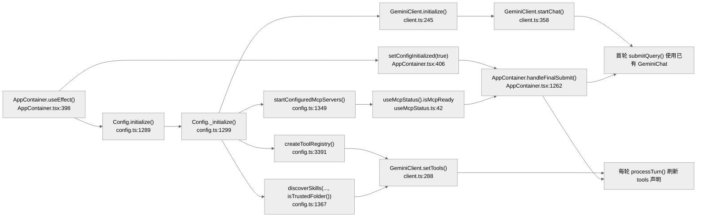
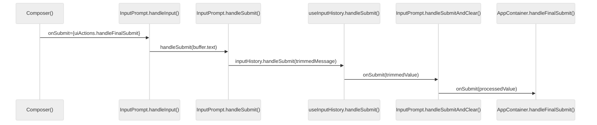
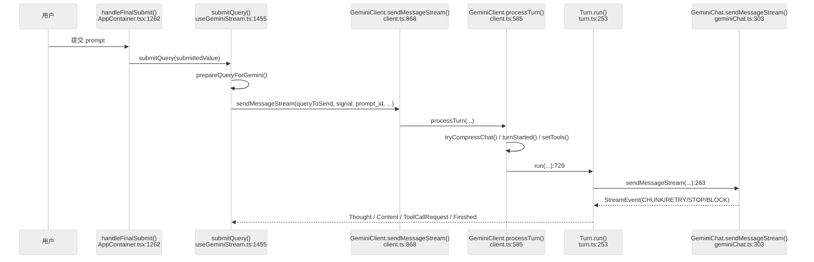
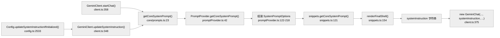
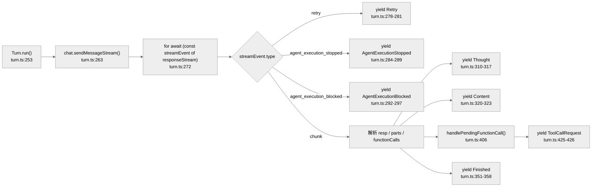
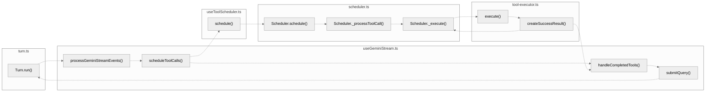
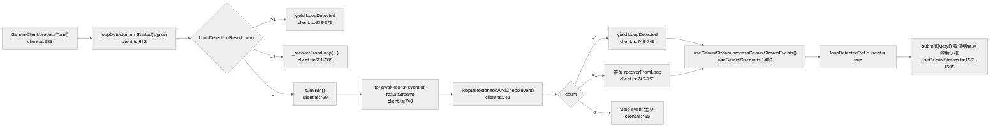

# 核心执行循环：Agent 决策链与 LLM 调用

Gemini CLI 的 agent loop 不是一个单独的 `while` 循环，而是由 **`AppContainer.handleFinalSubmit()` -> `useGeminiStream.submitQuery()` -> `GeminiClient.sendMessageStream()` -> `GeminiClient.processTurn()` -> `Turn.run()` -> `Scheduler.schedule()` -> `useGeminiStream.handleCompletedTools()` -> `useGeminiStream.submitQuery()`** 串成的闭环。

最关键的实现事实有两点：

- **`Turn.run()` 只负责把模型流拆成事件，不执行工具。**
- **工具执行完成后，真正把 `functionResponse` 回注给模型的地方在 `useGeminiStream.handleCompletedTools()`，而不是 `Turn` 或 `Scheduler`。**

本文中的行号默认指**符号定义位置**；如果引用的是函数体里的某个跳转点，会显式写成“调用点”。

---

## 启动前提：请求链不是从零开始

到用户第一次触发 `AppContainer.handleFinalSubmit()` 时，Gemini CLI 已经在启动阶段准备好了三类“地基”：

- **入口门禁**：Config 是否初始化完成，MCP 是否 ready，决定请求是立刻放行还是先排队。
- **会话外壳**：`GeminiClient.initialize()` 已经创建好 `GeminiChat`，首轮请求不是临时拼装裸调用。
- **能力边界**：ToolRegistry、skills、trust、approval mode、sandbox 等约束已经确定，后续请求只能在这些边界内运行。

### 启动产物如何流入请求链

### 启动阶段对请求流程的 4 个直接影响

| 启动产物 | 关键方法 | 代码位置 | 对请求流程的直接影响 |
|---|---|---|---|
| Config ready 标志 | `AppContainer.useEffect()` | `packages/cli/src/ui/AppContainer.tsx:398-427` | `handleFinalSubmit()` 在 `isConfigInitialized === false` 时不会放行普通 prompt |
| MCP ready 标志 | `useMcpStatus()` | `packages/cli/src/ui/hooks/useMcpStatus.ts:15-50` | 普通 prompt 会等到 MCP discovery 完成后才进入 agent loop |
| 首轮会话壳 | `GeminiClient.initialize()` -> `GeminiClient.startChat()` | `packages/core/src/core/client.ts:245-248`, `358-388` | 第一轮 `submitQuery()` 直接复用已创建的 `GeminiChat` 和 `systemInstruction` |
| 工具/技能/权限边界 | `createToolRegistry()`、`discoverSkills()`、`isTrustedFolder()` | `packages/core/src/config/config.ts:3391`, `1367-1379`, `2742-2749` | 后续 `setTools()`、`Scheduler._processToolCall()` 都只能在启动时确定的能力面和权限面里运行 |

---

## 0. UI 提交如何抵达 `AppContainer.handleFinalSubmit()`

从 UI 角度看，`AppContainer.handleFinalSubmit()` 不是最早入口。它位于输入组件树的末端，前面至少还有 `Composer`、`InputPrompt`、`useInputHistory()` 或 `useVim()`。

对应的代码跳转是：

1. `AppContainer` 构造 `uiActions.handleFinalSubmit`  
   文件：`packages/cli/src/ui/AppContainer.tsx:2446-2490`  
   调用点：`2471` 把 `handleFinalSubmit` 放进 `uiActions`；`2610-2625` 通过 `UIActionsContext.Provider` 向下提供。
2. `Composer()`  
   文件：`packages/cli/src/ui/components/Composer.tsx:558-576`  
   调用点：`563` 把 `uiActions.handleFinalSubmit` 作为 `onSubmit` 传给 `InputPrompt`。
3. `InputPrompt.handleInput()`  
   文件：`packages/cli/src/ui/components/InputPrompt.tsx:621-1295`  
   调用点：`1161-1183` 捕获 `Command.SUBMIT`，执行 `handleSubmit(buffer.text)`。
4. `InputPrompt.handleSubmit()`  
   文件：`packages/cli/src/ui/components/InputPrompt.tsx:403-430`  
   调用点：`419` 或 `429` 调 `inputHistory.handleSubmit(trimmedMessage)`。
5. `useInputHistory.handleSubmit()`  
   文件：`packages/cli/src/ui/hooks/useInputHistory.ts:25-60`  
   调用点：`55` 调上层传入的 `onSubmit(trimmedValue)`。
6. `InputPrompt.handleSubmitAndClear()`  
   文件：`packages/cli/src/ui/components/InputPrompt.tsx:353-381`  
   调用点：`369` 调 `onSubmit(processedValue)`。
7. `AppContainer.handleFinalSubmit()`  
   文件：`packages/cli/src/ui/AppContainer.tsx:1262-1333`

压缩成一条方法链就是：

`Composer()` -> `InputPrompt.handleInput()` -> `InputPrompt.handleSubmit()` -> `useInputHistory.handleSubmit()` -> `InputPrompt.handleSubmitAndClear()` -> `AppContainer.handleFinalSubmit()`

---

## 1. 主调用链：从用户输入到首轮模型输出

### 1.1 入口链路

用户在 TUI 中提交文本后，首轮调用链是：

1. `AppContainer.handleFinalSubmit()`  
   文件：`packages/cli/src/ui/AppContainer.tsx:1262-1333`  
   调用点：`1312`、`1319` 调用 `submitQuery(submittedValue)`。
2. `useGeminiStream.submitQuery()`  
   文件：`packages/cli/src/ui/hooks/useGeminiStream.ts:1455-1651`  
   调用点：`1502-1507` 调 `prepareQueryForGemini()`；`1538-1547` 调 `geminiClient.sendMessageStream(...)`。
3. `GeminiClient.sendMessageStream()`  
   文件：`packages/core/src/core/client.ts:868-940`  
   调用点：`925-933` `yield* this.processTurn(...)`。
4. `GeminiClient.processTurn()`  
   文件：`packages/core/src/core/client.ts:585-865`  
   调用点：`726-727` 调 `setTools()`；`729-734` 调 `turn.run(...)`。
5. `Turn.run()`  
   文件：`packages/core/src/core/turn.ts:253-404`  
   调用点：`263-270` 调 `this.chat.sendMessageStream(...)`。
6. `GeminiChat.sendMessageStream()`  
   文件：`packages/core/src/core/geminiChat.ts:303-492`  
   调用点：`372-378` 调 `makeApiCallAndProcessStream(...)`。

### 1.2 顺序图

### 1.3 每一跳具体做什么

| 调用链 | 符号定义 | 关键调用点 | 职责 |
|---|---|---|---|
| `AppContainer.handleFinalSubmit() -> submitQuery()` | `AppContainer.tsx:1262-1333` | `1312, 1319` | TUI 输入总入口；处理 slash command、hint、权限确认，再决定是否提交给 agent |
| `useGeminiStream.submitQuery() -> prepareQueryForGemini()` | `useGeminiStream.ts:1455-1651` | `1502-1507` | 预处理用户输入、上下文文件、slash command 产物 |
| `useGeminiStream.submitQuery() -> geminiClient.sendMessageStream()` | `useGeminiStream.ts:1455-1651` | `1538-1547` | 启动一次新的流式交互 |
| `GeminiClient.sendMessageStream() -> GeminiClient.processTurn()` | `client.ts:868-940` | `925-933` | reset turn 状态、运行 agent hook，再进入 turn 级处理 |
| `GeminiClient.processTurn() -> Turn.run()` | `client.ts:585-865` | `726-734` | 完成上下文压缩、token 检查、模型路由、工具声明刷新，然后发起本轮推理 |
| `Turn.run() -> GeminiChat.sendMessageStream()` | `turn.ts:253-404` | `263-270` | 进入底层模型流封装层 |
| `GeminiChat.sendMessageStream() -> GeminiChat.makeApiCallAndProcessStream()` | `geminiChat.ts:303-492` | `372-378` | 真正发出 API 调用并消费流式响应 |

---

## 2. Prompt 构建链：系统提示词是在哪里接入的

Prompt 的真实调用链不是“`PromptProvider` 直接喂给模型”，而是：

1. `GeminiClient.startChat()`  
   文件：`packages/core/src/core/client.ts:358-388`  
   调用点：`373-375` 调 `getCoreSystemPrompt(this.config, systemMemory)`，然后把结果作为 `systemInstruction` 传入 `new GeminiChat(...)`。
2. `getCoreSystemPrompt()`  
   文件：`packages/core/src/core/prompts.ts:23-32`  
   调用点：`28-32` 委托给 `new PromptProvider().getCoreSystemPrompt(...)`。
3. `PromptProvider.getCoreSystemPrompt()`  
   文件：`packages/core/src/prompts/promptProvider.ts:42-245`  
   调用点：`122-218` 组装 `SystemPromptOptions`；`221-224` 调 `activeSnippets.getCoreSystemPrompt(options)`；`228-232` 调 `renderFinalShell(...)`。
4. `snippets.getCoreSystemPrompt()`  
   文件：`packages/core/src/prompts/snippets.ts:121-148`  
   职责：把 `renderPreamble()`、`renderCoreMandates()`、`renderPrimaryWorkflows()` 等片段拼成最终系统提示词主体。
5. `GeminiClient.updateSystemInstruction()`  
   文件：`packages/core/src/core/client.ts:348-356`  
   调用点：`353-355` 重新生成 prompt，并通过 `this.getChat().setSystemInstruction(systemInstruction)` 热更新。

### 2.1 一个容易混淆的点

`PromptProvider.getCoreSystemPrompt()` 负责**生成文本**，但 prompt 真正进入会话的是：

- `GeminiClient.startChat()`
- `GeminiClient.updateSystemInstruction()`

也就是说，`PromptProvider` 是构造器，`GeminiClient` 才是注入点。

---

## 3. 模型流拆解链：`Turn.run()` 如何把底层流变成高层事件

`Turn` 的职责不是循环调工具，而是把 `GeminiChat` 返回的流式块转成 UI 和调度层可消费的高层事件。

### 3.1 事件转换链

1. `Turn.run()`  
   文件：`packages/core/src/core/turn.ts:253-404`  
   调用点：`263-270` 先拿到 `responseStream = await this.chat.sendMessageStream(...)`。
2. `Turn.run()`  
   调用点：`272-360` 对流执行 `for await` 遍历。
3. `Turn.run()`  
   调用点：`310-317` 发现 `part.thought` 时，调用 `parseThought()` 并 `yield { type: Thought }`。
4. `Turn.run()`  
   调用点：`320-323` 调 `getResponseText(resp)`，有文本时 `yield { type: Content }`。
5. `Turn.run()`  
   调用点：`325-331` 遍历 `resp.functionCalls`，逐个调用 `this.handlePendingFunctionCall(fnCall, traceId)`。
6. `Turn.handlePendingFunctionCall()`  
   文件：`packages/core/src/core/turn.ts:406-427`  
   职责：把 Gemini 的 `FunctionCall` 转成 `ToolCallRequestInfo`，写入 `this.pendingToolCalls`，并返回 `ToolCallRequest` 事件。
7. `Turn.run()`  
   调用点：`342-358` 当 `finishReason` 出现时，`yield { type: Finished }`。

### 3.2 `Turn.run()` 不做什么

- 不调用 `Scheduler.schedule()`
- 不构造 `functionResponse`
- 不负责 loop detection

这些职责分别落在：

- 工具调度：`useToolScheduler.schedule()` / `Scheduler.schedule()`
- 工具回注：`useGeminiStream.handleCompletedTools()`
- 循环检测：`GeminiClient.processTurn()` / `LoopDetectionService.addAndCheck()`

---

## 4. agent loop

Gemini CLI 的核心闭环

**关键路径说明：**

- **主路径**：`Turn.run()` → `processGeminiStreamEvents()` → `scheduleToolCalls()` → **调度链** → `handleCompletedTools()` → `submitQuery()` → `Turn.run()`（闭环）
- **调度链**：`scheduleToolCalls()` → `useToolScheduler.schedule()` → `Scheduler.schedule()` → `Scheduler._processToolCall()` → `Scheduler._execute()` → `ToolExecutor.execute()` → `ToolExecutor.createSuccessResult()`
- **返回路径**：`createSuccessResult()` → `Scheduler._execute()` → `Scheduler.schedule()` → `useToolScheduler.schedule()` 的 `await scheduler.schedule()` → `onCompleteRef.current(results)` 回调 → `handleCompletedTools()` → `submitQuery()` → `Turn.run()`

**汇合点**：`createSuccessResult()` 输出 `functionResponse` 沿返回路径逐层上传，最终由 `useToolScheduler.schedule()` 中的 `onCompleteRef.current(results)` 回调触发 `handleCompletedTools()`，形成调度链到 UI hook 的汇合。

| 文件 | 核心函数 | 职责 |
|------|---------|------|
| `turn.ts` | `Turn.run()` | 产出 ToolCallRequest 事件 |
| `useGeminiStream.ts` | `processGeminiStreamEvents()` | 收集 toolCallRequests |
| `useGeminiStream.ts` | `scheduleToolCalls()` | 发起调度请求 |
| `useToolScheduler.ts` | `schedule()` | 封装 scheduler 调用 |
| `scheduler.ts` | `schedule()` → `_processToolCall()` → `_execute()` | 工具调度、安全闸门、执行入口 |
| `tool-executor.ts` | `execute()` → `createSuccessResult()` | 执行工具并转 functionResponse |
| `useGeminiStream.ts` | `handleCompletedTools()` | 接收结果，回注模型 |
| `useGeminiStream.ts` | `submitQuery(..., isContinuation: true)` | 重入 agent loop |

### 4.1 `ToolCallRequest` 如何离开模型层

1. `Turn.run()`  
   文件：`packages/core/src/core/turn.ts:253-404`  
   调用点：`325-331` 产出 `ToolCallRequest` 事件。
2. `useGeminiStream.processGeminiStreamEvents()`  
   文件：`packages/cli/src/ui/hooks/useGeminiStream.ts:1330-1453`  
   调用点：`1359-1361` 把 `ToolCallRequest` 存入本地 `toolCallRequests` 数组。
3. `useGeminiStream.processGeminiStreamEvents()`  
   调用点：`1425-1431` 在本轮模型流结束后统一 `await scheduleToolCalls(toolCallRequests, signal)`。

这说明 Gemini CLI 当前的时序是：**先把这一轮流收完，再批量调度工具**。

### 4.2 `scheduleToolCalls()` 之后的 core 调度链

1. `useToolScheduler.schedule()`  
   文件：`packages/cli/src/ui/hooks/useToolScheduler.ts:176-190`  
   调用点：`182` 调 `scheduler.schedule(request, signal)`；`187` 调 `onCompleteRef.current(results)`。
2. `Scheduler.schedule()`  
   文件：`packages/core/src/scheduler/scheduler.ts:191-217`  
   职责：决定是直接 `_startBatch()` 还是进入 `_enqueueRequest()`。
3. `Scheduler._startBatch()`  
   文件：`packages/core/src/scheduler/scheduler.ts:296-339`  
   调用点：`325-329` 调 `_validateAndCreateToolCall(...)`；`333` 调 `_processQueue(signal)`。
4. `Scheduler._processQueue()`  
   文件：`packages/core/src/scheduler/scheduler.ts:405-410`  
   调用点：循环调用 `_processNextItem(signal)`。
5. `Scheduler._processNextItem()`  
   文件：`packages/core/src/scheduler/scheduler.ts:416-527`  
   调用点：`463-465` 并发处理 `validating`；`483-485` 并发执行 `_execute(...)`。

### 4.3 安全与审批是怎样插进去的

前置闸门都在 `Scheduler._processToolCall()`：

1. `Scheduler._processToolCall()`  
   文件：`packages/core/src/scheduler/scheduler.ts:573-684`  
   调用点：`580-585` 调 `evaluateBeforeToolHook(...)`。
2. `Scheduler._processToolCall()`  
   调用点：`610-614` 调 `checkPolicy(...)`。
3. `Scheduler._processToolCall()`  
   调用点：`643-653` 需要用户批准时调 `resolveConfirmation(...)`。
4. `Scheduler._processToolCall()`  
   调用点：`683` 只有通过上述检查后，状态才进入 `Scheduled`。

### 4.4 真正执行工具的是谁

1. `Scheduler._execute()`  
   文件：`packages/core/src/scheduler/scheduler.ts:691-860`  
   调用点：`717-734` 调 `this.executor.execute(...)`。
2. `ToolExecutor.execute()`  
   文件：`packages/core/src/scheduler/tool-executor.ts:59-193`  
   调用点：`110-120` 调 `executeToolWithHooks(...)` 执行实际工具。
3. `ToolExecutor.createSuccessResult()`  
   文件：`packages/core/src/scheduler/tool-executor.ts:356-403`  
   调用点：`366-372` 调 `convertToFunctionResponse(...)`，把工具结果转成 Gemini 兼容的 `functionResponse` parts。

### 4.5 工具结果是如何回注给模型的

回注链发生在 UI hook 层，而不是 core 层：

1. `useToolScheduler()` 的 `onComplete` 回调  
   文件：`packages/cli/src/ui/hooks/useGeminiStream.ts:293-342`  
   调用点：`337-340` 调 `handleCompletedTools(completedToolCallsFromScheduler)`。
2. `useGeminiStream.handleCompletedTools()`  
   文件：`packages/cli/src/ui/hooks/useGeminiStream.ts:1724-1938`  
   调用点：`1886-1888` 把 `toolCall.response.responseParts` 展平成 `responsesToSend`。
3. `useGeminiStream.handleCompletedTools()`  
   调用点：`1915-1922` 执行 `submitQuery(responsesToSend, { isContinuation: true }, prompt_ids[0])`。

这一步才是闭环真正完成的地方。**Gemini CLI 的 agent loop 是通过 `useGeminiStream.submitQuery()` 的递归重入形成的。**

简化为四句话记住整个 loop：

- **模型出请求**：`Turn.run()` 解析模型流，产出 `ToolCallRequest`
- **UI 发调度**：`useGeminiStream.scheduleToolCalls()` 批量发起调度
- **Scheduler 执行**：安全闸门（hook / policy / approval）→ `ToolExecutor.execute()` → `createSuccessResult()`
- **UI 回注续跑**：`onComplete` 回调 → `handleCompletedTools()` → `submitQuery(..., isContinuation: true)`

**架构启示**：如果误认为 `GeminiClient` 内部自己循环调用模型和工具，会漏掉两个关键设计事实——工具执行后**重入控制权在 UI hook 层**（`useGeminiStream`），这让 UI 得以插入历史项 / hint / quota / memory refresh 等逻辑；而 `Scheduler.schedule()` 只负责跑完工具并返回 `CompletedToolCall[]`，它**不主动继续下一轮推理**。

### 4.6 代码质量评估

**优点**：

- **职责切分清楚**：`Turn.run()` 做事件拆解，`Scheduler` 做工具状态机，`useGeminiStream` 做 UI 与续跑编排。
- **工具闭环可插拔**：`useGeminiStream.handleCompletedTools()` 集中处理回注逻辑，便于插入 quota、memory、background shell 等分支。
- **安全闸门位置明确**：`Scheduler._processToolCall()` 集中承载 before-tool hook、policy、confirmation。

**风险**：

- **闭环跨层较深**：一次完整循环要跨 `cli/hooks`、`core/client`、`core/turn`、`core/scheduler` 多层，阅读成本高。
- **工具回注不在 core**：如果将来要把同一套 loop 复用到别的宿主，`useGeminiStream.handleCompletedTools()` 这段重入逻辑需要单独搬运。
- **工具调度晚于流消费**：`useGeminiStream.processGeminiStreamEvents()` 直到流结束才调 `scheduleToolCalls()`，因此"边流式输出边立刻开工具"的时序不够直接。

---

## 5. 循环检测链：不在 `Turn`，而在 `GeminiClient`

循环检测的主插桩点是 `GeminiClient.processTurn()`，不是 `Turn.run()`。

### 5.1 turn 开始前的检测

1. `GeminiClient.processTurn()`  
   文件：`packages/core/src/core/client.ts:585-865`  
   调用点：`672` 调 `this.loopDetector.turnStarted(signal)`。
2. `LoopDetectionService.turnStarted()`  
   文件：`packages/core/src/services/loopDetectionService.ts:261-312`  
   职责：维护 turn 计数，并在满足阈值时触发基于 LLM 的 loop 分析。

### 5.2 流处理中逐事件检测

1. `GeminiClient.processTurn()`  
   调用点：`740-755` 对 `resultStream` 的每个 event 调 `this.loopDetector.addAndCheck(event)`。
2. `LoopDetectionService.addAndCheck()`  
   文件：`packages/core/src/services/loopDetectionService.ts:186-249`  
   职责：只对两类事件做检测：
   - `GeminiEventType.ToolCallRequest`
   - `GeminiEventType.Content`

### 5.3 UI 如何响应 `LoopDetected`

1. `useGeminiStream.processGeminiStreamEvents()`  
   文件：`packages/cli/src/ui/hooks/useGeminiStream.ts:1330-1453`  
   调用点：`1409-1413` 收到 `LoopDetected` 时只打 `loopDetectedRef.current = true` 标记。
2. `useGeminiStream.submitQuery()`  
   文件：`packages/cli/src/ui/hooks/useGeminiStream.ts:1455-1651`  
   调用点：`1561-1595` 收流结束后弹出 confirmation，并根据用户选择决定是否重试。
3. `LoopDetectionService.disableForSession()`  
   文件：`packages/core/src/services/loopDetectionService.ts:167-173`  
   职责：关闭会话级 loop detection。

### 5.4 一个容易误判的点

`Turn.callCounter`  
文件：`packages/core/src/core/turn.ts:239`  
职责：只是在 `Turn.handlePendingFunctionCall()` 中为缺失 id 的 function call 生成 fallback `callId`。  
**它不负责任何 loop detection。**

---

> 关联阅读：[04-tool-system.md](./04-tool-system.md) 可以继续看工具注册、权限策略与执行器实现。

----

## Agent Loop 架构对比：opencode vs gemini-cli vs claude-code

| 维度 | opencode | gemini-cli | claude-code |
|------|----------|------------|-------------|
| **核心理念** | “AI SDK 优先” - 使用统一的 AI SDK 作为底层适配层 | “Gemini 事件流优先” - 内部定义稳定的事件流抽象层 | “Anthropic/query loop 优先” - 自建完整的状态机和工具上下文 |
| **LLM 调用封装** | 直接使用 AI SDK 的 `streamText()` 方法，通过 `opencode/packages/opencode/src/session/llm.ts` 统一调用 | 自建 `GeminiChat.sendMessageStream()` 和 `makeApiCallAndProcessStream()`，事件流在 `Turn.run()` 中拆解 | 自建 `StreamingToolExecutor` 和 `runTools()`，通过 `services/api/claude.ts` 直接调用 Anthropic API |
| **工具调用抽象** | 使用 AI SDK 的 `dynamicTool()` 和 `ToolSet`，在 `opencode/packages/opencode/src/provider/provider.ts` 注册各种 provider | 自建 `ToolCallRequest` 事件和 `ToolExecutor`，在 `gemini-cli/packages/core/src/scheduler/` 实现工具调度 | 自建 `ToolUseContext` 和 `StreamingToolExecutor`，在 `src/query.ts` 和 `src/services/api/claude.ts` 中处理 |
| **消息格式处理** | 使用 AI SDK 的 `ModelMessage` 和 `UIMessage`，通过 `MessageV2.toModelMessages()` 转换 | 自建 `GeminiEventType` 和 `ServerGeminiStreamEvent`，在 `Turn.run()` 中将模型流拆解为高层事件 | 自建消息类型和 `ToolUseContext`，在 `queryLoop()` 中维护工具使用状态 |
| **状态管理** | 依赖 AI SDK 的状态处理，内部保持相对简单的 session 循环 | 自建事件流状态机，在 `GeminiClient.processTurn()` 和 `LoopDetectionService` 中管理循环和状态 | 完全自建的多轮状态机，在 `queryLoop()` 中维护包括 `toolUseContext`, `autoCompactTracking` 等在内的多个字段 |
| **Provider 中立性** | 高 - 通过 AI SDK 实现 provider 中立的工具和消息格式 | 中 - 有内部抽象但主要针对 Gemini 模型优化 | 低 - 紧密耦合于 Anthropic 的 API 和工具格式 |
| **闭环实现** | 通过 AI SDK 的工具调用结果直接喂回模型流 | UI 层的 `useGeminiStream.handleCompletedTools()` 将工具结果回注并触发 `submitQuery()` 递归 | `queryLoop()` 中工具执行后直接更新消息并继续下一轮模型请求 |
