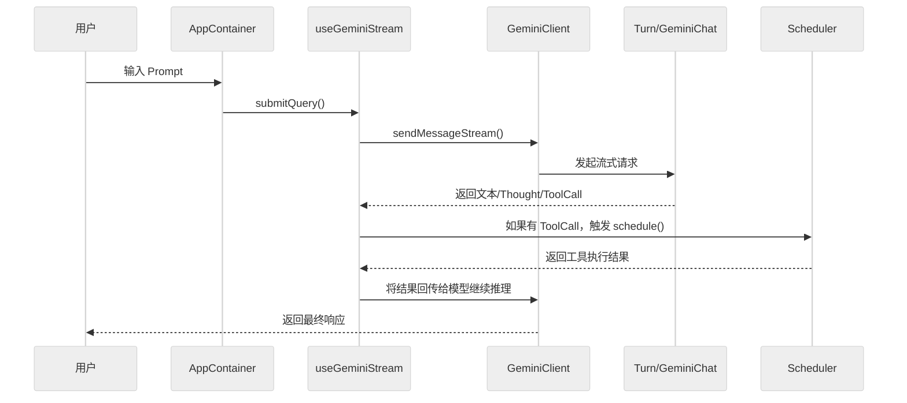

# 核心执行循环：Agent 决策链与 LLM 调用

Gemini CLI 的核心是一个由模型驱动的**自治执行循环**。它不仅仅是单次交互，而是能够根据模型反馈持续调用工具直到任务完成的过程。

## 1. Agent 循环序列图

整个循环跨越了 UI 宿主层、模型客户端层与工具调度层。



## 2. Agent 决策链的关键环节

### 2.1 Prompt 构建：PromptProvider
Prompt 不是硬编码的模板，而是由 `packages/core/src/prompts/promptProvider.ts` 动态生成的。
- **系统提示词 (Core System Prompt)**：汇总审批模式、可用工具列表、挂载的技能。
- **上下文感知**：自动包含当前工作区的 `GEMINI.md`、用户记忆 (User Memory) 和 tracker 状态。
- **行号与引用**：生成的提示词会指导模型如何引用代码片段及文件路径。

### 2.2 LLM 调用与流处理：GeminiChat
`packages/core/src/core/geminiChat.ts` 封装了底层的模型通信：
- **流式响应 (Streaming)**：通过 `sendMessageStream()` 将原始流拆分为文本、`thought` (思考过程) 和 `tool_call` 事件。
- **回合持久化 (Turn Recording)**：每轮对话及工具结果都会通过 `recordCompletedToolCalls()` 写回存储层。

### 2.3 消息编排：Turn
`packages/core/src/core/turn.ts` 是具体的“回合”控制器：
- **内容路由**：将模型输出的混合内容分发给 UI 渲染或工具调度。
- **循环检测**：检测模型是否在反复调用同一组工具而无进展，并在适当时机终止循环（防止无限消耗 Token）。

## 3. 工具执行与回注 (Feedback Loop)

循环的核心在于其**闭环特性**：
1. 模型输出 `ToolCallRequest`。
2. `useGeminiStream` (或 Headless 模式下的 `nonInteractiveCli`) 将请求提交给 `Scheduler`。
3. 工具执行完成后，结果被格式化为 `FunctionResponse`。
4. 模型收到执行结果，进行下一轮推理（决定是任务已完成返回最终文本，还是需要更多工具调用）。

## 4. 关键代码定位

- **循环控制核心**：`packages/core/src/core/turn.ts:253-447` (`Turn.run()` AsyncGenerator 事件流)
- **流式会话封装**：`packages/core/src/core/geminiChat.ts:299-430` (`sendMessageStream()` 含重试机制)
- **系统提示词生成**：`packages/core/src/prompts/promptProvider.ts` (`getCoreSystemPrompt()`)

## 5. 技术深度：AsyncGenerator 流式架构

### 5.1 Turn.run() 作为 AsyncGenerator
`Turn.run()` 不是普通 async 函数，而是一个 **AsyncGenerator**（`core/turn.ts:253`）。这意味着：

```typescript
async *run(modelConfigKey, req, signal, displayContent?, role?): AsyncGenerator<ServerGeminiStreamEvent>
```

每个 `yield` 都对应一个 UI 可订阅的事件（`Thought`、`Content`、`ToolCallRequest`、`Finished` 等）。这种设计使事件流可以被**部分消费**——UI 不必等整个回合结束就能逐步渲染。

### 5.2 sendMessageStream() 的 3 层包装
`geminiChat.ts:303` 的 `streamWithRetries` 实现了 3 层：
1. **外层重试循环**（`attempt < maxAttempts`）：429 降级时指数退避
2. **中层 API 调用**（`makeApiCallAndProcessStream`）：处理 SSE 流并 yield CHUNK
3. **内层事件转换**：将 `GenerateContentResponse` 拆解为 `Thought` / `Content` / `FunctionCall` 事件

### 5.3 循环检测机制
`turn.ts` 中 `callCounter` 跟踪同一回合内的工具调用次数。当检测到模型反复调用同一组工具时，触发 `LoopDetected` 事件，防止无限消耗 Token。

## 6. 代码质量评估 (Code Quality Assessment)

### 6.1 优点
- **AsyncGenerator 模式优雅**：事件流部分消费使 UI 可以逐步渲染，无需等完整响应。
- **重试逻辑透明**：429 降级在 `sendMessageStream` 内部自动处理，上层无需感知。
- **类型安全的事件联合**：`ServerGeminiStreamEvent` 联合类型覆盖所有 16 种事件，TypeScript 穷举检查。

### 6.2 改进点
- **`Turn.run()` 行数过多**：238+ 行，包含了事件解析、循环检测、finishReason 判断等多重逻辑，建议按事件类型拆分为 `handleFunctionCalls()`、`handleContent()` 等方法。
- **流式事件与 UI 状态绑定隐晦**：`useGeminiStream` hook 的实现分散在多个文件中，追踪"用户看到 Thought 的完整路径"较困难。
- **缺少背压机制**：当模型快速连续输出大量 `FunctionCall` 时，Scheduler 可能被瞬时淹没，建议在 `Turn.run()` 中增加批次控制。

---

> 关联阅读：[04-tool-system.md](./04-tool-system.md) 了解工具是如何被执行与授权的。
