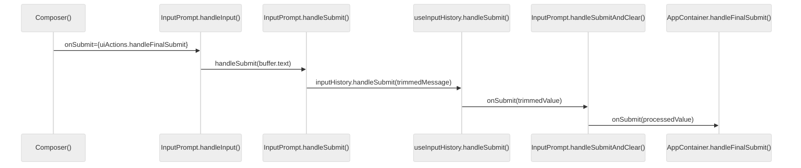
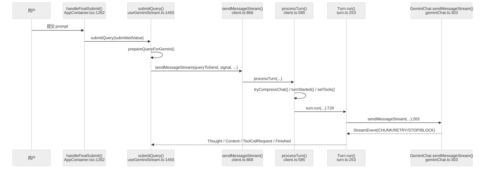
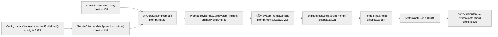
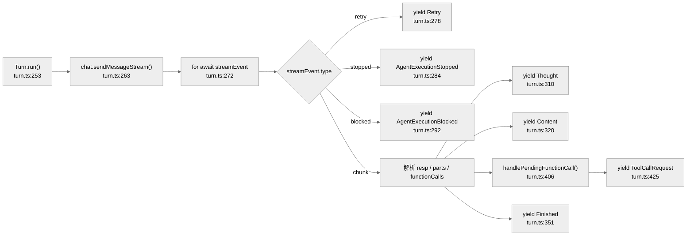
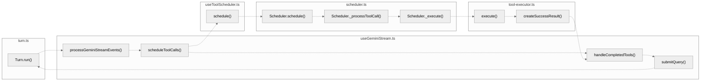
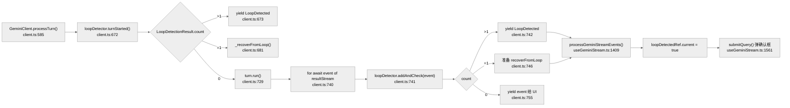

# 核心执行循环：Agent 决策链与 LLM 调用

> **关联文档**：[02-startup-flow.md](./02-startup-flow.md)（启动链路）、[04-tool-system.md](./04-tool-system.md)（工具注册与执行器）、[12-prompt-system.md](./12-prompt-system.md)（Prompt 构建详解）、[25-input-command-queue.md](./25-input-command-queue.md)（UI 输入链路）

---

**目录**

- [1. Agent Loop 总览](#1-agent-loop-总览)
- [2. 主调用链：从用户输入到首轮模型输出](#2-主调用链从用户输入到首轮模型输出)
- [3. Prompt 构建链](#3-prompt-构建链系统提示词是在哪里接入的)
- [4. 模型流拆解：Turn.run() 的事件转换](#4-模型流拆解turnrun-的事件转换)
- [5. 闭环核心：工具调度与结果回注](#5-闭环核心工具调度与结果回注)
- [6. 循环检测：LoopDetectionService](#6-循环检测loopdetectionservice)
- [7. 关键函数清单](#7-关键函数清单)
- [8. 代码质量评估](#8-代码质量评估)
- [9. Agent Loop 架构对比](#9-agent-loop-架构对比opencode-vs-gemini-cli-vs-claude-code)

---

## 1. Agent Loop 总览

Gemini CLI 的 agent loop 不是一个单独的 `while` 循环，而是由以下调用链串成的闭环：

```
AppContainer.handleFinalSubmit()
  → useGeminiStream.submitQuery()
    → GeminiClient.sendMessageStream()
      → GeminiClient.processTurn()
        → Turn.run()
  → Scheduler.schedule()
  → useGeminiStream.handleCompletedTools()
  → useGeminiStream.submitQuery()  ← 闭环重入
```

最关键的两个实现事实：

- **`Turn.run()` 只负责把模型流拆成事件，不执行工具。**
- **工具执行完成后，真正把 `functionResponse` 回注给模型的地方在 `useGeminiStream.handleCompletedTools()`，而不是 `Turn` 或 `Scheduler`。**

> 本文行号均指**符号定义位置**；引用函数体内的跳转点时会显式写"调用点"。

### 1.1 启动前提

到用户第一次触发 `handleFinalSubmit()` 时，启动阶段已经准备好三类"地基"（详情见 [02-startup-flow.md](./02-startup-flow.md)）。以下只列出对 agent loop 有直接影响的产物：

| 启动产物 | 关键方法 | 代码位置 | 对请求流程的影响 |
|---|---|---|---|
| Config ready 标志 | `AppContainer.useEffect()` | `AppContainer.tsx:398-427` | `handleFinalSubmit()` 在 `isConfigInitialized === false` 时不放行普通 prompt |
| MCP ready 标志 | `useMcpStatus()` | `useMcpStatus.ts:15-50` | 普通 prompt 等 MCP discovery 完成后才进入 loop |
| 首轮会话壳 | `GeminiClient.initialize()` → `startChat()` | `client.ts:245-248`, `358-388` | 首轮 `submitQuery()` 复用已创建的 `GeminiChat` |
| 工具/技能/权限边界 | `createToolRegistry()`、`discoverSkills()` | `config.ts:3257`, `1367-1379`, `2742-2749` | `setTools()` 和 `Scheduler._processToolCall()` 只能在启动确定的能力面内运行 |

---

## 2. 主调用链：从用户输入到首轮模型输出

### 2.1 UI 提交链（简述）

用户提交文本后，经过以下组件链才抵达 `handleFinalSubmit()`（详见 [25-input-command-queue.md](./25-input-command-queue.md)）：

```
Composer()
  → InputPrompt.handleInput()
    → InputPrompt.handleSubmit()
      → useInputHistory.handleSubmit()
        → InputPrompt.handleSubmitAndClear()
          → AppContainer.handleFinalSubmit()
```



### 2.2 主调用链顺序图



### 2.3 各跳职责说明

| 调用链 | 符号定义 | 关键调用点 | 职责 |
|---|---|---|---|
| `handleFinalSubmit() → submitQuery()` | `AppContainer.tsx:1262-1333` | `1312, 1319` | TUI 总入口；处理 slash command、hint、权限确认 |
| `submitQuery() → prepareQueryForGemini()` | `useGeminiStream.ts:1455-1651` | `1502-1507` | 预处理用户输入、上下文文件、slash command 产物 |
| `submitQuery() → sendMessageStream()` | `useGeminiStream.ts:1455-1651` | `1538-1547` | 启动一次新的流式交互 |
| `sendMessageStream() → processTurn()` | `client.ts:868-940` | `925-933` | reset turn 状态、运行 agent hook |
| `processTurn() → Turn.run()` | `client.ts:585-865` | `726-734` | 上下文压缩、token 检查、模型路由、工具声明刷新 |
| `Turn.run() → GeminiChat.sendMessageStream()` | `turn.ts:253-404` | `263-270` | 进入底层模型流封装层 |
| `GeminiChat → makeApiCallAndProcessStream()` | `geminiChat.ts:303-492` | `372-378` | 真正发出 API 调用并消费流式响应 |

---

## 3. Prompt 构建链：系统提示词是在哪里接入的

> Prompt 构建的完整细节见 [12-prompt-system.md](./12-prompt-system.md)，本节只梳理注入点。



**关键区分**：`PromptProvider.getCoreSystemPrompt()` 负责**生成文本**，`GeminiClient.startChat()` 和 `GeminiClient.updateSystemInstruction()` 才是**注入点**。`PromptProvider` 是构造器，`GeminiClient` 才是入口。

---

## 4. 模型流拆解：`Turn.run()` 的事件转换

`Turn` 的职责是把 `GeminiChat` 返回的流式块转成 UI 和调度层可消费的高层事件，**不执行工具，不构造 `functionResponse`**。



### 4.1 `Turn.run()` 不做什么

| 职责 | 实际承担者 |
|------|-----------|
| 调用 `Scheduler.schedule()` | `useToolScheduler.schedule()` |
| 构造 `functionResponse` | `useGeminiStream.handleCompletedTools()` |
| Loop detection | `GeminiClient.processTurn()` / `LoopDetectionService` |


---

## 5. 闭环核心：工具调度与结果回注

### 5.1 整体闭环图



**主路径**：`Turn.run()` → `processGeminiStreamEvents()` → `scheduleToolCalls()` → 调度链 → `handleCompletedTools()` → `submitQuery()` → `Turn.run()`（闭环）

**架构启示**：工具执行后**重入控制权在 UI hook 层**（`useGeminiStream`），这让 UI 得以插入历史项 / hint / quota / memory refresh 等逻辑；`Scheduler.schedule()` 只负责跑完工具并返回 `CompletedToolCall[]`，**不主动继续下一轮推理**。

### 5.2 `ToolCallRequest` 如何离开模型层

1. `Turn.run()` — `turn.ts:325-331`  
   产出 `ToolCallRequest` 事件。
2. `useGeminiStream.processGeminiStreamEvents()` — `useGeminiStream.ts:1330-1453`，调用点 `1359-1361`  
   把 `ToolCallRequest` 存入本地 `toolCallRequests` 数组。
3. `useGeminiStream.processGeminiStreamEvents()` — 调用点 `1425-1431`  
   本轮模型流**结束后**统一 `await scheduleToolCalls(toolCallRequests, signal)`。

> **时序关键**：Gemini CLI 先把整轮流收完，再批量调度工具，因此"边流式输出边立刻开工具"的时序不成立。

### 5.3 调度链：从 `scheduleToolCalls()` 到 `ToolExecutor`

1. `useToolScheduler.schedule()` — `useToolScheduler.ts:176-190`，调用点 `182`  
   调 `scheduler.schedule(request, signal)`；完成后调 `onCompleteRef.current(results)`。
2. `Scheduler.schedule()` — `scheduler.ts:191-217`  
   决定直接 `_startBatch()` 或进入 `_enqueueRequest()`。
3. `Scheduler._startBatch()` — `scheduler.ts:297-339`，调用点 `325-329` → `333`  
   验证工具调用，进入 `_processQueue(signal)`。
4. `Scheduler._processNextItem()` — `scheduler.ts:416-527`，调用点 `463-485`  
   并发处理 `validating` 和 `_execute(...)`。

### 5.4 安全闸门：`Scheduler._processToolCall()`

| 步骤 | 方法 | 调用点 |
|------|------|--------|
| before-tool hook | `evaluateBeforeToolHook(...)` | `scheduler.ts:580-585` |
| 策略检查 | `checkPolicy(...)` | `scheduler.ts:610-614` |
| 用户审批 | `resolveConfirmation(...)` | `scheduler.ts:643-653` |
| 进入 Scheduled 状态 | — | `scheduler.ts:683` |

### 5.5 工具执行：`Scheduler._execute()` → `ToolExecutor`

1. `Scheduler._execute()` — `scheduler.ts:691-860`，调用点 `717-734`  
   调 `this.executor.execute(...)`。
2. `ToolExecutor.execute()` — `tool-executor.ts:59-193`，调用点 `110-120`  
   调 `executeToolWithHooks(...)` 执行实际工具。
3. `ToolExecutor.createSuccessResult()` — `tool-executor.ts:357-403`，调用点 `366-372`  
   调 `convertToFunctionResponse(...)`，把工具结果转成 Gemini 兼容的 `functionResponse` parts。

### 5.6 工具结果回注给模型

回注链发生在 **UI hook 层**，而不是 core 层：

1. `useToolScheduler()` 的 `onComplete` 回调 — `useGeminiStream.ts:293-342`，调用点 `337-340`  
   调 `handleCompletedTools(completedToolCallsFromScheduler)`。
2. `useGeminiStream.handleCompletedTools()` — `useGeminiStream.ts:1724-1938`，调用点 `1886-1888`  
   把 `toolCall.response.responseParts` 展平成 `responsesToSend`。
3. `useGeminiStream.handleCompletedTools()` — 调用点 `1915-1922`  
   执行 `submitQuery(responsesToSend, { isContinuation: true }, prompt_ids[0])`。

**这一步才是闭环真正完成的地方。Gemini CLI 的 agent loop 是通过 `submitQuery()` 递归重入形成的。**

### 5.7 四句话记住整个 loop

- **模型出请求**：`Turn.run()` 解析模型流，产出 `ToolCallRequest`
- **UI 发调度**：`scheduleToolCalls()` 批量发起调度
- **Scheduler 执行**：安全闸门（hook / policy / approval）→ `ToolExecutor.execute()` → `createSuccessResult()`
- **UI 回注续跑**：`onComplete` 回调 → `handleCompletedTools()` → `submitQuery(..., isContinuation: true)`


---

## 6. 循环检测：LoopDetectionService

循环检测的主插桩点是 `GeminiClient.processTurn()`，不是 `Turn.run()`。



### 6.1 turn 开始前的检测

`GeminiClient.processTurn()` — `client.ts:672`  
调 `this.loopDetector.turnStarted(signal)`。

`LoopDetectionService.turnStarted()` — `loopDetectionService.ts:261-312`  
维护 turn 计数，在满足阈值时触发基于 LLM 的 loop 分析。

### 6.2 流处理中逐事件检测

`GeminiClient.processTurn()` — 调用点 `client.ts:740-755`  
对 `resultStream` 的每个 event 调 `this.loopDetector.addAndCheck(event)`。

`LoopDetectionService.addAndCheck()` — `loopDetectionService.ts:186-249`  
只对两类事件做检测：`GeminiEventType.ToolCallRequest` 和 `GeminiEventType.Content`。

### 6.3 UI 如何响应 `LoopDetected`

1. `processGeminiStreamEvents()` — `useGeminiStream.ts:1409-1413`  
   收到 `LoopDetected` 时只打 `loopDetectedRef.current = true` 标记。
2. `submitQuery()` — `useGeminiStream.ts:1561-1595`  
   收流结束后弹出 confirmation，根据用户选择决定是否重试。
3. `LoopDetectionService.disableForSession()` — `loopDetectionService.ts:167-173`  
   关闭会话级 loop detection。

### 6.4 容易误判的点

`Turn.callCounter`（`turn.ts:239`）只是为缺失 id 的 function call 生成 fallback `callId`，**不负责任何 loop detection**。


---

## 7. 关键函数清单

| 文件 | 函数 | 行号 | 职责 |
|------|------|------|------|
| `AppContainer.tsx` | `handleFinalSubmit()` | `1262-1333` | TUI 输入总入口，处理 slash command / 权限确认，决定是否提交给 agent |
| `useGeminiStream.ts` | `submitQuery()` | `1455-1651` | 预处理输入，启动流式交互，闭环重入点 |
| `useGeminiStream.ts` | `processGeminiStreamEvents()` | `1330-1453` | 消费 Turn 产出的事件流，收集 ToolCallRequest |
| `useGeminiStream.ts` | `scheduleToolCalls()` | （内联于上函数） | 批量发起工具调度 |
| `useGeminiStream.ts` | `handleCompletedTools()` | `1724-1938` | 接收工具结果，构造 `functionResponse`，触发 `submitQuery()` 重入 |
| `useToolScheduler.ts` | `schedule()` | `176-190` | 封装 core scheduler 调用，触发 `onComplete` 回调 |
| `client.ts` | `GeminiClient.sendMessageStream()` | `868-940` | 对外的流式请求入口，内部委托 `processTurn()` |
| `client.ts` | `GeminiClient.processTurn()` | `585-865` | 上下文压缩、模型路由、工具声明刷新、循环检测插桩 |
| `client.ts` | `GeminiClient.startChat()` | `358-388` | 创建 `GeminiChat`，注入 `systemInstruction` |
| `client.ts` | `GeminiClient.updateSystemInstruction()` | `348-356` | 热更新 system prompt |
| `turn.ts` | `Turn.run()` | `253-404` | 消费 `GeminiChat` 流，产出高层事件（Thought / Content / ToolCallRequest / Finished） |
| `turn.ts` | `Turn.handlePendingFunctionCall()` | `406-427` | 把 `FunctionCall` 转成 `ToolCallRequestInfo` |
| `geminiChat.ts` | `GeminiChat.sendMessageStream()` | `303-492` | 底层 API 调用封装，输出 `ServerGeminiStreamEvent` |
| `scheduler.ts` | `Scheduler.schedule()` | `191-217` | 调度入口，决定批处理或入队 |
| `scheduler.ts` | `Scheduler._processToolCall()` | `573-684` | 安全闸门（before-hook / policy / confirmation） |
| `scheduler.ts` | `Scheduler._execute()` | `691-860` | 调用 ToolExecutor，管理执行状态 |
| `tool-executor.ts` | `ToolExecutor.execute()` | `59-193` | 实际执行工具，含 hooks |
| `tool-executor.ts` | `ToolExecutor.createSuccessResult()` | `357-403` | 转换工具结果为 `functionResponse` |
| `config.ts` | `Config.initialize()` | `1289` | 初始化入口 |
| `config.ts` | `Config._initialize()` | `1299` | 实际初始化：创建 ToolRegistry、MCP、Skills |
| `config.ts` | `createToolRegistry()` | `3257` | 注册所有内置工具 |
| `config.ts` | `updateSystemInstructionIfInitialized()` | `2533` | 触发 system prompt 热更新 |
| `loopDetectionService.ts` | `LoopDetectionService.turnStarted()` | `261-312` | turn 级别的循环检测 |
| `loopDetectionService.ts` | `LoopDetectionService.addAndCheck()` | `186-249` | 逐事件循环检测 |
| `promptProvider.ts` | `PromptProvider.getCoreSystemPrompt()` | `42-245` | 动态组装 system prompt 文本 |

---

## 8. 代码质量评估

### 优点

- **职责切分清楚**：`Turn.run()` 做事件拆解，`Scheduler` 做工具状态机，`useGeminiStream` 做 UI 与续跑编排，三层界面明确。
- **工具闭环可插拔**：`handleCompletedTools()` 集中处理回注逻辑，便于插入 quota、memory、background shell 等分支。
- **安全闸门位置明确**：`Scheduler._processToolCall()` 集中承载 before-tool hook、policy、confirmation，不分散。
- **循环检测双保险**：turn 开始前 + 逐事件两道检测，降低无限循环风险。

### 风险与潜在改进点

- **闭环跨层较深**：一次完整循环要跨 `cli/hooks`、`core/client`、`core/turn`、`core/scheduler` 四层，阅读和调试成本高。
- **工具回注不在 core**：`handleCompletedTools()` 的重入逻辑位于 `cli` 层的 UI hook 中；若将来要把同一套 loop 复用到别的宿主（如无 TUI 的批处理模式），这段逻辑需要单独搬运。
- **工具调度晚于流消费**：`processGeminiStreamEvents()` 直到流结束才调 `scheduleToolCalls()`，无法实现"边流式输出边立刻开工具"的并发时序。
- **`createToolRegistry()` 行号漂移风险**：当前位于 `config.ts:3257`，但 `config.ts` 文件体量大（超 3500 行），后续改动容易使行号大幅偏移，建议拆文件。

---

## 9. Agent Loop 架构对比：opencode vs gemini-cli vs claude-code

三种工具的 agent loop 设计取向不同，下表横向对比关键维度：

| 维度 | opencode | gemini-cli | claude-code |
|------|----------|------------|-------------|
| **核心理念** | "AI SDK 优先"——使用统一的 AI SDK 作为底层适配层 | "Gemini 事件流优先"——内部定义稳定的事件流抽象层 | "Anthropic query loop 优先"——自建完整状态机和工具上下文 |
| **LLM 调用封装** | 直接使用 AI SDK 的 `streamText()`，通过 `session/llm.ts` 统一调用 | 自建 `GeminiChat.sendMessageStream()` 和 `makeApiCallAndProcessStream()`，事件流在 `Turn.run()` 中拆解 | 自建 `StreamingToolExecutor` 和 `runTools()`，通过 `services/api/claude.ts` 直接调用 Anthropic API |
| **工具调用抽象** | 使用 AI SDK 的 `dynamicTool()` 和 `ToolSet`，在 `provider/provider.ts` 注册 | 自建 `ToolCallRequest` 事件和 `ToolExecutor`，在 `core/scheduler/` 实现工具调度 | 自建 `ToolUseContext` 和 `StreamingToolExecutor`，在 `src/query.ts` 中处理 |
| **消息格式处理** | 使用 AI SDK 的 `ModelMessage` 和 `UIMessage`，通过 `MessageV2.toModelMessages()` 转换 | 自建 `GeminiEventType` 和 `ServerGeminiStreamEvent`，在 `Turn.run()` 中将模型流拆解为高层事件 | 自建消息类型和 `ToolUseContext`，在 `queryLoop()` 中维护工具使用状态 |
| **状态管理** | 依赖 AI SDK 的状态处理，session 循环相对简单 | 自建事件流状态机，在 `processTurn()` 和 `LoopDetectionService` 中管理 | 完全自建多轮状态机，在 `queryLoop()` 中维护 `toolUseContext`、`autoCompactTracking` 等多个字段 |
| **Provider 中立性** | 高——通过 AI SDK 实现 provider 中立 | 中——有内部抽象，但主要针对 Gemini 模型优化 | 低——紧密耦合于 Anthropic 的 API 和工具格式 |
| **闭环实现** | 工具调用结果直接通过 AI SDK 喂回模型流 | UI 层的 `handleCompletedTools()` 将工具结果回注并触发 `submitQuery()` 递归 | `queryLoop()` 中工具执行后直接更新消息并继续下一轮模型请求 |

---

> 关联阅读：[04-tool-system.md](./04-tool-system.md)（工具注册、权限策略与执行器实现）

